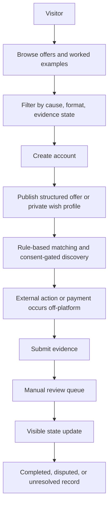
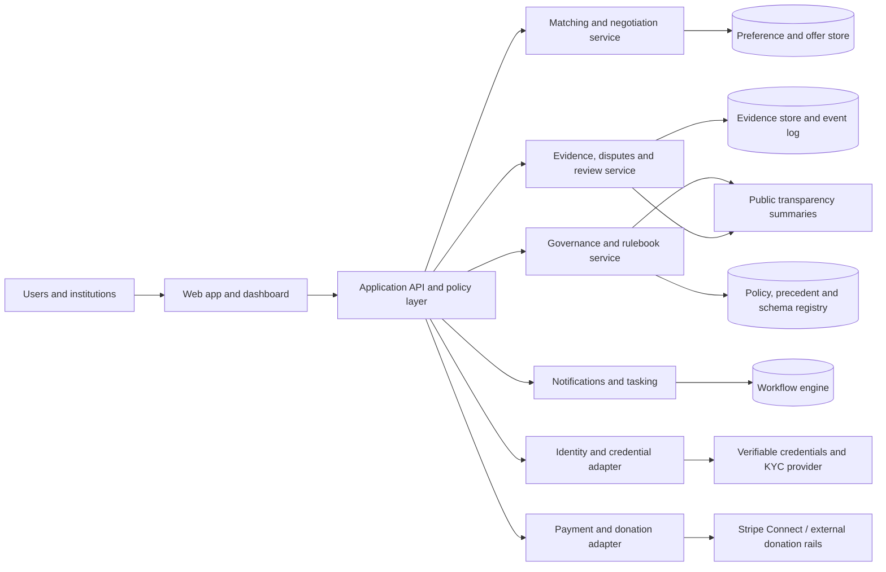
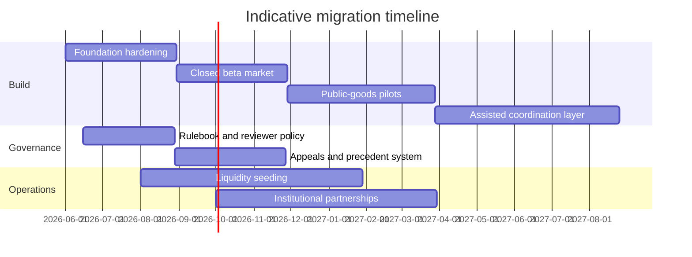

# Forethought and Ord Moral Trade Platform Assessment

## Executive summary

The current public **MoralTrade.org** is best understood as a **carefully constrained prototype**, not yet a functioning liquid marketplace. Its public interface explicitly separates live offers from examples, currently shows **0 live offers**, **8 worked examples**, **2 public profiles**, and **$0 reviewed offsets**, and centers on four narrow product wedges: **verified donation offsets**, **bounded pledge swaps**, a **public-goods fund**, and **consent-gated private matching**. It is also explicit that the platform is **manual-review-first**, **voluntary only**, **evidence-gated**, and **not an escrow, custody, legal, or tax service**. citeturn4view0turn6view6turn10view4turn10view1turn6view0

A platform built jointly from **Forethought’s coordination-tech and governance research** plus **Toby Ord’s moral-trade framework** would likely look **less like a simple listings board** and **more like a governed coordination stack**: a system for structured moral bargaining, confidential preference discovery, evidence-based completion, pluralist public-goods funding, and auditable dispute resolution under ethical disagreement. That conclusion is strongly supported by Ord’s original *Moral Trade* paper, which explicitly imagines markets that cancel out opposing donations, and by Forethought’s more recent work on **automated negotiation, confidential monitoring and verification, AI delegates, arbitration, background networking, charter tech, moral public goods, and early deals under uncertainty**. citeturn25view0turn25view1turn19view0turn20view0turn20view1turn20view4turn19view1turn19view3

The most important design conclusion is that a serious Forethought+Ord build should **not** begin with a fully open, on-chain, tokenized “moral market.” The near-term high-confidence path is an **off-chain, off-custody, policy-governed platform** with **external payment rails**, **selective-disclosure identity**, **append-only audit logs**, **human review and appeal**, and **limited AI assistance** used first for summarization, triage, and negotiation support rather than autonomous deal-making. That path is much more compatible with the current Moral Trade privacy boundary, Stripe-style platform payments and KYC tooling, NIST-style risk-tiered digital identity, W3C verifiable credentials, UNCITRAL fairness principles for online dispute resolution, PCI payment-data obligations, GDPR privacy-by-design, CCPA data rights, and U.S. money-transmission limits. citeturn10view0turn10view2turn32search1turn32search0turn32search13turn31search18turn31search1turn37search2turn44search9turn39search1turn39search2turn30search1turn30search6turn30search15

The right migration strategy is therefore **phased**. Phase one should preserve the current site’s strongest discipline—bounded terms, staged disclosure, and visible review states—while replacing today’s thin prototype flows with production-grade identity, evidence, queueing, and governance. Phase two should introduce **institutional market-making**, **cause-specific liquidity seeding**, **dominant-assurance public-goods mechanisms**, and **precedent-backed dispute handling**. Phase three can add carefully sandboxed **AI delegates**, **confidential verification**, and possibly **hybrid transparency anchoring**, but only after the platform has proven it can create real counterparties, real completion, and low abuse rates. citeturn29view0turn6view3turn6view0turn12view0turn34search9turn20view4

## Research basis and current MoralTrade baseline

Priority sources consulted first were **forethought.org, amirrorclear.net, moraltrade.org, and moraltrade.org**, exactly in the order supplied.

The public Moral Trade product today presents a coherent philosophy: **start narrow, keep terms explicit, avoid invented trust signals, and do not over-claim market maturity**. That philosophy is unusually strong. The homepage and browse pages state that the pilot intentionally prioritizes **verified donation offsets, moral public goods, bounded pledge swaps, and concierge-assisted private matching**, while **general paid action offers remain de-emphasized or deferred** until identity, dispute, and compliance workflows mature. The interface defaults to examples because the live market has no public offers yet, and it repeatedly warns users not to rely on fulfillment claims until evidence has been reviewed. citeturn4view0turn6view6turn7view4turn6view1

At the data-model level, the current site is already more structured than a normal community marketplace. Public methodology pages say each record can include **cause area, action, requested counterpart, expected impact, verification method, duration, payment cadence where relevant, and exit conditions**. Donation offsets additionally require **baseline intention, match ratio, compromise destination, surplus rule, evidence method, expiry, and anti-threat certification**. The visible validation ladder distinguishes **draft**, **submitted**, **needs evidence**, **challenge window**, and—by explicit mention—ultimately **completed, disputed, or unresolved** states. citeturn29view0turn10view4turn8view0turn6view2

The matching layer is currently **deterministic and rule-based**, not LLM-native. Moral Trade says it builds wish profiles from **user-entered fields, captured excerpts, manual source notes, and structured constraints**, and generates clarification prompts from missing fields rather than from an LLM interviewer. Match suggestions rely on **cause areas, payment or pledge compatibility, shared terms, and consent-gated previews**, not inference-heavy personalization. The privacy boundary is equally deliberate: the registry shows only **broad previews**, while **exact wishes, constraints, identity details, and contact data** remain behind staged consent and privacy grants. citeturn29view0turn6view3turn10view2turn10view0

The governance and trust surface are partial but revealing. Publicly, Moral Trade avoids **testimonials, ratings, press logos, and decorative trust badges** until records exist, and its safety page routes reports, blocked profiles, failed notifications, and payment-review requests to an **admin console** for operator inspection. Yet some pages also mention possible future social features such as comments, recommendations, ratings, and follower counts, and the public-goods module introduces a more elaborate governance concept with **published cycles**, **cause-specific arbiters**, **community-wide arbiters**, **reasoning**, **dissent notes**, and selection from the **top 10% of karma**. In practice, no public cycle has been published yet, so the governance mechanism is visible mainly as intent rather than as a proven operating process. citeturn8view0turn6view0turn10view0turn10view5

The payment story is intentionally conservative but not perfectly settled. The FAQ says public flows rely on **external-payment evidence**, not platform-held funds. Donation-offset and public-goods pages repeat **no custody / no escrow / no tax advice**, say integrated checkout is **planned, not active**, and require reviewed external evidence before counting contributions. At the same time, the terms say **Stripe may be used** to route payments between participants. The best interpretation is that the public live product is currently **off-custody**, while the legal copy leaves room for future provider-mediated payment flows. That distinction matters: it means the current site is still closer to a **review and coordination layer** than to a regulated marketplace operator. citeturn6view1turn10view4turn10view3turn12view0turn10view1

### Current feature inventory

| Dimension | Current public state | Assessment |
|---|---|---|
| UX | Browse/search, worked examples, create account, sign in, cause and format filters, consent-gated private matching | Clean, legible, intellectually serious, but low-liquidity and still educational rather than transactional |
| Data model | Structured offers with explicit action, reciprocal request, baselines, duration, evidence, exit rules; offset-specific fields; review states | Strong foundation for auditability and compliance |
| Matching | Rule-based, deterministic, staged disclosure, no autonomous outreach | Good for safety and explainability; weak for discovery at scale |
| Governance | Operator review; safety policy; early public-goods governance concepts with arbiters and published reasoning | Promising but incomplete and not yet battle-tested |
| Reputation | Minimal; evidence-bound badges; explicit avoidance of fake social proof | Excellent against theater; insufficient for scaling trust among many strangers |
| Payments | External payment evidence first; integrated checkout planned, not active; terms mention possible Stripe routing | Sensible MVP posture, but currently fragmented |
| Privacy | Broad previews only, field-level grants, private wish profiles, no broad feed scraping | Strong product instinct; needs formalized access control and retention rules |
| Legal / compliance | No escrow, custody, legal, tax, or evaluator claims; prohibited coercive/illegal/political-offset content | Safer than typical marketplaces, but real payments would materially change obligations |

Source basis for the table: the rows summarize the homepage, browse pages, methodology, donation-offset guide, public-goods pages, privacy, terms, FAQ, and safety pages. citeturn4view0turn29view0turn6view6turn10view4turn10view3turn10view5turn10view0turn10view1turn6view0turn6view1

### Current user flow

This flowchart reflects the site’s explicit sequence from structured terms to evidence review, together with its off-custody posture and manual-review emphasis. citeturn4view0turn29view0turn6view0turn10view3turn10view4

## Forethought and Ord profiles and strategic relevance

**Forethought** is a **small research nonprofit** focused on how to navigate the transition to a world with superintelligent AI systems. Public materials describe it as a nonprofit company with board oversight, a research team led by figures including **William MacAskill** and **Tom Davidson**, and an affiliated network that includes **Toby Ord**. Its current public offerings are primarily **research publications**, a **podcast**, a **newsletter**, and policy-facing research uptake rather than software products. Forethought also says it advises frontier AI companies, has influenced field agendas, and in its 2025 fundraiser laid out 2026 plans that expressly include **better futures research**, **moral diversity**, **moral public goods**, **deals with AIs**, and work with Toby Ord on **space governance**. citeturn16search7turn17view0turn17view4turn18search0

What matters for this project is not that Forethought already runs a marketplace. It does not. What matters is that Forethought has already produced a conceptual product roadmap for governance-grade coordination technology. In one design-sketch essay, it lays out six candidate technologies: **fast facilitation**, **automated negotiation**, **arbitrarily easy arbitration**, **background networking**, **structured transparency for democratic oversight**, and **confidential monitoring and verification**, plus two cross-cutting supports: **AI delegates** and **charter tech**. The essay explicitly imagines trusted neutral mediators, privacy-preserving evidence channels, standard clauses routing disputes to neutral adjudicators, and commercial incentives such as **exchange or brokerage fees** for discovering cooperation opportunities. citeturn20view2turn20view0turn20view4turn20view3

**Ord**, in public-facing terms, is mostly **Toby Ord’s research and institution-building footprint**, not a separate software company. Toby Ord’s public bio says he is a **Senior Researcher at Oxford University’s AI Governance Initiative**, previously at the Future of Humanity Institute, and a research affiliate at Forethought. His website and CV show a long record in moral philosophy, global priorities, and practical institution-building. Most relevant here, he authored the 2015 *Ethics* paper **“Moral Trade,”** co-founded **Giving What We Can**, and co-authored major work on **moral uncertainty**. citeturn24view0turn23view0turn25view2turn43search0

Ord’s original *Moral Trade* paper is directly on-point. It argues that people with different moral views can sometimes make each other better off **by their own lights** through exchange, and it explicitly discusses building markets that can **cancel out opposed donations**, including the Repledge.com example and the prospect of a site dedicated to canceling out donations to opposed causes while redirecting funds to compromise destinations. That paper is effectively the conceptual seed of the current Moral Trade prototype. citeturn25view0turn25view1turn1view1

Ord’s adjacent institution-building track record also matters. **Giving What We Can** is not a moral-trade marketplace, but it is a live proof that Ord’s worldview can translate into a durable, high-trust commitment infrastructure with public pledges, donation tracking, and cross-border governance. As of the current official site, Giving What We Can reports **10,955 people** taking the 10% pledge, **$368 million donated**, and **$565 million moved**, and it operates through a multi-entity governance structure with regional legal entities and explicit local legal control over donations. Those are directly relevant precedents for how a morally motivated platform can handle commitment tracking, donor UX, and legal wrappers without pretending that philosophy alone is enough. citeturn42search1turn42search2turn42search5

The strongest Forethought–Ord overlap is therefore not “shared software stack.” Publicly, neither side exposes one. The overlap is deeper: **pluralism under disagreement**, **structured bargaining**, **public-goods coordination**, **moral uncertainty**, **auditability**, and **resistance to coercive or lock-in dynamics**. That is exactly the design space a serious moral-trade platform must inhabit. citeturn19view1turn19view2turn19view3turn43search0turn43search2

## Comparative design analysis

A Forethought+Ord platform would improve the current Moral Trade design most by making its implicit theory operational. Today’s site has the right instincts but only a thin execution layer. A joint build should convert those instincts into a more complete product architecture across matching, evidence, public-goods funding, moderation, and institutional governance.

First, it would likely change the **matching philosophy**. Current Moral Trade deliberately avoids AI inference and uses rule-based suggestions. That is sensible for a prototype, but Forethought’s coordination-tech work suggests a staged evolution toward **AI delegates**, **neutral mediation**, and richer **background networking**. The right translation is not “turn on a chatbot.” It is a layered system in which users maintain a canonical preference profile, AI agents help surface candidate agreements, and a neutral mediation layer proposes mutually acceptable deal packages while respecting privacy partitions. Done well, that would outperform the current simple matching model in discovery, especially for multi-issue and asymmetric bargains. Done badly, it would create manipulation and surveillance risk—which Forethought itself flags. citeturn29view0turn10view2turn20view0turn20view2

Second, it would substantially strengthen **evidence, completion, and disputes**. Current Moral Trade already treats trust as record-bound and routes disputes to humans. Forethought’s arbitration and confidential-verification sketches point to the next layer: standardized agreement clauses, machine-readable evidence requirements, confidential channels for receipts and logs, reasoned adjudication, and a human appeal lane. UNCITRAL’s ODR materials reinforce the same governance principles—**fairness, transparency, due process, and accountability**—which fit this platform unusually well because moral trade disputes are often as much about interpretation, procedure, and credibility as about simple factual breach. citeturn6view0turn8view0turn20view4turn37search2turn37search0

Third, it would upgrade the **public-goods module** from a demo mechanism into a serious coordination product. Current Moral Trade already recognizes that some compromise destinations are moral public goods; Forethought’s moral-public-goods paper gives the broader thesis and is explicit that voluntary deals can help fund such goods. Here the strongest mechanism upgrade would be to use **thresholded commitments** more rigorously, ideally with **assurance-style structures**. Tabarrok’s dominant-assurance-contract work is relevant because it addresses a classic failure mode of public-goods funding: people hesitate to contribute when they fear others will not. Quadratic-funding designs are conceptually attractive for later-stage pluralist matching funds, but they introduce sybil, collusion, and identity-hardening issues that this platform should not take on in its MVP. citeturn19view1turn10view5turn34search9turn35search0

Fourth, it would likely alter **governance and monetization**. The current site contains hints of karma-weighted arbiter selection, but no visible legitimacy framework around that. A Forethought+Ord build should make governance explicit: who sets blocked classes, who approves compromise destinations, who selects reviewers, who can reverse outcomes, and who can change schemas. As for revenue, Forethought’s own coordination-tech essay notes that people may pay for discovering trade and coordination opportunities, which supports **brokerage fees**, **institutional SaaS**, **review fees**, or **philanthropic subsidy**. The wrong answer would be speculative tokens or open financialization before the platform has trustworthy completion data. citeturn10view5turn20view3turn20view1

### Summary comparison

| Dimension | Current MoralTrade.org | Forethought+Ord build | Main trade-off |
|---|---|---|---|
| Core product | Prototype marketplace and evidence board | Governed coordination stack for bargaining, verification, and pluralist funding | More power, more institutional complexity |
| Matching | Rule-based and narrow | Human-supervised AI-assisted matching and mediated package proposals | Better discovery vs. higher manipulation risk |
| Privacy | Broad previews + consent gates | Formal consent graph, selective disclosure, audit-ready policy engine | Better control vs. more identity overhead |
| Evidence | Manual review with visible states | Structured evidence packets, confidential verification, precedent-backed appeals | More trust vs. higher ops cost |
| Public goods | Demo fund and arbiter concepts | Assurance-style commitments, curated pools, later quadratic matching only if sybil resistance matures | Better provision vs. harder mechanism design |
| Reputation | Minimal and evidence-bound | Action-bound credentials and reviewer-weighted reputation rather than likes/follows | Better scaling vs. harder UX |
| Payments | External evidence first; checkout not active | External rails in MVP; provider-mediated routing only where legally scoped | Lower legal risk vs. less seamless UX |
| Governance | Operator-plus-policy pages | Nonprofit operator, review board, user council, public rulebook, optional transparency anchors | Better legitimacy vs. slower changes |
| Moderation | Admin console and blocked classes | Structured policy enforcement plus appeals plus reviewer specialization | Better consistency vs. more staffing |
| Auditability | Some visible states, few published cycles | Append-only event logs, public summaries, schema versioning, reviewer reasons | Better transparency vs. privacy engineering burden |

Source basis for the comparison: current-state cells summarize Moral Trade’s live public product; proposed-state cells synthesize Ord’s *Moral Trade* paper, Forethought’s coordination-tech, moral-public-goods, and deal-under-uncertainty work, and public-goods mechanism design literature. citeturn4view0turn29view0turn10view5turn25view1turn20view0turn20view1turn20view4turn19view1turn19view3turn34search9turn35search0

## Proposed architecture and governance

The recommended target architecture is a **hybrid off-chain system** with four logical layers: **experience**, **coordination**, **evidence/governance**, and **payments/identity adapters**. It should remain off-chain by default because the current product’s value depends heavily on **privacy, reversibility, selective disclosure, and policy iteration**, all of which are awkward to do on a public immutable ledger. A public chain can still be optionally used later for **hash anchoring** of cycle summaries, reviewer rulebooks, or published commitments, without putting sensitive preference or evidence data on-chain. That choice follows directly from the current site’s privacy boundary and from the likely regulatory burden of turning the system into a direct custodian or virtual-asset service. citeturn10view0turn10view2turn30search6turn30search15turn41search15

### Recommended component model

This design keeps sensitive user intent and evidence inside governed services, while making only **summaries, statuses, and rule changes** public by default. That is the right shape for a moral marketplace, because the scarce resource is not raw transaction throughput; it is **legible trust under moral disagreement**. The architecture also cleanly separates **what is private**, **what is reviewable**, and **what is publishable**. citeturn10view0turn29view0turn20view0turn20view4

### Recommended technology choices

| Layer | Recommendation | Why it fits this use case |
|---|---|---|
| Frontend | Next.js App Router | Mature SSR/route-handler model for public pages plus authenticated dashboards |
| Backend | TypeScript service layer with policy-enforced APIs | Keeps one language across app and workflow interfaces; easier schema discipline |
| Workflow / queues | Temporal | Durable long-running workflows for review queues, challenge windows, payout checks, and appeals |
| Primary database | PostgreSQL with relational core + JSONB for evidence metadata | Strong transactional guarantees plus flexible structured records |
| Search | PostgreSQL full-text first; specialized search only if liquidity grows | Avoids early complexity while live volume is still small |
| Object storage | Encrypted S3-compatible store for receipts, attestations, screenshots, and signed evidence packets | Cheap, auditable evidence retention |
| Identity | Risk-tiered authentication plus selective-disclosure credentials | Matches NIST assurance logic and W3C VC model |
| Payments | Stripe Connect for platform-style flows; external rails for donor-routing MVP | Handles multiparty payouts and KYC; preserves off-custody options |
| Security baseline | OWASP ASVS-aligned secure development, least privilege, auditable events | Appropriate for a platform combining identity, payments, and sensitive preferences |

The tech recommendations are grounded in official documentation: Next.js App Router and Route Handlers support server-driven web applications and API endpoints; Temporal is built for reliable, crash-resumable long-running workflows; PostgreSQL supports structured relational data together with `jsonb` and indexing; W3C verifiable credentials are tamper-evident claims suitable for selective disclosure; NIST’s digital-identity guidance is explicitly risk-tiered; Stripe Connect is designed for platforms and marketplaces and manages KYC onboarding complexity; and PCI DSS applies wherever cardholder data is stored, processed, or transmitted. citeturn33search21turn33search0turn33search2turn33search11turn33search1turn33search10turn31search1turn31search18turn32search1turn32search0turn44search9

### Governance model options

| Model | Description | Strengths | Weaknesses | Recommendation |
|---|---|---|---|---|
| Off-chain nonprofit operator | Single legal entity runs platform with published rulebook, ethics/review board, and operator accountability | Fast, legally legible, easier moderation and privacy controls | Centralization and trust concentration | **Best MVP choice** |
| Hybrid nonprofit plus public anchoring | Same as above, but anchors rulebook versions, cycle summaries, and published outcomes to a public ledger | Better auditability without exposing private data | More technical complexity; some crypto-related perception and compliance spillover | **Good phase-two choice** |
| DAO-led governance | Voting/token-based or wallet-based governance over policies, reviewers, and treasury | Maximum transparency and composability | Severe sybil, capture, privacy, and AML complications; poor fit for sensitive moral preferences | **Do not use in MVP** |

The strongest governance design is a **nonprofit or mission-locked company** with a formal policy board, a reviewer accreditation process, and clearly assigned decision rights. Forethought’s own charter-tech work is fundamentally about making governance dynamics legible before they fail, and Moral Trade’s current published reasoning model for public-goods cycles already points in the same direction. If the platform later wants stronger auditability, it should add **public commitments and cryptographic anchoring**, not jump immediately to token governance. citeturn20view1turn10view5turn19view3

Recommended decision-rights split:

- **Board / legal entity**: mission lock, budget, major policy, regulated-provider contracts.
- **Policy and ethics committee**: blocked proposal classes, allowed evidence types, reviewer standards, appeal criteria.
- **Operations team**: moderation, reviewer assignment, incident response, sanctions/KYC escalations.
- **Community advisory council**: user feedback, rule-change consultation, transparency review.
- **Independent appeals panel**: rare high-stakes disputes, precedent-setting reversals.

Enforcement should rely on **account-level privileges**, **workflow gates**, **provider enforcement** for payments/KYC, and **appealable operator decisions**, not on token slashing or unilateral smart-contract finality. That is much more consistent with the platform’s current “review before reliance” standard. citeturn6view0turn6view1turn20view4

## Privacy, compliance, and legal risk

The platform’s privacy problem is unusually hard because it does not merely store ordinary marketplace data. It stores **moral preferences, disputed commitments, private constraints, possible political or sensitive-value indicators, identity evidence, and sometimes payment evidence**. The current Moral Trade instinct—broad previews publicly, exact wishes privately, no broad scraping, and manual summary rather than full-feed ingestion—is therefore the correct baseline. Under GDPR, the governing ideas are **data minimization**, **privacy by design/default**, and **security of processing**. Under CCPA, users may have rights to know, delete, correct, and limit certain data uses. A serious platform cannot improvise these obligations after launch. citeturn10view0turn39search1turn39search2turn30search1turn30search5

The most important legal dividing line is whether the platform remains a **coordination and evidence layer** or becomes a **money transmitter / custodian**. FinCEN rulings distinguish some merchant-payment-processing agency models from money transmission, but also make clear that a company that **accepts, stores, and transmits customer funds on customer instruction** can become a money transmitter subject to Bank Secrecy Act obligations. That is why the current site’s off-custody posture is strategically sound. For MVP, the platform should route users to regulated external providers or provider-managed connected accounts rather than hold pooled user balances itself. citeturn30search2turn30search12turn30search15turn30search6

If direct payment flows are added, the most practical path is a provider such as **Stripe Connect**, whose official documentation is explicitly for platforms and marketplaces and whose onboarding flow is designed to collect and verify KYC information for connected accounts. Stripe also separately offers identity verification tooling. That does not eliminate the platform’s responsibilities, but it outsources much of the country-by-country KYC complexity and drastically reduces implementation risk versus building from scratch. PCI DSS still matters if cardholder data is stored, processed, transmitted, or its security can be impacted by the platform environment. citeturn32search1turn32search0turn32search11turn32search13turn44search9turn44search3

If the platform ever adds crypto rails or on-chain custody, the compliance posture becomes materially harder. FATF’s virtual-asset guidance and travel-rule materials make clear that virtual-asset transfers can trigger AML/CFT obligations for VASPs. That is another reason to avoid crypto-native settlement at launch. A mission-driven moral-trade platform should not volunteer for a more complex regulatory perimeter unless the product need is overwhelming. At present, it is not. citeturn41search15turn41search7turn41search11

Sanctions screening also becomes mandatory the moment real payouts and counterparty transfers are involved. OFAC maintains sanctions programs and list-search infrastructure for restricted parties, and a platform paying out across borders needs screening, escalation, and retention procedures. Moreover, the current site already prohibits **political campaign contribution offsets**, which is one of the clearest signs that the operator understands some categories are too legally radioactive for a pilot. A joint Forethought+Ord build should keep political-funding flows outside scope entirely. citeturn40search0turn40search3turn40search14turn6view1

### Risk register

| Risk | Why it matters | Recommended control |
|---|---|---|
| GDPR / privacy breach | Sensitive moral-preference and evidence data could expose users to reputational, political, or interpersonal harm | Data minimization, field-level grants, strict retention, encrypted evidence storage, access logs |
| CCPA rights handling failure | California users may request disclosures, deletion, and other controls | Self-serve privacy center plus verified request workflow |
| Money-transmission risk | Custody or stored-value flows may trigger MSB obligations | Stay off-custody in MVP; use provider-managed accounts |
| KYC / KYB gaps | Real payouts require user/business verification | Connect-style onboarding and provider controls |
| PCI exposure | Payment-account data increases security and audit requirements | Use hosted payment pages or provider UIs whenever possible |
| Sanctions exposure | Cross-border payments may involve restricted parties | OFAC screening and manual escalation |
| Sybil / collusion in public-goods funding | Quadratic or reputation-based mechanisms are easy to game without strong identity | Start with curated thresholds and reviewed identities, not open quadratic voting |
| Coercive or manipulative proposals | Moral trade can shade into threats, harassment, or exploitative bargaining | Blocked classes, review queues, appealable moderation, explicit anti-threat certification |

The risk picture is not a reason not to build. It is a reason to preserve the current pilot’s restraint while making it operationally real. citeturn6view0turn10view4turn30search1turn30search6turn32search0turn44search9turn40search3turn35search0

## Migration roadmap, MVP, KPIs, and recommendations

The current site should be migrated by preserving its **schema discipline and policy language** while replacing pilot-only surfaces with production features. The roadmap below assumes budget and exact team size are **unspecified**; resource numbers are therefore indicative FTE estimates, not cost commitments.

### Phased roadmap

| Phase | Indicative duration | Indicative staffing | Main outputs | Main risks |
|---|---|---|---|---|
| Foundation hardening | 0–3 months | 1 product lead, 2 full-stack engineers, 1 designer, 0.5 policy lead | Canonical schemas, auth, privacy center, review console, audit log, migration of current examples and pages | Overbuilding before liquidity |
| Closed beta market | 3–6 months | Add 1 ops/reviewer, 1 partnerships/liquidity lead | Real counterparties in 1–2 narrow wedges, invite-only live offers, evidence packets, appeal flow, external payment routing | Too few real trades |
| Public-goods and institutional pilots | 6–10 months | Add 1 mechanism designer / research engineer | Threshold commitments, curated fund pools, institution accounts, reviewer specialization, transparency summaries | Mechanism confusion |
| Assisted coordination expansion | 10–15 months | Add 1 applied AI engineer, 1 trust/safety analyst | AI-assisted drafting, mediated negotiation suggestions, confidential verification pilots, optional public anchoring | Privacy drift, manipulation risk |

### Timeline

The most important operational insight is that **liquidity must be manufactured**, not waited for. With zero live offers today, the platform should launch first in **one or two narrow high-pluralism categories** where reciprocity is legible and evidence is comparatively easy: for example, **donation offsets to compromise destinations** and **bounded behavioral pledge swaps with clear logs/receipts**. Only after those work should the platform broaden to more subjective or high-enforcement-cost exchanges. citeturn4view0turn6view6turn10view4

### Prioritized MVP scope

| MVP capability | Acceptance criteria |
|---|---|
| Structured offer creation | Users can create bounded trade or donation-offset records with required fields, visible status, and exportable JSON |
| Private wish registry | Users can publish broad previews while keeping exact asks behind consent gates |
| Reviewer console | Operators can triage submissions, request missing evidence, open challenge windows, and publish reasoned outcomes |
| External payment evidence | Users can submit donation or payment proof without the platform holding funds |
| Institutional accounts | Users can act as an individual, collective, or institution with separate permissions |
| Public rulebook | Safety classes, evidence standards, allowed compromise destinations, and appeal procedures are publicly versioned |
| Transparency summaries | Public pages show counts, completion states, and cycle summaries without exposing private evidence |
| Narrow-counterparty discovery | Search and matching work for one or two selected niches before any general marketplace expansion |

### KPI set

| KPI | Baseline today | Twelve-month target |
|---|---|---|
| Live offers | 0 | 100+ in selected wedges |
| Offer-to-match rate | Not meaningful | 20–30% in curated niches |
| Match-to-completion rate | Not meaningful | 40%+ for accepted offers |
| Median review turnaround | Not public | Under 5 business days |
| Dispute rate on completed flows | Not public | Under 10% |
| Substantiated privacy incidents | Not public | 0 high-severity incidents |
| Share of offers with machine-readable evidence rules | Prototype-only | 95%+ |
| Share of public-goods commitments using threshold logic | Demo-only | 100% |
| Institutional pilot partners | 0 public | 3–5 |
| User trust score from post-completion surveys | No baseline | 4.2/5+ |

### Final recommendations

The highest-confidence recommendations are straightforward.

Build the first serious version as a **mission-locked, off-custody, off-chain platform** with **external payments**, **selective disclosure**, **review-first completion**, and **publicly versioned governance**. That fits both the current Moral Trade product philosophy and the real compliance perimeter. citeturn10view0turn10view4turn10view1turn30search6turn32search1

Use **Forethought’s coordination-tech work** as the medium-term product map, but **do not skip directly to autonomous AI delegates**. The first AI features should be drafting aids, summarizers, matcher assistants, and reviewer copilots with strong logging. Neutral automated negotiation and confidential verification can come later, after the system has operational legitimacy. citeturn20view0turn20view2turn20view4

Use **Ord’s moral-trade and moral-uncertainty work** as the normative frame: the platform should be designed for **mutual improvement by each party’s lights**, not for pseudo-objective “impact scores” that conceal moral disagreement. Public-goods modules should be framed explicitly as compromise-and-coordination infrastructure, not universal ranking engines. citeturn25view0turn25view1turn43search0turn43search2

Replace today’s implicit “karma” hints with **explicit, action-bound, appealable trust credentials**. Reputation should come from verified completion, reviewer accreditation, and institutional attestations, not social popularity. That preserves the current anti-theater discipline while still making the platform scalable. citeturn8view0turn10view5

For the public-goods module, use **threshold or assurance-style commitments** first. Quadratic matching is intellectually attractive for later pluralist funding, but only after the platform has strong identity, anti-collusion controls, and real reviewer capacity. citeturn10view5turn34search9turn35search0

If this project is genuinely to be “built jointly by Forethought and Ord,” the winning structure is not branding alignment alone. It is a division of labor: **Ord supplies the normative product grammar**, **Forethought supplies the institutional and coordination-tech design**, and the platform team supplies the missing layer of **operational law, trust-and-safety, and workflow engineering**. That combination would be materially stronger than the current public Moral Trade prototype while remaining faithful to its best constraints. citeturn25view1turn20view1turn19view1turn18search0

## Open questions and limitations

Several details are publicly **unspecified** and should be treated as unknown rather than guessed.

There is no public source code, public API documentation, or authoritative public database schema for Moral Trade in the reviewed material, so this report assesses the **visible product architecture**, not the code-level implementation stack. Public references to export/import/schema endpoints, validator coverage, and route mappings indicate meaningful internal engineering work, but not enough to reconstruct the full production topology. citeturn29view0turn12view0

Likewise, Forethought publicly documents a research agenda and high-level institutional structure, but **does not publish a software product stack** for coordination technology. The “technical stack” discussion for Forethought in this report therefore refers to **design implications from its research**, not to a deployed marketplace system. citeturn16search5turn17view0turn19view0

Finally, “Ord” resolves publicly to **Toby Ord’s individual and institutional research footprint**, not to a separate operating software organization. Where the prompt asked for an “organizational profile” of Ord, this report therefore treated Ord as a **conceptual and product-shaping partner**, with relevant precedent from his papers, Oxford role, and institution-building work such as Giving What We Can. citeturn24view0turn25view2turn42search1