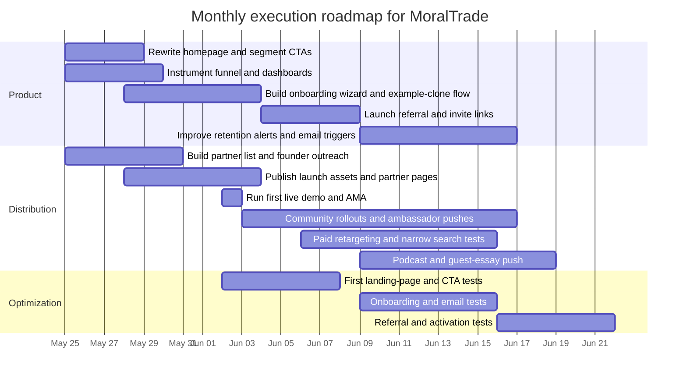

# Acquiring Early Users for MoralTrade Within a Month

## Executive summary

MoralTrade is not starting from a typical consumer-marketplace position. Publicly, the site presents itself as a **prototype marketplace for voluntary moral trade, donation offsets, and shared public-good coordination**. The homepage currently shows **zero live offers**, **eight worked examples**, **two public profiles**, and **zero reviewed offsets**, while key transactional flows still rely on **external payments, receipt evidence, and manual review** rather than native checkout. In plain terms: the public product is conceptually interesting and unusually trust-conscious, but it is still in a **liquidity-light, proof-light pilot state**. That means a broad, cold-traffic growth plan is the wrong play. A warm, community-led, founder-led, and product-led plan is the right one. citeturn0search4turn2view0turn4view4turn1view3turn9view1

My central conclusion is that **reaching one thousand new registered users within one month is feasible, but only if MoralTrade targets the right people and counts the right outcome**. “Users” should mean **registered accounts**, not transacting marketplace participants. Given the current public state, I have **moderate confidence** in a one-thousand-signup outcome if the team aggressively focuses on adjacent communities already primed for voluntary commitments and evidence-led giving, simplifies the path from curiosity to signup, and introduces stronger referral and cohort mechanics. I have **low confidence** that one thousand people would become activated counterparties or create real bilateral trades in the same period, because the public marketplace currently shows no live liquidity and the most conversion-heavy flows still require manual review and off-platform payment behavior. citeturn2view0turn4view4turn1view3turn38view0

The fastest path is to **treat MoralTrade as a founding-cohort product for high-agency, mission-aligned users**, not as a generic “ethical marketplace.” That matters because broad public search intent around “ethical marketplaces” is dominated by fair-trade shopping and sustainable consumer-goods discovery, not by coordination across moral disagreement. If MoralTrade markets itself too generically, it will attract the wrong audience and pay to educate people who are unlikely to convert. citeturn0search12turn35news2

The immediate priorities are straightforward. First, **rewrite the homepage and signup journey around concrete use cases**—for example, “Find a counterparty,” “Start with a public-good compromise,” and “Browse worked examples”—instead of leading with abstract theory. Second, **add a low-commitment entry action**, analogous to Giving What We Can’s Trial Pledge, so that a visitor can start small rather than feeling forced into a full marketplace commitment on first touch. Third, **replace missing liquidity with truthful substitute proof**: founding-member counts, examples cloned, partner groups onboarded, intros requested, and public-good commitments logged. Fourth, **drive acquisition through communities and direct relationships**, because the site’s own references, cause areas, and donation routes strongly suggest an early audience in effective-giving, cause-prioritization, and adjacent founder/donor circles—not the generic consumer internet. citeturn6view0turn41view0turn1view2turn21view0turn29view0turn30view0turn22view0

A practical target stack for month one is shown below.

| Target by month end | Recommended definition |
|---|---|
| New users | 1,000 registered accounts |
| Activated users | 250–350 users who complete a wish profile, clone a worked example, log a public-good action, or send an invite |
| Public proofs created | 60–100 public previews, examples cloned, or offers/wish pages |
| Intro requests or paired invites | 100–150 |
| Qualified traffic needed | Roughly 10,000–18,000 qualified sessions, depending on landing-page and signup conversion |

Those numbers are realistic only if the acquisition mix is heavily weighted toward **community partnerships, founder outreach, product-led invitations, and email nurture**, with paid acquisition used mostly for retargeting and narrow intent testing.

## Method and assumptions

This report prioritizes **public primary sources that were actually available**: the public MoralTrade site, adjacent platforms with very similar trust and commitment mechanics such as Giving What We Can, Founders Pledge, and Every.org, a niche precedent from the Effective Altruism Forum, and current reporting on giving behavior. I did **not** have access to MoralTrade’s internal analytics, Search Console, CRM, ad accounts, database, or private user research. Where internal data would materially change the conclusion, I state that explicitly. citeturn2view0turn41view0turn21view0turn22view0turn34view0turn15view0turn33news0turn33news1

The numerical yield and cost estimates in this report are therefore **scenario estimates**, not measurements. They assume a small team consisting of **one founder, one marketer, and one developer**, a **month-one cash budget of roughly $3,000 to $8,000 excluding salaries**, and a willingness by the founder to do sustained personal outreach. If your available budget is materially lower than that, the recommendation changes by pushing even harder into partnership and referral channels; if your budget is materially higher, the recommendation still does **not** become “just buy traffic,” because the public product currently lacks the liquidity and simplicity needed for efficient cold conversion. That conclusion follows from the site’s current pilot-state proof and transaction design. citeturn2view0turn4view4turn1view3turn38view0

I am treating the **primary success metric** as registered users and the **true north activation metric** as completion of one meaningful intent signal: create a broad preview, set up a wish profile, clone a worked example, log a public-good contribution, request an introduction, or invite a counterparty. That is the right way to manage an early marketplace because MoralTrade’s public product is built around staged disclosure, consent gates, reviews, and explicit terms rather than around instant purchases. citeturn38view0turn41view0

One more assumption is crucial: **MoralTrade should optimize for the first credible market, not the biggest possible market**. The site’s public copy draws on Toby Ord’s “Moral Trade,” Forethought-style work on compromise and public goods, and donation routes like GiveWell, ACE, Founders Pledge’s Climate Fund, and the EA Long-Term Future Fund. That strongly suggests a first market among effective-giving and cause-prioritization circles, plus adjacent founders and organizers, rather than a mass audience unfamiliar with the category. citeturn41view0turn1view2

## Site audit

The current site does several things well. It is unusually explicit about **pilot status**, **no fake proof**, **no escrow/custody claims**, **privacy boundaries**, and **safety rules**. That honesty is rare, and it is a brand asset. The site also communicates a distinctive product thesis: structured offers, consent-gated wish matching, staged disclosure, and background networking without autonomous outreach. Those are not generic marketplace features; they are the core moat. citeturn2view0turn8view1turn38view0turn41view0

The problem is that these strengths are not yet arranged into a high-converting acquisition funnel. A cold visitor currently lands on an abstract concept, can browse a directory that shows **no live offers**, and sees very limited social proof. The public profiles that do exist have **no ratings yet, no public bios, and zero open offers**. The site is being truthful, but truth alone is not enough; early-stage products need **truthful progress indicators** that help a visitor believe, “I am early, but I am not alone.” Right now, the public experience still risks sending the opposite signal. citeturn2view0turn4view4turn3view5

The onboarding funnel is partially strong and partially weak. The strong part is the signup form: it is relatively minimal, location is optional, and the site explicitly says the first step should stay minimal. The weak part is the **value exchange before signup**. “Create trade” routes the visitor to account creation, but the public site does not yet show enough live value to justify that ask for most cold users. In addition, some deployments may require email confirmation before account activation, adding another point of friction. citeturn6view0turn7view0

Messaging is the most important conversion issue. The homepage headline—“Turn moral disagreement into mutually beneficial action”—is directionally right, but much of the surrounding language remains theory-forward: “voluntary moral trade,” “moral public goods,” “Forethought,” “distributed coordination,” and “background networking.” For insiders, that language is coherent. For outsiders, it is cognitively expensive. The site needs a **two-layer message system**: a simple outer shell for acquisition, and the richer philosophical layer for people who want to go deeper. Adjacent winners do this well. Giving What We Can leads with “Turn your income into outcomes,” a direct benefit statement backed by numbers and tools; Founders Pledge leads with “Empowering entrepreneurs to do immense good,” tying a clear audience to a clear promise. MoralTrade needs the equivalent. citeturn2view0turn41view0turn21view0turn22view0

SEO is currently constrained less by metadata than by **category clarity and content surface area**. The public pages I could discover are mostly core product, legal, and methodological pages rather than a broad set of intent-capturing editorial assets. Just as important, general searches around “ethical marketplace” skew toward fair-trade shopping and sustainable products, which is a different market. That means MoralTrade should not spend month one chasing generic “ethical” search volume. It should instead build pages around **its own real intents**: pledge swaps, donation offsets, public-good compromise, privacy-first moral matching, and worked examples across specific cause-area pairings. citeturn0search12turn35news2turn2view0turn41view0

Performance and crawlability deserve a cautious note rather than a dramatic claim. Public page fetches repeatedly show an initial **loading state**, and several pages appear to be rendered through a JavaScript-heavy application shell. I could not run a full Lighthouse or Search Console audit from this environment, so I cannot responsibly claim specific Core Web Vitals issues. But the site should still assume risk around mobile performance, hydration delays, and indexability of key actions until measured. citeturn2view0turn38view0turn41view0

Analytics is the clearest observed gap—not because I can prove nothing is installed, but because no internal tracking or dashboards were available and the public product’s current state makes instrumentation absolutely essential. For month one, MoralTrade should treat analytics as product infrastructure, not a nice-to-have. At minimum, it needs event-level tracking for **landing-page CTA clicks, signup start, signup completion, email confirmation complete, role selection, cause-area selection, worked-example views, clone-example action, wish-profile completion, invite sent, intro requested, public-good contribution logged, and day-one/day-seven return**. Without that, the team will not know whether a channel is failing because traffic quality is bad, because the landing page is unclear, or because onboarding friction is too high. citeturn6view0turn38view0turn41view0

A concise audit summary appears below.

| Area | Current read | Why it matters now | Immediate fix |
|---|---|---|---|
| Conversion funnel | Honest but thin proof; live marketplace appears empty | Cold visitors will bounce before signup | Reframe as founding cohort and show truthful progress metrics |
| Onboarding | Minimal signup is good, but first value comes too late | Signup ask feels premature | Add pre-signup value and post-signup guided wizard |
| Messaging | Conceptually rich, but too abstract for cold traffic | Category education cost is high | Lead with concrete use cases and audience-specific promise |
| SEO | Limited intent-capture content; category label is confusing | Wrong traffic is expensive and low-converting | Build high-intent pages around pledge swaps, offsets, examples |
| Performance | Likely JS-heavy; full benchmark unavailable | Mobile friction kills early conversion | Run mobile performance audit and simplify critical landing paths |
| Analytics | Internal instrumentation not available to review | Team cannot optimize fast enough otherwise | Implement full funnel event schema in week one |

## Personas and positioning

The single most important positioning decision is this: **do not market MoralTrade first as a generic “ethical marketplace.”** That phrase already points many users toward ethical shopping, sustainable brands, and fair-trade goods. MoralTrade is actually a **coordination product for people who want to cooperate across moral disagreement with privacy, explicit terms, and evidence rules**. The site’s current theory roots, cause areas, and donation routes make that much clearer than the generic “ethical marketplace” label does. citeturn0search12turn35news2turn41view0turn1view2

The first market is therefore not the mass public. It is a set of **high-fit, high-trust early segments** who already understand at least one of the component ideas: effective giving, cause prioritization, public commitments, philanthropy-as-coordination, or carefully structured moral disagreement. Giving What We Can’s community page shows a public community of more than twelve thousand total members across lifetime and trial pledges, and Founders Pledge reports more than two thousand entrepreneur members. Those figures do not mean all of those people are reachable or appropriate, but they do show that the adjacent world is easily large enough to support a first thousand users if MoralTrade focuses correctly. citeturn30view0turn22view0

The recommended persona hierarchy is below.

| Priority segment | Core motivation | Primary objection | Best entry offer | Best channels |
|---|---|---|---|---|
| Effective givers and pledge-curious donors | Want evidence-led giving and are open to structured commitments | “This seems abstract or inconvenient” | Low-commitment trial action, public-good contribution, clone a worked example | Community partnerships, founder outreach, webinars, newsletters |
| Cause-area organizers and bridge-builders | Want a practical way to coordinate across communities | “I do not want a coercive or reputationally risky tool” | Group landing page plus privacy/safety explainer | Partnership outreach, events, white-glove onboarding |
| Mission-driven founders and major-gift-minded donors | Want leverage, social proof, and a serious framework | “I do not have time to learn a speculative marketplace” | Concierge onboarding plus public-good pool or paired pledge intro | Founder network outreach, podcasts, curated intros |
| Philosophically engaged researchers and writers | Care about the theory of compromise and public goods | “Interesting idea, unclear product value” | Worked examples, essay, AMA, and invite-only cohort | Essays, EA-adjacent forums, podcasts, community talks |

For these segments, the message should not be “shop ethically.” It should be closer to one of these:

- **Coordinate across moral disagreement without coercion**
- **Turn moral disagreement into explicit, reviewable cooperation**
- **Start with a low-risk public-good commitment, then find your counterpart**
- **Private, consent-based matching for donation offsets, pledge swaps, and public-good coordination**

Those directions are much closer to the site’s actual product and much less likely to attract the wrong searcher. citeturn2view0turn38view0turn41view0

A related positioning lesson comes directly from adjacent products. Giving What We Can lowers commitment with a **Trial Pledge that can be as low as one percent for a chosen duration** and pairs it with community scale and a visible member base. Founders Pledge narrows its audience to **entrepreneurs** and then backs that positioning with member counts, pledged dollars, testimonials, and newsletter capture. Every.org cleanly separates journeys for **donors** and **nonprofits** and immediately shows recent activity. MoralTrade should borrow all three patterns: **lower the first commitment, define the first audience sharply, and segment the first click.** citeturn29view0turn30view0turn22view0turn34view0

## Channel strategy

The overall acquisition thesis is simple: **win the first thousand through trust distribution, not attention arbitrage**. Public giving behavior still shows strong spikes when communities are activated—GivingTuesday’s 2025 estimate reached a record four billion dollars—but mass-market donor participation remains uneven, and AP-NORC reporting also found that most U.S. adults were not planning additional year-end charitable giving. That is exactly why MoralTrade should avoid trying to become a broad internet giving appeal in month one. Warm, aligned, belief-compatible traffic will outperform cold traffic by a wide margin here. citeturn33news0turn33news1

### Channel comparison

The table below ranks the channels by likely month-one usefulness for a small team in MoralTrade’s current state.

| Channel | Priority | Speed | Cost | Expected month-one signups | Likely ROI | Why it fits MoralTrade |
|---|---|---:|---:|---:|---:|---|
| Founder-led outreach | Very high | Fast | Low–Medium | 150–300 | Very high | Trust-heavy niche product; founder narrative matters |
| Community partnerships | Very high | Fast | Low–Medium | 200–350 | Very high | Warm audiences already understand giving, pledges, or coordination |
| Product-led growth | Very high | Medium | Medium | 120–220 | High | Invite loops and cloneable examples compound every new signup |
| Email nurture | High | Medium | Low | 40–120 direct signups; larger impact on activation | High | Best for converting interested but not yet ready users |
| Content and webinars | High | Medium | Low–Medium | 80–150 | High | Concept needs explanation; live demos reduce ambiguity |
| Social and niche creators | Medium | Medium | Low–Medium | 50–120 | Medium | Works only if audience fit is strong and examples are concrete |
| Paid retargeting and narrow search | Medium | Fast | Medium–High | 50–120 | Medium–Low | Good for reclaiming warm interest; weak for broad cold traffic |
| PR and podcasts | Medium | Medium | Low | 20–80 | Medium | Strong story angle, but not fully controllable |
| SEO | Low for month one, high later | Slow | Low–Medium | 10–40 | Low now, high later | Supports compounding, not immediate volume |

Across all channels, the most important unit economics lever is **not CPC or CPM**. It is **concept compression**: how quickly a user understands what MoralTrade is for and why joining now is worth it. Every tactic below is designed to reduce that cognitive cost. citeturn2view0turn41view0turn21view0turn22view0

### Step-by-step playbooks

**Founder-led outreach**

This should be the first channel launched because it compounds the others. MoralTrade is early, unusual, and trust-sensitive. Those are classic signs that the founder must carry initial distribution.

First, the founder should build a list of **one hundred to one hundred fifty mission-aligned nodes**: pledge-takers, cause-area organizers, writers, researchers, donors, community hosts, and people already interested in giving across disagreement. The site’s own references to Toby Ord, public-good coordination, and routes like GiveWell, ACE, and Founders Pledge imply exactly the sort of adjacent users to prioritize. Second, the founder should send **highly personalized messages** that do not ask for abstract support. Each message should ask for one of three concrete actions: join the founding cohort, attend a live demo, or introduce two relevant people. Third, every interested reply should receive a **white-glove path**: quick signup help, one recommended first action, and one invitation request. Fourth, by the end of the first week, the founder should turn warm responders into **named ambassadors or partner authors** for public examples, guest discussions, or cohort pages. citeturn41view0turn1view2turn15view0

**Community partnerships**

This is likely the highest-yield channel. The product wants communities where people already care about effective giving, cause prioritization, or structured cooperation. The playbook is to create **partner landing pages** and **partner events**, not generic sponsorships.

Start by selecting **ten to fifteen communities** rather than trying to boil the ocean. For each one, create a dedicated page with that community’s likely use case: a public-good pool, a pair of worked examples, and a simple CTA such as “Join this cohort” or “See examples for this cause pairing.” Then offer each organizer a concrete package: a short explainer, a live walkthrough, a FAQ that foregrounds privacy and safety, and a follow-up email template they can send to members. A good standard offer is a **thirty-minute live session** with real examples, followed by a time-bound founding-member invitation. Communities should never feel like distribution partners for an unfinished product; they should feel like **co-design partners** helping define safe early norms. That fits the site’s own anti-coercion and staged-disclosure posture. citeturn8view1turn38view0turn41view0

**Product-led growth and referral design**

MoralTrade already has the raw ingredients for product-led growth, but they are not yet assembled into a loop. The key product insight is that the site’s background-networking design, wish previews, and staged disclosure are naturally suited to **invite-based growth**.

The initial loop should work like this. A user signs up, chooses a role and cause area, then completes **one broad preview** or **clones one worked example**. Immediately afterward, the product asks the user to **invite one possible counterparty, one community organizer, or one friend who holds a different but serious cause priority**. The invite should emphasize that MoralTrade uses broad previews first, consent before detail, and no autonomous outreach. That message is already native to the product; it just needs to become a growth mechanism. The next loop is a **pair-completion incentive**: if a user invites someone who joins and completes a matching preview, both unlock a tailored introduction path, bonus worked examples, or a cohort badge. citeturn38view0turn41view0

There is a second, equally important PLG move: **offer cloning**. Right now, worked examples are one of the few tangible assets the product has. The platform should let a new user click “Use this as a template,” prefill fields, and adjust them. That transforms a static example into a conversion asset. Because the site already clearly separates worked examples from live liquidity, it can do this without misleading users. citeturn2view0turn4view4

**Content, webinars, and launch assets**

This category matters because the product concept is not self-evident. Content should not be broad thought leadership first. It should be **conversion content** tied to real acquisition moments.

The minimum month-one content pack is small but powerful: one short homepage video or GIF of the flow, one “how it works in plain English” page, one safety/privacy explainer, one page on public-good contributions, one page on donation offsets, and **five to eight worked examples across cause pairings**. On top of that, run one live **demo webinar or AMA each week**. The webinar format works because it resolves the two biggest questions at once: “Is this creepy?” and “Is this real?” The site’s existing public language on privacy, consent, and deterministic matching provides unusually strong material for that format. citeturn38view0turn41view0

A useful content precedent sits inside the product’s own niche history. In early 2024, an EA Forum post argued that even a simple Google Doc marketplace could help moral traders find each other. That creates a clean narrative arc for launch content and podcasts: **from ad hoc spreadsheet-style coordination to a privacy-first, reviewable moral-trade prototype**. citeturn15view0

**Email**

Email is not primarily a top-of-funnel volume channel here. It is the channel that keeps partially convinced people moving. That matters because a trust-heavy product like MoralTrade will generate a meaningful share of “interesting, but later” responses.

The email playbook should begin with a single list architecture, not a complicated one: **leads, signed-up-not-activated, activated-not-invited, invited-no-pair, and advocates**. The welcome sequence should be short and decisive: day-zero explanation, day-two example, day-four first-action prompt, day-seven invitation request, and day-ten “founding cohort closes soon” reminder. Every email should drive to one action only. For leads, that action is signup. For new signups, it is completing a preview or cloning an example. For activated users, it is sending an invite or requesting an introduction. Giving What We Can and Founders Pledge both visibly use newsletters and recurring communication as part of the core trust engine, not just as a peripheral marketing channel. MoralTrade should do the same. citeturn22view0turn29view0turn30view0

**Paid social and search**

Paid should be used, but defensively and narrowly. The mistake would be to run broad “ethical marketplace” or “charity platform” campaigns. Public search intent around those terms is too noisy, and the current market proof is too thin for cold paid media to be efficient.

The correct paid plan has two parts. One is **retargeting**: everyone who visits core pages, opens webinar registration, or starts signup should see follow-up creative focused on examples, trust, and the founding cohort. Two is **very narrow intent testing**, such as search terms and audience clusters around effective giving, donation pledges, cause prioritization, or named adjacent brands and ideas. Budget caps should be low in week one and only expand if signup-to-activation quality is acceptable. The success metric is not cheap clicks; it is activated users. citeturn0search12turn35news2turn2view0turn41view0

**Influencers, creators, PR, and podcasts**

For month one, “influencers” should mean **niche trust carriers**, not large lifestyle creators. The best fits are writers, podcasters, and organizers who already talk about giving, moral uncertainty, cause prioritization, climate-versus-poverty tradeoffs, animal welfare, public health, or founder philanthropy.

The strongest angle is not “new startup launches.” It is something more specific: **how do people cooperate when they sincerely disagree about what matters most?** MoralTrade’s privacy-first posture helps here because it distinguishes the product from creepy matching, mass scraping, or autonomous networking. Podcasts and essays are therefore more valuable than traditional press releases. The goal is not raw reach; it is belief transfer. citeturn38view0turn41view0turn15view0

**SEO**

SEO should begin immediately, but it should not be treated as the channel that gets you to one thousand in the first month. Its role is to make every other channel convert better and to start compounding by month two and month three.

The best initial SEO set is a cluster of **high-intent pages**: one page each for pledge swaps, donation offsets, public-good contributions, privacy-first matchmaking, and staged disclosure; plus structured, genuinely useful pages for concrete cause pairings and worked scenarios. Avoid thin SEO pages. Build assets that a partner or organizer would actually want to send around. Then use community posts, webinars, guest essays, and founder outreach to earn the first links and mentions. citeturn2view0turn41view0

## Execution roadmap

The roadmap below assumes the team starts on the next working week and that the founder is willing to spend real time on distribution, not just product.

The operating plan should look like this.

| Timing | Founder | Marketer | Developer | Output |
|---|---|---|---|---|
| Early week one | Define the top personas, write founder narrative, build outreach target list | Draft new homepage, cohort copy, event page, and first email sequence | Implement analytics, UTM capture, signup funnel tracking | Updated messaging and measurement baseline |
| Late week one | Send first fifty personalized outreach messages and book first partner sessions | Publish partner landing-page template, launch webinar registration, write worked-example pages | Build post-signup wizard and event instrumentation | First traffic wave and first partner commitments |
| Early week two | Host first live demo, follow up personally with high-intent leads | Send welcome sequence, publish clips, open community applications | Launch example-clone flow and invite-link mechanics | First activation loop |
| Late week two | Secure podcast and guest-essay opportunities, close first ambassador partners | Start retargeting, post social proof updates, push weekly roundup | Add onboarding improvements from week-one data | More efficient conversion |
| Week three | Push second outreach wave and community-specific demo sessions | Run A/B tests on landing pages and emails | Ship referral prompts and progress counters | Compounding distribution |
| Week four | Focus on best-performing partner/channel clusters only | Run scarcity-based founding-cohort close, publish results dashboard | Polish activation and retention triggers | Final conversion push and clearer proof for month two |

A more explicit target rhythm helps a small team stay honest.

| Week | Primary goal | Leading indicator | Success threshold |
|---|---|---|---|
| First week | Fix positioning and measurement | Landing-page CTA clicks and signup-start rate | Clear upward movement within days |
| Second week | Turn interest into activation | Profile completion, example clones, first invites | At least 20–25% of signups activate |
| Third week | Scale warm distribution | Partner traffic, webinar attendance, referral acceptance | A majority of new users come from warm channels |
| Fourth week | Concentrate on winners | Cost per activated user and invite conversion | Cut weak channels, double down on top two or three |

## Experiments and messaging kit

The highest-value experiments are not cosmetic. They are category and friction experiments.

| Test | Variant A | Variant B | Winning metric |
|---|---|---|---|
| Hero message | “Turn moral disagreement into mutually beneficial action” | “Cooperate across disagreement with explicit terms and privacy-first matching” | Signup-start rate |
| Primary CTA | “Create a trade” | “Join the founding cohort” | Signup completion |
| First path split | Generic homepage | Three choices: find counterparty / support public good / browse examples | Activation rate |
| Social proof block | Raw zero-liquidity stats only | Founding progress stats plus transparent pilot note | Signup-start rate |
| Onboarding first action | Fill profile from scratch | Clone a worked example | Activation completion |
| Low-commitment entry | Full marketplace join | Trial-style micro-commitment or public-good action | Signup-to-activation |
| Post-signup ask | Build profile immediately | Choose role and cause area first | Wizard completion |
| Referral prompt timing | After signup | After first activation action | Invite-send rate |

The site’s current public proof suggests two onboarding changes should happen immediately. First, add a **three-step role-and-purpose wizard** right after signup: “I’m here to find a counterparty,” “I’m here to support a shared public good,” or “I’m here to publish or browse examples.” Every.org’s donor/nonprofit split is the relevant pattern here: segment the path before the user has to understand the entire system. Second, add a **trial-style ladder**: just as Giving What We Can lets users start with a Trial Pledge rather than forcing the full long-term commitment, MoralTrade should let users start with a broad preview, a public-good action, or an example clone instead of demanding a full offer immediately. citeturn34view0turn29view0turn30view0

Retention should be designed around **useful reminders, not gamified noise**. The best hooks are already latent in the product: saved searches, match suggestions, new relevant examples, public-good opportunities, and paired invitations. A clean retention stack would include a weekly match digest, alerts when a relevant public preview or example appears, reminders when a trial commitment or open introduction is waiting, and a monthly founder letter explaining what the cohort is learning. The background-networking pages explicitly describe saved searches, manual source notes, match suggestions, and reviewable disclosures; those are retention primitives as much as product features. citeturn38view0turn41view0

Referral mechanics should feel native to the product’s philosophy. The best one is **invite a serious counterparty**. Instead of “invite friends,” ask users to nominate someone who cares deeply about a different cause but is open to voluntary cooperation. A second mechanic is **community cohort goals**: for example, “Help your group create ten broad previews this month.” A third is **paired founding-member status** when both sides complete a compatible preview. Because the site is explicitly anti-autonomous-outreach and privacy-conscious, these mechanics should always foreground consent and staged disclosure. citeturn38view0turn41view0

### Suggested messaging examples

The homepage should test a much clearer outer-shell message. Good candidates include:

- **Cooperate across moral disagreement**
- **A privacy-first place for pledge swaps, donation offsets, and shared public goods**
- **Find a serious counterparty without turning people into targets**
- **Start with a worked example, then make your own commitment**

For audience-specific subhead lines, use variations such as:

- **For effective givers:** “Coordinate with people who care about different causes without pretending you all agree.”
- **For organizers:** “Run safer, more legible cooperation across cause communities.”
- **For founders and donors:** “Turn conviction into explicit, reviewable commitments.”

### Sample ad copy

**Search-style copy**

**Headline:** Coordinate giving across disagreement
**Body:** Explore pledge swaps, donation offsets, and shared public-good commitments. Privacy-first. Explicit terms. Founding cohort now open.

**Headline:** A trial path into moral trade
**Body:** Start with a worked example or a public-good action. No fake proof, no autonomous outreach, no escrow claims.

**Retargeting social copy**

**Primary text:** You visited MoralTrade. The product is early, but the point is clear: if people care about different causes, they should still be able to cooperate voluntarily. Join the founding cohort, browse real worked examples, and invite one serious counterparty.

**Headline:** Join the founding cohort
**CTA:** Sign up

### Email sequence

| Timing | Subject | Goal | Core message |
|---|---|---|---|
| Immediately after signup | Welcome to MoralTrade | Orient | Explain the product in plain English and ask the user to pick one path |
| Two days later | Start with a worked example | Activate | Encourage cloning an example instead of starting from scratch |
| Four days later | A safer way to explore disagreement | Build trust | Reassure on privacy, staged disclosure, and no autonomous outreach |
| Seven days later | Do you know one possible counterparty? | Referral | Ask for one invite, not many |
| Ten days later | Founding cohort update | Social proof | Share truthful progress numbers and a deadline |

A sample welcome email body:

> You do not need to understand every feature to get value from MoralTrade. Start with one thing: browse a worked example, create a broad preview, or log a shared public-good action. Exact wishes stay private unless both sides opt in.

### Social post templates

**Short-form founder post**

> Most disagreement online produces heat, not cooperation. MoralTrade is an experiment in the opposite direction: explicit, voluntary commitments between people who care about different things. No fake liquidity, no creepy outreach, no escrow theater. Just worked examples, privacy-first matching, and a founding cohort.

**Community organizer post**

> If your group cares about effective giving or cause prioritization, I’m looking for a few early communities to test MoralTrade with. The goal is simple: make it easier to cooperate across moral disagreement without coercion or surprise exposure. We now have worked examples, public-good routes, and privacy-first previews.

**LinkedIn-style post for founders or donors**

> Many donors agree on doing good and disagree on where the highest leverage is. MoralTrade is a prototype for making those disagreements more productive: pledge swaps, donation offsets, and shared public-good commitments with explicit terms and evidence rules. I’m opening a small founding cohort now.

**Forum or long-form community post**

> In 2024, a manual Moral Trade Marketplace could live in a document. The next step is making that idea safer and more legible: broad previews first, consent before detail, rule-based matching, no autonomous outreach, and explicit review boundaries. If that sounds useful, I’d like to show you the product and get your feedback. citeturn15view0turn38view0

The bottom line is blunt. **MoralTrade should not try to buy one thousand random users. It should recruit one thousand highly legible, mission-fit early users into a founding cohort with low-friction entry points, clear safety language, and strong invite mechanics.** The public product already has the right trust primitives; what it lacks is a sharper promise, a lower first step, and a tighter distribution engine. If those are fixed first, the one-thousand-user target becomes attainable. If they are not, almost any traffic source will underperform. citeturn2view0turn38view0turn41view0turn22view0turn30view0