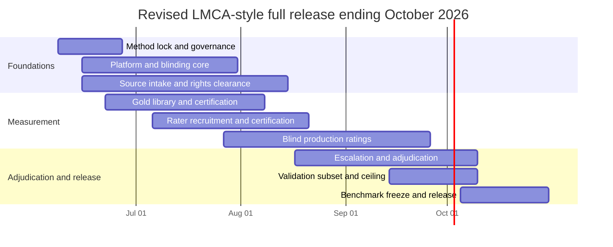
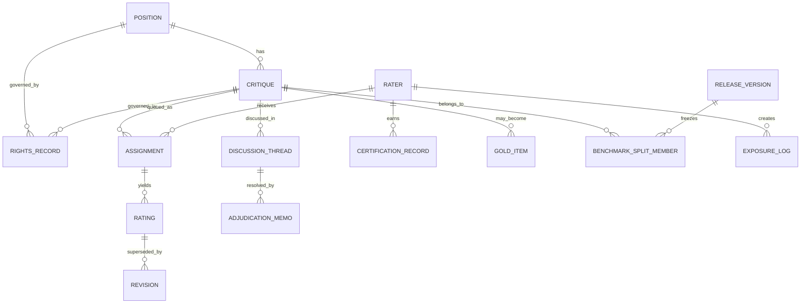

# Converting LMCA into a High-Quality Expert-Volunteer Annotation Platform

## Executive summary

Using **LMCA_dataset.pdf** as the authoritative source, and then consulting **AI Conceptual1.md**, **Implementing the LMCA Workflow as an Expert-Volunteer Online Project.pdf**, **Rigorous Comparison of LMCA Requirements Against the Two Volunteer-Project Designs.pdf**, **LMCA Requirements Audit and Revised October Release Plan.pdf**, and **LMCA Compliance Assessment and October 2026 Release Plan.md** in that order, the bottom-line finding is:

**Yes, the LMCA workflow can be converted into a high-quality expert-volunteer online annotation project, but only if the platform preserves LMCA’s measurement logic rather than merely its surface workflow.** That means keeping the contextualized **position → critique → multi-dimensional rating** unit, source/tag blinding, blind initial ratings before discussion, preserved originals after revision, disagreement-centered adjudication, the centrality×strength product rule, and LMCA’s two scoring families. It also means adding a small number of implementation safeguards that LMCA itself does not specify but plainly motivates through its limitations: rights/provenance tracking, artifact-balancing, hidden-benchmark governance, calibration, and exposure controls. (LMCA_dataset.pdf, pp. 2–7, 18–20, 21–23, 24–33; Appendix B–F.)

The two volunteer-project designs—**AI Conceptual1.md** and **Implementing the LMCA Workflow as an Expert-Volunteer Online Project.pdf**—are substantively the same design memo in two formats. They are **architecturally close to LMCA** and **much closer than naive crowd annotation**, but they are still incomplete as an operating specification. Their main weakness is not conceptual error; it is **underspecification**. They preserve the core object, the seven dimensions, source-blind rating, preserved revisions, disagreement review, and the LMCA scoring logic, but they do not fully operationalize Appendix F’s semantics, benchmark eligibility, artifact-balancing, validation cadence, or immutable workflow rules. (AI Conceptual1.md, sections “What the paper demonstrates,” “Rater tiers, onboarding, calibration, and adjudication,” “Platform, data model, and governance,” and “Quality control, statistical aggregation, hidden benchmark management, and risks”; Implementing the LMCA Workflow as an Expert-Volunteer Online Project.pdf, pp. 1–10; Rigorous Comparison of LMCA Requirements Against the Two Volunteer-Project Designs.pdf, pp. 1–10; LMCA Compliance Assessment and October 2026 Release Plan.md, Executive summary and “Requirement-by-requirement comparison.”)

I did **not** find major direct factual contradictions in **AI Conceptual1.md** or in the **Implementing** PDF. Their main issue is that several features are presented as natural next steps without always being clearly labeled as **extensions beyond LMCA**. By contrast, **LMCA Requirements Audit and Revised October Release Plan.pdf** contains a small number of **category errors / overstatements** that should be corrected explicitly, especially where **gold items** and **hidden benchmarks** are grouped as if they were already part of LMCA’s own “core mechanics.” LMCA does **not** specify either of those as source-stated benchmark mechanics. (LMCA_dataset.pdf, Sections 2–4 and Appendix B–F; LMCA Requirements Audit and Revised October Release Plan.pdf, Executive summary, p. 1; LMCA Compliance Assessment and October 2026 Release Plan.md, Executive summary and “False claims and corrections in the October audit/release-plan memo.”)

A compressed but still serious release by **October 31, 2026** is feasible **without collapsing into an MVP** if the project is run as a **parallelized full-release program**. The best quality-preserving compressed scope is: **120 positions**, **3 critiques per position**, **4 blind initial ratings per pair**, a **60-item gold library**, and a **formal validation subset modeled on LMCA’s Appendix C logic**, plus a frozen hidden benchmark and a release report using both LMCA scoring families. My recommended staffing and effort envelope is **roughly 138–156 person-weeks**, slightly heavier than the more aggressive October audit, because restoring **four expert adjudicators** and **explicit validation capacity** better preserves LMCA quality. My confidence is **high** on the requirement extraction and compliance findings, and **medium** on budget ranges because the source corpus does not contain salary data and the cost figures are planning assumptions rather than source-stated facts. (LMCA_dataset.pdf, pp. 3, 6–7, 19–20, 21–23, 24–33; Rigorous Comparison of LMCA Requirements Against the Two Volunteer-Project Designs.pdf, pp. 11–14; LMCA Requirements Audit and Revised October Release Plan.pdf, pp. 7–13; LMCA Compliance Assessment and October 2026 Release Plan.md, Executive summary and revised-plan sections.)

## LMCA as the authoritative specification

LMCA’s core contribution is a **measurement regime**, not just a dataset. The paper defines the annotation unit as a **position text**, a **critique** of that position, and **human-expert ratings** of the critique on **centrality, strength, correctness, clarity, dead weight, single issue, and overall**. The motivation is explicit: in conceptual domains there is often no accessible ground truth for final answers, so the authors instead evaluate **contextualized critiques**. (LMCA_dataset.pdf, pp. 1–3.)

The workflow elements that are clearly source-stated in LMCA are unusually specific. During rating, **source and tags are hidden**; critiques of the same position are shown in sequence by default, although later critiques may be added asynchronously; ratings can be revisited after disagreement discussion; and **original ratings are always preserved** when revisions are added. Short position/critique pairs take about **5–15 minutes** to rate, and most items were initially rated by Emery Cooper, with subsets also rated by several other experts. (LMCA_dataset.pdf, p. 6.)

The validation logic is equally important. In Appendix C, raters on the rating-test subset were **blind to one another’s initial ratings**, then discussed disagreements for **7–8 hours across two meetings**, plus additional written follow-up, and were instructed to revise only on **object-level grounds**, not merely because others disagreed. Final agreement was substantially better than initial agreement, and expert raters still outperformed GPT-5 on the custom weighted loss, which is part of why LMCA remains unsaturated as a benchmark. (LMCA_dataset.pdf, pp. 19–20.)

The scoring rules are also binding. LMCA uses **two scoring families**: a **weighted pairwise ranking error rate** based on ranking critiques within the same position, and a **custom weighted loss** using the full rubric. The paper is explicit that **strength and centrality should not be used in isolation** because allocation between them is often ambiguous; instead, model scoring should use their **product**. It is also explicit that when **human clarity < 0.5**, the custom loss should use **only overall and clarity**. The formal rule is: if clarity is below 0.5, compute `0.5 × |overall diff| + 0.5 × |clarity diff|`; otherwise compute `0.5 × |overall diff| + 0.2 × |cent×str diff| + 0.1 × |clarity diff| + 0.1 × |correctness diff| + 0.05 × |dead-weight diff| + 0.05 × |single-issue diff|`. (LMCA_dataset.pdf, pp. 18–19.)

Appendix D and Appendix F are essential for faithful reproduction. Appendix D identifies the recurring hard cases: disagreement over interpretation of the position or critique, vague critiques that seem to gesture at a good objection without fully making it, uncertainty about whether a point is already **“priced in”**, background-knowledge dependence, fuzziness in mid-range strength scores, and extensive **strength–centrality ambiguity**. Appendix F then operationalizes the rubric with concrete rules: raters should read position and critique **somewhat literally**; when the position is ambiguous, they should consider the **plausible interpretation under which the critique fares worst**; only **object-level arguments** count toward strength; and “priced in” objections should be treated cautiously. Those rules are not optional glosses. They are part of what makes LMCA itself LMCA. (LMCA_dataset.pdf, Appendix D, pp. 21–23; Appendix F, pp. 24–33.)

What LMCA does **not** explicitly specify is just as important. It does **not** define a volunteer tier system, gold-item injection, a hidden/public split policy, certification thresholds, exposure logging, rights clearance, or any incentive structure. Those may all be very sensible additions; they are just **not** source-stated LMCA requirements. Any later document that treats them as already part of LMCA’s own mechanics needs correction. (LMCA_dataset.pdf, Sections 2–4; Appendix B–F.)

## Compliance review of the two volunteer-project designs

The two volunteer-project designs are, in substance, the same document. **AI Conceptual1.md** and **Implementing the LMCA Workflow as an Expert-Volunteer Online Project.pdf** share the same section structure, the same tier model, the same pilot scale, and the same hidden-benchmark and gold-item logic. The later comparison memo and compliance memo both say this explicitly, and that matches the text itself. (AI Conceptual1.md, throughout; Implementing the LMCA Workflow as an Expert-Volunteer Online Project.pdf, pp. 1–10; Rigorous Comparison of LMCA Requirements Against the Two Volunteer-Project Designs.pdf, Executive summary; LMCA Compliance Assessment and October 2026 Release Plan.md, Executive summary.)

The table below separates **direct matches**, **non-conflicting extensions**, and **remaining gaps**.

| LMCA requirement or constraint | AI Conceptual1.md | Implementing PDF | Judgment |
|---|---|---|---|
| Contextualized position–critique unit | Present | Present | **Match** |
| Seven LMCA dimensions retained | Present | Present | **Match** |
| Source/tag blinding during rating | Present | Present | **Match** |
| Blind initial ratings before discussion | Present in design intent | Present in design intent | **Match in concept; not fully locked in workflow** |
| Preserved originals after revision | Present | Present | **Match in concept** |
| Multi-rater disagreement review | Present | Present | **Match in concept** |
| Pairwise + custom weighted LMCA scoring | Present | Present | **Match** |
| Low-clarity special handling | Present | Present | **Match** |
| Product-based handling of strength × centrality | Present | Present | **Match** |
| Appendix F semantics frozen into operational rubric pack | Not fully specified | Not fully specified | **Gap** |
| Same-position queue with asynchronous later additions | Mentioned conceptually | Mentioned conceptually | **Gap in exact queue/state logic** |
| Formal validation cadence like Appendix C | Not fixed | Not fixed | **Gap** |
| Benchmark eligibility tied to real within-position spread | Not fixed | Not fixed | **Gap** |
| Quantitative anti-artifact rules against source/style shortcuts | Not fixed | Not fixed | **Gap** |
| Immutable audit trail and exposure logs | Proposed at high level | Proposed at high level | **Extension; still underspecified** |
| Gold items, certification thresholds, hidden benchmark governance | Proposed | Proposed | **Useful extension beyond LMCA, but not an LMCA requirement** |
| Rights / consent / provenance completion rules | Proposed as governance concern | Proposed as governance concern | **Useful extension beyond LMCA, but not an LMCA requirement** |

The most important strength of both designs is that they **understand the point of LMCA**. They do not reduce the task to final-answer labeling. They preserve the seven-part rubric, emphasize source blinding, keep preserved revisions, and treat the centrality×strength product as the load-bearing signal. They also pay attention to LMCA’s two biggest benchmark threats: **source/style artifacts** and **weak within-position quality spread**. That is why both designs are genuinely close to the right architecture. (LMCA_dataset.pdf, pp. 6–7, 18–20, 21–23, 24–33; AI Conceptual1.md, sections “Feasibility and project architecture,” “Platform, data model, and governance,” and “Quality control, statistical aggregation, hidden benchmark management, and risks”; Implementing the LMCA Workflow as an Expert-Volunteer Online Project.pdf, pp. 2–9.)

Their main weakness is that they are still **design memos**, not **operating specifications**. In particular, neither document fully freezes the Appendix F semantics into a rater packet with examples and failure cases. Neither document operationalizes the “worst plausible interpretation” rule, the “priced in” rule, or the “only object-level arguments count for strength” rule as mandatory adjudication fields. Neither document fixes exact release-governance rules for hidden benchmark eligibility, formal validation cadence, exposure control, or artifact-balancing quotas. Those are exactly the gaps that matter when a project shifts from “good pilot idea” to “benchmark-quality release.” (LMCA_dataset.pdf, Appendix D, pp. 21–23; Appendix F, pp. 24–33; AI Conceptual1.md, sections “Rater tiers…,” “Platform…,” and “Pilot design…”; Implementing the LMCA Workflow as an Expert-Volunteer Online Project.pdf, pp. 4–9.)

I did **not** find major direct factual contradictions in either volunteer-design file. Their risk is different: they sometimes present additions—gold items, hidden benchmarks, reliability-weighted aggregation, certification thresholds, rights workflows—as natural implications of LMCA without always labeling them as **project-level safeguards** rather than **LMCA source requirements**. That is a framing issue, not a deep factual defect. (LMCA_dataset.pdf, Sections 2–4; AI Conceptual1.md, Executive summary and governance sections; Implementing the LMCA Workflow as an Expert-Volunteer Online Project.pdf, pp. 1–9.)

## Corrections to the October audit and related overstatements

The October audit memo is mostly careful, and its overall conclusion is basically correct: the volunteer designs are close, but not yet “best possible” under LMCA. I did **not** find major numerical mistakes in its rendering of LMCA’s rubric, validation statistics, or formal scoring formulas. The statements that need revision are mostly **category errors**—places where the memo groups later safeguards into “LMCA core mechanics” or treats a method used by LMCA as if it were a source-stated requirement. (LMCA_dataset.pdf, Sections 2–4 and Appendix B–F; LMCA Requirements Audit and Revised October Release Plan.pdf, pp. 1–6.)

The table below lists the statements that should be corrected.

| Statement in **LMCA Requirements Audit and Revised October Release Plan.pdf** | Status | Why it conflicts with or overstates LMCA | Corrected wording | LMCA source that refutes or limits it |
|---|---|---|---|---|
| Executive summary, p. 1: “They preserve most of LMCA’s core mechanics … and both designs explicitly center strength × centrality, low-clarity handling, **gold items**, and **a hidden benchmark**.” | **Contradiction / overstatement** | LMCA explicitly specifies the contextualized unit, seven dimensions, source/tag blinding, preserved originals, blind initial ratings, and the two scoring families; it does **not** specify gold-item injection or hidden-benchmark governance. | “They preserve most of LMCA’s core mechanics and add project-level safeguards—such as gold items and hidden-benchmark governance—that go beyond LMCA’s source-stated specification.” | LMCA_dataset.pdf, pp. 2–7, 18–20, Appendix B–F. |
| “Extracted LMCA requirements” / gap analysis, pp. 4–6: “Diverse provenance plus active-learning critique selection” is treated too closely as an LMCA requirement. | **Material overstatement** | LMCA reports diverse sourcing and an active-learning-like critique-generation method as **how this dataset was built**, not as a formal future requirement with mandated quotas or thresholds. | “LMCA uses diverse sourcing and an active-learning-like critique-selection method. A faithful volunteer project should preserve comparable challenge and diversity, but these are best treated as source-derived methods or inferred safeguards, not explicit LMCA requirements.” | LMCA_dataset.pdf, p. 3; pp. 6–7. |
| Scoring summary, p. 3: the verbal statement of custom-loss weights can be read as the implementation rule. | **Precision fix** | LMCA does give the verbal weighting intuition, but the **formal implementation rule** is the formula on pp. 18–19: a special clarity<0.5 case plus the explicit weighted sum. The wording is directionally right but too loose for implementation. | “Implement the custom weighted loss exactly as LMCA formulates it: if human clarity < 0.5, use only overall and clarity; otherwise use the formal weighted sum with overall 0.5, cent×str 0.2, clarity 0.1, correctness 0.1, dead weight 0.05, and single issue 0.05.” | LMCA_dataset.pdf, pp. 18–19. |

No other direct contradictions stood out after close comparison. The later **LMCA Compliance Assessment and October 2026 Release Plan.md** reaches essentially the same conclusion: the main problems are category errors and overstatements, not wholesale misunderstanding. (LMCA Compliance Assessment and October 2026 Release Plan.md, Executive summary and “False claims and corrections in the October audit/release-plan memo.”)

## Revised October design and release plan

The replacement text below revises the two relevant sections of **Rigorous Comparison of LMCA Requirements Against the Two Volunteer-Project Designs.pdf** so that the project finishes by **October 31, 2026** while preserving as much of the longer plan’s quality as possible. The key move is **parallelization**, not simplification: governance, platform work, gold-item authoring, source intake, certification, rating, adjudication, validation, and release packaging run in overlapping waves instead of a long serial pipeline. That approach is directly responsive to LMCA’s actual bottlenecks: interpretation-sensitive adjudication, artifact defense, and benchmark hardening. (LMCA_dataset.pdf, pp. 6–7, 19–20, 21–23, 24–33; Rigorous Comparison of LMCA Requirements Against the Two Volunteer-Project Designs.pdf, pp. 9–14; LMCA Requirements Audit and Revised October Release Plan.pdf, pp. 7–13; LMCA Compliance Assessment and October 2026 Release Plan.md, revised-plan sections.)

### Improved design to meet or exceed LMCA standards

**Replacement text**

To meet or exceed LMCA, this project should be run as a **measurement program with tiered human oversight**, not as a large undifferentiated annotation pool. The current design documents already contain the right architectural spine, but they need to be turned into a closed operating specification. The October 2026 target should therefore preserve the high-value parts of the current design—source-blind rating, tiered raters, gold-item calibration, disagreement review, preserved revisions, provenance tracking, and hidden-benchmark governance—while making the key operating rules explicit and auditable. This is the shortest path to a complete first release rather than a toy pilot. (LMCA_dataset.pdf, pp. 6–7, 19–20, Appendix D–F; AI Conceptual1.md, sections “Rater tiers…,” “Platform…,” and “Quality control…”; Implementing the LMCA Workflow as an Expert-Volunteer Online Project.pdf, pp. 3–9.)

The production rule set should preserve LMCA’s real backbone and formalize only those additions needed to make a volunteer platform release-safe. In particular, the annotation object remains a **contextualized position–critique pair** scored on the seven LMCA dimensions; the rubric must be frozen into an operational packet reproducing Appendix F’s literal-reading rule, worst-plausible-interpretation rule, “priced in” guidance, and the requirement that only object-level arguments count toward strength; and initial ratings must remain blind to source, tags, and peer scores. Original ratings must remain preserved after revision, and every revision must carry a reason code and discussion pointer. (LMCA_dataset.pdf, pp. 2–7, 19–20, Appendix D–F.)

Because LMCA itself warns about source/style shortcuts and poor within-position critique spread, benchmark governance must be stricter than ordinary production governance. Gold items, hidden benchmarks, certification thresholds, and exposure logs are not source-stated LMCA requirements, but they are justified LMCA-style safeguards. They should therefore be labeled clearly as **project-level extensions motivated by LMCA’s stated limitations**, not as if they had been directly specified in the paper. (LMCA_dataset.pdf, pp. 3, 6–7, 17–19.)

The operating rules below are the minimum needed for an October 2026 full release.

| Area | October 2026 operating rule |
|---|---|
| Measurement object | Every item is a contextualized `position + critique + seven-part LMCA rating` object. |
| Rubric fidelity | Freeze a written rubric pack reproducing Appendix F semantics, examples, counterexamples, and adjudication notes. |
| Intake and provenance | Every position and critique gets a provenance record with source type, generation route, rights status, consent status if relevant, and release eligibility. |
| Tier-zero certification | Every new rater completes a certification pack drawn from the gold library and ambiguity cases before touching live production items. |
| Queue design | Early queues use a mixed stream of live items, hidden-gold items, and duplicates; same-position grouping is preserved, but asynchronous additions remain allowed. |
| Blind initial rating | Source and confounding tags remain hidden; peer scores remain hidden until the initial rating is locked. |
| Escalation | Escalate when clarity is low, spread is large, interpretation conflicts appear, or the item is benchmark-candidate. |
| Adjudication | Every escalated item gets an adjudication memo recording interpretation disputes, “priced in” status, background-knowledge dependence, benchmark eligibility, and split disposition. |
| Benchmark eligibility | A position enters the hidden benchmark only if it has multiple critiques, adequate blind ratings, adequate expert review, real adjudicated spread, rights clearance, and artifact-balance compliance. |
| Reporting | Release both LMCA scoring families, disagreement summaries, ceiling-tracking results, and benchmark-exposure status. |

The project should also distinguish clearly between **LMCA-faithful requirements** and **October-release extensions**. LMCA-faithful requirements include contextualized critique evaluation, the seven dimensions, source/tag blinding, blind initial ratings, preserved originals, centrality×strength treatment, low-clarity handling, and discussion-grounded adjudication. October-release extensions include gold-item injection, certification thresholds, hidden-benchmark freezing, rights gating, exposure logging, and quantitative artifact-balancing. That labeling matters, because the goal is to build the best possible LMCA-aligned system—not to rewrite LMCA’s source specification after the fact. (LMCA_dataset.pdf, pp. 2–7, 18–20, 21–23, 24–33.)

### Implementation roadmap, staffing, effort, and budget

**Replacement text**

The implementation path should be a **compressed full first release ending on October 31, 2026**, not a one-shot MVP and not a longer staged build that leaves benchmark governance for 2027. The existing documents already imply a serious pilot-scale scope—roughly **120 positions**, **3 critiques per position**, **4 blind initial ratings per position/critique pair**, and a **60-item gold library**. That scope should be preserved. The compression should come from **parallel execution**, not from stripping out adjudication, artifact defense, validation, or benchmark hardening. (AI Conceptual1.md, “Pilot design and resource estimates”; Implementing the LMCA Workflow as an Expert-Volunteer Online Project.pdf, pp. 7–9; Rigorous Comparison of LMCA Requirements Against the Two Volunteer-Project Designs.pdf, pp. 11–14.)

For the project to count as **finished** by October 31, 2026, all of the following must be completed, not merely started: a frozen operational rubric pack; certified rater tiers; a working blind-rating platform with revision history and access auditing; completed provenance and rights records for every releasable item; a gold-item library; a production adjudication workflow with memo templates; an adjudicated corpus of about **120 positions / 360 critiques / 1440 initial ratings**; a formal validation subset modeled on LMCA Appendix C; a frozen hidden benchmark; a public/internal data split; and a baseline evaluation report using both LMCA scoring families. (LMCA_dataset.pdf, pp. 6–7, 19–20, 24–33.)

To preserve more of the original longer plan’s quality than the October audit did, the revised staffing restores **four expert adjudicators** and keeps explicit **measurement/validation capacity**. Engineering remains at two core roles, and undergraduate/graduate labor remains volunteer-heavy or stipend-light, but benchmark hardening and formal validation are not cut. This is the highest-leverage place to spend the extra effort because LMCA’s own evidence shows that the hard part is not throughput; it is interpretation-sensitive adjudication and benchmark validity. (LMCA_dataset.pdf, pp. 19–23; Rigorous Comparison of LMCA Requirements Against the Two Volunteer-Project Designs.pdf, pp. 11–14; LMCA Compliance Assessment and October 2026 Release Plan.md, Executive summary.)

The milestone plan below is the recommended October path.

| Milestone | Dates | Main outputs |
|---|---|---|
| Method lock and governance charter | 2026-06-08 to 2026-06-27 | Frozen rubric pack, adjudication policy, benchmark policy, provenance schema, release checklist |
| Platform and blinding core | 2026-06-15 to 2026-07-31 | Blind queue, role-based access, immutable revision chain, audit logs, benchmark split support |
| Gold library and certification pack | 2026-06-22 to 2026-08-07 | 60 adjudicated gold items, ambiguity pack, onboarding modules, certification rules |
| Source intake and rights clearance | 2026-06-15 to 2026-08-14 | Cleared position pool, critique pool, provenance registry, release eligibility flags |
| Rater recruitment and certification | 2026-07-06 to 2026-08-21 | Certified undergrad/grad/expert raters, queue assignments, recertification policy |
| Blind production ratings | 2026-07-27 to 2026-09-25 | ~1440 initial blind ratings, duplicate/gold injection, spread monitoring |
| Escalation, adjudication, and validation | 2026-08-17 to 2026-10-09 | Adjudication memos, revised ratings with originals preserved, formal validation subset and ceiling report |
| Benchmark freeze and release packaging | 2026-10-05 to 2026-10-31 | Hidden benchmark freeze, public/internal split, baseline evaluation report, release package |

The compact timeline below reflects that replacement plan. It is intentionally **Gantt-style**, but compressed into one release window.



The recommended staffing and effort model is below. The effort numbers are planning estimates and are not source-stated labor requirements.

| Role | Headcount | Average weekly effort | Total planning effort |
|---|---:|---:|---:|
| Research lead | 1 | 22–28 hrs/week across June–October | 14–16 person-weeks |
| Annotation lead | 1 | 26–32 hrs/week across June–October | 16–18 person-weeks |
| Expert adjudicators | 4 | 10–16 hrs/week each, heaviest August–October | 24–28 person-weeks total |
| Full-stack engineer | 1 | 34–40 hrs/week June–September, 18–24 in October | 18–20 person-weeks |
| Data / evaluation engineer | 1 | 24–32 hrs/week July–October | 16–18 person-weeks |
| Operations / governance lead | 1 | 18–24 hrs/week June–October | 12–14 person-weeks |
| Measurement / validation lead | 1 part-time | 10–14 hrs/week July–October | 6–8 person-weeks |
| Graduate fellows | 4–5 | 6–10 hrs/week each July–October | 14–16 person-weeks total |
| Undergraduate raters | 12–16 | 3–5 hrs/week each August–October | 10–12 person-weeks total |
| QA / release support | 1 part-time or contractor | 8–12 hrs/week September–October | 4–6 person-weeks |

This recommended compressed-quality plan lands at roughly **138–156 person-weeks**. That is materially below the original longer roadmap’s **186 person-weeks**, but it retains the most quality-sensitive parts of that roadmap: a dedicated validation layer, four adjudicators rather than three, and explicit benchmark hardening. It is intentionally a little heavier than the October audit memo’s **125–150 person-weeks**, because the audit version buys too much speed by thinning the adjudication and validation margin. (Rigorous Comparison of LMCA Requirements Against the Two Volunteer-Project Designs.pdf, pp. 11–14; LMCA Requirements Audit and Revised October Release Plan.pdf, pp. 9–13; LMCA Compliance Assessment and October 2026 Release Plan.md, revised-plan sections.)

The budget envelope below is a **planning assumption**, not a source-derived market-price statement.

| Scenario | Person-weeks | Practical shape | Rough budget range |
|---|---:|---|---:|
| Underbuilt compressed release | 110–125 | One strong technical stack, thinner adjudication, smaller validation margin | $0.45M–$0.70M |
| Recommended compressed-quality release | 138–156 | Two technical roles, annotation + governance leads, four adjudicators, formal validation, volunteer-heavy rating pool | $0.72M–$1.05M |
| High-contingency compressed release | 165–185 | Extra engineering/QA buffer, stronger adjudication reserve, more release slack | $1.05M–$1.55M |

### Original and revised comparisons

| Dimension | Original **Rigorous Comparison** roadmap | October audit memo | Revised final recommendation |
|---|---|---|---|
| Finish date | April 2027 | October 2026 | October 31, 2026 |
| Delivery model | Serial staged build | Compressed parallel release | Compressed parallel release with restored validation/adjudication margin |
| Total effort | ~186 person-weeks | ~125–150 person-weeks | ~138–156 person-weeks |
| Expert adjudicators | 4 | 3 | 4 |
| Measurement / statistics lead | 1 full role | Not explicit as separate role | 1 part-time dedicated role |
| Hidden benchmark hardening | Separate later phase | Included | Included, but tied to validation and release freeze |
| Validation subset | Implied by LMCA logic, later stage | Mentioned | Explicit release requirement |
| Budget shape | Medium scenario ~ $700k–$1.4M | ~$500k–$900k | ~$720k–$1.05M |

| Staffing block | Original **Rigorous Comparison** | Revised final recommendation | Why revised |
|---|---|---|---|
| Engineering | 1–2 full-stack + 1 data/eval | 1 full-stack + 1 data/eval + light QA/release support | Keeps the two core technical roles, trims only long-tail expansion capacity |
| Adjudication | 4 experts | 4 experts | Restored to preserve LMCA-quality disagreement handling |
| Governance | Volunteer ops + rights/governance | Combined ops/governance lead | Compresses staffing without dropping provenance/release control |
| Measurement | 1 measurement/statistics lead | 1 part-time validation lead | Keeps formal validation without a full extra role |
| Rater pool | 6–8 graduate fellows, 15–25 undergrads | 4–5 graduate fellows, 12–16 undergrads | Slightly smaller but still enough for 1440 initial ratings in four months |

| Budget dimension | Original **Rigorous Comparison** medium scenario | Revised final recommendation |
|---|---:|---:|
| Person-weeks | 170–220 | 138–156 |
| Practical shape | Longer build, stronger slack, 2027 release | Shorter build, preserved adjudication/validation quality, Oct 2026 release |
| Budget range | $700k–$1.4M | $0.72M–$1.05M |

## Codex build instructions

The build instructions below turn the LMCA workflow into a concrete platform specification for **Codex GPT-5.5-xhigh**. The instruction set preserves LMCA’s contextualized unit, blind initial ratings, preserved originals, centrality×strength logic, low-clarity rule, and discussion-centered adjudication, while adding the governance and anti-artifact features required for a volunteer platform release. The core LMCA constraints motivating this instruction file come from the dataset workflow, scoring section, validation appendix, common-rating-issues appendix, and full rubric appendix. (LMCA_dataset.pdf, pp. 2–7, 18–20, Appendix D, pp. 21–23, Appendix F, pp. 24–33.)

### Codex instruction file

```markdown
# CODEX_GPT_5_5_XHIGH_IMPLEMENTATION.md

## Objective

Build a production-ready LMCA-style volunteer annotation platform that:
1. Stores and serves contextualized `position + critique` items.
2. Collects source-blind, initially peer-blind ratings on the seven LMCA dimensions.
3. Preserves original ratings after revision.
4. Supports calibration, duplicate checks, disagreement escalation, adjudication, and benchmark freezing.
5. Exports training/validation/hidden-benchmark datasets and evaluation reports.

Treat `LMCA_dataset.pdf` as the authoritative measurement specification.
Treat `AI Conceptual1.md`, `Implementing the LMCA Workflow as an Expert-Volunteer Online Project.pdf`,
`Rigorous Comparison of LMCA Requirements Against the Two Volunteer-Project Designs.pdf`,
`LMCA Requirements Audit and Revised October Release Plan.pdf`,
and `LMCA Compliance Assessment and October 2026 Release Plan.md`
as design-layer references, not as substitutes for LMCA.

## Non-negotiable measurement rules

- The core annotation object is a `Position` plus a `Critique`, not a final-answer label.
- Every critique is rated on:
  - `centrality`
  - `strength`
  - `correctness`
  - `clarity`
  - `dead_weight`
  - `single_issue`
  - `overall`
- Source metadata and confounding tags must be hidden from raters.
- Peer ratings must remain hidden until a rater submits the initial rating.
- Revisions must not overwrite originals.
- The scoring engine must implement:
  - weighted pairwise ranking error rate
  - LMCA custom weighted loss
- Custom weighted loss must use:
  - only `overall` and `clarity` when human clarity < 0.5
  - `centrality * strength` rather than the two fields in isolation

## Data schema

Implement the following entities.

### Position
Required fields:
- `position_id` (UUID or slug)
- `text`
- `title_optional`
- `topic_cluster`
- `source_type` (book, coursework, blog_forum, hand_written, model_written, adapted_dataset, other)
- `source_reference`
- `intended_conclusion_note`
- `normalization_status`
- `rights_status`
- `consent_status`
- `public_release_eligible` (bool)
- `created_at`
- `updated_at`

### Critique
Required fields:
- `critique_id`
- `position_id`
- `text`
- `source_type`
- `generation_route` (human, llm_prompted, llm_active_learning, adapted, other)
- `length_tokens`
- `length_band`
- `style_band`
- `artifact_risk_flags`
- `candidate_benchmark` (bool)
- `active_learning_batch_id` (nullable)
- `created_at`
- `updated_at`

### Rater
Required fields:
- `rater_id`
- `display_name`
- `tier` (undergrad, advanced_undergrad, graduate, adjudicator, admin)
- `topic_expertise`
- `certification_status`
- `reliability_profile`
- `conflict_disclosures`
- `account_status`

### Assignment
Required fields:
- `assignment_id`
- `rater_id`
- `position_id`
- `critique_id`
- `assignment_type` (live, gold, duplicate, validation, benchmark_review)
- `queue_batch`
- `blind_state`
- `assigned_at`
- `due_at`
- `submitted_at`

### Rating
Required fields:
- `rating_id`
- `assignment_id`
- `rater_id`
- `position_id`
- `critique_id`
- `centrality`
- `strength`
- `correctness`
- `clarity`
- `dead_weight`
- `single_issue`
- `overall`
- `rationale_centrality`
- `rationale_strength`
- `rationale_overall`
- `initial_or_revision` (initial, revision)
- `locked_before_peer_exposure` (bool)
- `created_at`

### Revision
Required fields:
- `revision_id`
- `rating_id_prior`
- `rating_id_new`
- `reason_code` (interpretation, priced_in, background_knowledge, correctness_recount, discussion_update, other)
- `discussion_thread_id`
- `created_at`

### DiscussionThread
Required fields:
- `discussion_thread_id`
- `position_id`
- `critique_id`
- `issue_type` (interpretation, priced_in, low_clarity, artifact_risk, benchmark_eligibility, scoring_disagreement, other)
- `status`
- `opened_at`
- `closed_at`

### AdjudicationMemo
Required fields:
- `memo_id`
- `discussion_thread_id`
- `contested_interpretation`
- `priced_in_assessment`
- `background_knowledge_assessment`
- `benchmark_eligibility_decision`
- `split_decision` (public, internal_only, hidden_benchmark, exclude)
- `final_notes`
- `adjudicator_ids`
- `created_at`

### GoldItem
Required fields:
- `gold_item_id`
- `position_id`
- `critique_id`
- `adjudicated_summary`
- `adjudicated_ratings`
- `difficulty_class`
- `ambiguity_class`
- `eligible_for_certification`
- `created_at`

### CertificationRecord
Required fields:
- `certification_record_id`
- `rater_id`
- `pack_version`
- `custom_weighted_loss`
- `pairwise_error`
- `duplicate_inconsistency`
- `tier_unlocked`
- `topic_scope`
- `recorded_at`

### BenchmarkSplitMember
Required fields:
- `split_member_id`
- `position_id`
- `critique_id`
- `split_name` (public_train, public_dev, internal_validation, hidden_benchmark)
- `freeze_version`
- `artifact_balance_bucket`
- `exposure_restricted` (bool)

### RightsRecord
Required fields:
- `rights_record_id`
- `position_id` (nullable)
- `critique_id` (nullable)
- `source_origin`
- `license_type`
- `consent_document_ref`
- `release_scope`
- `reviewed_by`
- `reviewed_at`

### ExposureLog
Required fields:
- `exposure_log_id`
- `user_id`
- `position_id` (nullable)
- `critique_id` (nullable)
- `split_name`
- `action` (view, export, annotate, adjudicate, freeze)
- `timestamp`

### ReleaseVersion
Required fields:
- `release_version_id`
- `name`
- `frozen_at`
- `contains_public_export`
- `contains_hidden_benchmark`
- `notes`

## Database and ER constraints

- `Position 1:N Critique`
- `Critique 1:N Assignment`
- `Assignment 1:1 or 1:N Rating` (initial plus later revisions via linked ratings)
- `Rating 1:N Revision` through prior/new links
- `Critique 1:N DiscussionThread`
- `DiscussionThread 1:N AdjudicationMemo`
- `Rater 1:N Assignment`
- `Rater 1:N CertificationRecord`
- `Position/Critique 1:N RightsRecord`
- `Position/Critique 1:N BenchmarkSplitMember`
- `ReleaseVersion 1:N BenchmarkSplitMember`
- `User/Rater/Admin 1:N ExposureLog`

## Queue logic

### Required queue types
- live production
- hidden gold
- duplicate repeat
- validation subset
- benchmark-candidate review

### Queue rules
- Group same-position critiques in sequence when possible.
- Allow asynchronous later additions of new critiques to an already-rated position.
- Default early queue mix:
  - 70% live
  - 20% gold
  - 10% duplicate
- For certified raters:
  - 80% live
  - 10% gold
  - 10% duplicate
- Never expose source or benchmark status on the rater screen.

## Rater tiers and certification

### Tier zero
Use a 30-item certification pack:
- 20 adjudicated gold items
- 5 duplicates
- 5 hard-ambiguity items

### Unlock targets
- Undergrad production:
  - custom weighted loss <= 0.22
  - weighted pairwise error <= 0.16
  - duplicate inconsistency <= 0.10
- Graduate unrestricted full-rubric:
  - custom weighted loss <= 0.19
  - weighted pairwise error <= 0.15
  - topic-specific cent_x_str error <= 0.12
- Adjudicator participation:
  - custom weighted loss <= 0.17
  - weighted pairwise error <= 0.13
  - duplicate inconsistency <= 0.08
  - successful review of a 10-item post-discussion ambiguity set

Store thresholds in config so they can be changed without code edits.

## Rating UI requirements

### Rater workbench
Screen layout:
- left panel: Position text
- center panel: Critique text
- right panel: Rubric + rationale boxes
- footer: submit, save draft, flag low clarity, flag interpretation issue

### Low-clarity flow
- Ask for `clarity` and `overall` first.
- If clarity < 0.5:
  - show modal: "Other subscores may be unreliable under LMCA custom loss."
  - allow either:
    - submit only clarity + overall
    - or continue and mark remaining scores provisional
- store all entered fields
- scoring engine must still implement LMCA loss exactly

### Required rationale boxes
Mandatory for:
- centrality
- strength
- overall

Optional but encouraged:
- correctness
- low-clarity explanation
- priced-in note

### Blind lock rule
- initial submission must be committed before any peer ratings or discussion summaries are visible
- enforce in backend, not only frontend

## Adjudication workflow

### Automatic escalation triggers
Escalate if any of the following occur:
- any rater gives clarity < 0.5
- overall spread > 0.30
- centrality*strength spread > 0.25
- comments reveal materially different plausible interpretations
- item is marked `candidate_benchmark`
- artifact-risk flag is raised

### Adjudication steps
1. open discussion thread
2. display all initial ratings and rationales
3. require adjudicator memo fields:
   - contested interpretation
   - priced-in assessment
   - background-knowledge relevance
   - object-level-only assessment
   - benchmark eligibility
   - split decision
4. allow revised ratings
5. never delete original ratings

## Anti-artifact measures

Because LMCA warns about source/style shortcut learning and poor quality spread:
- track:
  - source_type
  - human_vs_model_authorship
  - length_band
  - style_band
  - adjudicated_quality_band
- hidden benchmark must be balanced across these buckets
- do not admit into hidden benchmark:
  - one-critique positions
  - positions with only obviously weak critiques
  - uncleared rights items
- deliberately include:
  - short strong critiques
  - long weak critiques
  - polished-but-wrong critiques
  - terse-but-decisive critiques

## Active-learning loop for critique generation

Implement an admin-only pipeline:
1. ingest candidate positions
2. generate many critiques with configured generators
3. score generated critiques with model judges
4. select:
   - high disagreement cases
   - highly rated cases
   - some likely false-positive cases
5. hand-review for diversity, suitability, interestingness
6. send accepted critiques into human queue

Persist:
- prompt template version
- generator model id
- judge model ids
- disagreement statistics
- selection reason

## Scoring engine

### Weighted pairwise ranking error rate
Implement position-relative pairwise ranking based on human overall scores.

### LMCA custom weighted loss
If human clarity < 0.5:
- 0.5 * abs(overall_diff) + 0.5 * abs(clarity_diff)

Else:
- 0.5 * abs(overall_diff)
- + 0.2 * abs((cent*str) - (cent_hat*str_hat))
- + 0.1 * abs(clarity_diff)
- + 0.1 * abs(correctness_diff)
- + 0.05 * abs(dead_weight_diff)
- + 0.05 * abs(single_issue_diff)

Add unit tests that verify the implementation against hand-calculated fixtures.

## Dataset export formats

Create export jobs for:
- `positions.jsonl`
- `critiques.jsonl`
- `ratings_initial.jsonl`
- `ratings_revised.jsonl`
- `adjudication_memos.jsonl`
- `gold_items.jsonl`
- `splits.json`
- `rights_records.jsonl`
- `exposure_logs.parquet`
- `baseline_eval_report.json`

### Public export rules
Public exports must exclude:
- hidden-benchmark members
- uncleared rights items
- personally identifying coursework metadata
- internal discussion text marked confidential

### Internal export rules
Internal exports may include:
- full provenance
- revision chains
- adjudication memos
- gold metadata
- hidden benchmark manifests
but only for authorized roles.

## Proposed API surface

### Intake and governance
- `POST /api/v1/intake/positions`
- `POST /api/v1/intake/critiques`
- `POST /api/v1/rights/review`
- `POST /api/v1/releases/freeze`

### Assignment and rating
- `GET /api/v1/assignments/next`
- `POST /api/v1/ratings`
- `POST /api/v1/ratings/{rating_id}/revise`
- `POST /api/v1/assignments/{assignment_id}/flag`

### Discussion and adjudication
- `POST /api/v1/discussions`
- `GET /api/v1/discussions/{discussion_id}`
- `POST /api/v1/adjudications`
- `POST /api/v1/adjudications/{memo_id}/finalize`

### Certification and QA
- `POST /api/v1/certification/start`
- `GET /api/v1/certification/{rater_id}/status`
- `GET /api/v1/qa/metrics`
- `GET /api/v1/qa/drift`

### Benchmark and export
- `POST /api/v1/benchmark/candidates/freeze`
- `GET /api/v1/benchmark/exposure`
- `POST /api/v1/exports/public`
- `POST /api/v1/exports/internal`

## Wireframes

### Rating screen
+--------------------------------------------------------------+
| Position text                         | Critique text        |
|                                      |                      |
|                                      |                      |
+--------------------------------------------------------------+
| centrality [0..1]  rationale                              |
| strength   [0..1]  rationale                              |
| correctness[0..1]                                          |
| clarity    [0..1]  flag low clarity                        |
| dead weight[0..1]                                          |
| single issue[0..1]                                         |
| overall    [0..1]  rationale                               |
+--------------------------------------------------------------+
| Save draft | Submit initial rating | Flag interpretation issue |
+--------------------------------------------------------------+

### Adjudication screen
+--------------------------------------------------------------+
| Position and critique                                        |
+--------------------------------------------------------------+
| Initial ratings table                                        |
| Rationales                                                   |
| Spread diagnostics                                           |
+--------------------------------------------------------------+
| Memo fields:                                                 |
| - contested interpretation                                   |
| - priced in?                                                 |
| - background knowledge matters?                              |
| - benchmark eligible?                                        |
| - split decision                                             |
+--------------------------------------------------------------+
| Approve revisions | Finalize memo                            |
+--------------------------------------------------------------+

### Benchmark admin screen
+--------------------------------------------------------------+
| Candidate items | artifact balance buckets | rights status   |
+--------------------------------------------------------------+
| Requires: >=3 critiques, >=4 blind initials, expert review,  |
| spread threshold, rights cleared, exposure restricted         |
+--------------------------------------------------------------+
| Freeze hidden benchmark                                      |
+--------------------------------------------------------------+

## CI/CD and testing checklist

### Unit tests
- rubric schema validation
- scoring formulas
- cent*str product handling
- clarity<0.5 branch
- revision immutability
- queue mixing ratios

### Integration tests
- no source/tag leakage on rating screens
- no peer-score exposure before initial submit
- async addition of later critiques to same position
- escalation trigger creation
- adjudication memo required before hidden-benchmark freeze
- export excludes hidden benchmark from public package

### Security/access tests
- role-based access to hidden benchmark
- exposure logs written on every restricted access
- audit log immutability
- rights-cleared-only public export

### Release tests
- benchmark bucket balance checks
- within-position spread checks
- unresolved escalation count = 0 for release items
- validation subset report generated
- baseline model evaluation generated

## Definition of done for October 2026 release

Release is complete only if all of the following are true:
- rubric pack frozen
- rater certification live
- blind rating platform live
- 120 positions / 360 critiques available
- ~1440 initial blind ratings collected
- 60 gold items adjudicated
- formal validation subset completed
- hidden benchmark frozen
- public/internal exports generated
- baseline evaluation report generated
- rights review complete for all releasable items
```

### Data model diagram

The entity relationships below are the minimum structure needed to preserve LMCA’s contextualized items, preserved revisions, blind-rating workflow, and later benchmark governance. The additions beyond LMCA—such as rights records and exposure logs—are implementation safeguards motivated by LMCA’s sourcing and artifact warnings. (LMCA_dataset.pdf, p. 3; pp. 6–7; pp. 19–20; Appendix F, pp. 24–33.)



## Assumptions and deployment checklist

Several issues remain genuinely unresolved because **LMCA_dataset.pdf** does not specify them and the later design documents treat them as project policies rather than source-grounded facts. The assumptions below are therefore the safest explicit working assumptions for implementation. (LMCA_dataset.pdf, Sections 2–4; AI Conceptual1.md and Implementing the LMCA Workflow as an Expert-Volunteer Online Project.pdf, governance and pilot sections; Rigorous Comparison of LMCA Requirements Against the Two Volunteer-Project Designs.pdf, pp. 9–14; LMCA Compliance Assessment and October 2026 Release Plan.md, revised-plan sections.)

| Open issue | Assumption used in this report |
|---|---|
| Gold-item regime | Gold items are a **project-level safeguard**, not an LMCA requirement; a gold item means multi-rater blind rating plus adjudication memo plus preserved pre-discussion scores. |
| Hidden benchmark | Hidden benchmark governance is a **project-level safeguard**, not an LMCA requirement; only multi-critique, rights-cleared, artifact-balanced items can enter it. |
| Low-clarity UI behavior | The platform may allow raters to submit only clarity and overall when clarity < 0.5, or store the other values as provisional, but model scoring must still follow LMCA exactly. |
| Rights clearance | Public release excludes any item without completed rights/consent review; internal-only storage may be broader but still provenance-tracked. |
| Volunteer compensation | Undergraduates may be volunteer, stipend, or course-credit participants; schedule-critical roles are assumed to be paid or formally committed. |
| Validation subset size | The recommended release includes a formal validation subset modeled on LMCA Appendix C; the target is 52 critiques across 19 positions, or the closest cleared equivalent if source constraints intervene. |
| Near-duplicate designs | AI Conceptual1.md and the Implementing PDF are treated as substantively equivalent unless a direct textual difference matters. |

A short deployment QA checklist follows.

- Freeze the rubric packet **before** opening broad production.
- Verify that source and tag metadata are not rendered anywhere on the rater surface.
- Verify that peer ratings remain hidden until the initial rating is committed.
- Verify that revisions append rather than overwrite.
- Run fixture tests for the weighted pairwise ranking error and the custom weighted loss.
- Confirm that all hidden-benchmark items satisfy the benchmark-eligibility rule and artifact-balance checks.
- Confirm that all release-candidate items have cleared rights/provenance status.
- Run at least one formal validation subset and include the ceiling report in the release package.
- Generate both public and internal exports and confirm that the public export excludes hidden-benchmark items and uncleared items.
- Freeze the hidden benchmark and lock exposure logging before launch. (LMCA_dataset.pdf, pp. 6–7, 18–20, 21–23, 24–33.)

My overall credence is **high** that this revised design is more faithful to LMCA than either the original long roadmap or the thinner October audit, because it preserves LMCA’s actual epistemic bottlenecks—rubric fidelity, blind initial ratings, preserved originals, expert adjudication, formal validation, and artifact defense—while still making the release concrete by **October 31, 2026**. My credence is **medium** on the exact staffing and budget numbers, because those are necessarily planning assumptions rather than facts stated in the source corpus. (LMCA_dataset.pdf, pp. 6–7, 19–20, 21–23, 24–33; Rigorous Comparison of LMCA Requirements Against the Two Volunteer-Project Designs.pdf, pp. 11–14; LMCA Requirements Audit and Revised October Release Plan.pdf, pp. 9–13; LMCA Compliance Assessment and October 2026 Release Plan.md, Executive summary.)