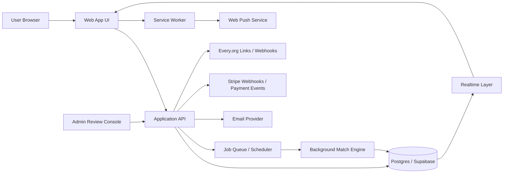
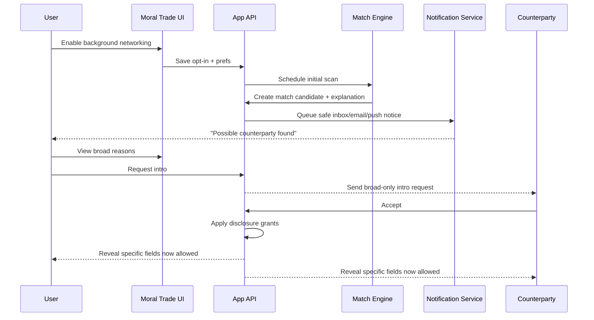

# Building Background Networking for Moral Trade

## Executive summary

Forethought’s design sketch for background networking imagines a “matchmaking marketplace” of personalized helpers that continuously look for promising counterparties, then notify principals or take bounded first steps toward exploring a connection. The design sketch specifically centers wish profiling, a semi-private searchable registry, and careful handling of privacy and surveillance trade-offs. Meanwhile, Moral Trade already has most of the conceptual primitives needed for a constrained implementation: structured offers and wishes, private wish profiles, broad public previews, consent-gated introductions, manual review, notification queues, portability hooks, and an explicit product concept that “background scans” can open notifications, saved-search results, match reports, invite drafts, and introduction plans. At the same time, Moral Trade’s current safety posture explicitly rejects autonomous AI outreach, mass profile ingestion, and private-feed search, and insists on “no surprise exposure,” consent gates, and human review. citeturn3view0turn24search0turn24search1turn24search2

That combination strongly suggests the right first build is **not** the full Forethought passive-data/AI-delegate model. The right first build for Moral Trade is a **privacy-first, server-side, opt-in background networking layer** that works only over explicit user-authored data and manually entered source summaries that users have already consented to store. In practice, that means: periodic background scans over structured wish profiles and saved searches; ranked candidate matches with explanation text; in-app inbox plus email notifications by default; optional web push only after a separate, explicit opt-in; and a consent-gated introduction flow where exact asks, identity details, and contact information remain hidden until both sides agree. This stays faithful both to Forethought’s goal of discovering “wins from coordination” and to Moral Trade’s current design limits. citeturn3view0turn1view1turn5view0turn24search0

The most important product recommendation is therefore:

**Recommended minimal viable implementation**
A background scan service that runs on profile change and on a scheduled cadence, scores matches using explicit fields only, writes match candidates plus explanation artifacts, sends safe notifications that reveal only broad reasons, and opens a mutual-consent reveal workflow. No raw inbox/blog/chat/social ingestion. No private-feed scraping. No autonomous outbound messages. No invisible background processing on the client. Human review for high-risk cases. citeturn24search0turn24search1turn24search2

This recommendation is also the strongest privacy/legal fit. GDPR requires purpose limitation, data minimization, security, and privacy by design; high-risk profiling or other risky processing can require a DPIA before launch. CCPA similarly requires purpose limitation and “reasonably necessary and proportionate” collection/use/retention, and agreements obtained through dark patterns do not constitute valid consent. For a feature that sits close to private beliefs, intent, and counterparty discovery, the compliance-friendly path is narrow scope, explicit consent, reversible controls, purposeful storage, and careful notification UX. citeturn22search2turn22search0turn17search1turn17search8turn17search11turn15view13turn15view12turn18search15turn18search4

**Overall confidence: moderate-high.** Confidence is high on the product/policy fit, because the public Moral Trade pages are unusually explicit about privacy boundaries, review queues, source connection limits, and processors such as Supabase, Stripe, Every.org, and email delivery. Confidence is lower on the exact internal schema and framework choices because those are not publicly documented in the pages reviewed. citeturn24search1turn24search2

## Product fit and recommended scope

Moral Trade is explicitly a pilot for “private counterparty discovery,” “evidence-reviewed moral trade,” and “moral public-good coordination.” Its current methodology says match suggestions are rule-based, based on stated fields and consent-gated previews, and that the present implementation is “centralized for simplicity, portable later.” The wish registry already indexes broad previews only, with exact wishes and identities hidden behind consent and privacy-grant stages. This means background networking is not a conceptual departure for Moral Trade; it is a shift from **user-pulled discovery** to **server-assisted, user-controlled discovery**. citeturn1view1turn6search3turn24search0

Toby Ord’s original moral trade framing is also a good fit for the feature’s purpose. Ord argues that when people hold different moral views, they can still find mutually beneficial exchanges or coordination opportunities such that each thinks the world is better than under no trade, though externalities and perverse incentives still matter. Moral Trade’s public examples and safety rules already operationalize those concerns through baselines, evidence rules, and externality review. A background networking feature should therefore optimize not for generic “engagement,” but for **finding bounded, reviewable, morally legible counterparties and overlap pathways**. citeturn23view1turn23view2turn1view5

### Goals and user stories

The feature should serve four concrete goals.

| Goal | What success looks like |
|---|---|
| Discover missed counterparties | Users receive a small number of plausible introductions they likely would not have found manually. |
| Preserve semi-private matching | Users can evaluate whether a candidate is worth exploring without exposing exact wishes or contact info too early. |
| Improve follow-through | A promising match becomes a draft intro, saved-search hit, or consent request quickly enough to matter. |
| Stay reviewable and non-coercive | The system’s actions remain legible enough for audit, challenge, and safety review. |

Those goals align directly with Forethought’s “people who should know each other get connected,” and with Moral Trade’s existing broad-preview / staged-disclosure / review-queue design. citeturn2view1turn5view0turn24search0

Representative user stories for a first release:

| User | Story | MVI behavior |
|---|---|---|
| Participant | “When I publish or update a wish profile, I want the platform to keep looking quietly for good counterparties without exposing my full ask.” | Background scans create ranked candidates from structured fields only; user sees broad reasons first. |
| Participant | “If a match is strong, I want a nudge, but I do not want the platform to contact people on my behalf.” | In-app inbox + email; no autonomous outreach. |
| Participant | “I want to reveal more only when I choose, and only to a specific counterparty.” | Field-level grants tied to a specific intro workflow. |
| Operator | “I need to inspect risky patterns without defaulting to broad exposure.” | Match reports, risk flags, admin review queue, audit trail. |
| New user | “I want to find counterparties without reading a giant manual or learning a new protocol.” | Opt-in wizard, saved searches, explanation-heavy match cards, conservative defaults. |

These stories are closely supported by Moral Trade’s current language about notifications, saved-search results, match reports, review queues, field-level grants, and the prohibition on surprise exposure or autonomous outreach. citeturn24search0turn24search1turn24search2

### Recommended scope

The feature should be intentionally narrower than the Forethought sketch.

**Build now**
A server-side match service over structured user-entered data, manual source summaries, broad public previews, and saved searches. The service writes candidate matches and explanation vectors, then sends safe notifications and drives a mutual-consent intro workflow. citeturn24search0turn24search1

**Defer**
Passive ingestion of social posts, email, chatbot history, search profiles, or other raw external content. Forethought lists those as one possible future direction, but Moral Trade’s current privacy page says the dashboard stores consent scope, import mode, and manual summaries only, and explicitly does **not** ingest, scrape, or search raw external data. That gap matters: raw-source ingestion materially increases privacy, legal, security, and AI-safety risk. citeturn3view0turn24search1turn37search0turn37search2

A good way to phrase the product boundary internally is:

> **Background networking, not background surveillance.**

That is already the center of both Forethought’s privacy warning and Moral Trade’s current safety posture. citeturn3view0turn5view0turn24search1

## Privacy, legal, and security design

The legal and security design should not be an afterthought here. It is the feature.

Forethought says the central feasibility problem for background networking is the trade-off between useful discovery and surveillance risk. Moral Trade’s privacy page says nearly the same thing in product language: neither full openness nor total opacity is a good default; the current design aims for a “middle layer” of broad previews, field-level grants, manual review, and narrow disclosure tied to specific counterparties or stages. That is exactly the right design principle to preserve in implementation. citeturn3view0turn24search1

### GDPR, CCPA, consent, and data minimization

Under GDPR guidance, organizations must collect data for specified, explicit, legitimate purposes, and process only data that are necessary and proportionate for that purpose. UK/EU regulator guidance also emphasizes privacy by design and by default, and requires a DPIA when processing is likely to result in a high risk to people’s rights and freedoms. The ICO guidance explicitly says a DPIA should begin early, before processing starts, and the EDPB and ICO both emphasize data minimization, purpose limitation, security, and accountability as core principles. citeturn22search2turn22search0turn22search6turn17search1turn17search8turn17search11turn17search15turn22search9

Under CCPA, businesses must honor consumer rights and comply with purpose limitation and data minimization rules; they must limit collection, use, and retention to purposes a consumer would reasonably expect, compatible disclosed purposes, or purposes the consumer agreed to, and such processing must be reasonably necessary and proportionate. The CPPA’s 2024 enforcement advisory calls data minimization a foundational principle, and CPPA materials also emphasize that dark-pattern-obtained agreement is not valid consent. citeturn15view13turn15view12turn18search15turn18search4

For Moral Trade, that translates into five concrete requirements:

| Requirement | Why it matters | Concrete rule for this feature |
|---|---|---|
| Purpose limitation | Prevent silent expansion from “private matching” into generalized profiling | Limit processing purposes to matchmaking, user-requested saved searches, intro workflows, safety review, abuse prevention, and delivery diagnostics. |
| Data minimization | Reduce privacy risk and legal exposure | Do not collect or infer additional fields unless they improve matching enough to justify the privacy cost. |
| Granular consent | Preserve user control over reveal stages | Separate consent for background matching, email, web push, exact-reveal, and source-summary use. |
| Privacy by design/default | Make safe defaults the primary mode | Default to broad previews only, coarse location only, and no notifications on lock-screen with sensitive content. |
| Accountability | Support legal compliance and trust | Audit every disclosure, intro request, admin access, and consent transition. |

This table is an implementation translation of the regulator guidance and of Moral Trade’s current “middle layer” model. citeturn24search1turn22search2turn17search1turn15view13turn15view12

### Threat model

The correct threat model is broader than “someone hacks the database.” NIST’s privacy engineering guidance is useful here because it frames privacy risk not only as unauthorized access, but also as harm arising from authorized processing that becomes problematic in context. For a background networking feature, that distinction is essential: the dangerous action may be a *perfectly authorized* suggestion, notification, or reveal shown in the wrong context, at the wrong granularity, to the wrong party. citeturn20view0turn15view14

Primary threat actors and failure classes:

| Threat | Why it matters here | Required control |
|---|---|---|
| Scrapers and enumerators | Broad previews can be harvested into shadow dossiers | Query throttles, anti-automation controls, preview-only search, no direct identifier search by default, abuse detection. |
| Stalkers / coercive counterparties | Exact asks, availability, or contact info may be weaponized | Staged disclosure, per-intro grants, safe notifications, coarse location, block/report tools, invite caps. |
| Malicious counterparties gaming ranking | Users may stuff profiles or create sybils to reach others | Identity friction, trust signals, rate limits, cohort/reputation gates, anomaly checks. |
| Operators / insiders | Admin access can defeat privacy promises | Least-privilege admin roles, access justification, immutable audit logs, encrypted sensitive columns. |
| Account takeover | Revealed exact wishes/contact details are high-value targets | Step-up authentication before sensitive reveal, session hardening, risk-based re-authentication, MFA/passkey support. |
| Notification leakage | Email subject lines or push previews can expose private wishes to bystanders | Neutral copy in push/email subjects, user-configurable preview privacy, opt-in per channel. |
| Future raw-source ingestion and AI synthesis | Untrusted external content creates prompt-injection and provenance problems | Keep raw-source ingestion out of MVI; if added later, isolate source provenance and treat external content as untrusted. |

The account-takeover point is especially important. NIST SP 800-63B provides current digital identity guidance for remote authentication, and OWASP emphasizes stronger web application verification standards and API security requirements. For any workflow that upgrades disclosure from broad preview to exact ask or contact-level reveal, step-up auth is justified. citeturn35search2turn35search10turn16view0turn16view1turn36search6turn36search3

If Moral Trade ever moves from manual source summaries toward automated AI-assisted synthesis of external content, prompt injection becomes a first-order risk rather than a side issue. OWASP’s GenAI materials rank prompt injection as a top LLM threat, and academic work on indirect prompt injection shows that untrusted external content can hijack LLM-integrated applications. That is a decisive reason to defer passive ingestion from the first release. citeturn37search0turn37search9turn37search2turn37search1

### Security controls

The implementation should map to OWASP ASVS 5.0 for the web app overall and to the OWASP API Security Top 10 for the background networking API surface. ASVS is designed as a verification baseline for web application technical controls, while OWASP’s API materials highlight broken object-level authorization, broken authentication, and unrestricted resource consumption as persistent API risks. Those are exactly the issues a matching/disclosure system can get wrong. citeturn16view0turn16view1turn36search6turn36search3

Recommended controls:

| Control family | Concrete control |
|---|---|
| Authorization | Object-level authorization on every read/write of wish profiles, matches, grants, intro requests, notifications, and exports. |
| Data segregation | Separate tables or schemas for public previews, private profiles, grants, and admin-only risk artifacts. |
| Encryption | TLS everywhere; encrypt especially sensitive columns at rest; keep webhook secrets and encryption keys outside app code. |
| Session and auth | Step-up auth for exact-reveal actions; support MFA/passkeys; short-lived admin sessions. |
| Logging and audit | Tamper-evident logs for reveals, admin views, grant changes, export/deletion requests, and notification sends. |
| Anti-abuse | Rate limits, invite caps, search caps, device/IP heuristics, abuse reporting, and moderation queues. |
| Third-party boundary controls | Verify Stripe webhooks; isolate email provider payloads; minimize data sent to notification providers. |
| Safe defaults | No sensitive data in subjects/push bodies; no automatic reveal; no automatic outbound introductions. |

These controls are well aligned with both regulator guidance on secure processing and with Moral Trade’s stated goals of reviewability and narrow disclosure. citeturn22search9turn17search12turn24search1turn24search2turn27view2

## Architecture, protocols, and data model

### Recommended system architecture



This architecture intentionally keeps the “background” part primarily **server-side**. The client should not be doing hidden continuous networking to discover matches. Instead, the server runs scans on profile changes and on a schedule, stores results, and then updates active clients via realtime channels or notifies inactive clients via email/push if they opted in. That model is more resource-efficient, more auditable, and more compatible with Moral Trade’s current posture than a client-heavy background agent. Forethought’s sketch is compatible with this architectural choice; the “helpers” do not need to live on the user’s device. citeturn3view0turn15view0turn15view11

### Current integration points and likely shortest path

Moral Trade’s public privacy page names **Supabase** for authentication and database storage, **Stripe** for card/payout/payment objects, **Every.org** for direct donation routes, and an external email provider for queued notifications. Supabase’s official docs say realtime database changes can be subscribed to from web applications, and recommend **Broadcast** over **Postgres Changes** for better scalability and security. They also document Realtime Authorization through RLS policies and private channels. Stripe’s docs confirm webhook-based delivery of asynchronous event payloads to application endpoints, and Every.org provides public-key-authenticated search, donate-link parameters, and webhook options. That combination makes a Supabase/Postgres-centered implementation the lowest-assumption and shortest-path option. citeturn24search1turn27view0turn27view1turn27view2turn27view3turn27view4

### Data model and storage

A good first schema keeps public preview, private profile, disclosure state, and operational artifacts separate.

| Table / collection | Purpose | Sensitive? | Notes |
|---|---|---|---|
| `participants` | Account, cohort, trust level, notification prefs | Moderate | Link to auth user, not directly to public preview by default. |
| `wish_profiles_private` | Exact offers, asks, constraints, durations, evidence preferences, notes | High | Separate from public search surface. |
| `wish_previews_public` | Broad summary, cause areas, coarse location, openness flags | Low-to-moderate | Searchable registry surface. |
| `source_connections_summary` | Consent scope, import mode, manual summary, freshness timestamp | High | No raw external content in MVI. |
| `saved_searches` | User search criteria and notification thresholds | Moderate | Drives background scans. |
| `match_candidates` | Candidate pair, score, explanation vector, state, expiry | Moderate | Store only what is needed to render and review. |
| `disclosure_grants` | Per-field, per-counterparty reveal permissions | High | Central privacy primitive. |
| `intro_requests` | Mutual-consent workflow state | High | Separate from match computation. |
| `notifications` | in-app/email/push queue and delivery state | Moderate | Store safe payloads only. |
| `risk_flags` | Anti-abuse, coercion, anomaly, review status | High | Admin-only. |
| `audit_events` | Consent changes, reveals, exports, admin views, failures | High | Write-once preferred. |

This is directly consistent with Moral Trade’s existing separation between public profile data and private wish-profile data, with its field-level grants, queued notifications, admin review, and portability/export stance. citeturn24search1turn5view0

A minimal scoring model for `match_candidates` should avoid opaque inference at first. Recommended inputs:

- cause-area overlap or complementarity
- trade-mode compatibility, such as pledge-open vs payment-open
- duration/evidence compatibility
- mutual minimum-importance thresholds where available
- location/coarse-availability compatibility
- saved-search hit strength
- operator-defined safety penalties

This fits Moral Trade’s current rule-based matching and keeps the system legible enough to audit. citeturn1view1turn6search3

### Protocol choices

**Recommendation for the MVI:** use **server-side scheduled scans**, **SSE or Supabase Realtime/WebSockets for active sessions**, **email as the universal fallback**, and **optional Web Push only for users who explicitly enable it**. Do **not** depend on Periodic Background Sync. Do **not** use WebRTC in the first release.

| Option | Best use in Moral Trade | Strengths | Weaknesses | Recommendation |
|---|---|---|---|---|
| Short polling | Basic fallback for inbox refresh | Simple, universal | Wastes requests; worse battery/network profile if too frequent | Fallback only, with long intervals and backoff |
| SSE / EventSource | Active browser tab receiving match and intro status updates | Simple one-way stream over HTTP; good fit for notifications/inbox | One-way only; browser tab must be open | Strong option for active session updates |
| WebSockets | Active session with richer bidirectional interactions | Full duplex; low-latency; useful for inbox, counters, acknowledgement flows | More infra/state complexity than SSE | Good if using Supabase Realtime already |
| Web Push | Inactive app / re-engagement | Can deliver while app/user agent inactive; service worker wakes to handle message | Requires explicit permission; battery/resource considerations; platform quirks | Optional opt-in channel only |
| One-off Background Sync | Retry user-triggered actions when connectivity returns | Good for “send later” semantics | Not for discovery scans | Useful only for retrying queued actions |
| Periodic Background Sync | Browser-run periodic discovery | Background periodic task model | Experimental; installed-PWA-only in Chrome; privacy/security concerns; poor interoperability | Not recommended for MVI |
| WebRTC data channels | Peer-to-peer live collaboration after both sides connect | Encrypted data channels via DTLS | NAT/TURN complexity; not needed for match notifications | Defer unless real-time peer sessions become core |

The factual basis for these trade-offs comes from the standards and platform docs: EventSource/SSE is a server-to-client persistent HTTP stream; WebSocket is full-duplex; Push can deliver while the app is inactive and can start a service worker; Push activation can increase resource use and battery use; Page Visibility can be used to reduce hidden-tab work; Periodic Background Sync is still experimental, Chrome-restricted to installed PWAs, and has documented privacy/security concerns in standards discussions; and RTCDataChannel is encrypted with DTLS. citeturn15view4turn15view5turn15view6turn15view7turn15view8turn15view0turn15view1turn15view11turn15view2turn15view3turn34view0turn34view1

Two additional battery/network observations matter in practice. First, classic mobile-network research shows that intermittent small transfers can consume disproportionately high energy because radios linger in higher-power tail states after transfers. Second, later empirical work comparing polling, long polling, and WebSockets on Android devices concluded that the communication method and configuration materially affect power use. That is another reason to avoid frequent polling and to concentrate background discovery on the server side, not the client. citeturn32view0turn32view1

### Implementation options by stack

| Stack | Realtime option | Background work | Best fit |
|---|---|---|---|
| **Supabase-first** | Supabase Realtime Broadcast or Postgres Changes | Cron/queue + SQL triggers + Edge/server functions | Best if staying closest to current public processor set |
| **Node / Express** | SSE or Socket.IO | BullMQ / pg-boss / worker process | Best general-purpose choice if you want maximum custom control |
| **Django** | Django Channels | Celery / RQ | Best if the broader product becomes Python-heavy or analyst-heavy |
| **Rails** | Action Cable | Active Job / Sidekiq | Best if you prefer strong convention and integrated CRUD/admin flows |
| **Serverless** | API Gateway WebSockets | Lambda + scheduler + queue | Best for bursty workloads and ops minimization, weaker for complex stateful review workflows |

Official docs support all of these core building blocks: Socket.IO provides real-time event-based communication; Django Channels extends Django beyond HTTP and uses channel layers; Rails Action Cable integrates WebSockets into Rails; and AWS API Gateway supports WebSocket APIs with Lambda or HTTP backends. If Moral Trade remains centered on Supabase, note that Supabase recommends Broadcast over Postgres Changes for scalability/security and supports topic authorization via RLS. citeturn28search12turn28search1turn28search5turn28search2turn28search3turn28search11turn27view0turn27view1

### Sample API contracts

A clean API surface for the feature could look like this:

```http
POST /v1/background-networking/opt-in
PATCH /v1/background-networking/preferences
POST /v1/saved-searches
GET  /v1/matches?state=new
POST /v1/matches/{matchId}/dismiss
POST /v1/matches/{matchId}/request-intro
POST /v1/intros/{introId}/accept
POST /v1/intros/{introId}/decline
POST /v1/disclosure-grants
GET  /v1/notifications
POST /v1/push-subscriptions
DELETE /v1/push-subscriptions/{id}
```

Example contract for a match candidate:

```json
{
  "matchId": "m_01JV7X...",
  "state": "new",
  "broadPreview": {
    "counterpartyType": "individual",
    "causeAreas": ["Animal welfare", "Global poverty"],
    "coarseLocation": "Remote",
    "tradeModes": ["pledge"]
  },
  "explanation": {
    "summary": "Strong overlap on pledge-based reciprocal trade and annual evidence cadence.",
    "factors": [
      {"code": "CAUSE_OVERLAP", "weight": 0.42},
      {"code": "EVIDENCE_COMPATIBLE", "weight": 0.21},
      {"code": "DURATION_COMPATIBLE", "weight": 0.18}
    ]
  },
  "revealState": "broad_only",
  "safetyState": "clear",
  "expiresAt": "2026-06-10T00:00:00Z"
}
```

Example contract for a per-field disclosure grant:

```json
{
  "introId": "i_01JV80...",
  "granteeParticipantId": "p_abc123",
  "fields": [
    {"name": "exact_ask", "scope": "specific"},
    {"name": "contact_email", "scope": "contact"}
  ],
  "expiresAt": "2026-06-20T00:00:00Z"
}
```

### Sample implementation snippets

A minimal Node/Express endpoint for safely requesting intro on a match:

```ts
// TypeScript / Express
import type { Request, Response } from "express";

export async function requestIntro(req: Request, res: Response) {
  const actorUserId = req.auth!.userId;
  const { matchId } = req.params;

  // 1) Load match candidate and verify actor is one of the principals.
  const match = await db.matchCandidates.findById(matchId);
  if (!match || match.userId !== actorUserId) {
    return res.status(404).json({ error: "match_not_found" });
  }

  // 2) Enforce state machine.
  if (!["new", "viewed"].includes(match.state)) {
    return res.status(409).json({ error: "invalid_match_state" });
  }

  // 3) Create intro request with broad-only visibility by default.
  const intro = await db.introRequests.create({
    matchId,
    requesterUserId: actorUserId,
    counterpartyUserId: match.counterpartyUserId,
    revealState: "broad_only",
    state: "awaiting_counterparty",
  });

  // 4) Queue a safe notification with no exact ask/contact details.
  await notifications.enqueue({
    userId: match.counterpartyUserId,
    kind: "intro_request",
    safePayload: {
      introId: intro.id,
      title: "New possible counterparty",
      body: "Someone requested a consent-gated introduction.",
    },
  });

  return res.status(201).json({ introId: intro.id, state: intro.state });
}
```

A Supabase/Postgres-style policy direction for realtime topic access:

```sql
-- Private realtime topic naming convention: user:{uuid}:matches
create policy "user can receive own match updates"
on "realtime"."messages"
for select
to authenticated
using (
  split_part(realtime.topic(), ':', 2)::uuid =
  auth.uid()
);
```

This is closely aligned with Supabase’s documented use of private realtime channels and RLS-based authorization. citeturn27view1

### Merely future-facing privacy tech

If Moral Trade eventually wants stronger privacy for cross-registry or multi-operator matching, private set intersection and related techniques are relevant. Signal’s contact-discovery discussion explains why naive upload or naive hashing of sensitive identifiers is privacy-poor, while PIR-PSI research shows that private contact discovery can be made practical enough for large asymmetric sets, and Google’s open-source Private Join and Compute illustrates a production-oriented privacy-preserving join primitive. This is useful for a **future** decentralized / federated roadmap, but it is not required for the moraltrade.org MVI. citeturn38view2turn38view0turn38view1

## UX, testing, and operations

### Core UX flow

The UI must make the user feel that the system is helpful but not sneaky. Moral Trade’s own pages already provide the correct interaction model: broad reasons first, specifics only after consent, no autonomous outreach, and enough reviewability to investigate suspicious activity. On top of that, browser guidance says notification permission prompts should only occur in response to a clear user gesture. citeturn24search2turn15view10

A recommended sequence is below.



### UX flows and UI components

Recommended UI components:

| Screen / component | Behavior |
|---|---|
| Opt-in module | Explain what will be scanned, how often, and what will not happen. Separate toggles for in-app, email, and push. |
| Background networking settings | Cadence, cause-area scope, trade-mode scope, notification quiet hours, and sensitivity level. |
| Match inbox | Cards with broad preview, explanation bullets, risk status, and buttons for dismiss/snooze/request intro. |
| Consent/reveal modal | Explicit side-by-side list of fields that will be revealed if the user proceeds. |
| Activity indicators | “Background scans enabled,” “Last scan,” “Matches waiting,” “Push off/on,” “Safe preview mode.” |
| Safety/report actions | Block, report, hide from future scans, revoke grants, cancel intro. |
| Audit / history view | Who saw what, when, and under which grant. |

Important copy rules:

- Notifications should use **safe, content-minimized text** such as “New possible counterparty” rather than revealing exact cause pairings or asks in lock-screen contexts.
- The opt-in screen should explicitly say what the system **does not** do: no automatic outreach, no private-feed mining, no mass import of external data.
- The consent modal should be symmetrical, concise, and non-coercive, which is important for both browser permission UX and CCPA dark-pattern risk. citeturn5view0turn24search1turn15view10turn18search4

### Testing strategy and metrics

The feature should be tested as a privacy/security product, not merely as a matching algorithm.

| Test layer | What to test |
|---|---|
| Unit tests | Scoring rules, explanation generation, state machines, expiry logic, notification templating |
| Authorization tests | Object-level auth, grant scoping, forbidden field access, admin-role boundaries |
| Contract tests | Match, intro, and grant API schemas; webhook verification; client compatibility |
| End-to-end tests | Opt-in to notification, request intro, mutual consent, grant revoke, export/delete |
| Abuse tests | Enumeration, spam, repeated intro attempts, replay, timing-based probing |
| Privacy tests | No exact wishes in logs, analytics, preview cards, email subjects, or push bodies |
| Performance tests | Batch scan duration, queue throughput, realtime connection load, reconnect storms |
| Battery/network tests | Bytes transferred per active/inactive user per day, average live connection time, polling fallback rate |

ASVS and OWASP API guidance are the right baseline for acceptance criteria on auth, session, API authorization, and resource consumption. On the client side, use the Page Visibility API to suspend or degrade active realtime updates when the tab is hidden, and verify that hidden-tab behavior actually reduces network and CPU activity. citeturn16view0turn36search6turn36search3turn15view11

Recommended success metrics for rollout:

| Metric | Why it matters |
|---|---|
| Opt-in rate | Measures whether the UX feels safe enough to enable |
| Notification enable rate by channel | Indicates user trust in email vs push vs in-app |
| Matches viewed per active user | Basic feature adoption |
| Request-intro rate | Whether suggestions feel actionable |
| Mutual-accept rate | Quality of candidate ranking |
| Time to first valuable match | Perceived utility |
| Block/report rate | Safety quality |
| Sensitive-reveal cancellation rate | Whether the reveal UX is too aggressive or too vague |
| False-positive complaint rate | Trust and ranking quality |
| Notification disable / browser-block rate | Over-notification signal |

## Roadmap, effort, backlog, and open questions

### Phased roadmap

The roadmap should preserve the current pilot’s legibility while incrementally adding “background” behaviors.

| Phase | Scope | Estimated effort | Exit criteria |
|---|---|---:|---|
| Foundation | Schema prep, audit log, consent state machine, match explanation format, feature flags | 2–3 weeks | No-op feature flag deployed; test harness ready |
| Minimal viable implementation | Scheduled scans over explicit fields, saved searches, match inbox, email notifications, intro workflow, admin review hooks | 4–6 weeks | End-to-end flow live for a small pilot cohort |
| Realtime refinement | Active-session SSE/WebSocket updates, safer notification controls, snooze/quiet hours, better explanations | 3–5 weeks | Active sessions update without polling; complaint rate acceptable |
| Optional push | User-gesture-triggered notification permission, service worker, push subscriptions, safe push templates | 2–3 weeks | Push enabled only for explicit opt-ins; low disable/block rate |
| Advanced matching | Better rule weighting, cohort-specific heuristics, operator tooling, analytics on match quality | 3–4 weeks | Better intro acceptance without privacy regressions |
| Deeper future work | Decentralization, privacy-preserving interoperability, or constrained AI-assisted summarization | 6–10+ weeks | Requires fresh DPIA and likely new governance review |

These estimates assume roughly **2 full-stack engineers, 0.5 security/privacy engineering, 0.5 design, and part-time PM/reviewer support**. If the current codebase is already strongly Supabase/Postgres-centered, the MVI is likely toward the lower end; if the current system needs major refactoring around grants, audits, or notification infrastructure, toward the higher end.

### Prioritized backlog

| Priority | Item | Why first |
|---|---|---|
| Must | Explicit opt-in and preferences model | Legal/safety foundation |
| Must | `match_candidates` + `disclosure_grants` schema | Core feature primitives |
| Must | Scheduled server-side scans over structured fields | Background behavior without surveillance creep |
| Must | Broad-only match inbox with explanations | User-facing value and auditability |
| Must | Intro request / accept / decline state machine | Converts discovery into action |
| Must | Safe email notification path | Universal delivery channel |
| Must | Audit log and admin review hooks | Safety and accountability |
| Should | Realtime active-session updates | Better UX while tab is open |
| Should | Quiet hours, snooze, per-search thresholds | Prevent over-notification |
| Should | Step-up auth on sensitive reveal | Stronger protection for private data |
| Should | Abuse controls and ranking penalties | Prevent gaming and harassment |
| Could | Web push for explicit opt-ins | Re-engagement channel |
| Could | Cohort-specific ranking templates | Better quality for early communities |
| Later | AI-assisted summarization of manual source notes | Higher usefulness, much higher risk |
| Later | PSI/federated interoperability | Good strategic long-term option, not needed now |

### Failure modes and mitigation

| Failure mode | Likely cause | Mitigation |
|---|---|---|
| Users feel surveilled | Vague copy, too-broad inference, surprise notifications | Hard-scope the feature to explicit fields, use plainlanguage opt-in copy, show “what is being scanned.” |
| Too many weak matches | Loose scoring, no caps | Per-user daily caps, explanation-based tuning, feedback loop from dismissals. |
| Privacy leakage via notifications | Sensitive text in email subjects or push previews | Safe templates only; no exact causes/asks in lock-screen-visible text. |
| Unauthorized reveal | Missing object-level auth or grant bugs | Enforce grant-based reads server-side; strong API auth tests. |
| Scraping of the broad-preview layer | Search enumeration | Rate limits, login gates for some queries, abuse heuristics, honeypots where appropriate. |
| Admin overreach | Unbounded console access | Fine-grained roles, reason-for-access capture, audit review. |
| Realtime instability | Connection storms or over-complex RLS | Use active-session channels only; keep RLS rules simple; fall back to inbox reload. |
| Battery/network complaints | Client-side polling or overly chatty realtime | Server-side scans, Page Visibility gating, low-frequency fallback polling. |
| Consent challenge under CCPA/GDPR | Symmetry or transparency problems | Clear copy, purpose-specific toggles, reversible settings, audit logs, no dark patterns. |

### Recommended minimal viable implementation

If I had to pick one implementation plan to ship first, it would be this:

1. Keep the current registry model: broad previews public/searchable, private wishes private.
2. Add a **background match job** that runs on profile changes and every few hours.
3. Score matches using **only explicit structured fields** and manual source summaries already stored by consent.
4. Write match candidates plus human-readable explanation artifacts.
5. Deliver results to a **match inbox** and optional **email**.
6. Allow users to **request a consent-gated intro**, not send messages automatically.
7. Reveal exact asks or contact details only via **per-field grants** after both sides consent.
8. Route suspicious cases to the **existing review/admin console**.
9. Add active-session SSE/WebSocket later.
10. Add web push only after the base flows are stable and only through a user-gesture-triggered opt-in.

That is the smallest build that materially moves Moral Trade toward Forethought’s background networking vision *without* violating Moral Trade’s current privacy and safety commitments. It also creates a clean platform for later extensions, including better ranking, cohort-aware matching, and potentially privacy-preserving interoperability. citeturn3view0turn24search0turn24search1turn24search2turn27view0turn15view10

### Open questions and limitations

The public sources reviewed do not disclose Moral Trade’s exact internal framework, schema, job infrastructure, or current auth/session details beyond the use of Supabase cookies and storage, plus Stripe, Every.org, and email providers. That means the architecture recommendations above are high-confidence at the product, privacy, and API-pattern level, but some implementation choices remain assumptions. citeturn24search1

The main questions worth resolving before implementation are:

| Open question | Why it matters |
|---|---|
| What is the actual current app framework and deployment model? | Affects whether Supabase-first, Node, Rails, Django, or serverless is genuinely cheapest. |
| What are expected active-user counts and scan cadence targets? | Determines whether SSE is enough or whether dedicated websocket infra is needed. |
| Which jurisdictions matter beyond GDPR/CCPA? | Could materially change consent and retention rules. |
| Will Moral Trade remain “manual source summary only” for the next 12 months? | Decides whether prompt-injection and inferred-data risks stay mostly deferred. |
| Is a PWA planned? | Changes whether web push and periodic background features are attractive at all. |
| How much anonymity or pseudonymity does the pilot want to preserve? | Affects preview design, invite friction, and anti-abuse choices. |

The most important unresolved strategic question is not technical. It is governance: **how far Moral Trade wants to move from explicit, reviewable matching toward more agentic or inferred matchmaking.** The engineering recommendation in this report is to move one step, not five.