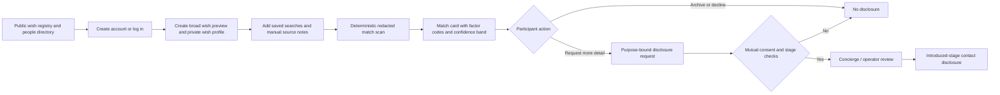
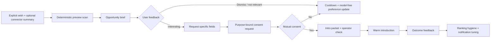

# Moral Trade Background Networking Audit and Improvement Roadmap

## Executive summary

Moral Trade’s current Background Networking feature is best understood as a **privacy-first, contract-heavy pilot** rather than a proven high-throughput networking product. The public site, technical spec, privacy policy, disclosure contract, match contract, and transparency report together show a system built around broad previews, staged disclosure, deterministic rule-based matching, manual review, and explicit anti-abuse guardrails. Those choices align closely with Forethought’s core concern that background networking is powerful but double-edged: too much visibility enables surveillance and exploitation, while total secrecy can enable collusion. In several respects, Moral Trade is already **more explicit and conservative** than Forethought’s sketch on privacy, disclosure, and anti-automation boundaries. citeturn8view0turn22view0turn23view0turn20view5turn31view0

The strongest current assets are the **disclosure lattice** and related controls. Moral Trade already distinguishes registry, consent, and introduced stages; hidden, broad, specific, and contact access levels; field-level grants; expiry-aware access; owner approval; contact disclosure only at the introduced stage; anti-enumeration budgets; sparse-result suppression; RLS on private background tables; field encryption for sensitive background text; and a self-serve “DELETE BACKGROUND NETWORKING” flow that removes the matching layer without forcing full account deletion. Those are unusually substantive design choices for an early pilot. citeturn22view0turn8view3turn8view4turn9view0turn20view0turn20view3turn23view1

The central weakness is not the normative design; it is the **operational gap** between the published design and live evidence of usage. The public snapshot reports **0 live proposals, 2 public profiles, and 0 completed agreements**, while the Q2 2026 transparency report shows **0 reviewed match suggestions, 0 opportunity briefs delivered, 0 intro packets created, 0 disclosure grants created, and 0 participant reports submitted**. That means the current feature has strong policy scaffolding, but little public evidence yet that it reliably surfaces valuable counterparties, advances consented introductions, or produces learning loops about match quality. citeturn2view4turn19view0

Relative to Forethought’s Background Networking sketch, Moral Trade’s biggest gaps are clear. Forethought imagines attentive background helpers, passive delegate mode over user-connected sources, proactive wish injection through fluent interfaces, AI-assisted synthesis, searchable semi-private registries, and further tooling that can take the first steps toward serious exploration. Moral Trade already has the semi-private registry, a passive/proactive conceptual split, manual source summaries, portability hooks, and shadow-only AI scaffolding, but it still keeps live source ingestion disabled, AI summarization in shadow mode, private-overlap computation at design-only status, and most “follow-through” artifacts largely conceptual or unused. citeturn31view0turn28view4turn28view6turn8view3turn8view4turn28view0turn19view0

The best improvement strategy is therefore **capability expansion without abandoning the defense-favoured posture**. In the short term, Moral Trade should improve onboarding, opportunity packaging, notification discipline, and authenticated accessibility. In the medium term, it should operationalize opt-in connector pilots, warm-introduction packets, and richer feedback loops for match quality. In the long term, it should graduate carefully measured AI assistance and narrow privacy-preserving overlap computation only after DPIA, external review, and demonstrable user benefit. citeturn31view0turn8view3turn20view0turn7view6

**Credence:** high for conclusions about public contracts, privacy/security boundaries, and published pilot state; moderate for conclusions about the signed-in dashboard’s moment-to-moment UX because the dashboard itself is gated behind authentication and was not directly exercised here. The audit therefore relies on Moral Trade’s public pages, public JSON contracts, public transparency metrics, login/signup flows, and unauthenticated surfaces rather than authenticated interaction recordings. citeturn26view0turn32view0turn33view0turn8view0turn4view0

## Research scope and current state

The user-prioritized source order was followed as requested: **moraltrade.org** first, then **forethought.org**. The complete prioritized site list is: **moraltrade.org; forethought.org**. Moral Trade exposes enough public material to support a serious audit even without authenticated access: the Background Networking page, privacy and safety pages, measurement and accessibility pages, the technical spec, match/disclosure/security JSON contracts, the wish registry, login/signup pages, pilot status, and the transparency report. Forethought’s design-sketch page then provides the normative comparison target. citeturn8view0turn20view0turn2view3turn4view0turn22view0turn23view0turn23view1turn10view0turn26view0turn32view0turn2view4turn19view0turn31view0

Moral Trade describes Background Networking as a **“conservative matching layer”** that compares broad public previews, saved preferences, and manual source notes, and it repeats three boundary commitments prominently: **broad previews first, consent before detail, and no autonomous outreach**. The dashboard is described as the working surface for wish profiles, saved searches, manual source notes, profile export, and suggestion review. citeturn8view0turn21search0

The current pilot is explicitly not positioned as a liquid marketplace. Moral Trade says the public site is a reviewed pilot whose strongest current uses are understanding the mechanism, cloning worked examples, joining a small cohort, and submitting reviewable proof artifacts. Public snapshot metrics are still tiny: **0 live proposals, 8 worked examples, 2 public profiles, 0 completed agreements**. citeturn2view4turn29search4

That limited operating footprint matters for evaluation. A lot of the current product’s maturity is in **contracts and public validators** rather than in demonstrated marketplace throughput. The technical spec publishes required fields, states, entities, privacy classes, schemas, API routes, and factor-code vocabularies; the transparency report publishes aggregate counts with suppression; and the measurement page frames the product around clarity and safety rather than engagement. citeturn4view0turn19view0turn15view3

The current public flow can be summarized as follows. citeturn8view0turn10view0turn26view0turn22view0



## Audit findings

**UX flows.** The public UX is coherent and cautious. Signup is intentionally minimal—display name, email, password, optional location, and agreement to Terms and Privacy—followed by a “start with one low-risk action” step that offers cloning a worked example, creating a broad wish preview, or logging a public-good action. Login explains that account access unlocks publishing public offers, expressing interest, reviewing private match signals, and managing saved searches, privacy grants, and source permissions. The wish registry is browseable but constrained to public preview fields only, and each result reiterates that exact asks and contact details require mutual consent. For serious introductions, Moral Trade offers a concierge intake that goes to an operator queue first and records intent, trade shape, privacy constraints, and an SLA before anyone receives contact details or exact wishes. citeturn32view0turn26view0turn10view0turn9view0

**Data model.** The data model is unusually explicit for a pilot. The technical spec names participants, public profiles, private wish profiles, visibility controls, source connections, source notes, saved searches, trade formats, offers, baseline statements, evidence claims, artifacts, reviewer decisions, challenges, appeals, disputes, privacy grants, match suggestions, notifications, and payment records. For background networking specifically, the published RLS/encryption audit says the schema covers private wishes, manual source notes, saved searches, match suggestions, grants, concierge requests, notifications, helper runs, risk signals, and audit events. That public contract structure is a real strength because it limits ambiguity about what the system is allowed to know and do. citeturn4view0turn8view3turn8view4

**Matching logic.** Current matching is deterministic and deliberately narrow. The methodology page says the synthesis layer is deterministic, not LLM interviewing, and that current match suggestions are rule-based rather than AI inference. The match contract says approved inputs are cause areas, trade modes, verification preferences, location sensitivity, privacy stage, privacy constraints, and stated exclusions. Published factor codes include cause-area overlap, cause-area complementarity, trade-mode compatibility, verification-preference compatibility, location constraint satisfaction, privacy-stage compatibility, privacy-safe preview, stated exclusions clear, and human-review required. The system also publishes participant-facing explanation templates and confidence bands, while explicitly stating that it does **not** infer protected traits, ideology, psychology, or hidden preferences. citeturn28view4turn23view0turn8view2

**Follow-through after a match.** This is where the current feature feels thin in execution. The methodology page says background scans can open notifications, saved-search results, match reports, network invite drafts, brokerage bounties, and introduction plans, and the transparency report tracks opportunity briefs, intro packets, and reviewed match suggestions. But publicly reported counts in Q2 2026 are all zero across these surfaces, so these are better described as **workflow affordances or instrumentation categories** than proven operating lanes. citeturn28view0turn19view0

**Privacy and consent.** This is the feature’s strongest area. Moral Trade repeatedly frames background networking as a privacy trade-off and solves it through broad previews, field-level grants, manual review, and staged disclosure tied to specific counterparties or stages. The disclosure contract formalizes a lattice of access levels—hidden, broad, specific, contact—and audience stages—registry, consent, introduced. Exact wishes, asks, capabilities, constraints, verification preferences, and source summaries require the consent stage and a narrow purpose; contact details require the introduced stage, explicit owner approval, and an MFA step-up. Raw source notes and private-feed payloads remain redacted. That architecture is directly responsive to Forethought’s “surveillance versus secrecy” tension. citeturn20view5turn22view0turn31view0

**Opt-in and opt-out controls.** Opt-in is strong and granular. Public profiles appear only after an offer is published or the participant explicitly opts into visibility. External sources require separate permissions, consent notes, retention windows of 30, 90, 180, or 365 days, and category-limited field influence. Optional AI shadow-mode review is separately consented and may use approved summaries only. Discoverability can be disabled, public preview sharing can be turned off, analytics can be turned off for the current browser, and the entire background-networking layer can be deleted self-serve without deleting the whole account. citeturn11view0turn20view0turn20view3turn20view5

**Notification cadence.** The public documentation is more mature on disclosure safety than on frequency management. It clearly states that the dashboard exposes in-app, digest email, and web-push preference rows by event type, and that background-networking email copy stays generic and leaves exact wishes and sensitive details in the dashboard. But the public materials reviewed here do **not** specify explicit per-event frequency caps, batching windows, quiet hours, escalation rules, or relevance thresholds for immediate versus digest delivery. That omission is a meaningful design gap because background networking can quickly become noisy or coercive if notifications feel pushy. citeturn34view0turn20view7

**Safety and security.** Safety posture is unusually concrete. Moral Trade blocks violence, illegal acts, fraud, extortion, doxxing, harassment, exploitation, and pressure on vulnerable people. Background networking boundaries forbid autonomous AI outreach, mass profile ingestion, and private-feed search. Security controls published as implemented include HSTS/CSP headers, private no-store cache policy, Supabase auth cookies, app-level field encryption for background-networking sensitive text with versioned keys, server-only secret management, MFA for operator consoles and review mutations, participant session review/revocation, abuse throttling, and incident reporting. At the same time, the site is honest about non-claims: platform-wide field-level encryption is not claimed, provider-console/device/key-rotation evidence is still a scale prerequisite, and sensitive-admin scale remains blocked. citeturn2view3turn23view1turn6view4

**Scalability and observability.** The product is centralized first, portable later. Moral Trade says export/import/schema endpoints exist so wish profiles and source summaries could move to more interoperable registries later. It also publishes performance targets, public-route baselines, route families that include background networking, and rate-limit surfaces such as saved-search writes, match-signal evaluations, and wish-registry searches. The disclosure contract also publishes concrete anti-enumeration settings: daily registry query budget 80, sparse-result privacy floor of at least 3 results, and repeated detail-request limits over a 7-day window. These are the right primitives, but the pilot’s tiny usage footprint means the site has not yet demonstrated that those mechanisms remain usable and comprehensible under meaningful volume. citeturn28view6turn36view0turn22view0turn19view0

**Accessibility.** The accessibility page is candid and directionally good. It targets WCAG 2.1 AA-oriented QA, names keyboard-first checks, navigation/search/forms/evidence workflow priorities, and says public pages include a skip link and visible text labels rather than color alone. The important caveat is that a full manual screen-reader pass has **not** yet been published for every authenticated workflow, and some prototype workflows still depend on signed-in data states requiring scenario-specific QA. For Background Networking specifically, that means the riskiest accessibility unknowns are precisely in the authenticated dashboard where saved searches, grants, suggestions, and source permissions live. citeturn7view6turn7view9

**Implementation stack.** The public materials disclose enough to infer the broad stack shape, but not every layer. Documented components include server-rendered public routes, REST-like API routes, Supabase for authentication and database storage, Stripe for payment objects when enabled, Every.org for off-site donation routes, an external email provider for notifications, and npm-based route-measurement tooling (`npm run measure:routes`). What is **not** publicly named in the reviewed material is the exact front-end framework, background job framework, or test runner, so those specifics should not be over-asserted. citeturn20view0turn15view3turn4view0

## Forethought gap analysis

Forethought’s design sketch imagines a background layer that continuously but carefully looks for valuable coordination opportunities: passive delegate mode over connected sources, proactive wish injection, AI-assisted synthesis, semi-private searchable registries, and tools that can take the first exploratory steps toward serious collaboration. Moral Trade already implements the **registry**, the **semi-private disclosure architecture**, and the **no-surprise/no-autonomous-outreach posture**; it also already distinguishes passive and proactive participation modes conceptually. But it stops short of Forethought’s more capable helper model in several crucial places. citeturn31view0turn28view4turn8view0

The biggest positive surprise from this comparison is that Moral Trade is **already highly aligned with Forethought’s deepest caution**. Forethought says privacy and surveillance are the major unresolved challenge for background networking, and Moral Trade has built much of the product around that trade-off: broad previews, stage-bound grants, narrow-purpose disclosure, anti-probing controls, redaction invariants, and refusal to ingest raw private feeds. In other words, the existing feature already occupies a defense-favoured region of the design space. citeturn31view0turn20view5turn22view0

The main misses are capability misses rather than governance misses. Forethought’s passive mode includes connected social/chat/search data securely distilled into up-to-date hopes, intent, and capabilities. Moral Trade’s current source model stores **consent scope, import mode, and manual summaries only**; live connector workers are explicitly blocked; AI shadow summarization is shadow-only; and private-overlap computation is design-only. That is prudent, but it means the current feature does not yet realize the “attentive helper bustling in the background” that Forethought describes. citeturn31view0turn8view3turn8view4turn20view0

Another gap is **opportunity packaging**. Forethought’s sketch is about surfacing especially promising connections at the right time. Moral Trade has the conceptual pieces—factor-code explanations, notifications, opportunity briefs, intro packets, introduction plans, network invite drafts, and brokerage bounties—but public evidence shows these surfaces have not yet meaningfully activated. That makes the next product challenge straightforward: not “build more raw matching power,” but “turn present matchability signals into sparse, legible, high-value opportunities that people actually act on.” citeturn8view2turn28view0turn19view0

A final gap is **iterative learning quality**. Forethought’s sketch implicitly assumes the helper gets better at representing what users want. Moral Trade publishes deterministic logic and generic analytics, but public materials reviewed here do not yet show a rich quality-feedback loop for accepted versus rejected suggestions, false positives by factor code, preference drift over time, or source-summary usefulness by connector type. That leaves the system explainable, but not yet strongly self-improving. citeturn23view0turn15view3turn19view0

## Prioritized roadmap

The right roadmap is to preserve Moral Trade’s existing defense-favoured principles while **adding better packaging, better learning loops, and only then broader background capability**. The feature does **not** need immediate generic AI matching. It needs a stronger intermediary layer between “redacted suggestion exists” and “a trustworthy, welcomed, mutually beneficial introduction happens.” That is where the most practical value lies in the next phase. citeturn31view0turn8view0turn19view0



The highest-priority short-term improvements are **opportunity briefs**, **notification policy**, and **authenticated accessibility**. Opportunity briefs should summarize why a match is promising in one screen, what remains redacted, what trade shapes look plausible, and what the next available action is. Notification policy should default to “urgent only” for consent/disclosure changes and “digest first” for discovery events, with quiet hours and per-source cooldowns. Accessibility work should focus on keyboard and screen-reader completion of the actual signed-in matching flow. These three initiatives improve usefulness without weakening privacy posture. citeturn8view2turn34view0turn7view6

The medium-term improvements should be **operator-mediated warm intros**, **connector pilots under strict consent**, and **shared roles for teams/collectives**. Forethought explicitly imagines both individuals and collectives, and Moral Trade’s methodology already names individual, collective, and institution participation modes. A shared-profile mode with scoped delegates, shared saved searches, and role-bound grants would make the product much more useful for donor circles, research groups, or organizations while staying legible. Likewise, a connector pilot should begin only with source categories that are easiest to summarize safely and easiest for users to understand, such as public blogs, public profile pages, and manually selected document links, not raw email or chat ingestion. citeturn31view0turn28view4turn20view0

The long-term work is where Forethought’s “attentive helper” becomes more real, but it should remain gated. AI-assisted interviews, synthesis, and overlap discovery should ship only after measured precision/endorsement lift, DPIA, external privacy/security review, and visible shadow-versus-live comparisons. Privacy-preserving overlap services for narrow sensitive tags are promising, but Moral Trade itself already says those belong behind formal cryptographic design review and explicit abuse-case analysis. citeturn8view3turn8view4turn20view0

The table below prioritizes the roadmap under the user’s stated assumption of **no fixed traffic or tech-stack constraint**. Effort estimates assume one existing web app, a Supabase/Postgres-style backend, and a small but competent product team.

| Horizon | Initiative | Why it matters most now | Effort | Principal risks | Main KPI |
|---|---|---|---|---|---|
| Short term | Opportunity brief cards | Converts raw redacted suggestions into legible, acted-on opportunities | Medium | Too much prose; accidental leakage | Brief open rate; brief-to-detail-request rate |
| Short term | Notification policy engine | Prevents coercive/noisy discovery dynamics | Small | Under-notifying real opportunities | Unsubscribe rate; immediate-to-digest ratio; complaint rate |
| Short term | Signed-in accessibility pass | Removes hidden usability debt in the real matching workflow | Small | Rework across multiple authenticated screens | Keyboard completion rate; SR QA pass rate |
| Medium term | Warm intro packets + operator lane | Gives high-trust transition from preview to introduction | Medium | Operator bottlenecks | Intro acceptance rate; time to first meeting |
| Medium term | Opt-in connector pilot | Adds Forethought-style passive mode without jumping to unsafe ingestion | Large | Consent confusion; summary quality drift | Connector adoption; user endorsement of summaries |
| Medium term | Team and collective workspaces | Expands utility for real coordination groups | Medium | Role/permission complexity | Shared-profile activation; delegated-action completion |
| Long term | AI interview + live synthesis graduation | Improves representation quality and preference freshness | Large | Over-automation; hidden inference | Precision lift versus deterministic baseline |
| Long term | Private-overlap cryptography lane | Enables narrow sensitive matching without broader exposure | Large | Abuse complexity and false confidence | Sensitive-match acceptance without higher incident rate |
| Long term | Portable signed exports and interoperable registry hooks | Preserves user agency and reduces lock-in | Medium | Interop sprawl | Export usage; import success; cross-instance portability |

The proposed UI for this roadmap is not a social feed. It is a sparse, bounded “opportunity desk” with explicit redaction labels, one-click disinterest feedback, and a clear consent ladder.

<svg width="820" height="470" viewBox="0 0 820 470" xmlns="http://www.w3.org/2000/svg" role="img" aria-label="Wireframe for proposed Background Networking opportunity desk">
  <rect x="1" y="1" width="818" height="468" fill="white" stroke="black"/>
  <rect x="20" y="20" width="780" height="40" fill="white" stroke="black"/>
  <text x="35" y="45" font-family="Arial" font-size="18">Background Networking Opportunity Desk</text>

  <rect x="20" y="75" width="210" height="370" fill="white" stroke="black"/>
  <text x="35" y="100" font-family="Arial" font-size="16">Filters</text>
  <rect x="35" y="115" width="180" height="34" fill="white" stroke="black"/>
  <text x="43" y="137" font-family="Arial" font-size="13">Cause areas</text>
  <rect x="35" y="160" width="180" height="34" fill="white" stroke="black"/>
  <text x="43" y="182" font-family="Arial" font-size="13">Trade mode</text>
  <rect x="35" y="205" width="180" height="34" fill="white" stroke="black"/>
  <text x="43" y="227" font-family="Arial" font-size="13">Verification tolerance</text>
  <rect x="35" y="250" width="180" height="34" fill="white" stroke="black"/>
  <text x="43" y="272" font-family="Arial" font-size="13">Digest cadence</text>
  <rect x="35" y="295" width="180" height="34" fill="white" stroke="black"/>
  <text x="43" y="317" font-family="Arial" font-size="13">Quiet hours</text>

  <rect x="245" y="75" width="555" height="170" fill="white" stroke="black"/>
  <text x="260" y="100" font-family="Arial" font-size="16">Opportunity brief</text>
  <rect x="260" y="112" width="255" height="28" fill="white" stroke="black"/>
  <text x="268" y="131" font-family="Arial" font-size="12">Why this appeared: factor codes + counts</text>
  <rect x="525" y="112" width="255" height="28" fill="white" stroke="black"/>
  <text x="533" y="131" font-family="Arial" font-size="12">Confidence band + freshness</text>
  <rect x="260" y="150" width="520" height="45" fill="white" stroke="black"/>
  <text x="268" y="170" font-family="Arial" font-size="12">Broad fit summary:</text>
  <text x="268" y="188" font-family="Arial" font-size="12">shared cause area, compatible trade mode, compatible verification, coarse location fit</text>
  <rect x="260" y="205" width="165" height="28" fill="white" stroke="black"/>
  <text x="278" y="224" font-family="Arial" font-size="12">Not interested</text>
  <rect x="435" y="205" width="165" height="28" fill="white" stroke="black"/>
  <text x="454" y="224" font-family="Arial" font-size="12">Request specifics</text>
  <rect x="610" y="205" width="170" height="28" fill="white" stroke="black"/>
  <text x="628" y="224" font-family="Arial" font-size="12">Ask operator review</text>

  <rect x="245" y="260" width="555" height="185" fill="white" stroke="black"/>
  <text x="260" y="285" font-family="Arial" font-size="16">Consent ladder</text>
  <rect x="260" y="300" width="120" height="110" fill="white" stroke="black"/>
  <text x="286" y="323" font-family="Arial" font-size="13">Registry</text>
  <text x="268" y="345" font-family="Arial" font-size="11">Broad preview only</text>
  <text x="268" y="365" font-family="Arial" font-size="11">Cause areas</text>
  <text x="268" y="381" font-family="Arial" font-size="11">Coarse location</text>

  <rect x="400" y="300" width="120" height="110" fill="white" stroke="black"/>
  <text x="427" y="323" font-family="Arial" font-size="13">Consent</text>
  <text x="408" y="345" font-family="Arial" font-size="11">Field-level approval</text>
  <text x="408" y="365" font-family="Arial" font-size="11">Exact wish</text>
  <text x="408" y="381" font-family="Arial" font-size="11">Source summary</text>

  <rect x="540" y="300" width="120" height="110" fill="white" stroke="black"/>
  <text x="560" y="323" font-family="Arial" font-size="13">Introduced</text>
  <text x="548" y="345" font-family="Arial" font-size="11">Mutual approval</text>
  <text x="548" y="365" font-family="Arial" font-size="11">Contact disclosure</text>
  <text x="548" y="381" font-family="Arial" font-size="11">Warm intro packet</text>

  <rect x="680" y="300" width="100" height="110" fill="white" stroke="black"/>
  <text x="704" y="323" font-family="Arial" font-size="13">Audit</text>
  <text x="688" y="345" font-family="Arial" font-size="11">Expiry</text>
  <text x="688" y="365" font-family="Arial" font-size="11">Revocation</text>
  <text x="688" y="381" font-family="Arial" font-size="11">Appeal</text>

  <line x1="380" y1="355" x2="400" y2="355" stroke="black"/>
  <line x1="520" y1="355" x2="540" y2="355" stroke="black"/>
  <line x1="660" y1="355" x2="680" y2="355" stroke="black"/>
</svg>

## Codex implementation instructions

**Implementation assumptions.** The public evidence supports a Supabase-backed web application with server-rendered public routes, documented API routes, and npm-based tooling, but it does not publicly name every framework. The instructions below therefore target a **TypeScript + Supabase/Postgres + REST-style route** shape because that is the safest fit with public evidence. If the repository differs, preserve the semantics—especially deterministic evaluation, RLS, field-level grants, and non-mutating match/disclosure evaluators—even if the exact framework code differs. citeturn20view0turn15view3turn4view0

**What Codex GPT-5.5-xHigh should build first.** The first production increment should not try to ship live AI matching. It should ship three bounded changes: an `opportunity_briefs` table and API, user-facing “not relevant / interested” feedback, and a notification policy engine with digest defaults. Those are the fastest changes that improve usefulness while staying compatible with the current public contracts. The next increment should layer operator-reviewed intro packets, and only after that should any connector or AI-assist graduation be considered. citeturn8view2turn28view0turn19view0

Use the existing privacy model as a hard constraint. New background tables should be private by default, owner- or participant-scoped under RLS, and—if they store sensitive text—should include ciphertext and encryption-version columns, because Moral Trade’s public contract already requires that posture for private background tables. citeturn8view3turn8view4turn23view1

```sql
-- migration: 2026xx_add_background_opportunity_briefs.sql

create table if not exists background_opportunity_briefs (
  id uuid primary key default gen_random_uuid(),
  owner_id uuid not null references auth.users(id) on delete cascade,
  match_suggestion_id uuid not null,
  counterparty_profile_id uuid not null,
  status text not null default 'open'
    check (status in ('open','dismissed','interested','expired','intro_requested')),
  confidence_band text not null
    check (confidence_band in ('low','medium','high')),
  factor_codes text[] not null default '{}',
  shared_counts jsonb not null default '{}'::jsonb,
  safe_summary text not null,
  redacted_fields text[] not null default '{}',
  created_at timestamptz not null default now(),
  expires_at timestamptz not null,
  seen_at timestamptz,
  feedback_reason text,
  unique (owner_id, match_suggestion_id)
);

alter table background_opportunity_briefs enable row level security;

create policy briefs_owner_read
  on background_opportunity_briefs
  for select
  using (auth.uid() = owner_id);

create policy briefs_owner_update
  on background_opportunity_briefs
  for update
  using (auth.uid() = owner_id)
  with check (auth.uid() = owner_id);

create policy briefs_system_insert
  on background_opportunity_briefs
  for insert
  with check (auth.role() = 'service_role');
```

The opportunity-brief generator should stay deterministic and explainable. It should only use already-approved factors—cause-area overlap/complementarity, trade-mode compatibility, verification compatibility, coarse location fit, privacy-stage compatibility, and exclusions—and it should generate **brief-quality copy**, not a new hidden ranking layer. citeturn23view0turn8view2

```ts
// lib/background/opportunityBrief.ts
export type MatchSignal = {
  id: string;
  factorCodes: string[];
  counts: {
    sharedCauseAreas: number;
    causeAreaComplementarity: number;
    compatibleTradeModes: number;
    compatibleVerificationPreferences: number;
  };
  confidenceBand: "low" | "medium" | "high";
  redactedFields: string[];
};

export function buildOpportunityBrief(signal: MatchSignal) {
  const reasons: string[] = [];

  if (signal.factorCodes.includes("cause_area_overlap")) {
    reasons.push("at least one broad cause area overlaps");
  }
  if (signal.factorCodes.includes("cause_area_complementarity")) {
    reasons.push("offered and requested cause areas look complementary");
  }
  if (signal.factorCodes.includes("trade_mode_compatible")) {
    reasons.push("at least one trade mode is compatible");
  }
  if (signal.factorCodes.includes("verification_preference_compatible")) {
    reasons.push("evidence preferences appear compatible");
  }
  if (signal.factorCodes.includes("location_constraint_satisfied")) {
    reasons.push("coarse location constraints appear compatible");
  }

  const safeSummary =
    reasons.length > 0
      ? `This appears promising because ${reasons.join(", ")}. Exact wishes and contact details are still hidden.`
      : "This remains a low-information preview. Exact wishes and contact details are still hidden.";

  return {
    confidenceBand: signal.confidenceBand,
    factorCodes: signal.factorCodes,
    sharedCounts: signal.counts,
    safeSummary,
    redactedFields: signal.redactedFields,
  };
}
```

Add a feedback endpoint immediately. Without it, the system cannot learn whether a match was irrelevant because of cause mismatch, verification burden, timing, geography, safety concern, or simple disinterest.

```ts
// app/api/background-networking/opportunity-briefs/[id]/feedback/route.ts
import { NextRequest, NextResponse } from "next/server";
import { createServerClient } from "@/lib/supabase/server";

const ALLOWED = new Set(["not_relevant", "bad_timing", "too_vague", "safety_concern", "interested"]);

export async function POST(req: NextRequest, { params }: { params: Promise<{ id: string }> }) {
  const { id } = await params;
  const { outcome, reason } = await req.json();
  if (!ALLOWED.has(reason)) {
    return NextResponse.json({ ok: false, error: "invalid_reason" }, { status: 400 });
  }

  const supabase = await createServerClient();
  const { data: userRes } = await supabase.auth.getUser();
  const user = userRes.user;
  if (!user) return NextResponse.json({ ok: false, error: "unauthorized" }, { status: 401 });

  const nextStatus = outcome === "interested" ? "interested" : "dismissed";

  const { error } = await supabase
    .from("background_opportunity_briefs")
    .update({
      status: nextStatus,
      feedback_reason: reason,
      seen_at: new Date().toISOString(),
    })
    .eq("id", id)
    .eq("owner_id", user.id);

  if (error) return NextResponse.json({ ok: false, error: error.message }, { status: 500 });
  return NextResponse.json({ ok: true });
}
```

Notification logic should be policy-driven, not ad hoc. Default to immediate notification only for consent/disclosure/state-change events; send new discovery events in digest form unless the user explicitly opts into immediate delivery. Add quiet hours and source cooldowns so “background” networking actually feels backgrounded.

```ts
// lib/background/notificationPolicy.ts
export type EventKind =
  | "new_match_suggestion"
  | "opportunity_brief_ready"
  | "detail_request_received"
  | "grant_approved"
  | "intro_packet_ready"
  | "safety_report_update";

export type Policy = {
  immediateKinds: EventKind[];
  quietHoursStart?: number; // local hour, e.g. 22
  quietHoursEnd?: number;   // local hour, e.g. 8
  maxDiscoveryNotificationsPerDay: number;
};

export function shouldSendImmediately(
  kind: EventKind,
  policy: Policy,
  nowLocalHour: number,
  discoverySentToday: number
) {
  const inQuietHours =
    policy.quietHoursStart !== undefined &&
    policy.quietHoursEnd !== undefined &&
    (
      (policy.quietHoursStart > policy.quietHoursEnd &&
        (nowLocalHour >= policy.quietHoursStart || nowLocalHour < policy.quietHoursEnd)) ||
      (policy.quietHoursStart < policy.quietHoursEnd &&
        nowLocalHour >= policy.quietHoursStart && nowLocalHour < policy.quietHoursEnd)
    );

  const isDiscovery = kind === "new_match_suggestion" || kind === "opportunity_brief_ready";

  if (inQuietHours && isDiscovery) return false;
  if (isDiscovery && discoverySentToday >= policy.maxDiscoveryNotificationsPerDay) return false;

  return policy.immediateKinds.includes(kind);
}
```

**Tests Codex should add.** At minimum, add deterministic unit tests for factor-code generation, opportunity-brief rendering, redaction invariants, consent-lattice evaluation, and notification-policy branching. Add integration tests for owner-only access to opportunity briefs, duplicate feedback suppression, digest-versus-immediate scheduling, and deletion of background-networking data removing briefs/notifications while retaining only redacted audit rows. Add accessibility tests for keyboard focus order, modal close/return focus, screen-reader labels on factor-code explanations, and visible non-color status indicators. These test targets follow the public contracts and the accessibility page’s stated QA priorities. citeturn23view0turn22view0turn20view3turn7view6

**Migration steps for Codex.** First, add private tables and RLS policies behind a feature flag. Second, create read-only generation of opportunity briefs from existing match suggestions without changing current ranking or disclosure behavior. Third, ship the UI as a dashboard-only read path. Fourth, add feedback capture and policy-driven notifications for a canary cohort. Fifth, extend the transparency report with aggregate counts for brief opens, dismissals, interest marks, and intro requests. Sixth, only after several cycles of stable metrics should live connector pilots or AI-assist transitions be considered. That sequence preserves the current “non-mutating evaluator first” contract style. citeturn22view0turn23view0turn19view0

**Deployment checklist for Codex.**
- Confirm every new background table is RLS-protected and private by default.
- If any new sensitive text field is introduced, add ciphertext and encryption-version columns.
- Preserve the published disclosure lattice: registry, consent, introduced; hidden, broad, specific, contact.
- Enforce anti-enumeration controls on any new search/filter route.
- Default discovery notifications to digest mode; require explicit opt-in for immediate discovery alerts.
- Keep email bodies generic; put sensitive details only in the authenticated dashboard.
- Update public API/schema/technical-spec pages so the contracts remain truthful.
- Extend transparency metrics and small-sample suppression rules before reporting any new aggregate.
- Run keyboard and screen-reader QA on the signed-in flow before promotion.
- Update incident-response categories if new connector/AI lanes are introduced. citeturn22view0turn23view1turn34view0turn19view0turn7view6

## Appendices

The current public model already contains enough background-networking entities that most of the next step is **schema extension rather than reinvention**. The proposed changes below assume the existing entities and contracts remain authoritative. citeturn4view0turn8view3

| Proposed table or change | Purpose | Key fields |
|---|---|---|
| `background_opportunity_briefs` | Turn redacted match signals into actionable, explainable opportunities | owner_id, match_suggestion_id, factor_codes, shared_counts, safe_summary, expires_at, status |
| `background_match_feedback` | Learn why users dismiss or pursue generated opportunities | owner_id, brief_id, outcome, reason_code, created_at |
| `background_notification_policies` | Make cadence explicit, inspectable, and user-controlled | owner_id, event_kind, channel, immediate_enabled, digest_enabled, quiet_hours, daily_cap |
| `background_intro_packets` | Package consented introductions for operator review and warm handoff | owner_id, counterparty_id, approved_fields, purpose, expiry_at, operator_status |
| `background_connector_runs` | Audit source-summary generation without storing raw payloads | source_connection_id, run_status, allowed_field_keys, summary_hash, retention_expires_at |
| `profiles.is_collective` plus delegated role tables | Support teams, collectives, and institutions explicitly | profile_id, role_kind, delegate_user_id, scope |

The API surface should similarly evolve conservatively. The table below is **proposed**, not claimed as currently implemented.

| Method | Path | Purpose | Auth |
|---|---|---|---|
| GET | `/api/background-networking/opportunity-briefs` | List current user’s briefs with redacted summaries | Required |
| POST | `/api/background-networking/opportunity-briefs/:id/feedback` | Record relevance / interest / timing feedback | Required |
| POST | `/api/background-networking/intro-packets` | Request a warm intro after consent-stage approval | Required |
| GET | `/api/background-networking/intro-packets/:id` | Show packet state and required next steps | Required |
| POST | `/api/background-networking/notification-policies` | Upsert digest/immediate/quiet-hour rules | Required |
| POST | `/api/background-networking/connectors/:id/refresh-shadow` | Regenerate approved summary in shadow mode only | Required |
| POST | `/api/background-networking/consent-requests` | Request specific fields for a narrow purpose | Required |
| POST | `/api/background-networking/delete-layer` | Perform self-serve background deletion with confirmation phrase | Required |

A revised consent message should be short, explicit about staging, and consistent with the published disclosure contract. A good default is:

> **Request specific details for this introduction**
> You are about to request limited disclosure for one introduction workflow.
> Shared now: only the fields you approve.
> Not shared now: raw source notes, private feeds, and any fields you do not approve.
> Contact details are shared only at the introduction stage after mutual approval.
> This grant expires automatically unless renewed.

That language is consistent with Moral Trade’s current field-level, purpose-bound, expiry-aware disclosure approach. citeturn22view0turn20view5

**Open questions and limitations.** The largest limitation of this audit is that the signed-in dashboard itself was not directly exercised, so some UX conclusions depend on public descriptions, contracts, and route surfaces rather than authenticated interaction traces. A related open question is whether the repository already contains partial implementations for opportunity briefs, intro packets, network invite drafts, or bounties that simply are not yet active in production; the public docs suggest conceptual support, but the public transparency metrics suggest little or no live use so far. Finally, the public materials do not explicitly name the front-end framework or test runner, so the Codex instructions intentionally target a conservative Supabase-plus-TypeScript shape rather than asserting undocumented repo details. citeturn26view0turn33view0turn28view0turn19view0turn20view0