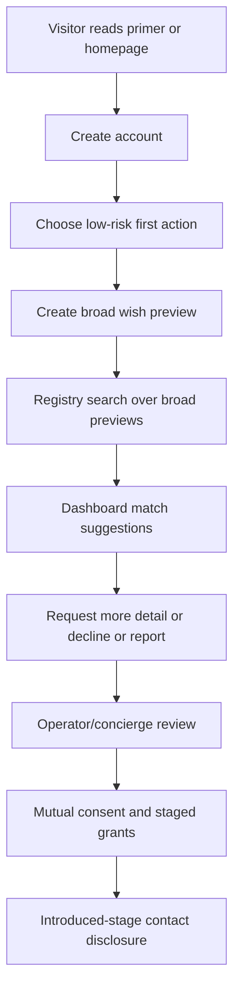
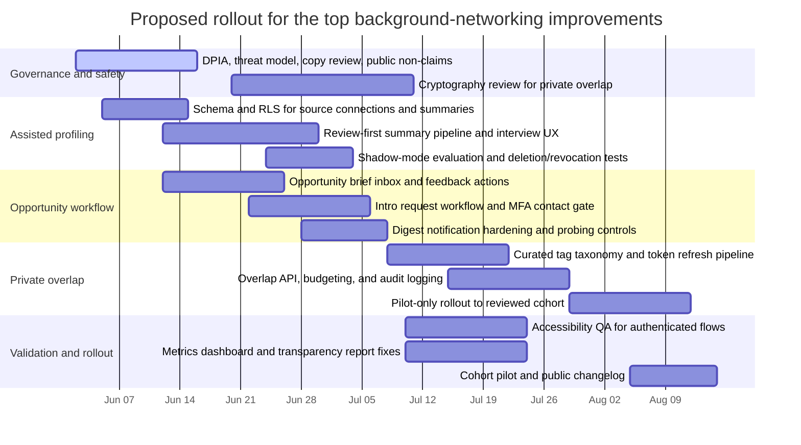

# Moral Trade Background Networking Assessment and Improvement Plan

## Executive summary

Moral Trade already has a notably **defense-favoured** background networking posture. Its public materials describe a conservative matching layer built around broad public previews, deterministic matching on explicit fields, staged disclosure, manual review, no autonomous outreach, no raw private-feed mining, purpose-bound grants, anti-enumeration budgets, generic notifications, row-level security, and app-level field encryption for sensitive background-networking text. That is already closely aligned with Forethought’s warning that background networking creates a real trade-off between usefulness and surveillance, and that careless versions could enable harassment, exploitation, or collusion. citeturn12view1turn19view0turn6search2turn6search3turn17view0turn17view1turn18view1turn5view0

The main issue is not that Moral Trade is unsafe by default. The main issue is that it is still **underpowered and undervalidated** relative to Forethought’s positive design sketch. Forethought imagines “attentive, personalised helpers” that maintain up-to-date wish profiles from passive and proactive inputs, search semi-private wish registries, notify users about promising connections, and sometimes take the first bounded steps toward exploration. Moral Trade’s current implementation explicitly keeps source connectors default-off, AI summarization shadow-only, and privacy-preserving overlap computation design-only; it also reports **zero** reviewed match suggestions, zero opportunity briefs delivered/opened, and zero intro packets created in the current transparency window. citeturn5view0turn12view1turn14view0turn11view3

The highest-value improvements are therefore incremental and safety-preserving rather than maximalist: **consent-reviewed source-assisted wish profiling**, **real opportunity briefs plus a tighter intro workflow**, and **narrow privacy-preserving overlap checks for curated tags rather than free text**. Those three changes move Moral Trade substantially closer to Forethought’s background-networking sketch while remaining consistent with its own public non-claims, disclosure lattice, and rollout gates. citeturn24view0turn12view1turn17view1turn17view2

A practical implementation plan should also fix two operational weaknesses visible in public evidence: first, the feature appears to have **little or no live matching throughput yet**; second, the transparency report already shows a **missing aggregate source / schema-cache issue** for some background-networking metrics, which should be resolved before higher-power automation is added. citeturn14view0

## Inspection scope and limitations

This assessment prioritized public materials on **moraltrade.org** first, then Forethought’s design sketch, then primary or official supporting sources on privacy, security, accessibility, and privacy-preserving computation. The most informative Moral Trade sources were the public background-networking page, wish registry, signup/login pages, privacy policy, safety page, methodology, measurement plan, transparency report, technical spec, accessibility statement, pilot status, and contact page. citeturn12view1turn10view4turn12view0turn11view5turn10view1turn6search3turn19view0turn9view0turn10view3turn10view0turn15view0turn20view2turn37view0

Important authenticated surfaces were **not publicly inspectable**. The login page says signed-in users can review a background-networking dashboard containing offers, private alerts, saved searches, privacy grants, and source permissions, but the actual dashboard route exposed only a generic public recovery state in this inspection. As a result, the exact signed-in UI layout, exact onboarding field sequence after signup, real notification inbox design, and the actual current state of drafts, grants, and operator queues are **unspecified from public evidence**. citeturn11view5turn13view0

Likewise, the public technical materials are unusually rich, but they are still **contracts and descriptions**, not the private repository or running authenticated worker code. That means the data model, rate limits, and route catalog are fairly legible, but concrete implementation details such as job runners, queue backends, model providers, exact database column names for every table, and deployment topology remain partially unspecified. citeturn10view0turn18view0turn18view1

## The current Moral Trade background networking feature

### What the public feature is today

Moral Trade presents background networking as a **“conservative matching layer”** whose purpose is to find possible trades “without turning people into targets.” Publicly, the feature is introduced through a dedicated background-networking page, the experimental wish registry, the people directory, homepage messaging, and signup/login copy. The user-facing framing is consistent across these surfaces: broad previews first, consent before specifics, no autonomous outreach, and no surprise exposure. citeturn12view1turn10view4turn13view1turn0view0turn12view0turn11view5

The public UX path appears to be:



That flow is supported by public copy on the signup page, background-networking page, registry page, login page, and background-networking “concierge intake” section. The public evidence also makes clear that the feature is still **pilot-stage**, with worked examples and cohort routes emphasized ahead of marketplace liquidity assumptions. citeturn12view0turn12view1turn18view2turn11view5turn2view0turn20view2turn32search2

### Current UI and UX flows

The visible public UI emphasizes **discoverability without disclosure**. The wish registry offers keyword, cause-area, and openness filters, but it explicitly searches only public preview fields. Result cards expose public summaries, broad cause areas, coarse location labels, and pledge/payment openness, while private asks and contact details remain hidden until both sides consent to an introduction. The people directory similarly shows only opted-in public profiles and hides empty social counters until they carry “real trust value.” citeturn18view2turn11view4turn13view1

The background-networking page describes the signed-in dashboard as the “working surface.” It says members can create wish profiles, save search constraints, add manual source notes, export their profile data, review suggestions, inspect active grants, manage notification choices, and use data-right requests. Match cards are said to show coarse reason codes, confidence bands, trust and risk badges, scanned surfaces, and redacted surfaces. However, because the dashboard itself was not publicly viewable, those signed-in screen details are partly specified in prose and contracts rather than directly observed in the interface. citeturn12view1turn7search0

The current introduction path is deliberately **human-mediated**. A participant can request more detail, decline, or report a suggestion; then a concierge/operator queue records intent, proposed trade shape, privacy constraints, and SLA state before anyone receives contact details or exact wishes. Public contact paths also direct users to specific lanes for safety concerns, evidence questions, or cohort/partner inquiries, reinforcing the human-review posture. citeturn12view1turn37view0

### Current data model and routing model

Moral Trade’s public technical spec gives an unusually specific public data model. For background networking, the most relevant entities are the **participant**, **public profile**, **private wish profile**, **source connection**, **source note**, **saved search**, **privacy grant**, **match suggestion**, and **notification**. The site also describes five practical storage classes for the feature: `public-preview`, `private-profile`, `consent-ledger`, `manual-source-summary`, and `operations`. citeturn10view0turn14view1turn12view1

Functionally, the public/private split is as follows. Broad previews are searchable and retained until hidden or deleted. Private wishes, asks, constraints, capabilities, and intent claims remain owner-visible and only move beyond that through explicit grants. Source connections store **consent scope, import mode, and manual summaries only**; raw private feeds are not ingested or searched in the current prototype. The public route catalog also names several relevant private or thresholded routes, including saved search creation, profile export/import, background source-summary creation, intro-packet creation, opportunity-brief listing, opportunity-feedback creation, and wish-registry search. citeturn10view0turn12view1turn18view0

The public match contract is similarly explicit. Matching currently uses redacted fields such as cause areas, trade modes, verification preferences, location sensitivity, privacy stage, privacy constraints, and stated exclusions. It explicitly forbids inference about protected traits, ideology, psychology, hidden preferences, exact private wishes, raw notes, or contact details. Match evaluation is non-mutating and preview-only. citeturn17view0turn22view0

### Privacy, security, opt-in and notifications

On privacy, Moral Trade is already strong in several respects. It says nothing is public by default on signup; exact wishes stay private unless both sides opt in; the registry is broad-preview only; contact details are introduced-stage only; disclosure grants are field-level, purpose-bound, stage-bound, and expiry-aware; and participants can revoke or time-box grants. The disclosure contract also publishes concrete search privacy controls, including a daily registry query budget, sparse-result privacy floors, stable hashed query fingerprints, redacted overlap tokens, and repeated detail-request probe limits. citeturn12view0turn11view4turn17view1turn33view0

On security, the public security posture names implemented controls including HSTS, CSP in report-only mode, no-store cache rules for private routes, Supabase auth cookies, a background field-encryption keyring for sensitive background-networking text, server-only secret management, an admin MFA gate, participant session review/revocation, abuse throttling, and incident-response reporting. At the same time, the site openly says several higher-scale claims are **not** made yet, including platform-wide field-level encryption, provider-console/device-inventory equivalence, completed key rotation, zero incidents, or zero residual risk. Supabase’s own documentation supports the use of RLS as defense-in-depth. citeturn6search3turn18view1turn26view1turn27search0

Opt-out is also unusually clear. Signed-in participants can delete the entire background-networking layer without deleting the whole account by typing **DELETE BACKGROUND NETWORKING**. That flow removes wishes, previews, source summaries, saved searches, grants, suggestions, notifications, intro artifacts, and queued background-networking emails, while retaining only redacted or anonymized audit/safety rows where review integrity requires retention. This is broadly consistent with privacy-by-design and DPIA thinking in GDPR/UK GDPR guidance for higher-risk processing using new technologies. citeturn11view2turn31search0turn31search12turn31search13

Notifications are also already constrained in a sensible way. The privacy policy says discovery alerts default to **digest cadence** with quiet hours and source cooldowns; the dashboard exposes in-app, digest email, and web-push preferences; and email copy for background networking stays generic, leaving exact wishes, contact details, and sensitive constraints in the dashboard rather than in email. citeturn11view1

### Performance and accessibility

Performance is **partly specified and partly unproven**. Moral Trade publicly measures route error rate, API p95, Web Vitals, and other operational metrics; it sets targets such as public route error rate ≤1%, API p95 ≤800 ms, LCP p75 ≤2500 ms, INP p75 ≤200 ms, and CLS p75 ≤0.1; and it publishes a local route-baseline command. But the site simultaneously says it does **not** claim verified production Core Web Vitals pass status until route-level samples are collected and published in aggregate. So the performance plan exists, but the current live quality of background-networking surfaces remains partly unspecified. citeturn9view0turn17view3turn18view1

Accessibility is in a similar state. Moral Trade’s public target is WCAG 2.1 AA-oriented QA, with known limitations tracked openly. It names navigation, forms/filters, evidence workflows, and mobile/loading states as priority accessibility review areas, and it explicitly warns that a full manual screen-reader pass has not yet been published for every authenticated workflow. Since W3C emphasizes that WCAG conformance depends on testable success criteria and that human evaluation remains important, authenticated background-networking flows should be treated as not yet fully evidenced. citeturn15view0turn28search0turn28search10

## Gap analysis against Forethought

Forethought’s design sketch imagines a **much more capable** background-networking architecture: attentive personalized helpers, passive and proactive wish inputs, interoperable secure wish profiling, semi-private registry search, and notifications that can surface or begin exploring especially promising connections. Moral Trade already matches the **defense-favoured constraints** of that sketch better than the **capability layer**. citeturn5view0turn24view0turn12view1

The biggest mismatches are these:

- **Passive wish profiling is still largely absent.** Forethought explicitly discusses consensual access to social posts, search profiles, chatbot history, and other sources, distilling them into an up-to-date representation of hopes, intent, and capabilities. Moral Trade, by contrast, currently allows only manual source notes and manual summaries; raw connector ingestion is disabled, source connectors are default-off, and live connector workers are blocked until DPIA completion. citeturn5view0turn24view0turn12view1

- **Preference elicitation is form-heavy rather than helper-driven.** Forethought highlights chatbot-style assistance and direct preference elicitation as a useful cross-cutting capability. Moral Trade currently describes deterministic synthesis and clarification from missing fields, not an interactive delegate or interview assistant. citeturn24view0turn19view0

- **The registry exists, but only at a broad-preview level.** This is a strength on privacy grounds, but it also means the system is still short of Forethought’s richer semi-private networking layer. Moral Trade’s registry exposes just enough public preview to decide whether to explore further, while more nuanced private-overlap computation remains design-only. citeturn18view2turn12view1turn24view0

- **Notifications exist in principle, but there is little public evidence of live network activity.** Forethought’s helpers should send notifications about especially promising connections. Moral Trade has notification preferences, opportunity briefs, and intro-packet routes in its public contracts, yet the current transparency report shows zero reviewed match suggestions, zero opportunity briefs delivered/opened, and zero intro packets created. citeturn24view0turn11view1turn18view0turn14view0

- **Automation is intentionally more limited than Forethought’s sketch.** Forethought allows that helpers might take the first steps toward serious exploration. Moral Trade explicitly forbids autonomous outreach, keeps AI in shadow mode for matching-related functions, and requires human review before disclosure, contact, reliance, or state changes. That is prudent, but it leaves value on the table. citeturn5view0turn17view0turn17view2

- **Niche-adoption strategy is only partially operationalized.** Forethought recommends starting with smaller niches and/or existing matchmakers. Moral Trade already has a founding cohort and explicit “cohort or partner inquiry” language for communities, donor circles, and organizations, but the background-networking product itself does not yet publicly show community-specific matchmaker tooling or partner playbooks. citeturn5view0turn20view2turn37view0

- **Portability is acknowledged but not yet realized.** Forethought notes that decentralized implementations may be more portable. Moral Trade describes itself as centralized-first, portable-later, with export/import and schema endpoints intended to support future interoperability, but the public product is still clearly centralized. citeturn5view0turn19view0

In short: the current system is **directionally correct on safety**, but still **too conservative and too inactive** to realize Forethought’s positive vision.

## Prioritized, actionable improvements

The table below focuses on improvements that preserve Moral Trade’s current public guardrails while materially increasing background-networking usefulness. The priorities are based on the observed gap between current public contracts and Forethought’s sketch, not on hidden private implementation details. citeturn12view1turn24view0turn14view0

| Improvement | Why it matters | Effort | Risk |
|---|---|---:|---:|
| **Consent-reviewed source-assisted wish profiling** | Safely adds Forethought-style passive and proactive inputs without jumping straight to raw-feed ingestion or live AI ranking. | High | Medium |
| **Opportunity briefs and a stronger intro workflow** | Turns today’s preview-only matching into something users can actually act on, while preserving human review and staged disclosure. | Medium | Low–Medium |
| **Privacy-preserving overlap checks for curated tags** | Improves match quality on semi-sensitive traits without exposing raw wishes or exact constraints. | High | Medium–High |
| **UX copy overhaul for consent and control** | Public pages are clear, but signup and registry copy can better explain what data is used, what is never used, and how quiet hours / expiry / deletion work. | Low | Low |
| **Metrics and transparency hardening** | The transparency report already shows missing-table / schema-cache issues and zero throughput; fix observability before adding more automation. | Low–Medium | Low |
| **Accessibility pass for authenticated background flows** | Public accessibility commitments explicitly say authenticated workflows still need fuller manual QA. | Medium | Low |
| **Cohort-specific pilot packs** | Aligns with Forethought’s “start in specific communities / work with existing matchmakers” recommendation. | Medium | Low |
| **Audit-log and abuse-review dashboard improvements** | Makes sparse search pressure, detail-request probing, and notification load legible to operators and users. | Medium | Low |

### Suggested UX copy changes

The current copy is principled but often abstract. The highest-value copy changes are:

- Replace “Create broad wish preview” with **“Create a private wish profile and choose what, if anything, becomes a broad preview.”**
- On registry results, replace “Exact asks and contact details require mutual consent” with **“You can browse broad previews now. Exact asks, exact wishes, and contact details stay hidden unless both sides explicitly approve the next stage.”**
- In notification settings, add **“Discovery alerts are digest-first by default. No one is contacted on your behalf.”**
- In source-connection UI, add **“Raw source content is not stored for matching. You review and approve a summary before it can affect your profile.”**
- In deletion UI, add a compact deletion summary showing exactly what will be removed and what redacted audit artifacts remain. These changes are consistent with current public promises and should reduce ambiguity without expanding scope. citeturn12view0turn11view1turn11view2turn12view1

## Codex GPT-5.5-xHigh implementation instructions

The public contracts already imply the right implementation philosophy: keep matching preview-only by default, keep disclosure owner-controlled and stage-bound, avoid state mutation from evaluators, avoid raw-feed ingestion, and use human review for disclosure/contact/reliance-bearing steps. The instructions below are designed to move the product closer to Forethought’s sketch **without violating those public invariants**. citeturn17view0turn17view1turn19view0turn24view0

The snippets assume the current stack remains a **TypeScript server-rendered web app backed by Supabase/Postgres with RLS**, because Moral Trade’s public materials reference `npm run` route measurement, Supabase auth cookies, and RLS-backed private tables and routes. citeturn9view0turn6search3turn18view0

### Top improvement one

#### Build consent-reviewed source-assisted wish profiling

**Goal:** add a safe “passive + proactive” profiling layer that accepts user-entered wishes and optional connector-based summaries, but never lets raw external content directly influence matching until the user reviews and approves a summary.

#### Implementation steps for Codex

1. **Keep public invariants intact.** Do not store raw connector data in analytics, do not let source summaries auto-disclose, and do not let any model output directly create live matches or disclosure decisions. Keep this feature behind a `background_assist_shadow` flag at first. citeturn12view1turn17view2

2. **Add new tables** for source connections, approved source summaries, extracted profile signals, and shadow evaluation runs.

```sql
create table background_source_connections (
  id uuid primary key default gen_random_uuid(),
  user_id uuid not null references auth.users(id) on delete cascade,
  provider text not null check (provider in ('manual', 'email_export', 'chat_export', 'calendar_export', 'webpage')),
  access_status text not null check (access_status in ('draft', 'connected', 'revoked', 'expired')),
  import_mode text not null check (import_mode in ('manual_summary_only', 'shadow_summary')),
  allowed_field_keys text[] not null default '{}',
  retention_days int not null check (retention_days in (30, 90, 180, 365)),
  consent_note_ciphertext bytea not null,
  consent_note_key_version int not null,
  last_summary_id uuid,
  last_synced_at timestamptz,
  expires_at timestamptz not null,
  revoked_at timestamptz,
  created_at timestamptz not null default now()
);

create table background_source_summaries (
  id uuid primary key default gen_random_uuid(),
  connection_id uuid not null references background_source_connections(id) on delete cascade,
  user_id uuid not null references auth.users(id) on delete cascade,
  summary_version int not null,
  summary_status text not null check (summary_status in ('draft', 'approved', 'rejected', 'expired')),
  approved_summary_ciphertext bytea not null,
  approved_summary_key_version int not null,
  redaction_report jsonb not null,
  allowed_field_keys text[] not null default '{}',
  created_at timestamptz not null default now(),
  approved_at timestamptz
);

create table background_profile_signals (
  id uuid primary key default gen_random_uuid(),
  user_id uuid not null references auth.users(id) on delete cascade,
  source text not null check (source in ('manual', 'approved_source_summary', 'interview')),
  signal_key text not null,
  signal_value text not null,
  sensitivity text not null check (sensitivity in ('broad', 'specific')),
  confidence_band text not null check (confidence_band in ('low', 'medium', 'high')),
  expires_at timestamptz,
  created_at timestamptz not null default now()
);

create table background_shadow_runs (
  id uuid primary key default gen_random_uuid(),
  user_id uuid not null references auth.users(id) on delete cascade,
  source_summary_id uuid references background_source_summaries(id) on delete set null,
  model_name text not null,
  purpose text not null check (purpose in ('signal_extraction', 'clarification_draft')),
  output_json jsonb not null,
  was_promoted boolean not null default false,
  created_at timestamptz not null default now()
);
```

3. **Apply strict RLS**: owner-only access for all four tables; no anonymous policies; no cross-user reads; and no direct API route that exposes ciphertext or raw summaries. That matches the site’s public RLS posture and Supabase’s guidance that RLS is core defense in depth. citeturn12view1turn27search0

4. **Add a short structured interview** before any connector flow. Ask just enough to improve broad previews:
   - primary causes
   - open trade modes
   - coarse geography
   - verification preferences
   - hard exclusions
   - whether source-assisted profiling is desired
   This aligns to Forethought’s preference elicitation idea without requiring open-ended agent delegation on day one. citeturn24view0

5. **Implement a review-first summarization service**. Connector jobs may parse uploaded exports or user-pasted text in ephemeral worker memory, produce a redaction report plus a draft summary, and then stop. Only the **approved summary** persists and only in encrypted form.

```ts
type ApprovedFieldKey =
  | "cause_priorities"
  | "capability_tags"
  | "offer_ask_terms"
  | "verification_preferences"
  | "availability_context"
  | "safety_constraints";

interface DraftSummary {
  summaryText: string;
  redactionReport: {
    removedEmails: number;
    removedPhones: number;
    removedNames: number;
    removedDirectQuotes: number;
  };
  extractedSignals: Array<{
    key: string;
    value: string;
    sensitivity: "broad" | "specific";
    confidence: "low" | "medium" | "high";
  }>;
}

export async function buildApprovedSummary(input: {
  rawText: string;
  allowedFieldKeys: ApprovedFieldKey[];
}): Promise<DraftSummary> {
  const redacted = redactPII(input.rawText); // never persist rawText
  const llmDraft = await summarizeToAllowedSchema(redacted, input.allowedFieldKeys);

  return {
    summaryText: llmDraft.summaryText,
    redactionReport: llmDraft.redactionReport,
    extractedSignals: llmDraft.extractedSignals.filter(
      (s) => s.sensitivity === "broad" || input.allowedFieldKeys.includes(mapSignalToFieldKey(s.key))
    ),
  };
}
```

6. **Require explicit user approval** before promoted signals are written into `background_profile_signals`. Shadow runs can exist for quality inspection, but match scoring should only read `background_profile_signals`, never `background_shadow_runs`.

7. **Add expiry-aware recomputation**. If a summary or connector expires or is revoked, immediately mark dependent signals stale and exclude them from matching.

#### API design

- `POST /api/background/source-connections`
- `POST /api/background/source-connections/:id/draft-summary`
- `POST /api/background/source-summaries/:id/approve`
- `POST /api/background/profile-signals/recompute`
- `DELETE /api/background/source-connections/:id`

All write endpoints should require authenticated ownership, server-side field validation, and rate limits consistent with current public surfaces for source summary writes and profile portability. citeturn18view1turn18view0

#### Tests Codex should add

- RLS tests proving only the owner can read/write connection, summary, and signal rows.
- Persistence tests proving raw uploaded text is never written to the database or analytics.
- Deletion/revocation tests proving expired or revoked connections stop affecting match scoring.
- Shadow-mode tests proving model output cannot create live matches or disclosure decisions.
- Regression tests proving summary drafts remove email, phone, precise location, and contact payloads by default.

#### Deployment notes

- Ship behind a feature flag to a **single reviewed cohort** first.
- Complete and publish the promised DPIA / privacy-design review before enabling any non-manual connector pathway.
- Add a public changelog entry explaining exactly what changed and what did **not** change. citeturn12view1turn31search12

### Top improvement two

#### Build opportunity briefs and a stronger intro workflow

**Goal:** turn background networking from a mostly conceptual match-preview layer into a useful, digest-first opportunity system with explicit user actions, mutual consent, and operator review.

#### Implementation steps for Codex

1. **Formalize opportunity briefs as first-class objects.** The transparency report already references them, but public throughput is zero. Make them visible and actionable in the dashboard. citeturn14view0turn11view3

```sql
create table background_opportunity_briefs (
  id uuid primary key default gen_random_uuid(),
  recipient_user_id uuid not null references auth.users(id) on delete cascade,
  counterpart_profile_id uuid not null,
  match_signal_json jsonb not null,
  confidence_band text not null check (confidence_band in ('low', 'medium', 'high')),
  reason_codes text[] not null default '{}',
  blocker_codes text[] not null default '{}',
  brief_status text not null check (brief_status in ('new', 'seen', 'dismissed', 'interested', 'expired')),
  expires_at timestamptz not null,
  created_at timestamptz not null default now()
);

create table background_intro_requests (
  id uuid primary key default gen_random_uuid(),
  requester_user_id uuid not null references auth.users(id) on delete cascade,
  target_profile_id uuid not null,
  opportunity_brief_id uuid references background_opportunity_briefs(id) on delete set null,
  requested_fields text[] not null default '{}',
  proposed_trade_shape jsonb not null,
  privacy_constraints jsonb not null default '{}'::jsonb,
  request_status text not null check (request_status in ('submitted', 'needs_review', 'approved', 'declined', 'appealed', 'expired')),
  sla_due_at timestamptz not null,
  created_at timestamptz not null default now()
);
```

2. **Expose a dashboard inbox** with three explicit actions per brief:
   - “Not relevant”
   - “Maybe later”
   - “Request reviewed introduction”
   This is more useful than silent passive suggestions and still avoids autonomous outreach.

3. **Digest-first notifications** should continue to respect current public promises: generic copy, quiet hours, source cooldowns, and no exact-wish leakage in email. Add a clear per-brief expiry and an explanation of why the user is seeing the brief. citeturn11view1turn22view0

```ts
export async function queueOpportunityDigest(userId: string) {
  const prefs = await getNotificationPrefs(userId);
  if (!prefs.discoveryDigestEnabled) return;
  if (isQuietHoursNow(prefs.quietHours)) return;

  const briefs = await listUndeliveredBriefs(userId, { sinceHours: 24, minConfidence: "medium" });
  if (briefs.length === 0) return;

  await sendDigestEmail({
    userId,
    subject: "New background-networking opportunities",
    // generic only; no exact wishes, no contact details
    bodyLines: briefs.map((b) => `${b.reasonHeadline} · ${b.confidenceBand} confidence`),
  });

  await markDigestDelivered(briefs.map((b) => b.id));
}
```

4. **Promote mutual-consent state transitions** into a visible intro flow:
   - registry preview
   - detail-request consent
   - reviewed intro request
   - introduced-stage contact disclosure
   - follow-up state
   Keep contact disclosure gated behind owner approval and MFA step-up, exactly as the public disclosure contract requires. citeturn33view0turn17view1

5. **Throttle probing** using the already-published logic. Enforce the seven-day repeated detail-request windows, sparse-result privacy floors, and risk logging from the disclosure contract. citeturn33view0

#### API design

- `GET /api/background/opportunities`
- `POST /api/background/opportunities/:id/feedback`
- `POST /api/background/intro-requests`
- `POST /api/background/intro-requests/:id/appeal`
- `POST /api/background/intro-requests/:id/approve-contact`
  Require fresh MFA / step-up auth here.

#### Tests Codex should add

- No email/web-push payload should contain contact info, exact wishes, source notes, or sensitive constraints.
- Contact details must never appear before introduced stage + owner approval + fresh auth.
- Repeated probing should trigger blocks and risk-signal logging with counts only.
- Quiet hours and cooldowns should suppress alert sends without deleting the underlying brief.
- Operator-review actions should be auditable and reversible.

#### Deployment notes

- Start with one or two **community-specific pilots** such as donor circles, reading groups, or org cohorts, since both Forethought and Moral Trade’s own cohort language favor niche-first rollout. citeturn5view0turn37view0turn20view2
- Publish weekly internal funnel dashboards before any public claim that the feature is “live.”

### Top improvement three

#### Implement narrow privacy-preserving overlap checks

**Goal:** improve match quality for semi-sensitive signals without exposing raw wishes, exact constraints, or free-text source summaries.

#### Implementation steps for Codex

1. **Do not start with free text.** Limit the first private-overlap system to a curated vocabulary of normalized tags:
   - capability tags
   - broad constraint flags
   - verification preference tags
   - coarse availability tags

2. **Use a two-layer design.**
   - Layer A: keep the existing explicit-field deterministic match preview.
   - Layer B: add an optional overlap service that computes whether curated sensitive tags intersect, returning only counts and factor codes.

3. **Use standard primitives** rather than bespoke cryptography. HPKE is the relevant standard for sealed-field encryption, and VOPRF / OPRF plus PSI-style protocols are the right family for privacy-preserving overlap or set intersection checks. citeturn29search1turn30search0turn29search2

```sql
create table background_private_overlap_tags (
  id uuid primary key default gen_random_uuid(),
  user_id uuid not null references auth.users(id) on delete cascade,
  tag_namespace text not null,
  blinded_tag bytea not null,
  token_version int not null,
  created_at timestamptz not null default now(),
  expires_at timestamptz
);

create table background_private_overlap_checks (
  id uuid primary key default gen_random_uuid(),
  requester_user_id uuid not null references auth.users(id) on delete cascade,
  counterpart_profile_id uuid not null,
  namespaces text[] not null,
  overlap_count int not null,
  status text not null check (status in ('ok', 'blocked', 'budget_exceeded')),
  audit_reason text not null,
  created_at timestamptz not null default now()
);
```

```ts
interface PrivateOverlapResult {
  overlapCount: number;
  factorCodes: string[];
  blockers: string[];
}

export async function evaluatePrivateOverlap(input: {
  requesterId: string;
  counterpartProfileId: string;
  namespaces: string[];
}): Promise<PrivateOverlapResult> {
  await enforceBudget("private_overlap", input.requesterId);

  const requesterTokens = await getBlindedTokens(input.requesterId, input.namespaces);
  const counterpartTokens = await getCounterpartyBlindedTokens(input.counterpartProfileId, input.namespaces);

  const overlapCount = intersectBlindedTokens(requesterTokens, counterpartTokens).length;

  return {
    overlapCount,
    factorCodes: overlapCount > 0 ? ["privacy_safe_preview"] : [],
    blockers: [],
  };
}
```

4. **Never persist raw canonicalized tags** once blinded tokens have been generated.
5. **Return counts or coarse labels only**, never the exact matching tag names.
6. **Require a cryptography review** before general rollout, and keep the feature internal/pilot-only until threat modeling and abuse review are complete. Forethought itself is explicit that this whole area is privacy-sensitive and easy to get wrong. citeturn5view0turn12view1

#### API design

- `POST /api/background/private-overlap/evaluate`
- `POST /api/background/private-overlap/refresh-tokens`
- `DELETE /api/background/private-overlap/tokens`

#### Tests Codex should add

- Raw tags are not recoverable from stored matching-service tables.
- A negative result does not reveal which tags are absent.
- Rate limits apply per user and per counterpart target.
- Revoked / expired source summaries invalidate derived private-overlap tokens.
- Fallback behavior returns to current deterministic matching if the overlap service is unavailable.

#### Deployment notes

- Treat this as **design-review then pilot**, not “ship to production and iterate.”
- Use a tiny namespace list at first.
- Publish a public non-claim: “private overlap checks do not use free text and do not reveal raw tags.”
- If a crypto review is not available, do **not** ship the feature; stay with the current deterministic preview model. citeturn12view1turn29search1turn30search0turn29search2

## Comparison, timeline, compliance, and monitoring

### Current versus proposed behavior

The comparison below condenses the highest-confidence differences between the current public feature and the proposed target state. Current-state rows are grounded in Moral Trade’s public pages and contracts; proposed-state rows are the recommended target. citeturn12view1turn18view2turn11view1turn33view0turn14view0turn19view0turn24view0

| Area | Current behavior | Proposed behavior |
|---|---|---|
| Wish profiling | Deterministic, explicit-field synthesis; manual source notes only | Deterministic core plus reviewed source-assisted summaries and short structured elicitation |
| External sources | Raw ingestion disabled; connectors default-off | Connector summaries still review-first, but usable in pilot after DPIA and approval |
| Matching | Redacted preview-only deterministic match signal | Same deterministic base plus optional private-overlap boost on curated tags |
| Registry | Broad-preview search only | Keep broad-preview search, but improve briefing and intro conversion |
| Notifications | Digest-first, generic, quiet hours, no private details | Same privacy posture, but with real opportunity briefs and clear per-brief actions |
| Intro flow | Concierge/operator path described, little public evidence of throughput | Stronger intro packet workflow with mutual-interest states and review SLAs |
| Transparency | Public contracts are strong, but live throughput is zero and one source/table issue is visible | Fix telemetry pipeline, publish live funnel and parity metrics before expansion |
| Accessibility | Public target and known limitations are published; authenticated-flow evidence incomplete | Manual keyboard/screen-reader QA for all authenticated networking surfaces before wider rollout |

### Implementation timeline



### Security and privacy compliance checklist

This is an engineering/privacy checklist rather than legal advice. It is grounded in Moral Trade’s existing public promises plus official guidance on privacy by design, DPIAs, accessibility, rate limiting, RLS, and application logging. citeturn12view1turn18view1turn27search0turn31search0turn31search12turn28search0turn27search3turn36search0

- **Privacy by default**
  - Keep public discovery limited to broad previews.
  - Keep exact wishes, source summaries, and contact info stage-gated.
  - Default new source connectors to off, with explicit per-field permissions and retention windows.

- **DPIA / profiling review**
  - Run a DPIA before any feature that uses new technology for systematic personal profiling or passive source distillation.
  - Publish a short public summary of scope, risks, mitigations, and rollout gates.

- **Data minimization and retention**
  - Never persist raw external content unless there is a compelling, documented reason.
  - Prefer approved summaries, broad tags, and expiry-aware derived signals.
  - Make revocation and summary expiry immediately remove downstream matching effects.

- **Authorization**
  - Enforce RLS on every authenticated-private background table.
  - Keep evaluator routes non-mutating; reserve state changes for explicit user or operator actions.

- **Resource-abuse controls**
  - Preserve and extend query budgets, sparse-result floors, duplicate-request suppression, and per-surface rate limits.
  - Add stronger per-target anti-probing logic around intro requests and repeated “maybe similar” detail requests.

- **Logging and auditability**
  - Log security/privacy events, rate-limit hits, grant changes, intro approvals, and notification sends in structured form.
  - Do not log raw wishes, raw source text, or contact details in security logs.
  - Add redacted user-visible audit receipts for grant approvals, revocations, and intros.

- **Accessibility**
  - Bring authenticated background-networking flows up to the same standard of manual keyboard and screen-reader QA that the public accessibility statement calls for.
  - Test digest settings, consent dialogs, and opportunity inbox flows on mobile and desktop.

- **Incident handling**
  - Treat unsafe matching/disclosure as a first-class incident type.
  - Keep affected-user notices tied to incident severity and reopening rules.

- **Cryptographic review**
  - Require independent review before shipping VOPRF/HPKE/PSI-based overlap checks.
  - Keep free text out of the first cryptographic rollout.

### Suggested monitoring dashboards and sample queries

Moral Trade’s own public measurement plan already covers events such as `wish_profile_started`, `detail_request_submitted`, `match_consent_recorded`, `background_scan_run`, and performance metrics, while the transparency report aims to show aggregate counts. The dashboards below extend that logic into an operator-ready implementation set. citeturn9view0turn14view0

#### Opportunity funnel dashboard

**Panels**
- opportunity briefs created
- briefs opened
- interested marks
- intro requests submitted
- intro requests approved
- introduced-stage contact disclosures
- median time from brief to intro request

```sql
-- Line chart + conversion table
select
  date_trunc('week', created_at) as week,
  count(*) filter (where brief_status in ('new','seen','dismissed','interested','expired')) as briefs_created,
  count(*) filter (where brief_status = 'seen') as briefs_seen,
  count(*) filter (where brief_status = 'interested') as briefs_interested
from background_opportunity_briefs
group by 1
order by 1;
```

```sql
select
  date_trunc('week', created_at) as week,
  count(*) as intro_requests,
  count(*) filter (where request_status = 'approved') as intro_requests_approved,
  percentile_cont(0.5) within group (order by extract(epoch from (sla_due_at - created_at))/3600.0) as median_sla_hours
from background_intro_requests
group by 1
order by 1;
```

#### Privacy-pressure dashboard

**Panels**
- sparse-result blocks
- query-budget exhaustion
- repeated detail-request suppression
- counterparties receiving unusually high probe pressure
- private-overlap budget hits

```sql
-- Heatmap / ranked table
select
  target_profile_id,
  count(*) filter (where audit_reason = 'detail_request_probe_limit') as probe_limit_hits,
  count(*) filter (where audit_reason = 'sparse_result_privacy_floor') as sparse_search_hits,
  count(*) filter (where audit_reason = 'budget_exceeded') as budget_hits
from background_private_overlap_checks
group by 1
order by probe_limit_hits desc, sparse_search_hits desc, budget_hits desc
limit 50;
```

#### Notification-fatigue dashboard

**Panels**
- digest sends per user per week
- quiet-hour suppressions
- dismissed-to-open ratio
- opens after send latency
- unsubscribe / channel-disable rate

```sql
-- Stacked bar
select
  date_trunc('week', sent_at) as week,
  channel,
  count(*) as sends,
  count(*) filter (where suppressed_reason = 'quiet_hours') as quiet_hour_suppressed,
  count(*) filter (where suppressed_reason = 'cooldown') as cooldown_suppressed
from notification_deliveries
group by 1, 2
order by 1, 2;
```

#### Surfacing-parity dashboard

**Panels**
- brief surfacing rate by cause-area pair
- brief surfacing rate by geography bucket
- intro approval rate by privacy stage
- false-match feedback rate by source type
- reviewed deviations requiring operator explanation

```sql
-- Parity table for reviewed cohorts only
select
  geography_bucket,
  cause_area_pair,
  count(*) as eligible_pairs,
  avg(case when surfaced then 1.0 else 0.0 end) as surfacing_rate,
  avg(case when false_match_feedback then 1.0 else 0.0 end) as false_match_rate
from match_pair_audits
group by 1, 2
having count(*) >= 20
order by eligible_pairs desc;
```

#### Security and incident dashboard

**Panels**
- auth/session revocations
- grant changes by type
- incident count by severity/category
- mean time to contain privacy incidents
- reopened match/disclosure paths after incident review

```sql
-- Incident SLA table
select
  severity,
  category,
  count(*) as incidents,
  avg(extract(epoch from (contained_at - created_at))/3600.0) as mean_hours_to_contain,
  avg(extract(epoch from (notified_at - created_at))/3600.0) as mean_hours_to_notice
from incident_events
group by 1, 2
order by 1, 2;
```

### Open questions and limitations

Several details remain genuinely unspecified from public evidence and should be treated that way:

- the exact authenticated dashboard screen design and current live user flows after login;
- the real current production throughput of background scan runs beyond the aggregate counts shown publicly;
- the exact worker/queue architecture used for any private background processes;
- whether any connector functionality is already partially implemented behind private feature flags;
- whether any current pilot partners are acting as “existing matchmakers” in the Forethought sense. citeturn11view5turn13view0turn14view0turn12view1turn37view0

On the evidence available, the right call is **not** “replace the current conservative design.” It is “keep the current safety posture, but make it genuinely useful.” That means adding reviewed source-assisted profiling, actionable opportunity briefs, and narrowly scoped privacy-preserving overlap checks before attempting anything close to broad autonomous networking. Forethought’s sketch supports that direction, and Moral Trade’s own public contracts already provide most of the constraints needed to implement it safely. citeturn5view0turn24view0turn12view1turn17view0turn17view1