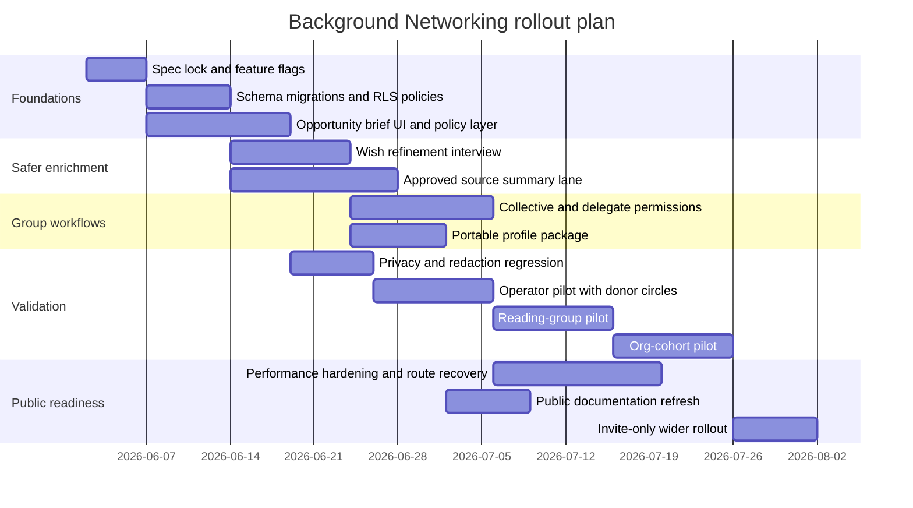

# Moral Trade Background Networking Audit and Improvement Plan

## Executive summary

This review covered the two user-prioritized sites in the requested order: **Moral Trade** first, then **Forethought**. Based on the public product pages, public JSON contracts, and status/measurement/transparency surfaces, Moral Trade’s current Background Networking feature is already a **defense-favoured, privacy-first reinterpretation** of Forethought’s sketch rather than a broad, aggressive networking engine. It emphasizes broad previews, deterministic matching over explicit fields, staged disclosure, manual source summaries, consent-gated introductions, human review, row-level security, encrypted sensitive background fields, anti-enumeration controls, and an explicit refusal to do autonomous outreach or live private-feed mining. That is unusually legible and unusually aligned with the *risk-sensitive* parts of Forethought’s design space. citeturn4view0turn3view2turn3view4turn17view0turn18view2

The main weakness is not conceptual direction; it is **product depth and exercised operations**. Public transparency metrics for reviewed match suggestions, opportunity briefs, opportunity feedback, introduction packets, disclosure grants, participant reports, and concierge appeals are all currently at zero, which means the public evidence base shows a carefully specified system with very little publicly visible throughput. Performance readiness is also not fully established: the public performance contract is currently failing because route-recovery coverage is incomplete, and the site does not yet claim verified production Web Vitals readiness. citeturn14view1turn30view1turn10view4

Forethought would, in my assessment, support **expanding the feature’s usefulness**, but not by dropping the current safeguards. The best improvements are therefore the ones that preserve Moral Trade’s current commitments while moving it closer to Forethought’s “attentive helpers” vision: better **opportunity briefs and notification policy**, a **structured wish-refinement interview**, **connector-assisted approved source summaries** for public or user-selected sources, stronger **collective/delegate workflows**, and a more explicit **portable/interoperable profile package**. By contrast, I do **not** recommend implementing raw private-feed ingestion, autonomous outreach, live AI ranking, or production private-overlap cryptography at this stage, because those would either violate or outrun the system’s current public commitments and readiness gates. citeturn18view2turn19view0turn4view0turn7view0turn35view3

My confidence is **medium-high** on the public-surface audit and **medium** on authenticated/dashboard specifics, because the dashboard itself was not publicly inspectable and some important implementation details are intentionally abstracted into contracts rather than exposed as full source code. The report therefore distinguishes clearly between **observed current behavior**, **publicly specified but not directly inspectable internals**, and **assumptions for Codex implementation**. citeturn4view0turn37view1turn38view0turn6view1

## Scope and evidence base

The priority-source order requested by the user was followed.

| Priority order | Site | What it contributed |
|---|---|---|
| First | **Moral Trade** | Public product routing, Background Networking page, privacy/safety/methodology pages, transparency counts, measurement plan, accessibility statement, pilot status, technical spec, and public JSON contracts for match signals, gates, security, performance, and operations. citeturn4view0turn3view2turn3view4turn12view1turn12view2turn12view0turn12view3turn6view1turn7view0turn30view0turn30view1turn30view2 |
| Second | **Forethought** | The normative design sketch for “Background networking,” including wish profiling, searchable semi-private registries, personalized helpers, notifications, light automation of first steps, privacy/surveillance tradeoffs, niche-first adoption, and the possibility of centralized or decentralized implementations. citeturn18view0turn18view2turn19view0turn19view1 |

This audit is based on **publicly visible evidence only**. Moral Trade’s authenticated dashboard was not directly accessible during the review, so any claims about dashboard capabilities are limited to what public pages and contracts explicitly say the dashboard exposes, such as active grants, notification channel choices, local drafts, transparency receipts, and requests; similarly, background-route internals are inferred from public contract names and public file/test references rather than from a public repository checkout. citeturn35view3turn35view0turn37view1turn6view1turn26view1

The most important **unspecified or not fully public** items are these: the exact authenticated UI for background opportunities and settings; exact table/column names for most private entities; exact route paths for many background APIs; current notification taxonomy and throttling rules; whether web-push is live versus only preference-modeled; the precise scoring formula for deterministic matching; the actual production latency/error distributions; and any public repository link for direct code inspection. Public docs expose a strong contract layer, but not all implementation details. citeturn3view2turn4view0turn6view1turn30view1turn37view1

## Current-state audit

### Product maturity and user flows

Moral Trade currently presents itself as an early pilot rather than a liquid marketplace. The homepage says there are **0 live offers, 8 worked examples, 2 public profiles, and 0 completed agreements**, and it frames the pilot as “manual review before reliance” with “privacy-first matching.” The “About” and “What you can rely on” pages repeat that the current system is for trust-building and reviewability, not automated marketplace scaling. citeturn1view0turn25view4turn3view3

The public Background Networking flow is coherent and conservative. A user can discover the feature from the “Private matching” route, read the public explanation page, create an account, create a broad wish preview, browse the wish registry, and—after sign-in—use a dashboard that public docs say stores private wish profiles, manual source notes, saved searches, and suggestions. Match suggestions are described as **staged, reviewable, and reversible**, with broad previews first and contact/details only after staged disclosure and mutual consent. Concierged introduction requests go to an operator queue before either side receives exact wishes or contact information. citeturn4view0turn20view0turn37view0turn37view1turn5view0

The public discovery side is real but intentionally thin. The wish registry allows search across **broad preview fields only**, not exact wishes, and the visible examples show short summaries, cause-area tags, and coarse openness markers such as payment-open or pledge-open. The people directory similarly exposes opt-in public profiles and explicitly suppresses “follower, karma, or comment leaderboards,” emphasizing reviewed records and visible trust signals instead of social counters. citeturn20view0turn20view2turn36view0

The signup and login surfaces reinforce that framing. Signup keeps the first step minimal and routes new users toward one of three low-risk initial actions, including creating a broad wish preview. Login says members can publish public offers, track interest and alerts, review match signals, and manage saved searches, privacy grants, and source permissions. That is a credible “conservative networking” architecture, but it also indicates that the core product value depends heavily on what happens **after login**, where public evidence is thinner. citeturn37view0turn37view1

### Current matching logic, data model, and API surface

Moral Trade’s public Background Networking contract describes the current system as a **deterministic** match layer over broad previews and approved summaries. It says candidate matches are scored from declared cause areas, trade modes, constraints, location sensitivity, and verification preferences, and that match cards expose coarse reason codes, confidence bands, trust/risk badges, and lists of scanned versus redacted surfaces. The public match-signal contract confirms a preview-only evaluation mode with explicit factor codes such as `cause_area_overlap`, `trade_mode_compatible`, `verification_preference_compatible`, `privacy_safe_preview`, and `human_review_required`; it also states that state mutation is false. citeturn4view0turn6view0turn9view4

The public technical spec surfaces a fairly rich underlying model. It names core entities such as participants, public profiles, private wish profiles, source notes, saved searches, privacy grants, notifications, disputes, payment updates, and agreement events. It also names background/private route families including source connection creation and revocation, source summary draft/approve/create, profile signal recomputation, intro packet creation, intro request creation and appeal, contact-approval step-up, opportunity-brief listing, opportunity listing, and opportunity-feedback creation, while wish-registry search is explicitly classified as a **privacy-thresholded public preview** route. citeturn8view2turn27view1turn27view2

The public docs also reveal code-level clues. The technical spec references a TypeScript test suite that includes `background-networking.test.ts`, `background-notification-policy.test.ts`, `background-notifications.test.ts`, `background-privacy-controls.test.ts`, `background-opportunity-briefs.test.ts`, `background-private-overlap.test.ts`, and `wish-registry.test.ts`, and route file references such as `src/app/.../error.tsx`, which strongly suggests a modern TypeScript web stack with route-oriented server rendering. Public docs also explicitly identify **Supabase** for auth/storage, **Stripe** for payment objects, and **Every.org** for external donation routes. citeturn26view1turn26view0turn3view2

### Privacy, security, opt-in controls, and notifications

Privacy and safety are the strongest part of the current implementation. Moral Trade states that exact wishes, asks, constraints, raw source notes, and contact details stay private unless stage-bound disclosure grants allow more sharing, and it defines audience stages (`registry`, `consent`, `introduced`) and access levels (`hidden`, `broad`, `specific`, `contact`). Search privacy controls include a daily registry query budget, sparse-result privacy floors, stable query fingerprints, redacted overlap tokens, risk-signal logging, and repeated detail-request limits. Safety pages emphasize broad previews, review queues, and privacy gates as a middle path between full exposure and total secrecy. citeturn3view2turn3view4turn35view3

The system’s public security posture is also notably explicit. The security contract says implemented controls include HSTS/CSP and related browser headers, private no-store cache policy, Supabase auth cookies, a versioned background field-encryption keyring, server-only secret management, admin MFA/2FA gates, participant session review and revocation, contact-disclosure MFA step-up, abuse throttling, and incident-response reporting. At the same time, it explicitly **does not claim** field-level encryption across every private table, a completed key-rotation program, or 24/7 security operations. That honesty is a strength, but it also means the system is not yet ready to justify a large expansion of source ingestion or autonomous background computation. citeturn9view2turn30view0turn31view1

Notifications are present but somewhat under-specified publicly. Privacy docs say notifications can include account, evidence, review, background-networking, and digest updates, with in-app and web-push preferences stored in Moral Trade records and delivery records retained to honor opt-outs and diagnose failures; public technical spec text also says notification copy must remain generic and omit exact wishes, contact details, source notes, and sensitive constraints. The login page promises alerts, and the background page says the dashboard exposes notification channel choices. What is not public, however, is the current per-event notification taxonomy, batching rules, quiet-hours behavior, or alert fatigue strategy. citeturn3view2turn10view0turn35view0turn37view1

Opt-out and revocation controls are unusually good for a prototype. Users can disable discoverability/public preview sharing, revoke source connections, set field-level grants with purpose/stage/expiry/revocation, turn off optional analytics at the browser level, and even delete the entire background layer with the explicit phrase **DELETE BACKGROUND NETWORKING**, while safety and audit rows are retained only in redacted/anonymized form where needed for integrity. That is a strong defense-favoured baseline and should be preserved as the system gets more useful. citeturn35view3turn5view0turn3view2

### Scalability, accessibility, mobile behavior, and current operational evidence

Moral Trade is quite candid that Background Networking is not yet a scaled or proven operating surface. Transparency metrics for reviewed match suggestions, opportunity briefs delivered/opened, introduction packets, disclosure grants, reports, and appeals are all at zero. Related median turnaround metrics are suppressed because sample size is below threshold. In practical terms, the public record currently supports the conclusion that the feature is **specified and instrumented**, not that it is yet generating enough usage to validate product-market fit or matching quality. citeturn14view0turn14view1

Scalability is therefore mostly a design claim today, though the design is sensible. The background page itself recommends niche-first cohort packs such as donor circles, reading groups, and organization cohorts, and the project/status pages similarly say private matching remains consent-gated and manually reviewed. That niche-first posture lines up with Forethought’s advice, but it also means that broader search liquidity, discovery loops, and operator throughput are not yet demonstrated publicly. citeturn5view1turn3view1turn15view4

Accessibility is handled honestly but not overclaimed. The accessibility statement says the target is WCAG 2.1 AA-oriented QA, and it claims skip links, consistent navigation buckets, visible text labels for proposal states, and linked support/privacy/safety routes. It also explicitly says that a full manual screen-reader pass has **not yet** been published for every authenticated workflow, that Lighthouse scores are not enough, and that some signed-in prototype workflows still require scenario-specific QA. citeturn12view0

Mobile and web behavior are similarly specified more as a test plan than as a proven result. The measurement plan includes route baselines for both **mobile (390×844)** and **desktop (1440×1000)**, explicitly including `/background-networking` and `/wish-registry`, and it records performance in route-level buckets without private text. But the performance contract is still failing due to incomplete route-recovery manifest coverage, and the site says it does not yet claim verified production Core Web Vitals pass status. No native mobile app is publicly indicated; what is visible is a web application with mobile performance baselines planned and partially instrumented. citeturn13view0turn34view2turn10view4turn30view1

## Mapping Forethought’s sketch to Moral Trade’s current implementation

At a high level, Moral Trade already implements the **defense-favoured** subset of Forethought’s Background Networking sketch: it has wish profiles, a semi-private searchable registry, staged notifications/introductions, niche-first adoption thinking, and explicit privacy/surveillance tradeoff handling. Where it diverges is exactly where Forethought’s sketch becomes more ambitious: passive delegate-style ingestion from social media/search/chat logs, LLM-driven synthesis of richer background profiles, and helpers that can take the first serious steps automatically. Moral Trade currently blocks or sharply gates those higher-power features. citeturn18view0turn18view2turn19view0turn4view0turn7view0

| Forethought design element | Moral Trade current state | Assessment |
|---|---|---|
| Secure/interoperable **wish profiling** | Public docs describe private wish profiles, intent claims, source summaries, and profile export/import endpoints. citeturn4view0turn3view2turn27view1 | **Applies and is partly implemented** |
| Searchable semi-private **wish registry** | Public wish registry exists and searches broad preview fields only; exact wishes remain hidden. citeturn20view0turn20view2 | **Strong alignment** |
| Helpers send **notifications** about promising connections | Notifications/digests are modeled, opportunity briefs exist in public metrics/contracts, but public throughput is zero and the notification UX is not richly specified. citeturn3view2turn14view0turn27view1 | **Partial / underdeveloped** |
| Helpers can take the **first serious steps** | Moral Trade has concierge intro requests, intro packets, operator review, and appeals before disclosure. citeturn5view0turn27view1 | **Aligned, but human-heavy** |
| Passive delegate access to social/chat/search history | Current product explicitly rejects private-feed mining and continuous raw source search; source connectors are default-off and limited to approved summaries only. citeturn4view0turn7view0turn35view3 | **Intentional conflict** |
| **LLM-driven synthesis** of private profile | Current live product is explicitly “non-AI”/deterministic for matching; AI summarization is shadow-only and cannot drive live matches, disclosure, or state changes. citeturn22search0turn35view3turn10view3 | **Intentional conflict for now** |
| Chat-style clarification on uncertain profile points | Public docs mention explicit wish profiles and intent claims, but not a live refinement interview; Forethought suggests this explicitly. citeturn18view2turn35view3 | **Missing but suitable** |
| Sign up as an individual or **existing collective** | Forethought proposes both; Moral Trade already references collectives, donor circles, reading groups, organization cohorts, and “collective example” previews, but the concrete collective admin/delegate flow is not publicly spelled out. citeturn18view0turn5view1turn20view2turn35view2 | **Partial / under-specified** |
| Centralized or decentralized portability | Forethought notes both are possible and decentralization helps portability; Moral Trade already mentions export/import and portability endpoints but not federation or third-party interoperability in practice. citeturn19view0turn3view2turn27view1 | **Partial / promising** |
| Privacy/surveillance tradeoff solved via filtering | Forethought says some filter system may be needed; Moral Trade already has stage-bound field-level grants, anti-enumeration budgets, and purpose-bound disclosure. citeturn18view2turn3view2turn35view3 | **Strong alignment** |
| Start with **smaller niches** and existing matchmakers | Forethought explicitly suggests this; Moral Trade recommends cohort packs and says private matching remains cohort-first and manually reviewed. citeturn19view0turn5view1turn3view1 | **Strong alignment** |

The key conclusion is that Forethought does suggest improvement, but mostly in the direction of **better opportunity packaging, better profile refinement, and safer expansion of context sources**, not in the direction of abandoning Moral Trade’s current privacy and human-control boundaries. The public gates on source connectors, AI shadow mode, and privacy-preserving overlap are therefore not evidence of underbuilding; they are evidence of a deliberate defense-favoured posture. The right move is to **fill in the low-risk missing middle**, not jump to the high-power end of the sketch. citeturn7view0turn35view3turn17view0turn18view2

## Recommended improvements and Codex implementation brief

### Priority matrix

| Improvement | Impact | Effort | Why this is the right next move |
|---|---|---|---|
| Opportunity briefs and user-controlled notification policy | High | Medium | Forethought’s helpers need a usable alert + follow-through layer; Moral Trade already has “opportunity brief” concepts and notification records but no public evidence of mature use. citeturn18view0turn14view0turn35view0 |
| Structured wish-refinement interview | High | Medium | Forethought explicitly recommends refining uncertain wants/capabilities; Moral Trade has intent claims but no visible refinement loop. citeturn18view2turn35view3 |
| Approved-source summary import for public/user-selected sources | High | Medium-high | This is the safest bridge toward Forethought’s passive delegate idea because it preserves no-raw-ingestion and owner review. citeturn18view2turn7view0turn35view3 |
| Collective and delegate workflows | Medium-high | Medium | Forethought includes collectives, and Moral Trade already hints at delegates, collectives, cohort packs, and existing matchmaker roles. citeturn18view0turn5view1turn35view2 |
| Portable profile package and interoperability hardening | Medium | Medium | Forethought raises centralized vs decentralized portability; Moral Trade already exposes profile export/import and should strengthen this. citeturn19view0turn3view2turn27view1 |
| Live AI matching, raw feed ingestion, production private overlap | Potentially high | Very high | **Not recommended now** because these conflict with current public commitments and current readiness gates. citeturn7view0turn35view3 |

Before the detailed items, Codex should work under this **non-negotiable constraint set** drawn from current public commitments:

- do **not** enable autonomous outreach;
- do **not** ingest raw private feeds or search them continuously;
- do **not** let AI outputs create live matches, disclosure decisions, ranking changes, or state mutation;
- do **not** copy raw private wish text, source notes, or message text into analytics or email;
- keep human review mandatory before disclosure, contact, reliance, safety blocking, and dispute/completion decisions. citeturn4view0turn7view0turn35view3turn3view2

### Opportunity briefs and notification policy

This is the most important product gap. Moral Trade already has the conceptual pieces: match suggestions, opportunity briefs, notifications, intro packets, a dashboard, and privacy-safe explanation copy. What is missing is a **first-class, low-pressure “you should look at this” surface** that turns raw suggestions into something a user can triage without avoiding the feature entirely. citeturn4view0turn14view0turn35view0

#### Codex instructions

Assume the current stack is a Next.js-style TypeScript app with Supabase-backed authenticated/private tables and node-based tests, as suggested by the public technical spec. Extend existing background opportunity and notification entities rather than creating a parallel system. citeturn26view1turn27view1

**Step sequence**

- Add a durable per-user notification policy object for background networking.
- Upgrade opportunity briefs to have an explicit lifecycle: `pending`, `delivered`, `opened`, `interested`, `maybe_later`, `dismissed`, `expired`.
- Add a digest job that batches multiple low/medium-confidence suggestions into one generic notification, while allowing immediate sends only for high-confidence, low-risk, review-cleared briefs.
- Ensure every brief contains:
  - visible reason codes only,
  - confidence band,
  - review status,
  - explicit redaction notice,
  - one-click actions: **Request more detail**, **Maybe later**, **Dismiss**, **Report concern**.
- Enforce per-user caps, quiet hours, and cooling-off intervals to prevent pressure and harassment.
- Do not email exact wish text or counterparty identity before mutual consent.

#### Suggested schema delta

```sql
-- assumption: exact table names are not public; map to your real background_* tables

create table if not exists background_notification_policies (
  participant_id uuid primary key references auth.users(id) on delete cascade,
  digest_enabled boolean not null default true,
  immediate_high_confidence_enabled boolean not null default false,
  quiet_hours jsonb not null default '{"start":"22:00","end":"08:00","tz":"UTC"}',
  max_briefs_per_day integer not null default 3 check (max_briefs_per_day between 0 and 20),
  min_confidence text not null default 'medium'
    check (min_confidence in ('low', 'medium', 'high')),
  updated_at timestamptz not null default now()
);

alter table background_notification_policies enable row level security;

create policy "owner can read own notification policy"
on background_notification_policies
for select
to authenticated
using (participant_id = auth.uid());

create policy "owner can upsert own notification policy"
on background_notification_policies
for all
to authenticated
using (participant_id = auth.uid())
with check (participant_id = auth.uid());
```

```sql
alter table background_opportunity_briefs
  add column if not exists delivery_state text not null default 'pending'
    check (delivery_state in ('pending','delivered','opened','interested','maybe_later','dismissed','expired')),
  add column if not exists confidence_band text not null default 'medium'
    check (confidence_band in ('low','medium','high')),
  add column if not exists human_review_required boolean not null default true,
  add column if not exists redaction_notice text not null default
    'Exact wishes, contact details, sensitive constraints, raw notes, and protected-trait inferences remain hidden until a valid consent stage.',
  add column if not exists expires_at timestamptz;
```

#### Suggested API contracts

```ts
// src/app/api/background/opportunity-briefs/route.ts
import { NextRequest, NextResponse } from "next/server";
import { requireUser } from "@/lib/auth";
import { getBriefsForUser } from "@/lib/background/opportunity-briefs";

export async function GET(req: NextRequest) {
  const user = await requireUser(req);
  const state = req.nextUrl.searchParams.get("state") ?? "active";

  const briefs = await getBriefsForUser({
    userId: user.id,
    state,
    limit: 20,
  });

  return NextResponse.json({
    ok: true,
    briefs: briefs.map((brief) => ({
      id: brief.id,
      confidenceBand: brief.confidenceBand,
      reasonCodes: brief.reasonCodes,
      explanation: brief.explanation, // already redacted
      deliveryState: brief.deliveryState,
      reviewStatus: brief.reviewStatus,
      redactionNotice: brief.redactionNotice,
      humanReviewRequired: brief.humanReviewRequired,
      expiresAt: brief.expiresAt,
    })),
  }, {
    headers: { "Cache-Control": "private, no-store" },
  });
}
```

```ts
// src/app/api/background/opportunity-feedback/route.ts
import { NextRequest, NextResponse } from "next/server";
import { z } from "zod";
import { requireUser } from "@/lib/auth";
import { recordOpportunityFeedback } from "@/lib/background/opportunity-feedback";

const Body = z.object({
  briefId: z.string().uuid(),
  action: z.enum(["interested", "maybe_later", "dismissed", "report_concern"]),
});

export async function POST(req: NextRequest) {
  const user = await requireUser(req);
  const body = Body.parse(await req.json());

  await recordOpportunityFeedback({
    actorId: user.id,
    briefId: body.briefId,
    action: body.action,
  });

  return NextResponse.json({ ok: true }, {
    headers: { "Cache-Control": "private, no-store" },
  });
}
```

#### Frontend sketch

```tsx
// src/components/background/OpportunityBriefCard.tsx
type Props = {
  brief: {
    id: string;
    confidenceBand: "low" | "medium" | "high";
    reasonCodes: string[];
    explanation: string;
    reviewStatus: string;
    redactionNotice: string;
    humanReviewRequired: boolean;
    expiresAt?: string | null;
  };
  onAction: (action: "interested" | "maybe_later" | "dismissed" | "report_concern") => Promise<void>;
};

export function OpportunityBriefCard({ brief, onAction }: Props) {
  return (
    <article aria-labelledby={`brief-${brief.id}-title`} className="rounded-lg border p-4">
      <h3 id={`brief-${brief.id}-title`}>Possible counterparty</h3>
      <p>{brief.explanation}</p>
      <p><strong>Confidence:</strong> {brief.confidenceBand}</p>
      <p><strong>Review status:</strong> {brief.reviewStatus}</p>
      <p><strong>Reason codes:</strong> {brief.reasonCodes.join(", ")}</p>
      <p>{brief.redactionNotice}</p>
      {brief.humanReviewRequired ? <p>Human review remains required before detail disclosure or contact.</p> : null}

      <div className="mt-3 flex gap-2">
        <button onClick={() => onAction("interested")}>Request more detail</button>
        <button onClick={() => onAction("maybe_later")}>Maybe later</button>
        <button onClick={() => onAction("dismissed")}>Dismiss</button>
        <button onClick={() => onAction("report_concern")}>Report concern</button>
      </div>
    </article>
  );
}
```

#### Required tests

```ts
// src/lib/background-notification-policy.test.ts
import test from "node:test";
import assert from "node:assert/strict";
import { shouldSendBriefNow } from "./background-notification-policy";

test("never sends exact-wish-bearing notifications", () => {
  const result = shouldSendBriefNow({
    containsPrivateWishText: true,
    confidenceBand: "high",
    digestEnabled: false,
    immediateHighConfidenceEnabled: true,
  });

  assert.equal(result.allowed, false);
  assert.match(result.reason, /private/i);
});

test("respects quiet hours", () => {
  const result = shouldSendBriefNow({
    containsPrivateWishText: false,
    confidenceBand: "high",
    digestEnabled: false,
    immediateHighConfidenceEnabled: true,
    nowLocalTime: "23:15",
    quietHours: { start: "22:00", end: "08:00" },
  });

  assert.equal(result.allowed, false);
});
```

#### Why this should be implemented

It operationalizes Forethought’s “helpers send notifications about especially promising connections” idea without crossing Moral Trade’s own lines into pressure, spam, or surprise exposure. It also addresses the biggest current weakness: a specification-heavy feature with little public evidence of follow-through. citeturn18view0turn14view1turn4view0

### Structured wish-refinement interview

Forethought explicitly imagines systems that not only store wishes but refine them by interrogating key uncertainties. Moral Trade already has “intent claims” and “deterministic synthesis,” but the public docs do not show a structured refinement loop that asks the user to resolve ambiguity in what they want, what they can offer, what evidence they accept, or what kinds of introductions they do not want. citeturn18view2turn35view3

#### Codex instructions

Build a **form-first refinement interview** that is safe even without AI. It should:

- identify low-confidence or incomplete profile dimensions;
- ask the user a bounded follow-up question one field at a time;
- generate only structured fields and explanation text, not hidden rankings;
- preserve user review/approval before any recompute affects visible opportunities;
- optionally support an **AI shadow draft** for question wording later, but keep live state-change logic deterministic.

#### Suggested schema delta

```sql
create table if not exists background_profile_refinement_sessions (
  id uuid primary key default gen_random_uuid(),
  participant_id uuid not null references auth.users(id) on delete cascade,
  status text not null default 'active'
    check (status in ('active','completed','dismissed','expired')),
  created_at timestamptz not null default now(),
  completed_at timestamptz
);

create table if not exists background_profile_refinement_items (
  id uuid primary key default gen_random_uuid(),
  session_id uuid not null references background_profile_refinement_sessions(id) on delete cascade,
  field_key text not null,
  prompt text not null,
  answer_json jsonb,
  confidence_before text not null check (confidence_before in ('low','medium','high')),
  confidence_after text check (confidence_after in ('low','medium','high')),
  approved boolean not null default false,
  created_at timestamptz not null default now()
);
```

#### Suggested service logic

```ts
// src/lib/background/refinement.ts
export function buildRefinementItems(profile: {
  causeAreas: string[];
  offeredCapabilities: string[];
  requestedCounterpartyKinds: string[];
  verificationPreferences: string[];
  exclusions?: string[];
}) {
  const items: Array<{ fieldKey: string; prompt: string }> = [];

  if (profile.causeAreas.length < 2) {
    items.push({
      fieldKey: "causeAreas",
      prompt: "Which other cause areas would still make a conversation worthwhile, even if they are not your top priority?",
    });
  }

  if (profile.offeredCapabilities.length === 0) {
    items.push({
      fieldKey: "offeredCapabilities",
      prompt: "What can you realistically offer: time, donations, introductions, skills, institutional access, or something else?",
    });
  }

  if (profile.verificationPreferences.length === 0) {
    items.push({
      fieldKey: "verificationPreferences",
      prompt: "What proof would you consider sufficient before relying on a commitment?",
    });
  }

  return items;
}
```

#### Frontend sketch

```tsx
// src/components/background/ProfileRefinementWizard.tsx
export function ProfileRefinementWizard({ items, onSubmit }: {
  items: Array<{ id: string; fieldKey: string; prompt: string }>;
  onSubmit: (itemId: string, answer: unknown) => Promise<void>;
}) {
  return (
    <section aria-labelledby="refine-profile">
      <h2 id="refine-profile">Refine your wish profile</h2>
      <p>These answers improve broad matching signals. Nothing new becomes visible without your approval.</p>
      <ol>
        {items.map((item) => (
          <li key={item.id} className="mb-4">
            <label>
              <span>{item.prompt}</span>
              <textarea name={item.id} />
            </label>
            <button onClick={() => onSubmit(item.id, { approved: true })}>Save answer</button>
          </li>
        ))}
      </ol>
    </section>
  );
}
```

#### Required tests

- No refinement answer changes public preview visibility unless the user separately republishes/approves.
- Recompute creates new intent claims but preserves an audit trail of prior states.
- Analytics for refinement sessions record only item counts, completion states, and field keys—not answer text. This aligns with current measurement/privacy commitments. citeturn34view0turn34view3turn3view2

#### Why this should be implemented

This is the cleanest way to make matching materially better without turning on risky ingestion or hidden inference. It is directly suggested by Forethought and directly compatible with Moral Trade’s own “explicit fields, review, and no fake certainty” posture. citeturn18view2turn1view4

### Approved-source summary import for public or user-selected sources

Forethought’s sketch includes social posts, search profiles, chatbot history, and similar sources being distilled into a profile. Moral Trade quite rightly rejects raw ingestion and continuous search today, but it already has the conceptual architecture for a safer middle ground: **consent-ledgered source connections, approved manual summaries, field-scoped permissions, retention expiry, and no raw ingestion**. That should be turned into a usable feature for **public or user-selected sources only**. citeturn18view0turn35view3turn7view0

#### Codex instructions

Implement a **two-step connector lane**:

- Step A: user submits a source URL or paste, chooses field permissions, retention window, and a consent note.
- Step B: system drafts a **redacted summary** from that source for the user to approve before it can influence matching.

Do **not** enable:
- continuous crawling,
- background syncing of raw content,
- training on raw source text,
- direct contact from source content,
- analytics copies of raw content.

This should extend the already-public route family concepts `background_source_summary_draft` and `background_source_summary_approve`, not invent a separate architecture. citeturn27view1turn7view0

#### Suggested schema delta

```sql
create table if not exists background_source_connections (
  id uuid primary key default gen_random_uuid(),
  participant_id uuid not null references auth.users(id) on delete cascade,
  source_kind text not null check (source_kind in ('public_url','manual_paste','linkedin_export','substack_post','other')),
  source_locator text not null,
  consent_note_ciphertext text not null,
  retention_days integer not null check (retention_days in (30,90,180,365)),
  allowed_field_keys text[] not null,
  raw_ingestion_allowed boolean not null default false,
  status text not null default 'active' check (status in ('active','revoked','expired')),
  created_at timestamptz not null default now(),
  expires_at timestamptz not null
);

create table if not exists background_source_summary_drafts (
  id uuid primary key default gen_random_uuid(),
  connection_id uuid not null references background_source_connections(id) on delete cascade,
  participant_id uuid not null references auth.users(id) on delete cascade,
  summary_text_ciphertext text not null,
  summary_version text not null default 'v1',
  approved boolean not null default false,
  created_at timestamptz not null default now()
);
```

#### Suggested service rule

```ts
// src/lib/background/source-summary.ts
export function summarizeApprovedSourceInput(input: {
  sourceText: string;
  allowedFieldKeys: string[];
}) {
  // keep this deterministic or shadow-AI only until a separate gate is passed
  const summary = {
    causePriorities: [],
    capabilityTags: [],
    offerAskTags: [],
    verificationPreferences: [],
    availabilityContext: [],
    safetyConstraints: [],
  };

  // map only into allowed broad fields
  // never keep contact details, exact asks, or raw quotations
  return redactAndProject(summary, input.allowedFieldKeys);
}
```

#### Reviewer-facing approval UI sketch

```text
+--------------------------------------------------------------+
| Source summary draft                                         |
|--------------------------------------------------------------|
| Source: public_url                                           |
| Retention: 90 days                                           |
| Allowed fields: cause priorities, capability tags            |
|                                                              |
| Draft broad summary                                          |
| - Climate adaptation                                         |
| - Institutional grantmaking capacity                         |
| - Open to collaboration in remote settings                   |
|                                                              |
| Redacted automatically                                       |
| - contact details                                            |
| - exact private asks                                         |
| - raw quotations                                             |
|                                                              |
| [Approve summary] [Edit summary] [Reject and delete source]  |
+--------------------------------------------------------------+
```

#### Required tests

- Raw contact details in source text are removed from the saved summary.
- Revoked or expired sources stop influencing profile signal recomputation.
- A summary cannot affect matching until user approval is stored.
- Export/import includes only approved summaries within retention windows.

#### Why this should be implemented

It captures the most valuable and least dangerous subset of Forethought’s “delegate system access to ambient context” idea. It also uses the exact gate structure Moral Trade already publishes, rather than fighting it. citeturn18view0turn35view3turn7view0

### Collective and delegate workflows

Forethought explicitly allows sign-up as an individual or an existing collective. Moral Trade also already gestures at collectives, delegate strategy records, donor circles, reading groups, organization cohorts, and network invites, but the public product does not yet expose a clear collective admin model, delegate authorization model, or “matchmaker on behalf of a group” flow. citeturn18view0turn5view1turn35view2

#### Codex instructions

Add a **collective profile** type with explicit delegate permissions. The key is to keep delegation narrow and reviewable.

- Allow a collective to have a broad preview, private wish profile, and source summaries.
- Add membership roles: `owner`, `delegate`, `reviewer`, `viewer`.
- Record whether a delegate may:
  - edit broad preview,
  - approve source summaries,
  - request intros,
  - approve contact disclosure,
  - revoke grants.
- Require step-up confirmation from an owner for contact disclosure and for any change that increases external visibility.

#### Suggested schema delta

```sql
create table if not exists background_collectives (
  id uuid primary key default gen_random_uuid(),
  display_name text not null,
  broad_preview text,
  discoverable boolean not null default false,
  created_at timestamptz not null default now()
);

create table if not exists background_collective_memberships (
  collective_id uuid not null references background_collectives(id) on delete cascade,
  participant_id uuid not null references auth.users(id) on delete cascade,
  role text not null check (role in ('owner','delegate','reviewer','viewer')),
  permissions text[] not null default '{}',
  primary key (collective_id, participant_id)
);
```

#### Authorization helper

```ts
// src/lib/background/collective-auth.ts
export function can(member: {
  role: "owner" | "delegate" | "reviewer" | "viewer";
  permissions: string[];
}, action: string): boolean {
  if (member.role === "owner") return true;
  if (member.role === "viewer") return false;
  return member.permissions.includes(action);
}
```

#### Example permission checks

- `approve_source_summary` → owner or delegate with permission
- `request_intro` → owner or delegate with permission
- `approve_contact_disclosure` → owner only, or delegate plus owner step-up confirmation
- `change_discoverability` → owner only

#### Why this should be implemented

This directly serves Forethought’s “individual or existing collective” design and its “work with existing matchmakers” starting-point advice. It also fits Moral Trade’s own niche-pack model, where reading groups and organization cohorts are natural first customers. citeturn19view0turn5view1

### Portable profile package and interoperability hardening

Forethought notes that centralized and decentralized implementations are both possible and that decentralized versions may be more portable. Moral Trade already says it supports export/import and portability, but the public docs do not show a strongly specified **interoperable package** for broad previews, approved summaries, grants, and provenance. That is the right next portability improvement. citeturn19view0turn3view2turn27view1

#### Codex instructions

Define a **Background Profile Package** JSON schema and use it for both export/import and internal versioning.

The package should include:

- profile schema version;
- participant or collective subject type;
- broad preview fields;
- allowed cause/capability/verification tags;
- approved source-summary metadata only;
- disclosure grant metadata only;
- provenance hashes of approved summaries and exported objects;
- retention and expiry metadata.

It should exclude:

- raw source text,
- contact details before introduced stage,
- exact wishes by default,
- analytics identifiers,
- operator-only audit notes.

#### Suggested export shape

```ts
// src/lib/background/profile-package.ts
export type BackgroundProfilePackageV1 = {
  schemaVersion: "background-profile-package-v1";
  exportedAt: string;
  subject: {
    kind: "participant" | "collective";
    id: string;
  };
  broadPreview: {
    summary: string;
    causeAreas: string[];
    tradeModes: string[];
    locationContext?: string[];
  };
  approvedSignals: {
    capabilityTags: string[];
    verificationPreferences: string[];
    availabilityContext: string[];
    safetyConstraints: string[];
  };
  approvedSourceSummaries: Array<{
    sourceKind: string;
    retentionExpiresAt: string;
    allowedFieldKeys: string[];
    summaryHash: string;
  }>;
  disclosurePolicy: {
    audienceStages: Array<"registry" | "consent" | "introduced">;
    accessLevels: Array<"hidden" | "broad" | "specific" | "contact">;
  };
  provenance: {
    exportHash: string;
    sourceSummaryHashes: string[];
  };
};
```

#### Deployment note for Codex

Extend existing public/private schema registry documentation so the export format appears in the same public contract family as current schema docs and portability APIs. This matches the current public culture of validator-backed contracts rather than tacit app behavior. citeturn27view0turn27view1

#### Why this should be implemented

It is a low-dual-use way to move toward Forethought’s interoperability goal while also making Moral Trade more legible, auditable, and migration-ready if it later wants a federated or partner-hosted registry model. citeturn19view0turn3view2

### UI mockup sketches

These are not screenshots of the current product. They are proposed wireframes for Codex implementation, designed to stay faithful to Moral Trade’s current broad-preview-first and consent-gated posture. The underlying product constraints come from Moral Trade’s current public contracts and Forethought’s sketch. citeturn4view0turn18view0

```text
+------------------------------------------------------------------+
| Background Networking                                            |
|------------------------------------------------------------------|
| Saved searches      Suggested opportunities      Privacy grants  |
|------------------------------------------------------------------|
| Opportunity brief                                                |
| Because you both have compatible cause areas and evidence prefs. |
| Exact wishes and contact details remain hidden.                  |
|                                                                  |
| Confidence: Medium                                               |
| Reason codes: cause_area_overlap, verification_preference_...    |
| Review status: Human review required                             |
|                                                                  |
| [Request more detail] [Maybe later] [Dismiss] [Report concern]   |
+------------------------------------------------------------------+
```

```text
+------------------------------------------------------------------+
| Refine your wish profile                                         |
|------------------------------------------------------------------|
| We can improve broad matching by clarifying a few uncertain      |
| fields. Nothing becomes public unless you separately approve it. |
|                                                                  |
| What can you realistically offer?                                |
| [ time ] [ donations ] [ introductions ] [ skills ] [ access ]   |
|                                                                  |
| What proof would you accept?                                     |
| [ receipts ] [ public logs ] [ attestations ] [ payment record ] |
|                                                                  |
| [Save and recompute preview-only signals]                        |
+------------------------------------------------------------------+
```

## Testing, monitoring, rollout, and risk

### Validation and monitoring plan

The testing plan should be built around the same categories Moral Trade already publishes: schema tests, policy tests, evidence tests, privacy tests, fairness/surfacing tests, UX tests, and resilience tests. Add the new improvements to those same categories instead of creating a separate background-networking QA culture. citeturn9view5turn34view3

For the new work, the most important validation metrics are:

- **Opportunity usefulness**
  - opportunity brief open rate
  - request-more-detail rate
  - maybe-later vs dismiss ratio
  - false-match rate after human review
- **Consent integrity**
  - detail-request resolution rate
  - both-party consent before any identity-specific disclosure
  - zero unreviewed disclosure state changes
- **Privacy integrity**
  - zero confirmed privacy leakage incidents
  - redaction test pass rate on source summaries, notifications, analytics payloads, and exports
  - source revocation effectiveness within one recompute cycle
- **Queue health**
  - intro request SLA attainment
  - operator review turnaround
  - appeal overturn rate
- **Parity and defensibility**
  - subgroup surfacing parity checks before broader rollout
  - human overrule rate on refinement-generated signals
  - no increase in safety reports or pressure reports after new notifications go live

Those metrics fit the current measurement and evaluation posture, which already tracks privacy-grant changes, detail requests, match consent, background scan runs, performance buckets, surfacing parity, human overrule rates, and privacy leakage incidents. citeturn34view0turn34view3turn30view2

### Security, privacy, and ethical risk assessment

The biggest risks of improving Background Networking are not generic “bugs”; they are **surveillance creep, harassment enablement, unwanted pressure, collusion risk, and premature automation of sensitive judgments**. Forethought is explicit that background networking creates a hard privacy-versus-collusion tradeoff, and Moral Trade’s own privacy/safety pages are built around that same concern. citeturn18view2turn3view2turn3view4

The mitigation posture should therefore remain:

- broad previews before specifics;
- strong anti-enumeration/rate-limit controls on search and detail requests;
- purpose-bound grants with expiry and revocation;
- owner approval before any source-derived summary affects matching;
- human review before disclosure, contact, or reliance;
- no raw source ingestion;
- no raw private text in analytics or notifications;
- MFA step-up for contact disclosure;
- visible appeal path for denied intro requests or disclosure decisions. citeturn3view2turn35view3turn30view0turn5view0

A particularly important ethical constraint is to avoid quietly sliding from “background networking” into “behavioral pressure.” Notification caps, quiet hours, digest defaults, and “maybe later” states should therefore be treated as **safety features**, not mere UX polish. The same is true of collective/delegate lanes: they must not become a way for one actor to expose or pressure another without a clear approval boundary. Those recommendations are my inference from the current public safety/privacy commitments and Forethought’s dual-use framing. citeturn17view0turn3view4turn4view0

### Migration and rollout plan

Use a **feature-flagged, cohort-first** rollout. That is not only consistent with current Moral Trade practice; it is explicitly recommended by both the site and Forethought. citeturn5view1turn19view0

**Recommended rollout order**

1. Internal/staff dogfood on opportunity briefs and notification policies.
2. Small **donor circle** pilot.
3. Small **reading group** pilot.
4. One **organization cohort** with named delegates.
5. Wider invite-only rollout after:
   - zero confirmed privacy incidents,
   - acceptable false-match rate,
   - stable operator SLA,
   - no major surfacing parity concerns,
   - performance contract back to pass.

Because current public operational counts are all at or near zero, this phased rollout matters: it allows Moral Trade to gather real evidence without pretending the feature is already working at scale. citeturn14view1turn30view1turn5view1



### User communication copy

**In-product release note**

> **New: reviewable opportunity briefs**
> You can now receive privacy-safe opportunity briefs when Moral Trade finds a broadly compatible counterparty. Briefs explain *why* a suggestion appears using visible reason codes and confidence bands. Exact wishes, contact details, and sensitive constraints remain hidden unless both sides consent to the next stage.

**Settings copy**

> **Background Networking notifications**
> Choose whether to receive a digest, only high-confidence opportunities, or no opportunity notifications. These alerts never include exact wish text or contact details. Quiet hours and daily limits apply to reduce pressure.

**Source-summary consent copy**

> **Add a source for matching context**
> You may connect a public or user-selected source to generate a broad summary for your own review. Raw content is not searched continuously, is not copied into analytics, and does not affect matching until you approve a summary and field permissions.

**Collective/delegate copy**

> **Delegate access for a group**
> A delegate can help manage a group’s broad preview and intro requests, but contact disclosure and higher-visibility changes still require explicit approval from the right role.

## Open questions and limitations

The biggest limitation is that the authenticated dashboard itself was not directly inspectable, so this report relies on public product claims about what that dashboard exposes rather than live in-session behavior. Public contracts are strong enough to support a serious audit, but they are not the same thing as full source inspection or a live staging test. citeturn35view0turn37view1turn38view0turn6view1

Several implementation details remain public-but-unspecified: exact background API paths, precise table names, exact current notification rules, current matching weights, whether push messaging is live versus preference-modeled, and the concrete deployment/runtime stack beyond the TypeScript/route/test clues in the public spec. Codex should therefore treat the concrete route/table names in this report as **implementation assumptions to be mapped onto the existing codebase**, not as guaranteed current identifiers. citeturn27view1turn35view3turn3view2turn26view1

The final limitation is empirical: current public background-networking throughput is essentially zero. That means the report can strongly assess **design quality and implementation direction**, but not yet the real-world quality of matching outcomes, operator burden, or user trust under load. The improvements above are designed to solve exactly that problem without breaking the defense-favoured constraints that currently make the feature trustworthy. citeturn14view1turn30view1turn17view0