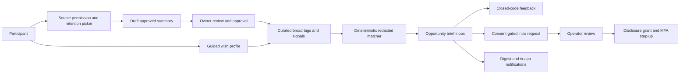
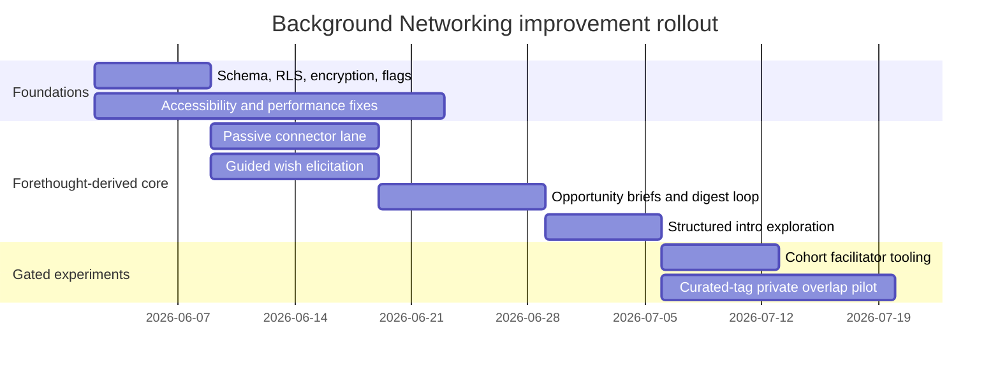

# Moral Trade Background Networking Audit and Evaluation Against Forethought

## Executive summary

Moral Trade’s current Background Networking feature is already unusually close to Forethought’s *defense-favoured* vision in its basic posture: it is explicitly semi-private, searchable through broad previews, consent-gated before disclosure, anti-enumeration constrained, reviewable, portable in principle, and non-autonomous in outreach. The public site, privacy pages, technical spec, and validator contracts describe a system that centers broad previews, field-level grants, operator review, deterministic matching, and explicit non-claims around scraping, private-feed mining, and hidden AI decisioning. That makes the product much more conservative than Forethought’s full sketch, but also more aligned with the “defense-favoured” spirit of reducing pressure, surveillance, and unsafe exposure. citeturn4view0turn30view0turn31view0turn20view0turn21view0

At the same time, Forethought’s sketch does suggest real improvements to the current Moral Trade implementation. The biggest gaps are not “make it fully autonomous”; they are: a better passive-mode connector lane, stronger wish elicitation and uncertainty capture, more useful background notifications and opportunity briefs, better tools for collective/community onboarding, and a tightly gated privacy-preserving overlap pilot. Moral Trade’s own public docs already point toward these directions, but many of them are still default-off, shadow-only, design-only, or not visibly exercised in the live pilot. citeturn21view0turn5view0turn30view0turn31view0turn15view0turn14view0

My bottom-line judgment is therefore: **yes, Forethought’s design sketch implies improvements that Moral Trade should implement**, but they should be implemented in a staged way that preserves Moral Trade’s current hard guardrails: no raw private-feed ingestion, no hidden ranking, no live AI-disclosure decisions, no autonomous outreach, and no identity-specific disclosures without mutual consent and review. That conclusion is supported both by Forethought’s own privacy/surveillance warning and by Moral Trade’s current operational boundaries, security gates, and AI-governance posture. citeturn21view0turn5view0turn31view0turn1search2turn38view0

## Current state on Moral Trade

Publicly, the live feature presents a clear user journey. A visitor can read the Background Networking explainer, search the public-facing wish registry, create an account, and log in. The signup page frames account creation as the start of a “founding cohort” process and immediately offers a first-step choice among cloning a worked example, creating a private wish profile, or logging a public-good action. The login page says sign-in unlocks public offer publishing, private alerts, saved searches, privacy grants, source permissions, and the background-networking dashboard. Moral Trade also states that the signed-in dashboard is the “working surface” where members create wish profiles, save search constraints, add manual source notes, export profile data, and review suggestions. citeturn4view0turn24view0turn24view1turn17view0

The matching UX is deliberately staged. Background Networking is described as a “conservative matching layer” that compares broad public previews, saved preferences, and manual source notes. Match suggestions are said to be staged, reviewable, and reversible; they are not introductions on their own and do not disclose private data by themselves. On the public registry side, search works only over broad preview fields, and result cards intentionally hide exact asks, exact wishes, and contact details until both sides approve the next stage. Match cards are described as showing coarse reason codes, confidence bands, trust and risk badges, scanned surfaces, and redacted surfaces, with the explanation contract centered on broad compatibility rather than hidden inference. citeturn4view0turn17view0turn23view0

The current matching engine is deterministic, not live-AI-driven. Moral Trade says its present synthesis layer summarizes user-entered fields, captured excerpts, manual source notes, and structured constraints into a private profile of hopes, intent, capabilities, and uncertainty; clarification questions are generated from missing or underspecified fields rather than from an LLM interviewer. Current match suggestions are rule-based and use stated cause areas, payment/pledge compatibility, shared terms, and consent-gated previews rather than AI inference. The public match-signal contract further says the system uses only broad cause areas, trade modes, verification preferences, location sensitivity, privacy stage, and stated exclusions; it explicitly forbids inferring protected traits, ideology, psychology, hidden preferences, exact private wishes, raw notes, or contact details. citeturn31view0turn23view0turn25view0

Moral Trade’s data model and API surface are unusually well documented for an early pilot. The technical spec says the core API contract covers 55 routes and 78 schema definitions. For Background Networking specifically, the route catalog includes authenticated-private routes for source-connection create/revoke, source-summary draft/approve/create, profile-signal recompute, intro-packet create, intro-request create/appeal/approve-contact, opportunity-brief list, opportunity list, and opportunity-feedback create; the wish-registry search is a “privacy thresholded public preview” route. The data model contract explicitly includes participants, public profiles, private wish profiles, profile visibility controls, source connections, source notes, saved searches, privacy grants, match suggestions, notifications, payment records, provenance objects, appeals, and disputes. Sensitive background text is contractually required to have ciphertext and encryption-version columns, and private background tables are described as row-level-security protected and participant-scoped. citeturn8view0turn22view0turn5view0turn25view0

On privacy and consent, the feature is strongly opt-in. Moral Trade separates public profile data from private wish-profile data; exact wishes, asks, constraints, and verification preferences are meant to stay private unless the user chooses to share more. Field-level grants are stage-bound across registry, consent, and introduced states, with access levels hidden, broad, specific, and contact. Search privacy controls include a daily registry query budget, sparse-result privacy floor, stable query fingerprint, redacted overlap tokens, risk-signal logging, and a repeated detail-request limit. Participants can disable discoverability, revoke grants, and even delete the entire background-networking layer without deleting the whole account by typing `DELETE BACKGROUND NETWORKING`, while redacted or anonymized audit rows may be retained where review integrity requires it. Optional funnel analytics can also be turned off at the browser level. citeturn30view0turn5view0turn32view0turn13view0

Security and operational design are also clearly bounded. Moral Trade says auth is cookie-backed through Supabase, private routes receive `Cache-Control: private, no-store`, and background-networking exact wishes, sensitive constraints, private source notes, connector consent notes, and deterministic synthesis summaries use app-level field encryption with versioned key IDs and rotation support. Operator consoles and review mutations require admin MFA; contact-level introductions require an MFA step-up before contact details can be released; abuse-prone surfaces are rate-limited; and match, privacy, and admin actions record audit events where disclosure is safe. At the same time, the site openly says CSP is still report-only, platform-wide field-level encryption is not claimed, device/session review evidence is still a gate before sensitive scale, and key-rotation evidence is still required before broader sensitive growth. citeturn1search2turn9view4turn9view3turn15view0

Notifications and background processes are present in concept and contract, but visibly early in execution. Privacy documentation says the dashboard exposes in-app, digest email, and web-push preferences by event type; discovery alerts default to digest cadence with quiet hours and source cooldowns; and background-networking email copy stays generic so exact wishes, private asks, source notes, and sensitive constraints are left in the dashboard. Methodology says background scans can open notifications, saved-search results, match reports, network invite drafts, brokerage bounties, and introduction plans. Yet the transparency report shows zero reviewed match suggestions, zero opportunity briefs delivered, zero briefs opened, zero intro packets created, zero disclosure grants created, and zero concierge appeals in the public reporting period, while also surfacing a live-aggregate source error for some tables. That combination suggests the workflow is specified and instrumented, but not yet visibly active at meaningful volume in the live pilot. citeturn30view0turn31view0turn14view0

Scalability planning exists at the level of throttles and observability, but not yet as a published capacity architecture. The public operations/performance contracts define rate-limit surfaces, including 30/minute for saved-search writes, 60/minute for match-signal evaluation, 12/minute for background source-summary writes and intro-packet writes, 60/minute for wish-registry search, and 120/minute for analytics ingest. Operational metrics are privacy-safe counts such as funnel-event counts, route error rate, API latency p95, Web Vitals, blocked-proposal rate, email-outbox suppression, privacy incidents, copilot fallback rate, evidence-review SLA, and appeal overturn rate. However, there is no published indexing strategy, queue topology, worker concurrency model, dead-letter design, or search-engine architecture beyond anti-enumeration budgets and redacted analytics. The performance profile itself currently fails, with one blocker, incomplete route-recovery coverage, and explicit non-claims that Core Web Vitals and production API latency targets are already met. citeturn7view1turn9view6turn15view0

Accessibility is thoughtfully acknowledged but incomplete. Moral Trade says its target is WCAG 2.1 AA-oriented QA, and it specifically calls out keyboard navigation, predictable routes, skip links, clear labels, visible text labels instead of color alone, and public support/safety/privacy links. It also explicitly identifies authenticated Background Networking as a priority QA scope, naming the opportunity inbox, consent dialogs, source-summary review, notification settings, and self-serve deletion flow. But it also says a full manual screen-reader pass has not yet been published for every authenticated workflow and warns that some prototype workflows still depend on signed-in data states that require scenario-specific QA. In practice, that means accessibility is a declared requirement, not yet a fully demonstrated property of the private networking surfaces. citeturn11view0turn36view0turn37view0turn37view1

Several important technical details remain missing or publicly unspecified. The public documents do not fully show the signed-in dashboard UI, exact database columns for each background table, the concrete scheduler/queue implementation, web-push provider choice, email provider choice, connector-provider list, search implementation details, or the exact path mapping for every contract key in the route catalog. The public materials are much stronger on policy contracts than on exercised runtime detail for authenticated surfaces. That is a strength for auditing intent, but it limits a true black-box runtime audit of the private dashboard. citeturn4view0turn8view0turn11view0turn14view0

## Evaluation against Forethought’s design sketch

Forethought’s Background Networking sketch imagines a matchmaking layer where attentive, personalized helpers work in the background; users can sign up as individuals or collectives; they can use the system passively by granting access to existing sources such as social media posts, search profiles, and chatbot history, or proactively by injecting deliberate wishes; under the hood there are secure wish-profiling systems, LLM-assisted synthesis, optional interview-style clarification, and a searchable semi-private wish registry; especially promising connections generate notifications and may connect into tools that start the first serious steps toward exploration. Forethought also emphasizes a central trade-off: broader access to sensitive data creates surveillance, harassment, and exploitation risks, while total secrecy can enable collusion; it therefore explicitly calls for filtering systems and early work that foregrounds privacy and surveillance solutions. citeturn21view0

Moral Trade matches Forethought well on several core ideas. It already supports individual and collective participation; it distinguishes passive and proactive participation modes; it has a wish registry that exposes only broad previews; it documents source connections, approved summaries, and portability/import-export concepts; it has background scans, notifications, opportunity briefs, network invite drafts, intro plans, and collective/cohort framing; and it squarely foregrounds privacy/surveillance trade-offs, anti-enumeration, narrow disclosure, and reviewability. On those dimensions, Moral Trade is not “missing the idea”; it has already implemented a defense-favoured subset of it. citeturn31view0turn30view0turn4view0turn21view0

The biggest differences are in *degree* and *activation*. Forethought imagines richer passive ingestion, AI-curated wish profiles, optional interview-style assistance, more speculative background matchmaking, and stronger follow-through after a promising match. Moral Trade presently keeps live matching deterministic, blocks raw private-feed ingestion, keeps AI shadow-only, requires manual approval for summaries, and forbids autonomous outreach. Those are partly gaps, but they are also intentional safety divergences. In a defense-favoured reading of Forethought, the right interpretation is not “replace Moral Trade’s caution”; it is “add carefully gated, privacy-preserving capabilities that increase useful discovery without removing the current safety rails.” citeturn21view0turn5view0turn31view0turn1search2

| Dimension | Current Moral Trade | Forethought sketch | Assessment | Proposed change |
|---|---|---|---|---|
| Participation modes | Individuals, collectives, and institutions are supported; passive and proactive modes are documented. citeturn31view0 | Individuals and collectives can sign up; passive and proactive use are central. citeturn21view0 | Strong match | Keep, but expose these choices more clearly in onboarding and dashboard IA. |
| Passive source access | Source connections exist conceptually, but raw ingestion/search is disabled; only consent scope, reviewed summaries, and approved derived signals are allowed. citeturn30view0turn5view0 | Helpers can access social posts, search profiles, chatbot history, and similar sources to build an up-to-date picture. citeturn21view0 | Partial match | Implement a narrow connector lane for user-approved summaries and field-scoped derived tags, not raw ingestion. |
| Wish elicitation | Current synthesis is deterministic; clarification comes from missing/underspecified fields, not an LLM interviewer. citeturn31view0 | Deliberate wishes can be injected through chat and optional interview-style help can clarify uncertainty. citeturn21view0 | Gap | Add guided wish elicitation and uncertainty capture, with optional shadow AI drafting and explicit review. |
| Registry/discovery | Broad-preview wish registry exists and searches only public preview fields. citeturn17view0turn31view0 | Searchable semi-private wish registry is a core component. citeturn21view0 | Strong match | Increase field richness and cohort-specific facets while preserving thresholds and anti-enumeration. |
| Match engine | Deterministic; uses factor codes and redacted fields only; no hidden ML state changes. citeturn23view0turn25view0 | Personalized AI helpers do speculative matchmaking. citeturn21view0 | Intentional divergence | Keep live matching deterministic; add shadow scoring only for triage/evaluation, never disclosure. |
| Notifications | Digest email, in-app, and web-push preferences are documented; background scans can open opportunity briefs and intro plans; public transparency metrics are still all zero. citeturn30view0turn31view0turn14view0 | Helpers send notifications when they find promising connections. citeturn21view0 | Partial gap | Build a real opportunity-brief inbox and digest pipeline with feedback loops and strict safe-copy rules. |
| First-step follow-through | Concierge/operator queue, intro packets, appeals, and contact-approval gates exist. citeturn5view0turn8view0 | Helpers may plug into tools that take first steps toward exploration. citeturn21view0 | Partial match | Add anonymous question relay, structured intro packets, and reversible “explore connection” steps without autonomous outreach. |
| Privacy/surveillance handling | Very strong: grants, budgets, sparse-result floors, ciphertext, MFA step-up, deletion, anti-enumeration, shadow-only AI. citeturn30view0turn5view0turn1search2 | Explicitly warns that both surveillance and total secrecy are dangerous; filtering systems are needed. citeturn21view0 | Strong match | Preserve this architecture; do not widen to raw feed mining or open-ended inference. |
| Private overlap | Design-only exploration of blinded tags, VOPRF/HPKE/PSI/PIR-PSI is mentioned; no production lane exists. citeturn5view0 | Semi-private large-scale matching implies some privacy-preserving overlap mechanisms may become valuable. citeturn21view0 | Gap, but high-risk | Pilot only with curated tags and strict abuse review; do not start with free text. |

## Recommended improvements

The highest-priority improvement is to implement a **reviewed passive-mode connector lane**. Forethought’s sketch clearly expects that some users will want to participate passively by letting the system distill existing information into a current representation of their hopes, intent, and capabilities. Moral Trade already has the policy scaffolding for this: source connections, consent notes, retention windows, approved field lists, approved summaries only, raw ingestion disabled, and AI shadow-mode consent as a separate toggle. What is missing is a concrete, user-visible lane that makes this valuable without violating the present guardrails. The right implementation is not “scrape everything”; it is “let the user connect a source, generate a draft summary, manually approve or edit it, choose which broad matching fields it may influence, and revoke it at any time.” That directly closes a Forethought-derived gap while staying inside Moral Trade’s current privacy architecture. citeturn21view0turn30view0turn5view0

The second priority is **guided wish elicitation and uncertainty capture**. Forethought’s proactive mode includes deliberate wishes and optional interview-style help. Moral Trade currently has structured forms and deterministic clarification questions, which is good, but it lacks a fluent guided path that helps users convert vague collaboration hopes into structured broad previews, exact private asks, capabilities, exclusions, and verification preferences. This should be implemented first as a deterministic stepper with optional shadow drafting, not as an autonomous LLM interviewer. The product should record not only the claimed wish, but also *uncertainty fields*—for example where the user is unsure about counterpart type, location sensitivity, acceptable concession size, or evidence preference. That would improve match quality, reduce mis-scoping, and fit both Forethought’s “wish injection” idea and Moral Trade’s own factor-code and verification-loop design. citeturn21view0turn31view0turn23view0turn38view0

The third priority is to make **opportunity briefs and notifications truly operational**. Forethought explicitly imagines helpers discovering promising links in the background and notifying principals. Moral Trade already documents opportunity briefs, digest channels, quiet hours, generic email copy, and feedback routes, but the public transparency report shows zero delivered/opened briefs in the current reporting period. The next step should be a real opportunity-inbox flow: each brief should contain a redacted explanation, confidence band, reason codes, one recommended next action, and a fixed closed-code feedback menu such as *interested*, *not relevant*, *already know them*, *too vague*, or *privacy concern*. That feedback should improve deterministic prioritization and queue triage without exposing private text. citeturn21view0turn30view0turn31view0turn14view0

The fourth priority is **structured first-step exploration**. Forethought allows background helpers to plug into tools that take the first serious steps toward exploring a connection. Moral Trade already has operator queues, intro requests, intro packets, contact-approval step-up, and appeals. The product should strengthen this by adding reversible intermediate states: an anonymous question relay, a structured “what I’m hoping to discuss” packet, and an operator-mediated “ready for intro” checklist. This preserves the current “no autonomous outreach” rule while giving the background layer more practical payoff. In other words, the improvement is not outbound messaging on someone’s behalf; it is a better staged path from redacted possibility to consensual exploration. citeturn21view0turn5view0turn31view0turn32view0

The fifth priority is **collective and niche-cohort tooling**. Forethought explicitly notes early adoption will be easier in narrower communities, and Moral Trade’s own methodology and background page already emphasize donor circles, reading groups, organization cohorts, and “specific communities before broad rollout.” This is especially important because the pilot currently has very low public liquidity: zero live proposals, two public profiles, and zero completed agreements in the public snapshot. The fastest way to make Background Networking useful is likely not generic marketplace scale, but better cohort-level onboarding, shared taxonomies, facilitator views, and group-scoped suggestion funnels. citeturn21view0turn31view0turn15view0turn4view0

A sixth improvement is **privacy-preserving overlap as a tightly gated experimental lane**, not a default feature. Moral Trade already says private-overlap computation is design-only and mentions blinded tags, VOPRF, HPKE, PSI, or PIR-PSI; Forethought’s sketch implies that semi-private discovery at larger scale may eventually need something like this. The safest recommendation is to pilot only *curated tag overlap* for a narrow set of sensitive but high-value categories, and only after DPIA/privacy review, abuse-case review, and cryptographic design review. VOPRFs are designed so the client learns the PRF output without learning the server’s private key and the server learns neither the client’s input nor output; HPKE provides standardized hybrid public-key encryption for arbitrary-sized plaintexts. Those tools are relevant building blocks, but neither is a justification for immediate production use without a narrow threat model and careful deployment design. citeturn5view0turn40view0turn40view1turn39view0

Finally, there are three **supporting enablers** that are not Forethought-specific but should be treated as blockers for expansion. First, authenticated accessibility needs stronger proof, especially for the opportunity inbox, consent dialogs, source-summary review, notifications, and self-serve deletion. WCAG 2.2 adds criteria that are especially relevant here, including focus visibility, minimum target size, consistent help, redundant entry, and accessible authentication. Second, the public performance contract currently fails, so route-recovery and instrumentation debt should be reduced before trying to grow passive usage. Third, the transparency/reporting lane needs repair where live-aggregate sources are unavailable. These are not side issues: a background-networking feature that is hard to use, slow, or operationally opaque will underperform even if its underlying matching logic improves. citeturn11view0turn36view0turn37view0turn37view1turn9view6turn14view0

A practical priority order is shown below.

| Improvement | Why it matters | Impact | Effort | Priority |
|---|---|---|---|---|
| Reviewed passive-mode connectors | Closes the biggest Forethought gap while preserving current privacy boundaries. citeturn21view0turn30view0 | High | Medium | First |
| Guided wish elicitation and uncertainty capture | Improves profile quality and match precision without requiring live AI matching. citeturn21view0turn31view0 | High | Medium | First |
| Opportunity-brief inbox and digest loop | Turns latent background scans into useful, reviewable user value. citeturn31view0turn14view0 | High | Medium | First |
| Structured intro exploration | Makes consent-gated follow-through concrete without autonomous outreach. citeturn21view0turn5view0 | High | Medium | Second |
| Cohort/facilitator tooling | Solves early-network liquidity by focusing on niches, as both Forethought and Moral Trade suggest. citeturn21view0turn31view0turn15view0 | Medium-High | Medium | Second |
| Curated-tag private-overlap pilot | Useful later, but security/privacy complexity is much higher. citeturn5view0turn40view0turn40view1 | Medium | High | Third |
| Accessibility, performance, transparency hardening | Necessary support work for trust and real adoption. citeturn11view0turn9view6turn14view0 | High | Medium | Parallel blocker work |

## Codex GPT-5.5-xHigh implementation brief

Because Forethought’s design sketch *does* suggest improvements, the following is the implementation brief I would give Codex GPT-5.5-xHigh. This brief assumes the stack publicly implied by Moral Trade’s current docs: a Next.js App Router style codebase with TypeScript, server routes, `npm`/`tsx` tests, Supabase auth plus Postgres storage, row-level security, and app-level encryption for background-networking sensitive text. If the internal stack differs, keep the contracts and safety constraints intact and adapt the mechanics rather than the policy. citeturn1search2turn6view0turn8view0turn25view0

### Objective and non-goals

Implement the following, in order:

1. A **passive-mode connector lane** for user-approved source summaries.
2. A **guided wish elicitation** flow that captures uncertainty and outputs both broad-preview-safe and private fields.
3. A **background opportunity brief** pipeline with digest notifications and closed-code feedback.
4. A **structured intro exploration** flow that stays operator-mediated and consent-gated.
5. A **gated private-overlap pilot** using curated tags only, behind admin/feature flags and non-production by default.

Do **not** implement raw private-feed ingestion, autonomous outreach, live AI ranking, live AI disclosure decisions, or any feature that reveals exact wishes, exact asks, source notes, or contact details before the current disclosure gates and step-up controls. Preserve current invariants around no global moral ranking, no protected-trait inference, no live ML state changes, no autonomous outreach, and no raw private-feed training or mining. citeturn31view0turn23view0turn30view0turn32view0

### Database migration

Prefer additive changes. If related tables already exist, use `ALTER TABLE ... ADD COLUMN IF NOT EXISTS` rather than replacing them.

```sql
-- 20260601_background_networking_forethought_gap_close.sql

create extension if not exists pgcrypto;

-- Connector permissions and reviewed summaries
create table if not exists background_source_permissions (
  id uuid primary key default gen_random_uuid(),
  user_id uuid not null,
  source_kind text not null check (source_kind in ('url', 'email_export', 'calendar_export', 'chat_export', 'manual_note')),
  import_mode text not null default 'summary_only' check (import_mode in ('summary_only', 'summary_plus_tags')),
  retention_days int not null check (retention_days in (30, 90, 180, 365)),
  allow_shadow_ai boolean not null default false,
  allowed_field_keys jsonb not null default '[]'::jsonb,
  consent_note_ciphertext text,
  consent_note_key_version int,
  status text not null default 'active' check (status in ('draft', 'active', 'revoked', 'expired')),
  created_at timestamptz not null default now(),
  updated_at timestamptz not null default now()
);

create table if not exists background_source_summary_reviews (
  id uuid primary key default gen_random_uuid(),
  permission_id uuid not null references background_source_permissions(id) on delete cascade,
  user_id uuid not null,
  draft_summary_ciphertext text,
  approved_summary_ciphertext text,
  key_version int,
  broad_tags jsonb not null default '[]'::jsonb,
  safety_flags jsonb not null default '[]'::jsonb,
  review_status text not null default 'draft'
    check (review_status in ('draft', 'approved', 'rejected', 'expired')),
  approved_at timestamptz,
  expires_at timestamptz not null,
  created_at timestamptz not null default now(),
  updated_at timestamptz not null default now()
);

-- Guided wish elicitation and uncertainty capture
alter table private_wish_profiles
  add column if not exists passive_mode_enabled boolean not null default false,
  add column if not exists uncertainty_fields jsonb not null default '{}'::jsonb,
  add column if not exists broad_preview_text text,
  add column if not exists private_profile_key_version int;

-- Redacted opportunity briefs and feedback
create table if not exists background_opportunity_briefs (
  id uuid primary key default gen_random_uuid(),
  user_id uuid not null,
  candidate_profile_id uuid not null,
  confidence_band text not null check (confidence_band in ('low', 'medium', 'high')),
  reason_codes jsonb not null default '[]'::jsonb,
  blocked_fields jsonb not null default '[]'::jsonb,
  privacy_stage text not null default 'registry'
    check (privacy_stage in ('registry', 'consent', 'introduced')),
  human_review_required boolean not null default true,
  status text not null default 'new'
    check (status in ('new', 'seen', 'dismissed', 'deferred', 'interested', 'expired')),
  created_at timestamptz not null default now(),
  expires_at timestamptz
);

create table if not exists background_match_feedback (
  id uuid primary key default gen_random_uuid(),
  brief_id uuid not null references background_opportunity_briefs(id) on delete cascade,
  user_id uuid not null,
  feedback_code text not null check (
    feedback_code in (
      'interested',
      'not_relevant',
      'too_vague',
      'already_connected',
      'privacy_concern',
      'maybe_later'
    )
  ),
  note_redacted text,
  created_at timestamptz not null default now()
);

-- Optional curated-tag private-overlap experiments
create table if not exists background_private_overlap_runs (
  id uuid primary key default gen_random_uuid(),
  user_id uuid not null,
  peer_profile_id uuid not null,
  experiment_name text not null default 'curated_tag_overlap_v1',
  tag_namespace text not null,
  overlap_result jsonb not null default '{}'::jsonb,
  state_mutation boolean not null default false,
  reviewed_by_admin boolean not null default false,
  created_at timestamptz not null default now()
);

create index if not exists idx_background_source_permissions_user
  on background_source_permissions(user_id, status);

create index if not exists idx_background_opportunity_briefs_user_status
  on background_opportunity_briefs(user_id, status, created_at desc);

create index if not exists idx_background_match_feedback_brief
  on background_match_feedback(brief_id);

-- RLS
alter table background_source_permissions enable row level security;
alter table background_source_summary_reviews enable row level security;
alter table background_opportunity_briefs enable row level security;
alter table background_match_feedback enable row level security;
alter table background_private_overlap_runs enable row level security;

create policy if not exists background_source_permissions_owner
  on background_source_permissions
  for all
  using (auth.uid() = user_id)
  with check (auth.uid() = user_id);

create policy if not exists background_source_summary_reviews_owner
  on background_source_summary_reviews
  for all
  using (auth.uid() = user_id)
  with check (auth.uid() = user_id);

create policy if not exists background_opportunity_briefs_owner
  on background_opportunity_briefs
  for all
  using (auth.uid() = user_id)
  with check (auth.uid() = user_id);

create policy if not exists background_match_feedback_owner
  on background_match_feedback
  for all
  using (auth.uid() = user_id)
  with check (auth.uid() = user_id);

create policy if not exists background_private_overlap_runs_owner
  on background_private_overlap_runs
  for all
  using (auth.uid() = user_id)
  with check (auth.uid() = user_id);
```

### API contract and route implementation

Preserve the cataloged Background Networking contract keys and keep all AI/state-changing routes non-mutating unless already explicitly approved. Concretely, implement or complete these routes:

- `background_source_connection_create`
- `background_source_connection_revoke`
- `background_source_summary_draft`
- `background_source_summary_approve`
- `background_profile_signal_recompute`
- `background_intro_packet_create`
- `background_intro_request_create`
- `background_opportunity_brief_list`
- `background_opportunity_feedback_create`

Use deterministic/redacted outputs for all participant-facing matching. If you add shadow scoring, store it separately and never expose it as the source of truth. citeturn8view0turn23view0turn25view0

```ts
// src/app/api/background/source-summaries/draft/route.ts
import { NextRequest, NextResponse } from "next/server";
import { requireUser } from "@/lib/auth/require-user";
import { encryptForBackground, decryptForBackground } from "@/lib/crypto/background";
import { deriveBroadTagsDeterministically, redactUnsafeSummary } from "@/lib/background/summary";
import { db } from "@/lib/db";

export async function POST(req: NextRequest) {
  const user = await requireUser(req);
  const body = await req.json();

  const { permissionId, sourceText } = body as {
    permissionId: string;
    sourceText: string;
  };

  // hard boundary: no raw source text stored beyond draft pipeline
  const permission = await db.background_source_permissions.findOwnerRow(user.id, permissionId);
  if (!permission || permission.status !== "active") {
    return NextResponse.json({ ok: false, error: "invalid_permission" }, { status: 400 });
  }

  const deterministicSummary = redactUnsafeSummary(sourceText);
  const broadTags = deriveBroadTagsDeterministically(
    deterministicSummary,
    permission.allowed_field_keys
  );

  const encrypted = await encryptForBackground(deterministicSummary);

  const row = await db.background_source_summary_reviews.upsertDraft({
    userId: user.id,
    permissionId,
    draftSummaryCiphertext: encrypted.ciphertext,
    keyVersion: encrypted.keyVersion,
    broadTags,
    expiresAt: new Date(Date.now() + permission.retention_days * 86400_000).toISOString(),
  });

  return NextResponse.json({
    ok: true,
    summaryDraftId: row.id,
    preview: deterministicSummary,
    broadTags,
    rawIngestionAllowed: false,
    reviewStatus: row.review_status,
  });
}
```

```ts
// src/app/api/background/opportunities/recompute/route.ts
import { NextRequest, NextResponse } from "next/server";
import { requireUser } from "@/lib/auth/require-user";
import { computeRedactedMatches } from "@/lib/background/matcher";
import { db } from "@/lib/db";

export async function POST(req: NextRequest) {
  const user = await requireUser(req);

  const profile = await db.private_wish_profiles.findByUserId(user.id);
  const approvedSummaries = await db.background_source_summary_reviews.findApprovedByUserId(user.id);

  const signals = await computeRedactedMatches({
    userId: user.id,
    privateProfile: profile,
    approvedSummaries,
    includeShadowScore: false, // shadow score may exist separately but never drives live disclosure
  });

  await db.background_opportunity_briefs.replaceForUser(
    user.id,
    signals.map((s) => ({
      user_id: user.id,
      candidate_profile_id: s.candidateProfileId,
      confidence_band: s.confidenceBand,
      reason_codes: s.reasonCodes,
      blocked_fields: s.redactedFields,
      privacy_stage: "registry",
      human_review_required: true,
      expires_at: s.expiresAt,
    }))
  );

  return NextResponse.json({
    ok: true,
    created: signals.length,
    stateMutation: false,
    explanationMode: "redacted_factor_codes_only",
  });
}
```

```ts
// src/app/api/background/opportunity-feedback/route.ts
import { NextRequest, NextResponse } from "next/server";
import { requireUser } from "@/lib/auth/require-user";
import { db } from "@/lib/db";

export async function POST(req: NextRequest) {
  const user = await requireUser(req);
  const { briefId, feedbackCode } = await req.json();

  const brief = await db.background_opportunity_briefs.findOwnerRow(user.id, briefId);
  if (!brief) {
    return NextResponse.json({ ok: false, error: "not_found" }, { status: 404 });
  }

  await db.background_match_feedback.insert({
    brief_id: briefId,
    user_id: user.id,
    feedback_code: feedbackCode,
  });

  await db.background_opportunity_briefs.updateStatusFromFeedback(briefId, feedbackCode);

  return NextResponse.json({ ok: true });
}
```

### Background job design

Implement three scheduled workers:

1. **Connector expiry worker**
   Expires source permissions and approved summaries when retention windows lapse; removes their influence from profile signals; logs a privacy-safe audit event.

2. **Opportunity recompute worker**
   Runs on profile changes, source-summary approval, and digest windows; computes deterministic redacted matches; stores opportunity briefs; never sends contact details or exact wish text into notifications.

3. **Digest outbox worker**
   Sends generic digest emails/web-push notices that say, in effect, “You have N new reviewed opportunities in your dashboard,” and suppresses any message containing sensitive tokens, consistent with the current email safety gate.

```ts
// src/app/api/jobs/background-networking/route.ts
import { NextResponse } from "next/server";
import { enqueueDigestRows, expireOldPermissions, recomputeChangedUsers } from "@/lib/background/jobs";

export async function POST() {
  await expireOldPermissions();
  const recomputed = await recomputeChangedUsers();
  const queued = await enqueueDigestRows();

  return NextResponse.json({
    ok: true,
    recomputedUsers: recomputed,
    queuedDigests: queued,
    privacySafe: true,
  });
}
```

### Frontend changes

Add a **guided wish profile** experience that explicitly separates:

- **Broad preview-safe fields**
  Cause areas, broad goals, coarse location, compatible trade modes.

- **Private fields**
  Exact wish, exact ask, constraints, evidence preferences, exclusions.

- **Uncertainty fields**
  “I’m unsure whether I want 1:1 intros or a small group”, “I’m open to remote or regional”, “I’m unsure on donation versus pledge trade.”

Show the privacy stage beside each field at input time. This aligns with the existing disclosure model and reduces later surprise. citeturn30view0turn23view0

```tsx
// src/components/background/GuidedWishProfileWizard.tsx
"use client";

import { useState } from "react";

type Draft = {
  causeAreas: string[];
  broadPreview: string;
  exactWish: string;
  exactAsk: string;
  capabilities: string;
  constraints: string;
  verificationPreferences: string[];
  uncertainty: Record<string, string>;
  passiveModeEnabled: boolean;
};

export function GuidedWishProfileWizard() {
  const [draft, setDraft] = useState<Draft>({
    causeAreas: [],
    broadPreview: "",
    exactWish: "",
    exactAsk: "",
    capabilities: "",
    constraints: "",
    verificationPreferences: [],
    uncertainty: {},
    passiveModeEnabled: false,
  });

  return (
    <form className="space-y-8">
      <section>
        <h2>Broad preview</h2>
        <p>Visible at registry stage. Keep this high-level.</p>
        <textarea
          value={draft.broadPreview}
          onChange={(e) => setDraft({ ...draft, broadPreview: e.target.value })}
          aria-describedby="broad-preview-help"
        />
        <div id="broad-preview-help">
          Example: “Interested in climate and public-health trades with evidence-backed commitments.”
        </div>
      </section>

      <section>
        <h2>Exact private wish</h2>
        <p>Hidden until consent stage.</p>
        <textarea
          value={draft.exactWish}
          onChange={(e) => setDraft({ ...draft, exactWish: e.target.value })}
        />
      </section>

      <section>
        <h2>Uncertainty capture</h2>
        <label>
          Unsure about preferred counterparty type?
          <input
            value={draft.uncertainty.counterpartyType ?? ""}
            onChange={(e) =>
              setDraft({
                ...draft,
                uncertainty: { ...draft.uncertainty, counterpartyType: e.target.value },
              })
            }
          />
        </label>
      </section>
    </form>
  );
}
```

Add an **opportunity inbox** with fixed actions: View why, Maybe later, Interested, Not relevant, Report privacy concern. The card should render only factor-code explanations and the next safe action.

```tsx
// src/components/background/OpportunityBriefCard.tsx
type OpportunityBrief = {
  id: string;
  confidenceBand: "low" | "medium" | "high";
  reasonCodes: string[];
  explanation: string;
};

export function OpportunityBriefCard({ brief }: { brief: OpportunityBrief }) {
  return (
    <article>
      <h3>Possible fit</h3>
      <p>{brief.explanation}</p>
      <p>Confidence: {brief.confidenceBand}</p>
      <ul>
        {brief.reasonCodes.map((code) => (
          <li key={code}>{code}</li>
        ))}
      </ul>
      <div>
        <button>Interested</button>
        <button>Maybe later</button>
        <button>Not relevant</button>
        <button>Report privacy concern</button>
      </div>
    </article>
  );
}
```

### Configuration changes

- Add feature flags:
  - `BACKGROUND_CONNECTORS_ENABLED=true`
  - `BACKGROUND_GUIDED_WISH_WIZARD=true`
  - `BACKGROUND_OPPORTUNITY_BRIEFS=true`
  - `BACKGROUND_PRIVATE_OVERLAP_EXPERIMENT=false`
  - `BACKGROUND_SHADOW_AI_SUMMARY=false` by default

- Keep CSP enforced progressively: move report-only toward enforcement for stable routes before expanding private surfaces. Moral Trade already documents CSP as report-only, so do not claim this work is complete until enforcement and breakage review are done. citeturn1search2

- Add queue/cron configuration for:
  - nightly connector expiry
  - hourly opportunity recompute
  - twice-daily digest assembly
  - immediate recompute on summary approval or wish-profile publish

### Deployment steps

1. Apply additive migration to staging.
2. Run RLS and ciphertext regression tests.
3. Seed staging with synthetic broad previews, approved summaries, and feedback records.
4. Launch passive connectors and guided wish wizard behind staff-only feature flags.
5. Run privacy review and DPIA update before enabling any connector type beyond URL/manual-note/uploaded export summary flows.
6. Enable opportunity briefs for one reviewed cohort first, not globally.
7. Keep private-overlap experiments off in production until cryptographic design review, abuse-case review, and documented user-consent language are complete. citeturn5view0turn30view0turn39view0turn40view0turn40view1

## Rollout, acceptance criteria, and test cases

The following architecture preserves the current defense-favoured constraints while making Forethought-derived improvements concrete.



A reasonable staged implementation timeline for a small team is:



The most important acceptance criteria are these:

| Area | Acceptance criteria | Representative tests |
|---|---|---|
| Passive connectors | User can create a source permission, choose a retention window, choose broad field scopes, approve/edit a summary, and revoke it; revoked or expired sources stop affecting profile signals. citeturn30view0turn5view0 | Connect source → approve summary → recompute signals; revoke source → recompute → derived tags disappear; expired source → no future match influence. |
| Guided wish profile | User can complete a wizard that produces both broad-preview-safe and private fields plus uncertainty fields; no hidden inference fields are created. citeturn31view0turn23view0 | Submit vague goal → wizard requests clarifications; publish broad preview → registry view exposes only broad-safe content; inspect stored record → no ideology/protected-trait inference fields. |
| Opportunity briefs | Deterministic briefs are generated with redacted reason codes, confidence band, and next safe action; feedback is closed-code and updates status. citeturn23view0turn31view0 | Recompute → brief created; click “interested” → feedback row persists and brief status updates; no email body contains exact wish text. |
| Structured intro exploration | User can request an intro without exposing contact details; operator queue records intent, privacy constraints, and SLA; appeal remains possible. citeturn5view0turn8view0 | Create intro request → queue entry created; attempt contact disclosure without step-up → blocked; denied request → appeal path available. |
| Private-overlap pilot | Only curated tags are used; free text is rejected; no result mutates state or changes disclosure without human review. citeturn5view0turn40view0turn40view1 | Submit free text → rejected; overlap run returns redacted boolean/bucket result only; stateMutation remains false. |
| Accessibility | Keyboard traversal works for wizard, inbox, dialogs, and deletion flow; focus remains visible; target sizes meet minimums; help remains consistently placed; auth supports accessible mechanisms. citeturn11view0turn36view0turn37view0turn37view1 | Manual keyboard pass; screen-reader smoke pass; focus obscuration tests; target-size audit; copy/paste/password-manager auth test. |
| Privacy governance | DPIA is updated before enabling new connector classes or private-overlap experiments; residual risks and mitigations are documented. citeturn30view0turn39view0 | DPIA checklist completed; feature flag stays off without approved record; privacy review sign-off required in deployment pipeline. |
| Security and operations | Private routes remain `no-store`; auth/RLS/ciphertext regressions pass; rate limits and audit events remain intact. citeturn1search2turn5view0turn9view3 | Automated tests for RLS; encrypted-column presence checks; abuse throttle tests; audit-event creation on grant and revocation. |

The current-to-proposed behavior delta can be summarized as follows.

| Behavior | Current | Proposed |
|---|---|---|
| Passive participation | Documented, but largely limited to manual notes and approved summaries; live connector workers blocked until review. citeturn30view0turn5view0 | Real connector permissions UI with reviewed summary approval, field scopes, revocation, and expiry handling. |
| Wish creation | Structured forms with deterministic clarification. citeturn31view0 | Structured wizard plus uncertainty capture, optional shadow drafting, and explicit privacy-stage labels. |
| Matching | Deterministic redacted-profile matching only. citeturn23view0turn25view0 | Same deterministic live matching, plus better signals from approved summaries and optional shadow evaluation that never mutates state. |
| Notifications | Documented digest/in-app/web-push preferences, but publicly reported activity is still zero. citeturn30view0turn14view0 | Operational opportunity-brief inbox, digest coalescing, feedback loop, and quiet-hour-safe notifications. |
| First exploration step | Concierge/operator path exists. citeturn5view0 | Concierge path plus anonymous question relay, structured intro packets, and clearer reversible exploration stages. |
| Semi-private search | Broad-preview wish registry with search privacy controls. citeturn17view0turn30view0 | Broader cohort facets, better field richness, and eventually curated-tag overlap pilots behind strict gates. |
| Accessibility proof | Declared target and scope, but incomplete authenticated QA evidence. citeturn11view0 | Authenticated-flow conformance sweep aligned to WCAG 2.2-relevant criteria for focus, targets, help, redundant entry, and authentication. |
| Transparency | Aggregate metrics published, but some live source tables unavailable and major metrics still zero. citeturn14view0 | Fixed aggregate views, cohort-specific reporting, and clearer distinction between “implemented,” “instrumented,” and “exercised.” |

## Open questions and prioritized sources

Two limitations materially affect confidence. First, the signed-in dashboard itself is not publicly inspectable in detail without an authenticated runtime session, so this audit is strongest on public contracts, policies, route catalogs, and public pages, and weaker on pixel-level behavior inside authenticated screens. Second, some public reporting is clearly still early or partially incomplete: the performance profile currently fails, public background-networking activity is near zero in the report period, and the transparency report shows at least one live aggregate source/cache issue. Those are reasons to treat some parts of the feature as *specified but not yet well exercised*. citeturn11view0turn14view0turn15view0turn9view6

The user-prioritized sources I consulted first, in order, were:

- **Moral Trade**: Background Networking, Privacy, Safety, Methodology, Technical Spec, Accessibility, Transparency Report, Pilot Status, Wish Registry, Signup, and Login. These are the primary sources for the current feature audit. citeturn4view0turn30view0turn1search2turn31view0turn6view0turn11view0turn14view0turn15view0turn17view0turn24view0turn24view1
- **Forethought**: *Design sketches: defense-favoured coordination tech*, especially the Background Networking section. This is the primary source for the comparison standard. citeturn20view0turn21view0

Additional high-quality sources used to evaluate improvements and guardrails were:

- **W3C Web Accessibility Initiative**: WCAG 2.2 and “What’s New in WCAG 2.2,” especially guidance on focus visibility, target size, consistent help, redundant entry, and accessible authentication. citeturn27search0turn36view0turn37view0turn37view1
- **NIST**: AI Risk Management Framework, for staged, trustworthiness-centered governance of any future AI-assisted matching or summarization layers. citeturn38view0
- **ICO**: DPIA guidance, for when high-risk or innovative personal-data processing should be screened, documented, mitigated, and in some cases held back. citeturn39view0
- **OWASP**: Application Security Verification Standard, for secure web-application control verification as the feature matures. citeturn39view1
- **IETF / IRTF RFCs**: RFC 9497 on OPRF/VOPRF and RFC 9180 on HPKE, as relevant cryptographic building blocks for any future privacy-preserving overlap work. citeturn40view0turn40view1
- **Alexander Tabarrok’s work on dominant assurance contracts**, which Forethought itself cites as one possible mechanism for incentivizing speculative, early-stage discovery around public goods or network formation. citeturn21view0turn29search4