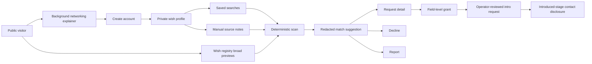
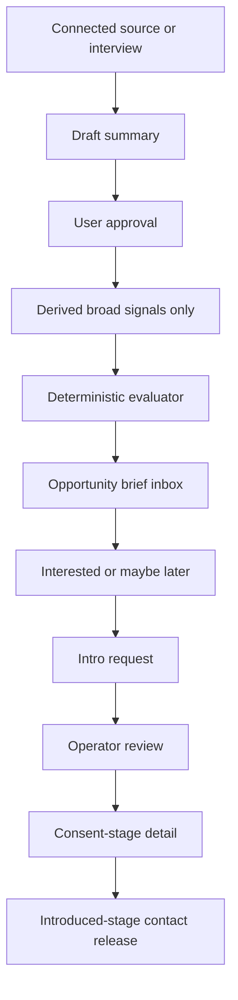

# Moral Trade Background Networking Audit Against Forethought

## Executive summary

This audit examined the two user-prioritized sites in the requested order: **moraltrade.org** and **forethought.org**. The public evidence shows that Moral Trade already has a serious **privacy-first, review-first, consent-gated** background-networking architecture on paper and in several public contracts: broad public previews, deterministic match previews, field-level disclosure grants, anti-enumeration budgets, explicit redactions, operator-reviewed introductions, self-serve deletion, and public measurement/transparency surfaces are all documented on the live site. However, the same public materials also show that its background-networking system is still **pilot-stage and incomplete**: the authenticated dashboard could not be inspected directly without access, transparency metrics are effectively zero so far, and the public API contract currently reports many missing background-networking route files, including routes for intro requests, opportunity briefs, source connections, source summaries, saved searches, and wish-registry search. citeturn4view0turn5view0turn19view0turn19view3turn23view2turn26view2turn38view0

Forethought’s design sketch for Background Networking calls for something more ambitious: interoperable and secure **wish profiling**, optional **passive data ingestion** from connected services, optional **interview-style elicitation**, and a semi-private **wish registry** that can surface likely counterparties before users know whom to search for. Forethought also treats privacy and surveillance as the core design problem, recommending filtering and selective visibility rather than naive openness or absolute secrecy. citeturn2view1turn2view2

The central finding is that **Moral Trade’s current approach is directionally aligned with Forethought on privacy, staged disclosure, and semi-private discovery, but materially underpowered on profile formation and proactive discovery**. That gap appears deliberate rather than accidental: Moral Trade explicitly says it does **not** currently ingest private feeds, does **not** run live connector workers, keeps AI assistance in **shadow-only** mode, and keeps private-overlap computation in **design-only** mode pending DPIA, privacy review, and cryptographic review. citeturn4view2turn4view3turn4view4turn19view0turn19view1

My judgment is therefore:

* **Forethought does suggest improvements** to Moral Trade’s current Background Networking feature.
* The right improvements are **not** “turn on mass ingestion” or “automate outreach.”
* The right improvements are a **narrow, consented, reviewed enrichment layer**: opt-in source connectors that only produce approved summaries; a conversational wish-interview assistant; and actionable opportunity briefs plus introduction-request workflows that preserve Moral Trade’s current privacy and human-review posture. This is an inference from Moral Trade’s present constraints and Forethought’s design goals. citeturn2view1turn4view2turn5view0turn18search1turn19view0

Confidence is **moderate-high** on public-surface findings and **moderate** on internal implementation details, because the signed-in dashboard and any private repository code were not available for direct inspection. The report therefore relies on public pages, public JSON contracts, public status/measurement/transparency surfaces, and explicit live blockers. citeturn33view0turn26view0turn26view2turn38view0

## What Moral Trade exposes today

Moral Trade’s public Background Networking page describes the feature as a **“conservative matching layer”** that compares broad public previews, saved preferences, and manual source notes so a participant can decide whether an introduction is worth exploring. The core public UX is visible: a visitor can read the explainer, create an account, or search “broad previews” through the public wish registry. The first-order trust boundary is explicit: **broad previews first**, **consent before detail**, and **no autonomous outreach**. citeturn4view0

The public discovery surface is the **wish registry**. It exposes keyword search, cause-area filtering, and broad openness filters such as payment-mediated or pledge-based trade openness. The registry only returns broad previews and explicitly withholds exact asks, exact wishes, and contact details unless both sides approve the next stage. It currently shows only a handful of demo previews, which matches the pilot-status snapshot of just **2 public profiles** and **0 live proposals**. citeturn15view0turn26view0

The account-creation flow is minimal: display name, email, password, and optional location, with location hidden publicly by default. Immediately after signup, the site steers users toward one of three low-risk first actions, one of which is to **create a private wish profile**, and it states that nothing is public by default. The login page says that after sign-in, users can review their background-networking dashboard, private alerts, saved searches, privacy grants, and source permissions in one place. The dashboard itself was not directly inspectable without auth, but those public pages establish the intended signed-in UX. citeturn31view0turn16view1turn16view3turn33view0

Within the documented matching flow, Moral Trade stores **private wish profiles**, **manual source notes**, **saved searches**, and **broad registry previews**. Matching is described as **deterministic**, based on declared cause areas, trade modes, constraints, location sensitivity, and verification preferences. Resulting match cards show **coarse reason codes**, **confidence bands**, **trust/risk badges**, and visible redactions. A participant can request more detail, decline, or report a suggestion, but a suggestion is **not** an introduction and does **not** itself disclose private data. citeturn4view0turn4view1turn6view0

The public match-signal contract is unusually specific. It limits input fields to redacted profile data, publishes approved factor codes, forbids inference of protected traits, ideology, psychology, hidden preferences, exact private wishes, raw notes, or contact details, and requires human review before disclosure, contact, reliance, or state changes. This is stronger than a generic matching explainer: it is an explicit public contract for what the matching lane is and is not allowed to do. citeturn6view0

The privacy model is also unusually explicit. Public evidence says private wish and source data are stored in Moral Trade records backed by **Supabase**, and new sensitive wish/source text is **app-level encrypted before storage**. The data model publishes entities including `private_wish_profile`, `source_connection`, `source_note`, `saved_search`, `privacy_grant`, `match_suggestion`, and `notification`, along with privacy classes such as `public_preview`, `private_authenticated`, `consent_granted`, and `operational_private`. The site also says row-level-security regression tests fail if sensitive tables lose RLS, participant-scoped policies, or ciphertext/version columns. citeturn19view0turn9view0turn4view3

Opt-in and opt-out are present and concrete. The privacy page says participants can disable discoverability or public preview sharing from the wish profile, can control field-level grants by stage and field, can export profile data, and can delete the background-networking layer without deleting the whole account by typing **DELETE BACKGROUND NETWORKING**. That deletion covers private wishes, synthesis, broad previews, source summaries, saved searches, suggestions, notifications, intro artifacts, and queued background-networking emails, while retaining only redacted or anonymized audit rows where integrity requires retention. citeturn5view0turn19view1turn19view3

The source-connection story is currently narrow by design. Moral Trade says the dashboard can record links to blogs, email, calendars, chatbot history, search profiles, and other sources, but **for now** it only stores consent scope, import mode, reviewed summaries, and approved derived profile signals. It explicitly says the app does **not** automatically ingest, scrape, or search raw external data, and that active external connectors would require separate permissions, consent notes, retention windows of 30/90/180/365 days, and field lists limited to broad matching categories. Optional AI shadow review is separate, uses only approved summaries, and may not affect live matching, ranking, disclosure, or outreach. citeturn19view0turn19view1turn5view0

Notifications and background processes are documented, though not visibly active at scale. The privacy page says notifications cover account, evidence, review, background-networking, and digest updates, with preference rows and delivery records retained to honor opt-outs and diagnose delivery. The methodology page says background scans can open notifications, saved-search results, match reports, network invite drafts, brokerage bounties, and introduction plans. The measurement plan defines privacy-safe events such as `privacy_grant_changed`, `detail_request_submitted`, `detail_request_resolved`, `match_consent_recorded`, and `background_scan_run`. Yet the transparency report shows that reviewed match suggestions, opportunity briefs, feedback, intro packets, disclosure grants, participant reports, and concierge appeals are all currently **0**, with small-sample suppression at counts under 3. citeturn19view0turn18search1turn22view0turn23view1turn23view2

The implementation hints are strong enough to infer a TypeScript application with public route contracts and test hooks, backed by Supabase. The technical spec lists canonical test files such as `src/lib/background-networking.test.ts`, `src/lib/background-opportunity-briefs.test.ts`, `src/lib/background-private-overlap.test.ts`, and `src/lib/wish-registry.test.ts`, and uses a `node --import tsx --test ...` test command. It also publishes explicit rate-limit surfaces for background routes, security headers, private-route `no-store`, and other operational controls. citeturn34view0turn35view0turn35view1

At the same time, one of the strongest public signals is that the implementation is incomplete. The pilot-status page marks **API contract and implementation** as **fail** with **57 blockers**, and the public API contract lists missing route files for major background-networking endpoints, including `/api/background/intro-requests`, `/api/background/opportunity-briefs`, `/api/background/opportunities`, `/api/background/profile-signals/recompute`, `/api/background/source-connections`, `/api/background/source-summaries`, `/api/saved-searches`, and `/api/wish-registry/search`. That does not mean the idea is absent; it means the public catalog itself says the implementation is not yet fully realized. citeturn26view2turn38view0



### Public-surface mockup of the current experience

The signed-in dashboard could not be directly inspected. The following mockup is therefore a reconstruction from the live public pages and contracts, not a literal screenshot. It reflects the documented current state. citeturn16view1turn4view0turn5view0

```text
CURRENT MATCH CARD

[ Cause overlap ] [ Verification compatible ] [ Confidence: high ]
[ Risk badge ] [ Human review required ]

Why you are seeing this match:
- shared cause areas
- compatible trade mode
- compatible verification preferences

Hidden until later stage:
- exact wish
- exact ask
- sensitive constraints
- raw source notes
- contact details

Actions:
[Request more detail] [Maybe later] [Report]
```

## What Forethought recommends

Forethought’s design sketch says background networking exists to help people **find and recognize potential counterparties** for collaboration, trade, reconciliation, coalition formation, and other mutually beneficial coordination that current mechanisms miss because they are slow and noisy. In Forethought’s framing, the point is not merely searchable profiles; it is a system that can connect people **before they even know to go looking**. citeturn2view1

The sketch proposes two main technical components. The first is **interoperable, secure wish profiling**: users may connect existing online sources so that a delegate system can distill an up-to-date representation of their hopes, intent, and capabilities, and users can also proactively enter wishes through chat-like interfaces. The second is a **searchable wish registry** that allows interests to run searches over large collections of wants and offers while preserving a degree of semi-privacy and surfacing only enough information to judge whether further exploration is warranted. citeturn2view1turn2view2

Forethought explicitly recommends two forms of profile formation that are not yet fully live on Moral Trade. One is **passive data ingestion** from consensually connected sources such as social media, browsing history, email, and other personal records, with the goal of extracting principles and preferences from available data. The other is **direct preference elicitation** through interview-style or chatbot-style assistance focused on points of highest uncertainty. citeturn2view1turn2view2

At the same time, Forethought treats privacy as the central unresolved challenge. It says comprehensive background networking requires sensitive data on what people really want, and that this creates a hard trade-off: too much visibility enables surveillance, harassment, and exploitation; too much secrecy can also facilitate harmful collusion. Forethought therefore suggests some kind of **filtering system** that determines who can see which parts of the data, specifically to resist data extraction while preserving enough transparency to prevent abuse. citeturn2view1

Forethought also says the technology seems technically feasible today, that deployments could begin in narrower niches, and that it may be valuable to work first with existing matchmakers and community organizers. It notes that implementations could be centralized or decentralized, with decentralized versions potentially being more portable. citeturn2view1turn28view0

That design stance matters when evaluating Moral Trade. Forethought is **not** recommending indiscriminate scraping or autonomous cold outreach as the default reading of background networking. Rather, it recommends richer profile formation, semi-private matching, early niches, and serious privacy design. On those fundamentals, Moral Trade already shares many of the right instincts. The main difference is that Moral Trade currently stops much earlier in the capability ladder. citeturn2view1turn4view2turn4view4

## Comparative assessment

Moral Trade’s current implementation is best understood as a **defense-favored subset** of Forethought’s background-networking vision. It already has the registry, the staged disclosure lattice, the narrow grants, the explicit anti-surveillance rules, the operator review step, and the “no autonomous outreach” boundary. In some respects, especially trust and verification, it is arguably *more concrete* than Forethought’s sketch because it publishes public contracts, rate limits, deletion flows, redaction rules, incident response, and measurement policies. citeturn4view0turn6view0turn14view2turn19view1turn35view0turn35view2

Where it most clearly falls short is **profile richness and proactive discovery**. Forethought expects secure wish profiling from connected data and/or conversational elicitation; Moral Trade explicitly says it does not ingest private feeds, does not run live connector workers, and keeps AI shadow assistance non-operative for live matching. It therefore has strong safety posture but weaker recall: fewer latent opportunities will be found, especially before users know what to search for. That is the main improvement space. This is an inference from the contrast between the two designs. citeturn2view1turn19view0turn4view2turn4view4

| Dimension | Moral Trade current state | Forethought sketch | Assessment |
|---|---|---|---|
| Goals | Reduce search costs for possible trades **without turning people into targets**; conservative, reviewable matching. citeturn4view0turn5view0 | Connect people who should know each other, possibly before they know to search, for trade, coalition building, and coordination. citeturn2view1turn28view0 | **Aligned**, but Moral Trade is narrower and more defensive. |
| User consent | Strong staged consent: broad preview → consent stage → introduced stage; field-level grants; introduced-stage contact requires owner approval and MFA step-up. citeturn14view2turn19view1turn35view1 | Consensual source connection and active wish injection are core. citeturn2view1turn2view2 | **Moral Trade is stronger on explicit consent controls.** |
| Discoverability | Public wish registry exists; deterministic scans and opportunity concepts exist; live activity is near-zero and many listed routes are missing. citeturn15view0turn18search1turn23view2turn38view0 | Searchable wish registry plus richer delegates and proactive discovery. citeturn2view1 | **Underpowered** relative to Forethought. |
| Persistence | Saved searches, helper runs, notifications, grants, intro artifacts, and deletion scopes are documented. citeturn5view0turn19view3 | Continuous or regularly updated wish profiles implied by delegates and registries. citeturn2view1turn2view2 | **Partially aligned**; persistence exists, but signal-refresh is weak. |
| Resource usage | Deterministic matching, no raw-feed ingestion, budgeted scans, query fingerprints, sparse-result withholding. citeturn4view1turn19view1 | Registry/indexing at scale is expected; centralized or decentralized deployment both possible. citeturn2view1 | **Moral Trade is lighter-weight and safer, but less capable.** |
| Privacy | Broad previews, explicit redactions, app-level encryption, RLS, anti-enumeration budgets, deletion, analytics redaction, no raw-feed mining. citeturn4view1turn4view3turn19view0turn19view3turn35view1 | Privacy/surveillance trade-off is the biggest challenge; selective visibility is needed. citeturn2view1 | **Strong alignment**, with Moral Trade already operationalizing the warning. |
| Trust and verification | Public contracts, measurement plan, transparency report, review workflow, incident response, named reviewer responsibilities, evidence/provenance model. citeturn6view1turn22view0turn23view2turn24view5turn35view2 | Sketch-level discussion; feasibility and direction rather than implementation detail. citeturn2view1turn28view0 | **Moral Trade is substantially stronger here.** |
| Scalability | Pilot-stage, 0 reviewed match suggestions and 57 API blockers on the public implementation audit; centralized first, portable later. citeturn23view2turn26view2turn18search1 | Large-scale indexing and registries are feasible; niche-first adoption advised. citeturn2view1 | **Weak today**, but the niche-first strategy is compatible. |
| Failure modes | No autonomous outreach, probe limits, risk logging, operator queue, appeals, incident categories for unsafe matching/disclosure. citeturn5view0turn14view2turn24view5turn35view2 | Privacy leakage and collusion are core concerns. citeturn2view1 | **Well addressed on paper.** |
| Moderation and governance | Reviewer roles are public, but named advisor/reviewer roster is still not public. citeturn25view0turn25view1 | Early work should foreground governance-sensitive privacy solutions. citeturn2view1 | **Adequate for pilot, not yet mature enough for scale.** |
| Metrics | Rich privacy-safe event taxonomy and quarterly transparency, but real usage counts remain mostly zero. citeturn22view0turn23view2 | No detailed metric taxonomy, but feasibility/adoption questions are raised. citeturn2view1 | **Strong instrumentation plan; weak operating evidence so far.** |

The net conclusion is simple: **Moral Trade is already a very serious defense-favored interpretation of background networking, but it currently realizes mostly the safety scaffolding and only part of the discovery power**. The best next moves are the ones that increase profile quality and opportunity discovery **without** breaking the privacy posture that gives the product its legitimacy. citeturn2view1turn4view2turn19view0

## Prioritized improvements

### Add consented source-summary enrichment

**Priority:** High impact, medium effort.

This is the clearest improvement Forethought suggests. Forethought explicitly recommends consensual passive data ingestion and secure wish profiling from connected services, while Moral Trade currently records source permissions and summaries but says live connector workers are blocked pending DPIA, lawful-basis documentation, privacy-design review, and external review. The improvement, therefore, is **not** full raw-data ingestion. It is implementing a **reviewed summary pipeline**: connect a source, draft a redacted summary, let the user approve it, derive only broad signals, then recompute deterministic profile signals from those approved summaries. citeturn2view1turn2view2turn4view2turn19view0turn19view1

**UX changes:** Add a dashboard wizard called **Connect a source** with four clear steps: select source type, choose field permissions, choose retention window, and approve the generated summary before it can influence matching. The user should then see a **Derived signals** card showing exactly which broad tags were extracted and which matching categories they can influence. This preserves the current moraltrade.org posture that people review broad signals rather than silently ceding raw access. citeturn19view0turn19view1turn16view1

**Data-model changes:** Moral Trade’s public contracts already name `source_connection`, `source_note`, `private_wish_profile`, and `saved_search` entities. The implementation should add or complete a derived-signal layer, if not already present internally, with explicit lifecycle state, approval timestamps, permitted field keys, retention expiry, and a link back to the approved summary. If equivalent tables already exist under different names, migrate them rather than duplicating them. citeturn9view0turn5view0

**API endpoints to implement or complete:** `/api/background/source-connections`, `/api/background/source-connections/:id/draft-summary`, `/api/background/source-summaries`, `/api/background/source-summaries/:id/approve`, and `/api/background/profile-signals/recompute`. Those exact families appear in the public API blockers list, which makes them the highest-confidence missing surfaces to target. citeturn38view0

**Backend sketch**

```ts
// app/api/background/source-connections/route.ts
import { z } from "zod";
import { requireUser } from "@/src/lib/auth";
import { db } from "@/src/lib/db";
import { rateLimit } from "@/src/lib/rate-limit";

const CreateSourceConnection = z.object({
  sourceKind: z.enum(["blog", "calendar", "chatbot_history", "email", "search_profile"]),
  consentScope: z.string().min(10),
  retentionDays: z.enum(["30", "90", "180", "365"]).transform(Number),
  allowedFieldKeys: z.array(
    z.enum([
      "cause_priorities",
      "capability_tags",
      "offer_ask_terms",
      "verification_preferences",
      "availability_context",
      "safety_constraints"
    ])
  ).min(1),
  importMode: z.literal("summary_only")
});

export async function POST(req: Request) {
  const user = await requireUser(req);
  await rateLimit(`background_source_summary_write:${user.id}`);

  const body = CreateSourceConnection.parse(await req.json());

  const row = await db.sourceConnection.insert({
    ownerId: user.id,
    sourceKind: body.sourceKind,
    consentScope: body.consentScope,
    retentionDays: body.retentionDays,
    allowedFieldKeys: body.allowedFieldKeys,
    importMode: "summary_only",
    rawIngestionAllowed: false,
    aiShadowModeAllowed: false,
    status: "connected_pending_summary"
  });

  return Response.json({ ok: true, id: row.id }, { headers: { "Cache-Control": "private, no-store" } });
}
```

```ts
// app/api/background/profile-signals/recompute/route.ts
export async function POST(req: Request) {
  const user = await requireUser(req);
  await rateLimit(`match_signal_evaluate:${user.id}`);

  const approvedSummaries = await db.sourceSummary.listApprovedForOwner(user.id, new Date());

  const derivedSignals = deriveBroadSignals(approvedSummaries); // no raw source text beyond approved summary
  await db.intentClaims.replaceForOwner(user.id, derivedSignals);

  const matchPreviewCount = await enqueueDeterministicRecompute(user.id);
  return Response.json({ ok: true, stateMutation: "signals_recomputed", matchPreviewCount });
}
```

**Privacy and security mitigations:** Keep `rawIngestionAllowed = false`; require explicit field permissions; require expiry and revocation; encrypt summary bodies; ensure expired summaries stop contributing to profile synthesis; keep AI output shadow-only until separate promotion gates pass; and preserve owner-scoped RLS with no anonymous access. Those constraints are all consistent with Moral Trade’s existing public posture. citeturn4view2turn4view3turn4view4turn19view0turn35view1

**Testing plan:** Add route-contract tests for each new/implemented endpoint; RLS tests for owner-only access; retention-expiry tests; revocation tests; signal-derivation determinism tests; and a regression test ensuring no raw source payload enters analytics, notification templates, or public match explanations. This mirrors the existing published test culture around `background-networking`, `background-privacy-controls`, `background-ai-shadow`, and `wish-registry`. citeturn34view0

**Rollout:** Ship behind a feature flag for a tiny cohort; start with source kinds that are easiest to summarize safely, such as blogs or public webpages the user explicitly names; require manual approval of every summary; keep AI summarization shadow-only until evaluation metrics and privacy incident counts remain acceptable. citeturn4view2turn36view0

**Estimated effort:** roughly **1 to 2 engineering weeks** for route scaffolding and persistence if schema foundations already exist; **2 to 4 weeks** if consent-ledger, approval UI, and recompute jobs all still need to be built.

### Add a direct wish-interview assistant

**Priority:** High impact, medium effort.

Forethought explicitly recommends **interview-style preference elicitation**, and Moral Trade’s current public flows show only standard signup plus private wish-profile creation, with no visible interview assistant. Moral Trade also already has a published copilot framework with shadow mode, assist mode blocked, and strict no-outreach/no-private-feed-ingestion guardrails. That makes a **wish interview** the most natural “next AI layer”: not for live decisions, but for asking clarifying questions and drafting structured wish fields for user approval. citeturn2view1turn2view2turn31view0turn36view1

**UX changes:** After “Create a private wish profile,” present an optional flow: **Let the assistant ask 5 focused questions**. Each question should target a known uncertainty area such as cause priorities, trade modes, hard constraints, verification expectations, or location sensitivity. The output should be a draft profile diff the user must review line-by-line before saving. The assistant must never create a live match, grant disclosure, or contact a counterparty. citeturn31view0turn36view1

**Text mockup of the improved interview card**

```text
WISH INTERVIEW

We can ask a few questions to clarify your profile.
Nothing will be public unless you approve it.

Question 1:
Which matters more for this profile right now?
[ finding counterparties ] [ surfacing public-good opportunities ] [ both ]

Question 2:
What would rule out most introductions?
[ mismatched cause area ] [ weak verification ] [ location ] [ privacy ]

Draft changes for approval:
+ add cause_area: public_health
+ add verification_preference: receipt_or_attestation
+ add privacy_stage_default: broad
[Approve draft] [Edit manually] [Discard]
```

**Data-model changes:** Add an `elicitation_session` or equivalent table keyed to `private_wish_profile`, plus `elicitation_question`, `elicitation_answer`, and `elicitation_draft_patch` rows if they do not already exist. Store only the approved structured fields as live input to matching. If free-text answers are stored, encrypt them and exclude them from analytics and public explanations. citeturn19view0turn36view1

**API endpoints:** `POST /api/background/wish-interviews`, `POST /api/background/wish-interviews/:id/respond`, `POST /api/background/wish-interviews/:id/draft-patch`, and `POST /api/background/wish-interviews/:id/apply`. These are inferred endpoints rather than ones already published by name; the important thing is that they must preserve Moral Trade’s existing shadow/assist rollout gates. citeturn36view1

**Frontend and backend sketch**

```ts
type WishInterviewQuestion = {
  id: string;
  prompt: string;
  answerType: "single_select" | "multi_select" | "short_text";
  allowedOptions?: string[];
};

type WishProfilePatch = {
  causeAreas?: string[];
  tradeModes?: string[];
  verificationPreferences?: string[];
  locationSensitivity?: string;
  constraints?: string[];
};

function applyApprovedPatch(current: PrivateWishProfile, patch: WishProfilePatch): PrivateWishProfile {
  return {
    ...current,
    causeAreas: dedupe([...(current.causeAreas ?? []), ...(patch.causeAreas ?? [])]),
    tradeModes: dedupe([...(current.tradeModes ?? []), ...(patch.tradeModes ?? [])]),
    verificationPreferences: dedupe([
      ...(current.verificationPreferences ?? []),
      ...(patch.verificationPreferences ?? [])
    ]),
    locationSensitivity: patch.locationSensitivity ?? current.locationSensitivity,
    constraints: dedupe([...(current.constraints ?? []), ...(patch.constraints ?? [])])
  };
}
```

**Privacy and security mitigations:** Keep the assistant in **shadow** or **assist** mode only; validate outputs against a strict schema; block any generated output that includes contact details, ideology/psychology inference, or exact-wish disclosure beyond the owner’s private profile; do not allow the assistant to mutate match state automatically; and expose a “generated by assistant” provenance marker for every approved patch. Moral Trade’s published copilot contract already supports this style of bounded assistance. citeturn36view1

**Testing plan:** schema validation tests, harmful-output blocking tests, approval-required tests, no-state-change-on-invalid-output tests, analytics-redaction tests, and helpfulness/overrule metrics tied into the public evaluation regime. citeturn36view0turn36view1

**Rollout:** start in **shadow mode** that only proposes questions and draft patches without saving; then limited **assist mode** for a small cohort once privacy incidents remain at zero and review metrics remain acceptable. citeturn36view0turn36view1

**Estimated effort:** roughly **1 to 3 engineering weeks**, depending on whether an internal structured copilot and prompt registry already exist in the codebase as the technical spec suggests. citeturn36view1

### Implement actionable opportunity briefs and intro requests

**Priority:** High impact, medium effort.

Moral Trade’s methodology page already says background scans can open notifications, saved-search results, match reports, network invite drafts, brokerage bounties, and introduction plans. Its transparency report already tracks **opportunity briefs**, **opportunity feedback**, and **intro packets**. Its API contract already names blocker routes for `/api/background/opportunity-briefs`, `/api/background/opportunities`, `/api/background/opportunity-briefs/:id/feedback`, and `/api/background/intro-requests`. This strongly suggests that the next concrete improvement is to complete the **actionability layer** between match preview and operator-reviewed introduction. citeturn18search1turn23view1turn38view0

**UX changes:** Give signed-in users an **Opportunity Briefs inbox**. Each brief should summarize: why this surfaced, what broad overlap exists, what remains hidden, what action is available now, and what the privacy cost of that action would be. Actions should remain bounded: mark interested, maybe later, dismiss, request detail, or request reviewed introduction. This is much closer to the Forethought idea that the system should surface worthwhile counterparties before a user knows exactly how to search, while still preserving Moral Trade’s explicit anti-targeting posture. citeturn2view1turn4view1turn18search1

**Data-model changes:** Complete or add `background_opportunity_brief`, `background_match_feedback`, `background_intro_request`, and `background_intro_packet` tables, plus status enums and SLA timestamps. Moral Trade’s public materials already imply these objects even if the route files are missing. citeturn23view1turn38view0

**API endpoints:** `GET /api/background/opportunity-briefs`, `POST /api/background/opportunity-briefs/:id/feedback`, `POST /api/background/intro-requests`, `POST /api/background/intro-requests/:id/appeal`, `POST /api/background/intro-requests/:id/approve-contact`, and `POST /api/background/intro-packets`. These are directly reflected in the public blocker list. citeturn38view0

**Route sketch**

```ts
// app/api/background/opportunity-briefs/route.ts
export async function GET(req: Request) {
  const user = await requireUser(req);
  await rateLimit(`background_opportunity_brief_read:${user.id}`);

  const briefs = await db.opportunityBrief.listForOwner(user.id, {
    statuses: ["new", "viewed", "maybe_later"],
    limit: 20
  });

  return Response.json({
    results: briefs.map(b => ({
      id: b.id,
      headline: b.headline,
      summary: b.summary,
      visibleFactorCodes: b.visibleFactorCodes,
      confidenceBand: b.confidenceBand,
      redactedFields: b.redactedFields,
      actions: ["interested", "maybe_later", "dismissed", "request_intro"]
    }))
  }, { headers: { "Cache-Control": "private, no-store" } });
}
```

```ts
// app/api/background/intro-requests/route.ts
const IntroRequestInput = z.object({
  opportunityBriefId: z.string().uuid(),
  requestedPurpose: z.string().min(10),
  privacyConstraints: z.array(z.string()).default([]),
  proposedTradeShape: z.string().min(10)
});

export async function POST(req: Request) {
  const user = await requireUser(req);
  await rateLimit(`match_concierge_request:${user.id}`);

  const body = IntroRequestInput.parse(await req.json());

  const row = await db.introRequest.insert({
    requesterId: user.id,
    opportunityBriefId: body.opportunityBriefId,
    requestedPurpose: body.requestedPurpose,
    privacyConstraints: body.privacyConstraints,
    proposedTradeShape: body.proposedTradeShape,
    status: "queued_for_operator_review"
  });

  return Response.json({ ok: true, id: row.id, status: row.status });
}
```

**Privacy and security mitigations:** continue redacted previews only; suppress repeated same-owner probing; cap request cadence; require operator review before contact disclosure; keep email outbox suppression for sensitive details; and require introduced-stage approval plus MFA step-up before contact release. These controls are already in the published disclosure and operations contracts and should remain unchanged. citeturn14view2turn35view0turn35view1

**Testing plan:** route-contract tests, anti-enumeration tests, feedback-state machine tests, duplicate intro-request suppression tests, notification-redaction tests, and transparency-counter updates. citeturn22view0turn23view1turn38view0

**Rollout:** start with a tiny operator-mediated cohort, matching Forethought’s niche-first recommendation and Moral Trade’s own “pilot packs” guidance. Donor circles, reading groups, and organization cohorts are already named as good early contexts. citeturn5view0turn2view1

**Estimated effort:** roughly **2 to 4 engineering weeks**, especially if notification templates, queue processing, and operator views are not already present internally.

### Keep private-overlap cryptography gated

**Priority:** Medium impact, high effort.

Forethought’s design implies some cases where richer semi-private overlap could help, and Moral Trade already publishes a design-only contract for privacy-preserving overlap checks using **blinded tags**, **VOPRF**, **HPKE sealed fields**, **PSI**, or **PIR-PSI**. But its own public contract says this lane is **not live**, no live endpoints are enabled, no overlap tables are created, only curated tags would be allowed, and raw or canonical tags are forbidden until DPIA and formal cryptographic review occur. That caution is correct. Do **not** skip it. citeturn4view2turn7view1turn41search0turn41search1

The improvement here is not immediate launch. It is to prepare a **very narrow pilot** based only on approved broad tags and blinded-token storage, using current standards like **HPKE** and **VOPRF/POPRF** when and only when the prerequisite privacy and crypto reviews clear. The purpose would be to raise recall on specific narrow overlap checks without storing or exposing exact counterparties’ sensitive tags. This is an inference supported by Moral Trade’s own published design direction and Forethought’s privacy-sensitive matching goals. citeturn7view1turn2view1turn41search0turn41search1

**Estimated effort:** at least **4 to 8 engineering weeks plus external review**, and possibly more. It should come **after** the source-summary and wish-interview work, not before.



## Codex implementation brief

Because Forethought’s guidance does suggest real improvements, the following is the implementation brief I would hand to **Codex GPT-5.5-xHigh**.

### Codex objective

Implement the next defensible step of Moral Trade’s Background Networking feature by **adding consented source-summary enrichment, a wish-interview assistant, and actionable opportunity briefs/intro requests**, while preserving all current privacy contracts:

* broad previews first
* field-level grants
* no autonomous outreach
* no raw private-feed ingestion
* shadow-first AI promotion
* operator review before introduced-stage contact disclosure

These constraints are not optional; they are core product requirements documented publicly on the site. citeturn4view0turn4view2turn4view4turn14view2turn35view1turn36view1

### Codex step-by-step instructions

#### Implement the missing route families first

Create or complete the route files that the public API contract currently reports as missing, prioritizing:

* `/api/background/source-connections`
* `/api/background/source-connections/:id/draft-summary`
* `/api/background/source-summaries`
* `/api/background/source-summaries/:id/approve`
* `/api/background/profile-signals/recompute`
* `/api/background/opportunity-briefs`
* `/api/background/opportunity-briefs/:id/feedback`
* `/api/background/intro-requests`
* `/api/background/intro-requests/:id/appeal`
* `/api/background/intro-requests/:id/approve-contact`
* `/api/background/intro-packets`
* `/api/saved-searches`
* `/api/wish-registry/search`  citeturn38view0

If the repository already contains equivalent handlers under different names, refactor the public API contract and route registry to match reality instead of duplicating logic. The published blocker list indicates an implementation/spec drift problem; fix that drift. citeturn26view2turn38view0

#### Align schema with public contracts

Use the published data-model entities as the source of truth, especially:

* `private_wish_profile`
* `source_connection`
* `source_note`
* `saved_search`
* `privacy_grant`
* `match_suggestion`
* `notification`  citeturn9view0

Add or complete these background-specific structures if missing:

```sql
create table if not exists background_source_summaries (
  id uuid primary key default gen_random_uuid(),
  source_connection_id uuid not null references source_connections(id) on delete cascade,
  owner_id uuid not null references participants(id) on delete cascade,
  draft_summary_ciphertext text not null,
  approved_summary_ciphertext text,
  redaction_level text not null default 'redacted',
  allowed_field_keys text[] not null,
  retention_expires_at timestamptz not null,
  ai_shadow_mode_allowed boolean not null default false,
  status text not null check (status in ('draft','approved','revoked','expired')),
  created_at timestamptz not null default now(),
  approved_at timestamptz
);

create table if not exists background_profile_signals (
  id uuid primary key default gen_random_uuid(),
  owner_id uuid not null references participants(id) on delete cascade,
  source_summary_id uuid references background_source_summaries(id) on delete set null,
  signal_key text not null,
  signal_value text not null,
  namespace text not null,
  confidence_band text not null check (confidence_band in ('low','medium','high')),
  created_at timestamptz not null default now(),
  expires_at timestamptz
);

create table if not exists background_opportunity_briefs (
  id uuid primary key default gen_random_uuid(),
  owner_id uuid not null references participants(id) on delete cascade,
  counterparty_profile_id uuid not null references public_profiles(profile_id),
  headline text not null,
  summary text not null,
  visible_factor_codes text[] not null,
  confidence_band text not null,
  redacted_fields text[] not null,
  status text not null check (status in ('new','viewed','interested','maybe_later','dismissed')),
  created_at timestamptz not null default now(),
  seen_at timestamptz
);

create table if not exists background_intro_requests (
  id uuid primary key default gen_random_uuid(),
  requester_id uuid not null references participants(id) on delete cascade,
  opportunity_brief_id uuid not null references background_opportunity_briefs(id) on delete cascade,
  requested_purpose text not null,
  proposed_trade_shape text not null,
  privacy_constraints text[] not null default '{}',
  status text not null check (status in ('queued_for_operator_review','needs_clarification','approved_for_consent_stage','declined','appealed')),
  created_at timestamptz not null default now(),
  decided_at timestamptz
);
```

If these tables already exist with different names, write migrations that keep data and update any contract schemas accordingly. All sensitive text fields should preserve Moral Trade’s published encryption/version-column expectations. citeturn4view3turn9view0turn35view1

#### Enforce row-level security and staged disclosure

Mirror the public RLS and disclosure contracts:

* no anonymous access to private tables
* owner-scoped access to all source-summary and signal tables
* participant/counterparty predicates for intro-request views
* field-level grants for exact wishes and source summaries
* introduced-stage contact disclosure requires explicit owner approval and MFA step-up  citeturn14view2turn4view3turn35view1

#### Add the dashboard surfaces

Implement three new signed-in panels:

* **Sources**
  * connect source
  * choose retention
  * choose allowed field keys
  * review and approve summary

* **Wish interview**
  * optional interview
  * structured patch review
  * apply only after user approval

* **Opportunity briefs**
  * see redacted opportunity briefs
  * give closed-code feedback
  * request reviewed introduction

Keep everything behind login with `private, no-store`. citeturn16view1turn19view0turn35view0

#### Preserve analytics, notification, and email redaction

Do not let any of the new routes log exact wishes, source notes, message text, contact details, or raw source payloads to analytics. Use counts, buckets, stage labels, and status transitions only. Keep sensitive email rows suppressed before provider send. Respect the analytics opt-out behavior already described publicly. citeturn4view0turn19view1turn19view3turn35view0

#### Keep AI bounded

Any summarization or interview assistance must start in **shadow mode**. It may produce a draft summary or patch, but it must not:

* create live match suggestions
* change ranking
* disclose private details
* contact counterparties
* mutate grants or intro states without human/user approval  citeturn4view4turn36view0turn36view1

#### Tests Codex should write

At minimum, add:

```bash
node --import tsx --test \
  src/lib/background-networking.test.ts \
  src/lib/background-privacy-controls.test.ts \
  src/lib/background-ai-shadow.test.ts \
  src/lib/background-opportunity-briefs.test.ts \
  src/lib/background-notifications.test.ts \
  src/lib/wish-registry.test.ts
npm run lint
git diff --check
```

Also add new route-specific tests for:

* source-connection creation and revocation
* approved-summary-only derivation
* expired-summary non-use
* no raw-source leakage
* intro-request queue state machine
* approve-contact MFA step-up enforcement
* detail-request probing limits
* analytics redaction
* transparency counter updates  citeturn34view0turn14view2turn22view0

#### Deployment and rollout

Deploy behind three flags:

* `background_source_summary_enabled`
* `background_wish_interview_enabled`
* `background_opportunity_briefs_enabled`

Roll out in this order:

1. internal/staff testing
2. tiny consenting cohort
3. one pilot pack such as donor circles or reading groups
4. broaden only after public evaluation and transparency surfaces update cleanly and privacy incidents remain zero  citeturn5view0turn22view0turn36view0

### Codex-ready prompt

```text
Implement the next safe version of Moral Trade Background Networking.

Hard requirements:
- Preserve broad-preview-first discovery.
- Preserve field-level staged disclosure: registry -> consent -> introduced.
- No autonomous outreach.
- No raw private-feed ingestion.
- AI remains shadow-first and cannot mutate live matching/disclosure state without user/human approval.
- All new private routes must use private/no-store and owner-scoped RLS.
- Keep analytics redacted: never store exact wish text, source notes, contact details, raw source payloads, or notification content.

Tasks:
1. Implement route files for:
   /api/background/source-connections
   /api/background/source-connections/:id/draft-summary
   /api/background/source-summaries
   /api/background/source-summaries/:id/approve
   /api/background/profile-signals/recompute
   /api/background/opportunity-briefs
   /api/background/opportunity-briefs/:id/feedback
   /api/background/intro-requests
   /api/background/intro-requests/:id/appeal
   /api/background/intro-requests/:id/approve-contact
   /api/background/intro-packets
   /api/saved-searches
   /api/wish-registry/search

2. Add/complete schema for:
   background_source_summaries
   background_profile_signals
   background_opportunity_briefs
   background_intro_requests
   plus any consent/audit rows required.

3. Add dashboard UI for:
   Sources
   Wish interview
   Opportunity briefs

4. Add deterministic recompute job:
   approved summary -> broad derived signals -> deterministic match preview enqueue

5. Add tests:
   route contracts
   RLS and encryption regressions
   approval-required flows
   analytics redaction
   probing suppression
   MFA step-up for contact release

6. Update public API contract / health contract so the new route files remove the current public blockers instead of drifting from implementation.

7. Ship behind feature flags and write a short deployment note plus rollback plan.
```

## Open questions and limitations

The largest limitation is that the **authenticated dashboard could not be directly inspected**, so this report cannot verify the exact private UI, live notification surfaces, or database table names beyond what is publicly documented. The dashboard route itself did not expose meaningful anonymous content, and no private repository was available. citeturn33view0

Some public JSON endpoints were only partially readable in the browser tooling because of very long contract lines. Where a route family or field list is mentioned, I used the visible parts of the public contracts and the pilot-status blocker lists, and I have avoided pretending to know any unpublished private implementation details. citeturn6view0turn14view2turn38view0

The strongest practical uncertainty is whether the public API blocker list reflects the **current deployed branch exactly** or a public-contract audit that is somewhat ahead of or behind the deployed code. Still, the safest reading is the public one: library/test scaffolding and route catalogs exist, but major background-networking routes remain incomplete on the live public implementation audit. citeturn26view2turn38view0

Even with those limitations, the core conclusion is robust: **Moral Trade already has an unusually defensible safety architecture for background networking, and Forethought’s design sketch most strongly points toward adding richer, opt-in profile formation and better opportunity surfacing rather than loosening privacy boundaries or automating outreach.** citeturn2view1turn4view2turn5view0