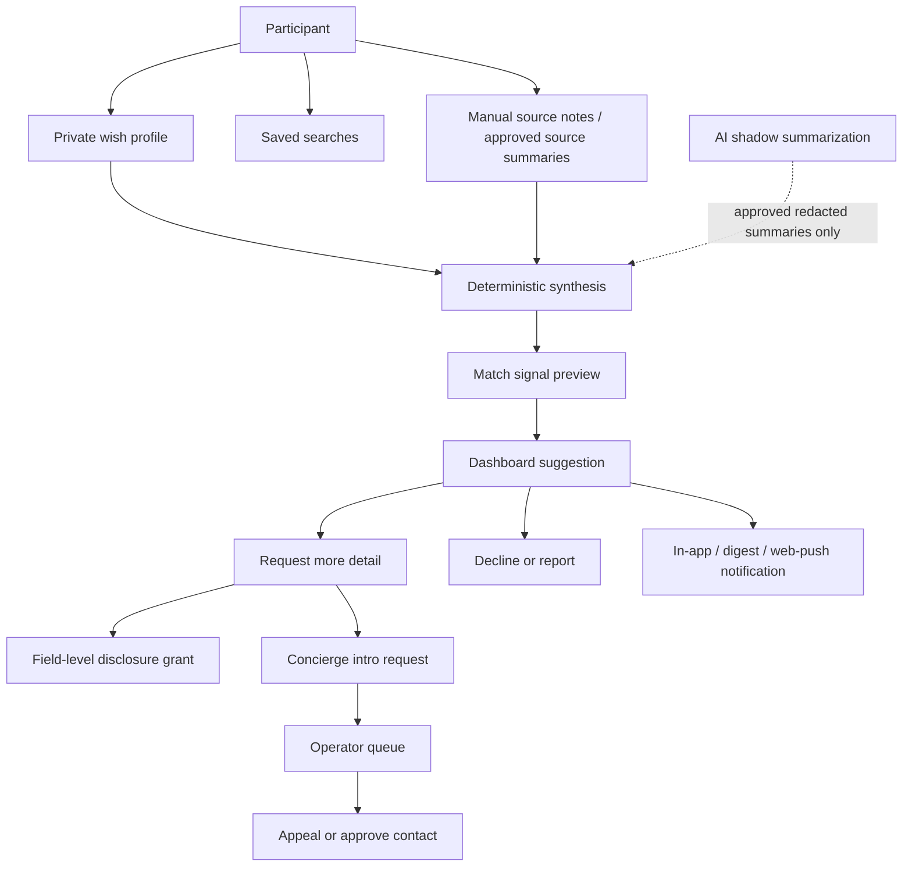
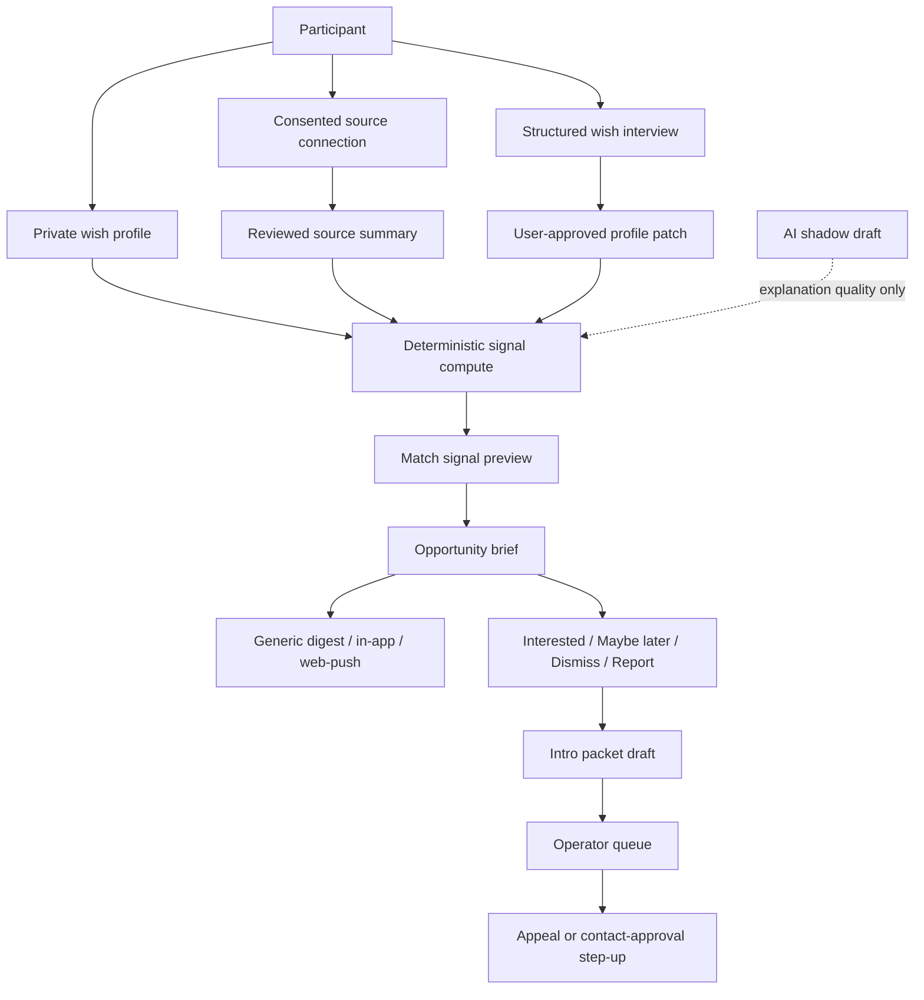
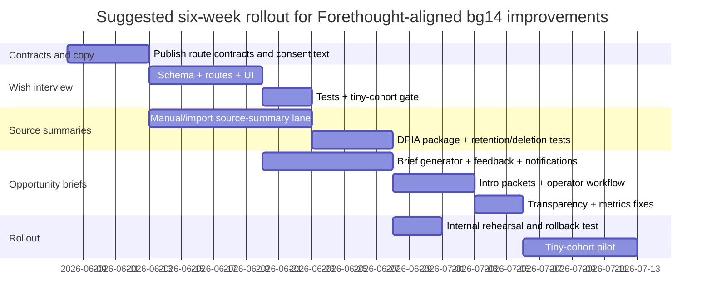

# Moral Trade Background Networking Audit and Forethought-Aligned Implementation Plan

## Executive summary

Moral Trade’s current Background Networking feature is already unusually close to the **defense-favoured** spirit of Forethought’s sketch. Its live public design is centered on **broad previews first**, **consent before detail**, **no autonomous outreach**, **deterministic rather than opaque ML matching**, **field-level disclosure grants**, **anti-enumeration controls**, and **operator-reviewed introductions**. That is a strong match to Forethought’s emphasis on semi-private discovery plus privacy-sensitive filtering, even though Moral Trade is still only a **reviewed pilot**, not a liquid marketplace: the public status page shows **0 live proposals, 8 worked examples, 2 public profiles, and 0 completed agreements**, while the public transparency report shows **0 opportunity briefs, 0 opportunity opens, 0 feedback events, and 0 intro packets** in the current reporting period. citeturn3view2turn4view0turn4view4turn13view1turn29view0turn33view0

The biggest gaps relative to Forethought are not in privacy or consent; they are in **usefulness**. Forethought’s Background Networking design envisions richer **wish profiling**, optional **passive-source distillation**, and “attentive, personalised helpers” that can notify principals and take bounded first steps toward exploration. Moral Trade’s public docs show that these more helpful lanes are mostly **scaffolded but not actually live**: the product currently relies on deterministic synthesis from explicit fields and manual source notes, AI is **shadow-only**, no private-feed ingestion is live, and the documented `bg14` rollout flags for **source summaries**, **wish interviews**, and **opportunity briefs** are still **off/internal**. citeturn17view3turn4view3turn4view2turn5view0turn7view0turn25view0turn25view1turn25view2

My bottom-line recommendation is therefore narrow and conditional: **yes, Forethought would suggest improvements to Moral Trade’s current Background Networking feature**, but the right improvements are the ones that **increase helper usefulness without crossing Moral Trade’s own safety boundary**. I recommend implementing exactly three Forethought-aligned upgrades now: a **structured wish interview** lane, a **consented source-summary** lane, and **opportunity briefs + intro packets + digest notifications**. I do **not** recommend implementing autonomous outreach, raw private-feed mining, or live privacy-preserving overlap cryptography yet. Forethought explicitly frames privacy/surveillance as the hardest unresolved trade-off, and UK ICO guidance supports a DPIA before higher-risk profiling, dataset matching, or AI-enhanced processing of personal data. citeturn25view1turn25view3turn28view0turn29view0turn34view0turn34view1turn34view2

Assessment confidence is **moderate to high**. Moral Trade’s public contracts are rich enough to support a serious audit, but some signed-in dashboard details and low-level request/response schemas for private background routes were not fully visible in the public HTML surfaces I inspected, so those items are treated as **unspecified** rather than assumed. citeturn27view0turn27view2

## Current audited state of Moral Trade Background Networking

The public UX is clear and conservative. A visitor can enter through the Background Networking explainer or the experimental wish registry, where they are told that the system compares **broad public previews**, saved preferences, and manual source notes; exact wishes and contact details stay hidden until later consent stages. Public search lets users filter broad previews by keyword, cause area, and openness to trade formats, and results are explicitly described as **broad compatibility signals**, not judgments of moral worth. citeturn3view2turn13view0turn29view0

For signed-in users, the documented working surface is the dashboard. Public documentation says the dashboard stores **private wish profiles, intent claims, manual source summaries, saved searches, disclosure grants, suggestions, notification settings, local drafts, transparency receipts, and data-right requests**. Deterministic scans can suggest counterparties, but a suggestion is explicitly **not** an introduction, and exact wishes, contact information, and sensitive constraints move only through staged disclosure and mutual consent. Concierge-style introduction requests go to an **operator queue first**, with appeal support after a decline or closure. citeturn3view2turn4view4turn5view0

The data model is unusually explicit for a pilot. Moral Trade publicly documents entities including **participant**, **public profile**, **private wish profile**, **profile visibility control**, **source connection**, **source note**, **saved search**, **privacy grant**, **match suggestion**, **notification**, and **agreement event**. These are bound to public privacy classes such as **public preview**, **privacy-thresholded public preview**, and **authenticated private**, and to relationship boundaries such as the **profile privacy boundary**, **source note boundary**, and **match disclosure boundary**. citeturn19view3turn20view0turn20view1turn26view7

Privacy and security are the strongest current parts of the feature. Moral Trade publishes stage-bound audience levels (**registry, consent, introduced**), access levels (**hidden, broad, specific, contact**), redacted-by-default field types, search privacy controls, row-level security expectations, app-level encryption for **background-networking sensitive text**, admin MFA, participant session revocation, contact-disclosure MFA step-up, private no-store cache policy, and rate-limit surfaces. It also states several non-claims: platform-wide field-level encryption is **not** claimed, 24/7 security operations are **not** claimed, and sensitive admin scale plus paid-action volume scale are still blocked. citeturn15view0turn15view5turn19view0turn23view3turn23view6turn23view7turn28view0

Notifications are documented in enough detail to audit. The privacy page says the dashboard exposes **in-app, digest email, and web-push** preferences by event type, with discovery alerts defaulting to **digest cadence**, **quiet hours**, and **source cooldowns**. Email copy is intentionally generic and must omit exact wishes, contact details, private asks, source notes, and sensitive constraints; the safety page also describes an outbox suppression gate for unsafe email rows. citeturn15view6turn28view1

Background processes are real but intentionally limited. Current match suggestions are **rule-based**, not ML-matched. The public methodology explicitly says the current synthesis layer is **deterministic**, using user-entered fields, captured excerpts, manual source notes, and structured constraints. AI beyond explanation rendering is prohibited from hidden matching or state changes until model cards, datasheets, benchmark slices, fairness audits, and change logs are published. Public docs also state that background scans can open **notifications, saved-search results, match reports, network invite drafts, brokerage bounties, and introduction plans**, but without auto-sending messages. Optional AI assistance is currently **shadow-only** on approved redacted summaries and cannot create live matches, change ranking, or store raw source content. citeturn17view3turn17view1turn4view2

The API and scalability story is partly specified and partly incomplete. Moral Trade’s public route catalog names a substantial background surface, including routes for **wish interview sessions/answers/apply**, **source connection create/revoke**, **source summary draft/approve/create**, **profile signal recompute**, **intro packet create**, **intro request create/appeal/approve contact**, **opportunity brief list**, **opportunity list**, **opportunity feedback create**, and wish-registry search. Rate limits are published for background-facing surfaces, such as **background wish interview write 20/min**, **background source summary write 12/min**, **background intro packet write 12/min**, **background opportunity brief read 60/min**, and **wish registry search 60/min**. However, in the inspected public HTML, the detailed field-level schemas shown were for public offer routes, not for those private background routes; accordingly, the low-level request/response payloads for several background endpoints remain **unspecified in publicly visible HTML**. The public API-catalog contract still reports **fail**, and the broader implementation audit also reports **fail**. citeturn27view0turn27view1turn19view0turn26view1turn33view0

Performance and observability are also not fully mature. Moral Trade publishes performance targets—such as **public route error rate ≤1%**, **core API p95 latency ≤800 ms**, and Core Web Vitals targets—but explicitly says it does **not yet claim** verified CWV pass status, fully optimized loading states, or proven production latency without current samples. The route recovery manifest is incomplete, and the performance profile remains **fail**. citeturn23view0turn23view2turn23view3turn33view0

A concise audit summary is below.

| Area | Current public state | Specified or unspecified |
|---|---|---|
| UX flows | Public pages support **background networking explainer → wish registry search → broad preview review**; signed-in docs describe **dashboard suggestions → detail request / decline / report → concierge intro request → operator review / appeal**. citeturn3view2turn13view0turn4view4 | **Mostly specified** in prose; authenticated step-by-step screen details remain partially unspecified. |
| Data model | Public contracts name **participant, public/private profile, saved search, source connection, source note, privacy grant, match suggestion, notification, agreement event**. citeturn19view3turn20view0turn20view1 | **Specified** at entity level. |
| Privacy / consent | Broad previews first; staged disclosure; audience/access levels; search privacy controls; separate source permissions; deletable background layer; retention windows for source permissions. citeturn15view0turn15view5turn4view4turn5view0 | **Well specified**. |
| Security | RLS, encryption requirements for background-sensitive text, admin MFA, session revocation, contact-disclosure MFA step-up, private no-store, rate limits, abuse throttling. citeturn4view3turn23view3turn28view0 | **Well specified**, with explicit non-claims around platform-wide field encryption and scale. |
| Notifications | In-app, digest email, web-push; quiet hours; source cooldowns; generic copy; suppression of unsafe rows. citeturn15view6turn28view1 | **Specified**. |
| Background processes | Deterministic synthesis and deterministic matching; AI shadow-only; no live connector worker before DPIA; no AI state mutation. citeturn17view3turn4view2turn4view3turn7view0 | **Specified**. |
| APIs | Route names and auth classes are published for many background endpoints; rate limits are published. citeturn27view0turn27view1turn19view0 | **Partially specified**; many private background payload schemas were not visible in the inspected public HTML. |
| Storage | Supabase is the documented auth/database processor; new sensitive wish/source text is app-level encrypted before storage; ops telemetry stores counts/buckets instead of raw private text. citeturn6view1turn15view0turn28view1 | **Specified**. |
| Scalability | Published rate limits and metrics exist, but performance remains fail; sensitive admin scale and paid-action volume scale are blocked. citeturn19view0turn23view3turn23view6turn33view0 | **Specified, with clear constraints**. |
| Edge cases | Sparse-result privacy floor, repeated detail-request limit, source expiry stopping influence, redacted audit-row retention after deletion, and a live transparency-source error for `match_concierge_requests` are all publicly visible. citeturn15view0turn5view0turn13view1 | **Specified enough to audit**. |

The current architecture, as publicly documented, looks like this. The key point is that the system already has a privacy-first backbone; its weakness is helper richness, not safety fencing. citeturn3view2turn4view2turn4view4turn19view0



## Mapping against Forethought’s Background Networking sketch

Forethought’s design sketch describes a “matchmaking marketplace” of personalized helpers, with both **passive** and **proactive** participation modes, optional access to external traces such as social posts or chatbot history, **LLM-driven synthesis** of desires, optional **chatbot interviews** on uncertainty points, and a searchable semi-private **wish registry**. It also emphasizes the central unresolved problem: how to prevent surveillance and exploitation while not making everything so private that harmful collusion becomes impossible to investigate. citeturn25view0turn25view1turn25view2

Moral Trade already matches the **registry / staged-disclosure / semi-private filtering** parts of that sketch very well. It is less complete on the **helper richness** side: there is no live passive-source delegate system, no live AI synthesis driving matching, and no live opportunity-brief lane despite public scaffolding for it. citeturn17view3turn4view2turn5view0turn7view0

| Forethought feature | Moral Trade current state | Assessment |
|---|---|---|
| Searchable, semi-private wish registry | Moral Trade has a public **wish registry** that searches **broad previews only**, with exact wishes and contact details hidden behind consent. citeturn13view0turn17view0turn25view1 | **Strong match** |
| Broad previews before specifics | Moral Trade explicitly uses **broad previews first** and stage-bound disclosure. citeturn3view2turn19view2turn25view1 | **Strong match** |
| Individual or collective participation | The methodology says a participant can join as an **individual, collective, or institution**; public wish-registry examples also include a working group. citeturn17view3turn31search1 | **Match** |
| Proactive wish entry | Current system supports explicit wishes, offers, asks, constraints, and verification preferences. citeturn17view3turn25view0 | **Match** |
| Passive participation through source connections | Moral Trade documents source links and permissions, but the live prototype does **not ingest or search raw external data**, and live connector workers are blocked pending DPIA/review. citeturn15view2turn15view5turn4view3turn25view0 | **Partial match / major gap** |
| LLM-driven wish synthesis | Current synthesis is **deterministic**, and AI is **shadow-only** on approved redacted summaries. citeturn17view3turn4view2turn25view1 | **Gap** |
| Chatbot-style preference elicitation | Forethought recommends interview-style elicitation; Moral Trade has documented wish-interview routes/flags, but they are **off/internal**. citeturn25view1turn25view2turn7view0 | **Gap, scaffold exists** |
| Background helpers that notify principals | Moral Trade documents suggestions, notification channels, and opportunity briefs as a concept, but the public transparency report shows **0 opportunity briefs** and the rollout flag is off. citeturn15view6turn13view1turn7view0 | **Partial match / major gap** |
| Further tools taking first steps | Methodology says background scans can open drafts, bounties, intro plans, and reports, but public rollout still appears pre-launch. citeturn17view1turn7view0 | **Partial match** |
| Filtering system for privacy vs collusion trade-off | Moral Trade has search privacy controls, anti-enumeration budgets, field-level grants, redacted previews, and human review, which is very close to the filtering idea Forethought calls for. citeturn4view0turn15view0turn25view1 | **Strong match** |
| Centralized now, portable later | Forethought says centralized or decentralized are both possible, with decentralization more portable; Moral Trade explicitly says **centralized first, portable later**, with export/import endpoints. citeturn17view2turn15view5turn25view1 | **Partial match, directionally aligned** |
| Work with existing matchmakers / niche pilots | Forethought suggests working with matchmakers and starting in niches; Moral Trade already has **pilot packs**, donor circles, reading groups, organization cohorts, and a cohort inquiry route. citeturn4view4turn31search5turn25view1turn2view1 | **Partial-to-strong match** |

Two apparent conflicts need to be separated.

First, Forethought entertains much more ambitious background helpers, including helpers that “automatically take the first steps” toward exploring a connection. But Forethought does **not** resolve the privacy/surveillance problem; it explicitly calls that trade-off difficult and unresolved. Moral Trade’s current refusal to do autonomous outreach is therefore not a failure to understand Forethought. It is a defensible product choice inside Forethought’s own defense-favoured framing. citeturn25view0turn25view1turn29view0

Second, Forethought is materially more ambitious on **passive data ingestion** than Moral Trade’s current live product. Here, I do think Forethought suggests a genuine improvement—but only if implemented as **consented, purpose-bound, revocable, reviewed source summaries**, not as invisible scraping or unrestricted raw-feed mining. Moral Trade’s published expansion-gate design already points in exactly that direction. citeturn25view0turn25view2turn4view3turn7view0turn34view0turn34view1

## Prioritized recommendations

The right roadmap is to ship the **already-signposted bg14 lanes** that move Moral Trade closer to Forethought’s useful-helper model without crossing into unsafe automation. The table below distinguishes what should be implemented now, what should stay design-only, and what should remain explicitly out of scope.

| Improvement | Why Forethought suggests it | Effort | Impact | Main risk | Recommendation |
|---|---|---:|---:|---|---|
| **Structured wish interview** | Forethought explicitly recommends chatbot-style help on uncertain points and cross-cutting preference elicitation. Moral Trade already documents wish-interview routes and flags, but keeps them off. citeturn25view1turn25view2turn7view0 | **Medium** | **High** | Over-collection and opaque synthesis | **Implement now** |
| **Consented source-summary lane** | Forethought’s passive mode depends on distilling up-to-date intent/capability from external traces; Moral Trade already has source permissions, retention windows, and summary-approval scaffolding. citeturn25view0turn4view3turn15view2turn7view0 | **Medium to high** | **High** | DPIA / profiling / privacy leakage | **Implement now, but only for manual/imported reviewed summaries first** |
| **Opportunity briefs and intro packets** | Forethought’s attentive helpers should surface promising connections and take bounded first steps; Moral Trade already has briefs, intro packets, notifications, and feedback in public route catalogs and transparency metrics, but they show zero live use and rollout flags are off. citeturn25view0turn13view1turn17view1turn27view0turn7view0 | **Medium** | **High** | False-positive fatigue and operator overload | **Implement now** |
| **Partner matchmaker workspace refinements** | Forethought suggests working with existing matchmakers and niche groups; Moral Trade already has cohort packs and operator review. citeturn2view1turn4view4turn31search5 | **Medium** | **Medium** | Role creep / governance ambiguity | **Implement later, after briefs** |
| **Live privacy-preserving overlap computation** | Forethought implies better filtering/privacy mechanisms; Moral Trade already has this lane as design-only. RFC 9497 shows relevant primitives exist, but this is not necessary for the next product step. citeturn25view1turn34view2turn4view3 | **High** | **Medium** | Cryptographic complexity, false confidence | **Keep research-only for now** |
| **Autonomous outreach or raw private-feed mining** | Forethought mentions more ambitious variants, but it also flags privacy/surveillance risks as the hardest unresolved issue. Moral Trade expressly disallows these behaviors today. citeturn25view0turn25view1turn28view0turn29view0 | **High** | **Uncertain** | Trust collapse, harassment, compliance risk | **Do not implement** |

The strategic point is simple: **Moral Trade does not need to become more agentic before it becomes more useful**. It should first become better at eliciting wishes, safely summarizing user-approved source context, and packaging high-signal leads into inspectable, reversible opportunity briefs. That is the highest-leverage Forethought-aligned upgrade path. citeturn25view0turn25view1turn17view1turn28view0

## Codex GPT-5.5-xHigh implementation brief

These instructions assume the public technical spec reflects the actual repo shape: a **Next.js App Router** codebase under `src/app`, with **TypeScript tests run via `tsx --test`**, **Supabase auth/storage**, validator-backed public contracts, and a centralized email-copy safety layer. That assumption is supported by the public technical spec and safety docs, which refer to `src/app/...`, `next.config.ts`, `src/lib/supabase/proxy.ts`, and shared email suppression logic. citeturn16search2turn23view3turn28view0

### Cross-cutting rules Codex must preserve

Before any feature work, Codex should treat the following as hard invariants:

1. **No autonomous outreach.** Suggestions, briefs, and intro packets may prepare or request a conversation; they must not message counterparties automatically. citeturn3view2turn4view4turn29view0
2. **No raw private-feed ingestion in phase one.** Start with manual/pasted/imported user-provided material and approved summaries only. citeturn4view3turn15view2
3. **Human review before contact disclosure or state-changing reliance.** Contact-level disclosure remains MFA step-up plus operator review. citeturn19view2turn28view0
4. **Telemetry stays privacy-safe.** Background analytics may store counts, buckets, labels, and fingerprints—not raw wishes, source text, or notification body text. citeturn15view0turn28view1
5. **Ship behind the existing bg14 rollout model.** New lanes stay default-off, internal first, then tiny cohort, then pilot pack. citeturn5view0turn7view0
6. **Update public contracts and human-readable trust pages with every shipped lane.** On Moral Trade, implementation without published validator evidence is not a complete feature. citeturn17view2turn31search6

### Structured wish interview

Forethought specifically recommends interview-style preference elicitation, and Moral Trade already documents a disabled wish-interview lane. The safest improvement is a **deterministic, user-approved structured interview** that clarifies missing or underspecified fields and optionally allows an AI shadow draft for explanation quality—without permitting hidden match/rank changes. citeturn25view1turn25view2turn17view3turn7view0

#### Codex steps

1. **Activate the existing lane shape, but keep it default-off.** Reuse the published flag and route naming pattern:
   - `BACKGROUND_WISH_INTERVIEW_ENABLED`
   - `background_wish_interview_session_create`
   - `background_wish_interview_answer_create`
   - `background_wish_interview_apply`
   citeturn7view0turn27view0

2. **Add interview session and answer tables with the same sensitive-storage discipline used elsewhere in Background Networking.**

```sql
create table if not exists background_wish_interview_sessions (
  id uuid primary key default gen_random_uuid(),
  participant_id uuid not null references participants(id) on delete cascade,
  private_profile_id uuid not null references private_wish_profiles(id) on delete cascade,
  status text not null check (status in ('draft','active','completed','applied','expired','deleted')),
  question_set_version text not null,
  created_at timestamptz not null default now(),
  expires_at timestamptz not null,
  applied_at timestamptz,
  ai_shadow_mode_allowed boolean not null default false,
  audit_reason text
);

create table if not exists background_wish_interview_answers (
  id uuid primary key default gen_random_uuid(),
  session_id uuid not null references background_wish_interview_sessions(id) on delete cascade,
  participant_id uuid not null references participants(id) on delete cascade,
  prompt_key text not null,
  answer_ciphertext bytea not null,
  answer_key_version text not null,
  structured_patch jsonb not null default '{}'::jsonb,
  created_at timestamptz not null default now()
);

alter table background_wish_interview_sessions enable row level security;
alter table background_wish_interview_answers enable row level security;

create policy bg_interview_session_owner
  on background_wish_interview_sessions
  using (participant_id = auth.uid());

create policy bg_interview_answer_owner
  on background_wish_interview_answers
  using (participant_id = auth.uid());
```

3. **Implement deterministic question generation from missing or low-confidence profile fields.** Do not start with LLM-authored questions. Start with a ruleset that inspects missing cause areas, unclear offers/asks, unspecified verification preferences, ambiguous constraints, and absent collaboration context.

```ts
type InterviewQuestion = {
  key: string;
  label: string;
  kind: "chips" | "textarea" | "enum";
  options?: string[];
  appliesWhen: (p: PrivateWishProfile) => boolean;
};

export const BG_INTERVIEW_BANK: InterviewQuestion[] = [
  {
    key: "cause_areas",
    label: "Which cause areas matter most for this wish profile?",
    kind: "chips",
    options: ["Global poverty", "Animal welfare", "Climate", "Biosecurity", "Institutions"],
    appliesWhen: (p) => !p.causeAreas?.length,
  },
  {
    key: "ask_shape",
    label: "What kind of counterparty action would be useful?",
    kind: "textarea",
    appliesWhen: (p) => !p.exactAskSummary,
  },
  {
    key: "verification_preferences",
    label: "What evidence would make a future agreement credible to you?",
    kind: "textarea",
    appliesWhen: (p) => !p.verificationPreferences?.length,
  },
];
```

4. **Expose three route handlers.**
   - `POST /api/background/profile/interview/session`
   - `POST /api/background/profile/interview/:id/answers`
   - `POST /api/background/profile/interview/:id/apply`

   The `apply` route should compute a **draft diff** against the current private profile and require explicit user confirmation before any signal recompute. No answer should reach live matching unless the user presses **Apply changes**.

```ts
export async function POST(req: NextRequest) {
  assertFlag("BACKGROUND_WISH_INTERVIEW_ENABLED");
  const user = await requireParticipant(req);
  const profile = await getPrivateWishProfile(user.id);

  const questions = BG_INTERVIEW_BANK.filter((q) => q.appliesWhen(profile));
  const session = await createInterviewSession(user.id, profile.id, questions);

  return NextResponse.json({
    ok: true,
    sessionId: session.id,
    questionSetVersion: session.question_set_version,
    questions,
    stateMutation: false,
  });
}
```

5. **Add a dashboard panel and review UI.** Use a component aligned with the existing public naming:

| Component | Purpose | Required behavior |
|---|---|---|
| `dashboard_structured_elicitation_panel` | Start or resume interview | Must show separate consent text, remaining questions, and expiration time. |
| `InterviewAnswerCard` | Collect one answer at a time | Must keep answers private, autosave locally, and avoid sending analytics raw text. |
| `InterviewDiffPreview` | Show proposed profile changes | Must show **before/after** for structured tags only; exact answer text stays private unless the user chooses to retain it. |

Mockup:

```text
[ Clarify your wish profile ]
We found 3 parts of your profile that are still unclear.
Nothing here will contact anyone or change matching until you approve it.

Q1. Which cause areas matter most for this wish profile?
[ Global poverty ] [ Animal welfare ] [ Climate ] [ Skip ]

[ Save draft ]   [ Preview profile changes ]
```

6. **Publish consent copy.**

> “This interview helps you clarify your private wish profile. Your answers stay private unless you later disclose specific fields through a matching workflow. Completing the interview does not contact anyone, change your ranking, or create a live introduction by itself.”

7. **Add tests.**
   - Feature flag off returns safe disabled metadata.
   - Answers are encrypted and owner-scoped.
   - `apply` is the only route allowed to recompute profile signals.
   - No interview answer text is copied into analytics.
   - Background deletion removes interview sessions/answers.
   - AI shadow opt-in is separate and refusal does not block core use.
   These constraints follow both Moral Trade’s public AI governance and its capability-gate contract. citeturn17view3turn7view0

8. **Update public evidence surfaces.**
   - API contract
   - data model
   - privacy page
   - background networking explainer
   - transparency/report metric definitions
   - technical spec test list

### Consented source-summary lane

Forethought’s passive mode is the clearest area where Moral Trade is still underpowered. But the first implementation should be **reviewed summary ingestion**, not raw crawling, because both Moral Trade and ICO guidance point toward heightened risk around AI profiling, dataset matching, and innovative processing. Use explicit source permission, field scoping, expiration, and user approval before any derived signal can influence matching. citeturn25view0turn25view1turn15view2turn15view5turn34view0turn34view1

#### Codex steps

1. **Ship the manual/import route first, not live background crawlers.**
   - Accept **user-pasted text, uploaded exports, or one-shot user-specified public-page content** only.
   - Keep `raw_ingestion_allowed = false`.
   - Keep connector workers behind a second gate until a DPIA and privacy-design review are complete.
   citeturn4view3turn7view0turn34view0

2. **Use the documented route family and flag.**
   - `BACKGROUND_SOURCE_SUMMARY_ENABLED`
   - `background_source_connection_create`
   - `background_source_connection_revoke`
   - `background_source_summary_draft`
   - `background_source_summary_approve`
   - `background_profile_signal_recompute`
   citeturn7view0turn27view0

3. **Add source-connection and approved-summary tables.**

```sql
create table if not exists background_source_connections (
  id uuid primary key default gen_random_uuid(),
  participant_id uuid not null references participants(id) on delete cascade,
  source_type text not null check (
    source_type in ('blog_url','uploaded_email_export','uploaded_calendar_export',
                    'uploaded_chatbot_export','uploaded_search_profile','manual_note')
  ),
  import_mode text not null check (import_mode in ('manual','paste','upload','one_shot_fetch')),
  allowed_field_keys text[] not null default '{}',
  retention_window_days integer not null check (retention_window_days in (30,90,180,365)),
  retention_expires_at timestamptz not null,
  ai_shadow_mode_allowed boolean not null default false,
  raw_ingestion_allowed boolean not null default false,
  consent_note_ciphertext bytea not null,
  consent_note_key_version text not null,
  status text not null check (status in ('active','revoked','expired')),
  created_at timestamptz not null default now(),
  revoked_at timestamptz
);

create table if not exists background_source_summary_approvals (
  id uuid primary key default gen_random_uuid(),
  source_connection_id uuid not null references background_source_connections(id) on delete cascade,
  participant_id uuid not null references participants(id) on delete cascade,
  approved_summary_ciphertext bytea not null,
  approved_summary_key_version text not null,
  derived_signal_patch jsonb not null default '{}'::jsonb,
  created_at timestamptz not null default now()
);
```

4. **Enforce a hard allowlist for what summaries may affect.** The public privacy page already names the right broad categories:
   - cause priorities
   - capability tags
   - offer / ask terms
   - verification preferences
   - availability context
   - safety constraints
   Any summary-to-signal pipeline must map only into these **coarse** fields. No exact private requests, raw excerpts, contacts, protected-trait inferences, ideology, or psychology markers may become matching inputs. citeturn5view0turn15view2

5. **Implement a summary-draft generator that outputs reviewable structured patches.**

```ts
type SourceSummaryDraft = {
  redactedSummary: string;
  allowedFieldPatch: {
    causePriorities?: string[];
    capabilityTags?: string[];
    askTerms?: string[];
    verificationPreferences?: string[];
    availabilityContext?: string[];
    safetyConstraints?: string[];
  };
  blockedReasons: string[];
};

export async function draftSourceSummary(input: ImportedSourceText): Promise<SourceSummaryDraft> {
  const redacted = redactEmailsPhonesExactAsks(input.text);
  return {
    redactedSummary: summarizeToBroadSignals(redacted),
    allowedFieldPatch: extractOnlyAllowedFieldKeys(redacted),
    blockedReasons: [],
  };
}
```

6. **Expose review-first APIs.**

| Route | Request | Response | Rule |
|---|---|---|---|
| `POST /api/background/source-connections` | source type, retention window, field allowlist, consent note | connection id, expiry, status | Must be authenticated and owner-scoped |
| `POST /api/background/source-connections/:id/summary-draft` | pasted/imported content | redacted summary + structured patch | Must never persist raw imported text after draft generation unless explicitly allowed for local draft UX |
| `POST /api/background/source-connections/:id/approve` | approval boolean + chosen patch subset | approved summary id | Only approved summaries may influence matching |
| `POST /api/background/profile/recompute` | none or profile id | recomputed signal draft | Must ignore revoked/expired sources |

7. **Add UI.**

| Component | Purpose | Required behavior |
|---|---|---|
| `dashboard_manual_source_summary_panel` | Connect/update a source | Must collect source type, field permissions, retention, and separate AI-shadow consent. |
| `SourceSummaryReviewCard` | Approve or reject a generated summary | Must show what stays blocked, what tags would change, and when influence expires. |
| `SourcePermissionTable` | Inspect current source permissions | Must support revoke, renewal, and export visibility. |

Mockup:

```text
[ Connect a source ]
Source type: [ uploaded_email_export ]
Retention: [ 90 days ]
Allow this source to influence:
[x] Cause priorities
[x] Capability tags
[ ] Offer/ask terms
[x] Verification preferences

AI shadow review (optional): [off]

[ Generate private summary ]  [ Cancel ]
```

8. **Publish consent copy.**

> “This source connection lets Moral Trade create a private, reviewable summary for matching. It does not continuously search the raw source, train on the raw source, contact anyone from the source, or copy raw content into analytics. You can limit which broad fields it may influence and revoke access at any time.”

9. **Tie rollout to DPIA gating.**
   For **manual/imported summaries**, ship with documented consent and retention immediately. For any later live connector worker, require:
   - completed DPIA
   - lawful-basis record
   - source-specific deletion test
   - external privacy/security review
   - published blocker removal in the capability-gates contract. citeturn7view0turn34view0turn34view1

10. **Add tests.**
    - Revoked or expired sources stop influencing recompute.
    - Disallowed fields never enter derived patches.
    - Raw imported content is absent from analytics.
    - Separate AI-shadow refusal does not break the source-summary flow.
    - Background deletion removes source connections and approved summaries but preserves redacted audit rows where required.
    Also add a regression test for the public privacy page / contract synchronization.

### Opportunity briefs and intro packets

This is the most directly Forethought-like helper upgrade. Forethought imagines attentive helpers that send notifications and help people start exploring a promising connection. On Moral Trade, the best version of that idea is **opportunity briefs**: inspector-friendly packets created from high-signal deterministic matches, surfaced through generic notifications, and escalated to intro packets or concierge review only with user action. Public docs already name the routes, flags, and transparency counters; they just are not meaningfully live yet. citeturn25view0turn17view1turn13view1turn27view0turn7view0

#### Codex steps

1. **Enable the existing lane shape behind its published flag.**
   - `BACKGROUND_OPPORTUNITY_BRIEFS_ENABLED`
   - `background_opportunity_brief_list`
   - `background_opportunity_feedback_create`
   - `background_intro_packet_create`
   - `background_intro_request_create`
   - `background_intro_request_appeal`
   - `background_intro_request_approve_contact`
   citeturn7view0turn27view0

2. **Create brief, feedback, and intro-packet tables.**

```sql
create table if not exists background_opportunity_briefs (
  id uuid primary key default gen_random_uuid(),
  participant_id uuid not null references participants(id) on delete cascade,
  match_signal_id uuid not null,
  confidence_band text not null check (confidence_band in ('low','medium','high')),
  factor_codes text[] not null default '{}',
  redacted_fields text[] not null default '{}',
  scanned_surfaces_count integer not null default 0,
  disclosure_stage text not null default 'broad_preview',
  status text not null check (status in ('new','seen','interested','dismissed','deferred','reported','converted')),
  created_at timestamptz not null default now(),
  seen_at timestamptz
);

create table if not exists background_match_feedback (
  id uuid primary key default gen_random_uuid(),
  brief_id uuid not null references background_opportunity_briefs(id) on delete cascade,
  participant_id uuid not null references participants(id) on delete cascade,
  disposition text not null check (disposition in ('interested','maybe_later','dismissed','report')),
  reason_code text,
  created_at timestamptz not null default now()
);

create table if not exists background_intro_packets (
  id uuid primary key default gen_random_uuid(),
  participant_id uuid not null references participants(id) on delete cascade,
  brief_id uuid not null references background_opportunity_briefs(id) on delete cascade,
  requested_trade_shape jsonb not null,
  privacy_constraints jsonb not null default '{}'::jsonb,
  sla_due_at timestamptz,
  state text not null check (state in ('draft','submitted','under_review','declined','appealed','approved_contact','closed')),
  created_at timestamptz not null default now()
);
```

3. **Generate briefs only from deterministic, privacy-safe match signals.**

```ts
function shouldCreateOpportunityBrief(signal: MatchSignal, priorFeedback: PriorBriefState): boolean {
  if (signal.status !== "matchable") return false;
  if (!signal.factorCodes.includes("privacy_safe_preview")) return false;
  if (!signal.humanReviewRequired) return false;
  if (priorFeedback.recentDismissal) return false;
  return signal.confidenceBand === "high" || signal.confidenceBand === "medium";
}
```

4. **Make the brief human-readable and explanation-first.**
   Each brief should include:
   - a headline
   - the “why you are seeing this” summary
   - visible factor codes
   - hidden/redacted field list
   - scanned / redacted source surface counts
   - next-step buttons: **Interested**, **Maybe later**, **Dismiss**, **Report**
   This reflects Moral Trade’s existing explanation contract and Forethought’s “surface enough to know whether a match is worth further exploration” principle. citeturn4view1turn25view1

Mockup:

```text
[ Opportunity brief ]
Why you are seeing this:
Your broad cause areas, trade mode, and verification preferences look compatible.

Visible signals:
- Cause-area overlap
- Verification compatibility
- Privacy-safe preview

Still hidden:
- Exact wishes
- Contact details
- Sensitive constraints

[ Interested ] [ Maybe later ] [ Dismiss ] [ Report ]
```

5. **Use generic, dashboard-directed notifications only.**
   Reuse the current notification posture: digest-first, quiet hours, cooldowns, no private detail in email or push. Notification copy should never mention the counterparty by hidden identity, exact wish text, or contact details.

```ts
export function buildOpportunityDigestEmail(count: number): EmailCopy {
  return {
    subject: `New background opportunities in your Moral Trade dashboard`,
    bodyText:
      `You have ${count} new opportunity brief${count === 1 ? "" : "s"} to review. ` +
      `Open your dashboard to inspect broad compatibility signals and choose whether to request the next step.`,
  };
}
```

6. **Convert `Interested` into an intro packet, not direct outreach.**
   `Interested` should open an **intro packet draft** where the user can state:
   - intended trade shape
   - privacy constraints
   - whether they are ready for contact-level disclosure if the other side consents
   - any operator notes
   Submission should enter the existing operator queue with an SLA and appeal path. Contact release remains a separate **step-up** route. citeturn4view4turn21view3

7. **Fix public observability at the same time.**
   The current transparency report shows zero background brief activity and also reports a live aggregate-source problem for `match_concierge_requests`. Codex should treat this as a shipping blocker for the opportunity lane:
   - ensure source tables resolve in the transparency pipeline
   - ensure the `background opportunity briefs`, `background match feedback`, `background intro packets`, and `match concierge requests` sources all publish without schema-cache errors
   - respect the existing thresholded aggregate-only reporting model. citeturn13view1

8. **Add tests.**
   - No brief is created from a non-matchable or privacy-unsafe signal.
   - Recent dismissals suppress resurfacing for a cooldown window.
   - Emails/pushes never contain blocked content.
   - `Interested` creates an intro packet draft, not a contact disclosure.
   - Transparency counters increment and remain threshold-safe.
   - Appeal flow works after decline.

9. **Update public materials.**
   - background networking page
   - transparency report definitions
   - API contract
   - performance/operations metrics
   - privacy page notification section
   - pilot updates once the tiny-cohort rollout starts

### Current and proposed architecture side by side

The proposed architecture keeps Moral Trade’s privacy-and-review frame intact while adding the helper layers that make the feature more Forethought-like. citeturn17view1turn25view0turn25view1turn7view0



## Delivery timeline and risk controls

A realistic first implementation is a **six-week internal-to-tiny-cohort plan** that reuses the existing flags and rollout stages already published by Moral Trade. The gating logic should remain: **internal → tiny cohort → pilot pack → public beta**, broadening only after privacy, operator-review, and rollback checks stay clean. citeturn7view0turn5view0



The highest-priority risks and mitigations are these.

| Risk | Why it matters | Mitigation |
|---|---|---|
| Privacy leakage from source summaries | This is the main unresolved tension in Forethought’s sketch, and it becomes worse when source-derived signals are introduced. citeturn25view1turn34view0turn34view1 | Limit phase one to reviewed summaries; require separate consent, field scoping, retention windows, revocation, and DPIA gating. |
| Opaque or overreaching synthesis | Helper usefulness can turn into hidden inference or “black box” persuasion. citeturn17view3turn4view1turn25view2 | Use deterministic question generation and structured patches first; AI stays shadow-only unless explicitly approved and measured. |
| False-positive notification fatigue | If briefs are noisy, users will stop trusting the background layer. citeturn13view1turn25view0 | Create briefs only from privacy-safe, human-review-required, medium/high-confidence signals; add dismissal cooldowns and feedback loops. |
| Operator overload | More briefs and intro packets can shift work into the review queue faster than governance matures. citeturn4view4turn13view1turn33view0 | Keep rollout internal/tiny-cohort first; expose SLA metrics; do not broaden until queue health is acceptable. |
| Compliance slippage between code and public claims | Moral Trade’s trust posture depends on validator-backed public contracts. citeturn17view2turn31search6 | Make contract/page updates part of the definition of done for every background feature PR. |

## Open questions and limitations

This audit is based on public, unauthenticated inspection of Moral Trade’s website, public contracts, and live pages. Without direct repo access or a signed-in test account, some private-route payload schemas, dashboard screen details, and internal feature completeness remain **unspecified** in this report rather than inferred. citeturn27view0turn27view2

I also recommend **not** treating all visibly published routes as fully implemented. Moral Trade’s own public status pages still show several “fail” states at the API/performance layer, and the transparency report currently contains at least one live aggregate-source error. That means Codex should implement with a bias toward **making published evidence more truthful and complete**, not just adding surfaces. citeturn26view1turn33view0turn13view1

The practical conclusion is therefore precise: **Forethought would indeed suggest improving Moral Trade’s current Background Networking feature, but the right implementation path is not “more autonomy”; it is “better elicitation, safer source distillation, and better packaged human-reviewed opportunities.”** citeturn25view0turn25view1turn25view2turn28view0turn29view0