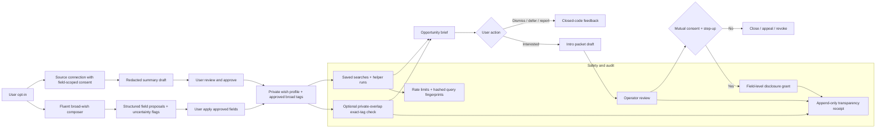

# Deep Research Audit of Moral Trade Background Networking Against Forethought

## Executive summary

Moral Trade’s current Background Networking feature is already unusually aligned with the *defense-favoured* part of Forethought’s design sketch. The live public documentation describes a conservative, consent-gated system based on broad previews, deterministic rule-based matching, manual source notes, no autonomous outreach, staged disclosure, narrow purpose-bound grants, anti-enumeration controls, row-level security, encrypted sensitive background fields, and aggregate-only transparency reporting. In other words, Moral Trade has built much of the *safety architecture* that Forethought says matters most for avoiding surveillance, harassment, and weaponized coordination. citeturn25search0turn39view0turn6view0turn16view0turn16view1turn37view0

Where Moral Trade is weaker is precisely where Forethought’s sketch is more ambitious: passive delegate-style source access, fluent wish injection, assistant-led uncertainty interviews, a more active “marketplace of helpers,” and privacy-preserving overlap computation. Moral Trade’s public docs explicitly say the present system is deterministic; raw connector ingestion is disabled; AI is shadow-only; and the privacy-preserving overlap lane is design-only, not production. Several bg14 lanes are also marked default-off, and the 2026 Q2 transparency report shows zero observed background-networking activity, while also noting some live aggregate sources are unavailable in the schema cache. That means the product is best understood as a careful pilot scaffold rather than a mature, continuously running background-networking system. citeturn38view0turn38view1turn37view0turn39view0

My bottom-line judgment is that Forethought **would** suggest improvements to Moral Trade’s current feature, but not by relaxing its safety posture. The right direction is to implement a **reviewed-summary connector lane**, a **fluent but schema-bound wish composer**, a **safer helper-run opportunity engine with explicit throttling and generic notifications**, and a **narrow private-overlap pilot with append-only transparency receipts**. Those changes would materially increase Forethought-style usefulness while preserving Moral Trade’s core commitments: no autonomous outreach, no raw private-feed mining in analytics, narrow disclosure by consent stage, and human control over reliance-bearing decisions. citeturn4view1turn4view2turn4view4turn25search0turn39view0turn38view2turn38view3

Confidence is **moderate to high** for the architecture, policy, API-surface, and governance findings because Moral Trade publishes unusually detailed public contracts, policy pages, and validator-backed technical evidence. Confidence is **lower** for the exact authenticated UX and runtime behavior because the signed-in dashboard itself was not directly inspectable in this research session; where a detail was not publicly specified, I mark it as unspecified rather than guessing. citeturn25search2turn28view0turn10view2

## Current technical audit of Moral Trade Background Networking

The currently documented UX flow is: browse or search broad previews in the public wish registry; create an account and log in; create a wish profile, saved searches, and optional manual source notes in the dashboard; receive staged match suggestions or opportunity briefs; request more detail, decline, or report; and, if interest persists, create a reviewed introduction request that goes to an operator queue before any contact details or exact wishes are disclosed. The system is explicit that a suggestion is not an introduction, and that opportunity briefs create reviewed intro-packet drafts rather than contacting counterparties. citeturn17view0turn26view0turn26view1turn38view3turn28view0

The data model published in the technical spec is relatively rich. Public evidence names entities for participant, public profile, private wish profile, profile visibility control, source connection, source note, background wish interview session and answer, privacy grant, match suggestion, background opportunity brief, background match feedback, background intro packet, match concierge request, and notification. The spec also states that relationship boundaries include profile privacy, source-note privacy, match disclosure, and review-state boundaries. citeturn12view0turn12view1turn13view0turn11view4

Privacy and security are where the current feature is strongest. Public docs state that exact wishes, contact details, sensitive constraints, raw notes, protected traits, and ideology or psychology inferences remain redacted before the right consent stage; private background tables are covered by row-level-security requirements; sensitive background text requires ciphertext and encryption-version columns; contact disclosure has MFA step-up; participant session review and revocation are implemented; and notifications omit exact wishes, contact details, and source notes. The feature also uses anti-enumeration budgets and hashed query fingerprints, and explicitly withholds sparse, overly specific registry searches until broadened. citeturn26view4turn38view1turn16view1turn13view3turn13view4turn13view0turn26view1

Opt-in and opt-out are also reasonably well documented. Users can disable discoverability of broad previews, review and revoke source permissions, set notification-channel choices, and remove the entire background layer without deleting the whole account through a self-serve flow requiring the confirmation phrase “DELETE BACKGROUND NETWORKING.” The deletion scope covers private wishes, previews, source summaries, saved searches, grants, suggestions, notifications, helper records, and introduction artifacts, while retaining only redacted or anonymized audit rows where needed for safety or review integrity. citeturn6view0turn38view2turn38view3

Resource-usage and scalability controls exist, but they look like pilot-grade controls rather than proof of production-scale readiness. Background-specific rate limits are published for saved-search writes, match-signal evaluation, opportunity-brief reads, opportunity-feedback writes, source-summary writes, intro-packet writes, and registry search. Performance targets are published for public-route reliability and Core Web Vitals, but the platform expressly says it does **not** yet claim verified Core Web Vitals pass status or measured production API latency readiness, and the security profile blocks sensitive-admin and paid-action-volume scale. Moral Trade also states it is “centralized first, portable later,” with export/import/schema endpoints intended to preserve future portability. citeturn12view2turn16view1turn39view0

Accessibility is partly specified and partly still debt. Moral Trade targets WCAG 2.1 AA–oriented QA, says keyboard and screen-reader review should cover the opportunity inbox, consent dialogs, source-summary review, notification settings, and deletion flow, but also says a full manual screen-reader pass has not yet been published for every authenticated workflow. That is a meaningful limitation for a feature whose trust model depends on users correctly understanding staged consent and disclosure. citeturn10view0turn10view1turn10view2turn10view3

One of the most important audit findings is that the public docs show much of the Forethought-like machinery is still gated or inactive. Background source-summary imports, wish interviews, and opportunity briefs are shown as default-off in the bg14 rollout section; live connector workers are blocked pending DPIA completion; AI summarization is shadow-only; privacy-preserving overlap is design-only; and the 2026 Q2 transparency report shows zero reviewed match suggestions, zero opportunity briefs, zero intro packets, and zero disclosure grants in the reporting period, while also flagging some live aggregate sources as unavailable in the schema cache. citeturn38view0turn38view1turn37view0

### Current-state table

| Audited element | Current Moral Trade state | Audit judgment |
|---|---|---|
| UX flow | Public wish registry exposes only broad previews; signed-in dashboard is described as the “working surface” for wish profiles, saved searches, manual source notes, exports, and review of suggestions; intro requests go to operator review before disclosure. citeturn17view0turn38view4turn38view3turn28view0 | Coherent staged flow, but authenticated screens were not directly inspected. |
| Matching logic | Current matching is deterministic and rule-based, using cause areas, trade modes, constraints, location sensitivity, and verification preferences; no hidden ML matching or ML state changes are claimed. citeturn39view0turn26view0turn2view0 | Strong auditability; weaker than Forethought on adaptive profiling. |
| Source inputs | Manual notes and approved summaries exist; raw ingestion is disabled; no live connector worker may run before DPIA completion. citeturn26view0turn38view0turn38view2 | Partial match to Forethought; major capability gap remains. |
| Disclosure model | Field-level, purpose-bound, stage-bound grants; registry/consent/introduced stages; exact wishes and contact details withheld until later stages. citeturn16view0turn26view1 | Strong exact match with defense-favoured posture. |
| Notifications | Background-networking notifications exist; preferences live in Moral Trade records; notification copy is generic and omits sensitive content. citeturn2view2turn13view0 | Sensible privacy posture; delivery-channel behavior beyond docs is unspecified. |
| Storage and security | RLS on private tables, ciphertext/version columns for sensitive text, Supabase auth cookies, server-only secrets, participant session revocation, MFA step-up for contact disclosure, abuse throttling. citeturn38view1turn16view1 | Strong documented controls for a pilot. |
| APIs | Private routes are published for wish interviews, source connection create/revoke, summary draft/approve, intro request create/appeal/approve-contact, opportunity brief list, opportunity feedback, and registry search. citeturn13view3turn15view0turn15view2turn15view3turn15view4 | Good contract publication; field schemas for all private routes were not publicly readable here. |
| Resource usage | Published rate limits, anti-enumeration budgets, hashed query fingerprints, sparse-result withholding, performance non-claims. citeturn12view2turn26view1turn16view1 | Good pilot controls; stronger client-visible backoff signals would help. |
| Scalability | Centralized first; export/import/schema portability exists; large-scale readiness is not claimed; sensitive-admin and paid-action scale are blocked. citeturn39view0turn16view1 | Honest but not yet ready for broad continuous background networking. |
| Accessibility | WCAG 2.1 AA–oriented QA target; authenticated background-networking flows explicitly listed for future manual keyboard/screen-reader QA; full pass not yet published. citeturn10view0turn10view1turn10view2turn10view3 | Material gap for a consent-heavy feature. |

### Missing or unspecified information

The public materials do **not** fully specify the exact authenticated screen designs, queue implementation, connector vendors, cryptographic algorithms used for the existing background-field encryption keyring, key-rotation evidence, actual bundle sizes, actual notification providers, runtime worker topology, or production latency measurements. Moral Trade also explicitly says it does not claim a completed key-rotation program, verified production latency targets, or a full manual screen-reader pass for every authenticated workflow. citeturn16view1turn10view2turn10view4

## Mapping Forethought’s design sketch to Moral Trade

Forethought’s sketch imagines a “matchmaking marketplace” of attentive helpers working in the background, fed either passively by connected sources or proactively by user-entered wishes, supported by secure wish profiling, an optionally assistant-led interview to reduce uncertainty, and a semi-private wish registry that surfaces only enough information to know whether further exploration is worthwhile. Forethought also treats privacy-versus-surveillance and collusion risk as the central design challenge, and suggests some kind of filtering system to decide who can see which parts of the data. citeturn4view1turn4view2turn4view3

Moral Trade is already much closer to this than a typical networking product, but its implementation is deliberately narrower. It has the semi-private registry, the broad-preview-first logic, purpose-bound grants, reviewed intro packets, cohort-first deployment, and portability hooks. What it largely lacks in live operation is Forethought’s more continuous and adaptive “delegate/helper” layer: passive source access is blocked or manual-only, the interview lane is deterministic rather than fluent/assistant-led, AI cannot influence live matches, and private-overlap computation is still only a design exploration. citeturn17view0turn25search0turn38view0turn38view1turn39view0

### Match matrix

| Forethought recommendation | Moral Trade evidence | Judgment |
|---|---|---|
| Semi-private searchable registry that reveals only enough to assess whether exploration is worthwhile | The wish registry searches broad preview fields only; exact asks, exact wishes, identities, and contact details remain behind consent and grants. citeturn17view0turn39view0turn16view0 | **Exact match** |
| Broad preview before detailed disclosure | Moral Trade repeatedly states “broad previews first,” “consent before detail,” and field-level staged disclosure. citeturn25search0turn16view0 | **Exact match** |
| Notifications or other first steps toward exploring a connection | Background scans can open notifications, saved-search results, match reports, intro plans, and network invite drafts; opportunity briefs lead to intro packet drafts. citeturn39view0turn26view0turn26view1 | **Partial match** because helper activity is still limited and some lanes are off. |
| Passive source access to social posts, search profiles, chatbot history, and similar sources | Moral Trade allows possible source connections and manual/import summaries, but raw ingestion is disabled and live connector workers are blocked pending DPIA. citeturn2view2turn38view0turn38view2 | **Partial match / major gap** |
| Fluent proactive wish injection through chat or similar interfaces | Moral Trade has a structured wish interview, but it is default-off, deterministic, and not an LLM interviewer. citeturn26view0turn39view0 | **Partial match / major gap** |
| Assistant-led questioning on major uncertainties | Forethought explicitly suggests chatbot-style assistance on biggest uncertainties; Moral Trade’s clarification is deterministic and missing-field driven. citeturn4view2turn39view0 | **Partial match** |
| Privacy-sensitive filtering system about who can see what | Moral Trade has stage-bound access levels, field-level grants, anti-enumeration budgets, sparse-result withholding, and operator review. citeturn16view0turn26view1turn38view3 | **Exact match in principle**, though advanced overlap/federation controls are incomplete. |
| Privacy-preserving overlap techniques for very sensitive matching | Moral Trade mentions blinded tags, VOPRF, HPKE sealed fields, PSI, or PIR-PSI, but says no production private-set intersection lane exists. citeturn38view0 | **Gap** |
| Specific-community pilots and work with existing matchmakers | Moral Trade’s donor circles, reading groups, and organization cohorts mirror this; Forethought also recommends niche/community-first deployment. citeturn38view3turn4view4 | **Exact match** |
| Portability/decentralization or interoperable wish profiling | Moral Trade is centralized first, but includes export/import/schema endpoints for future portability. citeturn39view0 | **Partial match** |

## Prioritized improvements that Forethought would recommend

The public evidence supports four improvements that are clearly in Forethought’s design direction while remaining consistent with Moral Trade’s own defense-favoured safeguards. I am **not** recommending autonomous outreach, raw private-feed mining into analytics, or end-to-end ML ranking, because both Moral Trade and Forethought flag those areas as especially risky. citeturn4view1turn4view2turn39view0turn38view3

### Priority table

| Improvement | Why Forethought would recommend it | Effort | Acceptance criteria |
|---|---|---:|---|
| Reviewed passive-source connectors | Forethought explicitly imagines passive delegate access to sources like social posts, search profiles, and chatbot history; Moral Trade currently has only manual/import-first summaries and blocked live connector workers. citeturn4view1turn4view2turn38view0turn38view2 | Medium | Users can connect a source with explicit field-scoped consent, retention window, and revocation; raw source content is never written to analytics; only reviewed redacted summaries can influence matching; revocation and expiry stop future use. citeturn2view2turn38view2turn29search3 |
| Fluent wish composer with uncertainty interview | Forethought recommends deliberate wishes through fluent interfaces and optional assistance on uncertain points; Moral Trade currently uses deterministic missing-field questions only. citeturn4view1turn4view2turn39view0 | Medium | Users can type or chat broad wishes; the system proposes structured fields plus uncertainty flags; no proposal changes live matching until the user explicitly applies it; all assistant output is explainable and schema-bound. citeturn39view0turn16view2 |
| Helper-run opportunity engine with safe notifications and backoff | Forethought’s “marketplace of helpers” is more active than Moral Trade’s present deterministic scan, but Moral Trade already has opportunity briefs, intro drafts, and notifications. The improvement is to make that helper layer more systematic without allowing autonomous contact. citeturn4view1turn25search0turn39view0 | Medium | Saved searches and helper runs create idempotent, generic, privacy-safe opportunity briefs; client-visible rate-limit and retry signals exist; notifications never include exact wishes or contact details; false-match rate and overload remain within pilot thresholds. citeturn13view0turn12view2turn35search0turn35search1turn34search1 |
| Narrow private-overlap pilot with transparency receipts | Forethought highlights privacy-versus-surveillance as the key challenge and gestures toward filtering systems; Moral Trade already names VOPRF, HPKE, and PSI as design options but has no production lane. A narrow overlap check for exact-match tags, plus append-only receipts, is the strongest missing safety/utility upgrade. citeturn4view2turn38view0turn29search1turn29search2turn33view0turn36search0turn36search3 | High | Only approved exact-match tags participate; no free text or raw source notes are used; overlap results are bucketed and stage-gated; every overlap check and disclosure action gets an append-only receipt visible to the participant; DPIA and crypto review complete before pilot exposure. citeturn29search3turn29search7turn36search0turn36search3 |

### Current versus recommended feature set

| Feature area | Current | Recommended next state |
|---|---|---|
| Source inputs | Manual notes and reviewed summaries; raw ingestion disabled; live connector workers blocked. citeturn26view0turn38view0turn38view2 | Opt-in connectors that generate reviewable redacted summaries only, with strong revocation, retention, and audit controls. citeturn4view1turn29search3 |
| Wish capture | Deterministic structured interview; no fluent assistant lane. citeturn26view0turn39view0 | Chat/fluent broad-wish composer that proposes schema-bound fields and uncertainty flags, but stays non-authoritative until user apply. citeturn4view1turn4view2turn39view0 |
| Matching helpers | Deterministic scans and opportunity briefs; helper-like follow-through exists in concept but some lanes are off. citeturn26view1turn38view0turn39view0 | Scheduled helper runs over saved searches and approved summaries, generic notifications, queue backoff, and partner-specific pilot cohorts. citeturn4view1turn4view4turn34search1turn35search1 |
| Sensitive overlap | Design-only VOPRF/HPKE/PSI exploration; no production lane. citeturn38view0 | Exact-tag overlap checks only, with cryptographic review, result bucketing, and append-only disclosure receipts. citeturn29search1turn29search2turn33view0turn36search0turn36search3 |
| Transparency | Aggregate transparency report and local transparency receipts are mentioned; usage is currently zero and some underlying aggregate sources are unavailable. citeturn37view0turn6view0 | Per-action append-only receipts for overlap and disclosure events, with participant-visible audit history and signed checkpoints. citeturn36search0turn36search3 |

### Proposed background-networking data flow

The following flow reflects the improvements above while preserving Moral Trade’s current “broad preview first, consent before detail, no autonomous outreach” architecture. citeturn25search0turn38view2turn38view3turn4view1turn4view2



## Codex GPT-5.5-xHigh implementation instructions

These implementation packets assume, as a **best-fit inference**, a Next.js + TypeScript + Supabase/Postgres stack, because the public technical spec references `src/app/...` routes, `node --import tsx --test src/lib/...`, and “Supabase auth cookies.” If the private repository differs, preserve the behavioral contract and acceptance tests even if filenames and framework conventions change. citeturn25search2turn16view1turn5search1

### Reviewed passive-source connectors

Implement only the **reviewed-summary** form of passive connectors. Do **not** implement background scraping, continuous raw-feed search, or raw-content analytics ingestion. That is consistent with Moral Trade’s current source boundary and with Forethought’s privacy concerns. citeturn38view2turn4view2turn29search3

#### Database changes

```sql
create table if not exists background_source_connections (
  id uuid primary key default gen_random_uuid(),
  participant_id uuid not null references auth.users(id),
  source_kind text not null check (source_kind in ('blog','social','search','chatbot','email_export','calendar_export')),
  status text not null default 'active' check (status in ('active','revoked','expired')),
  consent_version text not null,
  consent_notes_ciphertext bytea not null,
  consent_notes_key_version int not null,
  allowed_field_keys jsonb not null default '[]'::jsonb,
  retention_days int not null check (retention_days in (30,90,180,365)),
  ai_shadow_allowed boolean not null default false,
  raw_ingestion_allowed boolean not null default false,
  summary_required boolean not null default true,
  expires_at timestamptz not null,
  revoked_at timestamptz,
  created_at timestamptz not null default now(),
  updated_at timestamptz not null default now()
);

create table if not exists background_source_summary_drafts (
  id uuid primary key default gen_random_uuid(),
  connection_id uuid not null references background_source_connections(id) on delete cascade,
  participant_id uuid not null references auth.users(id),
  source_snapshot_hash bytea not null,
  summary_text_ciphertext bytea not null,
  summary_text_key_version int not null,
  derived_broad_tags jsonb not null default '[]'::jsonb,
  uncertainty_flags jsonb not null default '[]'::jsonb,
  status text not null default 'pending_review' check (status in ('pending_review','approved','rejected','expired')),
  created_at timestamptz not null default now(),
  approved_at timestamptz
);

create table if not exists background_source_sync_jobs (
  id uuid primary key default gen_random_uuid(),
  connection_id uuid not null references background_source_connections(id) on delete cascade,
  participant_id uuid not null references auth.users(id),
  state text not null default 'queued' check (state in ('queued','running','retry','done','failed','cancelled')),
  attempts int not null default 0,
  next_run_at timestamptz not null default now(),
  last_error_code text,
  created_at timestamptz not null default now(),
  updated_at timestamptz not null default now()
);
```

Enable RLS so the participant owns all three tables, and add a service-role-only policy for sync workers. Ensure `raw_ingestion_allowed` is hard-defaulted to `false` and that no summary draft table contains raw source text. That matches Moral Trade’s present storage contract and Safety/Privacy docs. citeturn38view1turn38view2

#### API contract

```yaml
POST /api/background/sources
  auth: required
  body:
    sourceKind: enum
    allowedFieldKeys: string[]
    retentionDays: 30|90|180|365
    aiShadowAllowed: boolean
    consentVersion: string
    consentNotes: string
  returns:
    id: uuid
    status: active
    expiresAt: iso_datetime

POST /api/background/sources/{id}/draft-summary
  auth: required
  semantics: enqueue reviewed-summary sync only
  returns:
    jobId: uuid
    state: queued

POST /api/background/source-summary-drafts/{id}/approve
  auth: required
  semantics: promotes approved summary fields into eligible matching inputs

POST /api/background/sources/{id}/revoke
  auth: required
  semantics: immediate future-use stop; pending jobs cancelled
```

On quota violations, return `429 Too Many Requests` and include `Retry-After`; for retriable job clients, use truncated exponential backoff with jitter. That is the safest way to expose budgets and avoid retries amplifying load. citeturn35search0turn35search1turn34search1turn34search4

#### Worker snippet

```ts
// src/lib/background/source-sync.ts
export function nextDelaySeconds(attempts: number): number {
  const capped = Math.min(3600, 15 * 2 ** attempts);
  return Math.floor(Math.random() * capped); // full jitter
}

export async function runReviewedSummarySync(jobId: string) {
  const job = await db.getSyncJob(jobId);
  const conn = await db.getSourceConnection(job.connection_id);

  if (!conn || conn.status !== "active") throw new Error("connection_inactive");
  if (conn.raw_ingestion_allowed) throw new Error("raw_ingestion_forbidden");
  if (new Date(conn.expires_at) <= new Date()) throw new Error("connection_expired");

  const sourceSnapshot = await connector.fetchScopedExport(conn); // export/file-based only
  const redacted = await summarizeToApprovedSchema(sourceSnapshot, conn.allowed_field_keys);

  await db.insertSummaryDraft({
    connectionId: conn.id,
    participantId: conn.participant_id,
    sourceSnapshotHash: sha256(sourceSnapshot.metadataOnlyHash),
    summaryCiphertext: encrypt(redacted.summary),
    summaryTextKeyVersion: currentKeyVersion(),
    derivedBroadTags: redacted.tags,
    uncertaintyFlags: redacted.uncertaintyFlags,
    status: "pending_review",
  });

  await db.completeSyncJob(jobId);
}
```

#### Tests

Run route-contract, privacy, and resilience tests plus the background-source-summary pathways specifically. The public docs already indicate a test culture around route contracts and background modules, so preserve that pattern. citeturn25search2turn11view0

```ts
test("revocation cancels future sync and matching influence", async () => {});
test("draft summary contains no raw source payload", async () => {});
test("expired retention removes summary from synthesis", async () => {});
test("429 responses include Retry-After header", async () => {});
test("approved summary only affects allowed broad fields", async () => {});
```

#### Deployment and privacy checks

Ship this behind a feature flag and a staff-first cohort, exactly as Moral Trade’s bg14 rollout text already suggests. Require a DPIA, source-specific deletion test, and visible source-permission UI before exposure outside the pilot. citeturn38view0turn29search3turn29search7

### Fluent wish composer with uncertainty interview

The goal is not to let an LLM “decide what the user wants.” The goal is to let users express wishes more naturally, while still forcing the model to output **schema-bound field proposals** plus uncertainty flags that the user must explicitly apply. That preserves Forethought’s fluent-interface vision without violating Moral Trade’s ban on hidden ML matching. citeturn4view1turn4view2turn39view0

#### Database changes

```sql
create table if not exists background_wish_dialogue_sessions (
  id uuid primary key default gen_random_uuid(),
  participant_id uuid not null references auth.users(id),
  state text not null default 'draft' check (state in ('draft','proposed','applied','abandoned')),
  created_at timestamptz not null default now(),
  updated_at timestamptz not null default now()
);

create table if not exists background_wish_dialogue_messages (
  id uuid primary key default gen_random_uuid(),
  session_id uuid not null references background_wish_dialogue_sessions(id) on delete cascade,
  actor text not null check (actor in ('user','assistant')),
  body_ciphertext bytea not null,
  body_key_version int not null,
  created_at timestamptz not null default now()
);

create table if not exists background_wish_field_proposals (
  id uuid primary key default gen_random_uuid(),
  session_id uuid not null references background_wish_dialogue_sessions(id) on delete cascade,
  participant_id uuid not null references auth.users(id),
  proposal jsonb not null,
  uncertainty_flags jsonb not null default '[]'::jsonb,
  explanation jsonb not null default '[]'::jsonb,
  approved boolean not null default false,
  created_at timestamptz not null default now()
);
```

#### API contract

```yaml
POST /api/background/wish-dialogue/start
POST /api/background/wish-dialogue/{id}/message
POST /api/background/wish-dialogue/{id}/proposal
POST /api/background/wish-dialogue/{id}/apply
```

The `proposal` response should contain only approved schema outputs such as `causeAreas`, `tradeModes`, `verificationPreferences`, `coarseLocation`, `availabilityHints`, `broadCapabilities`, `broadConstraints`, and `unansweredFields`. It must not invent exact asks or infer protected traits. citeturn2view0turn39view0

#### TypeScript schema-bound extraction

```ts
import { z } from "zod";

export const WishProposalSchema = z.object({
  causeAreas: z.array(z.string()).max(12).default([]),
  tradeModes: z.array(z.enum(["pledge", "payment", "offset", "public_good"])).default([]),
  verificationPreferences: z.array(z.string()).max(8).default([]),
  coarseLocation: z.string().max(64).optional(),
  broadCapabilities: z.array(z.string()).max(20).default([]),
  broadConstraints: z.array(z.string()).max(20).default([]),
  availabilityHints: z.array(z.string()).max(10).default([]),
  unansweredFields: z.array(z.string()).max(12).default([]),
  uncertaintyFlags: z.array(z.string()).max(12).default([]),
  participantExplanation: z.array(z.string()).max(12).default([]),
});

export async function proposeWishFields(messages: Array<{ role: "user"|"assistant"; text: string }>) {
  const raw = await model.generateObject({
    schema: WishProposalSchema,
    system: `
      Convert the user's broad wishes into approved matching fields.
      Do not infer protected traits, ideology, psychology, exact private wishes,
      contact details, or hidden preferences.
      Prefer "unansweredFields" and "uncertaintyFlags" over guessing.
    `,
    messages,
  });

  return WishProposalSchema.parse(raw.object);
}
```

Add a mandatory **review screen** with “Apply proposed fields” and “Keep draft only.” No live recompute may run until the user applies the proposal. That matches Moral Trade’s current review-before-apply posture. citeturn26view0turn39view0

#### Tests

```ts
test("assistant proposal never includes forbidden inferred fields", async () => {});
test("unansweredFields used instead of hallucinated specifics", async () => {});
test("apply endpoint is required before profile signal recompute", async () => {});
test("screen-reader labels exist for uncertainty explanations and apply/reject actions", async () => {});
```

#### Deployment and privacy checks

Start in **shadow mode**: generate proposals, but show them only as optional drafts. Promote to assist mode only if privacy incidents stay at zero, human overrule reasons are reviewed, and UX/helpfulness metrics improve in the public evaluation contract. That is exactly how Moral Trade already describes shadow, assist, and guarded-automation promotion. citeturn16view2turn38view1

### Helper-run opportunity engine with safe notifications and backoff

This improvement operationalizes Forethought’s “helpers in the background” idea without permitting autonomous outreach. The helper should search approved broad data, prepare opportunity briefs, and trigger generic notifications or dashboard updates. Exact wishes and counterparties stay hidden until the existing consent and operator-review gates. citeturn4view1turn26view1turn38view3

#### Database changes

If `background_opportunity_briefs`, `background_match_feedback`, and helper-run tables already exist privately, extend them rather than replacing them. The public data contract already names those entities. citeturn12view1turn38view1

```sql
alter table background_opportunity_briefs
  add column if not exists helper_run_id uuid,
  add column if not exists cooloff_until timestamptz,
  add column if not exists explanation_version text default 'v1',
  add column if not exists source_scope_version text default 'v1';

create table if not exists background_helper_runs (
  id uuid primary key default gen_random_uuid(),
  participant_id uuid not null references auth.users(id),
  trigger_kind text not null check (trigger_kind in ('saved_search','new_summary','manual_scan','scheduled_digest')),
  state text not null default 'queued' check (state in ('queued','running','retry','done','failed','cancelled')),
  attempts int not null default 0,
  next_run_at timestamptz not null default now(),
  query_fingerprint text not null,
  created_at timestamptz not null default now(),
  updated_at timestamptz not null default now()
);
```

#### API contract

```yaml
POST /api/background/helper-runs
  auth: required
  body:
    triggerKind: saved_search|new_summary|manual_scan|scheduled_digest
  returns:
    runId: uuid
    state: queued

GET /api/background/opportunity-briefs
  auth: required

POST /api/background/opportunity-feedback
  auth: required
  body:
    briefId: uuid
    decision: interested|dismissed|maybe_later|report
    reasonCode: optional enum
```

For 429 handling, include `Retry-After`, and optionally expose current quota policy headers once the implementation is stable. RFC 6585 and RFC 9110 support the 429/`Retry-After` behavior, and Google Cloud’s retry guidance supports truncated exponential backoff with jitter for retriable requests. citeturn35search0turn35search1turn34search1

#### Notification-copy rule

```ts
export function buildBackgroundNotification(): { title: string; body: string } {
  return {
    title: "New broad-overlap opportunity",
    body: "A privacy-safe opportunity brief is ready for your review. Exact wishes and contact details remain hidden until the appropriate consent stage.",
  };
}
```

Never include exact wishes, contact details, source notes, or negotiation text in email or push copy. That matches current published notification constraints. citeturn2view2turn13view0

#### Worker logic

```ts
export async function runHelperJob(runId: string) {
  const run = await db.getHelperRun(runId);
  const savedSearch = await db.getEligibleSearch(run.participant_id, run.query_fingerprint);

  const candidates = await registry.searchBroadPreviewOnly(savedSearch.filters);
  const ranked = explainableBroadCompatibility(candidates); // deterministic + approved factors only

  for (const candidate of ranked.slice(0, 5)) {
    await db.upsertOpportunityBrief({
      participantId: run.participant_id,
      helperRunId: run.id,
      candidateId: candidate.id,
      headline: candidate.headline,
      factorCodes: candidate.factorCodes,
      hiddenFieldNotices: candidate.hiddenFieldNotices,
      confidenceBand: candidate.confidenceBand,
    });
  }

  await notifyParticipant(run.participant_id, buildBackgroundNotification());
  await db.completeHelperRun(run.id);
}
```

#### Tests

```ts
test("notifications never contain exact wishes or contact data", async () => {});
test("helper runs are idempotent for the same query fingerprint and search window", async () => {});
test("manual scan quotas return 429 with Retry-After", async () => {});
test("sparse or over-specific searches are withheld", async () => {});
test("false match / overrule metrics are emitted in aggregate only", async () => {});
```

#### Deployment and privacy checks

Keep launch sequence: internal staff → tiny consenting cohort → one reviewed pilot pack. Promote only if privacy leakage incidents remain zero, false-match rate does not worsen materially, concierge SLA remains explainable, and accessibility checks pass for inbox, feedback, and consent actions. Moral Trade already exposes the relevant evaluation and rollout gating concepts, so use them as hard promotion gates. citeturn38view0turn16view2turn10view1

### Narrow private-overlap pilot with transparency receipts

This is the most important long-run Forethought-aligned improvement, and also the most dangerous to do sloppily. The implementation should be **narrow**: exact-match tags only, no free text, no latent semantic matching, no hidden ranking, and no autonomous disclosure. Use the overlap pilot to answer a simple question like “Do we share an approved exact tag in this stage?” rather than “How similar are our deep private desires?” citeturn38view0turn4view2

#### Database changes

```sql
create table if not exists background_private_overlap_tags (
  id uuid primary key default gen_random_uuid(),
  participant_id uuid not null references auth.users(id),
  tag_namespace text not null,
  blinded_token bytea not null,
  expiry_at timestamptz not null,
  created_at timestamptz not null default now()
);

create table if not exists background_private_overlap_checks (
  id uuid primary key default gen_random_uuid(),
  requester_id uuid not null references auth.users(id),
  counterparty_id uuid not null references auth.users(id),
  stage text not null check (stage in ('registry','consent','introduced')),
  tag_namespace text not null,
  result_bucket text not null check (result_bucket in ('none','1','2_to_3','4_plus')),
  receipt_id uuid,
  created_at timestamptz not null default now()
);

create table if not exists transparency_receipts (
  id uuid primary key default gen_random_uuid(),
  seq bigint generated always as identity unique,
  event_type text not null,
  actor_scope text not null,
  redacted_payload jsonb not null,
  prev_hash bytea,
  entry_hash bytea not null,
  created_at timestamptz not null default now()
);
```

#### Cryptographic boundary

Use standard, reviewed primitives rather than inventing custom privacy crypto. HPKE is the modern standard for hybrid public-key encryption, and VOPRFs provide a standard way for a client to obtain PRF outputs without revealing the input to the server. PSI has a large deployment- and efficiency-oriented literature, but start with the smallest viable construction and an external crypto review before production exposure. citeturn29search1turn29search2turn33view0turn33view1

#### Interface-first abstraction

```ts
interface PrivateOverlapProvider {
  blind(inputs: string[]): Promise<Uint8Array[]>;
  evaluate(blinded: Uint8Array[]): Promise<Uint8Array[]>;
  finalize(inputs: string[], evaluated: Uint8Array[]): Promise<string[]>;
}

interface ReceiptLogger {
  append(eventType: string, actorScope: string, redactedPayload: Record<string, unknown>): Promise<{ id: string; seq: number }>;
}
```

#### Hash-chained receipt logger

```ts
export async function appendReceipt(
  eventType: string,
  actorScope: string,
  redactedPayload: Record<string, unknown>,
) {
  const prev = await db.getLatestReceipt();
  const prevHash = prev?.entry_hash ?? null;
  const eventHash = sha256(JSON.stringify({ eventType, actorScope, redactedPayload }));
  const entryHash = sha256(Buffer.concat([Buffer.from(prevHash ?? ""), Buffer.from(eventHash)]));

  return db.insertReceipt({
    eventType,
    actorScope,
    redactedPayload,
    prevHash,
    entryHash,
  });
}
```

This is not a full public certificate-transparency ecosystem, but it does give a tamper-evident append-only history that can later be witnessed or externalized. Certificate Transparency and transparency.dev are the relevant design precedents: append-only logs do not prevent all misbehavior, but they make it more detectable and auditable. citeturn36search0turn36search3turn36search5

#### Overlap check contract

```yaml
POST /api/background/private-overlap/check
  auth: required
  preconditions:
    - both parties have approved the relevant overlap mode
    - namespace is allowlisted
    - no free text inputs
    - stage is permitted
  body:
    counterpartyId: uuid
    namespace: exact_capability_tag | exact_constraint_tag | exact_verification_tag
  returns:
    resultBucket: none | 1 | 2_to_3 | 4_plus
    receiptId: uuid
```

#### Tests

```ts
test("free text input to overlap endpoint is rejected", async () => {});
test("overlap stores blinded/sealed values only", async () => {});
test("result exposes only bucketed count, never raw tag list", async () => {});
test("every overlap check produces an append-only receipt", async () => {});
test("receipt chain verification fails on tampering", async () => {});
```

#### Deployment and privacy checks

Require all of the following before the first external pilot: DPIA, documented lawful basis, red-team abuse review, external cryptographic design review, exact-tag taxonomy review, and a participant-visible explanation page. That is stricter than ordinary feature launch, but the public docs and Forethought both justify that strictness. citeturn38view0turn29search3turn29search7

## Risk assessment and QA checklist

The main risk is **privacy leakage**: a richer connector and helper system can very easily drift from “help me summarize this source into broad fields” into “secretly mine my private life.” Forethought flags surveillance, harassment, and exploitation as the central danger of comprehensive background networking, while Moral Trade already treats raw-feed mining and autonomous outreach as prohibited. The correct QA stance is therefore adversarial: test for prohibited persistence, prohibited disclosures, sparse-result leakage, email copy leaks, and analytics contamination on every release. citeturn4view2turn38view3turn9view0turn39view0

A second risk is **collusion or weaponized coordination**. Forethought cautions that fully private background networking can make harmful collusion harder to detect; Moral Trade’s existing answer is aggregate transparency, human review, explicit anti-threat rules, and narrow staged disclosure. The proposed append-only receipts and narrow exact-tag overlap are intended to strengthen that middle path rather than hide more interaction from oversight. citeturn4view2turn7search2turn37view0turn36search0turn36search3

A third risk is **false matches and user pressure**. Because the system is about moral disagreement, a false or over-eager match can create pressure, embarrassment, or manipulation even if no raw data leaks. That makes human overrule rate, false-match rate, report reasons, and appeal overturns pivotal metrics. Moral Trade already publishes an evaluation framework with false-match, overrule, privacy leakage, and subgroup surfacing parity concepts, so new helper functionality should be rollout-gated against those exact metrics. citeturn16view2turn9view0

A fourth risk is **accessibility failure in consent-heavy UX**. If keyboard-only and screen-reader users cannot understand or control source permissions, staged grants, or deletion, the privacy model is not actually trustworthy. W3C’s WCAG remains the baseline accessibility standard, and Moral Trade’s own accessibility statement explicitly lists the opportunity inbox, consent dialogs, source-summary review, notification settings, and background deletion flow as priority QA targets. citeturn30search0turn30search3turn10view1turn10view2

A fifth risk is **queue overload and retry storms**. Background helpers and connector jobs are exactly the kind of asynchronous workload that can create thundering-herd failures if retries synchronize. Google Cloud’s retry guidance recommends truncated exponential backoff with jitter for retriable requests, and HTTP standards support 429 plus `Retry-After` for signaling clients to slow down. Use both. citeturn34search1turn34search4turn35search0turn35search1

### QA checklist

Before enabling any Forethought-style improvement beyond internal testing, verify all of the following. The checklist is deliberately strict because the product domain is unusually sensitive. citeturn38view0turn16view2

- DPIA signed off for any new connector, overlap, or assistant mode; lawful basis documented; retention and deletion paths tested end-to-end. citeturn29search3turn29search7
- No raw source payloads, exact wishes, contact details, or free-text reports appear in analytics, notifications, logs, or aggregate reports. citeturn2view2turn9view0turn37view0
- Connector revocation stops future sync immediately and removes future matching influence after expiry windows. citeturn38view2
- All background routes enforce RLS, participant scope, and ciphertext/version columns for sensitive fields. citeturn38view1
- Contact disclosure requires the documented step-up gate. citeturn13view3turn13view4
- 429 responses include `Retry-After`; client workers use capped exponential backoff with jitter. citeturn35search0turn35search1turn34search1
- Opportunity inbox, consent dialogs, source-summary review, notification settings, and background deletion flow pass manual keyboard and screen-reader QA. citeturn10view1turn10view2turn10view3
- False-match rate, privacy leakage incidents, human overrule rate, and subgroup surfacing parity are measured and reviewed before promotion. citeturn16view2turn9view0
- Every overlap or disclosure action produces a participant-visible append-only receipt. citeturn36search0turn36search3
- Operator queue SLA and appeal handling remain within the public thresholds or are publicly explained if missed. citeturn37view0turn16view2

## Rollout plan and timeline

The safest rollout is a staged plan that mirrors both Forethought’s recommendation to start in niches and Moral Trade’s own bg14 rollout language. Forethought suggests specific communities and incumbent matchmakers as starting points; Moral Trade already names donor circles, reading groups, and organization cohorts, and its rollout text says staff first, then a tiny consenting cohort, then a pilot pack. citeturn4view4turn38view0turn38view3

In the first phase, complete governance groundwork rather than feature exposure: DPIA, data flow maps, retention schedules, UI copy review, threat modeling, and accessibility test plans for the relevant signed-in flows. Also finalize baseline metrics: false-match, human overrule, privacy incidents, queue latency, brief open rate, and subgroup surfacing parity. This phase should end with all new routes feature-flagged but off. citeturn29search3turn29search7turn16view2turn10view1

In the second phase, deploy the reviewed-source connector lane and the fluent wish composer in **shadow mode** to staff and internal test accounts only. The decisive questions are whether summaries remain privacy-safe, users can understand and revoke permissions, and assistant-generated proposals reduce missing-field friction without worsening false matches or triggering privacy incidents. Do not expose live helper automation outside internal scope yet. citeturn38view0turn38view1turn39view0

In the third phase, enable the helper-run opportunity engine for one narrow pilot pack — ideally a partner-reviewed donor circle or reading-group cohort. Keep opportunity generation generic, idempotent, and rate-limited. Measure queue behavior, report reasons, dismissal patterns, and operator burden weekly. Promotion should halt immediately if privacy leakage, accessibility failures, or unexplained overrule spikes appear. citeturn38view3turn37view0turn16view2

In the fourth phase, if and only if the first three phases remain clean, launch a **private-overlap beta** for an allowlisted exact-tag namespace only. Require external crypto review before public pilot entry. Publish participant-visible receipts from day one, and keep the result surface bucketed, not raw. If the pilot works, the next step is not “turn on more AI”; it is to selectively widen namespaces and partner cohorts while maintaining the same trust architecture. citeturn38view0turn29search1turn29search2turn36search0turn36search3

### Suggested timeline

| Window | Deliverable | Go / no-go gate |
|---|---|---|
| Weeks 1–2 | DPIA, threat model, consent-copy rewrite, schema migrations, QA plan | Governance artifacts complete; no unresolved blocker on raw-ingestion boundaries. citeturn29search3turn38view2 |
| Weeks 3–4 | Reviewed-source connectors in internal shadow mode | No raw-content persistence; revocation and expiry verified; accessibility smoke passes. citeturn38view0turn10view1 |
| Weeks 5–6 | Fluent wish composer in internal shadow mode | Missing-field completion improves without privacy incidents or unexplained overrule increase. citeturn16view2turn39view0 |
| Weeks 7–8 | Helper-run opportunity engine in one pilot pack | 429/Retry-After/backoff correct; queue stable; generic notifications leak nothing; operator SLA acceptable. citeturn35search0turn35search1turn34search1turn13view0 |
| Weeks 9–10 | Exact-tag private-overlap beta with append-only receipts | External crypto review complete; receipts verify; no free-text or raw-tag leakage. citeturn29search1turn29search2turn36search0turn36search3 |
| Weeks 11–12 | Public trust update and aggregate metrics refresh | Public aggregate report updated; promotion or rollback explained. citeturn37view0 |

## Open questions and limitations

This report is grounded in publicly accessible Moral Trade pages, public contract pages, the public wish registry, the public measurement/transparency/accessibility pages, and the public login surface. I did **not** directly operate the signed-in dashboard, so detailed authenticated UX observations are documentary rather than hands-on. Where detail was unavailable, I marked it unspecified. citeturn28view0turn17view0turn9view0turn10view2

Two public inconsistencies are also worth tracking. First, several background lanes are documented as default-off, which may explain why the transparency report shows zero usage. Second, the transparency report itself says some live aggregate sources are unavailable in the schema cache. Before a broader rollout, those public-trust inconsistencies should be cleaned up so the contract pages, feature flags, and aggregates tell one coherent story. citeturn38view0turn37view0

The most important unresolved product question is strategic rather than technical: whether Moral Trade wants to remain a deliberately conservative matchmaking substrate, or whether it wants to move closer to Forethought’s fuller “marketplace of helpers” model. The recommendations above assume the answer is **yes, but only through reviewed summaries, narrow pilots, and human-controlled disclosure** — which is the highest-confidence route consistent with both Forethought’s caution and Moral Trade’s existing public commitments. citeturn4view1turn4view2turn25search0turn39view0