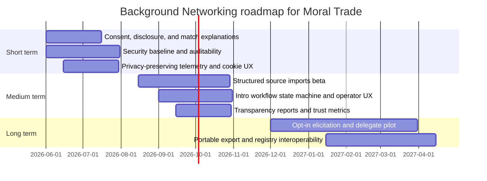
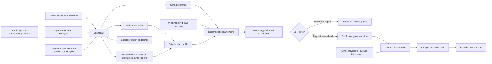

# Building and Improving Background Networking on Moral Trade

## Executive summary

Moral Trade’s current Background Networking implementation is a deliberately narrow, safety-first pilot rather than a full Forethought-style background network. Publicly discoverable materials show a centralized system built around private wish profiles, broad public previews, deterministic rule-based matching, staged disclosure, field-level privacy grants, manual source notes, and an operator-reviewed introduction queue. The site explicitly rejects autonomous outreach, mass profile ingestion, and private-feed mining, and frames itself as a “privacy-first, non-AI” prototype for private counterparty discovery rather than an always-on AI delegate marketplace. That makes the current implementation unusually aligned with Forethought’s warning that background networking can easily become surveillance, harassment, or exploitation if built incautiously. citeturn20view1turn16search2turn12view0turn14view0turn16search1

The main strategic conclusion is that Moral Trade already has the right *defense-favoured shape* for an early deployment, but it does not yet implement several parts of Forethought’s full design sketch: interoperable wish profiling across multiple data sources, richer preference elicitation, stronger explanation and provenance for why a match exists, more legible follow-through artifacts after a promising match, and well-specified technical controls for role-based access, auditability, anti-abuse automation, and privacy-compliant telemetry. Several important technical details are not publicly discoverable, including the exact database schema, row-level authorization design, encryption choices for sensitive fields, cookie-consent UX, breach-response process, email provider, and cross-device conflict semantics. Those should be treated as unspecified rather than assumed. citeturn10view0turn10view1turn16search2turn20view1turn12view0turn42view0

The best roadmap is therefore not “turn on full passive AI networking.” It is: first, harden the existing model with better consent, explanation, audit, and operator controls; second, add structured but bounded source imports and richer match workflows; third, only then pilot high-friction, opt-in delegate features for users who explicitly want them, backed by a DPIA, stronger review, and explicit rollback paths. In other words, Moral Trade should move toward Forethought’s architecture in layers, while preserving the current product’s strongest norm: *no surprise exposure*. citeturn20view1turn12view0turn10view0turn33search5turn33search14

## Forethought guidance and Moral Trade’s current posture

Forethought’s design sketch for Background Networking imagines “attentive, personalised helpers” that work in the background, discover promising connections, notify principals, and sometimes trigger additional tools that take first steps toward exploring a match. The sketch includes two major inputs: a passive mode where a delegate can distill data from social media, search profiles, chatbot history, and similar sources into an up-to-date representation of a person’s hopes, intent, and capabilities; and a proactive mode where the person supplies deliberate wishes through chat or other fluent interfaces. Under the hood, Forethought describes interoperable secure wish-profiling systems, LLM-assisted synthesis, optional interview-style clarification, and a searchable semi-private wish registry that reveals only enough to decide whether a possible counterparty is worth exploring further. citeturn10view0turn9view0

Forethought is also unusually explicit that privacy is the central hard problem. It argues that broad access to sensitive “what people really want” data can enable surveillance, harassment, or exploitation, while making everything completely private can also create collusion risks. Its tentative answer is not full openness or full secrecy, but some kind of filtering system that limits who can see which data, plus early work that foregrounds privacy and surveillance mitigations before default market incentives produce a more extractive version of the same technology. citeturn10view0turn10view1

Moral Trade’s published posture is much narrower and more conservative. The site says Background Networking is a “conservative matching layer” that compares broad public previews, saved preferences, and manual source notes so that a participant can decide whether an introduction is worth exploring. It says the current prototype does **not** ingest private feeds, scrape profiles at scale, mine email or chat histories, perform autonomous outreach, or use AI inference for matching; instead, match suggestions are deterministic and scored from declared cause areas, trade modes, constraints, location sensitivity, and verification preferences. Exact wishes, contact data, and sensitive constraints are disclosed only after staged, mutual consent, and introduction requests go through an operator queue before contact details move. citeturn20view1turn16search2turn14view0

That means Moral Trade is already implementing one of the most important *normative* translations of Forethought’s sketch: it has taken the “semi-private registry + filtering + caution about surveillance” part seriously, while intentionally deferring the “delegate reads everything and synthesizes it” part. From a defense-favoured perspective, that is a strength, not a weakness. The main question is how to deepen the feature without losing that posture. citeturn10view0turn12view0turn20view1

## Current public assessment of Moral Trade’s Background Networking

The table below summarizes what is publicly discoverable about the current implementation and what remains unspecified.

| Aspect | Publicly discoverable | Publicly unspecified |
|---|---|---|
| Architecture | Centralized pilot; signed-in dashboard stores private wish profiles, manual source notes, saved searches, and broad registry previews; matching is deterministic and rule-based; introduction requests enter an operator queue; the data model reportedly includes export, import, and schema endpoints. Sources name Supabase for auth and database, Stripe for payment objects when enabled, Every.org for donation routes, and an unspecified email provider for queued notifications. citeturn20view1turn16search2turn12view0 | Frontend framework, API design, queue implementation, schema details, encryption design for wish data, and exact storage topology are not publicly specified. |
| UX flow | Users can create an account with display name, email, password, and optional location; location is hidden publicly by default. The onboarding flow persists role, cause areas, attribution, and first action to the account. The wish registry exposes only broad previews; participants can request more detail, decline, or report a suggestion; exact asks and contact details require explicit grants from both sides. Public profiles appear only after publishing offers or explicit opt-in. citeturn5view1turn5view0turn2search2turn20view0turn21view0 | Full signed-in dashboard flow, error states, mobile flow, empty-state behavior, and revocation UX for previously granted disclosures are not publicly documented. |
| Data collected | Public docs mention profile names, broad cause areas, public offers, comments, recommendations, ratings, follower counts, private wish profiles, source connections, manual summaries, saved searches, consent scope, import mode, payment status, Stripe object identifiers, amount/currency/cadence/agreement references, attribution metadata, and notification records. citeturn12view0turn16search2turn20view0 | Exact schemas, which fields are required vs optional, retention clocks per table, and whether free-text wishes are separately tokenized or indexed are not public. |
| Consent and disclosure | Moral Trade uses broad previews first, staged disclosure, field-level grants, mutual consent for specifics, and privacy levels that can remain hidden, broad, specific, or contact-level for an introduction workflow. The site also says “nothing is public by default” at signup. citeturn20view1turn12view0turn19view2 | The precise UI for grant review, revocation timing, expiring grants, and onward disclosure controls is not publicly visible. |
| Security and abuse posture | The site publishes anti-threat rules, blocked proposal classes, review queues, baseline checks, challenge lanes, operator review, and a trust model based on visible status states rather than blanket trust. Background networking is explicitly bounded: no surprise exposure, no autonomous outreach, no private-feed mining. citeturn14view0turn15view0turn18view0turn19view0turn42view0 | Public docs do not specify MFA, rate limiting, CAPTCHA, RLS policy design, audit logging, secret management, webhook verification, intrusion detection, or incident response. |
| Performance and scale | Matching is rule-based rather than model-based, which lowers inference cost. The people directory is paged “so it remains usable at much larger scale,” and registry search is limited to broad previews ranked by overlap and openness fields. citeturn20view0turn2search2turn16search2 | No public latency targets, index strategy, concurrency model, queue SLAs beyond intro-request mention, or search-performance budgets are specified. |
| Cross-device behavior | Some workflows are explicitly persisted to the account so they can continue across sessions, such as onboarding and contribution/account records. Export/import endpoints are also mentioned for portability. citeturn5view0turn11search1turn12view0turn16search2 | Public docs do not state how cross-device sync works for draft wishes, saved searches, consent grants, or concurrent edits. |

The most important interpretation is that Moral Trade’s current feature is **not** an under-specified black box. It has a public conceptual model: explicit wishes or manual notes feed a deterministic scan; the scan produces suggestions; suggestions can be explored through a consent gate; and any serious introduction is routed through operator review with safety, privacy, and baseline checks. That is a coherent early architecture. citeturn20view1turn16search2turn18view0

At the same time, the public docs also reveal a mismatch between the richness of the *conceptual* model and the precision of the *technical* model. For example, Moral Trade publicly mentions notifications, match reports, network invite drafts, brokerage bounties, and introduction plans as products of “background scans,” yet the public interface does not expose a legible state machine for those artifacts, nor public schemas for how they relate to match suggestions, disclosure grants, introductions, and evidence review. That is a real product-design gap, even if the underlying data model already exists. citeturn16search2turn20view1

## Gap analysis and concrete implementation options

The table below maps the biggest gaps between Forethought’s sketch and Moral Trade’s current public implementation.

| Gap | Impact | Implementation options | Effort | Validation |
|---|---|---|---|---|
| Source consent is present, but provenance is thin | Privacy and trust risk. Users need to know not just *that* a source exists, but *which source influenced which match and how much*. Forethought’s sketch depends on sensitive wish profiling; Moral Trade currently records source links, consent scope, import mode, and manual summaries, but public docs do not show contribution-level provenance. citeturn10view0turn12view0turn20view1 | Add a `match_explanations` object that stores factor codes, source classes, confidence band, and a “no raw content in explanation” rule. Frontend: expandable “Why you’re seeing this” panel. Backend: immutable explanation snapshots per match version. | Medium | Users can correctly explain why a match appeared in usability tests; decline/report rates drop for “creepy” matches; no raw private text appears in explanation logs. |
| Disclosure is field-level, but not obviously purpose-bound or time-bound | Privacy and compliance risk. Grants should be scoped by purpose and expiry, not just visibility level. GDPR’s privacy-by-design/default and consent requirements push in this direction. citeturn12view0turn33search14turn33search4 | Add `disclosure_grants` with `purpose`, `grant_level`, `expires_at`, `revoked_at`, `audience_type`; UI shows “share for this intro only” vs “share until revoked.” | Medium | >90% of grants created with explicit purpose; revocation works within one session; expired grants stop downstream access in tests. |
| Match workflow is conceptually rich but operationally under-legible | Usability and review risk. Moral Trade mentions saved-search results, match reports, invite drafts, bounties, and intro plans, but public flow still reads like a single “request detail” interaction. citeturn16search2turn20view1 | Introduce an explicit stage machine: `suggested -> viewed -> detail_requested -> grant_pending -> intro_review -> intro_ready -> introduced -> archived/reported`. Expose it in UI and operator console. | Medium | Fewer dropped conversations after match discovery; operators can report conversion by stage; users understand what happens next in task testing. |
| Preference elicitation remains intentionally shallow | Usability and match-quality gap. Forethought explicitly envisions interview-style elicitation and proactive as well as passive modes. Moral Trade currently uses deterministic summaries and clarification based on missing fields, which is safer but limited. citeturn10view0turn16search2 | Short term: add structured “elicitation cards” without LLMs. Medium term: optional guided wizard that asks bounded clarification questions. Long term: opt-in delegate beta for high-trust users only, with per-source consent and DPIA before launch. | Low for structured cards; High for delegate beta | More complete profiles, higher accepted-match rate, unchanged or lower privacy-complaint rate. |
| Public docs do not specify core technical safeguards | Security risk. For a Supabase-backed app handling semi-private wishes, operator workflows, and Stripe references, the absence of public detail on RLS, MFA, audit logs, CAPTCHA, rate limits, secret storage, and webhook verification is a material uncertainty. Supabase and Stripe both provide these controls. citeturn12view0turn27view0turn27view1turn27view2turn35view0turn35view1turn35view2turn35view3turn36view0turn36view2 | Enable RLS on all exposed tables; split highly sensitive fields into separate tables/views; require MFA for operators and admins; enable auth audit logs and database auditing; add CAPTCHA and tuned rate limits to sign-up and auth flows; keep secrets in Vault; verify Stripe webhooks and allowlist Stripe IPs. | Medium | Security review passes; no exposed table without RLS; admin accounts all at AAL2; auth spam and fake webhook tests fail closed. |
| Analytics design is lightweight in principle, but privacy UX is incomplete | Compliance and trust risk. The site says it may store page views, onboarding steps, invite actions, and attribution in a short-lived cookie, but public docs do not show an EU/UK cookie-consent flow or analytics opt-out path. ICO notes that non-essential cookies generally require consent; CNIL allows only narrow exemptions under strict conditions. citeturn12view0turn30view1turn30view0 | Move to first-party, single-site, event-minimized telemetry; keep raw retention short; avoid free-text wish content in analytics; add consent or objection controls tied to jurisdiction and analytics mode. | Low to Medium | Raw retention under published target; no exact wish text in analytics warehouse; consent/objection events auditable; attribution still useful for funnel analysis. |
| Transparency reporting is promised conceptually, not yet operationally | Trust and governance gap. Moral Trade’s research page says early reports should count review outcomes, rejections, challenge resolutions, completion evidence, and unresolved objections. Validation also proposes public trust metrics. citeturn42view0turn18view0 | Publish a quarterly transparency report with counts only, not private details: reviewed matches, declined intros, blocked proposals, disclosure grants, reports, appeals, median review times. | Low | Report published on schedule; no privacy incidents caused by reporting; reviewers and users cite the report as clarifying trust boundaries. |

My judgment is that the *highest-value* gaps are not “add AI first.” They are: provenance, purpose-bound disclosure, explicit state machines, and technical hardening. Those changes strengthen both privacy and usability, and they preserve the product’s current anti-surveillance identity while making the system more legible and scalable. citeturn20view1turn12view0turn18view0turn42view0

## Roadmap and rollout plan

A good roadmap for this feature should keep the current centralized, review-heavy pilot intact while progressively adding power behind feature flags. Moral Trade’s own public docs already favor this order: founder-led moderation first, portable later, low-risk examples before broad liquidity, and no reliance on hidden automation. NIST’s privacy and secure-development frameworks also support a risk-based, staged approach instead of shipping the most invasive feature first. citeturn18view0turn19view0turn42view0turn30view2turn30view3

### Recommended roadmap

| Horizon | Milestones | Acceptance criteria | Rollback strategy |
|---|---|---|---|
| Short term | Add match explanations, purpose/expiry-based disclosure grants, explicit intro-request state machine, privacy-preserving telemetry, cookie/analytics controls, operator MFA, auth audit logs, CAPTCHA, rate limits, and Stripe webhook verification. | Every match has an explanation object; all operator accounts use MFA; sign-up abuse rate falls; webhook spoof tests fail; users can revoke disclosure grants; public privacy page matches actual telemetry behavior. | Feature-flag explanation UI and grant expiry; keep old disclosure flow as fallback; disable analytics enrichment without affecting core matching; fail closed on webhook verification. |
| Medium term | Add structured source imports for carefully bounded source types, saved-search notifications with user controls, transparency reports, review SLAs in product UI, and richer follow-through objects such as intro plans and invite drafts. | At least two structured import types work with per-source consent; transparency report published; median intro-review time visible; users can mute saved-search notifications and see source scopes. | Ship imports to a small beta cohort only; support one-click disable per source type; preserve manual-note workflow as canonical fallback. |
| Long term | Pilot opt-in delegate features: bounded interview-style elicitation, explainable assisted synthesis, and limited passive ingestion for high-trust users after DPIA and operator rulebook updates. Consider eventual portable or decentralized registry interfaces only after current auditability is strong. | DPIA completed; explicit lawful basis documented; pilot cohort signs separate consent; no automatic outreach; users can inspect, edit, and fully disable derived profiles; trust metrics do not degrade. | Keep delegate pipeline off by default; version derived profiles separately from manual profiles; full account-level kill switch to revert to manual-only mode. |

The architecture timeline below is a synthesis of the public product posture, Forethought’s staged opportunity, and the operational controls recommended by Supabase, Stripe, GDPR/UK GDPR, and privacy regulators. citeturn20view1turn10view0turn27view0turn36view2turn33search12turn30view0

## Product, telemetry, and data design

The public architecture already suggests a clean staged flow: account-backed dashboard, private wish profile, broad-preview registry, deterministic scan, mutual disclosure gate, operator review, then bounded introduction. The diagram below makes that architecture explicit and adds the hardening layers recommended in this report. It is a synthesis of Moral Trade’s published workflows, processors, and review model. citeturn20view1turn12view0turn16search2turn18view0turn19view0

### Sample UI copy

These samples keep Moral Trade’s existing tone but make consent and explanation more concrete.

**First-run discovery banner**

> Search broad previews first. Exact wishes, private constraints, and contact details stay hidden until both sides consent. No autonomous outreach. No private-feed mining. citeturn20view1turn14view0

**Match explanation card**

> Why you’re seeing this: you overlap on **Animal welfare** and **Global poverty**, both profiles allow **pledge-based trades**, and your evidence preferences are compatible. This is a suggestion for review, not a ranking of moral worth. citeturn20view1turn19view0

**Source connection modal**

> Add a source to improve your private profile. By default, Moral Trade stores only the source label, consent scope, import mode, and your summary. It does not ingest raw private data unless you explicitly enable a structured import for this source. citeturn12view0turn16search2

**Introduction request button**

> Request reviewed introduction. This sends your proposed trade shape, privacy constraints, and intent to operator review. No contact details are exchanged yet. citeturn20view1

### Recommended consent flow

| Step | User choice | Stored record |
|---|---|---|
| Discovery mode | Manual only / Structured import / Delegate beta | `profile_mode`, `consent_version`, `lawful_basis_tag` |
| Source connection | Pick source type and scope | `source_connections` row with `source_type`, `scope`, `import_mode`, `expires_at` |
| Preview publication | Choose which fields become broad-preview visible | `preview_fields` row with per-field visibility |
| Match exploration | Request more detail / decline / report | `match_events` row |
| Detail sharing | Grant hidden / broad / specific / contact-level access for this intro | `disclosure_grants` row with purpose and expiry |
| Introduction | Submit reviewed intro request | `intro_requests` row with operator SLA and status |

This flow directly operationalizes what both Forethought and Moral Trade already imply: sensitive networking should be *progressive*, not binary. citeturn10view0turn12view0turn20view1

### Proposed data schema

| Table | Purpose | Key fields |
|---|---|---|
| `profiles` | Member account and public identity shell | `id`, `user_id`, `display_name`, `public_opt_in`, `coarse_location`, `created_at` |
| `wish_profiles` | Private hopes, asks, capabilities, uncertainty | `id`, `profile_id`, `intent_summary`, `constraints_json`, `verification_preferences_json`, `profile_mode`, `version` |
| `source_connections` | Per-source consent and import state | `id`, `profile_id`, `source_type`, `source_label`, `consent_scope`, `import_mode`, `status`, `expires_at`, `last_reviewed_at` |
| `preview_fields` | Broad registry exposure layer | `id`, `wish_profile_id`, `cause_areas`, `public_summary`, `coarse_location`, `trade_modes`, `visibility_version` |
| `saved_searches` | User-owned registry queries and alerts | `id`, `profile_id`, `filters_json`, `notify_opt_in`, `last_run_at` |
| `match_candidates` | Deterministic match outputs | `id`, `viewer_profile_id`, `target_profile_id`, `score`, `factor_codes`, `confidence_band`, `status` |
| `disclosure_grants` | Scoped data sharing | `id`, `grantor_profile_id`, `grantee_profile_id`, `field_name`, `grant_level`, `purpose`, `expires_at`, `revoked_at` |
| `intro_requests` | Operator-reviewed introduction workflow | `id`, `requester_profile_id`, `target_profile_id`, `match_candidate_id`, `proposed_trade_shape`, `privacy_constraints`, `operator_status`, `sla_due_at` |
| `notification_jobs` | Queued messages and suppressions | `id`, `recipient_profile_id`, `event_type`, `channel`, `template_version`, `delivery_state`, `suppressed_reason` |
| `audit_events` | Security, consent, and review trace | `id`, `actor_id`, `resource_type`, `resource_id`, `action`, `ip_or_hash`, `created_at` |

### Suggested analytics and a privacy-preserving telemetry design

Moral Trade already says it may record page views, worked-example opens, cohort interest, donation-route clicks, onboarding steps, and invite actions, with short-lived attribution cookies and internal funnel records. That is a reasonable starting point, but it should be narrowed further for a semi-private matching product. CNIL’s guidance says analytics trackers can only qualify for lighter treatment if they stay single-site, avoid cross-checking with other datasets, truncate IP data, limit purposes, and use finite lifetimes; the ICO states that non-essential cookies generally require consent. NIST’s Privacy Framework is also explicit that organizations should manage privacy risk as part of product design, not as an afterthought. citeturn12view0turn30view0turn30view1turn30view2

Recommended event taxonomy:

| Event | Safe properties | Avoid storing |
|---|---|---|
| `page_view_public` | `page_type`, `entry_source`, `signed_in=false/true` | Full referrer URL if it contains sensitive query strings |
| `onboarding_started` | `first_action`, `cause_area_count_bucket` | Exact free-text notes |
| `wish_profile_saved` | `profile_mode`, `field_count_bucket`, `source_count_bucket` | Wish text, private constraints text |
| `preview_published` | `cause_area_codes`, `coarse_location_present` | Exact location |
| `match_suggested` | `score_bucket`, `factor_codes`, `confidence_band` | Full explanation text if it leaks private data |
| `match_viewed` | `match_age_bucket` | Counterparty identity in analytics warehouse |
| `detail_request_submitted` | `request_type`, `source=registry/search/saved_search` | Proposal free text |
| `detail_request_accepted` / `declined` | `decision`, `latency_bucket` | Exact rationale if sensitive |
| `report_submitted` | `report_type_code` | Free-text report body in analytics tables |
| `notification_sent` / `suppressed` | `channel`, `template`, `reason_code` | Message body |
| `review_completed` | `queue_type`, `status`, `turnaround_bucket` | Private evidence content |

Recommended telemetry rules: first-party only; no cross-site IDs; no session replay; no keystroke capture; no raw wish text in analytics; rotate pseudonymous analytics IDs; short raw-event retention such as 30–90 days; publish only aggregate trust metrics externally; and provide an opt-out or consent control depending on jurisdiction and cookie mode. citeturn12view0turn30view0turn30view1turn26search3turn24search2

## Security, compliance, and open questions

A realistic threat model for this feature has at least six classes of risk: malicious counterparty discovery or doxxing; inference attacks through previews, notifications, or analytics; operator misuse of private wishes; account takeover; bot signup and scraping; and fake payment or evidence events used to manipulate trust. Moral Trade’s own published safety posture already addresses some of these socially, by rejecting threats, requiring baseline review, using broad previews instead of full disclosure, and routing edge cases through review queues. But the public docs do not yet specify enough *technical* controls to make the feature robust as it grows. citeturn14view0turn15view0turn18view0turn42view0

For a Supabase-based stack, the minimum hardening set should include: row-level security for all exposed tables and views; separation of deeply sensitive fields into distinct tables and minimal views; operator/admin MFA; auth audit logs; database auditing; tuned auth rate limits; CAPTCHA on sign-up and recovery; secret storage outside source code; and explicit request-level checks for high-risk APIs. Supabase’s official docs explicitly recommend RLS on exposed schemas, note that functions need extra access review, support MFA with assurance levels in JWTs, provide auth audit logs and rate limits, offer CAPTCHA integration, and support encrypted secret storage via Vault; database activity auditing is available through PGAudit. citeturn27view0turn27view1turn27view2turn35view0turn35view1turn35view2turn35view3turn36view0

For Stripe-connected flows, Moral Trade should assume a shared-responsibility payment posture. Stripe states it is PCI Service Provider Level 1, but webhook consumers still need to verify signatures, preserve the raw request body for verification, use TLS, rotate endpoint secrets, and ideally allowlist Stripe IPs. Since Moral Trade currently stores Stripe object identifiers and status rather than claiming custody, the right pattern is “review Stripe data as evidence, never treat unverified webhook payloads as truth.” citeturn36view1turn36view2turn12view0turn11search0

On compliance, the prudent design assumption is: if the service has EU/UK users, lawful basis, consent demonstrability where consent is used, privacy by design/default, and DPIA obligations all matter; rights of access and erasure must also be operationalized, subject to legitimate retention exceptions for safety and audit integrity. Official guidance and legal text support these requirements, and the need for a DPIA becomes especially salient if Moral Trade moves from manual notes and deterministic scans toward passive data ingestion or AI-assisted profiling. citeturn33search15turn33search4turn33search14turn33search5turn33search12turn34search4turn34search1turn34search9

If California residents and statutory thresholds are in scope, CCPA/CPRA adds point-of-collection notice requirements, rights to know and delete, opt-out rights for sale/sharing, and the right to limit sensitive personal information in some circumstances. If Moral Trade truly does not sell or share personal information in the statutory sense, that should be stated clearly; if it ever adds ad tech or cross-context behavioral sharing, it needs separate opt-out mechanics and service-provider/contractor contracting discipline. citeturn24search1turn24search0turn25search2turn25search3turn25search6turn25search8turn25search15

### Open questions and limitations

Several important details were not publicly discoverable and should therefore be treated as unspecified rather than presumed:

| Topic | Status |
|---|---|
| Exact backend stack beyond Supabase/Stripe/Every.org | Unspecified |
| Exact database schema and RLS policies | Unspecified |
| Whether sensitive wish text is encrypted at field level | Unspecified |
| Whether operator/admin MFA is enabled today | Unspecified |
| Whether auth audit logs or PGAudit are enabled | Unspecified |
| Cookie banner / consent management implementation | Unspecified |
| Incident response and breach notification workflow | Unspecified |
| Email delivery provider and suppression logic details | Provider unspecified |
| Cross-device merge/conflict behavior for drafts and grants | Unspecified |
| Search indexing depth for private wish data | Unspecified |

### Prioritized sources reviewed

The following sources were reviewed in the requested priority order, then supplemented with primary or official documentation.

1. **Forethought — “Design sketches: defense-favoured coordination tech”**, especially the Background Networking, feasibility, and AI delegates sections. citeturn10view0turn9view0  
2. **Moral Trade**, especially the Background Networking page, Methodology, Privacy, Safety, Anti-threat baseline rules, Validation, Trust explainer, Research and Governance, Wish Registry, People directory, public profiles, onboarding, signup, and Public Goods Fund pages. citeturn20view1turn16search2turn12view0turn14view0turn15view0turn18view0turn19view0turn42view0turn2search2turn20view0turn21view0turn5view0turn5view1turn11search0  
3. **Supabase official docs**, including Row Level Security, API security, Auth, MFA, audit logs, rate limits, CAPTCHA, Vault, and PGAudit. citeturn27view0turn27view1turn27view2turn27view3turn35view0turn35view1turn35view2turn35view3turn36view0  
4. **Stripe official docs**, including security and webhooks. citeturn36view1turn36view2  
5. **Privacy and compliance primary/official sources**, including GDPR/UK GDPR articles and ICO guidance, CNIL analytics guidance, California DOJ/CPPA and California statutory text, and NIST Privacy Framework / SSDF materials. citeturn33search15turn33search14turn33search5turn34search4turn34search1turn34search9turn30view1turn30view0turn24search1turn24search0turn25search2turn25search3turn25search6turn30view2turn30view3