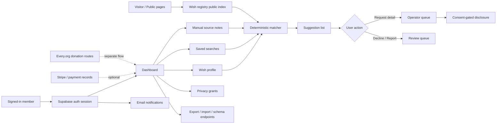
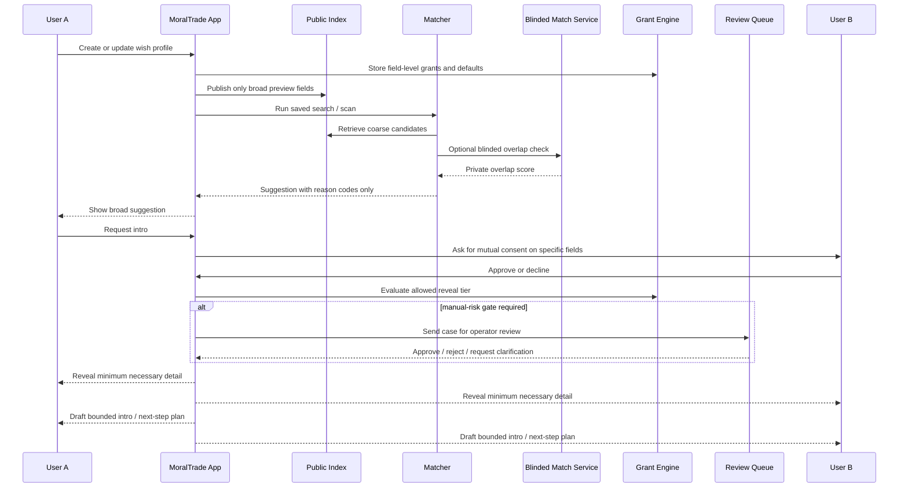

# Defense-Favoured Background Networking for MoralTrade

## Executive summary

**Bottom line.** MoralTrade already has the bones of a defense-favoured background networking system. Publicly inspectable pages show a deliberately conservative design: a semi-private wish registry, broad-preview search, deterministic matching, staged disclosure, consent-gated introductions, operator review, manual rather than automatic source ingestion, and an explicit ban on autonomous outreach or private-feed mining. That is much closer to Forethought’s “defense-favoured” framing than a typical growth-oriented social matching product. At the same time, it is still a thin pilot implementation: it appears to be small-scale, low-liquidity, rule-based, and largely centralized, with much of the more ambitious Forethought sketch still absent or only gestured at in product copy. citeturn8view0turn8view3turn28view0turn38view1turn38view3turn1view3

The highest-leverage recommendation is **not** to jump straight from today’s restrained prototype to broad passive ingestion of email, chat, or browsing history. Forethought explicitly frames background networking as powerful but double-edged; MoralTrade’s own safety and privacy pages make the same point. The right next step is a **defense-favoured v1**: stronger consent and disclosure controls, better explanation UX, tighter authorization and auditability, query-budget and anti-enumeration defenses, optional assistant-led elicitation for missing information, and only then narrow pilots of privacy-preserving overlap computation for the most sensitive matching flows. citeturn8view0turn8view2turn4view5turn38view1turn38view3turn34view1turn36view0

My confidence in the **directional conclusions** is **medium-high**. My confidence in claims about the *authenticated dashboard internals* is lower, because this audit had no private code access and no authenticated product access. The report therefore distinguishes between what is directly observable on public pages and what is an architectural inference or recommendation. citeturn1view3turn2view0turn28view0turn1view2

## Source basis and assumptions

This report was built in the order the request asked for: **Forethought first**, then **MoralTrade**, then additional primary and official sources on privacy-preserving contact discovery, security, privacy engineering, consent, and authorization. The most important external references were Signal’s private contact discovery work, academic PSI/contact-discovery papers, NIST Privacy Framework and logging guidance, EDPB guidance on consent and privacy by design/default, California OAG and CPPA guidance on CCPA/CPRA, W3C WebAuthn, IETF HPKE/VOPRF, Google Zanzibar and Private Join and Compute, Supabase’s security model, and official docs for OpenFGA, Tink, libsodium, OpenTelemetry, Prometheus, and self-hosted PostHog. citeturn8view0turn28view0turn17search0turn35view0turn36view0turn34view1turn17search2turn20search2turn20search8turn20search1turn19search2turn24search0turn30search0turn18search1turn18search2turn33search1turn18search0turn30search2turn33search0turn32search0turn32search1turn31search0turn31search6turn31search2

The main assumptions are straightforward. First, **MoralTrade is currently a small pilot**, because the public homepage shows **0 live offers, 8 worked examples, and 2 public profiles** at audit time. Second, the currently visible product is **centralized**, backed at least in part by **Supabase** for authentication and database storage, with **Stripe**, **Every.org**, and an external email provider in supporting roles. Third, the public site exposes **only the public layer and unauthenticated onboarding/login flows**; the dashboard, review console, and internal policies were not directly testable. citeturn1view3turn1view2turn27search0

One limitation matters for presentation. Public HTML page states were inspectable, but reliable live screenshot capture of those HTML screens was not available in this environment, so the report uses *cited page-state evidence, diagrams, and wireframes* rather than embedded screenshots. That does not materially change the audit findings, but it does mean the “UI inspection” is text-grounded rather than image-grounded.

## Current-state audit

MoralTrade’s public product copy presents background networking as a **“conservative matching layer”** that compares **broad public previews**, **saved preferences**, and **manual source notes**, while keeping exact wishes, constraints, and contact details private until both sides opt in. The matching logic is currently **deterministic and rule-based**, using cause areas, trade modes, constraints, location sensitivity, and verification preferences rather than AI inference. The wish registry itself is intentionally limited to **broad previews** with **keyword**, **cause-area**, and **payment/pledge openness** filters. citeturn38view1turn28view0turn27search2turn16search6

That architecture is already meaningfully aligned with Forethought’s core intuition: a **semi-private wish registry** that surfaces “just enough” information to decide whether further exploration is worthwhile. But today’s implementation is much narrower than Forethought’s design sketch. Forethought imagines passive and proactive modes, connected profiles on outside services, synthesis of a private profile of desires and capabilities, and perhaps chatbot-style elicitation of uncertainty. MoralTrade currently has **passive and proactive participation modes**, and it can record **possible source connections**, but the synthesis layer is explicitly **not AI-driven**, and source handling is limited to **manual notes and manual summaries**, not automatic ingestion or search over external feeds. citeturn8view0turn28view0turn4view5turn38view1

The strongest aspect of the current UX is its privacy posture. Multiple pages repeat the same boundaries: **broad previews first**, **consent before detail**, **no autonomous outreach**, and **no private-feed mining**. Match suggestions are described as **staged, reviewable, and reversible**; a participant can request more detail, decline, or report a suggestion; and introduction requests go to an **operator queue** that records intent, privacy constraints, and an SLA before contact details or exact wishes are exposed. Safety pages also describe **review queues**, **risk signals**, and an **admin console** for blocked or reported cases. citeturn38view1turn38view2turn38view3turn38view4

The weakest aspect of the present system is probably **liquidity and depth** rather than raw privacy. Forethought notes that background networking is most brittle early on and recommends starting in narrower niches while proactively seeking additional beneficiaries. MoralTrade’s own public counts show a very early-stage network, and the site itself repeatedly frames the founding cohort and one-serious-counterparty model as the fastest path. In that setting, the registry and matching layer can easily feel more like a carefully reasoned brochure than like live infrastructure for coordination. citeturn8view3turn1view3turn11view0

The public onboarding and account-access UX is competent but a bit inconsistent. Publicly visible signup asks for **display name, email, password, and optional location**, says location is hidden by default, and states that nothing is public by default. Login pages describe the private dashboard as the place where users manage **saved searches, privacy grants, source permissions, private alerts, and delegate settings**. However, signup is rendered in at least two different public shells depending on entry point, which suggests an onboarding inconsistency that is minor at today’s scale but worth cleaning up before more complex consent and grant workflows are added. The public auth flow also visibly centers **email + password**; no passkey or MFA prompt is visible in the public flow. citeturn6view0turn6view1turn13view0

From a data-flow perspective, the observable system looks like this:



This diagram is inferred from MoralTrade’s background networking, privacy, methodology, login, and safety pages, which together describe dashboard storage of wish profiles, manual notes, saved searches, privacy grants, operator queue review, export/import/schema endpoints, queued email notifications, and the supporting processor stack. citeturn38view1turn4view5turn28view0turn6view1turn38view3turn38view4

The biggest privacy risks in the current design are **inference leakage**, **operator overexposure**, and **future scope creep**. Even if only broad previews are searchable, a small network with sparse cause-area combinations or coarse location fields can still be deanonymized by a motivated searcher. Manual source notes can concentrate highly sensitive information in free text. And once the platform moves from explicit fields to richer passive data, the privacy risk rises steeply unless query budgets, anti-enumeration protections, formal grant logic, and auditability are built first. Forethought explicitly frames surveillance and collusion as the central design trade-off; academic work on contact discovery shows that deployed methods can leak badly, and newer designs like Arke focus directly on **mitigating enumeration attacks** and **avoiding single points of trust**. citeturn8view0turn4view5turn25search6turn34view1

The security posture is thoughtful in product policy but only partially legible in technical detail. The site discloses **Supabase authentication cookies**, **attribution cookies**, and storage/processor relationships with Supabase, Stripe, Every.org, and an external email provider. The product copy says admin review should be limited to safety, abuse, payment, and delivery operations, but the public pages do not document row-level authorization, break-glass access, key management, rate limits, security review, or incident disclosure. For a pilot, that is not unusual; for a future system dealing with richer wish inference, it would become a major gap. citeturn1view2turn38view4

The performance picture is mixed but not alarming. Public pages are mostly text-first and relatively lightweight; the matching logic is deterministic, which is cheap; and the people directory is described as paged for scalability. At the same time, many public pages visibly render a loading shell before content, which suggests an app-shell or hydration pattern that may add route-transition latency, especially on weaker mobile devices. Publicly inspectable content was not enough to verify mobile-specific DOM differences or measure actual Core Web Vitals, so device-specific conclusions should be treated as provisional. citeturn1view3turn2view0turn11view0turn28view0

The table below summarizes the current observable state.

| Dimension | Current observable state | Implication |
|---|---|---|
| Matching model | Deterministic, rule-based, no AI inference in the current synthesis or match layer. citeturn28view0turn38view1 | Highly auditable and cheap, but weaker recall and weaker handling of ambiguity. |
| Search/discovery | Public wish registry supports broad-preview search with keyword, cause area, and openness filters; exact asks/contact remain gated. citeturn27search2turn16search6 | Good privacy baseline, but vulnerable to sparse-data inference and low match richness. |
| Source ingestion | Manual source notes and manual summaries only; no raw-feed scraping or private-feed search. citeturn38view1turn4view5 | Strong defense-favoured posture, but limited passive discovery. |
| Follow-through | Notifications, saved-search results, match reports, invite drafts, brokerage bounties, introduction plans; reviewed operator queue with SLA. citeturn38view0turn38view1 | Good bounded next-step design, but likely operator-heavy. |
| Privacy controls | Field-level grants, staged disclosure, mutual consent, export/import portability. citeturn4view5turn28view0 | Strong conceptual model; needs harder technical enforcement. |
| Safety controls | No autonomous outreach, no mass ingestion, no private-feed mining; review queues and admin console for reports and blocked profiles. citeturn38view1turn38view3 | Strong policy layer; technical abuse resistance is not yet publicly legible. |
| Identity/auth | Public flow shows email/password auth; optional location hidden by default; nothing public by default. citeturn6view0turn6view1 | Good onboarding clarity, but auth hardening should improve before high-sensitivity scaling. |
| Observability/processors | Supabase auth/data, Stripe/Every.org/payment routes, external email provider, lightweight analytics and attribution cookie. citeturn1view2turn27search0 | Centralized pilot is pragmatic, but processor and telemetry scope must stay tightly bounded. |
| Scale/liquidity | Homepage shows 0 live offers, 8 worked examples, 2 public profiles. citeturn1view3 | Product-market and trust loops matter more than ranking sophistication right now. |
| Mobile/desktop | Text-first public pages; paged directory; loading-shell pattern; no separate mobile flow confirmed from public audit. citeturn11view0turn1view3turn2view0 | Optimize for narrow-screen consent and inbox flows early; measure rather than assume. |

## Gap analysis against Forethought

Forethought’s sketch has five especially relevant ingredients: **passive and proactive wish profiling**, **interoperable secure wish profiles**, **semi-private searchable registry**, **helpers that can take bounded first steps**, and a design stance that treats privacy, surveillance, and collusion as the hard central problem. MoralTrade already implements the last two surprisingly well in product philosophy, and it has early versions of the first three. The gap is not that the concept is wrong. The gap is that the current implementation is **still too thin, too manual, and too centralized** to realize Forethought’s upside at useful scale. citeturn8view0turn8view1turn8view3turn28view0turn38view1turn38view3

The most important mismatch is around **wish profiling depth**. Forethought imagines users either passively connecting outside services or proactively injecting wishes through chat-like interfaces, with synthesis creating an up-to-date model of hopes, intent, and capabilities. MoralTrade already exposes the idea of passive mode, source connections, and delegate rules, but it currently stops at explicit fields, captured excerpts, manual notes, and clarification questions from missing fields. That is an excellent safety-first first move; it is also a major recall bottleneck for discovery. citeturn8view0turn28view0turn6view1

The second mismatch is around **privacy-preserving computation**. Forethought’s sketch does not pin down the exact technical solution, but it clearly points toward filtering systems and secure mechanisms that surface only what is needed while minimizing surveillance and collusion risks. MoralTrade presently relies on centralized storage plus staged disclosure. That is acceptable for a low-scale pilot, but it is not enough if the platform later begins handling rich latent preferences or cross-service derived profiles. Signal’s contact-discovery work, PIR-PSI, and Arke show that more sophisticated privacy-preserving matching is technically possible today, though with meaningful complexity and trade-offs. citeturn8view1turn17search0turn35view0turn36view0turn34view1

The third mismatch is around **operational defenses against abuse**. Forethought worries about surveillance, harassment, exploitation, and collusion. MoralTrade’s copy handles this as product policy, but the public system does not yet advertise anti-enumeration budgets, per-query privacy costs, adversarial search detection, differential reveal tiers by trust level, or formalized case-management controls for operators. Modern contact-discovery literature increasingly treats enumeration resistance and unlinkability as first-class requirements, not afterthoughts. citeturn8view0turn38view3turn34view1turn25search6

The fourth mismatch is around **interoperability and portability**. Forethought emphasizes interoperable profiling and notes that decentralized implementations may later be preferable for portability. MoralTrade does mention export, import, and schema endpoints, but today those look more like future-facing product promises than ecosystem-level protocol commitments. citeturn8view1turn28view0

The table below compares MoralTrade’s current state to Forethought’s design principles.

| Forethought principle | Current MoralTrade state | Gap severity | What should change next |
|---|---|---|---|
| Passive + proactive wish profiling | Passive/proactive modes exist conceptually, but synthesis is deterministic and source handling is manual-only. citeturn8view0turn28view0 | High | Add optional assistant-led elicitation first; defer broad passive ingestion until stronger safeguards exist. |
| Semi-private searchable wish registry | Already present and one of the strongest parts of the product. citeturn8view1turn27search2 | Low | Keep this model, but add stronger anti-enumeration and explanation controls. |
| Helpers taking bounded first steps | Notifications, reports, invite drafts, introduction plans, and operator queue already fit this principle. citeturn8view0turn38view0turn38view1 | Medium | Add structured intro drafting, mutual-question exchange, and trust/risk scoring. |
| Privacy defence against surveillance | Strong policy posture, but mostly centralized and policy-dependent. citeturn8view3turn4view5turn38view3 | High | Add formal grants, query budgets, strong authz, and optional privacy-preserving overlap computation. |
| Enough transparency to deter collusion | Review queues, risk signals, and admin console are present in principle. citeturn38view3turn38view4 | Medium | Make review pathways explicit, auditable, and minimization-aware; publish trust/safety process. |
| Interoperability/portability | Export/import/schema endpoints are mentioned publicly. citeturn28view0 | Medium | Publish stable schemas and portable profile/export formats. |
| Small-niche adoption strategy | Current founding-cohort posture fits this. citeturn1view3turn8view3 | Low | Lean into high-intent niches before widening the network. |
| Defense-favoured stance | Very strong in product language and boundaries. citeturn8view2turn38view1turn38view3 | Low | Preserve it; do not erode it with growth hacks. |

## Recommended target design

The right target is **not** “Forethought literally implemented.” The right target is a **layered design** with three progressively more ambitious operating modes:

**Defense-favoured v1.** Improve the existing explicit-field system without changing its basic trust model. Add structured consent grants, reason codes, query budgets, trust/risk signals, operator case tooling, passkeys, row/column-level enforcement, and privacy-safe telemetry. This is the best immediate investment. citeturn38view1turn4view5turn30search0turn30search2turn30search14turn17search2turn20search3

**Assisted v1.5.** Add assistant-led **preference elicitation** and **source-connector summarization**, but only as explicit, revocable, source-scoped opt-in flows. The LLM should summarize into a normalized internal profile; raw external content should not become a default searchable corpus. This matches Forethought’s wish-profiling direction while staying compatible with GDPR/CCPA-style minimization and privacy by design. citeturn8view4turn28view0turn20search8turn20search1turn23search0

**Privacy-advanced v2.** For especially sensitive matching, add a separate overlap-computation lane using **blinded match tokens**, **PSI/PIR-PSI**, or in narrower cases an **attested enclave-backed service**. This should be optional and reserved for sensitive use cases, not forced on the whole product. Signal, PIR-PSI, and Arke suggest several workable directions with distinct trust/performance trade-offs. citeturn17search0turn25search0turn35view0turn36view0turn34view1

A proposed public-facing UX for the networking inbox could look like this:

```text
┌──────────────────────────────────────────────────────────────────────┐
│ Networking Inbox                                                    │
│ Saved search: “animal welfare ↔ poverty, remote OK, pledge-first”   │
├──────────────────────────────────────────────────────────────────────┤
│ Possible fit                                                        │
│ Broad preview: “Animal welfare and poverty donor”                   │
│ Why surfaced: cause overlap • pledge-open • shared query terms      │
│ Confidence: Medium   Risk review: None   Reveal tier: Broad only    │
│                                                                      │
│ [Request intro] [Ask one clarifying question] [Hide] [Report]       │
├──────────────────────────────────────────────────────────────────────┤
│ Sensitive fit                                                       │
│ Broad preview: “Regional health working group”                      │
│ Why surfaced: public-health overlap • location-compatible           │
│ Confidence: Low   Risk review: Manual review required               │
│                                                                      │
│ [Request consented reveal] [Hide] [Report]                          │
└──────────────────────────────────────────────────────────────────────┘
```

And the disclosure control should be made concrete rather than merely conceptual:

```text
┌──────────────────────────────────────────────────────────────┐
│ Disclosure settings for this intro request                   │
├──────────────────────────────────────────────────────────────┤
│ Cause areas                    [Broad]                       │
│ Trade mode openness            [Broad]                       │
│ Coarse location                [Broad / Off]                 │
│ Exact ask / exact offer        [Specific only after mutual]  │
│ Contact details                [Contact-level after approve] │
│ Source-derived summary         [Off by default]              │
│ Sensitive constraints          [Manual-review gate]          │
│ Retention after decline        [Auto-delete in 30 days]      │
└──────────────────────────────────────────────────────────────┘
```

The internal API and architecture should be explicitly split between **public index**, **private profile store**, **grant engine**, **matching engine**, and **review/casework**. Do not let the search layer query raw notes directly. Normalize everything into feature families, keep a clear public/private boundary, and log every disclosure decision as an auditable event. Relationship-based authorization tools are a good fit here: Google’s Zanzibar paper describes a globally scalable permissions model, and OpenFGA is the closest off-the-shelf open-source analogue; on the data plane, Supabase’s row-level and column-level controls can provide a practical enforcement layer if the schema is designed carefully. citeturn33search1turn33search0turn30search2turn30search14turn30search11

For cryptography, treat options as a menu rather than a religion. **Tink** and **libsodium** are good baseline choices for application-layer encryption and safer primitive usage. **HPKE** is useful for sealed per-field reveal flows or client-side encrypted grants. **VOPRF** is useful for blinded matching tokens. **PSI** is appropriate when both parties need to know overlap without revealing non-overlap. **PIR-PSI** is attractive when the server set is much larger than the client set and two non-colluding servers are acceptable. **Arke** is the most strategically interesting research lead if MoralTrade ever needs low-trust, enumeration-resistant contact discovery at larger scale. citeturn32search16turn32search1turn18search1turn18search2turn17search1turn36view0turn34view1

The recommended external stack is below.

| Layer | Recommended choice | Why |
|---|---|---|
| Fine-grained authorization | OpenFGA, inspired by Zanzibar. citeturn33search0turn33search1 | Best fit for field-level grants, staged disclosure, and reviewer access. |
| Database enforcement | Supabase Auth + RLS + CLS. citeturn30search2turn30search14turn30search11 | Practical enforcement for “who can read which field of which profile under which intro request.” |
| Auth hardening | WebAuthn/passkeys. citeturn30search0turn30search1 | Stronger auth for a high-sensitivity coordination product than password-only public flows. |
| Application crypto | Tink and/or libsodium. citeturn32search16turn32search1turn32search21 | Safer primitive selection for per-field encryption, sealed reveal tokens, and secure key handling. |
| Privacy-preserving overlap | VOPRF / HPKE for blinded tags; PSI/PIR-PSI or Google PJC for advanced cases. citeturn18search2turn18search1turn36view0turn18search0 | Lets you add privacy-preserving overlap without exposing raw sensitive fields. |
| Observability | OpenTelemetry + Prometheus + privacy-minimized self-hosted PostHog. citeturn31search0turn31search6turn31search2turn31search25 | Strong telemetry without forcing third-party product analytics into sensitive workflows. |

The proposal below shows the intended interaction pattern.



This pattern preserves the current MoralTrade strengths — broad-preview registry, staged consent, operator review, no automatic stranger messaging — while adding a more formal disclosure and computation model. It is also much closer to Forethought’s idea of “helpers in the background” taking bounded first steps without becoming opaque or over-autonomous. citeturn8view0turn38view1turn38view3

A minimal scoring-and-disclosure routine could look like this:

```python
def generate_suggestions(user_id: str) -> list[Suggestion]:
    profile = load_private_profile(user_id)
    grants = load_grants(user_id)

    public_query = build_public_query(profile)
    coarse_candidates = search_public_index(public_query)

    suggestions = []
    for candidate in coarse_candidates:
        coarse_score = score_public_overlap(profile, candidate)

        if coarse_score < COARSE_THRESHOLD:
            continue

        private_score = 0
        if profile.blinded_match_enabled and candidate.blinded_match_enabled:
            private_score = blinded_overlap(
                my_tokens=derive_blinded_tokens(profile.private_match_tags),
                candidate_ref=candidate.id,
            )

        total_score = combine_scores(coarse_score, private_score)

        if total_score < TOTAL_THRESHOLD:
            continue

        suggestion = Suggestion(
            candidate_id=candidate.id,
            reveal_tier="broad",
            reason_codes=top_reason_codes(profile, candidate),
            risk_flags=detect_risk_flags(profile, candidate),
        )
        save_suggestion(user_id, suggestion)
        suggestions.append(suggestion)

    enforce_query_budget(user_id)
    return suggestions


def request_intro(requester_id: str, suggestion_id: str) -> IntroResult:
    suggestion = load_suggestion(suggestion_id)
    counterparty_id = suggestion.candidate_id

    requested_fields = minimal_fields_for_intro()
    consent = request_counterparty_consent(counterparty_id, requested_fields)

    if not consent.approved:
        return IntroResult(status="declined")

    allowed_fields = evaluate_field_grants(
        requester_id=requester_id,
        counterparty_id=counterparty_id,
        requested_fields=requested_fields,
    )

    if requires_manual_review(suggestion.risk_flags, allowed_fields):
        return queue_for_manual_review(requester_id, counterparty_id, allowed_fields)

    disclosure = reveal_only(allowed_fields)
    return IntroResult(status="approved", disclosure=disclosure)
```

The logic is intentionally simple: public index first, optional privacy-preserving private overlap second, reason-code explanations rather than full ranked opacity, query budgets, and minimum-necessary reveal at the moment of mutual consent.

## Roadmap, compliance, and measurement

A realistic roadmap for a small team is below. These are **judgment estimates**, not facts, and assume a pragmatic centralized stack rather than a ground-up custom cryptographic platform.

| Priority | Feature tranche | Estimated effort | Delivery risk | Why it should come in this order |
|---|---|---:|---|---|
| Highest | Normalize profile schema, formalize field families, add explicit disclosure lattice, add query budgets and anti-enumeration controls | 2–4 weeks | Low | This hardens the current model without changing product philosophy. |
| Highest | Inbox UX for suggestions, reason codes, decline/report, trust/risk badges, intro-request flow | 3–5 weeks | Low | Improves usefulness immediately and makes reviewable matching legible. |
| High | Passkeys/WebAuthn, optional MFA, auth/session review, SSR/CDN cookie hardening | 2–4 weeks | Low | Publicly visible auth looks password-first; this should improve early. citeturn6view0turn6view1turn30search0turn30search1turn30search3 |
| High | OpenFGA-style grant engine + Supabase RLS/CLS alignment + reviewer scopes | 4–8 weeks | Medium | Turns privacy promises into enforceable access policy. citeturn33search0turn30search2turn30search14 |
| High | Privacy-safe telemetry, casework audit logs, alerting, redaction and retention controls | 2–4 weeks | Low | Needed before richer automation, both for trust and operations. citeturn17search2turn20search2turn20search3turn31search0 |
| Medium | Assistant-led elicitation for missing fields, with source-scoped opt-in summaries | 4–8 weeks | Medium | Adds Forethought-style profiling value without jumping to raw passive ingestion. citeturn8view4turn28view0 |
| Medium | Source connectors for explicit imports from chosen systems, processed in isolated jobs into normalized summaries | 6–10 weeks | High | Valuable, but the privacy and legal risk rises sharply here. |
| Medium | Narrow pilot for blinded private overlap on sensitive tags using HPKE/VOPRF | 6–10 weeks | High | Good stepping stone before full PSI or enclave approaches. citeturn18search1turn18search2 |
| Later | Sensitive-match lane using PSI/PIR-PSI or Arke-like distributed contact discovery | 8–14 weeks | Very high | Powerful, but only worth it for a narrow, well-validated use case. citeturn36view0turn34view1 |
| Later | Publish portable schema and external interoperability endpoints | 3–6 weeks | Medium | Important, but only after the internal model is stable. citeturn28view0 |

The compliance checklist should be treated as product scope, not just legal hygiene. GDPR’s core principles in Article 5 require lawfulness, fairness, transparency, purpose limitation, data minimization, and accountability. Article 25 requires privacy by design and by default. Article 30 requires records of processing. Article 35 requires a DPIA when new technologies are likely to create high risk to rights and freedoms. EDPB guidance reinforces both consent discipline and privacy-friendly defaults. California’s OAG and CPPA materials add rights to correct, delete, and limit the use/disclosure of sensitive personal information, and the CPPA’s 2024 enforcement advisory explicitly calls data minimization a foundational CCPA principle. If MoralTrade later adds AI-based ranking or richer profiling at sufficient scale, the CPPA’s 2025 regulations on **risk assessments**, **cybersecurity audits**, and **ADMT rights** become relevant, depending on applicability thresholds. citeturn21search0turn21search1turn21search2turn21search3turn20search1turn20search8turn19search2turn22search0turn22search20turn23search0turn24search0turn24search1

| Compliance area | What MoralTrade should do |
|---|---|
| Notice and lawful basis | Give a clear, layered notice for public index data, private profile data, source-derived summaries, reviewer access, and notification/analytics events; separate “matching necessary for service” from optional enrichment or source connectors. citeturn21search0turn20search1turn1view2 |
| Privacy by design/default | Default all source connectors off; default reveals to broad-only; default retention short for declined matches; default analytics to minimal event metadata only. citeturn21search1turn20search8turn20search15turn23search0 |
| Records of processing | Maintain a clear RoPA for each workflow: signup, wish profile, registry search, suggestion generation, intro request, reviewer queue, notifications, analytics. citeturn21search2 |
| DPIA and risk review | Conduct a DPIA before adding source connectors, AI synthesis, or privacy-preserving multi-party match computation. citeturn21search3turn19search3turn19search6 |
| Data minimization | Store normalized summaries rather than raw imported content wherever possible; keep raw source payloads ephemeral or do not store them at all. citeturn23search0turn21search0turn21search1 |
| Sensitive information controls | If source notes or inferred profiles touch sensitive beliefs or similarly sensitive categories, provide extra notices, stricter defaults, and simpler “limit use” controls. citeturn22search0turn22search20turn1view2 |
| User rights operations | Self-serve export, deletion, correction, and intro-history review where possible; preserve only what is necessary for safety and audit integrity. citeturn38view4turn19search2 |
| Processor management | Maintain DPAs and transfer assessments for Supabase, Stripe, Every.org, email delivery, and any future LLM/vendor used for summarization. citeturn1view2 |
| Security and logging | Log access decisions, reveal events, grant changes, review actions, and abusive query patterns using redacted, retention-bounded logs. citeturn17search6turn20search3turn20search2 |
| AI/ADMT governance | If AI ranking or inference is introduced, document training/prompt boundaries, human override, appeal/reporting path, and whether CPPA ADMT/risk-assessment obligations are triggered. citeturn24search0turn24search1 |

Measurement should also stay defense-favoured. MoralTrade already says its analytics are meant to understand whether users find the right pilot path, **not** to score moral value or automate outreach. Preserve that stance. Measure *precision, safety, and user trust*, not feed engagement. citeturn1view2turn28view0

| Metric family | Example metric | Good experiment |
|---|---|---|
| Match quality | suggestion-to-intro rate; intro-to-meaningful-conversation rate; false-positive hide rate | Compare plain rule-based ranking vs reason-code ranking with one clarifying question before intro. |
| Safety | report rate per 100 suggestions; blocked-intro rate; abusive-query detections; unwanted-exposure incidents | Test tighter query budgets and coarse reveal limits against completion rate and report rate. |
| Privacy | average reveal tier used; percent of suggestions resolved at broad-only stage; raw-source retention count | Measure whether assistant-led elicitation reduces the need for source-derived summaries. |
| Trust | trust survey after first intro; percent willing to enable advanced privacy mode; deletion/export satisfaction | Compare “always operator-reviewed” vs “risk-gated operator review only.” |
| Ops/performance | time to generate suggestion list; queue SLA attainment; auth failure rate; mobile route latency | Instrument end-to-end intro flow with OpenTelemetry traces and Prometheus metrics. citeturn31search0turn31search6 |
| Compliance readiness | percent of workflows with a documented purpose, retention rule, and lawful basis | Run quarterly internal privacy-design review on every new field or connector. |

The testing plan should mirror the risk model. At minimum, ship with unit tests for normalization and grant evaluation, integration tests for reveal tiers and reviewer paths, load tests for saved-search scans, property-based tests for “minimum necessary disclosure,” and adversarial tests for enumeration, spam, ranking leakage, and operator overreach. Before adding any AI synthesis or private overlap computation, do a short external security/privacy review. PSI/contact-discovery research shows how easy it is to get these systems subtly wrong, while NIST and OWASP materials both emphasize disciplined logging, verification, and secure development controls. citeturn35view0turn36view0turn34view1turn17search6turn20search2turn20search3

**Open questions and limitations.** The biggest unknowns are inside the authenticated dashboard: exact data model, real API shape, how saved searches run, whether row-level access controls already exist, what operator tooling actually looks like, whether notification events are already redacted, and how the team intends to scope future external-source connectors. Public inspection also could not verify live mobile layouts, bundle sizes, security headers, or rate limits. Those are the first things I would validate in code review or a staging audit before implementing anything beyond the highest-priority v1 hardening work.