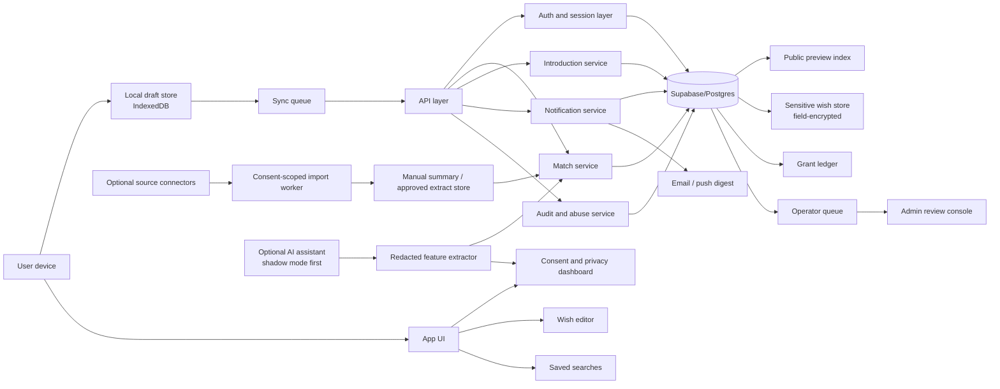
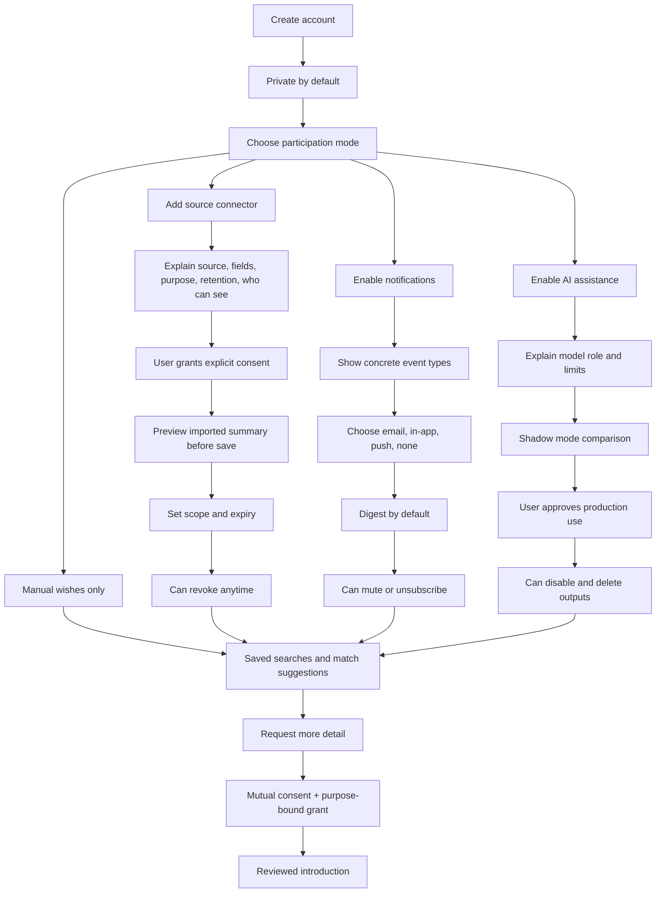

# Background Networking for Moral Trade

## Executive summary

Moral Trade already has a real, publicly documented background-networking prototype, but it is deliberately narrower and more conservative than Forethought’s design sketch. The current product is centralized, deterministic, and review-oriented: users create accounts, keep exact wishes private, expose only broad previews, save searches, add manual source notes, and receive consent-gated suggestions. The site explicitly disallows autonomous outreach, large-scale scraping, private-feed mining, and surprise exposure. It also introduces several defense-favored controls that are stronger than many early matchmaking products: staged disclosure, field-level grants, purpose-bound and time-boxed sharing, anti-enumeration budgets, hashed query fingerprints, sparse-query withholding, operator queues for introductions, and minimal telemetry rules that avoid copying exact wish text into analytics. citeturn14view0turn8view0turn12search3turn5search2

At the same time, Moral Trade only partially implements Forethought’s concept. Forethought envisions “attentive, personalised helpers” operating continuously in the background, optional passive ingestion from external services, LLM-driven wish synthesis, optional interview-style preference elicitation, and searchable semi-private registries that uncover opportunities even before a person knows to search for them. Moral Trade has the wish registry, the semi-private staging, and a passive/proactive participation distinction, but not the broad passive ingestion, not LLM-based synthesis, not chatbot elicitation, and not automated first-step exploration beyond deterministic scans and operator-mediated introduction requests. citeturn3view0turn5search2turn14view0

The central recommendation is therefore not “make Moral Trade more like a generic AI matching app.” It is: preserve the current defense-favored posture, then add capability in layers. The near-term layer should harden the current centralized prototype with explicit data maps, row-level access control, field-level encryption for sensitive wish text, only-in-context notification permissions, self-serve data rights, better failure handling, and a transparency dashboard. The medium-term layer should add optional source connectors and optional AI assistance only behind granular, revocable consent, with shadow-mode evaluations before any user-visible automation. The long-term layer should add privacy-enhancing computation for especially sensitive matching surfaces, local-first drafting and offline sync for user control, and possibly cryptographic matching primitives such as PSI for narrow categories of overlap discovery. citeturn14view0turn32view0turn32view7turn35view3turn35view0

In short, Moral Trade’s current implementation is directionally aligned with Forethought on semi-private wish registries and controlled disclosure, but it is intentionally underbuilt on passive data ingestion and AI-mediated synthesis. That is a strength, not a flaw. The right path is a staged expansion: first strengthen privacy, security, observability, and operator review; then add optional higher-power capabilities with auditable controls; and only later experiment with cryptographic or decentralized features where they clearly reduce surveillance and abuse risk rather than merely adding novelty. citeturn3view0turn14view0turn8view0turn33view0turn33view9

| Bottom line | Assessment |
|---|---|
| Strategic posture | Keep the current “no surprise exposure / no autonomous outreach / no private-feed mining” posture as the non-negotiable baseline. citeturn17view4turn12search3 |
| Biggest current strengths | Broad-preview registry, staged disclosure, purpose-bound grants, anti-enumeration budgets, review queues, portable export/import direction. citeturn14view0turn8view0turn5search2 |
| Biggest current gaps vs Forethought | No live external-data connectors, no LLM wish synthesis, no chatbot preference elicitation, no always-on personalized helper layer, no publicly specified cryptographic security design, no visible self-serve privacy portal. citeturn3view0turn14view0turn8view0 |
| Highest-priority implementation work | RLS and field encryption, consent dashboard, operator SLA/work queues, deletion/export self-service, digest-style notifications, abuse/rate-limit controls, offline draft queue, shadow-mode AI evaluation. citeturn32view0turn32view5turn32view6turn33view0turn33view3 |

## Forethought design sketch distilled

Forethought’s “Background networking” sketch addresses a specific coordination bottleneck: people often fail to find one another as potential collaborators, trading partners, or coalition members because current discovery channels are “slow and noisy.” Its proposal is a background layer of personalized helpers that continuously look for promising connections and, when warranted, notify principals or initiate structured first steps toward exploration. citeturn3view0

The sketch has three core functional ingredients. First is interoperable, secure wish profiling: users can participate passively by allowing a delegate system to distill signals from external services, or proactively by entering wishes directly through fluent interfaces. Second is synthesis: Forethought explicitly imagines LLM-driven or mixed-ML systems curating private profiles of desires, capabilities, and intent, plus optional interview-style clarification on uncertain points. Third is a searchable, semi-private wish registry that surfaces only enough information to decide whether deeper exploration is worthwhile. citeturn3view0turn2view1

Forethought is also unusually clear about the central hazard. Background networking creates a double-edged privacy problem: if sensitive wishes are too visible, the system can enable surveillance, exploitation, harassment, or state/corporate overreach; if everything is entirely hidden, it can facilitate collusion. The sketch therefore points toward filtered visibility and selective disclosure rather than either full transparency or total secrecy. It also raises portability questions, noting that centralized and decentralized implementations are both plausible, with decentralized approaches potentially more portable. citeturn2view4turn3view0

That makes the relevant benchmark for Moral Trade more specific than “does it have AI matching?” The better benchmark is whether the system supports: semi-private discovery, selective visibility, explainable introductions, safe incentive design, constrained automation, and privacy/surveillance safeguards strong enough that the product is more useful for defense-favored coordination than for predatory targeting. That is the frame used in the rest of this report. citeturn3view0

## Current Moral Trade implementation

Publicly accessible Moral Trade pages show a live, centralized pilot that already treats background networking as a bounded matching layer rather than a generic social network. The homepage presents a “privacy-first, non-AI background networking prototype,” and the background-networking page defines the feature as a “conservative matching layer” comparing broad public previews, saved preferences, and manual source notes so users can decide whether an introduction is worth exploring. The site repeatedly emphasizes “no surprise exposure,” “no autonomous outreach,” and “no private-feed mining.” citeturn11search3turn14view0turn17view4

The public UX flow is clear. A new user signs up with display name, email, password, and optional coarse location; agrees to Terms and Privacy; is told that nothing is public by default; then is prompted toward a first low-risk action such as cloning a worked example, creating a broad wish preview, or logging a public-good action. The login and background-networking pages describe a signed-in dashboard as the working surface for wish profiles, saved searches, source permissions, private alerts, export, and suggestion review. Exact wishes, contact information, and sensitive constraints are staged behind mutual consent. citeturn10view0turn10view1turn10view2turn14view0

The feature’s public architecture is partly specified and partly not. What is specified is that the current synthesis and matching layer is deterministic rather than AI-driven; matching uses explicit fields such as cause areas, trade modes, constraints, location sensitivity, and verification preferences; the system has a broad-preview registry; the implementation is “centralized first, portable later”; and privacy pages say Supabase is used for authentication and database storage, with Stripe, Every.org, and an external email provider used in adjacent workflows when enabled. What is not specified is the actual schema, queueing system, job scheduler, encryption scheme, model-serving stack, cache topology, deployment topology, or whether database RLS is already enabled in production. citeturn5search2turn14view0turn8view0

The data collection posture is notably constrained. Moral Trade says public pages may show names, broad cause areas, public offers, comments, recommendations, ratings, and follower counts, while private wish profiles are used for match suggestions and consent-gated introductions. The dashboard can record links to blogs, email, calendar records, chatbot history, search profiles, and other sources, but in the public pilot these store only consent scope, import mode, and manual summaries; the app “does not automatically ingest, scrape, or search raw external data.” Analytics are described as lightweight product events and attribution metadata, with explicit rules that background-networking analytics should use only counts, buckets, and state labels, not raw wish text, source notes, report bodies, or notification text. citeturn8view0turn7view2

Privacy and consent controls are stronger than average for an early matchmaking product. The site documents field-level grants that let a participant keep facts hidden, broad, specific, or contact-level for a given introduction workflow; purpose-bound, time-boxed grants that can expire or be revoked; staged disclosure; and mutual opt-in before sensitive details or contact details are shared. Signup also highlights that the platform does not sell user data and that exact wishes stay private unless both sides opt in. Public profiles appear only after a participant publishes offers or explicitly opts into visibility. citeturn8view0turn14view0turn19view1turn19view2

Moral Trade also documents several abuse-prevention and moderation controls. Safety pages say blocked proposal classes include violence, illegal acts, fraud, extortion, doxxing, harassment, exploitation, and pressure on vulnerable people. Review queues route reports, payment-review requests, failed notifications, and blocked wish profiles to an admin console. The background-networking flow additionally uses anti-enumeration budgets, hashed query fingerprints, and sparse-query withholding, while concierge-style introduction requests go to an operator queue first and record intent, proposed trade shape, privacy constraints, and an SLA before contact details are released. citeturn12search3turn15search0turn20view0turn20view2

Several important areas remain publicly unspecified. The site does not publicly describe encryption at rest or in transit beyond naming processors; it does not spell out retention periods beyond a purpose-based standard; it does not disclose notification-channel preferences or batching policy beyond queueing email records; it does not describe battery or network budgets for client-side behavior; it does not document merge/conflict rules for multi-device editing; and the signed-in dashboard internals are not inspectable from the public web without an account. Supabase’s default session model allows unlimited active sessions across devices unless configured otherwise, so cross-device account access is plausible at the auth layer, but the product does not publicly specify wish-profile synchronization semantics. citeturn8view0turn18view0turn32view2

| Dimension | Current public evidence | Assessment |
|---|---|---|
| Architecture | Centralized pilot with dashboard, private wish profiles, broad-preview wish registry, deterministic matching, export/import direction, and Supabase-backed auth/storage. citeturn5search2turn8view0 | Strong enough for a pilot; backend topology, schema, and queue implementation are unspecified. |
| UX flow | Minimal signup; nothing public by default; broad preview first; consent before specifics; reviewed introductions via operator queue. citeturn10view0turn10view1turn14view0 | Clear and conservative. |
| Data collected | Public profile fields, private wish profiles, saved searches, manual source notes, lightweight analytics, queued notifications, payment references where enabled. citeturn8view0turn14view0 | Data minimization is better than typical marketplaces, but a formal public data inventory is missing. |
| Opt-in / opt-out | Public visibility is opt-in or triggered by published offers; exact wishes are private by default; staged disclosure requires mutual consent. citeturn19view1turn8view0turn14view0 | Good baseline; no visible global privacy-control panel is publicly documented. |
| Privacy and consent | Field-level grants, purpose-bound/time-boxed grants, revocation/expiry, mutual opt-in, limited analytics. citeturn8view0turn20view0 | One of the system’s strongest areas. |
| Storage and retention | Supabase for auth/storage; retention based on operational need, safety, disputes, compliance, and abuse prevention; deletion/export via operator contact. citeturn8view0 | Functional but incomplete: no fixed retention schedule or self-serve deletion/export portal. |
| Notifications | Email provider may be used; queued, failed, and suppressed email records are operator-visible. citeturn8view0 | Basic notification operations exist; user-facing channel controls and batching are unspecified. |
| Resource usage | Anti-enumeration budgets and minimal telemetry are documented. citeturn14view0 | Battery, client polling, and sync frequency are unspecified. |
| Failure modes | Failed notifications, disputes, blocked wish profiles, and reports go to review/admin flows. citeturn12search3turn15search0 | Some operational failure handling exists, but incident response and rollback rules are unspecified. |
| Scalability | Paged people directory for larger scale; budgeted scans; centralized first, portable later. citeturn13view0turn14view0turn5search2 | Early scaling concepts exist, but no public throughput/SLO targets. |
| Cross-device sync | Sign-in unlocks persisted dashboard and alerts; Supabase sessions can exist on many devices by default. citeturn10view2turn32view2 | Likely cross-device access, but actual sync/conflict mechanics are unspecified. |
| Moderation and abuse prevention | Blocked proposal classes, anti-threat baseline review, review queues, operator triage, anti-enumeration. citeturn12search3turn20view0 | Good policy posture; automated abuse detection details are unspecified. |

## Alignment and gaps

Moral Trade already aligns with Forethought on four important points. It has a semi-private wish registry; it supports a passive/proactive participation distinction in its public methodology; it uses staged disclosure rather than public exposure of exact wishes; and it has already internalized the privacy-versus-collusion tradeoff that Forethought treats as the core design problem. In this sense, Moral Trade is not “missing background networking.” It already implements a defense-favored first version of it. citeturn5search2turn9search2turn14view0turn3view0

The biggest difference is where capability has been intentionally constrained. Forethought imagines delegate systems with live access to social posts, search profiles, chatbot history, and other external traces, distilled into up-to-date wish profiles by LLMs or similar systems. Moral Trade explicitly does not do that today: it stores source links, consent scope, import mode, and manual summaries only, and does not ingest raw private feeds, scrape profiles at scale, or mine email/chat histories. That is a large functional gap relative to Forethought, but it is also the main reason the current system is more legible and auditable. citeturn3view0turn2view1turn8view0turn14view0

A second gap is agentic assistance. Forethought’s “attentive, personalised helpers” are supposed to run quietly in the background, continuously surfacing especially promising opportunities and sometimes plugging into further tools that take the first steps toward exploration. Moral Trade’s current system stops much earlier: it produces deterministic prompts for human review, lets a participant request more detail or decline, and routes introduction requests into an operator queue. That is safer, but it means the product currently behaves more like a privacy-preserving discovery board than a true personalized helper layer. citeturn3view0turn14view0

A third gap is interoperability depth. Forethought emphasizes interoperable wish profiling; Moral Trade points in that direction via export/import endpoints and “possible source connections,” but public materials do not show live connector ecosystems, schemas published for third-party interoperability, or cryptographic matching across multiple data holders. The portability direction is real, but still aspirational. citeturn3view0turn8view0turn5search2

The largest operational gap is in privacy engineering detail. Moral Trade’s public docs are unusually thoughtful about principles, yet they do not publicly specify a mature technical privacy posture such as row-level policy enforcement, field-level encryption, key management, cache-control on authenticated SSR paths, MFA for users holding sensitive wishes, or a self-serve rights portal. Those omissions are not proof the controls are absent, but they are absent from the public documentation. Given that the feature handles sensitive, bargaining-relevant preference data, that gap matters. citeturn8view0turn32view0turn32view3turn32view4turn32view7

| Forethought recommendation | Moral Trade today | Alignment or gap |
|---|---|---|
| Personalized helpers that find promising connections in the background. citeturn3view0 | Deterministic scans and reviewed suggestions; no autonomous outreach. citeturn14view0 | Partial alignment in discovery; major gap in helper capability. |
| Passive mode with delegate access to external traces. citeturn3view0turn2view1 | Passive mode exists conceptually, but source connections are manual summaries only; no raw ingestion or mining. citeturn5search2turn8view0 | Major intentional gap. |
| LLM-driven wish synthesis. citeturn2view1 | Current synthesis layer is deterministic and explicitly non-AI. citeturn5search2turn11search3 | Major gap. |
| Optional chatbot-style clarification on uncertain points. citeturn2view1 | Clarification is generated from missing fields, but not via LLM interviewer. citeturn5search2 | Partial gap. |
| Searchable semi-private wish registry. citeturn2view4 | Broad-preview registry with staged disclosure and mutual consent. citeturn9search4turn14view0 | Strong alignment. |
| Filtered visibility to balance surveillance and collusion risk. citeturn2view4turn3view0 | Field-level grants, broad previews, anti-enumeration budgets, review queues, purpose-bound grants. citeturn8view0turn14view0turn12search3 | Strong alignment. |
| Centralized or decentralized portability considered. citeturn2view4 | “Centralized first, portable later” with export/import endpoints. citeturn5search2turn8view0 | Good early alignment. |
| Large-scale indexing and registry. citeturn2view4 | Paged directory, registry search, budgeted scans; public scale still tiny. citeturn13view0turn9search4 | Partial alignment; scale still pilot-level. |

## Recommended target design

The recommended target is a layered system that keeps Moral Trade’s current conservative posture as the default, while adding capability through explicit, revocable, purpose-bound permissions. The highest-confidence architecture is still centralized for now, because the public implementation already uses centralized storage and because centralization keeps auditing, abuse response, and staged rollout simpler at pilot scale. However, the system should become more local-first at the editing layer and more privacy-preserving at the matching layer over time. Local-first design is useful here because it improves offline use, multi-device resilience, privacy, and user control, while still allowing cloud-backed collaboration and portability later. citeturn8view0turn35view0turn33view0

A good near-term architecture is shown below. It separates public previews from sensitive wish content, keeps analytics bucketed, routes introductions through explicit grants, and treats AI as an optional, consent-gated assistive module rather than a silent background authority. That direction matches both Moral Trade’s current norms and the principles in privacy-by-design guidance from ICO and EDPB. citeturn14view0turn33view0turn33view1

The core data model should be explicit and auditable. At minimum, the system should have separate tables or collections for `participants`, `wish_profiles`, `wish_profile_versions`, `broad_previews`, `source_connections`, `manual_source_notes`, `privacy_grants`, `saved_searches`, `match_suggestions`, `introduction_requests`, `notification_preferences`, `abuse_signals`, and `audit_events`. Sensitive free text should not live in the same access pattern as low-risk preview fields. Supabase’s own documentation recommends combining Auth with row-level security for end-to-end browser-to-database access control, and that should become a hard requirement here rather than a nice-to-have. citeturn32view0turn32view1

For security, implement three layers rather than one. The first layer is access control: strict RLS so participants can only read their own private wishes, limited operator roles can access only triage-relevant material, and public endpoints never touch the sensitive tables. The second layer is cryptographic storage: use application-level field encryption for exact wish text, sensitive constraints, and private notes, with envelope key management and key rotation, because RLS alone does not defend against every backend compromise mode. The third layer is delivery/session hardening: enable MFA for users who hold private wish data, shorten access-token windows prudently, and set `Cache-Control: private, no-store` on any authenticated SSR path to avoid session leakage through CDN or proxy caching. citeturn32view0turn32view7turn32view3turn32view4turn32view2

Notification design should become more conservative, not more aggressive. Browser push is technically available and can wake a service worker even when the app is inactive, but the Push spec notes that push is more resource-intensive than direct communication and is best suited to infrequent, time-sensitive events rather than high-volume matching chatter. Moral Trade should therefore default to in-app inbox plus digest email, and offer web push only for high-salience, explicitly selected events such as “your grant was accepted,” “your introduction request needs action,” or “an operator has resolved your report.” Prompting for notification permission should happen only in context, after the user sees the value of a specific alert type. citeturn34view5turn34view4turn8view0

For offline-first behavior, use IndexedDB to store drafts, match explanations already seen, and consent receipts locally; use service workers narrowly and carefully. MDN notes that service workers can impose performance costs on cold loads, so the service-worker scope should be focused on dashboard and background-networking routes instead of every page. For sync, standard Background Sync is useful to retry failed writes when a device comes back online, but Periodic Background Sync remains experimental and limited in availability, so it should not be a production dependency for core matching behavior. Server-side jobs should continue to generate matches; the browser should not be responsible for continuous scanning. citeturn34view3turn34view2turn34view0turn34view1

The AI roadmap should be opt-in and staged. Do not jump from a deterministic system to full passive ingestion and autonomous helper behavior. Instead, add optional AI in shadow mode first: let consenting users compare deterministic summaries with AI-produced summaries on approved source extracts, then measure whether AI improves suggestion precision, explanation quality, and user endorsement without increasing unsafe exposure. If AI is later promoted into production, the system should use the federated/local-first principle wherever possible—keep sensitive raw data on device or in minimal redacted form, and use server-side models only on explicitly consented feature representations. Federated learning can help when optimizing models over decentralized data without centralizing raw training corpora, but communication cost is a principal constraint, so this is a medium- to long-term tool, not a necessary first implementation step. citeturn35view1turn33view8turn35view0

Privacy-preserving computation should also be staged. Differential privacy is useful for aggregate telemetry such as “how many users enabled source connectors?” or “what percentage of introduction requests pass operator review?”; NIST’s guidance is a reminder that DP is a formal privacy-loss framework with practical hazards, so it should be used for aggregate reporting, not as the primary defense for exact-match discovery. For highly sensitive overlap checks, PSI is the more relevant primitive: NIST describes PSI as a way for parties to identify common elements without revealing non-common elements, and Google and Meta have both described real-world private matching/join systems built from related ideas. For Moral Trade, that suggests a long-term path where especially sensitive tags or overlap features could be matched via PSI or related PETs, while the rest of the product remains conventional and auditable. citeturn33view8turn35view3turn35view4turn35view5

The consent flow should be redesigned around separability and reversibility. Consent for account creation is not the same thing as consent for source connectors, not the same thing as consent for AI summarization, and not the same thing as consent for notifications. ICO guidance is clear that valid consent must be freely given, specific, informed, and unambiguous, and that consent is not appropriate if the user has no real choice or if processing would happen anyway. That means the current account-creation agreement should remain contract/terms-based, while each optional higher-power feature gets its own affirmative, contextual permission and its own withdrawal control. citeturn33view5turn33view6turn33view3

A transparency dashboard is the most important UX improvement. It should show, in plain language: what surfaces are being used for matching, when each was last updated, which fields are broad vs specific vs contact-level, which grants are active and when they expire, the last ten suggestions with factor codes and redacted reasons, declined or reported matches, introduction-request status, notification settings, and all operator-visible disclosures. That design would directly operationalize GDPR-style transparency, data minimization, storage limitation, and privacy-by-default expectations. citeturn33view0turn33view2turn33view3

The public-facing copy should become more concrete. Examples of improved copy:

| UI surface | Recommended copy |
|---|---|
| Source connector permission | “Connect this source only to produce a private summary for matching. We will not search the raw source continuously, contact anyone from it, or copy raw content into analytics. You can review the summary before saving, limit which fields it may influence, and revoke access at any time.” |
| Match explanation | “This suggestion appears because you both indicated overlapping cause areas, compatible trade modes, and similar verification preferences. The system is not ranking moral worth. It is showing a coarse overlap signal only.” |
| Notification prompt | “Turn on alerts only for introduction requests and consent decisions. Leave routine suggestions in your in-app inbox or email digest.” |
| Grant confirmation | “You are sharing contact-level access for this introduction request only. Unless renewed, access expires in 14 days.” |

That copy is consistent with Moral Trade’s current public posture and with consent guidance emphasizing specificity, clarity, and genuine user choice. citeturn14view0turn33view5turn33view6

## Roadmap, testing, and metrics

The short-term roadmap should concentrate on hardening the existing conservative model rather than adding intelligence. The highest-value items are visible privacy controls, data-rights self-service, access-control hardening, cache/session hardening, and better operational instrumentation. These are lower-risk than AI expansion and close the largest trust gaps in the current public implementation. ICO and EDPB guidance both support this sequence: build privacy by design and by default into the system lifecycle rather than treating it as a late add-on. citeturn33view0turn33view1turn33view3

The testing strategy should mirror that sequence. First test correctness and safety of deterministic matching, grants, and disclosure transitions. Then test security controls such as RLS policy coverage, MFA enrollment and recovery, session leakage prevention on authenticated routes, and abuse/rate-limit enforcement. Only after that should the team run shadow-mode AI evaluations comparing deterministic and AI-generated summaries or suggestions on opt-in cohorts. Logging should be comprehensive for security and operations, but consistent with the current rule that raw wish text and sensitive note bodies stay out of analytics. citeturn32view8turn32view5turn32view6turn14view0

| Horizon | Priority work | Effort | Main risk | Why this belongs here |
|---|---|---:|---|---|
| Short term | Document a public data inventory, retention schedule, and processor map; add self-serve export/correction/deletion; add privacy dashboard; harden authenticated routes with `private, no-store`; enable MFA for sensitive accounts; implement RLS audits and field-level encryption for sensitive text. citeturn8view0turn32view0turn32view3turn32view4turn33view0turn36view0turn36view1 | Medium | Implementation drag and migration complexity | Highest trust return for lowest conceptual risk. |
| Medium term | Add local draft storage with IndexedDB and retry queue; add in-app inbox plus digest notifications; add explicit connector permissions for a small number of sources; launch shadow-mode AI summarization on approved extracts only; add richer operator SLA dashboards and appeals. citeturn34view3turn34view0turn34view5turn35view1 | Medium to High | Overcollection creep, noisy alerts, operator burden | Improves usability without abandoning defense-favored controls. |
| Long term | Add PET-backed overlap discovery for especially sensitive tags; experiment with PSI or private-join flows; consider local-first multi-device sync for wish editing; publish interoperable schema and connector APIs; graduate from operator-assisted intros to more automated but still consent-gated workflows. citeturn35view3turn35view4turn35view5turn35view0 | High | Complexity, latency, auditability loss | Worth doing only after the safety posture is mature. |

A practical KPI stack should mix usefulness, safety, privacy, and operations. The most important usefulness metrics are median time from signup to first meaningful suggestion, suggestion acceptance rate, introduction-request conversion rate, and user-rated explanation helpfulness. The most important safety metrics are report rate per 1,000 suggestions, decline/report ratio by source surface, operator queue backlog and SLA attainment, sparse-query block count, and the proportion of introductions stopped for anti-threat reasons. The most important privacy metrics are grant revocation latency, deletion/export fulfillment time, percentage of telemetry events free of sensitive fields, notification opt-in rate by channel, and privacy-incident count. These KPIs are not arbitrary; they follow directly from the product’s stated goals of consent-gated discovery, constrained disclosure, and auditable review. citeturn14view0turn8view0turn12search3

## Open questions and source list

The main limitation of this inspection is that the signed-in dashboard and underlying implementation are not publicly inspectable without an account, and the public pages do not expose schema details, cryptographic implementation, queueing internals, incident response playbooks, or production access-control policies. Where the site was silent, this report marks those items as unspecified rather than assuming they exist or do not exist. Cross-device sync behavior, exact deletion mechanics, encryption-at-rest design, and notification fanout logic are the clearest examples. citeturn18view0turn8view0turn14view0

The source priority requested by the user was followed in substance: Forethought first, then Moral Trade, then additional primary or official sources. The most important sources used were Forethought’s design sketch for the target concept; Moral Trade’s background-networking, privacy, methodology, safety, signup, login, registry, people, terms, and homepage pages for product inspection; Supabase documentation for auth, sessions, RLS, MFA, and SSR cache safety; OWASP guidance for auth throttling, rate limiting, cryptographic storage, logging, and REST security; ICO, EDPB, EDPS, and California DOJ materials for privacy-by-design, consent, data minimization, and consumer rights; MDN and W3C materials for service workers, background sync, IndexedDB, notifications, push, and permissions; and original or primary materials on local-first software, federated learning, differential privacy, and PSI. citeturn3view0turn14view0turn8view0turn5search2turn12search3turn10view1turn10view2turn9search4turn13view0turn9search3turn32view0turn32view2turn32view3turn32view4turn32view5turn32view6turn32view7turn32view8turn32view9turn33view0turn33view1turn33view2turn33view3turn33view4turn33view5turn33view6turn36view0turn36view1turn36view2turn34view0turn34view1turn34view2turn34view3turn34view4turn34view5turn34view7turn35view0turn35view1turn35view2turn35view3turn35view4turn35view5

The single strongest implementation recommendation is therefore simple: **do not replace the current conservative product philosophy; formalize and strengthen it, then let optional higher-power features earn their way in through auditable, revocable, user-controlled expansion paths.** That is the version of “Background Networking” most consistent with both Forethought’s defense-favored framing and Moral Trade’s existing public commitments. citeturn3view0turn14view0turn8view0