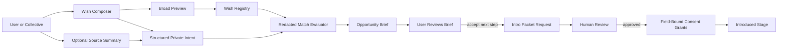
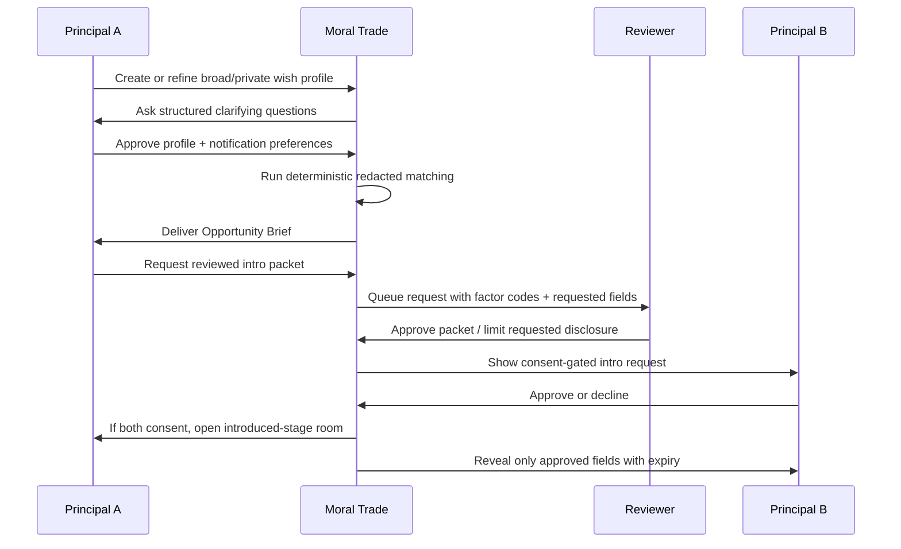

# Background Networking for Moral Trade

## Executive summary

Moral Trade already ships a notably **defense-favoured** version of background networking. Its current public design emphasizes broad previews before exact wishes, staged mutual consent before disclosure, no autonomous outreach, deterministic matching over explicit fields, app-level encryption for sensitive background-networking text, row-level security requirements on private tables, anti-enumeration controls, and privacy-safe telemetry. That means the product is already much closer to Forethought’s *safety-conscious* framing than a typical growth-first networking platform. citeturn20view0turn2view1turn2view3turn24view0turn32view3

At the same time, Moral Trade is still a **pilot rather than an operating matchmaking system**. Publicly, it shows zero live proposals, zero completed agreements, only two public profiles, and zero reviewed match suggestions or disclosure grants in the latest transparency report. The transparency report also exposes at least one current instrumentation gap: a live aggregate source is unavailable for `match_concierge_requests` because the table is missing from the schema cache. In practice, this means the immediate product problem is not “how to scale aggressive AI networking,” but “how to make the current conservative system actually useful, legible, and trustworthy enough to generate real pilot activity.” citeturn10view1turn11view0

Compared with Forethought’s sketch, the biggest gaps are not on safety boundaries but on **capability and productiveness**. Forethought imagines interoperable wish profiling, optional ingestion from existing services, richer preference elicitation, notifications for especially promising opportunities, individual *and collective* principals, and tooling that can safely take the first exploratory steps after a match is found. Moral Trade currently has broad-preview registry search, saved searches, privacy grants, source-permission concepts, and operator-mediated concierge paths, but it does **not** yet have live source connectors, live AI summarization, private-overlap computation, collective-first matching workflows, or a strong “opportunity brief” layer that turns a plausible match into an easy, privacy-safe next step. citeturn13view0turn20view0turn19view1turn7view0

The best path forward is therefore **not** to jump directly to comprehensive passive ingestion of email, social media, or chatbot logs. That would collide with Moral Trade’s own public privacy gates and with standard privacy principles requiring data minimisation, explicit purpose definition, and DPIA-style scrutiny for high-risk profiling. A better path is staged: first, improve manual and guided wish profiling; second, make notifications and introduction requests much more informative and actionable; third, support collectives as first-class principals; fourth, introduce tightly scoped, opt-in source summaries; and only later, if the pilot earns trust, add privacy-preserving overlap checks or shadow-mode AI assistance. citeturn20view0turn30view0turn35search0turn35search4turn35search19

My overall confidence is **high** for the public-route findings and **medium** for authenticated-dashboard specifics, because the report is grounded in public pages and public contract surfaces, while some dashboard details remain declared rather than directly viewable without signing in. citeturn20view0turn19view1turn9view1

## What Moral Trade currently implements

Moral Trade’s public background-networking page describes the feature as a **“conservative matching layer”** that compares broad public previews, saved preferences, and manual source notes so a participant can decide whether an introduction is worth exploring. Its explicit product boundary is: broad previews first, consent before detail, and no autonomous outreach. The system says suggestions are staged, reviewable, and reversible, and that a suggestion is **not** an introduction and does not itself reveal private data. citeturn20view0

The current matching model is explicitly **deterministic and redacted**. Candidate matches are scored from declared cause areas, trade modes, constraints, location sensitivity, and verification preferences; match cards show coarse reason codes, confidence bands, trust/risk badges, scanned surfaces, and redacted surfaces; and the evaluator says it does **not** infer ideology, psychology, protected traits, or hidden preferences. Human review is mandatory before disclosure, contact, reliance, or state changes. The public contract for match signals reinforces that `POST /api/moral-trade/match-signal/evaluate` is preview-only and returns `stateMutation false`. citeturn20view0turn32view3

The registry/search surface is also deliberately limited. The wish registry says it searches **public preview fields only** and exposes just enough information to decide whether a counterparty seems worth exploring. Search supports a query, cause area, and openness filters; ranking is based on cause overlap, shared query terms, and payment/pledge openness; and the visible example records are broad previews rather than live private profiles. citeturn4view0turn2view2

The product already has the beginnings of a richer private layer behind login. Signup is intentionally minimal, then routes new members toward one low-risk first action: clone a worked example, create a broad wish preview, or log a public-good action. The login page says the member dashboard contains offers, private alerts, saved searches, privacy grants, source permissions, and “delegate settings.” The background-networking page adds that the signed-in dashboard exposes a data map, active grants, notification channel choices, local drafts, transparency receipts, and data-right requests. citeturn19view0turn19view1turn20view0

Architecturally, the public evidence points to a **centralized, contract-heavy, Supabase-backed system**. The privacy page says Supabase is used for authentication and database storage. The technical spec lists core entities such as private wish profiles, source connections, source notes, saved searches, privacy grants, match suggestions, notifications, evidence records, disputes, payment records, and agreement events. It also publishes a route catalog and privacy classes, including `wish_registry_search` as a “privacy thresholded public preview” route, authenticated-private routes for saved searches and profile portability, and redacted analytics for funnel events. citeturn2view1turn15view0turn31view0turn32view4turn32view5

On privacy and security, the current implementation is unusually explicit for a pilot. Moral Trade publicly claims app-level field encryption for background-networking exact wishes, sensitive constraints, source notes, connector consent notes, and synthesis summaries; Supabase auth cookies; private no-store cache policies for authenticated/sensitive routes; admin MFA; participant session review and revocation; and rate limiting. Yet it also makes careful **non-claims**: platform-wide field-level encryption is not claimed, CSP is currently report-only, provider-console MFA/device inventory are not replaced by the app-level admin gate, and full key-rotation evidence remains a gate before sensitive scale. citeturn2view3turn24view1turn28view0

Operationally, the feature is instrumented, but the public evidence shows it is **not yet mature**. The measurement plan includes events for `wish_profile_started`, `detail_request_submitted`, `match_consent_recorded`, and `background_scan_run`, and it forbids raw search text, exact wishes, source notes, private messages, and contact details from analytics. Performance targets are published for route error rate, API latency, LCP, INP, and CLS, and route families include background networking. However, the performance contract also explicitly says Moral Trade does **not** yet claim verified production Core Web Vitals pass status, and it identifies `loading_interstitials` and route-resilience debt as observed friction. Those public non-claims match what is visible on several live pages, which still begin with “Preparing the requested view” or “Loading Moral Trade.” citeturn9view0turn26view1turn19view0turn19view1turn20view0

Accessibility and governance are likewise candid but incomplete. The accessibility statement targets WCAG 2.1 AA-oriented QA, prioritizes keyboard and screen-reader checks, and explicitly says a full manual screen-reader pass has **not** yet been published for every authenticated workflow. The team/governance page says the reviewer rulebook is public, but named advisors and external reviewers are **not public yet**. That is honest and good, but for a trust-sensitive networking feature it also means users are currently being asked to trust rules more than named people. citeturn9view1turn18view0

## Where Moral Trade matches and misses Forethought

Forethought’s design sketch imagines background networking as a **“matchmaking marketplace” of attentive, personalised helpers** that run in the background, notify people when especially promising connections appear, support both individual and collective principals, optionally ingest data from existing services, and combine passive distillation with active wish injection through fluent interfaces. Under the hood, Forethought emphasizes interoperable secure wish profiling, a semi-private searchable wish registry, and enough filtering/privacy structure to avoid both surveillance and criminally opaque collusion. citeturn13view0

Moral Trade is already strongly aligned with the **defense-favoured half** of that sketch. It already has broad-preview-first discovery, semi-private registry search, purpose-bound grants, human review before disclosure, anti-enumeration budgets, minimal telemetry, and explicit concern about the surveillance-versus-total-secrecy trade-off. It also already contemplates source connectors, AI shadow summarization, and privacy-preserving overlap computation, but keeps all three capability classes default-off, shadow-only, or design-only until DPIA, lawful-basis, privacy-design review, external security/privacy review, and human-control checks are satisfied. That is very close in spirit to Forethought’s warning that the default way such systems get built may be insufficiently sensitive to privacy and surveillance issues. citeturn20view0turn2view1turn13view0

Where Moral Trade misses Forethought is mostly in the **usefulness layer**. Forethought expects wish profiling to become richer over time, including consensual linkage to existing services and optional interview-style elicitation to reduce uncertainty about what a person really wants. Moral Trade currently stores manual source summaries only, explicitly does not ingest raw private feeds, and blocks live source connector workers pending DPIA-like gates. That is the safer choice for now, but it means Moral Trade is not yet delivering the “up-to-date representation of hopes, intent, and capabilities” that Forethought sketches. citeturn13view0turn20view0turn2view1

Forethought also imagines **notifications for especially promising opportunities** and tools that can automatically take the first exploratory steps toward connection. Moral Trade does have notification preferences and explicitly says background scans can open notifications, saved-search results, match reports, network invite drafts, bounties, and introduction plans. But the public product surface does not yet show a distinctive “opportunity brief” UX, and the transparency report shows zero reviewed match suggestions and zero disclosure grants. That suggests the issue is not merely missing copy; it is that the opportunity-discovery loop has not yet become active enough to demonstrate value. citeturn2view2turn20view0turn11view0

Forethought explicitly allows sign-up as an **individual or an existing collective**. Moral Trade’s public materials do already seed a collective example in the wish registry and route people toward a founding cohort and community partners, but the visible data model and community surfacing are still mostly individual-account centered. There is no public evidence yet of first-class collective principals with shared approvals, internal role-based privacy, or group-level introduction governance. That is a meaningful gap because many of the best moral-trade opportunities will likely be between donor circles, working groups, communities, organizers, or institutions rather than between isolated individuals. citeturn13view0turn4view0turn19view3

The strongest high-level conclusion is this: **Moral Trade is already safer than Forethought’s sketch, but not yet as useful as Forethought’s sketch**. That is the right failure mode for an early pilot. The next phase should therefore preserve the current safety posture while adding value through better elicitation, better opportunity packaging, better collective workflows, and better pilot instrumentation. citeturn20view0turn13view0turn10view1

### Current behavior and recommended target state

| Aspect | Current public behavior | Recommended target state |
|---|---|---|
| Wish profiling | Manual private wish profiles and manual source summaries only; no live raw external ingestion; exact wishes remain private behind grants. citeturn20view0turn2view1turn15view0 | Add a **guided wish composer** with structured interview prompts, uncertainty flags, and optional source-derived summaries reviewed by the user before saving. |
| Registry/search | Wish registry searches public preview fields only and withholds overly sparse queries via privacy controls. citeturn4view0turn2view1 | Keep the broad-preview registry, but add **better search affordances**, explanation quality, and detection of “high-potential but under-specified” opportunities. |
| Matching logic | Deterministic, redacted, explicit-field matching with factor codes; no hidden inference; human review required. citeturn20view0turn32view3 | Keep deterministic preview matching as the default, but add **structured opportunity ranking** and **shadow-mode assisted summarization** only after evaluation gates are met. |
| Notifications | Notification preferences and delivery records exist, but public surfacing of networking notifications is generic and not especially actionable. citeturn2view1turn20view0 | Introduce **Opportunity Briefs** with why-this-matched, what-stays-hidden, expected next step, and explicit reveal consequences. |
| First-step workflow | Requests for more detail and concierge review exist; methodology mentions invite drafts and introduction plans. citeturn20view0turn2view2 | Add **pre-filled introduction packets**, mutual question sets, and reveal capsules that prepare—not auto-send—the first serious conversation. |
| Collective support | Community/cohort language exists and the wish registry shows a demo collective, but collective actors are not a clearly first-class product primitive. citeturn4view0turn19view3 | Add **collective principals** with admins, approval thresholds, group-level previews, and group disclosure rules. |
| Privacy-preserving overlap | Mentioned only as design exploration: VOPRF, HPKE sealed fields, PSI, PIR-PSI; no production lane yet. citeturn20view0 | Pilot a **narrow overlap lane** for a small set of sensitive coarse tags, with abuse budgets, cryptographic review, and no free-text matching. |
| Transparency/governance | Public contracts are rich, but outcomes are mostly zero and one aggregate source is currently miswired; named advisors/reviewers are not yet public. citeturn11view0turn18view0 | Fix contract/data wiring, publish named governance roles, and report pilot-level opportunity metrics monthly with small-sample suppression. |
| Performance/mobile/accessibility | Performance targets exist, but no public claim of verified production CWV pass status; loading interstitials remain known friction; authenticated accessibility audits are incomplete. citeturn26view1turn9view1turn19view0turn19view1 | Publish route-level actuals, reduce interstitials, and run manual mobile/keyboard/screen-reader QA on authenticated background-networking flows. |

## Prioritized roadmap

The table below prioritizes improvements by **expected pilot value**, **alignment with Forethought**, and **compatibility with Moral Trade’s current privacy posture**.

| Priority | Improvement | Why it matters now | Estimated effort | Security/privacy impact | UX tradeoff |
|---|---|---|---|---|---|
| Highest | Build a **guided wish composer** with structured prompts, uncertainty capture, and editable broad/private splits | Forethought’s biggest missing piece on Moral Trade today is richer wish profiling; current onboarding is low-friction but still thin. citeturn13view0turn19view0turn20view0 | Medium | Positive if it replaces free-text sprawl with structured fields and clearer redaction boundaries. | Slightly more onboarding time, but much better match quality. |
| Highest | Add **Opportunity Brief** notifications and dashboards | The current system has alerts/notifications but lacks a visible, compelling “especially promising connection” layer, and public usage is near zero. citeturn19view1turn2view1turn11view0 | Medium | Positive if email/push content stays generic and sensitive details stay in-app only. | More surfaces to design; risk of notification fatigue if thresholds are weak. |
| Highest | Make **collectives first-class principals** | Forethought includes collectives, and Moral Trade already hints at them through cohort/community flows and demo registry records. citeturn13view0turn4view0turn19view3 | Medium to high | Neutral to positive if group privacy and approval thresholds are explicit. | More complex permissions model. |
| High | Create a **reviewed introduction packet** flow | Current concierge review is sensible but vague. Pre-filled packets make “first steps” concrete without violating the no-autonomous-outreach rule. citeturn20view0turn2view2turn32view3 | Medium | Positive if all reveals remain field-bound and reversible. | Adds another stage before direct human contact. |
| High | Launch **optional source summaries** with explicit field scopes and expiry reminders | This is the safest bridge from today’s manual notes to Forethought-style passive data ingestion. Moral Trade already has source permissions and retention windows conceptually. citeturn2view1turn20view0turn13view0turn35search0turn35search4 | High | High positive if implemented with source-level consent, strict purpose limits, and DPIA gates. | More privacy choices for users to understand. |
| High | Fix **transparency and operational wiring** | Public trust is weakened by aggregate metrics that are all zero and by a missing-schema-cache error on concierge request reporting. citeturn11view0 | Low to medium | Positive because it improves oversight and auditability. | None, except modest engineering time. |
| Medium | Reduce **loading interstitials** and publish route-level performance actuals | The site itself flags loading interstitials and does not yet claim verified production CWV pass status. citeturn26view1turn19view0turn19view1 | Medium | Neutral | Faster, more legible product; less “prototype” feel. |
| Medium | Add a **narrow privacy-preserving overlap lane** for sensitive coarse tags | This is a good future-fit upgrade, but not the first thing to ship given current pilot volume. Moral Trade already identifies VOPRF/HPKE/PSI/PIR-PSI as design-only options. citeturn20view0 | High | Potentially very positive, but only after cryptographic and abuse-case review. | Harder to explain; can become “mystical” if UX is weak. |
| Medium | Publish a **named reviewer/governance roster** before scaling trust badges | The governance page says named advisors and reviewers are not public yet. That is appropriate now, but it will become a bottleneck for trust-sensitive networking. citeturn18view0 | Low | Positive because it reduces insider-risk opacity. | Less anonymity for operators/reviewers. |
| Lower | Add **shadow-mode AI summary assistance** for source summaries and opportunity briefs | Useful eventually, but Moral Trade is right to keep assist mode and guarded automation blocked until public evaluation gates are met. citeturn20view0turn29view5turn30view0turn30view1turn35search1 | High | Mixed: can help utility, but increases profiling and explanation-risk. | Better summaries, but higher trust burden. |

### Recommended sequencing

The first release train should focus on **guided wish profiling, opportunity briefs, collective principals, and reviewed introduction packets**. Those four changes deliver most of Forethought’s product value **without** requiring the riskiest capabilities, such as raw passive ingestion or automated disclose/contact decisions. That sequencing also fits Moral Trade’s own rollout gates, which keep assist mode and guarded automation blocked while allowing deterministic and shadow-mode work. citeturn29view5turn30view1

The second release train should focus on **source-summary connectors, transparency/governance hardening, and authenticated-flow performance/accessibility QA**. Those are the prerequisites for later higher-power networking. Because ICO guidance stresses data minimisation and purpose limitation, and because DPIAs are required for high-risk profiling-style AI uses, connector work should ship only with explicit field scopes, retention windows, user-reviewed summaries, and a separate consent ledger. citeturn2view1turn20view0turn35search0turn35search4turn35search19

Only after those stages produce real pilot activity should Moral Trade consider **narrow, cryptographically scoped overlap computation** or AI-assisted matchmaking beyond shadow mode. Otherwise the team would be paying a heavy privacy and complexity cost before proving product-market fit at the safer layers. citeturn20view0turn13view0

## Design artifacts and migration plan

### Annotated wireframe

The most important UX shift is from a registry/search utility to an **opportunity management cockpit**. The wireframe below keeps broad previews and consent gates, but makes the next step dramatically clearer.

```text
┌──────────────────────────────────────────────────────────────────────┐
│ Background Networking Dashboard                                     │
│ Privacy stage: Broad preview only   Notifications: Digest           │
├──────────────────────────────────────────────────────────────────────┤
│ My profile                                                          │
│  Broad preview: Climate, Public Health, Community Service           │
│  Private tags: [redacted count]   Source summaries: 2 active        │
│  Missing clarity: verification preference, timing, hard blockers    │
│  [Refine profile] [Review source summaries] [Manage grants]         │
├──────────────────────────────────────────────────────────────────────┤
│ Opportunity Briefs                                                  │
│                                                                      │
│  High potential                                                      │
│  Climate ↔ Public Health working group                               │
│  Why surfaced: cause complementarity, pledge-compatible, remote      │
│  Still hidden: exact asks, constraints, contact details              │
│  Next safe step: answer 3 clarifying questions                       │
│  [Open brief] [Not for me] [Mute similar]                            │
│                                                                      │
│  Medium potential                                                    │
│  Animal welfare ↔ poverty donor                                      │
│  Why surfaced: reciprocal swap pattern + verification fit            │
│  [Request reviewed intro packet]                                     │
├──────────────────────────────────────────────────────────────────────┤
│ My queues                                                           │
│  Pending detail requests | Grant expiries | Operator messages        │
│  1                     | 2 in 7 days     | 0                         │
└──────────────────────────────────────────────────────────────────────┘
```

This design is grounded in the current product’s broad-preview-first model, its existing grant/notification/source-permission concepts, and Forethought’s emphasis on quiet background helpers surfacing especially promising opportunities. The main change is that the product should explain **what the user can do next** without implying that the system has already solved trust, consent, or disclosure. citeturn20view0turn19view1turn13view0

### Suggested API and schema changes

Moral Trade’s public data model already contains many of the right primitives. The recommendation is therefore an **extension**, not a rewrite. citeturn15view0

**Recommended new or expanded entities**

| Entity | Purpose | Core fields |
|---|---|---|
| `principal` | Allow one actor to be either a person or a collective | `id`, `type`, `display_name`, `owner_user_id`, `collective_policy_id`, `visibility_state` |
| `wish_profile_v2` | Separate broad preview from structured private intent | `principal_id`, `broad_preview`, `private_intents`, `verification_prefs`, `timing`, `hard_blockers`, `uncertainty_flags`, `status` |
| `source_summary` | User-approved summary from a source, not raw content | `principal_id`, `source_type`, `summary_text_encrypted`, `allowed_field_keys`, `retention_expires_at`, `consent_receipt_id`, `status` |
| `opportunity_brief` | Turn a redacted match signal into a concrete next step | `principal_id`, `candidate_principal_id`, `factor_codes`, `confidence_band`, `why_text`, `next_step_type`, `hidden_fields_notice`, `expires_at` |
| `intro_packet` | Reviewed first-step packet before direct reveal/contact | `opportunity_brief_id`, `requester_answers`, `requested_fields`, `review_state`, `sla_due_at` |
| `collective_policy` | Group approvals and role-based disclosure rules | `approval_threshold`, `approver_roles`, `max_auto_grant_stage`, `default_retention_policy` |
| `grant_receipt` | Human-readable consent receipt for disclosure or connector use | `grant_id`, `purpose`, `fields`, `audience_stage`, `created_at`, `expires_at`, `revoked_at` |
| `mute_rule` | Let users suppress categories of low-value briefs | `principal_id`, `factor_code_pattern`, `cause_pair`, `duration` |

**Key route additions**

| Route | Method | Function |
|---|---|---|
| `/api/background/opportunity-briefs` | `GET` | Return redacted actionable briefs for the current principal |
| `/api/background/profile/interview` | `POST` | Record structured elicitation answers without changing disclosure state |
| `/api/background/source-summaries` | `POST` | Save a user-reviewed summary with field scopes and expiry |
| `/api/background/intro-packets` | `POST` | Create a reviewed introduction packet request |
| `/api/background/collectives` | `POST/GET` | Manage collective principals and approval policies |

These additions stay consistent with Moral Trade’s existing API philosophy: publish schema, privacy class, rate-limit surface, fallback behavior, and non-claims for each route; keep thresholded preview search separate from authenticated-private flows; and ensure no route silently mutates disclosure state. citeturn31view0turn31view1turn32view4

### Recommended data flow

The following flow preserves the current defense-favoured model while making the system more useful.



This is essentially a productization of what the public documentation already implies: broad previews and saved searches feed candidate discovery; redacted factor-code matching produces preview signals; disclosures remain stage-bound and field-bound; and any higher-power automation stays behind review gates. citeturn20view0turn32view3turn26view3

### Recommended interaction sequence



The crucial property is that the system becomes *more active* without becoming *autonomous*. That keeps Moral Trade aligned with both its own no-outreach contract and Forethought’s desire for tools that take the first steps **safely**. citeturn20view0turn13view0turn32view3

### Migration plan

**Phase alpha**

Ship the guided wish composer, opportunity briefs, and intro packets **without** connectors or AI summarization. Reuse the existing factor-code and disclosure-grant logic. This is the shortest route to more value without altering the trust boundary. citeturn20view0turn32view3turn29view0

**Phase beta**

Add collective principals, grant receipts, expiry reminders, and improved transparency metrics. Fix the aggregate-report schema-cache issue before using transparency as a trust signal for a more active networking feature. citeturn11view0turn18view0

**Phase gamma**

Introduce source-summary connectors behind **separate source-level consent** with explicit field scopes, retention windows, and a user-review-before-save step. Keep raw ingestion disabled and AI summarization in shadow mode until evaluation gates are met. citeturn2view1turn20view0turn30view0turn30view1

**Phase delta**

Only after meaningful pilot activity exists should Moral Trade pilot high-sensitivity overlap checks, such as blinded-tag matching or cryptographically constrained overlap tests, and even then only for narrow fields and reviewed abuse cases. citeturn20view0turn13view0

## Risk assessment and compliance checklist

The main product risk is that Forethought’s useful vision can easily tip into a **surveillance or targeting system** if implemented incautiously. Moral Trade already identifies that risk explicitly: the unsafe failure modes are targeting, surveillance, scraping, autonomous outreach, and hidden exposure of exact wishes. Forethought raises the same dual-use concern and notes that the problem is not solved either by total openness or total privacy. citeturn33view0turn20view0turn13view0

A second major risk is **purpose creep**. Forethought’s sketch includes access to social posts, search profiles, chatbot history, and other ambient traces. ICO guidance on purpose limitation and data minimisation is directly relevant here: the organization should collect only the minimum personal data necessary for a defined purpose, and if purposes change, users should be informed before their data is reused. That means any move from “manual source notes” to “live source connectors” must be a separate product purpose, a separate consent object, and a separate retention lifecycle—not merely a feature toggle. citeturn13view0turn35search0turn35search4turn35search16

A third risk is **high-risk profiling without adequate assessment**. ICO guidance states that DPIAs are required for systematic and extensive profiling or other automated evaluation used for decisions with significant effects. Moral Trade’s current public capability gates already require DPIA, lawful-basis records, privacy-design review, and external privacy/security review before live connectors, AI assist mode, or private-overlap computation expand. That is the right baseline and should remain non-negotiable. citeturn35search19turn20view0turn2view1

A fourth risk is **insider and operator abuse**. Moral Trade’s current technical controls—RLS requirements, no anonymous private-table policies, admin MFA, session review/revocation, abuse throttling, and public incident-response lanes—are strong foundations, but the site itself says sensitive admin scale and paid-action volume scale remain blocked until device/session review and key-rotation evidence are published. Therefore, do not broaden private-source access before those operational gates are closed. citeturn20view0turn24view1turn28view0

### Compliance checklist

| Checklist item | Why it matters | Current posture | Recommendation |
|---|---|---|---|
| Data minimisation | Only collect what is necessary for the stated purpose. citeturn35search0 | Strong in current pilot: broad previews, manual summaries, no raw feed ingestion. citeturn20view0turn2view1 | Preserve this default. Treat every new connector field as opt-in and justified. |
| Purpose limitation | New uses require explicit and specific purposes. citeturn35search4turn35search16 | Public docs already distinguish broad previews, introductions, analytics, and notifications. citeturn2view1turn9view0 | Add per-connector purpose labels and grant receipts visible to users. |
| DPIA / high-risk profiling review | Required for high-risk automated profiling. citeturn35search19 | Already required in Moral Trade’s public capability gates. citeturn20view0turn2view1 | Make “no DPIA, no launch” a hard release gate for connectors, AI assist, and overlap computation. |
| Access control and least privilege | Prevent broad internal or external access. | Strong current posture: RLS audit, no anonymous private-table policies, participant-scoped checks. citeturn20view0 | Add periodic access reviews and publish the completion of scale gates before expansion. |
| Encryption and key management | Sensitive networking data needs stronger protection. | Background-networking fields use app-level encryption; key-rotation evidence not complete. citeturn2view3turn24view1turn28view0 | Publish key-rotation records before any wider source-connector rollout. |
| Retention and deletion | Sensitive data should expire and be removable. | Strong conceptual model: retention windows, self-serve deletion, separate background deletion phrase. citeturn20view0turn2view1 | Add visible expiry reminders and deletion receipts for users. |
| Notification privacy | Email/push can leak sensitive match context. | Current docs say delivery records are retained specifically to avoid exposing private wish text by email. citeturn2view1 | Keep email/push generic; show all sensitive content only after login. |
| Accessibility | Trust-sensitive workflows must remain accessible. citeturn35search7turn35search18 | Public accessibility scope is honest, but authenticated workflows still lack a full published screen-reader pass. citeturn9view1 | Include authenticated dashboard and consent flows in manual WCAG 2.2-style QA before scale. |
| AI risk management | Documentation, evaluation, and human control are required. citeturn35search1turn35search5 | Strong current posture: deterministic rules, forbidden end-to-end LLM matching, protected-trait inference prohibited. citeturn30view0turn30view3 | Keep shadow-only AI until model cards, fairness audits, and public evaluation metrics are live. |

## Testing, monitoring, and limitations

The testing plan should mirror the product’s trust model: **redaction correctness, disclosure correctness, human-review correctness, and product usefulness** matter more than recommendation-model cleverness. Moral Trade already publishes measurement events and evaluation slices that provide a solid starting taxonomy. citeturn9view0turn30view1

For **unit testing**, prioritize schema and policy invariants: broad-preview serialization must never include exact wishes; `opportunity_brief` creation must never raise disclosure stage; grant expiry must revoke access cleanly; notification serializers must strip sensitive fields from email/push payloads; and deletion jobs must remove background-layer records while preserving only the allowed redacted audit rows. These follow directly from the existing disclosure, match-signal, deletion, and operations contracts. citeturn26view3turn32view3turn20view0turn24view0

For **integration testing**, validate the full background-networking flow: wish composer to match-signal preview, opportunity brief creation, intro packet review, mutual consent, reveal expiry, grant revocation, and dashboard deletion. Also add abuse-path tests for sparse-query withholding, enumerative search budgets, unauthorized route reads, and replay-safe state transitions. Moral Trade’s public contracts already define several of these as operational requirements. citeturn20view0turn24view0turn28view1

For **privacy and security audits**, require a formal threat model before each escalation step. At minimum, audit insider misuse, notification leakage, unintended inference, query enumeration, connector overcollection, group-admin abuse, and retention drift. If AI assistance is added, keep it within the current rollout-gate logic: shadow mode first, then assist mode only if privacy incidents stay at zero and overrule reasons are reviewed, and guarded automation only for missing-field detection, explanation rendering, and checklist drafting. citeturn29view5turn30view1turn35search1

For **user testing**, run moderated studies on four questions: whether users understand what is public vs private; whether they correctly predict what will be revealed at each stage; whether opportunity briefs reduce friction versus the current registry/search path; and whether collective actors can understand approval and disclosure policies. Because Moral Trade’s value proposition depends on trust and legibility, comprehension rates should matter more than click-through rates. citeturn20view0turn18view0turn13view0

### Suggested monitoring dashboard

| Dashboard area | Metrics to show |
|---|---|
| Activation | `signup_start`, `signup_complete`, `onboarding_complete`, `wish_profile_started`, intro-packet creation rate. citeturn9view0 |
| Opportunity quality | Opportunity briefs delivered, brief-open rate, detail-request rate, mutual-consent rate, “not for me” rate, report rate, reviewer overrule rate. Supported by current evaluation/trust model. citeturn30view1turn10view2 |
| Privacy health | Grant revocation rate, grant expiry completions, background-layer deletion completions, sparse-query withholding count, privacy-incident count. citeturn20view0turn24view0turn28view0 |
| Review operations | Median concierge review time, disclosure-grant counts, appeals, unresolved disputes, SLA attainment. Current transparency model already targets these. citeturn11view0 |
| Performance/mobile | Route error rate, p95 API latency, LCP p75, INP p75, CLS p75, specific loading-recovery ratio. citeturn26view1 |
| Accessibility | Authenticated task-completion rate on keyboard-only/mobile flows, error-recovery success, manual assistive-tech pass/fail annotations. WCAG-aligned direction follows W3C guidance and Moral Trade’s own accessibility scope. citeturn9view1turn35search3turn35search7 |

## Open questions and limitations

Some important parts of the product could not be fully verified from public evidence alone. In particular, I could not directly inspect the authenticated dashboard’s exact information architecture, real notification copy, real web-push behavior, actual production Core Web Vitals samples, or actual mobile breakpoint behavior in signed-in states. Moral Trade’s public pages acknowledge these limits indirectly by publishing route targets and accessibility intentions while declining to claim fully verified production performance or a full manual screen-reader pass across authenticated workflows. citeturn19view1turn9view1turn26view1

The other major limitation is pilot volume. Because the transparency report still shows zero reviewed match suggestions, zero disclosure grants, and related zero-count operational outcomes, some recommendations here are necessarily based on **design logic and trust requirements**, not on observed high-volume funnel failures. That does not make the recommendations speculative in a loose sense—it means the right priority is to establish a trustworthy and instrumented pilot loop before optimizing anything like marketplace efficiency. citeturn11view0turn10view1turn13view0