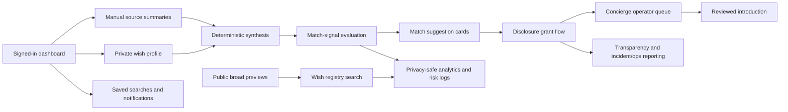
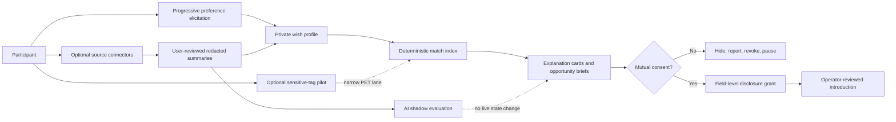
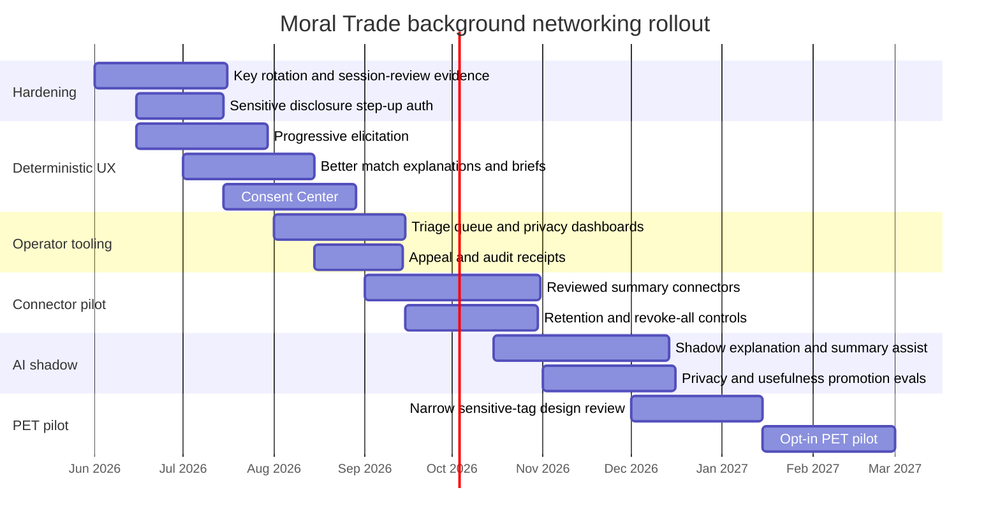

# Building a Defense-Favoured Background Networking Feature for Moral Trade

## Executive summary

Moral Trade’s current Background Networking feature is already much closer to a **defense-favoured, privacy-first matching system** than to a conventional growth or social-graph product. Publicly inspectable materials show a conservative architecture: broad public previews come first; exact wishes, contact details, and sensitive constraints are gated behind staged disclosure; matching is deterministic and preview-only; raw private-feed ingestion is disabled; AI is limited to shadow-mode experimentation; and introductions route through an operator queue rather than autonomous outreach. The site also publishes unusually rich public contracts for disclosure, matching, performance, security, incident response, and operations. However, the feature appears to be **lightly or not yet operational at scale**: the current pilot reports zero reviewed match suggestions, zero opportunity briefs, zero intro packets, and zero disclosure grants for the public reporting period, while live offers and completed agreements are also zero. In other words, Moral Trade has built a strong public specification layer, but not yet a proven high-volume operating layer. citeturn1view0turn12view1turn25view0turn10view6turn1view3turn1view4

Forethought’s design sketch points toward a fuller system: interoperable wish profiling, passive and proactive preference capture, semi-private searchable registries, attentive helpers that surface promising opportunities, and cautious handling of the privacy–surveillance trade-off. Moral Trade already matches some of this structure, especially the wish registry, semi-private discovery, staged disclosure, registry search controls, and central role for consent. The largest gaps are not conceptual; they are **capability gaps**: no live passive ingestion, no continuously updated preference model, no production AI summarization, no privacy-preserving overlap lane, and no mature operator tooling demonstrated at real usage levels. Those gaps should mostly be closed by **deepening the existing conservative architecture**, not by replacing it with aggressive automation. citeturn18view0turn33view0turn33view3turn25view0turn25view2

The strongest path forward is a **two-lane design**. Keep a deterministic, auditable, human-controlled production lane for all live matching, disclosure, and introductions. In parallel, build an opt-in assistive lane for better preference elicitation, user-reviewed source summaries, shadow-mode AI explanation drafting, and eventually a very narrow privacy-preserving overlap pilot for specific sensitive-tag use cases. That path is far more aligned with both Moral Trade’s present safeguards and Forethought’s warning that the same class of technology can easily become surveillance, harassment, collusion, or coercive leverage if built incautiously. It is also better aligned with NIST’s privacy- and AI-risk management guidance, with OWASP guidance on minimizing stored sensitive data and testing security controls, and with the specific cryptographic primitives Moral Trade already names publicly as design candidates for future overlap checks. citeturn18view0turn33view2turn35view1turn35view0turn35view2turn35view3turn39search0turn39search1turn39search2

My confidence is **moderate to high** on the public architecture, policy, and code-level references, because Moral Trade publishes detailed public contracts and health surfaces. My confidence is **lower** on signed-in UX specifics, admin tooling ergonomics, and actual runtime behavior inside the dashboard, because those areas require account access and the public site explicitly routes working features through signed-in member workflows. citeturn12view5turn41search5turn41search6

## Current public-state audit

This audit is based on public pages, public contract/health JSON, and publicly exposed file-and-route references. I did **not** inspect a private repository or signed-in dashboard, so anything behind authentication should be treated as **partially specified, not directly verified**. Still, Moral Trade exposes enough public technical metadata to infer a meaningful architecture and operating model. citeturn2view0turn31view0turn23view0turn20view0turn22view1

The current architecture appears to be a server-rendered web application with explicit public/private route distinctions, private no-store cache rules, Supabase-backed authentication and storage, route-level health contracts, and a background-networking subsystem centered on private wish profiles, manual source summaries, deterministic synthesis, match-signal evaluation, disclosure grants, and operator-reviewed introduction requests. Public health surfaces reference `next.config.ts` and `src/app/...`, which strongly indicates a Next.js-style application structure, though the repository itself is not publicly inspectable from the audited surfaces. citeturn29view0turn30view1turn30view2turn31view0

The diagram above is an inference from the public product, privacy, methodology, and contract pages: public discovery happens through broad previews and wish-registry search; private work happens in the signed-in dashboard; matching is deterministic and redacted; introductions are human-reviewed rather than automatic; and telemetry is explicitly constrained to redacted counts, route health, and coarse state labels. citeturn13view0turn1view0turn12view2turn12view4turn31view0turn19view2

### Architecture, data flows, and user experience

The current public-state architecture can be summarized like this:

| Audit area | Current finding | Assessment |
|---|---|---|
| Discovery surface | Public discovery is via broad previews and the wish registry; the registry searches public preview fields only, with cause areas, summaries, and coarse location available, while exact asks and contact details require mutual consent. citeturn13view0turn41search4 | Strong fit for “broad preview first”; weak fit for rich discovery depth. |
| Working surface | Moral Trade explicitly says “the dashboard is the working surface” for creating wish profiles, saving search constraints, adding manual source notes, exporting profile data, and reviewing suggestions. citeturn12view5 | Good separation between public education and private workflow. |
| Profile model | The dashboard stores private wish profiles, manual source notes, saved searches, and broad registry previews. Methodology pages describe both a passive mode and a proactive mode, but the current synthesis layer is deterministic rather than AI-led. citeturn1view0turn41search6 | Conceptually coherent; deliberately conservative. |
| Match logic | Match signals use only explicit, redacted profile fields such as cause areas, trade modes, verification preferences, location sensitivity, privacy stage, and stated exclusions. The contract explicitly forbids hidden-preference inference, disclosure, contact, reliance, or state mutation. citeturn9view0turn21view0 | Excellent current safety posture. |
| Match explanations | Match cards disclose coarse reason codes, confidence bands, trust/risk badges, scanned surfaces, and redacted surfaces without exposing raw wish text, contact details, or source notes. citeturn1view0turn11view3 | Strong explainability for a preview system. |
| Disclosure flow | Disclosure is field-level, purpose-bound, stage-bound, expiry-aware, and owner-controlled. Stages are `registry`, `consent`, and `introduced`; contact details require explicit owner approval and the introduced stage. citeturn9view1turn25view2 | Very strong privacy design. |
| Introduction flow | A broad preview can become a reviewed introduction request, but only through an operator queue that records intent, trade shape, privacy constraints, and an SLA before contact details or exact wishes are released. Appeals go to a second operator review. citeturn12view4turn41search5 | Safe, but potentially operationally heavy. |
| Notifications | Background scans may open notifications, saved-search results, match reports, invite drafts, brokerage bounties, and intro plans, but not auto-send messages. Generic copy is preserved in notifications to avoid leaking exact wishes by email. citeturn1view2turn19view0 | Good safety baseline; likely low immediacy/value until cohort volume rises. |
| Public adoption evidence | The pilot reports zero live proposals, zero completed agreements, zero reviewed match suggestions, zero opportunity briefs, zero intro packets, and zero disclosure grants for the reporting period. citeturn1view3turn10view6 | The system is specified much more strongly than it is operationally validated. |

### Privacy, consent, storage, and third-party boundaries

Moral Trade’s privacy posture is unusually explicit. It separates public profile data from private wish-profile data; it uses broad previews plus staged grants rather than broad publication of exact wishes; and it treats surveillance and total secrecy as competing bad defaults. Active external connections require source-level permission, consent notes, retention windows of 30, 90, 180, or 365 days, and field-lists limited to broad categories such as cause priorities, capability tags, offer/ask terms, verification preferences, availability context, and safety constraints. Raw connector ingestion remains disabled. citeturn1view1turn12view3turn25view0

The current storage model is also fairly well specified. Public broad previews remain until hidden, corrected, or deleted. Private wishes, asks, constraints, and capabilities remain until correction, deletion, or account removal, subject to safety or legal holds. Disclosure grants remain for the active intro plus post-expiry audit retention. Source notes remain until source removal, deletion request, or safety/legal hold. Operational records remain for an operational window plus abuse-prevention audit retention. Participants can delete the background-networking layer without deleting the whole account by typing `DELETE BACKGROUND NETWORKING`, which removes participant-facing matching materials while retaining only redacted or anonymized audit rows where integrity requires it. citeturn12view2turn12view3turn12view4turn19view0

Third-party integrations and infrastructure are discoverable from public pages. Supabase is used for authentication and database storage. Stripe is used for card, payout, and payment objects when payment workflows are enabled. Every.org is used for off-site donation routes. Vercel is treated as a provider boundary in the security contract. Email delivery may use an external provider, but that provider is not publicly named in the inspected materials. In-app and web-push preferences are stored in Moral Trade records. citeturn19view0turn19view1turn30view2turn41search9

### Security, performance, and operational maturity

The public security posture is good in concept and fairly specific in implementation details. Moral Trade says it has HSTS and other browser security headers, private no-store cache rules for authenticated/sensitive routes, Supabase auth cookies, app-level background-field encryption with a versioned keyring, server-only secret management, allowlisted admin MFA, participant session review/revocation, abuse throttling, and incident-response reporting. At the same time, it explicitly does **not** claim platform-wide field-level encryption for every private table, a completed provider key-rotation program, provider-wide device inventory, or 24/7 security operations. Sensitive admin scale is currently blocked on device/session-review evidence and key-rotation evidence; paid-action scale is blocked on key rotation. citeturn9view4turn23view0turn22view1

Performance and telemetry are also reasonably well framed, but current public evidence is still mostly contractual rather than observational. Moral Trade’s public performance contract sets targets of route error rate ≤1%, public API p95 latency ≤800 ms, LCP p75 ≤2500 ms, INP p75 ≤200 ms, and CLS p75 ≤0.1, which align with mainstream Core Web Vitals guidance. The performance contract also says the site does not yet claim verified CWV pass status until route-level samples are collected and published in aggregate. Telemetry is explicitly restricted from storing private wish text, source notes, contact details, or unredacted query strings. citeturn20view0turn9view3turn40search0turn40search8

Operationally, the site exposes route families for background networking that include `/background-networking`, `/wish-registry`, and `/api/wish-registry/search`. It also names rate-limit surfaces for public reads, saved-search writes, match-signal evaluation, disclosure evaluation, review-workflow evaluation, wish-registry search, and analytics ingest. The current operations profile lists observability metrics such as funnel-event counts, route error rate, API latency p95, web vitals, blocked proposal rate, privacy incident count, copilot fallback rate, evidence review SLA, and appeal overturn rate. citeturn20view0turn26view0turn31view0

### Code-level notes and discoverable files or endpoints

These code-level notes come from **public contracts and health JSON**, not from direct repository access.

| Discoverable item | Public evidence | What it likely means |
|---|---|---|
| `next.config.ts` | Public security/operations evidence says it sets HSTS, `X-Content-Type-Options`, `X-Frame-Options`, `Referrer-Policy`, `Permissions-Policy`, CSP report-only headers, and private no-store behavior for private routes. citeturn29view0turn30view2 | The app is very likely built on Next.js with centralized header/cache configuration. |
| `src/lib/supabase/proxy.ts`, `src/lib/supabase/server.ts` | Public security profile says both are used to refresh auth through server-side cookies. citeturn30view2 | SSR/session handling is server-mediated rather than purely client-side. |
| `src/lib/background-field-encryption.ts` | Public security profile says it uses AES-256-GCM with versioned ciphertexts and active key IDs from environment variables, failing closed when no key is configured. citeturn30view2 | Background-networking sensitive text is specially encrypted at the app layer. |
| `src/lib/admin.ts` | Public security profile says admin pages and review mutations require allowlisted admin email plus active Supabase MFA AAL2. citeturn30view2 | Admin-review actions have a step-up control beyond ordinary auth. |
| `src/lib/background-account-security.ts` and `src/app/background-networking/actions.ts` | Public security profile says they expose current-session review and `signOut({ scope: "others" })` for revoking other sessions. citeturn30view2 | There is already some participant-facing session management in the dashboard. |
| `src/lib/measurement-plan.ts`, `src/lib/growth.ts` | Public operations profile says they define approved privacy-safe events, analytics objection guardrails, funnel event records, and the opt-out cookie. citeturn31view0turn32view0 | Analytics are custom/internal rather than obviously outsourced to a third-party product. |
| `src/app/privacy/page.tsx`, `src/app/api/profile/export`, `src/app/api/profile/import` | Public operations profile references these for profile retention and portability APIs. citeturn31view0 | Data portability is partially implemented and publicly documented. |
| `config/moral-trade/incident-response-profile.json` | Public security profile references it directly. citeturn30view2 | Incident-readiness is codified as a public contract artifact. |

The most clearly discoverable endpoints include `GET /api/moral-trade/health`, `GET /api/moral-trade/api-contract`, `GET /api/offers`, `GET /api/offers/:slug`, `GET /api/offers/facets`, `POST /api/saved-searches`, `POST /api/moral-trade/match-signal/evaluate`, `POST /api/moral-trade/disclosure/evaluate`, and the performance-contract route family path `/api/wish-registry/search`. Additional public health endpoints include `/api/moral-trade/security/health`, `/api/moral-trade/operations/health`, `/api/moral-trade/performance/health`, and `/api/moral-trade/incident-response/health`. citeturn26view0turn26view1turn9view0turn9view1turn20view0turn22view1

## Fit against Forethought’s design sketch

Forethought’s Background Networking sketch imagines a “matchmaking marketplace” of attentive helpers, passive and proactive preference capture, secure wish profiling, a searchable semi-private wish registry, and notifications or tool-assisted first steps when promising connections are found. Moral Trade is already building a recognizably similar object model, but in a far more constrained and anti-surveillance way. citeturn18view0turn33view0

| Forethought design element | Moral Trade today | Fit |
|---|---|---|
| Interoperable, secure wish profiling | Moral Trade has public profiles, private wish profiles, profile portability, export/import endpoints, and a data model that distinguishes public previews from private wishes. citeturn2view0turn31view0 | **Match** |
| Proactive explicit wishes | Participants can create a wish profile and, in methodology language, use a proactive mode to state wishes, offers, asks, constraints, and verification preferences directly. citeturn41search6turn29view0 | **Match** |
| Passive data ingestion from external sources | Forethought imagines consensual access to social media, chatbot history, email, and similar sources. Moral Trade today stores only manual summaries and consent metadata; raw ingestion and continuous search are disabled, and live connectors are default-off. citeturn18view0turn33view1turn12view3turn25view0 | **Deliberate conflict** |
| LLM-driven synthesis of preferences | Forethought explicitly sketches LLM-driven synthesis. Moral Trade’s current production synthesis is deterministic; AI is shadow-only and cannot affect matching or disclosure. citeturn18view0turn41search6turn12view1turn25view0 | **Deliberate conflict today** |
| Searchable semi-private wish registry | Moral Trade has a public/thresholded wish registry with broad preview search, mutual-consent disclosure, query budgets, sparse-result privacy floors, stable query fingerprints, and risk-signal logging. citeturn13view0turn25view2 | **Strong match** |
| “Only enough info” to know whether a match is worth exploring | That is essentially Moral Trade’s present design philosophy: broad previews first, exact wishes and contact details later, with field-level grants and staged disclosure. citeturn1view0turn25view2 | **Strong match** |
| Helpers taking first steps toward exploration | Moral Trade allows suggestions, notifications, opportunity briefs, intro plans, and concierge requests, but it blocks autonomous outreach and keeps intros operator-reviewed. citeturn1view2turn12view4turn41search5 | **Partial match** |
| Privacy–surveillance trade-off made explicit | Both Forethought and Moral Trade place this trade-off at the center. Moral Trade’s current implementation leans explicitly toward broad-preview privacy, manual review, anti-enumeration budgets, and no private-feed mining. citeturn18view0turn1view1turn11view2turn29view0 | **Strong match** |
| Centralized vs decentralized portability | Forethought notes either is possible. Moral Trade explicitly says the present implementation is centralized for simplicity but includes export/import and schema endpoints for future portability. citeturn18view0turn1view2 | **Partial match** |
| Early niche targeting to overcome adoption limits | Forethought suggests smaller niches and proactive beneficiary-seeking. Moral Trade’s “founding cohort” and “one serious counterparty at a time” stance is directionally similar. citeturn18view0turn1view4turn15search5 | **Partial match** |

The most important analytical point is that several apparent “gaps” are actually **good conflicts**. Forethought’s vision includes passive ingestion and helper automation, but the same Forethought essay warns that background networking creates a severe privacy/surveillance trade-off. Moral Trade’s refusal to do raw ingestion, autonomous outreach, or private-feed mining is therefore not a failure of imagination; it is a concrete defense-favoured choice. The main real deficits are elsewhere: the product still needs much better **up-to-date preference maintenance**, **operator tooling**, **user-reviewed ingestion pathways**, **metrics-backed evaluation**, and **carefully narrowed higher-power pilots**. citeturn18view0turn25view0turn10view6

## Recommended target design

The right target is not “Forethought, but fully on.” The right target is **Forethought through a staged, defense-favoured architecture**:

1. deterministic, auditable production matching;
2. richer preference elicitation and source-scoped summaries;
3. stronger operator and consent tooling;
4. shadow-mode AI assistance with explicit promotion gates;
5. only then, a very narrow privacy-preserving overlap pilot. citeturn25view0turn35view0turn35view1turn35view2

This target design follows current Moral Trade constraints and Forethought’s design logic at the same time: users can explicitly tell the system what they want; they can optionally connect sources; but any source enrichment is summarized under user review, AI remains non-decisioning unless promoted by evidence, and high-risk overlap checks remain a narrow, opt-in, externally reviewed pilot. citeturn18view0turn33view0turn25view0

### Functional specification and user flows

The first concrete improvement should be **progressive preference elicitation**. Forethought’s cross-cutting design work highlights direct preference elicitation as a practical starting point, and Moral Trade’s own methodology already distinguishes passive versus proactive modes. In practice, that means replacing or supplementing plain free-text wish drafting with a short, high-signal interview flow: cause priorities, what change the user seeks, what they can offer, unacceptable counterparties or terms, verification preferences, timing, geography, and “would still do without trade?” baseline notes. This would make private profiles more accurate and more queryable **without** requiring aggressive passive ingestion. citeturn33view0turn41search6

The second improvement should be a **Consent Center** that turns today’s contract language into legible user controls. Every source, field, and disclosure request should have a card with: purpose, allowed effect, retention expiry, fields influenced, current audience stage, last used time, revoke action, and deletion consequence. The public contracts already define most of these semantics; the product should surface them visually as first-class UX, with “what changes if I approve this?” previews before every grant. NIST’s Privacy Framework is explicitly aimed at helping organizations identify and manage privacy risks while building useful services, and this is exactly the kind of productized privacy management Moral Trade needs next. citeturn25view2turn35view1

The third improvement should be **operator-ready opportunity briefs** rather than raw intros. Match suggestions should continue to stay redacted, but they should graduate into concise, privacy-safe opportunity briefs containing the overlap hypothesis, fit reasons, missing fields, safety flags, and the minimum additional disclosures needed to proceed. This keeps current non-outreach commitments intact while making the operator queue much more useful and less ad hoc. It also fits Moral Trade’s current methodology, which already names match reports, invite drafts, bounties, and intro plans as legitimate follow-through artifacts. citeturn1view2turn12view4

### Privacy-preserving design and threat-model mitigations

The dominant risks here are not abstract. They are **enumeration**, **doxxing/stalking**, **coercive bargaining**, **collusive hidden coordination**, **admin misuse**, **session leakage**, **log leakage**, and **unsafe AI promotion**. Current Moral Trade materials already mitigate many of these with query budgets, sparse-result floors, broad-preview-only registry search, redacted overlap tokens, operator review, generic notification copy, no-store caching, row-level security, and background-field encryption. The next version should deepen those controls rather than relax them. citeturn25view2turn11view2turn19view2turn23view0turn31view0

Concrete mitigations should include:

| Threat | Current control | Recommended improvement |
|---|---|---|
| Registry enumeration and profiling | Daily registry query budgets, sparse-result privacy floors, stable query fingerprints, redacted overlap tokens, risk-signal logging. citeturn25view2 | Add adaptive throttling, anomaly scoring on repeated narrow searches, and “privacy floor hit” dashboards reviewed weekly. |
| Surprise exposure / doxxing | Broad previews first; contact details only at introduced stage with owner approval. citeturn25view2 | Add step-up authentication for disclosure of contact fields and dual-review on exceptional overrides. |
| Coercive or threatening trade structures | Anti-threat baseline rules, blocked proposal classes, human review. citeturn29view0 | Require a structured “no-trade baseline” form in background-networking intros too, not only in offer drafting. |
| Admin misuse | Admin MFA gate, allowlisting, incident-response lane, audit events. citeturn30view2turn22view1 | Add two-person approval for sensitive disclosure exceptions; publish quarterly audit counts of sensitive admin actions. |
| Session leakage | Supabase auth cookies, participant session review/revocation, private no-store policy. citeturn23view0 | Close the current blocked scale gates by publishing provider device/session review evidence and key-rotation records. |
| Log or analytics leakage | Redacted analytics only; no exact wishes or source text in telemetry. citeturn19view2turn20view0 | Adopt a formal structured logging vocabulary and automated scanners to reject raw wish/query/source payloads at ingest. |
| Unsafe AI assistance | Shadow-only AI, no live matching/disclosure/ranking/state mutation. citeturn12view1turn25view0 | Keep this boundary until promotion gates are passed on privacy leakage, false-match rate, explanation helpfulness, and human overrule rate. |

These recommendations are consistent with OWASP’s ASVS goal of providing a basis for testing application security controls, OWASP guidance to minimize stored sensitive information and manage keys carefully, and NIST AI RMF’s focus on governance, trustworthiness, and risk management throughout design, deployment, and evaluation. citeturn35view2turn35view3turn35view0

### Data minimization, connectors, and privacy-preserving overlap

The most important data-minimization rule is simple: **do not ingest more than you can justify at the field-and-purpose level**. OWASP’s cryptographic storage guidance explicitly says sensitive information is best protected by not storing it in the first place, and NIST’s Privacy Framework centers inventorying and managing privacy risk in systems that process personal data. Moral Trade’s current summary-only connector design is therefore a strong starting point. citeturn35view3turn35view1turn12view3

For source connectors, the recommended production pattern is:

- source-level opt-in;
- per-source retention timer;
- per-field influence list;
- user-reviewed summary before activation;
- raw source text excluded from analytics, matching explanations, and logs;
- default-off state if retention expires or consent is revoked;
- no continuous search across raw source content. citeturn12view3turn25view0

For especially sensitive overlaps, Moral Trade should **not** jump from “design-only” to general private matching. Instead, it should pilot a narrow **sensitive-tag lane**. The public gate already names VOPRF, HPKE-sealed fields, PSI, and PIR-PSI as candidate directions. A sensible implementation would use coarse, pre-approved sensitive tags only; blind them client-side; use VOPRF or a similarly oblivious construction so the server does not see plaintext tags; use HPKE for sealed disclosure payloads; and reserve full PSI-style intersection only for a tiny, opt-in subset of cases where the non-overlap leakage problem is worth the cost and external review burden. These primitives are well-established building blocks: HPKE is standardized in RFC 9180, VOPRF/POPRF in RFC 9497, and PSI has a substantial academic literature going back at least a decade. citeturn25view0turn39search0turn39search1turn39search2

The design principle here is **narrowness**. No free-form hidden wishes. No “upload your entire psyche.” No universal private-set matching. Only pre-approved tag families for clearly defined use cases, with deletion semantics, expiration of blinded tokens, and an external cryptographic review before any pilot ships. That is much more consistent with both Forethought’s privacy warning and Moral Trade’s current public promises. citeturn18view0turn25view0

### Current versus proposed feature set

The table below compares the current public-state design with the recommended next design.

| Dimension | Current | Proposed |
|---|---|---|
| Preference capture | Deterministic synthesis over user-entered fields, excerpts, and manual source notes; no production AI interviewing. citeturn41search6 | Add progressive interview-style elicitation and structured profile completion scoring before any passive-source expansion. |
| Passive sources | Manual summaries only; raw ingestion disabled; live connectors default-off. citeturn12view3turn25view0 | Keep summary-first model, but add user-reviewed structured summaries and “field influence preview” UX. |
| Matching | Deterministic redacted preview only; no contact, disclosure, or state mutation. citeturn9view0turn21view0 | Preserve deterministic production matching; use AI only for shadow explanations and summary drafting until promotion gates pass. |
| Registry privacy | Broad previews only, mutual consent for specifics, query budgets, sparse-result privacy floor. citeturn25view2 | Keep this model; add adaptive enumeration detection and weekly privacy-floor review reports. |
| Introductions | Operator-queued concierge request with SLA and appeal path. citeturn12view4turn41search5 | Add structured opportunity briefs, missing-info prompts, and operator triage scoring without releasing extra data. |
| Consent | Contractually rich, but much of the detailed UX is only inferable behind login. citeturn25view2turn12view5 | Build visible Consent Center with per-source/per-field/purpose/expiry cards and exposure previews. |
| Security | Strong public controls, but scale blockers remain for key rotation and device/session review. citeturn23view0 | Close blockers before expanding sensitive admin surfaces or higher-power connector/AI features. |
| AI assistance | Shadow-only, no live matching/disclosure/ranking/state change. citeturn12view1turn25view0 | Keep shadow-only until measured lift and zero confirmed privacy leakage under controlled tests. |
| Sensitive overlap | Design-only exploration, no production endpoint. citeturn12view0turn25view0 | Narrow, opt-in PET pilot using approved coarse tags plus external crypto review. |
| Operational evidence | Near-zero live usage metrics in public transparency report. citeturn10view6turn1view3 | Cohort-first pilot with explicit success/failure gates before product broadening. |

## Roadmap, testing, and rollout

Because publicly reported live activity is near zero, the implementation roadmap should prioritize **operational trustworthiness before breadth**. Forethought explicitly suggests niche-first adoption for early stages of background networking, and Moral Trade is already organized around a founding cohort rather than a marketplace-liquidity story. Rollout should therefore proceed through tightly scoped cohorts, with promotion gates tied to safety, privacy, and usefulness rather than growth. citeturn18view0turn1view4turn10view6

### Prioritized roadmap

| Phase | Focus | Key deliverables | Effort |
|---|---|---|---|
| Foundation hardening | Close current blocker debt before feature expansion | Publish key-rotation evidence, provider/session review evidence, sensitive disclosure step-up auth, dual-review policy for exceptional contact release | **Medium** |
| Deterministic product upgrade | Improve the part already allowed in production | Progressive elicitation flow, profile completeness checks, better explanation cards, opportunity brief template, improved saved searches | **Medium** |
| Consent and operator tooling | Turn contract semantics into first-class UX and triage | Consent Center, source cards, grant-expiry dashboard, operator triage queue, appeal review templates, privacy-floor review dashboard | **Medium** |
| Source-summary pilot | Carefully expand connectors without raw-feed automation | User-reviewed source summaries, per-field scope UX, retention expiry enforcement, revoke-all control, connector impact receipts | **High** |
| AI shadow evaluation | Measure whether assistive AI helps without increasing risk | Shadow summary drafts, explanation draft assist, reviewer comparison tooling, privacy red-team evals, rollout gate dashboard | **High** |
| Sensitive-overlap PET pilot | Only after prior stages are stable | Approved coarse-tag taxonomy, blinded token flow, limited VOPRF/HPKE evaluation service, external crypto review, deletion semantics | **High** |

The roadmap above is justified by current public blockers in security and scale gates, by Moral Trade’s shadow-only and design-only release states for higher-power features, and by the broader guidance from NIST and OWASP that higher-risk systems should be governed through explicit controls, testing, and staged deployment. citeturn23view0turn25view0turn35view0turn35view2

### Implementation timeline

### Testing checklist

A strong rollout here should not rely on unit tests alone. It should combine **contract tests, security verification, UX failure tests, privacy red-teaming, and cohort evaluation**. OWASP ASVS is a good base for security verification, and Moral Trade’s public contracts already name a large number of route, recovery, telemetry, incident, and disclosure tests that can be extended rather than reinvented. citeturn35view2turn20view0turn22view1turn31view0

| Test area | Must-pass checks before promotion |
|---|---|
| Privacy | No exact wish/contact/source text in analytics, logs, emails, match explanations, or public routes; quorum/floor tests for sparse-result suppression; revocation immediately removes connector influence; expired grants cannot be used. citeturn19view2turn25view2turn31view0 |
| Security | RLS regression tests on all background tables; no anonymous access; field-encryption fail-closed behavior; admin AAL2 enforcement; no-store headers on all private surfaces; key-rotation test evidence published before sensitive-scale expansion. citeturn12view0turn23view0 |
| Matching quality | False-match rate below agreed pilot threshold; explanation helpfulness stable or improving; no increase in privacy incidents; human overrule rate stable or explained. citeturn21view3 |
| UX | Time to a valid wish profile; abandonment by consent step; revoke flow completion; deletion flow comprehension; operator triage time. citeturn21view3turn19view0 |
| Reliability | `/wish-registry` and match APIs meet latency targets; background-networking routes have route-specific fallback UI; provider timeouts cause safe non-mutating fallback. citeturn20view0turn31view0 |
| AI shadow | Zero confirmed privacy leakage; no shadow output causes live matching/disclosure/state change; reviewer endorsement lift is positive before any wider assist mode. citeturn25view0turn21view3 |
| PET lane | Cryptographic design review complete; only approved coarse tags enabled; token expiry and deletion semantics proven; no production endpoint outside pilot scope. citeturn25view0turn39search0turn39search1turn39search2 |

## Metrics, dashboards, and open questions

Moral Trade already names a useful observability core: funnel-event counts, route error rate, API latency p95, web vitals, blocked proposal rate, privacy incident count, copilot fallback rate, evidence review SLA, and appeal overturn rate. Its evaluation profile also names stronger product-quality metrics such as false-match rate, explanation helpfulness, subgroup surfacing parity, human overrule rate, appeal overturn rate, and unresolved dispute share. The most effective next step is to turn those into **purpose-specific dashboards** that operators can actually use. citeturn31view0turn21view3

### Suggested KPIs

| KPI | Why it matters | Target style |
|---|---|---|
| False match rate | Core signal of whether the product is wasting user trust and operator time | Downward trend without privacy-leakage increase |
| Suggestion-to-consent rate | Whether broad previews and explanations are informative enough | Upward trend, segmented by cause pair and privacy stage |
| Consent-to-intro rate | Whether disclosed matches remain good after mutual detail review | Stable or improving |
| Explanation helpfulness | Whether users understand why they were shown a match | Median not lower than prior period |
| Privacy leakage incidents | Hard guardrail on the entire feature | Zero confirmed incidents |
| Sparse-result suppressions per active user | Early signal of enumeration pressure or badly designed search UX | Monitor and investigate outliers |
| Grant revocation lag | Whether consent remains meaningfully user-controlled | Near-immediate effect |
| Operator minutes per intro request | Operational cost of the concierge model | Downward trend without overrule/appeal deterioration |
| Appeal overturn rate | Useful quality signal on operator/disclosure decisions | Stable or explained |
| Route error rate, API p95, LCP/INP/CLS | Whether the experience is usable at all | Stay within current public targets |

These KPI choices are consistent with Moral Trade’s own public performance and evaluation contracts, and the CWV thresholds it uses are aligned with standard Web Vitals guidance. citeturn20view0turn21view3turn40search0turn40search8

### Sample monitoring dashboards

| Dashboard | Core widgets | Review cadence |
|---|---|---|
| Privacy and safety | Privacy leakage incidents, unsafe disclosure attempts prevented, sparse-result suppressions, query-budget anomalies, safety reports, revocation success rate, disclosure grant expiries, admin sensitive actions | Daily for incidents; weekly for trends |
| Match quality and UX | Suggestion volume, suggestion-to-consent, consent-to-intro, false-match rate, explanation helpfulness, human overrule rate, appeal overturn rate, time to valid profile, drop-off by consent step | Weekly |
| Operations and performance | `/wish-registry` latency p95, route error rate, CWV percentiles by route family, fallback invocation counts, failed notifications, queue SLA attainment, provider timeout count | Daily for uptime; weekly for optimization |
| Governance and parity | Surfacing parity by geography/privacy stage/cause pair, deletion SLA, rights-request SLA, sample-size suppression coverage, cohort vs returning-user differences | Monthly |

A practical note: because current public transparency metrics for background-networking activity are mostly zero, the first few dashboard iterations should be optimized for **small-sample interpretability**, not executive vanity. Moral Trade’s current transparency report already uses publication thresholds and small-sample suppression, which is the right basic norm to preserve. citeturn10view6turn21view3

### Open questions and limitations

Several important things remain unspecified or only partially inspectable from public materials. The signed-in dashboard UX for consent, deletion, source linking, and match review was not directly inspected. The public site references internal file paths and contracts but does not expose a public repository for direct code review in the audited materials, so code-level notes above are inferential rather than repo-verified. Some processor details remain unspecified, notably the exact email provider and any production web-push service. Finally, because the public transparency report shows near-zero live activity, many of the most important questions are still empirical: whether the explanation UI is actually useful, whether operator triage scales, whether structured elicitation improves match quality, and whether any higher-power feature can be introduced without degrading the current safety posture. citeturn12view5turn19view0turn10view6

The bottom line is that Moral Trade should **keep its current defense-favoured posture**, translate more of its public contract logic into visible product UX, close the current security scale blockers, and then expand upward carefully through cohort pilots. That path best preserves what is already strongest in the current implementation while moving it meaningfully closer to Forethought’s design sketch. citeturn25view0turn23view0turn18view0