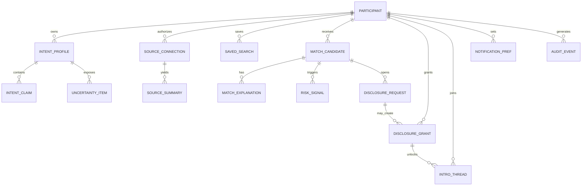

# Building a Better Background Networking System for Moral Trade

## Executive summary

Moral Trade has already built a notably cautious version of “background networking.” The live public product emphasizes **broad previews first, consent before detail, and no autonomous outreach**, and the current matching layer is explicitly **deterministic, preview-only, and human-reviewed** rather than a hidden ML recommender. Public pages, the technical spec, and the safety/privacy documentation all reinforce the same posture: public discovery happens through broad previews; exact wishes, contact details, and sensitive constraints are gated; and optional AI is currently restricted to **shadow mode** that cannot change live matches, rankings, disclosures, or state. citeturn3view4turn3view5turn18view6turn21view1turn20view0

That is already meaningfully aligned with Forethought’s design sketch in one important way: both systems treat **wish profiling**, a **semi-private wish registry**, and **notifications about promising connections** as the core primitives. But Moral Trade is much more defense-favored than Forethought’s full sketch. Forethought imagines attentive delegated helpers with access to social media, search profiles, chatbot history, and other sources, sometimes taking the first steps toward exploring connections; Moral Trade explicitly avoids raw private-feed ingestion, mass scraping, autonomous outreach, and end-to-end ML matching. That is not an accident. It is a deliberate product boundary motivated by the exact privacy/surveillance/collusion trade-off Forethought flags as the central difficulty of background networking. citeturn16view0turn3view2turn3view3turn15view0turn21view1

The strongest parts of the current implementation are not “growth” features but **governance features**: public technical contracts, explicit privacy classes, field-level disclosure grants, row-level access control expectations, app-level encryption for sensitive background-networking text, public rate-limit surfaces, public performance targets, and self-serve deletion/export controls. Those are unusually strong foundations for an early-stage networking product. citeturn5view0turn3view6turn9view1turn15view4turn17view3turn17view7turn12view1

The main weaknesses are also clear. There is very little public evidence of heavy real-world usage yet: the public snapshot shows **0 live proposals, 2 public profiles, and 0 completed agreements**, and the transparency report shows **0 disclosure grants created** in the current reporting period. Discovery is still sparse; passive data onboarding is mostly a permissions-and-manual-summary layer rather than true delegated intent distillation; there is no production private-set-intersection lane; and the site explicitly does **not** yet claim verified Core Web Vitals or API latency performance against its published targets. citeturn20view0turn15view5turn12view9turn3view6turn17view7

The right next step is therefore **not** to jump to autonomous matchmaking. The right next step is to **deepen the current consented, reviewable, explanation-rich architecture**: add better user-reviewed source connectors, structured intent distillation, targeted clarification questions, a more legible disclosure room, collective/public-good networking flows, and stronger operator-visible anti-abuse tooling. Keep ranking and outreach deterministic by default; keep ML in shadow/assist mode until it has model cards, datasheets, benchmark slices, fairness audits, and public operating evidence; and scale retrieval with standard indexed broad-preview search plus asynchronous evaluation rather than opaque relevance models. That approach fits both Forethought’s ambition and Moral Trade’s defense-favored constraints. citeturn16view0turn18view0turn21view1turn37search15turn31search12turn32search0turn32search2

## Scope, source priority, and assumptions

Per your requested priority order, I reviewed **Moral Trade first** and **Forethought second**. The additional sources cited here are: **Supabase Docs, PostgreSQL Documentation, RFC Editor, NIST, OWASP, W3C, arXiv, and the ACM Digital Library**. The report is grounded in public product pages, public contract/health pages, and official standards/research, with English-language sources favored throughout. citeturn20view0turn16view0turn31search0turn31search1turn31search2turn31search3turn32search0turn33search0turn34search0turn35search3

Two assumptions materially affect the audit. First, **I did not have authenticated dashboard access or repository access**, so the private dashboard UX and implementation details are inferred from public descriptions on the login, signup, privacy, methodology, safety, and technical-spec pages. Second, public JSON/contract routes establish what the product claims to enforce, but they do not substitute for direct code review, penetration testing, or high-volume operational telemetry. That means the audit is **high-confidence on public boundaries and declared contracts**, **medium-confidence on private UX details**, and **lower-confidence on real production scale behavior**. citeturn10view0turn24view0turn12view1turn21view1turn15view0turn22view6turn17view7

## Audit of the current implementation

The current background-networking feature is best understood as a **reviewed pilot**, not a scaled networking engine. The public site says the product is in “pilot stage,” with no custody or escrow, manual review before reliance, and “privacy-first matching,” while the background-networking page frames the feature as a “conservative matching layer” based on broad public previews, saved preferences, and manual source notes. The site’s strongest current value is reducing discovery/search cost **without** turning users into easy targets. citeturn20view0turn3view4turn29search7

| Area | Current public evidence | Assessment | Source |
|---|---|---|---|
| UX flow | Signup is intentionally minimal: display name, email, password, optional location hidden publicly by default, plus a first-step router into low-risk actions. Login copy says the dashboard is where users review offers, private alerts, delegate settings, saved searches, privacy grants, and source permissions. | Strong trust posture; low-pressure onboarding; likely lower activation into richer networking behaviors without better post-signup guidance. | citeturn24view0turn10view0 |
| UI and discovery | The wish registry exposes only broad previews, with keyword, cause-area, and “payment-open / pledge-open” filters; the people directory is opt-in and avoids social-feed dynamics. Public discovery is sparse but legible. | Safe and comprehensible, but thin. It reduces exposure risk at the cost of lower recall and weaker serendipity. | citeturn26view1turn25view0 |
| Matching logic | The background-networking page and the match-signal contract say suggestions are scored from declared cause areas, trade modes, constraints, location sensitivity, stated exclusions, and verification preferences. Match evaluation is preview-only, human-reviewed, and cannot authorize disclosure or state changes. | Appropriate for a pilot. Good precision/legibility bias; limited recall for nuanced, latent, or cross-domain complementarities. | citeturn3view5turn22view1 |
| Data model | Public contracts enumerate participants, public/private profiles, source connections, source notes, saved searches, privacy grants, match suggestions, notifications, evidence, appeals, disputes, and agreement events. | Mature-enough contract surface for a pilot. The model is richer than the public UI suggests. | citeturn5view0turn22view2turn22view3 |
| Privacy and consent | Exact wishes and contact details are gated; grants are field-level, purpose-bound, stage-bound, and expiry-aware; users can self-serve delete the background-networking layer; notification prefs exist by event type; analytics can be turned off separately. | This is the product’s clearest strength. It is unusually explicit about consent lifecycles and opt-out controls. | citeturn9view1turn12view1turn12view6turn12view9 |
| Security posture | Background-networking sensitive text uses app-level field encryption with versioned key IDs; Supabase auth cookies back sessions; admins require MFA; participants can review/revoke sessions; and rate limits are published. Public non-claims note incomplete key-rotation evidence and additional device/session controls required before scale. | Good pilot controls and commendable transparency, but not yet “sensitive scale” ready. | citeturn15view4turn17view0turn17view3turn9view2 |
| Notifications | Notifications are available via in-app, digest email, and web-push preferences; background-networking email copy is intentionally generic and omits exact wishes, source notes, and contact details. | Correct privacy stance. The likely current weakness is utility: generic notifications can become too vague unless the in-app landing surface is excellent. | citeturn12view0turn12view9turn22view3 |
| Performance and scalability | Public routes are server-rendered with recovery/fallback behavior; the API contract lists 39 routes and 56 schemas; performance targets are published, but the site explicitly says it does not yet claim verified Web Vitals or API latency readiness until current aggregate samples exist. | Architecturally disciplined, but not yet performance-proven. | citeturn17view2turn22view6turn17view7 |
| Code and architecture inference | Public evidence points to a centralized, server-rendered web app with Supabase-backed authentication/storage, server-side cookie refresh, explicit private-route no-store behavior, public contract/health endpoints, and route-family instrumentation. | A sensible centralized-first architecture for an early safety-heavy pilot. Portability is planned through export/import/schema endpoints, but true interoperability is not yet the center of gravity. | citeturn17view0turn6view4turn23view4 |

A few audit findings matter more than the scorecard. First, the product already includes a meaningful **passive/proactive split**: methodology says users can be passive, recording delegate rules and possible source connections, or proactive, stating explicit wishes/offers/constraints directly. Second, the “passive” lane is still narrow in practice: source connections currently record **consent scope, import mode, and manual summaries only**, and the site says it does **not** automatically ingest, scrape, or search raw external data. Third, public operating evidence remains limited, so recommendations should favor **safe, incremental enrichment of the current design**, not wholesale replacement. citeturn21view1turn12view9turn20view0turn15view5

## Where Moral Trade matches and diverges from Forethought

Forethought’s background-networking sketch imagines a “matchmaking marketplace” of attentive helpers operating in the background; passive users can authorize access to existing digital traces, proactive users can state wishes directly, a private wish profile is synthesized and updated, a semi-private wish registry supports discovery, and especially promising matches can trigger notifications or even first-step workflows. Forethought also makes the privacy/surveillance/collusion trade-off explicit and notes that both centralized and decentralized implementations are plausible. citeturn3view0turn3view2turn3view3turn16view0

| Forethought element | Current Moral Trade status | Interpretation |
|---|---|---|
| Passive delegation from existing data sources | Moral Trade allows source connections and possible links to blogs, email, calendar, chatbot history, and search profiles, but today stores consent scope, import mode, and manual summaries only; it does not ingest or search raw external data. citeturn16view0turn12view9 | **Partial match, major gap.** The conceptual lane exists, but the implementation is not yet the rich delegate system Forethought envisions. |
| Proactive explicit wishes | Users can create private wish profiles and broad wish previews directly. citeturn16view0turn24view0turn21view1 | **Strong match.** |
| Secure wish profiling | Forethought wants secure wish profiling; Moral Trade already treats private wish profiles as non-public by default, encrypts sensitive background-networking text, and uses staged grants. citeturn3view2turn15view4turn9view1 | **Strong conceptual match.** |
| Searchable semi-private wish registry | Moral Trade’s registry indexes broad previews only and withholds exact asks/contact details behind consent. citeturn3view2turn26view1turn21view1 | **Strong match.** |
| Notifications about promising matches | The site has notification preferences and generic background-networking notifications; match concierge/introduction request flows exist. citeturn3view0turn12view0turn3view8 | **Partial match.** Notifications exist, but the surrounding workflow is still light. |
| Automatic first steps toward exploration | Forethought explicitly entertains automated first steps; Moral Trade explicitly forbids autonomous outreach and keeps even assisted automation blocked beyond narrow tasks. citeturn3view0turn18view2turn3view4 | **Deliberate conflict.** This is a defense-favored boundary, not a missing feature. |
| AI-mediated synthesis/interviewing | Forethought sketches LLM synthesis and optional chatbot interviews. Moral Trade currently keeps synthesis deterministic, clarification question generation non-LLM, and ML decisioning off. citeturn3view2turn21view1turn18view0 | **Gap, but also deliberate caution.** |
| Privacy/collusion trade-off as first-class design problem | Both Forethought and Moral Trade foreground this exact trade-off. citeturn3view3turn15view0turn12view0 | **Strong match.** |
| Centralized now, decentralized/portable later | Forethought says centralized or decentralized could work; Moral Trade says “centralized first, portable later,” with export/import/schema routes. citeturn16view0turn23view4turn23view0 | **Good strategic match.** |

The key conclusion is that Moral Trade should **not** try to “catch up” to Forethought by discarding its current boundaries. The better reading is: Moral Trade already has the **right safety envelope**, but it only has an **early, narrow implementation** inside that envelope. The opportunity is to make the current system much more useful before making it much more autonomous. citeturn15view0turn21view1turn16view0

## Recommended target design

The target should be a **reviewed background-networking system** with four hard invariants carried over from today: **broad previews first, no surprise exposure, no autonomous outreach, and no hidden ML decisioning**. Within those invariants, the product should become much better at user-reviewed intent capture, explanation-rich matching, staged disclosure, and structured handoff into real conversations. That is the most faithful synthesis of Forethought’s design sketch and Moral Trade’s existing governance posture. citeturn3view4turn15view0turn18view0turn16view0

A better UX should make three things much more legible than they are now: **what the system thinks you want**, **why a counterpart is being suggested**, and **exactly what would be revealed if you say yes**. The current product already says the dashboard is the working surface for wish profiles, saved searches, source notes, exports, suggestions, grants, and data-right tools. The next design should concentrate those into a single “Background Networking” workspace. citeturn23view2turn12view0

```text
┌──────────────────────────────────────────────────────────────────────┐
│ Background Networking                                                │
│ Your mode: Passive + Proactive                                       │
│ Consent health: 3 active grants · 1 expiring soon                    │
├──────────────────────────────────────────────────────────────────────┤
│ What the system thinks you want                                      │
│ • Cause areas: Public health, biosecurity, institution-building      │
│ • Trade modes: pledge-based, public-good contribution                │
│ • Verification prefs: public artifacts preferred                     │
│ • Uncertainty: geographic scope, counterpart type                    │
│ [Review profile] [Answer 2 clarifying questions] [Export]            │
├──────────────────────────────────────────────────────────────────────┤
│ Sources                                                              │
│ Blog summary   Connected   90-day retention   4 approved fields      │
│ Chatbot notes  Shadow-only 30-day retention   2 approved fields      │
│ Email          Not connected                                       │
│ [Add source] [See consent receipts]                                  │
├──────────────────────────────────────────────────────────────────────┤
│ Suggested counterparties                                             │
│ Match A  High confidence                                             │
│ Why: cause overlap, pledge compatibility, verification compatibility │
│ Hidden until consent: exact ask, contact details                     │
│ [Review explanation] [Request detail] [Dismiss] [Report]             │
│                                                                      │
│ Match B  Medium confidence                                           │
│ Why: public-good complementarity, group fit                          │
│ [Review explanation] [Save for digest]                               │
└──────────────────────────────────────────────────────────────────────┘
```

```text
┌──────────────────────────────────────────────────────────────────────┐
│ Detail request                                                       │
├──────────────────────────────────────────────────────────────────────┤
│ You are about to request:                                             │
│ • exact ask summary                                                   │
│ • verification preferences                                            │
│                                                                      │
│ They will NOT see:                                                    │
│ • your contact details                                                │
│ • your exact private notes                                            │
│ • any unapproved source text                                          │
│                                                                      │
│ Purpose: Explore a possible pledge-based trade                        │
│ Expiry: 14 days                                                       │
│ [Send request] [Edit fields] [Cancel]                                 │
└──────────────────────────────────────────────────────────────────────┘
```

The consent model should become more explicit and more reusable. Moral Trade already has staged, field-level grants; I recommend making the user-facing stages visible in the interface itself.

| Consent stage | What can be shown | Typical action | Control rule |
|---|---|---|---|
| Preview | Cause areas, broad summary, coarse location, trade-mode openness | Search, save, dismiss | Public/broad-preview only |
| Candidate | Factor codes, confidence band, why-matched explanation | Review suggestion | No exact asks or identity expansion |
| Requested | The requesting party asks for specific additional fields | Request detail | Purpose-bound request, expiry set |
| Consented | Approved fields for both sides become visible | Compare fit | Field-level grant receipt required |
| Introduced | Contact lane or intro room opens | Start conversation | Step-up auth for high-risk fields |
| Active | Intro thread, negotiation notes, audit trail | Structured follow-through | Revocation still available |
| Revoked / expired | Access closes except redacted audit traces | Cleanup | No silent persistence |

Moral Trade should extend its current entity model rather than replace it. The existing public contract already includes private profiles, source connections, source notes, saved searches, privacy grants, match suggestions, notifications, and audits. The main missing layer is a more explicit **intent-distillation and disclosure-orchestration** model. citeturn5view0turn22view2turn22view3



| Proposed table | Purpose | Key fields | Privacy notes |
|---|---|---|---|
| `intent_profiles_v2` | Canonical current user intent state | `participant_id`, `cause_areas`, `trade_modes`, `verification_prefs`, `status` | Private by default; broad preview derived separately |
| `intent_claims` | Atomic claims distilled from user input or approved source summaries | `profile_id`, `claim_type`, `value`, `confidence`, `source_kind` | Never public directly |
| `uncertainty_items` | Missing/ambiguous fields that deserve clarification prompts | `profile_id`, `question_key`, `priority`, `resolved_at` | Private |
| `source_connections_v2` | Per-source permission records | `participant_id`, `source_kind`, `scope`, `allowed_fields`, `retention_days`, `shadow_allowed` | Private; auditable |
| `source_summaries_v2` | Redacted source-derived summaries only | `connection_id`, `summary_text_cipher`, `redaction_version`, `expires_at` | Encrypted |
| `match_candidates_v2` | Suggestion objects | `owner_id`, `counterparty_id`, `factor_codes`, `confidence_band`, `risk_tier`, `status` | Participant-scoped |
| `disclosure_requests` | Explicit detail requests before grants | `requester_id`, `target_id`, `field_list`, `purpose`, `expiry_at`, `decision` | Participant-scoped |
| `disclosure_grants_v2` | Reusable consent receipts | `owner_id`, `audience_id`, `field_list`, `purpose`, `stage`, `expires_at`, `revoked_at` | Participant-scoped, immutable receipts |
| `intro_threads` | Structured introduction room | `participant_a`, `participant_b`, `opened_by`, `opened_at`, `state` | Private/no-store |
| `collective_profiles` | Forethought-style collective onboarding | `owner_id`, `collective_type`, `membership_scope`, `public_preview` | Broad-preview derivative allowed |
| `risk_signals_v2` | Safety and abuse indicators | `match_id`, `signal_type`, `severity`, `review_state` | Operator/reviewer only |
| `consent_receipts` | User-readable history | `actor_id`, `event_type`, `fields_affected`, `created_at` | Exportable |

The backend flow should also remain legible. Retrieval and explanation should improve; disclosure and outreach should stay tightly bounded.


### Privacy, consent, and threat model

Forethought is right that the core systems problem is neither “share everything” nor “hide everything.” Forethought warns that broad availability of sensitive preference data enables surveillance, harassment, and exploitation, while total opacity can make harmful collusion harder to detect. NIST’s privacy-engineering framework is useful here: **predictability, manageability, and disassociability** are exactly the properties a defense-favored networking system should maximize. OWASP’s API guidance also matters directly: background networking is highly exposed to **broken object-level authorization** and **broken property-level authorization** if match, disclosure, or intro endpoints key off user-supplied IDs without consistent policy checks. citeturn3view3turn32search0turn32search13turn33search0turn33search5

| Threat | Why it matters here | Recommended mitigation |
|---|---|---|
| Preview scraping | Broad previews can become a targeting dataset | Query throttles, result caps, coarse-location buckets, abuse scoring, honey-profile monitoring, and delayed detailed faceting for low-trust users |
| Broken object-level authorization | Match/disclosure/introduction APIs naturally carry IDs | Keep RLS and application checks on **every** object path; add contract tests for owner, counterparty, reviewer, and operator roles |
| Broken property-level authorization | Partial field disclosure is the product’s core action | Centralize field-grant evaluation; never hand-build per-endpoint field filtering |
| Inference attacks from repeated requests | A user can probe what others may want without ever being introduced | Rate-limit detail requests per target; require stated purpose; suppress repeated near-identical requests |
| Prompt injection or exfiltration from imported sources | External summaries can carry adversarial instructions into AI assistance | Strip HTML/scripts, store only redacted summaries, and keep all ML summary/rerank paths read-only and sandboxed |
| Operator abuse / insider access | Human review is powerful in this design | Just-in-time access, reason-for-access logging, dual review for sensitive reveals, periodic audit sampling |
| Notification pressure / spam | Networking can degrade into harassment | Digest by default, quiet hours, easy unsubscribe, and no push-permission prompt until user has already found value |
| Collusive or harmful coordination | Total secrecy is also unsafe | Risk signals, report lanes, collective-level review for high-impact groups, and transparency metrics with small-cell suppression |
| Analytics re-identification | Search and disclosure workflows are privacy-sensitive | Keep counts/buckets/state labels only; never store raw wish text, exact queries, or notification message bodies |

One specific recommendation deserves emphasis: Moral Trade should **keep cryptographic overlap checks as a narrow, advanced lane**, not the default matching engine. The site already discusses blinded tags, VOPRF, HPKE, PSI, and PIR-PSI only as design exploration, and it explicitly says there is **no production PSI lane**. That is the right stance. If Moral Trade later adds sensitive-overlap checks, it should do so only for tightly scoped attributes and only after a documented DPIA, abuse review, and cryptographic review. HPKE and VOPRF are sensible primitives for such a lane, but they should remain an exception path, not the heart of discovery. citeturn3view6turn31search2turn31search3

### Performance and scalability

The public tech spec already publishes sensible targets: public-route error rate ≤1%, public API p95 latency ≤800 ms, LCP p75 ≤2500 ms, INP p75 ≤200 ms, and CLS p75 ≤0.1. The right scalability plan is to make those targets real using **structured search and indexing first**, not by introducing opaque ranking systems too early. PostgreSQL’s built-in text-search stack (`tsvector`, `tsquery`) and GIN indexes are well-suited to broad-preview search; Supabase’s own RLS guidance explicitly recommends indexing columns used in row-level policies because performance can otherwise degrade badly at scale. citeturn17view7turn37search3turn37search15turn31search12

Concretely, I would keep the primary registry on **broad preview text + structured tags + explicit facets**, backed by GIN indexes and precomputed matchability projections. Add an asynchronous job layer for match evaluation, explanation rendering, digest assembly, and source-summary refresh. Keep private routes `no-store`, as the current system already does. If the team later wants a semantic recall layer, that should begin as **shadow-only reranking** against already-eligible candidates, never as an end-to-end hidden prioritization layer. citeturn17view3turn18view2turn18view0turn37search1

### Example UI copy and sample APIs

The copy below is designed to respect Moral Trade’s current rule that background-networking notifications stay generic and that exact wishes remain inside the dashboard until consented disclosure. citeturn12view0turn12view9

**Source connection consent**

> Connect this source in shadow mode
> We will store only approved summaries and field categories, not raw source content.
> Allowed fields: cause areas, trade modes, verification preferences
> Retention: 90 days
> This source cannot trigger outreach, change rankings, or disclose details on its own.

**Detail request consent**

> Request more detail
> You are asking to see: exact ask summary, verification preferences
> They will not see your contact details or raw notes from this action.
> Purpose: Explore a possible pledge-based trade
> Expires in 14 days

**Digest notification**

> You have 2 new possible counterparties
> Their broad previews appear compatible with your public-health and public-good preferences.
> Exact asks and contact details are still hidden. Review in dashboard.

Current public APIs already use a `/api/moral-trade/...` family and already expose a preview-only `POST /api/moral-trade/match-signal/evaluate`; the proposed endpoints below extend that pattern rather than replacing it. citeturn22view1turn22view6

```http
POST /api/moral-trade/intent-profile/upsert
Content-Type: application/json
Authorization: Bearer <session>

{
  "causeAreas": ["public-health", "biosecurity"],
  "tradeModes": ["pledge", "public-good"],
  "verificationPreferences": ["public-artifact", "attestation"],
  "locationSensitivity": "remote-preferred",
  "statedExclusions": ["political-campaign-offset"],
  "privateNotes": "encrypted-client-or-server-side"
}
```

```http
POST /api/moral-trade/source-connections/authorize
Content-Type: application/json
Authorization: Bearer <session>

{
  "sourceKind": "chatbot-history",
  "mode": "shadow",
  "allowedFields": ["cause_areas", "trade_modes", "verification_preferences"],
  "retentionDays": 30,
  "consentNote": "Use only for reviewed background-networking summaries"
}
```

```http
POST /api/moral-trade/match-signal/evaluate-v2
Content-Type: application/json
Authorization: Bearer <session>

{
  "profileId": "prof_123",
  "candidateIds": ["cand_456", "cand_789"],
  "mode": "deterministic_with_shadow_rerank"
}
```

```json
{
  "ok": true,
  "results": [
    {
      "candidateId": "cand_456",
      "confidenceBand": "high",
      "factorCodes": [
        "cause_area_overlap",
        "trade_mode_compatible",
        "verification_preference_compatible"
      ],
      "explanation": "You are seeing this suggestion because broad cause areas and verification preferences are compatible. Exact wishes are still hidden.",
      "humanReviewRequired": true,
      "stateMutation": false
    }
  ]
}
```

```http
POST /api/moral-trade/disclosure-requests
Content-Type: application/json
Authorization: Bearer <session>

{
  "targetParticipantId": "usr_456",
  "requestedFields": ["exact_ask_summary", "verification_preferences"],
  "purpose": "explore_possible_pledge_trade",
  "expiryDays": 14
}
```

## Roadmap and rollout

The current public contracts already tell you what the rollout strategy should be: **shadow mode passes**, while **assist mode and guarded automation remain blocked**; there is **no production PSI lane**; and key rotation, device/session review, and verified performance attainment are still called out as gates or non-claims. So the roadmap should begin with instrumentation, permissioning, and explanation quality, not with ML-first automation. citeturn18view2turn18view0turn3view6turn15view4turn17view7

Assuming a small team with one product/design lead, one full-stack engineer, and fractional security/operator support, this is the implementation sequence I would choose.

| Priority | Task | Dependencies | Effort | Risk |
|---|---|---|---|---|
| Highest | Unify the dashboard into a single background-networking workspace with “What we think you want,” suggestions, grants, sources, and notifications in one place | None | Medium | Low |
| Highest | Add `intent_claims`, `uncertainty_items`, and user-facing clarification prompts | Existing private profile model | Medium | Low |
| Highest | Replace vague “request more detail” flows with structured disclosure requests and grant receipts | Current privacy grant model | Medium | Low |
| Highest | Index all RLS predicate columns and broad-preview search fields; add precomputed broad-preview search vectors | Current schema and RLS contract | Medium | Low |
| High | Add reviewed source connectors beyond manual notes, but only as summary-generating, field-bounded, retention-bounded inputs | Source connection permissions, encryption, audit logs | High | Medium |
| High | Add explanation-rich intro rooms and operator-visible concierge triage rather than simple request/decline states | Structured disclosure flow | Medium | Medium |
| High | Add collective/public-good networking primitives, including collective profiles and group-fit explanations | Intro rooms, collective profile schema | High | Medium |
| Medium | Add shadow-only semantic reranking over already-eligible candidates, with benchmark slices and parity audits | Model card, datasheet, fairness audit, public shadow metrics | High | High |
| Medium | Add a narrow sensitive-overlap lane using blinded tags / VOPRF / HPKE for a few vetted fields | DPIA, crypto review, abuse review | High | High |
| Medium | Add step-up auth for sensitive disclosures and destructive actions using passkey-compatible WebAuthn flows | Session architecture | Medium | Medium |

A practical milestone plan looks like this:

| Milestone | What ships | Outcome |
|---|---|---|
| Foundation hardening | Indexed broad-preview retrieval, better grant UX, consolidated dashboard, disclosure receipts, clearer notifications | Immediate usability and trust improvement |
| Intent distillation beta | Intent claims, uncertainty queue, reviewed source-summary connectors, profile diff history | Better recall without abandoning current privacy boundaries |
| Introduction room | Explanation-rich detail requests, structured intro threads, operator tooling, digest tuning | Higher conversion from preview to real conversation |
| Shadow intelligence | Shadow semantic recall, fairness/parity benchmarking, model card + datasheet publication | Better measurement without live decision delegation |
| Sensitive overlap and collectives | Narrow crypto-assisted checks for select fields, collective/public-good networking | Expands utility while preserving safety envelope |

If implementation capacity is tight, the most leveraged subset is: **consolidated workspace + explicit disclosure receipts + intent-claim model + indexed broad-preview search**. That combination would materially improve user value without materially increasing exposure risk.

## Open questions and confidence

The biggest unresolved questions are not philosophical; they are operational. The public site does not yet show enough live traffic or case volume to answer whether the current explanation model is strong enough, whether users will tolerate more structured consent steps, or whether passive source connectors will improve match quality enough to justify their privacy complexity. The public evidence also does not reveal the private dashboard’s detailed interaction design or the actual cost of current RLS policies under larger tables. citeturn20view0turn15view5turn17view7turn31search12

My confidence is **high** on the diagnosis that Moral Trade’s current implementation is a **cautious, governance-heavy, deterministic pilot**; **high** on the view that this is substantially aligned with Forethought’s sketch at the level of wish profiling, semi-private registry, notifications, and privacy-first design; **medium-to-high** on the specific product recommendations around disclosure UX, intent distillation, and indexed search; and **medium** on private-dashboard specifics because authenticated screens and source-connector internals were not directly accessible. The report should therefore be read as a **public-surface audit plus architecture recommendation**, not as a substitute for repo review, internal telemetry review, or adversarial security testing. citeturn21view1turn16view0turn17view2turn15view4
