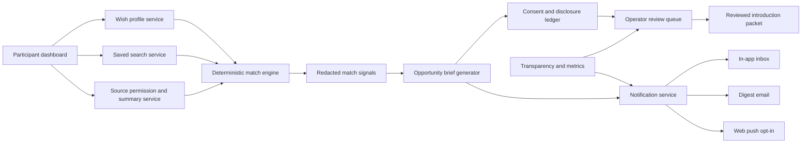
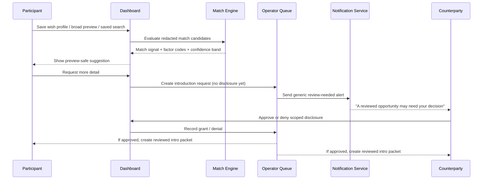

# Building a Stronger Background Networking Feature for Moral Trade

## Executive summary

As of May 31, 2026, Moral Trade already has a notably cautious and unusually well-documented background-networking prototype. Publicly documented elements include broad-preview search, a people directory, deterministic redacted matching, staged disclosure, field-level privacy grants, operator-reviewed concierge intake, privacy-safe telemetry, row-level-security requirements for private tables, app-level encryption for sensitive background-networking text, and public safety/transparency contracts. The current implementation is explicitly **non-AI in production decisioning**, **centralized-first**, **consent-gated**, and **anti-surprise-exposure**. In other words, Moral Trade is already closer to a “defense-favoured” posture than most networking products. citeturn6search1turn8view0turn13view0turn14view0turn15view0turn17view0

Where it currently falls short is not primarily on safety architecture, but on **useful backgrounded coordination throughput**. Forethought’s sketch imagines attentive helpers that work passively in the background, synthesize wishes from connected sources, notify principals when promising connections appear, and sometimes plug into further tools that take the first steps toward exploring the connection. Moral Trade has pieces of this shape — wish profiles, registry previews, match signals, notification preferences, operator queues, and even a private-overlap lane listed as design-only — but the live pilot remains intentionally underpowered: raw connector ingestion is disabled, AI summarization is shadow-only, private-overlap computation is design-only, and the public Q2 2026 transparency report shows **zero** reviewed match suggestions, opportunity briefs, intro packets, and disclosure grants for the period. The same report also exposes a reporting/schema inconsistency for `match_concierge_requests`, which is a concrete maturity gap. citeturn36view0turn36view1turn8view0turn24view0turn24view3turn24view4

The best path is therefore **not** to replace Moral Trade’s current model with a more aggressive one. It is to **keep the current privacy and review architecture**, then add a narrow set of high-value upgrades in sequence: better opportunity packaging, better user-facing notification controls, a real reviewed-introduction workflow, opt-in web push for generic alerts, source-connector summaries under explicit field permissions, and only later a tightly scoped cryptographic overlap lane for narrow sensitive matches. That path matches both Moral Trade’s current product philosophy and Forethought’s call for background networking that is powerful enough to find counterparties but careful enough not to become surveillance or collusion infrastructure. citeturn8view0turn13view0turn14view0turn15view0turn36view1

My confidence is **high** on the public-facing audit, privacy/safety posture, and protocol recommendations, because those are directly documented on Moral Trade and in official standards. My confidence is **medium** on hidden implementation details such as actual job runners, queue infrastructure, service-worker status, push provider choice, or the exact matching weights, because those are not publicly disclosed and are therefore treated here as unspecified. citeturn8view0turn13view0turn14view0turn17view0

## Current-state audit

Moral Trade publicly presents itself as “a privacy-first, non-AI background networking prototype” within a reviewed pilot. Public inventory currently shows **0 live proposals, 8 worked examples, 2 public profiles, and 0 completed agreements**, and the pilot status page says the strongest live use today is understanding the mechanism, cloning worked examples, joining a small cohort, and submitting proof artifacts rather than relying on a liquid exchange or automated matching. citeturn6search1turn2view0

The current background-networking workflow is clearly staged. Public users can inspect broad previews through the experimental wish registry and people directory; signed-in users can create wish profiles, save searches, add manual source notes, export their data, and review suggestions in the dashboard; a deterministic scan can create a redacted match signal; participants can request more detail, decline, or report a suggestion; and concierge-style introduction requests go to an operator queue before anyone receives exact wishes or contact details. The platform explicitly says that a suggestion is not an introduction, and that human review is mandatory before disclosure, contact, reliance, or state changes. citeturn8view0turn21view0turn21view1turn19view0

Technically, the public architecture looks like a centralized web application with server-rendered public routes, validator-backed JSON contracts, authenticated private routes, Supabase-backed auth/database storage, and a Next.js-style edge/header configuration. The technical spec says the current implementation is “centralized for simplicity, but portable later”; the privacy page names Supabase as the processor for authentication and database storage; and the safety page specifies headers set in `next.config.ts`, private no-store cache controls, Supabase auth cookies, app-level field encryption for background-networking sensitive text, MFA for admin review mutations, and rate limits across multiple read/write surfaces. citeturn15view0turn13view0turn14view0turn22view0turn22view2

The background-networking data model is unusually explicit for a pilot. Public docs say the signed-in dashboard exposes a data map and that background-networking private tables include wishes, source notes, saved searches, match suggestions, grants, concierge requests, notifications, helper runs, risk signals, and audit events. Private text such as wish bodies, exact profile notes, source notes, consent notes, and synthesis summaries require ciphertext slots and encryption-version columns. Public docs also show distinct storage classes for broad previews, private wishes/constraints, deterministic intent claims, disclosure grants, source summaries/permissions, and operational queues. citeturn8view0turn17view0turn19view3

The current matcher is deliberately limited. Moral Trade says matching is deterministic and uses declared cause areas, trade modes, constraints, coarse location sensitivity, verification preferences, privacy stage, and stated exclusions. It explicitly forbids inference over ideology, psychology, protected traits, or hidden preferences. Public match cards expose coarse factor codes, a confidence band, and redaction notices rather than raw wish text. This is materially different from Forethought’s fuller sketch, which anticipates richer delegated-source input and LLM-driven synthesis. citeturn8view0turn15view0turn19view0turn36view1

Data collection is also tightly bounded in the public design. The site distinguishes public profile data from private wish-profile data; excludes query strings, raw search text, raw source notes, receipts, private messages, and exact wishes from funnel analytics; supports in-app, digest email, and web-push preference rows by event type; and allows self-serve export, correction, deletion, and even deletion of the whole background-networking layer via the confirmation phrase “DELETE BACKGROUND NETWORKING.” Raw external-source ingestion is disabled; current “source connections” are limited to consent scope, import mode, and manual summaries. citeturn13view0turn11view0turn20search1

The strongest current privacy and safety controls are real product assets. Moral Trade already publishes broad-preview-first design, consent-before-detail disclosure, anti-enumeration budgets, sparse-result withholding, hashed query fingerprints, admin MFA, participant session revocation, private-route no-store headers, explicit non-claims around scale/security, and small-sample suppression in public transparency reporting. It is also candid that background networking creates a trade-off between surveillance risk and secrecy that could shelter collusion. citeturn8view0turn13view0turn14view0turn12view0

The main weaknesses are throughput, maturity, and governance completeness rather than conceptual design. Public Q2 2026 reporting shows zero reviewed match suggestions, zero opportunity briefs, zero intro packets, zero disclosure grants, and zero participant reports; median timing metrics are below the publication threshold; and the report states that live aggregate data is unavailable for `match_concierge_requests` because the table could not be found in the schema cache. Meanwhile, the team/governance page says there is not yet a named advisor or external reviewer roster. Those facts imply that the current feature is still more a carefully bounded prototype than an operational background-networking system. citeturn24view0turn24view3turn24view4turn12view1

A concise synthesis appears below.

| Dimension | Publicly visible current state | Audit judgment |
|---|---|---|
| Technical architecture | Centralized web app; server-rendered routes; Supabase-backed auth/storage; validator-backed contracts; deterministic matching; operator queue; explicit security headers and no-store private routes | Strong legibility; good for auditability; still early-stage and centralized-first |
| UX flow | Broad preview search → sign-in → wish profile / saved search / manual source notes → redacted suggestion → detail request / decline / report → operator-reviewed introduction | Safety-first flow is sound, but likely too little value reaches users in the background today |
| Data collected | Broad previews, private wishes/constraints/capabilities, deterministic intent claims, grants, source summaries/permissions, notifications, helper runs, audit rows; raw connector ingestion disabled | Good minimization posture; delegated passive data remains mostly unimplemented |
| Privacy/security | RLS contracts, app-level field encryption for sensitive background text, anti-enumeration budgets, consent stages, generic notifications, admin MFA, session revocation | Very strong relative to pilot stage |
| Scalability | Public scale gates exist; sensitive-admin and paid-action volume scale are blocked pending more evidence; performance targets published but not yet fully claimed as achieved | Reasonable safety gating; not yet proven at meaningful throughput |
| Failure modes | Deterministic/manual fallback; invalid copilot output cannot change state; provider timeouts remain pending/manual review; replay-safe transitions required | Good failure doctrine; some delivery/metrics/reporting layers still immature |
| Unspecified | Actual job runner, queue technology, service-worker implementation, push provider, precise weighting model, real production traffic, browser support profile, internal reviewer staffing | Must be treated as unspecified |

This table is synthesized from Moral Trade’s background-networking, privacy, safety, measurement, transparency, methodology, team/governance, people, wish-registry, pilot-status, and technical-spec pages. citeturn8view0turn13view0turn14view0turn11view0turn12view0turn15view0turn12view1turn21view0turn21view1turn2view0turn17view0

## Forethought-to-Moral Trade mapping

Forethought’s sketch for background networking has six core ideas: passive and proactive participation modes; delegated or connected source access; secure/interoperable wish profiling; a semi-private searchable wish registry; background notifications when strong leads appear; and filtered visibility that protects against surveillance while preserving enough transparency to reduce collusion risk. It also explicitly says a centralized or decentralized implementation could work, though decentralized approaches may be more portable, and recommends starting in niches or with existing matchmakers. citeturn36view0turn36view1

Moral Trade already covers part of this design space. It has proactive wish entry, a semi-private wish registry, broad-preview search, deterministic private profiling, explicit privacy stages, operator review, and transparency/safety scaffolding. It even names passive mode, source connections, opportunity briefs, introduction plans, and bounties as conceptual elements. However, it intentionally stops short of the more ambitious parts of Forethought’s sketch: live delegated-source ingestion, LLM-driven synthesis in production, continuous passive background assistance, broad notification usefulness, and systematized “first-step” tooling that meaningfully helps users act on promising matches. citeturn15view0turn8view0turn13view0

The right mapping is therefore **augmentation, not replacement**.

| Forethought design element | Current Moral Trade status | Recommended concrete change |
|---|---|---|
| Passive mode with delegated helper access | Conceptually present, but raw source ingestion is disabled and source connectors are default-off pending DPIA; only manual summaries are allowed now | Add **consent-scoped source summaries** first, not raw ingestion. Let users connect a source, preview an extracted broad summary, approve affected field classes, and set expiry. Keep live connector workers off until DPIA and deletion tests pass |
| Proactive mode with explicit wishes | Already implemented as wish profiles, saved searches, and manual notes | Keep as the main lane; improve onboarding so users can create a useful broad preview in under 3 minutes |
| Secure/interoperable wish profiling | Deterministic synthesis exists; export/import portability exists; centralized-first architecture is public | Add a **portable signed profile envelope** for broad-preview fields and factor-code explanations so future federation is possible without changing the core model |
| Searchable semi-private registry | Already implemented in broad-preview form | Improve ranking and explanation quality; add “why now” and “what next” on suggestion cards |
| Background notifications and first steps | Preference rows exist; methodology mentions notifications, reports, invite drafts, bounties, introduction plans; but live throughput is near zero | Add a real **opportunity brief** object plus generic notifications for “review needed,” “mutual consent reached,” and “new reviewed compatibility”; route everything through the dashboard |
| Filtering to balance privacy vs collusion | Already central to current design | Keep public transparency and small-sample suppression, but add stronger auditability for why suggestions were shown, blocked, or escalated |
| Niche-first adoption | Forethought recommends niche/community starting points; Moral Trade is already cohort-first | Lean harder into one or two target communities first, rather than making the registry look broad before it is dense |

This mapping is grounded in Forethought’s design sketch and feasibility notes, together with Moral Trade’s current methodology, background-networking, and privacy/safety contracts. citeturn36view0turn36view1turn8view0turn13view0turn14view0turn15view0

The single most important product change is to shift from “redacted suggestions exist” to “redacted suggestions create a useful next action.” Today, Moral Trade already generates the right *kind* of cautious match object. What it lacks is a polished middle layer between suggestion and full introduction: reviewed opportunity briefs, explicit response states, generic notifications, and a user-visible consent ledger that feels like an interaction system rather than a hidden compliance layer. That is the narrowest upgrade that most faithfully implements Forethought’s “helpers bustling in the background” without sacrificing Moral Trade’s defense-favoured stance. citeturn8view0turn15view0turn36view1

## Recommended architecture and protocol choices

The recommended architecture is an **event-driven, centralized-first system** built around five bounded objects: `WishProfile`, `MatchSignal`, `OpportunityBrief`, `DisclosureGrant`, and `NotificationPreference`. Matching remains deterministic and redacted by default. Background activity produces **briefs**, not autonomous contact. New sources are admitted only via explicit field permissions and retention windows. Notifications remain generic and route users back into the dashboard for any sensitive detail. This keeps the system aligned with current Moral Trade constraints while adding the useful backgrounded “helper” behavior that Forethought envisions. citeturn8view0turn13view0turn15view0turn19view0turn36view1



The diagram above is a synthesis of Moral Trade’s documented components — wish profiles, saved searches, source summaries, deterministic matching, grants, operator review, notifications, and transparency — with the minimal additional layer needed to make the feature genuinely “background.” citeturn8view0turn13view0turn15view0turn17view0

For live update delivery, the best initial choice is **SSE for signed-in dashboard updates** and **Web Push for background notifications**, not WebSockets or WebRTC. SSE is good for one-way server-to-page updates over HTTP while the dashboard is open; Web Push is the proper standard when the application is inactive and the browser/service worker needs to wake to deliver an alert; WebSockets are appropriate only once Moral Trade has real two-way collaborative spaces or operator consoles that need low-latency duplex interaction; and WebRTC is overkill for the current problem, because it is primarily browser-to-browser real-time media/data transport rather than a background networking primitive. citeturn31view1turn31view2turn31view3turn25search2turn34view0turn34view2

| Channel | Best use on Moral Trade | Strengths | Weaknesses | Recommendation |
|---|---|---|---|---|
| Polling | Fallback only | Simple; works everywhere | Wasteful; delayed; poor for “background” feel | Keep only as lowest-common-denominator fallback |
| SSE | Open dashboard event feed | Simple one-way server→client streaming over HTTP | Ends when document goes away; not for inactive app | **Yes**, for inbox, queue state, and match-card refresh |
| WebSocket | Live operator console or shared intro room | Full-duplex; lower latency than polling | More stateful infra; not needed for most user flows yet | **Later**, not first |
| Web Push | Dormant-browser notifications | Reaches users when app is inactive; designed for this purpose | Requires service worker, permission, VAPID, careful trust design | **Yes**, but opt-in and generic-only |
| WebRTC | Direct calls / high-trust post-introduction collaboration | Peer-to-peer media/data possibilities | Complexity, NAT traversal, poor fit for initial matching | **No**, except much later |

The comparison above draws on the EventSource/SSE standard, RFC 6455 for WebSockets, the WebRTC recommendation, and Push/Service Worker/Notification standards. citeturn31view1turn31view2turn31view3turn25search2turn31view4turn34view0turn34view1turn34view2

Topology-wise, Moral Trade should **remain centralized-first** for now. Forethought notes that centralized and decentralized implementations are both possible, with decentralized systems being more portable. Moral Trade itself already says the implementation is centralized for simplicity but includes export/import and schema endpoints for later portability. That is the right present choice, because the current product’s value depends heavily on review, safety gating, operator queues, and transparency reports — all much easier to enforce in a centralized topology than in a federated or peer-to-peer one. citeturn36view1turn15view0

| Topology | Fit for current Moral Trade | Why |
|---|---|---|
| Centralized registry + review queue | Best near-term fit | Easiest place to enforce consent, sparse-query protection, safety review, and transparency |
| Federated registry | Plausible long-term | Better portability; can align with signed profile export and maybe ActivityPub-style delivery |
| Pure P2P discovery | Poor near-term fit | Hard moderation, harder abuse control, harder auditability, and larger privacy leakage risks |

This topology judgment is supported by Forethought’s explicit centralized-vs-decentralized framing, Moral Trade’s “centralized first, portable later” stance, and reference models such as ActivityPub, libp2p discovery, and Kademlia. citeturn36view1turn15view0turn31view7turn33view0turn33view1turn31view8

A practical proposed data model is below.

```text
WishProfile
- id
- participantId
- visibilityStage            // hidden | broad-preview | consent | introduced
- causeAreas[]
- tradeModes[]
- verificationPreferences[]
- coarseLocationBucket
- exclusions[]
- safetyFlags[]
- sourceSummaryRefs[]
- updatedAt

MatchSignal
- id
- leftProfileId
- rightProfileId
- factorCodes[]
- blockers[]
- confidenceBand
- redactedFields[]
- humanReviewRequired
- createdAt

OpportunityBrief
- id
- matchSignalId
- audience                    // owner | owner+operator
- summary
- whyNow
- nextAction                  // review | request-detail | decline | report
- riskFlags[]
- status                      // suggested | reviewed | closed
- createdAt

DisclosureGrant
- id
- subjectProfileId
- requesterParticipantId
- audienceStage               // registry | consent | introduced
- accessLevel                 // broad | specific | contact
- allowedFields[]
- purpose
- expiresAt
- revokedAt

NotificationPreference
- id
- participantId
- channel                     // in_app | email_digest | web_push
- eventType
- enabled
- quietHours
- digestCadence

SourcePermission
- id
- participantId
- sourceType
- retentionDays
- allowedFieldKeys[]
- aiShadowAllowed
- consentNote
- lastApprovedSummaryHash
- revokedAt
```

This sketch extends Moral Trade’s already published taxonomy of private profiles, intent claims, grants, notifications, source permissions, and operational queues, rather than introducing a new conceptual model. citeturn8view0turn13view0turn17view0

A practical API sketch is similarly incremental.

| Endpoint | Status | Purpose |
|---|---|---|
| `POST /api/moral-trade/match-signal/evaluate` | Current documented route | Create redacted factor-code match preview with `stateMutation: false` |
| `POST /api/moral-trade/disclosure/evaluate` | Current documented route | Evaluate allowed/denied fields and expiry for stage-bound disclosure |
| `POST /api/saved-searches` | Current documented route | Save private search criteria |
| `GET /api/background/suggestions` | Proposed | Fetch reviewed redacted suggestions / opportunity briefs |
| `POST /api/background/detail-requests` | Proposed | Record “request more detail” intent without disclosure |
| `POST /api/background/opportunity-briefs/:id/resolve` | Proposed | Decline / pursue / report / snooze |
| `GET /api/background/stream` | Proposed | SSE feed for open-dashboard updates |
| `POST /api/background/webpush/subscribe` | Proposed | Register browser PushSubscription and preference linkage |
| `POST /api/background/intro-requests` | Proposed | Escalate a reviewed suggestion into operator-triaged introduction |
| `POST /api/background/source-summaries/preview` | Proposed | Compute connector/import preview without persisting until user approves |

The “current” rows above are directly documented in Moral Trade’s technical spec; the proposed rows are the minimal additions required to convert redacted matching into a usable background-networking workflow. citeturn19view2turn22view1turn22view0

For privacy-preserving overlap checks, do **not** start with full PSI. Moral Trade’s own docs list blinded tags, VOPRF, HPKE sealed fields, PSI, and PIR-PSI as future design options. That is directionally right, but the sensible sequence is: coarse redacted matching first, user-reviewed source summaries second, narrowly scoped cryptographic overlap checks third. HPKE is a strong standard for sealed-field sharing; VOPRFs are useful where clients need verifiable blind evaluation; and PSI helps learn intersections without revealing non-overlap, with newer work on updatable PSI making repeated overlap checks cheaper when sets change incrementally. But those are more appropriate for **high-value narrow overlap claims** than for the primary registry/search layer. citeturn8view0turn31view5turn31view6turn37view0turn37view1

CRDTs should also be treated as a **supporting** technology, not the core matcher. CRDTs are valuable when replicated state must converge without tight synchronization, and local-first software can improve privacy, offline work, and user control. That makes them appealing for **portable drafts, reviewed intro packets, and user-owned local notes**. They are much less useful as the first engine for discovery, consent enforcement, or operator-reviewed disclosure. citeturn26search5turn31view9

## Privacy, consent, safety, and threat model

Moral Trade’s current default settings are directionally correct and should be preserved: broad previews first, no exact wishes or contact details before mutual consent, no autonomous outreach, no raw connector ingestion, generic email copy, deletion/export controls, privacy-safe telemetry, and anti-enumeration budgets. The next version should preserve those defaults while making them more legible and easier to control. citeturn8view0turn13view0turn14view0turn11view0

The recommended default posture is:

- background matching **on** only for the user’s own profile and saved searches once they have completed onboarding;
- external-source summaries **off by default** until the user explicitly authorizes a source, affected field classes, and retention window;
- AI summarization **shadow-only** until documented precision, explanation lift, and unsafe-exposure regression checks are passed;
- web push **off by default** until the user has seen value in-dashboard and explicitly opts in through a user-initiated flow;
- notification bodies **generic-only** by default;
- detail disclosure **purpose-bound and expiring**;
- coarse location only, unless both parties explicitly progress to a later stage. citeturn8view0turn13view0turn14view0turn35view1turn34view3

Those defaults also align with how the web platform actually works. Push notifications require an active service worker and a PushSubscription; notification display requires user permission; permission requests should be triggered by user interaction in secure contexts; and browsers have added friction specifically because abusive push designs eroded trust. Since Moral Trade is dealing with sensitive counterpart discovery, it should be stricter than the median site, not looser. citeturn34view0turn34view1turn34view2turn34view3turn35view0turn35view1

The biggest privacy rule for notifications is simple: **never put sensitive matching content in the notification itself**. RFC 8291 gives confidentiality and integrity for Web Push payloads in transit, and VAPID identifies the application server to the push service, but system notifications still appear on operating-system surfaces outside the dashboard. Moral Trade’s current rule that email copy must stay generic should be extended to web push and in-app previews shown outside authenticated detail views. citeturn38search1turn38search0turn13view0turn34view1

A practical threat model appears below.

| Threat | Current documented control | Recommended improvement |
|---|---|---|
| Sparse-query deanonymization / registry enumeration | Query budgets, hashed fingerprints, sparse-result withholding, broad-preview-only search | Add adaptive throttling, honey-result monitoring, and reviewer flags for repeated edge-case probes |
| Unauthorized detail disclosure | Stage-bound grants, owner approval, redacted defaults, human review | Add signed disclosure receipts and one-click revocation everywhere the user can view granted fields |
| Connector overcollection | Raw ingestion disabled; source permissions and retention windows required | Add per-source deletion verification and automatic expiry reminders |
| Notification leakage | Generic email rule, dashboard-first detail access | Apply the same rule to web push and lock-screen-friendly notification templates |
| Admin compromise | MFA, secret-store rules, participant session review, rate limits | Add stronger device/session governance before expanding admin scope, as the site already flags |
| Manipulative or coercive proposals | Anti-threat baseline, blocked-proposal classes, safety review | Add automatic “cool-off” hold on reports involving doxxing/pressure or sudden large disclosure requests |
| Hidden ML discrimination / false matches | Deterministic matching only; no hidden ML state changes; fairness documentation required before ML | Keep all ranking deterministic until enough reviewed data exists to measure false-match rate and subgroup surfacing parity |
| Replay / duplicate state change | Idempotent and auditable state transitions required | Add idempotency keys on every detail request, grant mutation, and intro escalation |
| Schema/reporting drift | Public validator contracts and transparency report | Treat the current `match_concierge_requests` schema-cache miss as a release blocker for background-networking promotion |
| Collusion shielded by secrecy | Broad previews, operator review, transparency reporting | Add redacted “why blocked / why escalated” aggregate classes in transparency output |

This threat model is grounded in Moral Trade’s published safety, privacy, security, and transparency materials, together with the web-push standards and best-practice guidance. citeturn13view0turn14view0turn24view3turn34view0turn35view0turn38search0turn38search1

If Moral Trade later adds post-introduction messaging or shared coordination rooms, it should strongly consider end-to-end security using MLS rather than inventing a custom scheme. MLS is designed for asynchronous group keying with forward secrecy and post-compromise security. That is a later-stage recommendation, not a prerequisite for the next background-networking release. citeturn28search0turn28search1

## Roadmap, testing, and rollout

The roadmap below is intentionally conservative. It tries to maximize the amount of useful background coordination added **per unit of new risk**.

| Horizon | Highest-priority improvement | Directional effort | Main risks | Required technologies |
|---|---|---:|---|---|
| Short term | Fix reporting/schema drift; add opportunity briefs; add notification center and generic digest delivery; add SSE dashboard feed; improve factor-code explanation UX | 4–8 engineer-weeks | False confidence, notification annoyance, operational complexity | Existing API + queue + SSE/EventSource |
| Short term | Add explicit consent-ledger UI with expiry/revocation receipts and per-field grant views | 2–4 engineer-weeks | Permission fatigue, confusing disclosure semantics | Existing disclosure logic + better UX |
| Medium term | Add opt-in Web Push for generic “review needed / consent reached / new reviewed compatibility” alerts | 3–6 engineer-weeks | Poor permission timing, prompt fatigue, delivery inconsistency | Service worker, Push API, VAPID, RFC 8291 encryption |
| Medium term | Add connector-summary preview flow with explicit field permissions and retention expiry | 6–10 engineer-weeks | Overcollection, deletion failures, user misunderstanding | Source adapters, summary preview, retention jobs |
| Medium term | Add shadow AI summarization over approved summaries only, with reviewer comparison metrics | 6–12 engineer-weeks | Hallucinated summaries, unsafe exposure, automation overreach | Shadow pipeline, evaluator set, reviewer feedback loop |
| Long term | Add narrow private-overlap lane for high-value sensitive matching | 10–20 engineer-weeks | Crypto misuse, high complexity, weak abuse modeling | HPKE + VOPRF/PSI + formal design review |
| Long term | Add portable signed profile export and possibly federation experiments | 8–16 engineer-weeks | Moderation fragmentation, trust dilution | Signed envelopes, ActivityPub/DID-style portability, import validation |
| Long term | Add local-first drafts / intro packets | 8–14 engineer-weeks | Merge semantics, support burden | CRDT/local-first stack |

These are directional implementation estimates, not facts disclosed by Moral Trade. They are based on the published current architecture and the real platform requirements of SSE, Service Workers, Push API, Web Push, and cryptographic overlap tooling. citeturn22view0turn34view0turn34view2turn31view1turn31view5turn31view6turn37view1

The rollout plan should mirror Moral Trade’s own current doctrine of shadow mode, review-before-reliance, and public non-claims. Start with a **shadow/instrumentation stage** where opportunity briefs are computed but not shown to users; then move to an **internal or cohort-only reviewed stage**; then open an **opt-in pilot** with generic notifications only; only after that consider connector summaries or private-overlap experiments. This is consistent with Moral Trade’s current AI governance, performance readiness, and expansion-gate language. citeturn8view0turn15view0turn22view2turn23view1

Testing should focus less on growth and more on decision quality, privacy integrity, and user comprehension. The most important metrics are: suggestion-to-detail-request conversion; detail-request-to-mutual-consent conversion; false-match rate; operator overrule rate; privacy-incident count; explanation helpfulness; notification opt-in and opt-out rates; delivery failure rate; queue SLA attainment; and subgroup surfacing parity across whatever privacy-safe slices are published. Moral Trade has already published a measurement vocabulary that is close to this, including `detail_request_submitted`, `detail_request_resolved`, `match_consent_recorded`, `background_scan_run`, review quality measures, false-match measures, privacy leakage incidents, and parity checks. citeturn11view0

A/B testing is appropriate for **copy, explanation layout, digest cadence, and notification timing**, but not for silent changes to privacy defaults. In this domain, users should not be unknowingly placed into looser disclosure regimes. That recommendation follows both Moral Trade’s own product philosophy and general web notification trust guidance. citeturn13view0turn14view0turn35view0

Monitoring should include at least route error rate, API latency p95, queue latency, scan success/failure counts, push delivery failures, notification unsubscribe spikes, disclosure-evaluation errors, sparse-query risk signals, and any schema/contract mismatches in transparency or health endpoints. Moral Trade has already published most of this telemetry vocabulary and target framing; the next step is to connect it directly to a production promotion checklist. citeturn22view2turn23view1

## Developer implementation notes and UI copy

The key implementation principle is: **background does not mean autonomous**. The system should do background *detection*, *packaging*, and *generic alerting*; humans still control disclosure, contact, and reliance. That principle already exists in the public docs and should remain visible in code boundaries, queue design, and user copy. citeturn8view0turn14view0turn15view0



This sequence follows the already documented Moral Trade stages — deterministic matching, redacted previews, detail requests, grants, operator review, and generic notifications — while adding a clearer product object in the middle: the opportunity brief. citeturn8view0turn13view0turn19view0

A minimal implementation sketch for the new background-notification lane could look like this:

```ts
type MatchSignal = {
  id: string;
  profileId: string;
  counterpartyProfileId: string;
  factorCodes: string[];
  blockers: string[];
  confidenceBand: "low" | "medium" | "high";
  humanReviewRequired: true;
};

type OpportunityBrief = {
  id: string;
  matchSignalId: string;
  summary: string;          // redacted only
  whyNow: string;           // e.g. "shared cause overlap + compatible trade mode"
  nextAction: "review" | "request_detail" | "dismiss";
  riskFlags: string[];
  status: "suggested" | "reviewed" | "closed";
};

async function promoteMatchToBrief(signal: MatchSignal): Promise<OpportunityBrief | null> {
  if (signal.blockers.length > 0) return null;
  if (!signal.humanReviewRequired) return null; // should always be true in current model

  return {
    id: crypto.randomUUID(),
    matchSignalId: signal.id,
    summary: renderRedactedSummary(signal.factorCodes),
    whyNow: renderWhyNow(signal.factorCodes),
    nextAction: "review",
    riskFlags: deriveRiskFlags(signal.factorCodes),
    status: "suggested",
  };
}

async function maybeNotifyUser(userId: string, brief: OpportunityBrief) {
  const prefs = await loadNotificationPrefs(userId);

  if (!prefs.inApp) return; // in-app first
  await createInboxItem(userId, brief);

  if (prefs.webPush && userHasSeenValue(userId) && withinQuietHours(prefs) === false) {
    // never include exact wishes, names, contact details, or private asks
    await sendGenericPush(userId, {
      title: "New reviewed compatibility on Moral Trade",
      body: "Open the dashboard to review a broad-preview opportunity.",
      targetPath: "/dashboard/background-networking",
    });
  }
}
```

This pseudocode deliberately enforces three current Moral Trade rules: redaction first, human review before disclosure, and generic notification copy. citeturn8view0turn13view0turn19view0

Suggested UI copy should sound explicit, bounded, and non-coercive.

| Surface | Recommended copy |
|---|---|
| Background networking toggle | **Find broad matches in the background**. Moral Trade compares your broad preview, saved searches, and any source summaries you explicitly approve. It does **not** message people for you. |
| Source-connection consent | **Use this source for broad matching only**. We will create a private summary for the field categories you approve. Raw source content is not searched continuously and is not copied into analytics. |
| Web-push pre-prompt | **Get notified only when a reviewed opportunity needs your decision**. Notifications never include exact wishes, contact details, or private constraints. |
| Match card | **Why this appears**: broad cause overlap, compatible trade mode, and compatible verification preferences. Exact wishes are still hidden. |
| Detail request action | **Request more detail**. This creates a consent-gated request. It does not reveal your contact details or the other person’s exact wishes. |
| Decline action | **Not for me**. This closes the suggestion without public signaling or autonomous outreach. |
| Background activity indicator | **Background scan complete**. No private details were shared. Open the dashboard to review preview-safe results. |
| Grant UI | **Share only for this introduction**. Choose which fields can move from broad preview to specific detail, who can see them, and when access expires. |
| Deletion UI | **Delete background networking**. This removes wishes, previews, source summaries, searches, suggestions, notifications, and intro artifacts tied to background networking, while retaining only redacted safety and audit records when required. |

This microcopy is designed to align with Moral Trade’s documented rules around no autonomous outreach, consent-before-detail, generic notifications, and bounded disclosure, and with web-platform best practices that stress trust, user-initiated permission prompts, and assistive rather than disruptive notifications. citeturn8view0turn13view0turn14view0turn35view0turn34view3

## References and prioritized sources

The user-prioritized sites were consulted first, in the requested order.

**moraltrade.org pages consulted:** Home / landing page; Background networking; Pilot status; Methodology; Privacy; Safety; Moral Trade Technical Spec; Measurement Plan; Transparency Report; Team and Governance; People; Experimental wish registry. citeturn6search1turn8view0turn2view0turn15view0turn13view0turn14view0turn17view0turn11view0turn12view0turn12view1turn21view0turn21view1

**forethought.org pages consulted:** “Design sketches: defense-favoured coordination tech,” especially the “Background networking” design-sketch and feasibility sections. citeturn36view0turn36view1

**Additional primary and official sources used:** W3C Push API; RFC 8030 Web Push; RFC 8291 Web Push encryption; RFC 8292 VAPID; MDN Push API; MDN Notifications API; MDN Notification permission; MDN Service Worker API; WHATWG HTML EventSource/SSE; RFC 6455 WebSocket; W3C WebRTC; RFC 9180 HPKE; RFC 9497 VOPRF; Pinkas-Schneider-Zohner on scalable PSI; Badrinarayanan-Miao-Xie on updatable PSI; Shapiro et al. on CRDTs; Kleppmann et al. on local-first software; W3C ActivityPub; W3C DID Core; libp2p discovery/routing docs; Kademlia. citeturn25search2turn31view4turn38search1turn38search0turn34view0turn34view1turn34view3turn34view2turn31view1turn31view2turn31view3turn31view5turn31view6turn37view0turn37view1turn26search5turn31view9turn31view7turn33view2turn33view0turn33view1turn31view8

## Open questions and limitations

This report is based on a public audit of Moral Trade’s site, contracts, and standards references, not on private account access or a source-code checkout. The following details remain **unspecified** in public materials and should not be assumed: the actual background job runner and queue implementation; whether a service worker and live web-push delivery are already wired end-to-end or only represented in preference rows; the exact weighting formula for match scores; browser/device support details; internal reviewer staffing and escalation capacity; and the true production throughput of signed-in background-networking flows beyond what the transparency report discloses. citeturn8view0turn13view0turn14view0turn17view0turn24view3turn12view1

One public inconsistency is especially important: the transparency report says live aggregate data is unavailable for `match_concierge_requests` because the table could not be found in the schema cache. That should be treated as an operational/reporting defect to fix before Moral Trade claims a more mature background-networking release. citeturn24view3