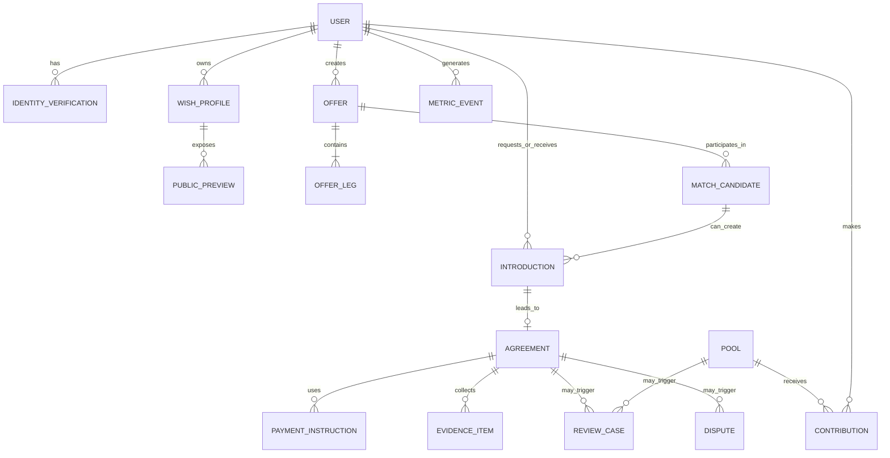
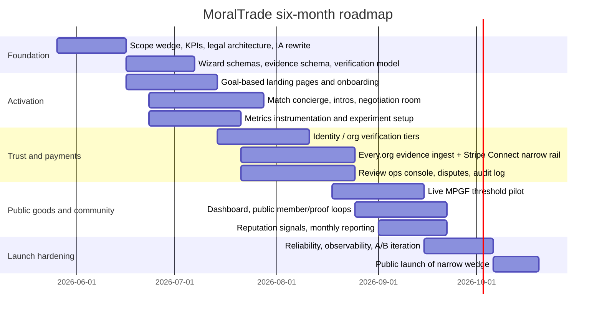

# MoralTrade Six-Month Improvement Report

## Executive summary

MoralTrade already has unusually strong conceptual foundations for an early-stage marketplace. Public pages are explicit that the site is a prototype, that worked examples are not liquidity, that matching is currently rule-based, that private wishes are consent-gated, and that the platform does not provide legal, tax, custody, or escrow services. That honesty is rare and valuable. But the same public pages also show the core commercial problem: the marketplace currently has **0 live offers**, **8 worked examples**, **2 public profiles**, and **$0 reviewed offsets**. In other words, the site is already legible, but not yet liquid. citeturn1view2turn10view0turn11view2

Toby Ord’s paper suggests two especially important design implications for a first real product. First, the biggest practical obstacle is **trust**, and specifically both **factual trust** and **counterfactual trust**. Second, Ord explicitly argues that a first effort should stay **simple** and focus on relatively constrained **one-to-one exchanges** before trying to become a fully general market with currency, prices, and broad listing liquidity. He also notes that shorter time horizons and counterparties of known moral character reduce the trust problem. citeturn7view3turn7view4turn32view0turn32view1turn33view0

Forethought’s later work pushes in the same direction while adding an important twist: beyond bilateral trades, there may be especially large gains from coordinating on **moral public goods**, but those gains are vulnerable to free-riding, concentration of power, executed threats, and decision procedures that seal off minority-valued goods. MoralTrade’s current MPGF prototype already gestures at this, but it is still a demo, manual-evidence-first system with no active integrated checkout. citeturn4view1turn5view4turn14view0turn15view0

The strongest six-month strategy is therefore **not** “make the site broader.” It is to make the site **narrower, safer, and more operational**. The right wedge is:

1. **Bounded bilateral pledge swaps and donation offsets** in a small number of high-legibility cause areas.
2. **A concierge-assisted private matching workflow** that turns wish profiles into real introductions.
3. **A verification ladder** that creates eBay-like “verified transaction” trust signals without overclaiming escrow or outcomes.
4. **A limited payment architecture** using Every.org for charity flows and Stripe Connect/manual capture only for a tightly constrained class of short-cycle paid offers.
5. **A real but narrow moral-public-goods pilot** using threshold commitments and reviewed evidence, not a generalized pooled-funds product. citeturn18view0turn18view1turn20view0turn20view2turn22view0turn37view0turn37view2turn37view3

My overall confidence is **high** on the scope/onboarding/trust recommendations, **moderate** on the payment/legal path, and **moderate** on longer-run market-design choices. The reason is simple: the public evidence clearly identifies the current adoption bottleneck and the relevant trust problems, but I do not have private usage data, private user interviews, or the actual codebase. citeturn1view2turn10view0turn7view3turn7view4

## Current-state diagnosis and platform benchmarks

I began with the sources you prioritized: **Forethought**, **Ord’s paper on amirrorclear.net**, **MoralTrade**, **eBay**, and **Giving What We Can**. Taken together, they imply that MoralTrade’s current problem is not lack of theory; it is lack of a **credible path from curiosity to first completed trade**. Forethought adds the case for public-goods coordination and warns about blockers such as threats, concentrated power, and majority rule sealing off minority values. Ord adds the strong advice to start with simple, bounded exchanges. The current site already reflects these ideas in its language, but not yet in a repeatable activation funnel. citeturn4view0turn4view1turn5view4turn32view0turn10view0turn10view1

The public product positioning is also a little too concept-first and route-first. Today the site’s information architecture emphasizes formats, methodology, safety, privacy, and pilot disclaimers. Those are important, but they currently outrank the concrete user job: “I disagree morally with other people; can I make one bounded, voluntary, verified trade that both sides regard as better than the default?” Ord’s formal framing revolves around Pareto-improving movement away from the status quo, not around taxonomy navigation. citeturn1view2turn10view0turn33view0turn33view2

The site’s strengths should be preserved. The separation of live offers from worked examples is correct. The refusal to invent testimonials and fake credibility is correct. The privacy model—broad previews first, specifics only after mutual consent—is correct for a product handling sensitive moral preferences. The problem is that these careful decisions now need to be turned into **flow, conversion, and operator systems**. citeturn1view2turn10view0turn10view1turn16search2

### Comparative benchmark table

| Platform | What it does especially well | Why it matters for MoralTrade | What to copy in six months | What not to copy now |
|---|---|---|---|---|
| **MoralTrade today** | Clear pilot status, explicit no-escrow/no-custody language, privacy-gated previews, structured offer concepts, manual evidence emphasis. citeturn1view2turn10view0turn10view1turn14view0 | This is the right philosophical and safety baseline. | Keep the honesty; convert it into an operational trust stack and simpler onboarding. | Do not broaden into more formats before first verified liquidity. |
| **eBay** | Automatic buyer protection on eligible purchases, verified-purchase feedback, seller protections tied to tracking and delivery evidence, domain-specific authentication programs. citeturn18view0turn18view1turn18view2turn18view4 | MoralTrade needs transaction-linked trust signals, not generic profile fluff. | “Verified donation,” “verified payout,” “reviewed completion,” evidence-linked reputation, and a narrow protection/dispute flow. | Do not launch open-ended star ratings before there are real transactions. |
| **Giving What We Can** | Public commitment, member list, trial-vs-lifetime pledge ladder, pledge dashboard, impact reporting, explicit norm-shifting mission. citeturn20view0turn20view1turn20view2turn1view7turn20view4 | MoralTrade also needs social proof and progress tracking, not just offer browsing. | Public member counters, trial commitments, private dashboard, progress logging, and community norm language. | Do not make “effective giving” recommendations broader than current curation capacity. |
| **Every.org** | Very low-friction giving rails, multiple donation methods, DAF/crypto handling, clear position as donation infrastructure. citeturn22view0turn22view1turn22view2 | MoralTrade should route charity payments through reliable rails instead of improvising. | Deep links, partner rails, receipt ingest, provider-linked verification. | Do not try to become a full donor portal in six months. |
| **Kickstarter** | Thresholded, all-or-nothing funding. citeturn31search0 | This is the right default for early public-goods commitments because it cuts “lonely donor” risk. | Use threshold commitments for MPGF cycles. | Do not build a broad consumer crowdfunding community yet. |
| **Kleros** | Evidence submission and structured dispute-resolution flows. citeturn31search4turn31search6 | MoralTrade needs disputes to be legible and documented, even if not fully decentralized. | Structured evidence packets and appeal routes. | Do not outsource core disputes to crypto arbitration in phase one. |

The big lesson from the benchmark is that MoralTrade should not try to imitate any single platform wholesale. It should be a **hybrid**: eBay’s evidence-linked trust, GWWC’s public-commitment and dashboard loop, Every.org’s payment rails, Kickstarter’s thresholding for public goods, and Kleros’s structured evidence handling—while retaining its own privacy-first, anti-coercion stance. citeturn18view0turn18view1turn20view0turn20view1turn22view0turn31search0turn31search4turn10view1

## Prioritized changes for maximum six-month impact

Assumption: the real objective for the next six months is **first real completed trades**, not maximal surface area. I therefore rank changes by expected impact on: activation, match quality, verified completion, and safety.

### Ranked change list

| Priority | Concrete change | Why this should move outcomes | Effort | Dependencies | Main risks | Success metrics | Confidence |
|---|---|---|---|---|---|---|---|
| **P0** | **Narrow the product to a launch wedge**: make the primary experience only (a) pledge swaps, (b) donation offsets, and (c) one MPGF cycle; keep generic paid action offers behind review or invitation-only. | Ord recommends constrained one-to-one exchanges first, and current public liquidity is effectively zero. A narrower wedge improves legibility, safety, and matching density. citeturn32view0turn32view1turn1view2 | 6–8 pw | None | Over-narrowing may suppress exploration | 20+ live offers in chosen wedge; >50% of new users choose a launch format; median time to first actionable match <7 days | High |
| **P0** | **Replace the homepage and IA with goal-based entry points**: “I want to make a pledge swap,” “I want to offset a donation disagreement,” “I want to fund a shared moral public good,” and “I want to find counterparties privately.” | Today’s IA is theory-forward; users need job-to-be-done entry points. GWWC’s pledge page is a strong example of reducing choice complexity while still explaining the mission. citeturn1view2turn20view0turn20view3 | 8–10 pw | Product wedge | Loss of nuance if oversimplified | Landing-to-onboarding CTR >25%; bounce rate on home/start pages down by 30%; onboarding completion up by 40% | High |
| **P0** | **Build a guided offer/wish wizard** with templates, guardrails, and suggested defaults: cause area, duration, evidence type, requested counterpart action, exit conditions, privacy level. | The current site already values explicit terms and deterministic clarification. The missing piece is a strong form flow that turns abstract interest into structured offers. citeturn10view0turn12search1 | 10–14 pw | Goal-based IA | Form abandonment if too long | 60% wizard completion for signed-in starters; 70% of submitted offers pass first safety review without edits | High |
| **P0** | **Launch match concierge + mutual introduction workflow**: private inbox, saved searches, operator-assisted suggestions, intro acceptance, and meeting scheduling. | The wish registry already says matches are consent-gated and ranked by overlap/openness, but public browsing alone will not solve the cold start. Counterfactual trust is easier when intros are personal and bounded. citeturn25search0turn7view4 | 10–12 pw + ops | Wizard, operator console | Manual ops burden | 50 introduction requests; >35% acceptance; 20 negotiation rooms created | High |
| **P0** | **Add a verification ladder**: identity-verified, organization-verified, payment-verified, completion-reviewed, repeat-counterparty. Make every badge transaction-linked. | eBay’s verified-purchase and protection systems work because trust signals are tied to real transactions and evidence. MoralTrade currently avoids fake proof; the next step is real proof. citeturn18view1turn18view2turn18view4turn1view2 | 12–16 pw | Payments, evidence schema, review queue | Users may perceive verification as intrusive | >70% of live offers from identity-verified users; >80% of completed actions carry payment or evidence verification; dispute rate <5% of verified completions | High |
| **P0** | **Implement a limited payment layer**: Every.org for charity routes, Stripe Connect for payouts/KYB, manual capture or payout delay only for short-cycle paid offers, and no general “escrow” claims. | The current site already uses Every.org and signals possible Stripe routing. Stripe explicitly says it does not support escrow, but it does support delayed payouts and authorization/capture. This is the right middle ground. citeturn9view4turn11view0turn37view2turn37view3 | 14–20 pw + counsel | Verification, legal review | Regulatory drift, user confusion about holds vs escrow | 95% payment-flow clarity in user testing; >90% successful receipt ingestion; zero pages describe non-escrow flows as escrow | Moderate |
| **P1** | **Turn MPGF from demo directory into one real thresholded pilot** with reviewed external contributions, named cycle, published threshold, and allocation rules. | Forethought’s argument for moral public goods is one of the strongest reasons this project exists at all, but public goods need coordination technology. A threshold cycle is much more operational than an open-ended reserve. citeturn4view1turn14view0turn25search3turn23search8 | 10–14 pw | Payment evidence, review, governance | Failing to hit threshold publicly | 1 live cycle; 3–5 institutional/collective backers; threshold hit or >70% threshold progress with transparent postmortem | Moderate-high |
| **P1** | **Add parity-band pricing and negotiation support** for bilateral trades rather than a full market-clearing engine. | Ord discusses side payments and prices, but also recommends simple early exchanges. A suggested range is enough to reduce negotiation paralysis without pretending there is a mature market price. citeturn33view1turn32view0turn32view2 | 8–10 pw | Wizard, offer schema | False precision | 50% reduction in abandoned negotiations after intro; median negotiation length <7 days | Moderate |
| **P1** | **Build a trust-and-safety operations stack**: risk scoring, queue triage, review SLAs, blocklists, appeal path, audit log, operator notes, and incident taxonomy. | Current safety language is good but mostly policy text. Patreon’s Trust & Safety practice shows the value of combining user reports, proactive review, and automation, while Forethought emphasizes threats and power concentration as blockers. citeturn10view1turn31search2turn31search7turn5view4 | 12–16 pw + ops | Verification, admin roles | High moderation cost | Median review SLA <24h for risky items; <1% severe safety incident rate; appeals resolved within 7 days | High |
| **P1** | **Launch dashboard/community loops**: public member list, trial commitment mode, giving/trade history, repeat counterparties, cohort prompts, and monthly “what happened this month” impact reporting. | GWWC’s public pledges, dashboard tracking, member list, and impact reporting are a proven norm-building loop that MoralTrade currently lacks. citeturn20view0turn20view1turn1view7turn20view4 | 10–12 pw | Verification, metrics | Empty dashboards if activity remains low | 30-day retained users >35%; 25% of active users log at least one action/evidence event monthly | Moderate-high |
| **P1** | **Harden the technical core**: row-level access control, durable workflows, search index, observability, experiment framework, and session debugging with privacy controls. | The product already contains privacy tiers, queues, and multi-step evidence flows. Those are exactly the use case for Postgres row security, durable workflow execution, tracing, experiment flags, and replay/error monitoring. citeturn29search3turn29search18turn29search12turn29search17turn29search0turn30search10turn30search15 | 14–18 pw | Product schemas stabilized | Engineering distraction from core UX | 99.9% successful workflow completion on core flows; <1% orphaned payment/evidence states; all launches behind flags | High |

The core prioritization principle is simple: in six months, MoralTrade should optimize for **one real, reviewable, repeatable trust loop**. The wrong goal is “many features.” The right goal is “a user can define a bounded trade, find a plausible counterparty, set terms, produce evidence, and end with a verified record.” That is the shortest line from Ord’s theory to a functioning market institution. citeturn32view0turn7view3turn7view4

## Product architecture, wireframes, and core algorithms

### Recommended user flow

The shortest high-trust flow is: intention, structure, screening, match, introduction, agreement, evidence, completion.

```mermaid
flowchart LR
    A[Landing page<br/>Choose a route] --> B[Guided wizard<br/>Define your action]
    B --> C[Define requested counterpart action<br/>duration, evidence, exit]
    C --> D[Safety and legal screen<br/>privacy level, risk tier]
    D --> E[Private match results<br/>ranked counterparties]
    E --> F[Request introduction<br/>or concierge assist]
    F --> G[Negotiation room<br/>terms + parity band]
    G --> H[Agreement record<br/>payment rail + milestones]
    H --> I[Evidence upload / provider webhook]
    I --> J[Review decision<br/>complete, disputed, or unresolved]
    J --> K[Verified completion badge<br/>history + dashboard]
```



This flow is intentionally much closer to eBay’s evidence-linked transaction mechanics and GWWC’s commitment dashboard loop than to a generic social network. It also respects the current site’s staged disclosure model and Ord’s emphasis on bounded, trust-manageable exchanges. citeturn18view1turn20view0turn16search2turn7view4

### Homepage wireframe mockup

```text
+----------------------------------------------------------------------------------+
| Hero: Make one bounded moral trade                                               |
| [Find counterparties privately] [Create a pledge swap] [Fund a shared public good] |
|----------------------------------------------------------------------------------|
| How it works: 1) State terms  2) Get matched  3) Verify evidence                 |
|----------------------------------------------------------------------------------|
| Choose your route:                                                               |
|  - Pledge swaps        - Donation offsets        - Moral public goods            |
|----------------------------------------------------------------------------------|
| Trust panel:                                                                      |
|  Identity verified | Organization verified | Payment verified | Reviewed complete |
|----------------------------------------------------------------------------------|
| Worked examples (clearly labeled)      Live market snapshot (real counts only)   |
|----------------------------------------------------------------------------------|
| Community proof: members | verified completions | active offers | funded cycles  |
|----------------------------------------------------------------------------------|
| Safety + legality: voluntary only, no coercion, no custody/escrow claim          |
+----------------------------------------------------------------------------------+
```

The strategic UI choice here is to move theory into support copy and help panels, while making the main page a **transaction launcher**. Current public pages do the reverse. citeturn1view2turn12search1

### Suggested core data model

| Entity | Key fields | Purpose |
|---|---|---|
| **User** | id, account_type, jurisdiction, role, trust_level, status | Human, collective, or institution actor |
| **IdentityVerification** | user_id, person_verified, org_verified, provider, last_checked_at | KYC/KYB and badge basis |
| **WishProfile** | user_id, private_summary, cause_tags, action_preferences, constraints, openness_flags | Private preference/intention store |
| **PublicPreview** | wish_profile_id, headline, broad_summary, tags, geography_coarse, preview_visibility | Searchable consent-safe preview |
| **Offer** | id, format, creator_id, status, visibility, risk_tier, created_at | Top-level listing or nonpublic offer |
| **OfferLeg** | offer_id, party_role, action_spec, duration_days, evidence_type, reserve_value, threshold_value | Explicit reciprocal terms |
| **MatchCandidate** | offer_a_id, offer_b_id, score, reasons_json, privacy_compatible | Ranked candidate pair |
| **Introduction** | id, requester_id, recipient_id, match_id, status, consent_scope | Mutual contact gate |
| **Agreement** | id, offer_pair_id, negotiated_terms_json, start_at, end_at, state | Binding record on platform, not necessarily legal contract |
| **PaymentInstruction** | agreement_id, rail, amount, currency, provider_ref, capture_mode, payout_delay_mode | Donation or payout routing metadata |
| **EvidenceItem** | agreement_id, uploader_id, type, provider, hash, url, issued_at, review_status | Receipts, photos, attestations, webhooks |
| **ReviewCase** | target_type, target_id, queue, status, assignee, SLA_due_at, notes | Manual ops and moderation |
| **Dispute** | agreement_id, opened_by, reason, state, proposed_resolution, appeal_state | Complaint and resolution record |
| **Pool** | id, good_type, threshold_amount, cycle_id, allocation_policy, recipient_info | MPGF cycle/pool |
| **Contribution** | pool_id, user_id, pledged_amount, external_paid_amount, evidence_status | Public-goods contribution record |
| **MetricEvent** | actor_id, event_name, properties, occurred_at | Product analytics and funnel measurement |

### ER diagram



### Suggested API surface

| Endpoint | Method | What it should do |
|---|---|---|
| `/v1/me/profile` | GET/PATCH | Account identity, preferences, coarse jurisdiction |
| `/v1/wish-profiles` | POST | Create/update private wish profile |
| `/v1/public-previews` | POST/PATCH | Publish or edit searchable preview |
| `/v1/offers` | POST/GET | Create or list offers by format/category |
| `/v1/offers/{id}` | GET/PATCH | Retrieve/edit offer and legs |
| `/v1/matches/search` | POST | Deterministic candidate generation |
| `/v1/introductions` | POST | Request mutual introduction |
| `/v1/introductions/{id}/respond` | POST | Accept/decline with disclosure scope |
| `/v1/agreements` | POST | Materialize negotiated terms |
| `/v1/payments/intents` | POST | Create Every.org route or Stripe payment instruction |
| `/v1/evidence` | POST | Upload receipt/evidence packet |
| `/v1/reviews` | POST/GET | Operator queues and resolution notes |
| `/v1/disputes` | POST/PATCH | Open/resolve/appeal dispute |
| `/v1/pools` | POST/GET | Create or browse public-goods pools/cycles |
| `/v1/contributions` | POST | Log threshold pledge or reviewed payment |
| `/v1/metrics/funnel` | GET | Internal analytics and operator dashboard |

### Matching algorithm

MoralTrade should stay **deterministic first**. The current methodology explicitly avoids AI-first inference and uses explicit fields, captured excerpts, manual notes, and structured constraints. That is the right choice until the platform has enough transaction data to justify learning-to-rank. citeturn10view0

A practical six-month algorithm should use:

**Stage A: hard filters**
- Format compatibility
- Jurisdiction/payment compatibility
- Duration bounds
- Evidence-method compatibility
- Privacy/consent compatibility
- Safety exclusions
- Counterfactuality self-attestation requirement for bilateral trades

**Stage B: weighted ranking**

\[
Score =
0.24 \cdot CauseFit +
0.18 \cdot ReciprocalLegFit +
0.14 \cdot EvidenceFit +
0.12 \cdot DurationFit +
0.10 \cdot TrustTier +
0.08 \cdot CounterfactualConfidence +
0.08 \cdot PublicGoodOverlap +
0.06 \cdot ResponseLikelihood -
0.12 \cdot RiskPenalty -
0.08 \cdot PrivacyMismatch
\]

This is defensible because Ord’s main practical issue is trust, the current registry already ranks by overlap/openness, and Forethought highlights public-goods overlap as an especially important area for coordination. citeturn7view4turn25search0turn4view1

### Pricing and negotiation algorithm

Do **not** try to launch a full market-clearing price engine in six months. Ord explicitly imagines later equivalents of prices and even currency, but he also says the first effort should likely keep things simple and focus on one-to-one exchanges. citeturn32view0turn32view2

The right early system is a **parity-band helper**:

\[
SuggestedBand =
\frac{RequesterImportance \times DurationMultiplier \times EvidenceMultiplier}
{CounterpartyCostProxy \times FrictionMultiplier}
\]

Where:
- `RequesterImportance` is a structured self-report on a constrained scale.
- `DurationMultiplier` rewards short, bounded commitments over open-ended ones.
- `EvidenceMultiplier` raises confidence for provider-verifiable actions.
- `CounterpartyCostProxy` uses inconvenience category + time burden + cash burden.
- `FrictionMultiplier` penalizes novel, hard-to-verify, or high-dispute formats.

The product should display **“likely fair range”**, not “market price.” That is enough to reduce negotiation paralysis without overclaiming market maturity.

### Verification algorithm

The badge logic should copy the spirit of eBay’s “verified purchase” and evidence-linked protection, not generic platform testimonials. citeturn18view0turn18view1turn18view2

Suggested evidence score:

\[
EvidenceScore =
0.30 \cdot ProviderDirectness +
0.20 \cdot IdentityBinding +
0.20 \cdot Completeness +
0.15 \cdot Freshness +
0.15 \cdot ReviewerConfidence
\]

Badge thresholds:
- **Payment verified**: provider-linked receipt or webhook from Every.org/Stripe
- **Completion reviewed**: evidence packet passes manual review
- **Organization verified**: KYB / documentation review complete
- **Repeat counterparty**: at least 2 reviewed completions with no unresolved disputes
- **Trusted steward**: graduated internal trust level after activity and operator approval

### Public-goods mechanism

For MPGF, the best six-month mechanism is a **thresholded assurance cycle**, not an open donation pool and not full quadratic funding. The rationale is: Forethought stresses underfunding from free-riding and the value of coordination on consensus goods; Kickstarter shows the power of all-or-nothing thresholds; assurance-contract theory provides a direct public-goods mechanism; and the current MPGF is already pledge/evidence/review oriented. citeturn4view1turn31search0turn23search8turn14view0turn15view0

Recommended rule:
- Commitments are logged first.
- Charges or counted external contributions happen only when threshold conditions are met.
- Reviewed evidence determines final inclusion.
- Allocation policy is published before the cycle opens.
- One pilot cycle only in the first six months.

### Technical stack recommendation

The current public site already implies the need for privacy gates, operator queues, export/import, payment metadata, and durable multi-step workflows. A good six-month stack is therefore:

| Layer | Recommendation | Why |
|---|---|---|
| Frontend | Keep or move to a typed React/Next.js-style app with server-rendered public pages and authenticated app flows | Fast public pages + rich signed-in flows fit the product shape; similar patterns are used in modern full-stack web apps. citeturn29search11 |
| Core DB | PostgreSQL with row-level security | Row security is the cleanest fit for per-user/per-introduction disclosure control. citeturn29search3turn29search18 |
| Auth/storage | Supabase or equivalent managed Postgres/auth/object storage | Good fit for RLS-heavy apps and rapid iteration. citeturn29search18 |
| Workflows | Temporal or equivalent durable workflow engine | Evidence/review/payment/introduction flows are exactly the sort of stateful processes durable execution is built for. citeturn29search12turn29search17 |
| Search | Typesense hybrid lexical/vector search for previews and offers | Useful for broad previews, semantic tag matching, and recommendation support later. citeturn29search9turn29search19 |
| Payments | Every.org deep links + Stripe Connect, manual capture, delayed payouts | Matches the platform’s current rails and avoids false escrow claims. citeturn9view4turn37view0turn37view2turn37view3 |
| Product analytics | PostHog feature flags + experiments | Safe rollout and rapid testing matter in a thin marketplace. citeturn29search0turn29search5turn29search20 |
| Observability | OpenTelemetry + Sentry | Distributed tracing, error monitoring, and privacy-controlled session replay fit the workflow-heavy product. citeturn29search1turn29search6turn30search0turn30search1turn30search10turn30search15 |

## Implementation roadmap, team, and budget

### Six-month roadmap



### Milestones

| Window | Milestone | What must exist by the end |
|---|---|---|
| **First month** | Product wedge locked | Goal-based homepage, five to ten user interviews, schema freeze for offers/evidence, legal memo on rails, instrumented funnel |
| **By month three** | Activation loop live | Wizard, private previews, match concierge, intro requests, review queues, first verified users/orgs |
| **By month six** | First real market loop | Narrow live offers, payment/evidence rails, verification badges, one MPGF cycle, public dashboard of real activity |

### Team roles

| Role | Lean scenario | Medium scenario | High scenario |
|---|---:|---:|---:|
| Product lead / founder | 24 pw | 24 pw | 24 pw |
| Product designer | 10 pw | 18 pw | 24 pw |
| Full-stack engineer | 24 pw | 48 pw | 72 pw |
| Additional full-stack engineer | — | 36 pw | 48 pw |
| Trust & safety / ops lead | 8 pw | 20 pw | 24 pw |
| Community / partnerships lead | 6 pw | 16 pw | 24 pw |
| Data / analytics engineer | 4 pw | 10 pw | 16 pw |
| Fractional legal counsel | 4 pw | 8 pw | 12 pw |
| QA / release support | — | 8 pw | 16 pw |
| **Total** | **80 pw** | **188 pw** | **260 pw** |

### Budget scenarios

These are planning ranges, not vendor quotes.

| Scenario | Typical team shape | Six-month budget range | When it makes sense |
|---|---|---:|---|
| **Low** | Founder-led + 1 engineer + part-time design/legal/ops | **$180k–$300k** | Best if primary goal is proving first verified trades, not broad launch |
| **Medium** | 2 engineers + dedicated design + trust/ops + fractional counsel/data | **$400k–$750k** | Best balance for actually shipping the wedge and an MPGF pilot |
| **High** | 3–4 engineers + strong ops/community/legal bench | **$900k–$1.6M** | Only justified if aiming for multi-jurisdiction launch and meaningful live volume within six months |

My recommendation is the **medium** scenario. The low scenario can still build the product, but a marketplace with sensitive norms and evidence review becomes ops-bound quickly. The high scenario is probably premature until the narrow wedge demonstrates real demand.

## Legal, compliance, trust, and governance

This section is operational guidance, not legal advice.

### Legal and compliance checklist

| Area | What the evidence says | Six-month recommendation |
|---|---|---|
| **Escrow and custody claims** | Stripe states that escrow has a precise legal definition and that Stripe does **not** provide escrow services or escrow accounts, though it does support delayed payouts and auth/capture patterns. citeturn37view2turn37view3 | Do not use “escrow” language unless you actually implement a compliant escrow structure with counsel-approved terms. |
| **Money transmission risk** | FinCEN rulings show that facts matter. A platform that accepts and transmits funds as a payments platform can be a money transmitter; a properly structured escrow service for a defined transaction can be analyzed differently. citeturn36view0turn36view1 | In phase one, keep most flows external or use regulated provider rails. Avoid becoming the holder/transmitter of general user funds. |
| **KYC/KYB for payouts** | Stripe Connect requires country-, capability-, entity-, and risk-dependent verification, and Stripe recommends Connect Onboarding to manage evolving KYC obligations. citeturn37view0turn37view1 | Anyone receiving payouts should be onboarded through Connect Onboarding; do not home-grow KYC unless there is a strong reason. |
| **Sanctions screening** | OFAC administers sanctions and provides the SDN and consolidated sanctions lists as downloadable/searchable resources. citeturn36view2turn36view3 | Sanctions screening must be in the payout and counterpart-approval path, with documented screening and re-screening. |
| **Online giving disclosures** | The FTC says portals must clearly disclose who receives the money, whether fees are retained, when charities receive funds, what happens if funds cannot be delivered, and whether donor information is shared. Disclosures must be obvious, not buried. citeturn35view0 | Every donation route and MPGF page should show fund flow, timing, fees, screening limits, and data sharing above the fold. |
| **Privacy and sensitive data** | The current site handles highly sensitive moral-preference and contact data. ICO guidance emphasizes privacy by design/default, and California’s official CCPA materials emphasize rights to know, delete, correct, opt out, and equal treatment. citeturn16search2turn27search2turn27search17turn27search1 | Treat wish profiles as high-sensitivity data; default to minimization, fine-grained disclosure, export/delete flows, and least-privilege admin access. |
| **Participant responsibility and prohibited uses** | Current Terms and Safety already prohibit coercive, violent, exploitative, fraudulent, and harassing proposals, and the FAQ explicitly excludes political campaign contribution offsets. citeturn10view1turn10view3turn11view3 | Preserve and operationalize these rules with enforcement taxonomy, not just text. |
| **Charity claims and recommendation risk** | FTC guidance warns portals not to imply endorsement or evaluation that they do not in fact perform, and current MoralTrade explicitly prefers explicit gaps to misleading pseudo-recommendations. citeturn35view0turn9view4 | Keep curation narrow and transparent; distinguish “verified route” from “we recommend this above all alternatives.” |
| **Jurisdictional rollout** | Current public product text does not specify a stable global compliance architecture, while Stripe verification varies by country and laws vary for payments and charitable solicitation. citeturn37view0turn35view0 | Launch US-first or a very short country list; publish support geography and restrict unsupported jurisdictions. |
| **Tax and reporting** | Current site correctly says it does not provide tax advice. citeturn10view3turn11view3 | Preserve that stance; any payout route should be reviewed for platform/provider reporting obligations before launch. |

### Governance model options

| Model | Description | Pros | Cons | Recommendation |
|---|---|---|---|---|
| **Founder-led governance with advisory review** | Small central team decides policy, reviews risky offers, and hears appeals; external advisors review hard cases monthly. | Fastest, clearest accountability, best for six-month pilot. | Concentrates power; may feel opaque if not documented. | **Best initial model** |
| **Staff moderation + community stewards** | Graduated trust levels for experienced users; stewards can flag, suggest edits, and mentor but not make final legal/payment decisions. Discourse’s trust-level approach is a useful template. citeturn28search2turn28search22 | Scales community support and norms. | Needs enough good users to be worth it. | Add lightly by month four |
| **External jury/arbitration layer** | Structured external adjudication for selected disputes, inspired by evidence-centric systems such as Kleros. citeturn31search4turn31search6 | Neutrality for some disputes. | Too heavy and legally messy for phase one. | Defer |

The right six-month governance stack is therefore: **founder-led moderation, explicit policy book, public monthly transparency note, documented appeal path, and a small external advisory review panel**. That balances speed and legitimacy. It is also consistent with Forethought’s concern about coercion, threats, and power concentration: centralized power is acceptable in a pilot only if it is constrained by policy, logging, and appeal. citeturn5view4turn10view1

### Governance rules worth making explicit

A practical policy book should include:
- No threat-based trades.
- No offers involving open-ended behavior change with weak verification.
- No paid routes for illegal, medical, regulatory, or campaign-finance-sensitive conduct.
- No hidden platform fees in public-goods or donation routes.
- No visible “proof” badges without transaction-linked evidence.
- No disclosure of exact wishes or contact details without mutual consent, except for tightly scoped trust-and-safety review. citeturn10view1turn16search2turn35view0

## Metrics, experiments, and next-step plan

### KPI framework

| Domain | KPI | Why it matters |
|---|---|---|
| **Activation** | Visitor → signup, signup → wizard completion, wizard → published preview/offer | Current constraint is activation into structured supply |
| **Liquidity** | Matchable-offer rate, median time to first intro, intro acceptance rate, negotiation-to-agreement conversion | Measures whether the market is becoming usable |
| **Trust** | Share of identity-verified users, payment-verified completions, completion-reviewed completions | Trust signals should be earned, not decorative |
| **Safety** | Review queue volumes, median SLA, dispute rate, severe incident count, appeal overturn rate | Needed because coercion/manipulation is central risk |
| **Public goods** | Threshold progress, number of contributors, reviewed contribution share, cycle completion rate | Tests whether MPGF has real coordinating power |
| **Community** | 30/90-day retention, dashboard logging rate, repeat counterparty rate, referral rate | Norm-building matters as much as individual transactions |
| **Reliability** | Orphaned workflow rate, failed webhook rate, uncaptured-payment expiries, error rate | Multi-step transactional product quality |

### A/B tests worth running

| Test | Hypothesis | Primary KPI | Guardrail |
|---|---|---|---|
| **Start page**: goal-based vs format-based | Goal-based entry increases serious onboarding starts | Start-to-wizard CTR | No increase in safety review failures |
| **Wizard length**: one-page vs multi-step | Multi-step reduces abandonment for sensitive flows | Wizard completion | Time-to-completion |
| **Trust display**: badges near CTA vs lower on page | Early evidence-linked trust signals increase intro requests | Intro request rate | No increase in mistaken “guarantee” beliefs |
| **Concierge prompt**: visible vs hidden | Early concierge offer increases first-match success in thin markets | Intro acceptance rate | Ops load per active user |
| **MPGF threshold framing**: “threshold to launch” vs “ongoing reserve” | Threshold framing increases contribution willingness | Contribution conversion | No increase in confusion about fund flow |
| **Public social proof**: member counts + verified completions vs member counts alone | Transaction-linked norm proof improves commitment rates | Signup → offer/public-preview conversion | No increase in vanity behavior |

### Monitoring and analytics plan

Use **PostHog** for funnels, experiments, and feature flags; **OpenTelemetry** for cross-service tracing; and **Sentry** for error monitoring and privacy-controlled replay/debugging. This combination is well aligned with the product’s workflow-heavy architecture and the need for safe rollout in a delicate marketplace. citeturn29search0turn29search5turn29search6turn30search0turn30search1turn30search10

Operationally, I would require:
- A weekly marketplace review on activation, intros, completions, and disputes.
- A weekly trust-and-safety review on blocked offers, queue aging, and appeals.
- A monthly public transparency update reporting real counts only.
- A release policy where all risky features are behind flags before general launch. citeturn29search0turn30search10

### Recommended next steps for the first month, quarter, and half-year

| Window | Highest-priority actions |
|---|---|
| **First 30 days** | Freeze the launch wedge; rewrite IA and homepage; define the canonical offer/evidence schema; instrument the funnel; run 8–12 user interviews with likely counterparties; obtain a short payments/compliance memo on Every.org + Stripe Connect + jurisdiction scope. |
| **First 90 days** | Ship the guided wizard, private public-preview flow, match concierge, intro request system, basic verification tiers, review console, and first provider-linked evidence ingestion. Start a private pilot with hand-selected users and institutions. |
| **First 180 days** | Go live with narrow offers, completion badges, dashboard/community loops, and one threshold-based MPGF cycle. Publish a transparent launch report with real numbers, unresolved issues, and a decision about whether to broaden or stay narrow. |

### Open questions and limitations

Some important unknowns remain. I do not have access to MoralTrade’s private traffic, internal conversion metrics, codebase, or customer research. I also do not know the entity structure, jurisdictions of operation, or planned regulator/payment-partner posture. Those unknowns matter most for the exact payment architecture and legal sequencing. The report therefore has the highest confidence on **product strategy, onboarding, verification, safety ops, and wedge selection**, and lower confidence on whether a broader in-platform payment system is worth it inside six months. citeturn1view2turn10view0turn37view0turn36view0

The single most important conclusion is still clear: **MoralTrade should spend the next six months becoming a narrow, high-trust transaction machine for a small class of moral trades—not a broad conceptual marketplace.** That is the path most faithful to Ord’s proposal, most compatible with Forethought’s public-goods insights, and most likely to turn the current prototype into a site people actually use. citeturn32view0turn7view4turn4view1turn1view2