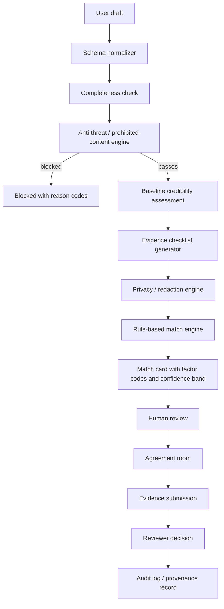
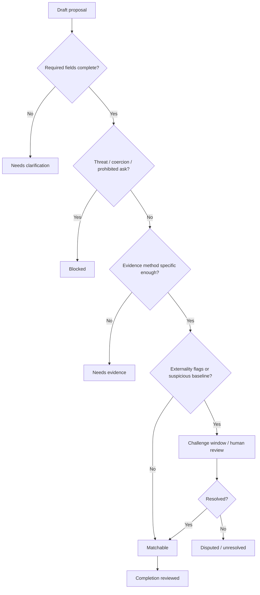

# Improving the Moral Trade Feature at MoralTrade.org

## Executive summary

The two priority sites reviewed were **amirrorclear.net** and **moraltrade.org**. The most relevant asset on **amirrorclear.net** for this task was Toby Ord’s paper *Moral Trade*, which defines moral trade as cooperation among people with differing moral views when each side makes a concession that matters less to itself than to the other side. Ord’s paper is especially important because it frames the core design constraints that Moral Trade is already trying to operationalize: Pareto improvement relative to a default baseline, the distinction between factual trust and counterfactual trust, and the need to avoid perverse incentives and threat-like bargaining. MoralTrade.org explicitly cites Ord’s paper as a reference point, and its current product language mirrors those concerns through baseline statements, anti-threat rules, review states, and party-relative rather than platform-relative scoring. citeturn1view3turn20view0turn21view0turn20view1turn20view2turn7view0turn2view0turn4view2turn3view1turn11view1

The strongest conclusion from the audit is that **Moral Trade’s conceptual model is more mature than its user-facing execution**. The site already has unusually explicit boundaries: it says it is not an escrow, custody, legal, tax, investment, or objective moral-ranking service; it keeps worked examples separate from live proposals; it rejects threats and coercive baselines; it uses deterministic synthesis and rule-based matching rather than opaque AI inference; and it relies on evidence review before reliance. During this review, the homepage exposed **0 live offers, 8 worked examples, and 2 public profiles**, which means the current experience is closer to a structured research pilot than a functioning liquid marketplace. citeturn6view3turn5view0turn4view1turn7view1turn10view0

The best path for improvement is **not** to add hidden, autonomous moral ranking or end-to-end LLM matching. That would cut directly against both the site’s own current commitments and the relevant literature on trustworthy AI, fairness trade-offs, and human-AI interaction. Instead, Codex GPT 5.5 xHigh reasoning should be used as a **schema-bound drafting, critique, and verification copilot** that helps participants produce higher-quality structured records, better explanations, and better evidence packages, while leaving matching, status changes, and safety decisions governed by explicit rule engines, human review, and auditable provenance. This recommendation is consistent with the site’s current deterministic/rule-based posture, with NIST’s trustworthiness framework, with fairness research showing unavoidable trade-offs between metrics, and with HCI research emphasizing transparency, staged disclosure, and reversible interaction. citeturn7view1turn10view1turn5view0turn37view2turn37view3turn37view4turn25search2turn25search7turn32view10

My highest-priority recommendations are these. First, **formalize the core moral-trade data model and public validator suite** the way the site has already done for the MPGF subsystem, which publicly exposes a canonical build instruction and validators for state-machine coverage, schema coverage, RBAC, rate limits, retention policy, and safe fallbacks. Second, **replace text-heavy pages with instrumented workflow cards** that expose “why this draft passed/failed” using structured factor codes. Third, **introduce provenance-first evidence objects** using W3C PROV-style entities/activities/agents and, where external supply-chain-style traceability matters, GS1/EPCIS-style event records. Fourth, if ML is later introduced, **use it only behind documentation, fairness audits, model cards, datasheets, and explanation layers**, never as an unreviewed decision-maker. citeturn13view1turn14view0turn10view1turn32view6turn24search1turn32view11turn26search5turn27search0turn27search5

## Prioritized site review

The two user-prioritized sites were:

| Site | What mattered most in this review | Key finding |
|---|---|---|
| **amirrorclear.net** | Toby Ord’s hosted PDF, *Moral Trade* | This is the primary conceptual foundation. It argues that moral trade should improve each party relative to a default baseline, and highlights trust and perverse incentives as central design obstacles. citeturn1view3turn21view0turn20view1turn20view2 |
| **https://moraltrade.org** | Current feature set, policies, flows, and technical notes | The public product is a pilot for evidence-reviewed moral trade, private matching, and moral public-good coordination, with deterministic synthesis, rule-based matching, and strong anti-threat/privacy language. citeturn2view1turn7view1turn10view0turn15view1 |

The **amirrorclear.net** homepage exposed little parsed content during review, but its hosted paper was decisive. Ord’s framework says that moral trade works when parties can move to outcomes better than the no-trade default for each side; that bargaining matters because multiple Pareto-superior outcomes may exist; that factual trust and counterfactual trust are distinct problems; and that perverse incentives are a real risk if actors are rewarded for worsening behavior before striking a deal. Those points map almost one-to-one onto Moral Trade’s current language about baseline statements, challenge windows, evidence review, and anti-threat rules. citeturn1view4turn21view0turn20view1turn20view2turn2view0turn3view0turn4view2

MoralTrade.org currently describes itself as a pilot for “reviewable moral trades,” including **pledge swaps**, **donation offsets**, **private matching**, and a **Public Goods Fund**. The public materials repeatedly emphasize explicit baselines, evidence rules, manual review, consent-gated disclosure, and the absence of hidden automation. The methodology page states that the current synthesis layer is deterministic, that clarification questions are driven by missing fields rather than an LLM interviewer, and that match suggestions are rule-based rather than AI-inferred. That is a strong starting philosophy for a high-stakes moral-decision tool. citeturn2view1turn7view1turn10view0

At the same time, the user experience is still highly pilot-like. The homepage prominently showed **0 live offers**, **8 worked examples**, and **2 public profiles** during review. Many routes begin with a “Loading Moral Trade” state, which may be a deliberate client-side workflow affordance but also makes the site feel provisional. One public “Reasoning Center” link returned an internal error during this review. These are not existential problems, but they do signal that the main bottleneck is now **productization, public legibility, and operational auditability**, not the site’s philosophical foundation. citeturn6view3turn2view0turn9view1turn2view5

## Technical audit

### Current feature posture

The current feature is best understood as a **manual-review institution with a marketplace shell**, not as an automated matching engine. Public pages define review states, reviewer scope, appeal handling, and trust metrics; they separate worked examples from live offers; and they distinguish action evidence from baseline confidence and externality review. That is a better starting architecture for a morally sensitive system than a typical engagement-optimized marketplace. citeturn3view0turn3view1turn3view2turn5view0

### Audit by dimension

| Dimension | What is publicly observable | Assessment |
|---|---|---|
| **UX** | The site clearly explains boundaries, labels examples, routes new users into low-risk actions, and uses consent-gated disclosure for private matching. Search starts with broad categories; worked examples show structured terms, evidence method, duration, baseline confidence, and externality review. citeturn6view3turn2view0turn11view1turn12view3 | **Strong concept framing; weak operational crispness.** Good trust language, but the experience remains text-heavy and cognitively demanding for first-time users. |
| **UX gaps** | Repeated loading states appear across public routes, public liquidity is near-zero, and the Reasoning Center errored during review. citeturn2view0turn2view1turn9view1turn2view5 | **Needs simplification and recovery UX.** The product should expose step-by-step pass/fail reasons, less repeated boilerplate, and better route resilience. |
| **Data model** | Offers include cause area, action, requested counterpart, expected impact, verification method, duration, payment cadence if relevant, exit conditions, and baseline statement. The system also has wish profiles, source notes, saved searches, privacy grants, evidence records, disputes, payment updates, and profile visibility controls. citeturn4view3turn4view6turn10view1turn10view4 | **Substantively rich.** The conceptual schema is already better than many early-stage marketplaces. It should now be turned into public contracts and machine-checked validators. |
| **Decision logic** | Current synthesis is deterministic; matching is rule-based using cause areas, trade modes, constraints, location sensitivity, and verification preferences. Offer scores are participant-stated and expressly “not a platform moral ranking.” Anti-threat rules reject “pay me or I will do X” patterns and require a no-trade baseline. citeturn7view1turn10view1turn11view1turn4view2 | **Well aligned with the domain.** Keep core decision logic explicit and constrained. Do not replace it with opaque model scoring. |
| **APIs and integrations** | Privacy/methodology pages state that the app uses Supabase for auth/database, may use Stripe for payment objects, uses Every.org for donation routes, may use an external email provider, and exposes export/import/schema endpoints so data can move later. The MPGF subsystem publicly exposes a technical spec, route map, schema coverage, RBAC, rate limits, retention validation, and safe fallback validation. citeturn15view1turn7view1turn4view8turn13view1turn14view0 | **Core moral-trade API surface: unspecified. MPGF API/governance posture: comparatively mature.** The main opportunity is to bring MPGF-style validator transparency to the core moral-trade feature. |
| **Privacy** | Public/private separation is explicit; exact wishes, constraints, and verification preferences are private by default; field-level grants and staged disclosure are used; the current prototype stores only consent scope, import mode, and manual summaries for external sources; and the product explicitly rejects private-feed mining or autonomous outreach. citeturn15view1turn10view0turn4view6 | **Directionally excellent.** Privacy is a first-class product concept, not an afterthought. |
| **Security** | Supabase auth cookies are used; admin access is intended to be limited to safety, abuse, payment, and delivery operations; MPGF public validators indicate RBAC, rate limits, and retention policy checks. Encryption-at-rest details, CSP/HSTS, 2FA, device/session controls, key management, and platform-wide abuse throttling are **unspecified** in public materials reviewed. citeturn15view1turn14view0 | **Mixed.** There is meaningful public thinking about access control and operational boundaries, but too many important controls are publicly unspecified. |
| **Performance** | Public routes often show loading interstitials before content, and the directory is paged for larger scale. Concrete Web Vitals, caching strategy, query latency, and bundle strategy are **unspecified**. citeturn2view0turn2view1turn10view2 | **Observed friction; metrics unspecified.** Instrument before optimizing. |

### What the data model probably is

Based on the public flows, the core domain entities already exist in rough form: **Participant**, **Public Profile**, **Private Wish Profile**, **Offer**, **Trade Format**, **Baseline Statement**, **Evidence Claim**, **Artifact**, **Reviewer Decision**, **Challenge**, **Appeal**, **Privacy Grant**, **Match Suggestion**, **Notification**, **Payment Record**, and **Agreement Event**. The MPGF subsystem adds **Pool**, **Cycle**, **Ballot**, **Contribution**, **Ledger Transaction**, and **Validator** objects. This is enough structure to support a high-quality schema-contract layer now, rather than later. citeturn4view3turn10view1turn15view0turn13view1

### Design judgment

The site’s strongest product principle is that it already **separates factual proof, counterfactual baseline confidence, and third-party externality review**. That is exactly the separation the domain needs. The main technical problem is that these ideas are scattered across many explanatory pages instead of being turned into one coherent, inspectable workflow with structured outputs and public validator checks. In other words: the product needs **more protocol and less prose**. citeturn5view0turn12view1turn3view0turn4view2

## Instructions for Codex GPT 5.5 xHigh reasoning

### Recommended operating role

Codex GPT 5.5 xHigh reasoning should be assigned a **narrow, auditable role**: help users and reviewers produce better structured records, detect missing fields, generate explanations from explicit factors, propose evidence checklists, and draft reviewer summaries. It should **not** decide whether a proposal is morally correct, set platform-wide moral rankings, or autonomously reveal or contact counterparties. That is both more consistent with the current site and more consistent with trustworthy-AI guidance. citeturn5view0turn10view0turn7view1turn37view2turn37view3turn37view4

### Chain-of-thought control

Use Codex in a mode where it reasons privately but only emits **structured decision summaries**, **cited evidence tables**, **uncertainty flags**, and **required-next-step checklists**. The public output should never expose free-form hidden reasoning or simulate certainty where the record is incomplete. This is especially important because the site’s own trust model depends on legibility, review scope, and narrow certification claims rather than broad moral endorsement. citeturn3view0turn3view1turn5view0turn25search1

A reliable output contract for Codex is:

```json
{
  "status": "draft|needs_clarification|needs_human_review|blocked|matchable",
  "completeness": {
    "missing_required_fields": [],
    "underspecified_fields": [],
    "policy_conflicts": []
  },
  "trade_structure": {
    "format": "",
    "offered_action": "",
    "requested_action": "",
    "duration": "",
    "exit_conditions": "",
    "verification_method": ""
  },
  "trust_assessment": {
    "factual_trust": {"rating": "low|medium|high", "reasons": []},
    "counterfactual_baseline": {"rating": "low|medium|high", "reasons": []},
    "externality_review": {"required": true, "flags": []}
  },
  "match_explanation": {
    "factor_codes": [],
    "confidence_band": "low|medium|high",
    "redactions_applied": []
  },
  "review_instructions": {
    "artifacts_to_request": [],
    "review_scope": [],
    "appeal_triggers": []
  },
  "citations": []
}
```

### Prompt templates

A good **system prompt** for Codex is:

```text
You are the Moral Trade protocol copilot.

Your job is to improve clarity, safety, reviewability, and privacy.
You must preserve these rules:
- No objective platform ranking of moral value.
- No autonomous outreach.
- No disclosure of private wishes or contact details unless the input explicitly authorizes it.
- Separate factual proof, counterfactual baseline confidence, and third-party externality review.
- If evidence is insufficient, say so and request the exact missing artifacts.
- If a proposal resembles a threat, coercion, doxxing, harassment, fraud, illegality, or newly escalated harmful behavior, return BLOCKED with the exact policy reason.
- Use participant-relative language, not platform-relative moral judgments.
- Do not invent facts, counterparties, prior behavior, or evidence.
- Output only the approved JSON schema and a short reviewer-facing summary.
```

A good **draft-repair prompt** is:

```text
Given the proposal draft and policy rules, do all of the following:

1. Normalize the proposal into schema fields.
2. Detect missing or underspecified required fields.
3. Generate at most 5 clarification questions, each tied to one missing field.
4. Score only:
   - factual trust evidencing,
   - counterfactual baseline credibility,
   - externality review need.
5. Return BLOCKED if anti-threat or prohibited-content patterns are present.
6. Produce a reviewer checklist listing only observable claims and checkable artifacts.
7. Do not output chain-of-thought.
```

A good **matching prompt** is:

```text
Given two redacted profiles, determine whether they are potentially matchable.

Use only:
- cause-area overlap or complementarity,
- compatible trade modes,
- compatible verification preferences,
- location sensitivity,
- privacy constraints,
- stated exclusions.

Do not infer protected traits, ideology, psychology, or hidden preferences.
Do not rank moral worth.
Return:
- matchable/not_matchable,
- factor codes,
- confidence band,
- fields that must stay redacted,
- whether human review is mandatory.
```

A good **reviewer-summary prompt** is:

```text
Summarize this proposal for a reviewer in 180 words max.

Sections:
- What is being offered
- What is being requested
- Baseline claim
- What evidence would count
- Main policy flags
- What remains unverified

Never imply escrow, legal enforceability, tax treatment, or objective moral endorsement.
```

### Required data inputs

Codex should be given only a **strict input bundle**, not broad application context. The minimum bundle should include the structured draft, policy registry, prohibited-pattern registry, factor-code dictionary, verification-method taxonomy, redaction policy, and any already-submitted evidence metadata. If the product later introduces ML components, add model cards, datasheets, and benchmark slices to the bundle. This is directly supported by the literature on documentation, explainability, and trustworthy AI. citeturn32view11turn33view0turn32view10turn37view3turn37view4

### Verification steps

Codex should run a fixed verification loop before any draft becomes “matchable”:

1. **Schema completeness check**  
2. **Anti-threat / prohibited-content check**  
3. **Baseline credibility check**  
4. **Evidence sufficiency check**  
5. **Externality-review trigger check**  
6. **Privacy/redaction check**  
7. **Match explanation generation**  
8. **Human-review routing**

This mirrors both the site’s current review posture and OECD-style due-diligence logic, which emphasizes embedding policy, identifying impacts, preventing/mitigating harms, tracking results, communicating, and remediating where needed. citeturn3view0turn3view1turn4view2turn36view0

### Constraints and safety guardrails

Codex should be hard-constrained to the following:

| Constraint | Why it is necessary |
|---|---|
| **Never rank moral value globally** | The site explicitly rejects objective platform rankings and labels importance scores as participant-stated only. citeturn5view0turn11view1turn6view3 |
| **Never autonomously contact counterparties** | The site explicitly rejects autonomous outreach and surprise exposure. citeturn4view1turn10view0 |
| **Never consume raw private feeds** | The site says it does not automatically ingest, scrape, or search raw external data. citeturn15view1 |
| **Always keep factual trust separate from baseline confidence** | Both Ord’s paper and the site treat these as distinct trust problems. citeturn20view1turn5view0turn12view1 |
| **Escalate threat-like or coercive proposals immediately** | This is a foundational safety boundary of the current product. citeturn4view1turn4view2 |
| **If ML is introduced, require fairness audits and documentation** | Fairness metrics conflict in important ways; harms must be managed with explicit governance and documentation. citeturn25search2turn25search7turn32view9turn32view11turn33view0 |

### Evaluation metrics

The site already names several reviewer-quality metrics: turnaround time, challenge rate, appeal overturn rate, duplicate-proof misses, and unresolved-dispute share. Keep those. Add the following for Codex-assisted workflows: **draft completion rate**, **blocked-proposal precision**, **privacy-leakage incidents**, **explanation helpfulness**, **false-match rate**, **subgroup surfacing parity**, and **human-overrule rate**. If any ML scoring is added, monitor multiple fairness metrics rather than pretending there is one universally correct fairness criterion. citeturn3view1turn3view2turn25search2turn25search7turn27search5

## Implementation plan

### Target architecture

The right implementation strategy is **hybrid**:

- deterministic policy engine for blocking, routing, redaction, and state transitions;
- Codex for drafting, critique, explanation, and reviewer-summary generation;
- provenance/evidence layer for all claims;
- human review for any trust, counterfactual, safety, or externality decision that matters.

This fits both the site’s current stance and the wider responsible-AI literature. citeturn7view1turn10view1turn37view2turn37view3turn32view10

### Suggested data model

```ts
type ProposalStatus =
  | "draft"
  | "submitted"
  | "needs_evidence"
  | "challenge_window"
  | "completion_reviewed"
  | "disputed_unresolved"
  | "blocked";

interface TradeProposal {
  id: string;
  proposerId: string;
  format: "pledge_swap" | "donation_offset" | "public_good_commitment";
  causeAreas: string[];
  offeredAction: string;
  requestedAction: string;
  baselineStatement: string;
  duration: string;
  exitConditions: string;
  verificationMethod: string;
  participantImportance?: number;        // participant-relative only
  counterpartyThreshold?: number;        // participant-relative only
  privacyPolicyId: string;
  status: ProposalStatus;
  createdAt: string;
  updatedAt: string;
}

interface EvidenceClaim {
  id: string;
  proposalId: string;
  claimType: "receipt" | "public_log" | "attestation" | "payment_event" | "prior_intent";
  artifactIds: string[];
  claimScope: string;
  reviewerConfidence: "low" | "medium" | "high";
  uniquenessChecked: boolean;
}

interface MatchSignal {
  id: string;
  leftProfileId: string;
  rightProfileId: string;
  factorCodes: string[];
  confidenceBand: "low" | "medium" | "high";
  redactedFields: string[];
  disclosureStage: "broad_preview" | "detail_request" | "mutual_consent";
  humanReviewRequired: boolean;
}

interface ReviewDecision {
  id: string;
  proposalId: string;
  outcome: "pass" | "needs_more" | "challenge" | "block";
  reasonCodes: string[];
  summary: string;
  reviewerId: string;
  createdAt: string;
}
```

### Proposed decision logic

```python
def evaluate_proposal(proposal, policy, evidence_index):
    issues = []
    flags = []
    missing = []

    required = [
        "format", "offeredAction", "requestedAction", "baselineStatement",
        "duration", "exitConditions", "verificationMethod"
    ]
    for field in required:
        if not proposal.get(field):
            missing.append(field)

    if missing:
        return {
            "status": "needs_clarification",
            "missing_required_fields": missing,
            "policy_conflicts": [],
            "flags": []
        }

    if resembles_threat_or_coercion(proposal, policy):
        return {
            "status": "blocked",
            "missing_required_fields": [],
            "policy_conflicts": ["anti_threat_baseline"],
            "flags": ["human_review_required"]
        }

    factual = assess_factual_evidence_readiness(proposal, evidence_index)
    baseline = assess_counterfactual_baseline(proposal)
    externalities = detect_externality_triggers(proposal, policy)
    privacy = verify_redaction_and_disclosure(proposal, policy)

    if not privacy.ok:
        flags.append("privacy_fix_required")

    if externalities.requires_review:
        flags.append("externality_review_required")

    if factual.score == "low":
        flags.append("needs_evidence")

    if baseline.score == "low":
        flags.append("baseline_challenge_recommended")

    next_status = "submitted"
    if "needs_evidence" in flags:
        next_status = "needs_evidence"
    elif "externality_review_required" in flags:
        next_status = "challenge_window"

    return {
        "status": next_status,
        "factual_trust": factual.score,
        "counterfactual_baseline": baseline.score,
        "externality_review": externalities.reasons,
        "flags": flags
    }
```

### Provenance and evidence tracking

Use a provenance model with **Entity / Activity / Agent** semantics for every claim. A receipt is an **Entity**; uploading and hashing it is an **Activity**; the participant, payment provider, and reviewer are **Agents**; and every state transition gets an immutable event record. This is exactly the sort of trust-supporting structure that W3C PROV was designed for, and it gives Moral Trade a principled way to answer “what happened, who touched it, and when?” without pretending that provenance alone solves moral correctness. citeturn32view6

If the site later wants richer event interoperability, especially for external payment or charity-routing flows, adopt a traceability pattern closer to **GS1 EPCIS 2.0**, which provides both a data model and API orientation for recording and exchanging event data. That is likely overkill for first release, but it is a good north star for interoperable evidence/events rather than ad hoc JSON blobs. citeturn24search1turn24search9

### Testing plan

| Test layer | What to test | Pass condition |
|---|---|---|
| **Schema tests** | Every proposal state, required fields, redaction rules, export/import contracts | No invalid state transitions; no missing required fields enter “matchable” |
| **Policy tests** | Threats, coercion, illegal asks, doxxing, fraud, political-campaign offsets, newly escalated harmful behavior | 100% block rate on the prohibited registry; zero silent passes on seeded harmful fixtures citeturn4view1turn4view2turn8view5 |
| **Evidence tests** | Duplicate-proof detection, artifact hashing, stale evidence, wrong-scope evidence | Wrong-scope or duplicate artifacts never produce reviewed completion |
| **Privacy tests** | Disclosure stage leaks, analytics redaction, source-note leakage | No exact wish text or sensitive constraints appear in analytics or public match cards citeturn15view1 |
| **Fairness tests** | Match surfacing parity by cause area, geography, mode, and optional governed sensitive attributes | No unexplained surfacing skew beyond tolerance bands; all deviations logged and reviewed citeturn25search2turn25search7turn32view9 |
| **UX tests** | Time to first valid draft, explanation usefulness, reviewer efficiency | Median time-to-valid-draft down; explanation helpfulness up; reviewer-overrule rate stable or lower |
| **Resilience tests** | Fallback when Codex fails, timeouts, provider outages, replay of state transitions | Safe fallback to deterministic/manual path every time citeturn14view0 |

### Rollout steps

Start with **shadow mode**: Codex generates draft critiques and reviewer summaries, but humans ignore them for live decisions except as a second screen. Then move to **assist mode**: Codex can pre-fill structured fields and factor codes, but humans still approve all status changes. Only after measured improvement should you move to **guarded automation** for low-risk tasks such as missing-field detection, explanation generation, and evidence-checklist drafting. Safety blocking, matching disclosure, reviewed completion, and dispute resolution should remain human-controlled. This rollout is consistent with the site’s current “no hidden automation” and manual-review posture. citeturn5view0turn10view0turn3view0

## Alternative approaches and trade-offs

### Matching and ranking approaches

| Approach | Pros | Cons | Fit for Moral Trade |
|---|---|---|---|
| **Pure deterministic rules** | Highest interpretability; easiest appeals; consistent with current site philosophy | Rigid; may miss subtle but legitimate matches | **Best near-term choice** because the site already uses deterministic synthesis and rule-based matching. citeturn7view1turn10view1 |
| **Constrained optimization over explicit factors** | Still auditable; can improve ranking quality without hidden inference | Requires careful factor engineering and fairness review | **Best medium-term choice** for surfacing candidate matches while preserving reason codes and confidence bands. citeturn10view1turn25search7 |
| **Learning-to-rank over historical outcomes** | Could improve precision as data grows | Risks encoding reviewer bias, sparse-data distortion, and unfair surfacing; documentation burden rises | **Only after strong documentation, fairness audits, and stable labels**. citeturn25search2turn25search7turn32view9turn32view11turn33view0 |
| **End-to-end LLM matching** | Flexible language understanding | Low auditability, leakage risk, policy drift, hard-to-explain suggestions | **Bad fit** for a product that rejects hidden automation and prioritizes staged disclosure. citeturn4view1turn10view0turn32view10 |

### Explanation approaches

| Approach | Pros | Cons | Recommendation |
|---|---|---|---|
| **Fixed factor-code explanations** | Stable, reviewable, easy to localize, privacy-preserving | Less nuanced | **Default UI layer** for match cards and review statuses. |
| **Local model explanations such as LIME** | Helpful for black-box local behavior | Can be unstable and are only as good as the model context | Use only if actual ML ranking is introduced. citeturn32view13 |
| **Feature-attribution explanations such as SHAP** | Stronger theory for additive attribution; useful for model audits | Still requires model governance and can be misunderstood by users | Use for internal diagnostics before any public deployment. citeturn32view14 |
| **LLM natural-language explanations** | Readable and approachable | Hallucination and overclaim risk | Use only as a rendering layer over deterministic factor codes, never as the source of truth. |

### Documentation and audit approaches

| Approach | Pros | Cons | Recommendation |
|---|---|---|---|
| **Model cards** | Clear model purpose, intended uses, performance slices, risks | Requires discipline to maintain | Mandatory if any ML ranking appears. citeturn32view11 |
| **Datasheets for datasets** | Makes collection, composition, and constraints explicit | Upfront documentation cost | Mandatory for any historical training or evaluation dataset. citeturn26search5turn33view0 |
| **AIF360 / Aequitas / What-If Tool** | Practical fairness auditing and interactive inspection | Requires metric literacy; fairness is not one-dimensional | Strong tooling complements if the product moves beyond rules. citeturn27search0turn27search5turn27search14 |

## Suggested diagrams and sample UI copy

The conceptual gap between the current site and the recommended target is easiest to see as a shift from **policy pages** to **policy-enforced workflows**. The diagrams below show that shift. They are grounded in the site’s current steps, review states, privacy gates, and evidence model. citeturn3view0turn10view1turn15view1turn13view1





### Sample UI copy

This copy keeps the site’s current trust posture but makes it more operational.

**Baseline helper text**  
*What would you do if this trade did not happen? Be concrete. Mention your current intention, prior behavior, or any evidence that makes your baseline credible.*

**Why you are seeing this match**  
*You are seeing this suggestion because your public cause areas, trade mode, and verification preferences are compatible. Exact wishes and contact details are still hidden.*

**Status card**  
*Status: Needs evidence. Your draft is structurally complete, but no reviewable proof method has been attached yet.*

**Safety warning**  
*This proposal cannot be published because it resembles a threat, coercive compensation request, or newly escalated harmful behavior.*

**Importance score note**  
*This score reflects the participant’s own stated priorities. It is not a platform judgment about objective moral value.*

**Appeal copy**  
*If you think this review decision is wrong, appeal the specific claim that was reviewed. Appeals do not reopen unrelated moral disagreements by default.*

These copy patterns are consistent with the site’s current language on participant-relative scoring, consent-gated disclosure, and narrow review scope, while also following human-AI guidance to expose what the system is doing, why it is doing it, and what the user can do next. citeturn11view1turn10view1turn3view0turn32view10

## Recommended sources and limitations

### Recommended source stack

| Priority | Source | Why it should guide the redesign |
|---|---|---|
| **Highest** | **amirrorclear.net / Toby Ord, *Moral Trade*** | Core theory: default baseline, Pareto improvement, trust problems, bargaining, and perverse incentives. citeturn1view3turn21view0turn20view1turn20view2 |
| **Highest** | **moraltrade.org public materials** | Current product commitments, safety boundaries, matching posture, privacy model, and review-state language. citeturn2view1turn3view0turn4view1turn7view1turn15view1 |
| High | **OECD Due Diligence Guidance for Responsible Business Conduct** | Gives a useful six-step due-diligence process for embedding policy, identifying harms, mitigating them, tracking results, communicating, and remediating. citeturn36view0 |
| High | **UN Guiding Principles on Business and Human Rights** | Global standard for preventing and addressing business-related human-rights impacts; useful for the site’s externality and remedy logic. citeturn23search17turn23search5 |
| High | **ILO MNE Declaration** and **ILO Fundamental Principles and Rights at Work** | Strong standards base for labor/fairness claims if the site expands toward ethical-trade or supply-chain workflows. citeturn34view6turn34view7turn34view8 |
| High | **ETI Base Code** and **Fairtrade Standards** | Practical ethical-trade and certification reference points, especially if the product wants structured destination/charity/pool governance criteria. citeturn32view2turn32view3 |
| High | **Open Supply Hub** | Excellent model for open identifiers, standardization, deduplication, API-first interoperability, and public code/API documentation. citeturn34view3turn34view4turn34view5 |
| High | **W3C PROV** | Best general provenance standard for recording entities, activities, and agents behind evidence claims. citeturn32view6 |
| Medium-high | **GS1 EPCIS 2.0** | Useful if evidence/event interoperability becomes more important and the product wants standardized event traceability. citeturn24search1turn24search9 |
| High | **NIST AI RMF 1.0** | Best general trustworthiness and governance frame: valid/reliable, safe, secure/resilient, accountable/transparent, explainable/interpretable, privacy-enhanced, fair with harmful bias managed; plus Govern/Map/Measure/Manage. citeturn37view2turn37view3turn37view4turn37view7turn37view8turn37view9turn37view10 |
| High | **NIST XAI four principles** | Helpful discipline for explanation design. citeturn25search9turn33view2 |
| High | **Hardt, Price, Srebro** and **Kleinberg, Mullainathan, Raghavan** | Essential fairness papers showing that metric choice matters and that fairness trade-offs are unavoidable. citeturn25search2turn25search7 |
| High | **Model Cards** and **Datasheets for Datasets** | Required documentation layers if the product introduces ML beyond explicit rules. citeturn32view11turn26search5turn33view0 |
| High | **Amershi et al.** and **Kulesza et al.** | Strong HCI basis for human-AI interaction, staged explanation, and explanatory debugging. citeturn32view10turn26search7 |
| Medium | **LIME / SHAP** | Useful only if and when model-based ranking or risk scoring is introduced. citeturn32view13turn32view14 |

### Open questions and limitations

Several important items were **unspecified** in the public materials reviewed: the core moral-trade API contract, exact public schema definitions for the non-MPGF subsystem, platform-wide rate limiting outside MPGF, HTTP security headers, encryption details, 2FA/session policy, observability stack, and concrete performance metrics. The public MPGF technical spec shows that Moral Trade already knows how to expose validator-backed implementation evidence; the clearest next step is to apply that same discipline to the core moral-trade feature. citeturn13view1turn14view0turn15view1turn7view1

A second limitation is that this audit was based on **public, unauthenticated** routes. Authenticated workflows may contain additional controls, states, or implementation detail not visible here. A third limitation is that the “Reasoning Center” route returned an internal error during this review, so it could not be assessed as intended. citeturn2view5

The bottom line is straightforward: **Moral Trade already has the right philosophical instincts. It now needs protocol-grade product execution.** The feature should become a validator-backed, provenance-first, privacy-preserving workflow engine in which Codex improves clarity and reviewability, while humans and explicit rules retain control over safety, disclosure, and reliance. citeturn7view1turn13view1turn14view0turn15view1turn37view2