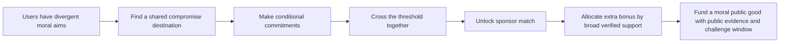
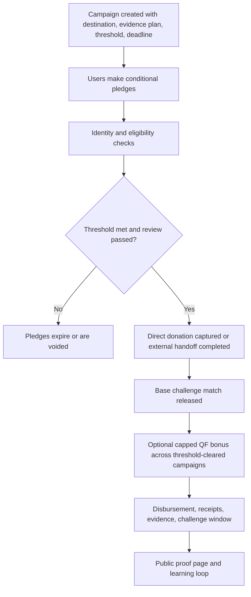
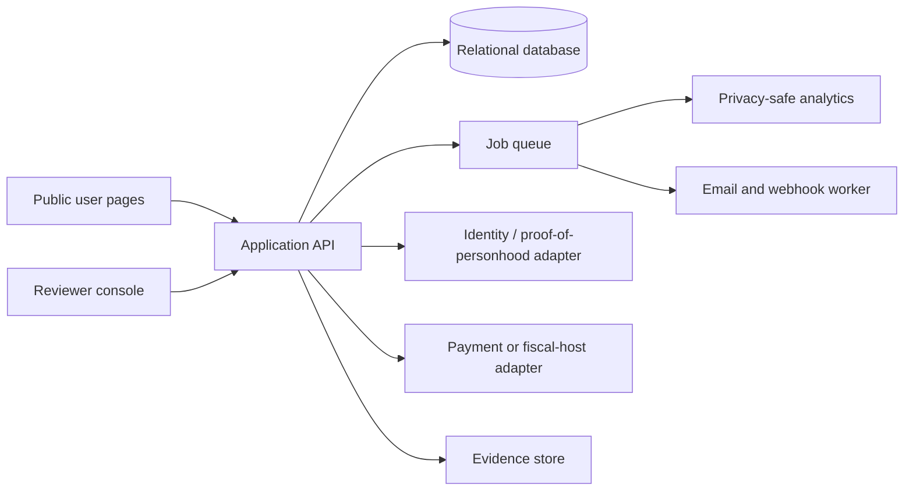

# Funding Moral Public Goods on MoralTrade

## Executive summary

The strongest mechanism for motivating people to fund moral public goods on **moraltrade.org** is **not** a stand-alone matching formula or a token incentive. It is a **hybrid centered on verified conditional commitments**: users make pledges that are only executed if a campaign reaches a funding and supporter threshold; successful campaigns unlock a precommitted sponsor challenge match; recurring subscriptions refill the sponsor pool; and only **after** campaigns clear threshold and verification gates does a **capped, identity-aware quadratic bonus** allocate a portion of the matching pool across competing public-goods routes. That recommendation follows directly from the user-prioritized sources: Forethought’s argument is that the big problem is coordination on consensus goods under free-riding, while Ord’s paper argues that moral-trade markets are still highly incomplete and that early mechanisms should start simple rather than with full-blown moral currencies or thick speculative markets. citeturn29view0turn30view1turn30view2turn7view4

The reason this hybrid dominates the alternatives is straightforward. **Conditional commitments** solve the assurance problem that stops many people from being the first mover in public-goods environments; **challenge gifts and seed money** have strong empirical support as ways to increase participation and to signal seriousness; **quadratic funding** is excellent at allocating sponsor dollars toward broad support, but it does not itself create the sponsor pool and becomes fragile at small scale unless identity and anti-collusion safeguards are already in place; **subscriptions** are useful for stable replenishment of the match pool, but they are a financing wrapper rather than a full public-goods allocation mechanism. In other words, the best motivating mechanism is a stack: assurance first, match second, QF third, subscriptions always-on in the background. citeturn10search0turn10search4turn10search12turn14search0turn14search13turn8search0turn9search0turn19view0turn16search3turn28search4

For **moraltrade.org specifically**, the recommendation should stay close to the product’s present public boundaries. The site’s public docs say the implementation is currently **centralized**, the matching layer is **deterministic and rule-based**, the core workflow is already **validator-backed** with review states, evidence records, challenge windows, and appeals, and the product **does not hold money, provide escrow, or give legal/tax advice**. Its safety posture also prohibits a **global moral ranking**, requires an **anti-threat baseline**, and keeps sensitive state changes reviewable. That makes a centralized, no-custody or fiscal-hosted pilot the right first deployment, with onchain contracts only as an optional later phase. citeturn7view4turn6view0turn6view1turn6view2turn6view3

My overall confidence in the **direction of this mechanism choice** is **moderate-high** at about **0.78**. My confidence in the **exact implementation details** is lower, around **0.62**, because the public docs do not specify MoralTrade’s live user volume, staff capacity, legal entity structure, or payments partnerships.

## What the prioritized sources imply

The first user-prioritized source, Forethought’s **“Moral public goods are a big deal for whether we get a good future,”** argues that when many actors care at least somewhat about a shared moral objective, the key constraint is not necessarily how altruistic they are; it is whether they can **coordinate** to move resources away from idiosyncratic goods and toward **consensus goods**. In the stylized example, individually rational spending on “self-sims” loses badly to a coordinated shift toward “consensium,” because the latter is valued by everyone and scales with the number of participants. Forethought also emphasizes that the free-rider problem remains central, that governments historically solve this with taxation, and that voluntary coordination technologies for public-goods funding are therefore especially important where coercive taxation is unavailable. citeturn29view0

That same Forethought piece is highly relevant to mechanism design because it implies that a platform like MoralTrade should optimize first for **credible coordination** and only second for philosophical persuasion. If what matters is that “enough people care a little,” the platform should make it easy for users to see that others are in, that a threshold is reachable, and that the route is verifiable. It should also avoid over-fragmenting campaigns, because Forethought argues that the gains from trade rise with wider distribution of power **only when coordination remains possible**. That points away from atomized micro-campaigns with weak signaling and toward a smaller number of **credible compromise destinations** with strong thresholds, transparent evidence, and bounded rule sets. citeturn29view0

Ord’s **“Moral Trade”** supplies the second foundational implication: in his framing, trade can occur not only because people have different tastes or resources, but because they have **different moral views** and can still agree on exchanges that each side sees as morally better than the baseline. Ord also explicitly notes that while economists technically subsume such cases under trade, the real-world market for moral trade is **very incomplete**, and he suggests that more mature systems might eventually involve moral-trade versions of **currency, markets, bargaining, and professionalization**. But his practical discussion is notably cautious: first efforts should stay relatively **simple**, and one-to-one or otherwise constrained exchanges are easier to trust and verify than full-blown market designs. citeturn30view0turn30view1turn30view2

That matters because MoralTrade’s current public product already resembles Ord’s “start simple” world more than a mature exchange. The public methodology says the current implementation is **centralized for simplicity**, that the current synthesis and matching layers are **deterministic** rather than AI-driven ranking systems, and that the platform structures proposals around fields such as cause area, action, verification method, duration, and exit conditions. The same page says the platform explicitly highlights **moral-public-goods compromise destinations** and treats coordination power as something that should be **distributed, reviewable, and hard to weaponize**. In other words, the public docs already point toward a bounded, review-heavy moral-trade institution rather than an automated ideological marketplace. citeturn7view4turn6view0



The best reading of the prioritized sources is therefore this: **MoralTrade should not try to “solve morality.”** It should reduce the transaction costs of morally plural cooperation. That means building a mechanism that is legible, threshold-based, verification-heavy, reviewable, and incremental. citeturn29view0turn30view1turn7view4turn6view0

## Which mechanisms work best

Field evidence supports the idea that **matching and challenge structures** matter, but with important caveats. Karlan and List’s large natural field experiment found that offering a matching grant increased both response rate and revenue per solicitation, while larger match ratios such as 2:1 and 3:1 did **not** outperform 1:1 in a meaningful way. Rondeau and List, by contrast, found evidence that **challenge gifts** helped in the field whereas matching gifts did not in their particular design, which is a reminder that what often matters is not only “price” but also the signal that a serious donor has already stepped up. List and Lucking-Reiley found that larger publicly announced **seed money** substantially increased giving, and later work by Krasteva and Yildirim argues that seed money can outperform matching when donors are uncertain about charity quality because seed money acts as a **costly signal**. The design implication is that MoralTrade should use **visible sponsor commitment**, but it should not assume more extravagant match ratios are necessarily better. citeturn8search0turn14search0turn14search13turn14search10

**Quadratic funding** has the strongest normative case when the problem is allocating a shared sponsor pool to projects with broad support. Buterin, Hitzig, and Weyl propose QF precisely to improve decentralized provision of public goods, and Gitcoin’s operational documentation describes how the formula amplifies projects with many distinct contributors rather than a few large donors. Gitcoin’s public materials also make the main weakness explicit: QF is highly vulnerable to **sybil attacks, collusion, and coordinated clusters**, so it must be paired with identity verification and post-round adjustment mechanisms such as Passport scoring, COCM, and related anti-collusion analysis. This makes QF powerful as an **allocation layer**, but risky as the first and only motivating mechanism on an early-stage platform with unknown user scale. citeturn9search0turn19view0turn19view1turn25search15turn25search5

**Conditional commitments and assurance contracts** have a particularly good fit for moral public goods because they target the real blocker: “I will contribute if enough others also commit.” Experimental and theoretical work on provision-point mechanisms, dominant assurance contracts, and refund-bonus extensions all point in the same direction: threshold rules can make public-goods campaigns much more likely to succeed by changing the game from unilateral sacrifice to coordinated action. Rondeau, Schulze, and Poe found provision-point mechanisms with money-back guarantees to be empirically demand-revealing in aggregate; Tabarrok’s dominant assurance contract makes contributing a dominant strategy under specified conditions; and later work by Zubrickas and by Cason and coauthors shows that refund bonuses can reduce miscoordination and increase successful crowdfunding. For a platform whose differentiator is moral-trade coordination, this family of mechanisms is unusually on-theme. citeturn10search0turn10search4turn10search12turn10search14turn10search26

**Subscription and club-good wrappers** are valuable mainly because they create predictability and habit. Buchanan’s classic club-goods framework is useful conceptually because it identifies a class of goods between purely private and purely public, but for an online donations platform the practical lesson comes from recurring-giving infrastructure: Open Collective documents recurring subscriptions as a budgeting aid for collectives, and Patreon’s subscription billing and annual memberships show why recurring flows matter for predictable income and lower payment churn. That said, recurring giving is a wrapper, not a solution to the public-goods free-rider problem. A monthly program can finance a sponsor pool or verified “supporters circle,” but it does not replace the need for a launch mechanism like threshold assurance. citeturn27search0turn16search3turn16search9turn28search4turn28search25

**Reputation-weighting** and **moral signaling** are best treated as bounded complements, not the core. Human Passport explicitly supports use cases where verified humans or higher-trust users have heavier weight, and Gitcoin’s grants stack allows Passport-based gating and weighting. At the same time, image-motivation and social-information research shows a dual reality: visibility can increase prosocial behavior, but social pressure can also generate distortions or make people avoid the ask. Ariely, Bracha, and Meier show that image motivation materially affects prosocial behavior; Shang and Croson show that social information can raise contributions; DellaVigna, List, and Malmendier show that people often give partly to avoid the discomfort of saying no. So visibility levers should be **opt-in and light-touch**, not coercive or status-maximizing. citeturn21search4turn19view1turn11search0turn12search2turn12search0

**Tokenized incentives** are the weakest fit for a first serious build. Gitcoin and Optimism show that onchain public-goods funding can work, but tokenized systems add legal complexity, market volatility, sybil incentives, and governance-capture risk. SEC guidance keeps emphasizing that digital assets can be securities depending on facts and circumstances, and FinCEN keeps stressing that entities functioning as money transmitters face registration and compliance obligations. Unless MoralTrade has a specific regulatory plan and a deliberate crypto-native user base, tokens would add more attack surface than motivational force. citeturn17search5turn18search0turn22search2turn22search10turn22search1

The table below is my synthesis of the literature and platform case studies rather than a direct quote from any one source. It combines the mechanism theory above with evidence from matching, provision-point experiments, Gitcoin’s operational experience, and recurring-giving platforms. citeturn8search0turn10search0turn19view0turn16search3turn28search4

| Mechanism | Expected effectiveness | Operational cost | Scalability | Fairness and pluralism | Manipulability | Best role on MoralTrade |
|---|---:|---:|---:|---:|---:|---|
| Simple sponsor match or challenge gift | High | Low | High | Medium | Medium | Visible sponsor signal and top-up |
| Quadratic funding | High at scale | High | Medium-High | High if well-defended | High without sybil controls | Bonus allocation layer for sponsor dollars |
| Subscription or membership | Medium | Low-Medium | High | Medium | Low | Refill the sponsor pool and retain donors |
| Reputation-weighted contributions | Medium | Medium-High | Medium | Medium-Low if opaque | Medium | Anti-fraud complement only |
| Moral signaling markets | Medium | Medium | High | Low-Medium | Medium-High | Optional discovery and social proof |
| Conditional commitments and assurance contracts | Very high | Medium | Medium | High | Medium-Low | Core motivating mechanism |
| Tokenized incentives | Low-Medium | Very high | High | Low | High | Do not deploy in v1 |
| **Hybrid assurance + challenge match + capped QF bonus** | **Highest overall** | **Medium-High** | **Medium-High** | **High** | **Medium once defended** | **Recommended** |

An illustrative formula-based comparison helps explain why QF is valuable **after** assurance, not before it. Using the standard QF formula from *Liberal Radicalism* and Gitcoin’s docs, suppose two campaigns each receive **$1,000** in direct donations, but one gets **100 donors giving $10 each** while the other gets **one donor giving $1,000**. With a **$10,000** sponsor pool, simple direct giving and 1:1 matching treat them the same, but QF almost entirely rewards the campaign with broader support. citeturn9search0turn19view0

```text
Illustrative total funding per project
Assumptions: each project receives $1,000 direct donations; sponsor pool = $10,000.

Mechanism            Broad-support project             Whale-supported project
Direct giving        ████  $1,000                      ████  $1,000
1:1 match            ████████  $2,000                  ████████  $2,000
Quadratic funding    ███████████████████████████ $10,901   █████ $1,099
```

That is exactly why QF belongs in the stack. It is a powerful **allocator of sponsor capital**, but it still needs sponsor capital, unique-human defenses, and enough campaigns and donors for the signal to be meaningful. citeturn19view0turn19view1turn21search0turn21search6

## Behavioral design, governance, and strategic resistance

Behavioral economics implies that the platform should optimize heavily for **credible social proof**. Shang and Croson show that information about others’ giving affects contributions, and Kessler shows that even **announcements of support** can increase contributions to public goods. For MoralTrade, that means visible counts of **verified supporters**, visible sponsor commitments, deadline progress, and short “why I pledged” explanations should all help. But donor **amounts** should be private by default. Public amount displays are much more likely to create status comparison and pressure dynamics than simple supporter counts or reason statements. citeturn12search2turn14search7turn11search0

The platform also needs to be careful with **pressure and defaults**. Ariely, Bracha, and Meier show that image motivation can drive prosocial behavior, while DellaVigna, List, and Malmendier show that some giving is driven by social pressure, not stable donor welfare. Altmann and coauthors find that defaults affect individual donation behavior strongly but do not necessarily increase overall platform-level donations. The practical implication is blunt: do not rely on dark-pattern defaults. Use defaults for **friction reduction**, not for covert extraction. An ethically strong design would keep one-time giving as the main action, offer recurring support as a clearly visible secondary option, and let donors choose whether their identity, rationale, or only their supporter status is public. citeturn11search0turn12search0turn13search0turn13search16

Commitment devices are also useful, especially because moral-public-goods contributions are often intentions that decay under delay. Andreoni and Serra-Garcia show that charitable donations can increase materially when people choose **now** to give **later** rather than immediately, and Fosgaard and coauthors show that making later donations more explicit and formal can increase follow-through. So MoralTrade should support “pledge now, execute at threshold” rather than forcing immediate payment, and it should send clear, non-spammy reminders as the deadline approaches or as the campaign nears threshold. citeturn13search24turn13search28turn13search2

On governance, MoralTrade already has public architecture that is unusually compatible with a review-heavy hybrid. The technical spec says proposals already have required fields, review statuses, state transitions, and explicit guardrails including **no global moral ranking**, an **anti-threat baseline**, **privacy redaction**, and **separate trust axes**. The methodology page says agreement events can record evidence, disputes, and payment updates, and the technical spec further says any move beyond deterministic rules for ranking or state change would require substantial governance documentation before deployment. That means v1 should stay with **deterministic, inspectable rules** and human review for edge cases. citeturn6view0turn7view4turn6view1

For anti-fraud, the main strategic problems are easy to name. A QF layer invites **sybil attacks** because users can split money across fake identities; social coordination creates **cluster attacks**; visible public commitments create a risk of **bribery** or quid-pro-quo vote buying if there is a provable link between one actor and one allocation decision; and public-goods routes create **destination fraud** if donors cannot tell where money actually goes. Gitcoin’s own docs treat sybil review as essential and pair QF with Passport scoring, COCM, and other adjustments, while MACI is built specifically to reduce coercion and collusion in onchain voting and quadratic processes by making individual votes private and receipt-free. MoralTrade does not need MACI in v1 if it stays off-chain and no-custody, but if it later moves to public, onchain QF rounds, an anti-collusion privacy layer becomes highly relevant. citeturn19view0turn19view1turn25search15turn25search5turn21search0turn20search2turn20search9

The table below is again a design synthesis rather than a source quotation. It translates the literature and the platform’s existing guardrails into concrete attack surfaces and mitigations. citeturn6view0turn6view1turn19view0turn21search0turn20search2

| Attack or failure mode | Why it matters | Best mitigation |
|---|---|---|
| Sybil splitting in QF bonus | Artificially inflates breadth signal | Require proof-of-personhood or bounded human-score gating; only apply QF to threshold-cleared campaigns; cap QF bonus relative to direct funds |
| Wait-and-see under threshold funding | Users delay until others move first | Show verified supporter counts, sponsor commitment, and deadline progress; use expiring preauthorizations or formal pledges |
| Counterparty extortion or threat offers | Moral trade can become pay-for-nonharm | Enforce no-worsening-baseline rule; block extortionary or perverse-incentive offers |
| Destination fraud | Donors lose trust if money path is unclear | External charity/fiscal-host pages, webhook verification, public receipts, challenge window |
| Social-pressure overreach | Users may avoid the platform or regret giving | Keep amount visibility private by default; use opt-in recognition only |
| Reviewer capture or inconsistency | Trust in “neutral rules” collapses | Public criteria, reason codes, appeals, rotating reviewers, audit log |
| Ideological popularity bias | Broad but shallow causes may dominate | Domain-based rounds, curator minimums, threshold plus capped QF, not free-for-all ranking |
| Token speculation or legal drift | Mission loses focus and enters securities territory | Avoid transferable incentive tokens in v1 |

## Recommended mechanism for MoralTrade

The recommended mechanism is a **hybrid assurance system** that I would label **Verified Assurance Matching**. It has four layers.

The **first layer** is the actual motivating engine: a campaign only executes if it reaches both an **amount threshold** and a **verified-supporter threshold** by the deadline. This is the assurance piece. It turns the donor’s problem from “Should I sacrifice alone?” into “Will enough of us do this together?” That fits Forethought’s coordination thesis and the provision-point literature much better than an immediate-pay, free-floating appeal. citeturn29view0turn10search0turn10search4

The **second layer** is a **visible challenge match**. A sponsor, counterparty, institution, or pooled “common ground fund” precommits a match budget that only activates once the campaign clears threshold. The empirical literature suggests that the existence of a sponsor signal matters more than flashy ratios, so the default should be **1:1 or modest capped matching**, not ever-larger multipliers. If the goal is to signal seriousness and motivate threshold crossing, a prominent challenge pledge is better than an overly clever formula. citeturn8search0turn14search0turn14search13

The **third layer** is an **optional, capped quadratic bonus** that allocates part of the sponsor pool among all campaigns that passed assurance and verification. This is where QF does its best work: not deciding whether a route deserves existence, but deciding how extra sponsor dollars should be distributed across routes with broad support. The cap is important. It prevents the QF bonus from swamping direct support and reduces the return to sybil manipulation. A practical rule is that the QF bonus should never exceed a fixed multiple of direct eligible funds. citeturn9search0turn19view0turn25search15

The **fourth layer** is a **recurring subscription pool**. Users can join a monthly “Moral Public Goods Circle” or equivalent sponsor pool that continuously refills future challenge budgets. This is not the core mechanism; it is the mechanism that keeps the core mechanism funded across rounds. Open Collective, Patreon, and other recurring platforms show why this matters for predictability. The right UX is to offer recurring support prominently, but not as a manipulative checkout default. citeturn16search3turn28search4turn28search25

A fifth, smaller layer is **bounded reputation and signaling**. Use identity and prior completion data to gate eligibility or slightly adjust QF weights for sponsor bonuses, but do **not** let reputation determine whether a donor’s direct contribution counts. Use public supporter count and optional supporter rationale as light-touch social proof, but do not build a performative leaderboard of moral worth. That is consistent both with the behavioral literature and with MoralTrade’s own “no global moral ranking” rule. citeturn21search4turn11search0turn12search0turn6view0



This hybrid also integrates naturally with MoralTrade’s existing product concepts. The methodology page already highlights **moral-public-goods compromise destinations**, while the marketplace already imagines donation offsets and routes. The right design move is therefore not to bolt on a generic charity widget, but to let users choose a **compromise destination** as part of trade creation and then channel those trades into a thresholded public-goods route. citeturn7view4turn5view4

## Implementation blueprint for moraltrade.org

The public docs indicate that MoralTrade is a centralized, validator-backed pilot with deterministic matching, privacy-redacted telemetry, and explicit review workflows. The implementation blueprint below assumes that posture continues in v1. It is deliberately backend-first and avoids adding undocumented ML ranking or custody services that the site currently disclaims. citeturn7view4turn6view0turn6view1turn6view3

### Product and data model

MoralTrade’s own technical spec already names core entities such as participants, profiles, offers, evidence records, disputes, payment updates, and agreement events. The cleanest path is to **extend**, not replace, that model. citeturn6view0

| New entity | Core fields | Purpose |
|---|---|---|
| `public_goods_campaign` | `id`, `slug`, `title`, `destination_type`, `destination_ref`, `cause_tags`, `public_summary`, `threshold_amount_cents`, `threshold_supporters`, `deadline_at`, `verification_method`, `baseline_rule`, `exit_rule`, `status` | Canonical campaign record |
| `campaign_round` | `id`, `name`, `starts_at`, `ends_at`, `match_pool_id`, `qf_enabled`, `qf_cap_multiple`, `supporter_gate` | Groups campaigns for shared sponsor allocation |
| `pledge` | `id`, `campaign_id`, `user_id`, `amount_cents`, `visibility_mode`, `is_recurring`, `capture_mode`, `payment_intent_ref`, `eligibility_state`, `created_at` | Conditional commitment record |
| `identity_attestation` | `user_id`, `provider`, `human_score`, `expires_at`, `status`, `redacted_reference` | Proof-of-personhood or trust signals |
| `match_pool` | `id`, `funder_type`, `budget_cents`, `base_match_ratio`, `qf_bonus_cents`, `visible_commitment`, `restrictions_json` | Sponsor commitment logic |
| `allocation_result` | `campaign_id`, `direct_eligible_cents`, `supporter_count`, `base_match_cents`, `qf_score`, `qf_bonus_cents`, `total_payout_cents`, `finalized_at` | Final distribution record |
| `payment_proof` | `pledge_id`, `external_receipt_ref`, `charity_receipt_ref`, `amount_verified_cents`, `verified_at` | Used when money is handed off externally |
| `review_case` | `campaign_id`, `state`, `reason_code`, `reviewer_id`, `opened_at`, `closed_at`, `appeal_status` | Maps to existing review and appeal machinery |
| `subscription` | `user_id`, `pool_id`, `amount_cents`, `interval`, `status`, `next_charge_at` | Recurring sponsor-pool funding |
| `experiment_assignment` | `user_id`, `experiment_key`, `variant`, `assigned_at` | A/B testing and holdouts |

### UX flows

The public campaign flow should be built around a single message: **“Your pledge only happens if enough verified people join.”** That is far easier to understand than “quadratic matching,” and it maps directly onto the assurance problem the literature cares about. Once a user enters the flow, they should see a compact route card with threshold, deadline, verified supporter count, sponsor match status, and verification requirements. The key conversion event is not raw pageview-to-donation; it is **verified pledge intent**. citeturn10search0turn14search7turn12search2

Campaign creation should reuse the current validator-backed proposal shape: cause area, offered and requested action, no-trade baseline, duration, exit rule, verification method, and public boundaries. The new wizard should add only the minimum new fields needed for public-goods routes: destination, threshold, supporter minimum, sponsor match settings, and payout method. On review, reuse the site’s current statuses such as `submitted`, `needs_evidence`, `challenge_window`, `matchable`, and `completion_reviewed` so that reviewers and users do not need to learn a second governance language. citeturn6view0

The donation step should support three **capture modes**. The first is `external_handoff`, where v1 sends the user to an external charity or fiscal-host page only after threshold is met. The second is `stored_payment_method`, where the platform or its fiscal host preauthorizes and later captures payment. The third is `signed_intent`, for large donors or institutions whose commitment is off-platform but documented. The no-custody pilot should default to the first mode because the site currently says it does not hold money or claim escrow. citeturn7view4turn22search31turn16search1turn15search2

A practical public route should end with a **proof page**, not just a “success” page. Donors should see the actual destination, verified amount, sponsor top-up, reason codes if there were exclusions, and the status of the challenge window. That kind of destination proof responds directly to FTC guidance about donor confusion on online giving portals and to the platform’s own emphasis on evidence and challengeability. citeturn22search31turn22search3turn6view0turn7view4

### Backend and contract architecture

For v1, the recommended stack is a **centralized backend with a relational database, job queue, review console, identity adapter, and payment/fiscal-host adapter**, not a public smart-contract-first implementation. MoralTrade’s public docs say the product is centralized today, its match suggestions are deterministic, and “instrument before optimizing” is part of its public performance stance. That argues for a backend that is boring, inspectable, and easy to audit. citeturn7view4turn6view3



An optional v2 can add **smart-contract rails** for sponsor pools or stablecoin disbursement. If that happens, Allo Protocol is a more credible starting point than writing custom contracts from scratch because it already supports modular capital allocation strategies and powered Gitcoin Grants Stack. But that should come only after the platform proves that it has enough verified supporters and campaign throughput to justify onchain complexity. citeturn25search26turn19view1

### Cost, rollout, KPIs, and experiments

Because MoralTrade’s current user base, staffing, and budget are unspecified, the costs below are **illustrative planning estimates**, not benchmarked quotes.

| Workstream | Lean pilot estimate | Notes |
|---|---:|---|
| Core product and backend build | 6–10 engineer weeks | Includes campaigns, pledges, review console, payouts ledger |
| Design and UX research | 2–4 weeks | Especially explanation and trust copy |
| Reviewer operations | 5–10 hours/week | Needed from day one |
| Legal and compliance review | 15–40 counsel hours | Highly variable by jurisdiction and payment model |
| Infrastructure | low hundreds to low thousands USD/month | Depends on traffic, storage, email, and identity vendor usage |
| Identity checks | variable per check | Use tiered verification, not universal strong KYC |

The rollout should be staged.

| Phase | Objective | Scope |
|---|---|---|
| Pilot safety and instrumentation | Prove event tracking, reviewer reliability, destination verification | 1–2 campaigns, manual review, external handoff only |
| Closed cohort rounds | Test demand and explanation | Small invited user cohort, one sponsor pool, no QF yet |
| Public sponsor rounds | Add base challenge match and recurring pool | More campaigns, verified supporter count public |
| Thresholded QF bonus | Introduce capped QF among passers | Only after enough verified donors and at least several simultaneous campaigns |
| Optional onchain rails | Lower disbursement friction or improve transparency | Requires legal review and real volume |

The KPIs should focus on **coordination quality**, not vanity traffic. The most important metrics are: verified pledge conversion rate; threshold-clear rate; median time to threshold; direct-funds-to-match multiplier; sponsor-pool utilization; post-threshold completion rate for external handoffs; dispute rate; fraud-adjusted payout ratio; retained recurring donors after 3 and 6 months; and the share of funded campaigns that later show verifiable completion evidence. These are much better indicators of real public-goods funding than gross clicks or total pageviews. citeturn6view3turn22search31turn19view0

The A/B test program should stay narrow and interpretable.

| Test | Variant A | Variant B | Primary KPI | Why it matters |
|---|---|---|---|---|
| Assurance framing | “Donate now” | “Pledge now; only executes if threshold is met” | Verified pledge conversion | Tests assurance effect directly |
| Sponsor signal | Hidden sponsor until threshold | Visible challenge sponsor from start | Threshold-clear rate | Tests challenge-gift signaling |
| Social proof | Progress bar only | Progress bar + verified supporter count + optional reasons | Conversion and average pledge | Tests social-information effect |
| Subscription upsell | Inline recurring checkbox | Post-pledge recurring invitation | Recurring conversion without harming one-time conversion | Avoids manipulative defaults |
| QF explanation | Technical formula text | Simple “broader support unlocks more bonus” copy | Round completion and trust score | QF often fails at comprehension |
| Visibility control | Public by default | Private by default with opt-in public reason | Conversion, regret/refund signal, and user trust | Tests pressure costs |

### Build order for Codex GPT-5.5 xhigh reasoning

Use the following work order for Codex. The instruction sequence assumes an existing centralized web app with validator-backed workflows and deterministic matching rules, which is what MoralTrade’s public docs currently describe. citeturn7view4turn6view0turn6view1

1. **Audit the existing route and schema contracts**. Identify the existing offer, evidence, dispute, notification, and agreement-event models. Do not invent a parallel workflow if a compatible existing state machine already exists.
2. **Add database migrations** for the new entities listed above: campaigns, rounds, pledges, identity attestations, match pools, allocation results, payment proofs, subscriptions, and experiments.
3. **Implement a deterministic campaign service** that validates thresholds, deadlines, reason codes, destination types, and public summaries against a schema. Do not add any ML ranking or scoring.
4. **Build a reviewer console** that reuses current review states and exposes clear reason codes for `approve`, `needs_evidence`, `block`, `challenge`, and `finalize`.
5. **Implement the pledge service** with support for `external_handoff`, `stored_payment_method`, and `signed_intent` capture modes.
6. **Add an identity adapter** with a generic interface so the app can consume Human Passport-style scores or a simpler internal attestation later without schema changes.
7. **Implement the assurance engine** that marks campaigns as `threshold_pending`, `threshold_met`, `review_pending`, `payable`, or `expired`.
8. **Implement the match engine** with separate calculations for `base_match` and `qf_bonus`, and enforce a hard cap where `qf_bonus <= qf_cap_multiple * direct_eligible`.
9. **Create public campaign pages** that show threshold, deadline, verified supporter count, sponsor commitment, evidence plan, and visibility/privacy controls.
10. **Add recurring-subscription flows** for the sponsor pool, but keep them as clearly optional actions.
11. **Build webhook and reconciliation jobs** for external charities or fiscal hosts. Every completed external handoff should write a `payment_proof` record.
12. **Ship privacy-safe analytics only**. Follow the site’s own telemetry stance and never store raw private wishes, contact details, or unredacted sensitive text in analytics.
13. **Write tests** for threshold logic, payout logic, duplicate-identity blocking, allocation caps, reviewer appeals, and failed external handoff recovery.
14. **Deploy behind a feature flag** for an invited cohort, gather reviewer timing and threshold-conversion data, and only then widen public access.

### Sample backend logic

A simple implementation can keep the match logic explicit and capped.

```ts
type EligibleContribution = {
  userId: string;
  amountCents: number;
  humanWeight: number; // bounded in [0, 1]
};

type CampaignInput = {
  id: string;
  thresholdPassed: boolean;
  directEligibleCents: number;
  contributions: EligibleContribution[];
  baseMatchCapCents: number;
};

type Allocation = {
  campaignId: string;
  baseMatchCents: number;
  qfScore: number;
  qfBonusCents: number;
  totalPayoutCents: number;
};

function qfScore(contributions: EligibleContribution[]): number {
  const weightedRootSum = contributions.reduce((sum, c) => {
    // Keep identity weighting bounded to avoid turning “reputation” into class hierarchy.
    const boundedWeight = 0.5 + 0.5 * Math.max(0, Math.min(1, c.humanWeight));
    return sum + Math.sqrt(c.amountCents) * boundedWeight;
  }, 0);
  return weightedRootSum ** 2;
}

function allocateRound(
  campaigns: CampaignInput[],
  qfBonusPoolCents: number,
  baseMatchRatio = 1,
  qfCapMultiple = 1.5
): Allocation[] {
  const active = campaigns.filter(c => c.thresholdPassed);

  const scores = active.map(c => ({
    id: c.id,
    score: qfScore(c.contributions),
  }));

  const totalScore = scores.reduce((s, x) => s + x.score, 0) || 1;

  return active.map(c => {
    const baseMatchRaw = Math.floor(c.directEligibleCents * baseMatchRatio);
    const baseMatchCents = Math.min(baseMatchRaw, c.baseMatchCapCents);

    const score = scores.find(s => s.id === c.id)!.score;
    const uncappedQfBonus = Math.floor((score / totalScore) * qfBonusPoolCents);
    const qfBonusCap = Math.floor(c.directEligibleCents * qfCapMultiple);
    const qfBonusCents = Math.min(uncappedQfBonus, qfBonusCap);

    return {
      campaignId: c.id,
      baseMatchCents,
      qfScore: score,
      qfBonusCents,
      totalPayoutCents: c.directEligibleCents + baseMatchCents + qfBonusCents,
    };
  });
}
```

The QF formula is derived from *Liberal Radicalism* and aligns with Gitcoin’s operational description, while the cap and bounded identity weighting are added here as implementation defenses. citeturn9search0turn19view0turn21search4

If MoralTrade later wants onchain rails, the first contract should be minimal and should mirror the backend state machine rather than inventing a new one:

```solidity
// Pseudocode only
contract AssuranceMatchRound {
    struct Campaign {
        uint256 thresholdAmount;
        uint256 minSupporters;
        uint256 deadline;
        uint256 directEligible;
        uint256 supporterCount;
        bool finalized;
        bool passed;
    }

    mapping(uint256 => Campaign) public campaigns;
    mapping(uint256 => mapping(address => uint256)) public pledges;

    function pledge(uint256 campaignId, uint256 amount, bytes calldata attestation) external {
        // verify eligibility or accept an attested user identity
        // record pledge
    }

    function finalize(uint256 campaignId) external {
        Campaign storage c = campaigns[campaignId];
        require(block.timestamp > c.deadline, "too early");
        require(!c.finalized, "already finalized");

        c.finalized = true;
        c.passed = (c.directEligible >= c.thresholdAmount && c.supporterCount >= c.minSupporters);

        if (c.passed) {
            // release direct funds and sponsor match
            // optional: compute capped QF bonus off-chain and submit result with proof
        } else {
            // void pledges or enable refunds
        }
    }
}
```

## Legal, ethical, and failure-mode analysis

The cleanest legal posture for v1 is to stay aligned with the site’s current public statement that it **does not hold money or claim escrow**. That keeps the platform farther away from money-transmission risk, while still letting it mediate commitments, reviews, and handoffs to charities or fiscal hosts. If the platform starts taking custody of donor funds, it must revisit money-transmission, sanctions, and AML/KYC exposure much more seriously. FinCEN’s materials are plain that entities acting as money services businesses can face registration and enforcement obligations, and the FTC has repeatedly warned about donor confusion on crowdfunding and charitable-giving portals. citeturn7view4turn22search1turn22search3turn22search31

Tax communication has to be equally clear. The IRS requires a contemporaneous written acknowledgment for charitable contributions of $250 or more, and tax receipt rules depend on who actually receives the contribution and whether goods or services are provided in return. If MoralTrade routes donors to outside nonprofits or fiscal hosts, **those entities**, not MoralTrade, should issue the charitable acknowledgment. MoralTrade should avoid language implying that every routed payment is tax-deductible unless the receiving entity and context actually make that true. citeturn22search0turn22search4turn22search12turn23search13

If MoralTrade solicits funds nationally, it also needs a state-law plan. The IRS points out that many states require charities to register before soliciting residents, and NASCO’s public resources likewise stress that online charitable giving can create donor confusion and state-law obligations. A no-custody routing posture can reduce some burden, but it does not automatically eliminate solicitation issues if the platform is actively asking users to donate. Using already-registered recipient charities or fiscal hosts is often much simpler than trying to make the platform itself the primary fundraising vehicle. citeturn24search9turn24search0turn16search1

Tokenization raises the sharpest legal warning. The SEC continues to say that digital assets may be securities depending on how they are offered and sold, and tokenized fundraising can also create expectations of profit, governance-capture issues, and secondary-market behavior that are simply unnecessary for a first-generation moral-public-goods platform. On the ethics side, tokens also risk turning moral cooperation into speculative game play. Unless the platform’s strategy is explicitly crypto-native and legally prepared, the right answer is to use **non-transferable badges and plain accounting**, not tradable incentive tokens. citeturn22search2turn22search10

Ethically, the platform’s sharpest risk is not underfunding but **weaponized moral bargaining**. A moral-trade platform can drift into extortion if it allows proposals of the form “pay me or I will continue doing something newly harmful.” MoralTrade’s own public safety language already identifies the right defenses: anti-threat baselines, perverse-incentive review, and political or campaign-adjacent scrutiny. Those policies should remain core and should be non-negotiable in public-goods routes as well. citeturn6view0turn6view1

The major failure modes and mitigations are as follows.

| Risk | Likely consequence | Mitigation |
|---|---|---|
| Low early liquidity | Thresholds never clear; users infer no demand | Start with 1–2 seeded flagship routes; sponsor pool visible from day one |
| Donor confusion about where money goes | Trust collapse and regulatory issues | External destination labels, proof pages, charity-issued receipts, “MoralTrade is not the donee” copy |
| Reviewer bottlenecks | Slow decisions and inconsistent precedent | Publish reviewer SLAs, reason codes, escalation paths |
| Sybil attacks once QF is enabled | Distorted sponsor allocation | Minimum supporter gates, proof-of-personhood, cluster analysis, caps |
| Over-engineered mechanism literacy burden | Users bounce before pledging | Put assurance and sponsor match first in the UX; hide formula details behind expandable help |
| Social-pressure backlash | Lower long-run trust and participation | Private-by-default amounts, optional recognition only |
| Cause-area capture | “Broad” round becomes popularity contest | Use curated compromise domains and campaign eligibility rules |
| Premature onchain migration | Legal, UX, and fraud complexity spike | Stay centralized/no-custody until thresholds, volume, and review quality are proven |

## References

**Priority sources**

- Tom Davidson, William MacAskill, and Mia Taylor, *Moral public goods are a big deal for whether we get a good future* (Forethought, 2026).
- Toby Ord, *Moral Trade* (*Ethics*, 2015).
- MoralTrade public documentation: *Methodology* and *Technical Spec*.

**Additional academic, official, and case-study sources used**

- Dean Karlan and John A. List, *Does Price Matter in Charitable Giving? Evidence from a Large-Scale Natural Field Experiment* (*American Economic Review*, 2007).
- Vitalik Buterin, Zoë Hitzig, and E. Glen Weyl, *Liberal Radicalism: A Flexible Design for Philanthropic Matching Funds* (2018).
- Daniel Rondeau, William Schulze, and Gregory Poe, *Voluntary Revelation of the Demand for Public Goods Using a Provision Point Mechanism* (*Journal of Public Economics*, 1999).
- Alexander Tabarrok, *The Private Provision of Public Goods via Dominant Assurance Contracts* (*Public Choice*, 1998).
- Robertas Zubrickas, *The Provision Point Mechanism with Refund Bonuses* (*Journal of Public Economics*, 2014).
- Timothy N. Cason et al., work on refund bonuses and donation crowdfunding.
- John A. List and David Lucking-Reiley, *The Effects of Seed Money and Refunds on Charitable Giving* (*Journal of Political Economy*, 2002).
- James B. Kessler, *Announcements of Support and Public Good Provision* (*American Economic Review*, 2017).
- Jen Shang and Rachel Croson, *A Field Experiment in Charitable Contribution: The Impact of Social Information on the Voluntary Provision of Public Goods* (*Economic Journal*, 2009).
- Dan Ariely, Anat Bracha, and Stephan Meier, *Doing Good or Doing Well? Image Motivation and Monetary Incentives in Behaving Prosocially* (*American Economic Review*, 2009).
- Stefano DellaVigna, John A. List, and Ulrike Malmendier, *Testing for Altruism and Social Pressure in Charitable Giving* (*Quarterly Journal of Economics*, 2012).
- Steffen Altmann et al., *Defaults and Donations: Evidence from a Field Experiment* (2018 working-paper version).
- James Andreoni and Marta Serra-Garcia, *Time Inconsistent Charitable Giving* (*Journal of Public Economics*, 2021).
- Toke Reinholt Fosgaard et al., *I Will Donate Later!* (*Journal of Economic Behavior & Organization*, 2022).
- Gitcoin public mechanism and app docs on Quadratic Funding, Grants Stack, COCM, and sybil resistance.
- Human Passport documentation and knowledge-base materials.
- MACI documentation.
- Kickstarter’s official all-or-nothing funding handbook.
- Open Collective documentation on transparency, fiscal hosting, and recurring contributions.
- Patreon support and developer documentation on subscription billing and annual memberships.
- FTC guidance on online charitable giving portals and crowdfunding.
- IRS guidance on charitable acknowledgments, substantiation, quid pro quo contributions, donor-advised funds, and state solicitation requirements.
- NASCO public resources on online giving and internet solicitations.
- SEC guidance on digital assets.
- FinCEN materials on money-transmission and crowdfunding risk.
- Optimism governance documentation on Retro Funding and attestations.