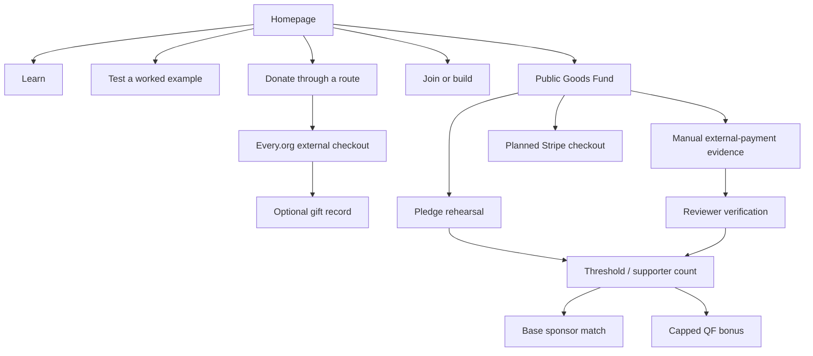
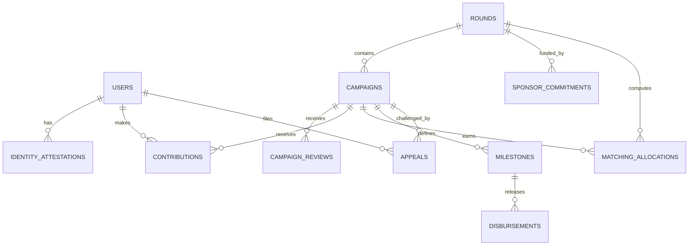
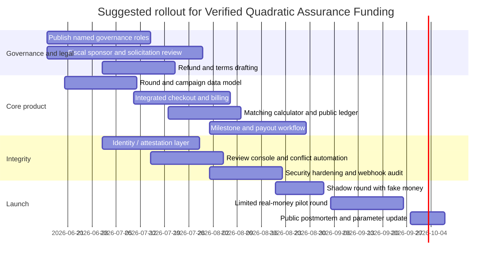

# Designing the strongest moral-public-goods funding mechanism for Moral Trade

## Executive summary

I do **not** think Moral Trade’s current public-goods mechanism is the most effective feasible design for a platform like this. My confidence in that conclusion is **moderate to high, around 0.8**. The reason is straightforward: the current system is explicitly a **reviewed pilot**, not a liquid marketplace; it currently has **0 live proposals, 0 completed agreements**, uses **manual external-payment evidence**, keeps **integrated checkout planned but inactive**, and its own MPGF technical notes say real-money mode is **disabled or acceptance-gated** and current public financial state is still non-real-money. That is a sensible safety posture, but it is not the highest-throughput fundraising mechanism. citeturn19view0turn31view0turn10view0turn19view1

The user-prioritized sources point in the same direction. Toby Ord’s paper argues that the biggest gains come from moving beyond ad hoc barter toward **markets, bargaining, currency-like clearing tools, and professionalization**, while also warning that moral trade is held back by **factual trust** and especially **counterfactual trust**. Forethought’s later work argues that moral public goods get the most funding when **resources are widely distributed and coordination is possible**, but is skeptical that **voluntary contracts alone** can robustly solve the problem; their strongest theoretical answer is closer to **government funding**, while among voluntary tools they note that **assurance contracts are brittle** and that **quadratic funding needs an outside matching pool**. Their related essay on convergence and compromise adds that outcomes depend heavily on **institutions**, **power distribution**, and avoiding **value-destroying threats**. citeturn14view0turn13view3turn15view0turn16view0turn16view1turn18view1turn18view2

Because Moral Trade is a **private platform**, not a government, the best implementable answer is not taxation. The best answer is a **hybrid** that approximates Forethought’s “widely distributed power plus coordination” insight while respecting Moral Trade’s anti-threat and no-ranking posture. My recommended mechanism is:

**Verified quadratic assurance funding**:  
a standing **recurring sponsor pool** plus **identity-verified capital-constrained quadratic matching**, guarded by **campaign eligibility thresholds**, **manual review**, **public audit trails**, and **milestone-based release** through a fiscal sponsor or regulated payments stack.

That hybrid is better than the current system because it does all of the following at once:

It gives each small donor an immediately legible upside through matching, instead of relying mostly on threshold pivotality. It rewards **broad support**, which is exactly the platform-level analogue of distributed moral power. It preserves Moral Trade’s strongest existing features—review, dissent notes, anti-threat rules, and explicit non-ranking. And it avoids the worst weaknesses of pure alternatives: the brittleness of assurance contracts, the plutocracy of DAO token voting, and the metric-fragility and low-liquidity problems of prediction markets. citeturn15view0turn16view0turn34view0turn19view1turn34view4turn34view5

My confidence that this hybrid is the **best near-term platform-feasible mechanism** is **moderate, around 0.7**. The biggest uncertainty is not the theory. It is whether Moral Trade is willing to accept the operational and legal changes needed to move from a non-custodial demo posture toward an integrated payments and sponsor-pool model. If it insists on remaining permanently non-custodial, then the same design can still be approximated, but with materially lower effectiveness. citeturn31view0turn28search6turn28search3

## What the prioritized sources imply

The first source, Toby Ord’s *Moral Trade*, makes two points that matter most for product design. First, the current “market for moral trade” is highly incomplete, and larger gains should come from moving from simple moral barter toward **markets, bargaining, currency-like clearing, and professionalization**. Second, the real obstacle is not only proving that an action happened, but proving that it was **counterfactually caused by the trade**. Ord explicitly says counterfactual trust is especially hard, that long timescales make it worse, and that short-horizon, reviewable exchanges among known parties reduce the problem. He also gives a concrete example of a market-clearing design like Repledge, including ratio-based matching, but says a first attempt should remain comparatively simple. citeturn14view0turn14view1turn14view2turn13view3turn13view4

That is already enough to rule out a lot of tempting designs. It argues against jumping first to a highly abstract token market or a fully automated “moral exchange.” It argues for a design that is auditable, short-cycle, standardized, and professionally reviewed. It also favors mechanisms where the platform can observe real payment events, standardize offers, and reduce bargaining friction without pretending to solve every philosophical problem. citeturn14view0turn13view3

The second prioritized source, Forethought’s essay on moral public goods, sharpens the mechanism-design question. Their core result is that under the model they examine, moral public goods receive the most funding when **resources are widely distributed and coordination is possible**. They explicitly say that coordination lowers the effective price of the shared good by a factor of the number of participants. But they are also unusually clear that voluntary public-goods mechanisms remain hard: they argue that ordinary assurance contracts are brittle, that even threshold assurance contracts often fail at realistic scales unless gains from trade are very large, that dominant assurance contracts do not solve the basic free-rider problem, and that quadratic funding requires an **outside source of matching funds**. They go so far as to say that, despite the disadvantages of coercion, they currently think **government funding is the best approach** for moral public goods in the abstract. citeturn15view0turn16view0turn16view1turn16view2turn34view2

For Moral Trade, that means two things. One, the platform should not treat **voluntary threshold contracts** as the final answer. Two, if it wants to outperform ordinary voluntary giving, it needs to build the missing feature Forethought highlights: **an outside matching/subsidy pool** that turns broad participation into a multiplier. Quadratic matching is the clearest existing mechanism for that. But it has to be identity-aware and capital-constrained, because otherwise sybils and collusion can hijack it. citeturn16view0turn34view0turn23search9turn23search12turn29search16

The third prioritized source, Forethought’s essay on convergence and compromise, is less about a single formula and more about the surrounding institution. The key claims are that very large gains from moral trade are plausible, that whether those gains are realized depends on whether the **right institutions** exist, that **concentration of power** is a major blocker, and that **threats** can destroy much of the value even when trade is otherwise possible. That is directly relevant to platform governance: a good mechanism should broaden effective participation, minimize opportunities for extortionary leverage, and avoid governance formats that hand control to a small capital-weighted elite. citeturn17view2turn18view1turn18view2

The additional literature pushes toward the same recommendation. Buterin, Hitzig, and Weyl argue that quadratic funding can deliver first-best public-goods provision under the standard model and note that practical variations can cap cost and reduce collusion. Karlan and List find that a matching offer increases response and revenue per solicitation, but that bigger match ratios do not add much beyond the existence of the match itself. Tabarrok shows why dominant assurance contracts can improve incentives relative to vanilla assurance contracts. Saijo and Yamato show why voluntary participation imposes deep impossibility constraints in non-excludable public goods. Gitcoin’s public materials show the strongest live deployment of QF in practice, while also making clear that QF’s legitimacy depends on **sybil resistance**, identity attestations, or equivalent anti-fraud layers. citeturn34view0turn22search5turn34view1turn34view2turn23search2turn23search9turn23search12turn29search16turn29search19

## What Moral Trade does now

The public site presents itself very explicitly as a **pilot institution** rather than a marketplace. Its public routing pushes visitors into four paths—learn, test, donate, or join/build—and the site repeatedly emphasizes that it is **not a liquid exchange**, does **not** offer custody or escrow, uses **manual review before reliance**, and currently has **0 live offers, 8 worked examples, 2 public profiles, and 0 completed agreements**. That clarity is a real strength; it lowers the risk of users over-interpreting demo surfaces as real liquidity. citeturn20search5turn21view0turn19view0turn19view1

The current public-goods mechanism is the **Moral Public Goods Fund**. Public pages describe it as combining **threshold commitments**, **external-payment evidence**, **dissent notes**, **candidate pools**, and **reviewer verification**. The page also says its motivating layer is **verified assurance matching**: pledges count only after amount, supporter, review, and evidence gates are satisfied. Publicly visible example pools display a **1:1 challenge match** and a **capped quadratic-funding bonus**, but the same public materials also say that checkout is still planned, manual evidence is the live path, and the technical spec says the current direct-working mode remains **pledge only** and **non-real-money**. I therefore treat the visible sponsor and bonus amounts as demo/pilot mechanism values, not proof of production disbursement. citeturn2view3turn3view1turn3view5turn10view0

The contribution flow confirms the same thing. The MPGF “contribute” page currently offers a **pledge rehearsal** that does not charge a payment method, a **manual evidence** flow for payments made externally through approved destinations such as Open Collective or a fiscal host, and a **planned Stripe Checkout** pathway that is explicitly held back until readiness, terms, refund, webhook, and compliance gates pass. In other words, the public-goods mechanism is currently a safety-first prototype with reviewable records—not yet a low-friction fundraising engine. citeturn31view0

The platform’s transparency stack is unusually strong for an early-stage project. Public pages expose validation rules, data-model contracts, API-contract metadata, incident response, externality review, and a privacy-bounded measurement plan. The core technical spec says proposals have required fields, status transitions, and guardrails such as **no global moral ranking**, **anti-threat baseline**, **privacy redaction required**, and **separate trust axes**. The platform also distinguishes **action evidence**, **baseline confidence**, and **externality review**, which is exactly the right conceptual decomposition for moral trade. citeturn5view1turn8view1turn19view1turn8view6turn8view7



That said, several important limits are public as well. The team-and-governance page says there is still **no named advisor or external reviewer roster** published. The validation rules do publish conflict and appeal lanes, which is good, but public accountability remains thin at the personnel level. The privacy page identifies **Supabase** as the authentication and storage processor and names **Stripe** and **Every.org** as payment-related processors, yet the security profile simultaneously says that custom field-level encryption is **not claimed**, verified MFA for every sensitive admin user is **not yet claimed**, and “sensitive admin scale” and “paid-action volume scale” are still blocked. From a fundraising perspective, that means the site currently has the conceptual and governance scaffolding for scale, but not yet the operational hardness for it. citeturn5view0turn9view1turn8view8turn9view6turn7view0

The clearest single judgment is therefore this: the current mechanism is **well-designed as a trust-building prototype**, but **underpowered as a production fundraising mechanism**. Its biggest strengths are epistemic honesty, anti-threat rules, review structure, and public protocol transparency. Its biggest weaknesses are threshold brittleness, manual off-platform friction, weak current liquidity, demo status, missing named governance, and the absence—at least in the public MPGF docs I reviewed—of a dedicated identity-weighting or sybil-resistance layer for scaled quadratic allocation. citeturn19view0turn31view0turn5view0turn23search12

## Comparing candidate mechanisms

The table below summarizes the main options. The **complexity**, **manipulation risk**, and **expected fit** columns are my synthesis from the cited theory, platform evidence, and operational lessons.

| Mechanism | What it does | Main upside | Main downside | Complexity | Manipulation risk | Expected fit for Moral Trade |
|---|---|---|---|---|---|---|
| **Current MPGF** | Threshold commitments + external evidence + reviewer verification + 1:1 sponsor match + capped QF bonus, but still demo/manual-first | Strong trust architecture; explicit anti-threat and no-ranking posture | High friction; threshold brittleness; low current liquidity; real-money mode not active yet | Medium | Medium | **Moderate as pilot, low as production default** citeturn2view3turn31view0turn10view0turn19view0 |
| **Simple matching funds** | A sponsor matches donations at a fixed ratio | Easy to understand; empirically raises response and revenue | Does not allocate sponsor money toward breadth nearly as well as QF; larger ratios often add little | Low | Low | **Moderate** citeturn22search5 |
| **Pure quadratic funding** | Sponsor pool allocated by donor breadth via square-root aggregation | Best formal fit for “widely distributed resources + coordination”; rewards broad support | Needs outside subsidy pool; vulnerable to sybils/collusion without verification | Medium | High without identity safeguards | **High if identity-verified and capital-constrained** citeturn34view0turn15view0turn23search12turn29search16turn29search19 |
| **Assurance contracts** | Contributions execute only if threshold conditions are met | Prevents underfunded projects from limping ahead | Usually brittle at realistic scale; free-riding remains severe | Medium | Medium | **Low to moderate alone** citeturn16view0turn16view3 |
| **Dominant assurance contracts** | Assurance contract plus failure bonus for signers | Improves incentives relative to ordinary assurance | Still does not remove the underlying non-excludable public-goods problem | Medium | Medium | **Moderate for niche campaigns** citeturn34view1turn16view0 |
| **Subscription / sustainer pool** | Recurring monthly commitments fund a standing match pool | Predictable budget; recurring giving is durable and substantial in practice | Not an allocation rule by itself; slower to launch than emergency appeals | Low | Low | **High as funding source, not enough alone** citeturn33view0turn33view1turn33view2 |
| **Moral credits / market clearing** | Tradable moral-intensity offers and market-based matching ratios | Closest to Ord’s long-run “market-mediated” moral trade vision | Very uncertain empirically; hard on counterfactual trust and legal framing | High | High | **Interesting long-run, weak near-term** citeturn14view2turn13view3 |
| **Reputation- or identity-weighted contributions** | Donor eligibility/weight depends on verification or attestations | Strong anti-sybil layer; can protect QF integrity | Can become exclusionary or slide into power concentration if overused | Medium | Medium | **High as a guardrail layer** citeturn23search12turn23search9turn29search19turn18view2 |
| **Escrow / milestone vesting** | Funds are held and released against milestones or thresholds | Cuts execution risk and improves credibility | Raises custody, compliance, refund, and operational complexity | Medium to high | Low to medium | **High as a payout-control layer** citeturn24search1turn34view3turn28search3 |
| **DAO / token treasury governance** | Treasury and allocation managed on-chain by token or address voting | Transparency and programmability | Governance attacks, plutocracy, and concentration risk are serious | High | High | **Low to moderate** citeturn34view4turn18view2 |
| **Prediction markets** | Forecasting markets guide what to fund | Potentially useful for information aggregation | Hard to define target metric; weak as a direct fundraising tool; thin liquidity risk | High | High | **Low as primary funding mechanism, moderate as advisory tool** citeturn34view5 |

Three comparative points matter most.

First, **simple thresholding is not enough**. Forethought’s analysis of assurance contracts is not a side note; it directly undermines any plan that treats threshold commitments as the main scaling mechanism for moral public goods. That is the core reason I do not think the current MPGF design is optimal as a production mechanism. citeturn16view0turn34view2

Second, the best live evidence still favors **matching plus breadth weighting**. Matching offers work. Quadratic funding is the strongest formal design for allocating a limited subsidy pool toward public goods supported by many people. But in practice it only works if there is a real matching pool and a credible anti-sybil layer. Gitcoin’s public materials are useful here because they show both the upside and the fragility: QF can scale to large public-goods programs, but operators have had to add Passport-based identity and other sybil-resistance layers to keep rounds legitimate. citeturn22search5turn34view0turn23search2turn23search12turn29search19

Third, **subscriptions and milestone release are complements, not substitutes**. A recurring sponsor pool is one of the cleanest ways to solve Forethought’s “where do the matching funds come from?” problem on a voluntary platform. Milestone release is one of the cleanest ways to reduce Ord’s factual-trust burden and to prevent all-or-nothing thresholding from being the only quality-control tool. citeturn16view2turn33view0turn33view1turn24search1turn34view3

## Recommended mechanism

The single best mechanism for Moral Trade to implement is a **hybrid**:

## Verified quadratic assurance funding

This means:

A **standing sponsor pool** funded by anchor donors and recurring monthly sustainers.  
A **capital-constrained quadratic matching rule** that allocates that pool toward eligible moral-public-goods campaigns based on **breadth of verified donor support**.  
A **light assurance layer** so only campaigns that clear a minimum viability threshold receive sponsor match.  
A **milestone vesting layer** so matched funds are released in tranches, not all at once.  
A **review and appeals layer** preserving Moral Trade’s anti-threat, externality, and no-global-ranking commitments. citeturn34view0turn15view0turn16view2turn19view1

This is the best fit on the decision criteria the user asked for.

**Incentive alignment.** Pure assurance asks each donor to contribute when they may not be pivotal. QF makes each additional small donor increase matching in a legible way, so contributors have an incentive to join even when others are already donating. A light threshold still protects against underfunded campaigns, but the threshold is no longer the entire motivating story. That is a strict improvement over the current threshold-first posture. citeturn16view0turn34view0turn2view3

**Scalability.** Forethought’s most important variable is distributed power plus coordination. QF is the cleanest platform-level way to approximate that, because it converts many independent small contributions into more influence over sponsor dollars. It operationalizes “widely distributed moral support” better than a single arbiter panel or large-donor challenge pool. citeturn15view0turn34view0

**Robustness to manipulation.** Pure QF is too easy to game. That is why the recommended mechanism is not “plain QF.” It is **verified** QF: per-donor caps, identity or attestation gates, manual campaign eligibility review, public audit logs, and fixed round parameters. That is less vulnerable than plain QF, vastly less vulnerable than token treasuries, and still more scaleable than purely manual bilateral trade. citeturn23search12turn29search19turn34view4turn5view3

**Administrative complexity.** This hybrid is more complex than a simple challenge match, but much less conceptually and legally exotic than launching a tokenized moral-credit market or a futarchy-like funding system. It also reuses much of Moral Trade’s existing review, validation, evidence, privacy, and API-contract architecture. citeturn5view1turn8view5turn8view7

**Legal and ethical constraints.** If Moral Trade remains purely non-custodial forever, it will keep sacrificing conversion and conditionality. The best near-term compromise is to keep the platform itself from directly becoming the charitable donee while using a **fiscal sponsor or partner fund** to hold the sponsor pool and execute milestone releases. That reduces some custody and solicitation complexity, though not all of it, and still requires jurisdiction-specific legal review. U.S. law is especially relevant because the current site already integrates U.S.-oriented processors such as Every.org and Stripe in public documentation. citeturn8view8turn9view6turn28search6turn28search1turn28search4turn28search3

**User experience.** The current MPGF flow still asks users to pay elsewhere and return with evidence. That is credible, but it is a bad growth loop. An integrated contribution flow with automatic receipts, recurring options, match previews, and progress meters will raise conversion materially compared with manual evidence submission. M+R’s recurring-giving benchmarks also make a recurring match pool more plausible as an ongoing funding engine. citeturn31view0turn33view0turn33view1

**Fundraising efficiency.** Challenge gifts work, but the evidence from Karlan and List suggests that what matters is often the **presence** of the match more than ever-larger ratios. So instead of advertising giant fixed match multiples, Moral Trade should put scarce sponsor money where it does the most work: into a visually simple, transparent quadratic pool that turns many small gifts into an allocation multiplier. citeturn22search5turn34view0

I would therefore keep one thing from the current design and change the rest of the fundraising core.

Keep: the review architecture, externality checks, challenge windows, no-moral-ranking rule, candidate-pool curation, and explicit anti-threat boundaries.  
Change: the **main donation incentive** from threshold-first assurance into **identity-verified quadratic matching backed by a real recurring subsidy pool**. citeturn19view1turn5view3turn5view0

A concise formal sketch is:

```text
For each verified donor i and campaign j:

counted_ij = min(donation_ij, per_donor_cap)

score_j =
  ( Σ_i sqrt(verification_weight_i * counted_ij) )^2
  - Σ_i (verification_weight_i * counted_ij)

Eligibility conditions:
- campaign approved by reviewer
- anti-threat and externality checks passed
- verified donor count >= K_j
- direct dollars >= T_j
- funding destination and milestone plan verified

Capital-constrained match:
match_j = sponsor_pool * score_j / Σ(score_all_eligible_campaigns)

Release:
- direct gifts captured at contribution or round-close
- sponsor match released in milestones, e.g. 40 / 30 / 30
- challenge or incident can pause remaining release
```

The important design choice is that **verification weight** should mean **identity confidence**, not “moral reputation.” Moral Trade’s public commitments against global moral ranking are correct, and I would preserve them. Use identity-weighting to defend the mechanism from sybils. Do **not** use hidden operator beliefs about which donors or moral views are “better.” citeturn19view1turn23search12

## Implementation plan and technical specification

The assumptions for the plan below are these. They are partly evidence-based and partly explicit assumptions where public details are missing. Public docs show server-rendered public routes, public JSON/API contracts, Supabase-backed auth/storage, Stripe named as the future real-money checkout provider, and Every.org named as the current off-site donation route. Public docs do **not** specify the front-end framework, full database design, or legal entity structure beyond this. I therefore assume a TypeScript server-rendered web app with Supabase/Postgres and Stripe, but the core backend contract would be the same if the front end differs. citeturn5view1turn8view5turn8view8turn9view6

### Architecture

The recommended rollout is **backend-first, not blockchain-first**.

Use the existing web application as the canonical UX and audit layer.  
Use a relational ledger and webhook-driven payment state machine as the canonical financial state.  
Use a fiscal sponsor or other regulated charitable/payment partner to hold the matching pool and, where needed, conditional round funds.  
Keep an optional on-chain transparency layer only for sponsor-pool attestations or public proofs if large donors specifically want it. Do **not** force donors or beneficiaries onto crypto rails in the first production version. That would worsen UX, legal complexity, and manipulation risk. citeturn31view0turn9view6turn34view4

### Core data model

| Entity | Key fields | Notes |
|---|---|---|
| `users` | id, email, role, public_profile_flag | existing account layer |
| `identity_attestations` | user_id, provider, score, verified_at, expiry_at | anti-sybil and eligibility only |
| `rounds` | id, name, start_at, close_at, sponsor_pool_cents, status, formula_version | all parameters immutable after start |
| `campaigns` | id, round_id, title, good_type, destination_type, destination_id, threshold_cents, threshold_donors, milestone_schema, review_status | no global value score |
| `campaign_reviews` | campaign_id, reviewer_id, eligibility_decision, externality_flags, dissent_note, conflict_check, decided_at | public summary + private notes |
| `contributions` | id, round_id, campaign_id, user_id, gross_cents, counted_cents, verification_weight, payment_provider, provider_ref, status | canonical donor record |
| `sponsor_commitments` | id, round_id, sponsor_type, amount_cents, recurring_flag, restrictions_json | anchor pool + sustainers |
| `matching_allocations` | round_id, campaign_id, raw_score, normalized_share, match_cents, calc_hash | reproducible public calculation |
| `milestones` | campaign_id, ordinal, release_pct, evidence_requirements, status | vesting |
| `disbursements` | milestone_id, amount_cents, partner_ref, status, released_at | payout control |
| `appeals` | subject_type, subject_id, appellant_id, standing, issue_code, outcome | existing challenge lane extended |
| `audit_events` | object_type, object_id, actor_type, event_type, event_hash, created_at | append-only |
| `public_ledger_views` | round_id, campaign_id, donor_count, direct_total, match_total, released_total | public page cache |

A compact entity sketch is:



### User flows

The platform should support four production flows.

**Direct donor flow.** A user lands on a round page, sees verified campaigns, sees current direct totals, donor counts, threshold status, and an estimated match preview. They contribute once or subscribe monthly. Payment completes on integrated checkout. Their contribution is counted only up to a per-donor cap for matching purposes, but the full gift may still go through if they choose. They receive an instant contribution receipt and later a round-close allocation summary.

**Sponsor flow.** A major donor or sustainer contributes to the common match pool. They can earmark a round but not micromanage campaign allocations after the round opens. This keeps sponsor power broad rather than concentrated. It also matches Forethought’s claim that distributed power matters more than idiosyncratic large-player discretion. citeturn15view0turn18view2

**Campaign-owner flow.** A campaign submits destination details, milestone plan, evidence requirements, risk notes, and dissent notes. Reviewers approve or reject eligibility before round launch. Rejections publish narrow reasons and appeal hooks, following the site’s current validation philosophy. citeturn8view7turn9view2

**Reviewer flow.** Reviewers are split by role: eligibility, evidence, payout release, and appeals. Conflicts are checked automatically, and reviewers cannot approve records where they are parties, beneficiaries, or sponsors. That inherits and sharpens the site’s current review rules. citeturn9view0turn9view1

### Governance rules

Moral Trade’s public governance is not mature enough yet for this mechanism to scale safely. Before launch, the site should publish:

A named operator roster.  
A named reviewer roster or at minimum a reviewer panel structure with role counts.  
Conflict-of-interest rules, appeal paths, and recusal rules.  
Locked round parameters before donations open.  
A public incident and dispute lane.  
A public “what this round does not decide” note, preserving the no-global-ranking commitment. citeturn5view0turn9view0turn19view1

I would **not** use token voting, karma-weighted treasury allocation, or public reputation-weighted donor power in early rounds. Those create exactly the kind of power concentration and governance gaming Forethought warns about. If contributor reputation is used at all, it should be limited to fraud-resistance and operational trust, not moral influence. citeturn18view2turn34view4

### Metrics to track

Reuse the platform’s privacy-bounded measurement style, but add round economics and integrity metrics:

Donor conversion from round page to completed payment.  
Share of donations coming from recurring sustainers.  
Verified donor count per campaign.  
Median donation size and cap-adjusted counted donation size.  
Campaign threshold-clear rate.  
Match-pool utilization rate.  
Sponsor dollars released versus paused/refunded.  
Review SLA and appeal overturn rate.  
Identity-fraud/Sybil flag rate.  
Milestone completion rate.  
Net-new funding proxy, measured by donor survey and pre-commitment status.  
Campaign concentration ratio, so the pool does not collapse into a few favorites.

The current measurement plan already avoids raw wish text, raw search text, receipts, and private messages in analytics; that should continue. But before scaling money movement, the platform should also close the public security gaps it itself lists: stronger admin access controls, reviewer MFA, webhook hardening, and better handling of sensitive private-payment evidence. citeturn32view0turn32view4turn7view0

### Privacy and security

The current platform already has the right privacy philosophy, but scaled money flow needs stronger controls. Specifically:

Admin and reviewer MFA should become mandatory before launch.  
Payment and payout secrets should be isolated in a dedicated secrets manager.  
Webhook handlers must be idempotent and replay-safe.  
Public analytics must continue to exclude raw sensitive content.  
Receipt URLs and payout documents should be stored with access-scoped signed URLs and short expiries.  
Manual evidence uploads should be malware-scanned and normalized into structured evidence rows.  
Payout destinations should require dual control plus release logs.

This is not optional if matched funds and milestone releases become real. Moral Trade’s own security profile says it does not yet claim field-level encryption for all private rows or verified MFA for every sensitive admin user. That is acceptable in pilot mode, not at scale. citeturn7view0

### Rollout timeline



### Budget ranges

| Range | What it buys | Rough cost |
|---|---|---|
| **Low** | Backend-only upgrade, one engineer, one designer part-time, manual review heavy, no direct custody, fiscal-sponsor arrangement, one limited pilot round | **$60k–$120k** |
| **Medium** | Full integrated checkout, recurring billing, public ledger, reviewer console, identity-attestation layer, legal review, security hardening, two pilot rounds | **$180k–$350k** |
| **High** | Multi-jurisdiction compliance work, external security audit, optional on-chain transparency layer, larger reviewer program, payments ops support, production-grade round operations | **$500k–$1.2M** |

If Moral Trade wants a prudent path, the right target is the **medium** band. The low band can prove mechanics but will still feel like a pilot. The high band only makes sense if a serious sponsor pool is already committed.

## Codex GPT-5.5 xhigh reasoning instruction set

### Mission

Implement **Verified Quadratic Assurance Funding** for Moral Trade’s public-goods flow.

Success means:

The site can run a real funding round with integrated contributions.  
A sponsor pool is allocated by a capital-constrained quadratic formula across reviewer-approved campaigns.  
All matching math is reproducible and publicly auditable.  
Campaigns only receive sponsor dollars after eligibility review and minimum viability thresholds.  
Matched funds release by milestones, with appeals and incident pauses.  
The system preserves Moral Trade’s current public commitments: **no global moral ranking**, **anti-threat baselines**, **privacy-first measurement**, and **human-controlled review for safety, disclosure, completion, and disputes**. citeturn19view1turn8view4turn8view6

### Non-negotiable constraints

Do not introduce token voting.  
Do not make donor influence depend on hidden moral scores.  
Do not store raw private wish text in analytics.  
Do not let a payment webhook directly authorize final payout without review-state confirmation.  
Do not remove manual-evidence fallback until integrated flows are stable.  
Do not expand if named governance roles, reviewer recusal rules, and refund terms are still unpublished. citeturn19view1turn5view0turn32view0

### Workstreams

#### Product and UX tasks

Build a **round landing page** with:
- sponsor-pool size
- round close time
- verified donor count
- direct contributions per campaign
- threshold status
- estimated and final match preview
- campaign evidence and milestone summaries
- dissent notes and appeal links

Build a **contribution modal** with:
- one-time contribution
- monthly recurring sustainer to sponsor pool
- optional campaign gift
- “count my gift for matching up to cap” explainer
- receipts and refunds explainer
- verification/identity requirement explainer

Build a **campaign page** with:
- direct total
- counted total
- match estimate
- donor count
- threshold flags
- milestone schedule
- review summary
- destination proof
- incident/appeal state

Build a **reviewer console** with:
- eligibility queue
- conflict check banner
- structured rubric
- milestone release queue
- dispute queue
- audit trail viewer

#### Backend and data tasks

Create migrations for:
- `rounds`
- `campaigns`
- `campaign_reviews`
- `identity_attestations`
- `contributions`
- `sponsor_commitments`
- `matching_allocations`
- `milestones`
- `disbursements`
- `appeals`
- `audit_events`

Enforce:
- append-only audit log
- immutable round parameters after `status = open`
- reviewer recusal
- one campaign cannot receive sponsor disbursement without `eligibility_status = approved`
- unmatched sponsor funds roll to next round or default pool by explicit rule

#### Matching algorithm tasks

Implement:

```ts
type Contribution = {
  campaignId: string;
  donorId: string;
  grossCents: number;
  verificationWeight: number; // 0, 0.5, 1
};

function countedCents(grossCents: number, perDonorCapCents: number): number {
  return Math.min(grossCents, perDonorCapCents);
}

function campaignRawScore(
  contributions: Contribution[],
  perDonorCapCents: number
): number {
  const weighted = contributions.map(c =>
    c.verificationWeight * countedCents(c.grossCents, perDonorCapCents)
  );
  const sumRoots = weighted.reduce((s, x) => s + Math.sqrt(x), 0);
  const sumLinear = weighted.reduce((s, x) => s + x, 0);
  return Math.max(0, sumRoots * sumRoots - sumLinear);
}

function allocateMatches(
  eligibleCampaigns: { campaignId: string; rawScore: number }[],
  sponsorPoolCents: number
): Record<string, number> {
  const total = eligibleCampaigns.reduce((s, c) => s + c.rawScore, 0);
  if (total <= 0) {
    return Object.fromEntries(eligibleCampaigns.map(c => [c.campaignId, 0]));
  }
  const prelim = eligibleCampaigns.map(c => [
    c.campaignId,
    Math.floor((c.rawScore / total) * sponsorPoolCents),
  ] as const);
  // reconcile rounding remainder deterministically by descending rawScore then campaignId
  return Object.fromEntries(prelim);
}
```

Eligibility gating:

```ts
eligible =
  campaign.reviewStatus === "approved" &&
  campaign.verifiedDonorCount >= campaign.thresholdDonors &&
  campaign.directCountedCents >= campaign.thresholdCents &&
  campaign.externalityStatus !== "blocked" &&
  campaign.incidentStatus !== "frozen";
```

#### API endpoints

Use existing public-contract style and add these endpoints:

| Method | Endpoint | Purpose |
|---|---|---|
| `GET` | `/api/mpgf/rounds` | list active and past rounds |
| `GET` | `/api/mpgf/rounds/:roundId` | round detail, parameters, sponsor pool, countdown |
| `GET` | `/api/mpgf/rounds/:roundId/campaigns` | public campaign list with progress |
| `GET` | `/api/mpgf/campaigns/:campaignId` | campaign detail |
| `POST` | `/api/mpgf/campaigns` | submit campaign draft |
| `POST` | `/api/mpgf/campaigns/:campaignId/review` | reviewer eligibility decision |
| `POST` | `/api/mpgf/contributions/checkout-session` | create Stripe checkout session |
| `POST` | `/api/mpgf/contributions/subscription-session` | create recurring sponsor-pool session |
| `POST` | `/api/mpgf/providers/stripe/webhook` | payment completion and subscription events |
| `POST` | `/api/mpgf/contributions/manual-evidence` | legacy external-payment evidence |
| `GET` | `/api/mpgf/rounds/:roundId/match-preview` | live estimated matching |
| `POST` | `/api/mpgf/rounds/:roundId/close` | freeze round, compute final allocations |
| `GET` | `/api/mpgf/rounds/:roundId/allocations` | public final match report |
| `POST` | `/api/mpgf/milestones/:milestoneId/release` | authorize tranche release |
| `POST` | `/api/mpgf/appeals` | disputes and appeals |
| `GET` | `/api/mpgf/audit/ledger` | public aggregate ledger |
| `GET` | `/api/mpgf/admin/integrity` | private integrity checks, sybil flags, webhook health |

#### Payment and funds-flow tasks

Phase one should use:
- Stripe Checkout for direct contributions and recurring sustainers
- webhook-based canonical payment state
- fiscal sponsor or partner-held sponsor pool
- manual evidence fallback for approved external destinations

Do not make the app itself the legal donation recipient unless legal review signs off. Separate:
- platform activity
- donation receipt issuer
- sponsor-pool custodian
- payout executor

#### Optional smart-contract outline

Only build this if a sponsor explicitly requires on-chain transparency.

Use an optional contract for **sponsor-pool escrow and milestone release only**. Do **not** put donor PII, private wish data, or review notes on chain.

```solidity
contract MoralTradeRoundEscrow {
    address public operator;
    address public reviewerMultisig;
    address public emergencyPauseRole;

    struct Campaign {
        bytes32 campaignId;
        address payoutAddress;
        uint256 approvedMatch;
        bool approved;
        bool frozen;
    }

    struct Milestone {
        bytes32 campaignId;
        uint8 ordinal;
        uint256 releaseAmount;
        bool released;
    }

    mapping(bytes32 => Campaign) public campaigns;
    mapping(bytes32 => Milestone[]) public milestones;

    function registerCampaign(bytes32 campaignId, address payoutAddress) external;
    function approveMatch(bytes32 campaignId, uint256 amount) external;
    function addMilestone(bytes32 campaignId, uint8 ordinal, uint256 amount) external;
    function releaseMilestone(bytes32 campaignId, uint8 ordinal) external;
    function freezeCampaign(bytes32 campaignId) external;
    function emergencyPause() external;
}
```

Keep the source of truth for campaign review, disputes, and identity off-chain in the main application.

#### Test cases

Write automated tests for:

**math correctness**
- QF score exactness on known fixtures
- cap handling
- zero-score campaigns
- deterministic rounding reconciliation

**integrity**
- one donor splitting across many payment intents does not bypass donor cap after identity resolution
- unverified or low-confidence accounts get reduced or zero matching weight
- a campaign below donor threshold gets zero sponsor match
- a blocked campaign is excluded from allocation
- milestone release cannot exceed approved match

**payments**
- webhook retries are idempotent
- canceled checkout does not create funded contribution
- subscription cancellation stops future sponsor-pool increments
- refund events back out counted contributions before round close; after round close they create reconciliation tasks

**review**
- reviewer conflict blocks assignment
- appeal can pause unreleased milestones
- incident freeze hides match preview changes until resolved
- public ledger never leaks private evidence URLs or personal contact data

**public reporting**
- final allocation report regenerates from underlying contribution records
- published donor counts equal unique counted identities, not raw payment objects
- public APIs continue to respect cache and privacy classes consistent with the existing contract posture

#### Deployment checklist

Before prod:
- publish named governance roles
- publish round rules, cap values, thresholds, and refund policy
- complete legal review for charitable solicitation, custody/fiscal-sponsor arrangement, and state-registration implications
- enable mandatory MFA for admins and reviewers
- rotate secrets and verify webhook signature handling
- run shadow round with fake money
- run backfill script for public audit views
- publish public postmortem template
- configure incident alerting for payment failures, replay attempts, and dispute freezes
- add dashboard counters for review SLA, identity-flag rate, threshold-clear rate, and payout holds
- confirm analytics exclude raw receipts, source notes, messages, and private wish text

After first real-money round:
- publish allocation report
- publish sponsor-pool source breakdown
- publish dispute summary and any parameter changes
- review donor retention and sustainer conversion
- re-tune donor cap, threshold sizes, and verification weights only between rounds, never mid-round

## Open questions and limitations

Some important facts are still public-facing **gaps**, not things I can responsibly fill in from guesswork. I did not find a published legal-entity structure for Moral Trade, a named reviewer roster, a publicly documented MPGF sybil-resistance system, or a public confirmation that the current public-goods pages are disbursing live funds rather than demo values. The site is admirably candid about several of these gaps itself. citeturn5view0turn10view0turn19view0

The most important unresolved product question is whether Moral Trade is willing to move beyond a strictly non-custodial posture. If the answer is **no**, then the best available mechanism is still a weaker version of the recommended hybrid: recurring sponsor pledges plus post-payment evidence plus after-the-fact quadratic allocation. That would still be better than the current threshold-first prototype, but meaningfully worse than a fiscal-sponsor-backed integrated flow. citeturn31view0turn28search3turn28search6

There is also a real evidence limit here. The theoretical case for the recommendation is strong, but direct empirical evidence on **moral-public-goods platforms** is thin. The closest evidence comes from public-goods funding theory, charitable matching experiments, crowdfunding threshold designs, and live QF deployments like Gitcoin. So the recommended mechanism should be launched as a **measured production experiment**, not as a fully settled institutional endpoint. citeturn34view0turn22search5turn34view3turn23search2

The most decision-relevant conclusion nevertheless survives these limits. If the benchmark is “the best mechanism a private platform like Moral Trade can plausibly implement,” then the right answer is **not** the current manual, threshold-first MPGF prototype. It is **Verified Quadratic Assurance Funding**: a recurring sponsor pool, capital-constrained quadratic matching, light viability thresholds, milestone release, and strong review/audit rails. If the benchmark is “the best mechanism in theory, regardless of platform feasibility,” then Forethought’s own argument points beyond any private voluntary platform toward **government-like compulsory public-goods funding**—which is not something Moral Trade can itself implement. citeturn16view0turn15view0