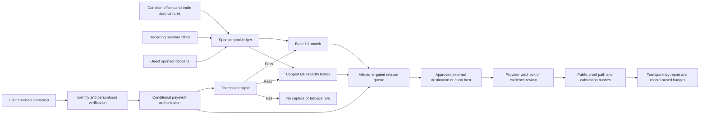
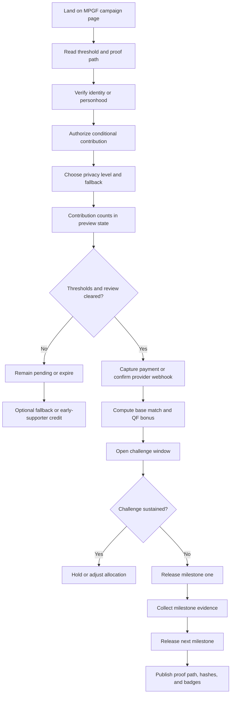

# Moral Trade and Funding Moral Public Goods

## Executive summary

Moral Trade’s current public-goods mechanism is **directionally well chosen but not yet the most effective mechanism it could plausibly run**. The site’s Public Goods Fund already combines several of the right ingredients: threshold commitments, sponsor matching, a capped quadratic-funding-style breadth bonus, private-by-default participation, explicit anti-threat rules, manual evidence review, challenge paths, and public calculation hashes. In mechanism-family terms, that is much closer to the literature’s best voluntary designs than plain moral barter, ordinary appeals, or raw assurance contracts. citeturn4view3turn17view1turn17view5turn19view0turn23view0turn20view0turn31view0

But the current implementation is still a **pilot/demo** rather than a production funding institution. At inspection, the site itself said the public site was a reviewed pilot rather than a liquid exchange; it showed **0 live proposals, 8 worked examples, 2 public profiles, and 0 completed agreements**. The MPGF technical page also said **Phase A failed**, the **mechanism check failed**, there were **51 blockers**, mode was **pledge only**, real-money mode was disabled or acceptance-gated, and public financial summaries were non-real-money only. The May 2026 round page showed a sponsor pool and match calculations, but also showed **released in ledger: $0** and the site elsewhere said **external payouts remain $0**. citeturn11view1turn17view0turn17view2turn4view4

The strongest literature-backed conclusion is therefore twofold. First, **if the benchmark is “the best macro mechanism in general,”** the prioritized Forethought note is skeptical that any purely voluntary mechanism robustly solves the moral-public-goods problem; it tentatively leans toward taxation/public institutions as the strongest large-scale solution. Second, **if the benchmark is “the best voluntary mechanism a platform like Moral Trade can implement,”** the best available design is a **hybrid**: verified conditional commitments, low-friction payment authorization, threshold assurance, sponsor-funded base matching, capped quadratic breadth bonuses, and strong anti-manipulation controls. citeturn27view0turn27view2turn31view0turn36view3turn35view0

My central design recommendation is to turn Moral Trade’s MPGF into a **Trade-Surplus-Funded Verified Plural Assurance mechanism**. The key improvement is not just “better checkout.” It is to make the sponsor pool endogenous to the platform’s own moral-trade activity: route agreed **surplus** from donation offsets, optional tithes from successful trades, and recurring member commitments into MPGF sponsor pools; then allocate those pools via **threshold-gated 1:1 base match plus capped QF bonus**, under proof-of-personhood, proof-of-payment, challenge windows, and pluralist governance. That directly answers Forethought’s question of where matching funds come from in voluntary systems, and it exploits the specific comparative advantage of a moral-trade platform rather than imitating a generic grants website. citeturn2view1turn9view5turn17view1turn26view5turn20view0

My credences are: about **0.8** that the current mechanism is **not** the most effective currently implementable mechanism for Moral Trade; about **0.75** that the largest near-term gains would come from **integrated conditional payment flows plus stronger identity and sponsor-pool replenishment**; and only about **0.35–0.45** that any purely voluntary platform, even an improved one, can solve the moral-public-goods problem at the same level that a coercive tax-and-spend institution could in the strongest theoretical cases. Those credences are a synthesis of the site inspection, the Forethought skepticism about voluntary contracts, the QF literature, and empirical evidence on matching and crowdfunding coordination. citeturn27view0turn27view2turn31view0turn31view4turn37view0

## What Moral Trade currently does

Moral Trade presents itself as a **pilot institution for cooperation under disagreement**, not as a mature marketplace. Its public router deliberately steers visitors into four paths — learn, test an example, donate, or join/build — and explicitly says the site should not be mistaken for a liquid market. It also keeps primer, examples, and donation routes readable before signup. That is a safety-conscious architecture, but it also means the public-goods mechanism lives inside an intentionally constrained pilot rather than a high-throughput funding system. citeturn8view0turn11view1turn4view8

The Public Goods Fund is described by the site as the pilot’s **main test of moral-public-goods coordination**. The observable flow is: **pay externally**, **submit evidence**, and **wait for review before counting**. The platform says it does **not** currently hold funds, provide escrow, or operate integrated checkout; instead it relies on approved external destinations, manual evidence submission, and reviewer verification. The round page for May 2026 exposes sponsor-pool size, deadlines, verified donor counts, amount thresholds, supporter thresholds, estimated match, final match, milestone releases, review reasons, appeal status, and public hashes. citeturn4view0turn9view2turn17view1turn17view5

At a technical level, the site exposes a fairly serious public specification surface. Public pages say routes are expected to resolve into **server-rendered content, validator JSON, or a recoverable route error state**. The technical spec and health JSON describe a public API contract, public schema registry, review statuses, state transitions, provenance objects, append-only persistence tables, privacy classes, redaction boundaries, and public reasoning packets. The health JSON says the core data model covers **27 entities** and **9 privacy classes**; the technical spec lists public routes such as `GET /api/moral-trade/health` and `GET /api/offers`, and describes append-only provenance tables for evidence artifacts, claims, review decisions, and state transition events. The actual framework is **not specified**, so any implementation blueprint necessarily rests on stack assumptions rather than confirmed framework details. citeturn8view0turn6view3turn6view4turn6view5turn6view6turn7view1

The current reputation and visibility posture is deliberately sparse. The People directory says public profiles appear only after explicit opt-in or publishing offers, and that the goal is accountability around reviewable trades **not** follower/karma/comment leaderboards. It sorts by reviewed records and open offers, and hides empty social counters. In the sample public profiles on inspection, there were no reviewed public records yet. For donor/public-goods visibility, the MPGF pool pages say pledges can remain private by amount, show a supporter name only, or publish a short public reason; donor rows and receipt URLs are excluded from public round pages. That is good privacy design, but it also limits social proof at a stage when the site currently has very little organic liquidity. citeturn13view0turn19view0turn12view3

Governance is only partially institutionalized. The team/governance page says the current public operator route is a support email, that reviewer roles and conflict rules are in the validation rulebook, and that **named advisors and external reviewers are not yet publicly listed**. The About and Pilot Status pages also say mature reviewer governance, broad social proof, escrow, custody, and automated outreach do not yet exist. That matters because the prioritized literature treats trust, transaction-cost reduction, and institutional support as central to realizing gains from moral trade. citeturn12view0turn4view8turn11view1turn25view0

A compact inspection summary is below.

| Aspect | Observed state | Implication |
|---|---|---|
| Architecture | Public routes are server-rendered or validator JSON; API/schema/provenance are publicly documented; health JSON reports 27 entities and 9 privacy classes. citeturn8view0turn6view3turn6view4turn7view1 | Strong auditability; framework unspecified. |
| User flow | Visitors are routed to learn, test examples, donate, or join/build; account pressure is intentionally deferred. citeturn8view0 | Safe onboarding, but slower activation. |
| MPGF payment flow | Pay externally, submit evidence, review before counting; integrated checkout planned, not active. citeturn4view0turn9view2 | High trust burden and high friction. |
| Matching logic | Threshold-gated **1:1** sponsor match plus **capped QF bonus** after review gates. citeturn4view3turn17view1 | Strong voluntary mechanism family. |
| Visibility/privacy | Public pages show aggregate counts, hashes, and proof paths; donor identities and receipt URLs are hidden by default; opt-in recognition exists. citeturn17view3turn19view0 | Good privacy, weaker public momentum. |
| Reputation | Reviewed-record-first directory; empty social counters hidden; no global moral ranking. citeturn13view0turn12view1turn6view2 | Sound normatively; little usable trust signal yet. |
| Governance | Rulebooks public; named reviewer/advisor roster not yet public. citeturn12view0 | Institutional trust surface still thin. |
| Production readiness | Site snapshot: 0 live proposals, 8 examples, 0 completed agreements; MPGF spec says Phase A failed, blockers 51; public release totals were zero at inspection. citeturn11view1turn17view0turn17view2 | Not yet the frontier-effective implementation. |

## What the prioritized literature implies

Toby Ord’s paper makes the foundational point that **moral trade is an incomplete market**. Standard economics technically already includes moral preferences in “preferences,” but in practice markets for moral trade are strikingly underdeveloped. Ord explicitly argues that the simple cases of moral barter could be extended through **markets, bargaining, quasi-currency, and professionalization**, and he points to historical examples such as vote-swapping sites and the idea of **Repledge-like systems** that match opposed donations and automatically cancel them out. He even sketches a design where participants announce willingness to cancel donations at different rates, analogous to limit orders in a market. That is highly relevant to Moral Trade, because it suggests that a genuinely effective platform should not stop at logging bilateral promises; it should build market structure around matching, routing surplus, and reducing search/transaction costs. citeturn21view6turn21view1turn22view2turn22view3

Ord also identifies **trust** as the major practical obstacle. He distinguishes **factual trust** from **counterfactual trust**: not just “did the person do what they said?” but also “would they have done it anyway absent the trade?” He argues that factual trust can often be mitigated through checking, receipts, ongoing interaction, and eventually legal/customary support, but counterfactual trust is much harder, especially over long horizons. He says counterfactual trust is minimized when commitments are short, legible, and made among parties of known character. This strongly supports Moral Trade’s emphasis on explicit baselines, evidence rules, challenge windows, and shorter commitment cycles; it also supports building the public-goods mechanism around **verified, short-cycle, thresholded commitments** rather than long vague promises. citeturn21view3turn22view1

The Forethought note on moral public goods adds a second, crucial layer. It argues that where many agents have **idiosyncratic** aims they care about a lot and **consensus** aims they each care about a little, coordination on moral public goods can create far larger gains than narrow bilateral compromise. In their illustrative model, when power is widely distributed and coordination is possible, the effective “price” of the consensus good can collapse dramatically, so each small sacrifice of idiosyncratic spending can buy a huge amount of consensus good. They therefore conclude that broad power distribution plus coordination mechanisms for moral public goods can matter enormously for how good the future goes. citeturn23view0turn27view0

That same note is also strikingly skeptical about **purely voluntary contract solutions**. It argues that assurance contracts are brittle, threshold assurance contracts still leave people worrying about whether they are pivotal, dominant assurance contracts do not solve the basic free-riding logic, and one-shot voluntary mechanisms often fail unless gains from trade are extraordinarily large. The Appendix C model shows that even when a public good is strongly in everyone’s collective interest, threshold assurance can still fail with high probability because each individual hopes others will pay. The paper also notes that quadratic funding can improve incentives by changing prices, but it depends on an **outside matching pool**, and it is not obvious where that pool comes from absent a government or other sponsor. citeturn27view1turn27view2turn27view3turn26view5

This yields an important design implication. If Moral Trade wants to do well as a **voluntary** platform, it should not rely on assurance logic alone. It should instead combine assurance with a sponsor pool and breadth-sensitive allocation — that is, exactly the design family of **assurance plus matching plus QF-style breadth rewards**. But it must also solve, or partly solve, the sponsor-funding problem that Forethought flags. That is where a moral-trade-native platform has a special advantage: it can replenish sponsor pools from **trade surplus** arising inside its own exchange ecosystem. citeturn27view2turn26view5turn22view3

The Forethought essay on convergence and compromise sharpens the institutional lesson. It argues that the right institutions must exist to support trade, that realized gains depend on transaction costs actually being low, and that gains can be enormous when groups care a lot about outcomes that others can cheaply help bring about. At the same time, it warns that **threats** can destroy most of the potential value of trade and that concentration of power reduces the odds that morally important views are represented. This supports four concrete requirements for Moral Trade: explicit anti-threat rules, wide participation, low transaction friction, and institutions that make positive-sum bargains salient and executable. The current site already takes threats seriously; the main remaining gap is friction and scale. citeturn25view0turn24view1turn24view3turn24view4

Two additional sources help choose among mechanisms. The original QF paper says the quadratic formula can yield first-best public-goods provision under a standard model and that variants can protect against collusion and aid coordination. Gitcoin’s mechanism pages show why QF has become the leading deployed democratic allocation mechanism: it amplifies broad support, but its integrity depends on **identity verification**, **sybil resistance**, and **post-round review**, and it remains vulnerable to collusion and sponsor-pool scarcity. Meanwhile, Dean Karlan and John List’s field experiment found that **matching grants increase donation response and revenue per solicitation**, but larger match ratios beyond **1:1** did not add further impact in that experiment. Taken together, this suggests that Moral Trade’s current choice of a **1:1 base match plus capped breadth bonus** is sensible — and that the real frontier is not a bigger headline match ratio, but lower friction, better identity, and a more durable source of sponsor capital. citeturn31view0turn36view3turn35view0turn31view4

## Mechanism comparison

The table below is a qualitative synthesis of the prioritized sources, the site inspection, and additional primary/official sources. “Effectiveness” here means **expected effectiveness for funding moral public goods on a voluntary platform like Moral Trade**, not absolute effectiveness at the scale of states or taxation. citeturn27view0turn31view0turn31view4turn37view0

| Mechanism | Effectiveness | Scalability | Incentive-compatibility | Vulnerability to manipulation | Implementation complexity | UX friction | Evidence strength |
|---|---|---:|---|---|---|---|---|
| Tax-financed public budgeting | Very high | Very high | High once politically established | Medium | Very high | Low for users | Strong theoretical and real-world default benchmark; Forethought tentatively treats government/tax power as the strongest large-scale solution. citeturn27view0turn27view2 |
| Pairwise moral barter / pledge swaps | Low to medium for **public goods** | Low | Medium | Medium to high through factual/counterfactual trust problems | Medium | High | Strong theoretical grounding in Ord, but poor fit for aggregating many small consensus interests. citeturn20view0turn21view3turn23view0 |
| Donation offsets to compromise destinations | Medium | Medium | Medium | Medium if baselines are fake/coercive | Medium | Medium | Good fit to Ord’s Repledge-style logic; current site sensibly adds anti-threat and baseline rules. citeturn22view3turn2view1 |
| Plain matching grants | Medium | High | Medium to high | Low | Low | Low | Strong field evidence that matching raises response and revenue, but larger ratios beyond 1:1 did not help in the classic field experiment. citeturn31view4 |
| Assurance contracts | Medium in theory, often low in practice | Medium | Low to medium because of free-riding | Low | Low to medium | Medium | Forethought models them as brittle and often unlikely to clear in realistic cases. citeturn27view1turn27view3 |
| Dominant assurance contracts | Medium | Medium | Medium | Low to medium | Medium | Medium | Tabarrok shows strong theoretical improvement, but Forethought argues they do not solve the core free-riding problem for moral public goods. citeturn31view3turn27view1 |
| Threshold crowdfunding with early refund bonuses | Medium to high | Medium | Medium to high | Medium | Medium | Medium | Experimental evidence suggests early refund bonuses materially improve success rates by encouraging early cooperation. citeturn37view0 |
| Pure quadratic funding | High if sponsor pool and identity stack exist | High | Medium | High without sybil/collusion defenses | Medium to high | Medium | Strong theory and meaningful real-world deployment, but sponsor-pool and integrity problems remain central. citeturn31view0turn36view3turn35view0 |
| Moral Trade’s current Verified Assurance Matching | Medium to high in concept; medium in present implementation | Medium | Medium to high | Medium | Medium to high | High | Conceptually strong hybrid: thresholds + 1:1 match + capped QF + review. But still demo-mode, manual-evidence, zero-release-at-inspection, sparse user base. citeturn4view3turn17view1turn17view0turn11view1 |
| **Proposed trade-surplus-funded verified plural assurance** | **Highest among plausible voluntary Moral Trade mechanisms** | High | High | Medium | High | Medium | Synthetic mechanism built from the strongest components above: endogenous sponsor pool + verified conditional commitments + 1:1 base match + capped QF + plural governance + anti-sybil controls. citeturn22view3turn26view5turn31view0turn31view4turn37view0turn35view0 |

The central verdict is straightforward. **Current Moral Trade is already in the right mechanism family**, but it is **not the most effective possible implementation of that family**. If the platform remained purely on manual evidence and demo sponsor pools, it would leave too much value on the table. The best next step is not to abandon its design philosophy. It is to **complete** it: make commitments conditional but easy, make matching funds endogenous to moral trade itself, and make the breadth signal more trustworthy. citeturn4view3turn17view0turn26view5turn35view0

## An improved mechanism for Moral Trade

I recommend replacing the current MPGF prototype with a production mechanism I will call **Trade-Surplus-Funded Verified Plural Assurance**. It is “plural” because it avoids a global moral ranking and instead supports many overlapping moral constituencies; “assurance” because funds only move after threshold and review gates clear; and “trade-surplus-funded” because the sponsor pool is replenished from the platform’s own exchange activity rather than depending only on exogenous donors. This keeps the core intuition of the current MPGF, but closes the most important theoretical and practical gaps. citeturn4view3turn26view5turn22view3

### Design logic

The mechanism should have **three money layers**.

The first layer is **direct donor commitment**. A donor selects a campaign, verifies identity/personhood, authorizes a payment or commits to an approved external payment route, and chooses default visibility. The payment does not count until identity and destination gates pass; it does not capture or settle until the campaign passes **amount threshold**, **supporter threshold**, and **review threshold**. This preserves the assurance logic that current Moral Trade already favors, but removes today’s manual-evidence bottleneck whenever provider integrations exist. citeturn4view0turn17view1turn36view3

The second layer is a **base sponsor pool**. Campaigns that clear threshold get a **1:1 base match**, capped per campaign. That 1:1 rate is enough to create a clear price signal while avoiding the false instinct that ever-larger match ratios are the main lever. The strongest empirical evidence we have here is that matching matters, but bigger-than-1:1 ratios did not add extra impact in the classic field experiment. citeturn31view4

The third layer is a **capped quadratic breadth bonus**. After threshold clearance, the platform allocates a separate bonus budget in proportion to an identity-weighted quadratic score. This rewards **broad verified support**, not just total dollars. The QF paper supports that structure theoretically; Gitcoin’s experience makes clear that it must be paired with personhood/identity checks, sybil review, collusion analysis, and post-round adjustment. Moral Trade’s current emphasis on “identity confidence only, no moral reputation” is normatively sound and should remain. citeturn31view0turn36view3turn35view0turn17view1

What makes this mechanism specifically appropriate for Moral Trade is the **sponsor-pool refill**. Forethought correctly asks where voluntary matching funds come from. Moral Trade already has two partial answers on the site today: donation offsets require an explicit **surplus rule**, and the separate Priority Correction Fund page already proposes routing **10% of recent donations and payments** into a monthly plural-allocation process. Those ideas should be merged into MPGF. Successful donation offsets, opt-in trade tithes, and recurring member commitments should replenish sponsor pools that are then allocated to moral public goods. In other words, the platform should convert the **surplus from moral disagreement** into public-goods matching capital. That is the most distinctive improvement available to a moral-trade platform. citeturn2view1turn9view5turn22view3turn26view5

### Allocation rule

For each campaign \(i\), define verified counted contributions \(c_{ij}\) from participant \(j\), after per-person caps, duplicate-proof checks, and identity weighting \(w_j \in [0,1]\). Then compute:

```text
counted_i = Σ_j min(c_ij, donor_cap) * w_j

if counted_i < amount_threshold_i: ineligible
if unique_verified_supporters_i < supporter_threshold_i: ineligible
if review_state_i not in {approved, challenge_window_closed}: ineligible

base_match_i = min(counted_i, base_match_cap_i) * base_match_rate_i   // default 1.0

qf_raw_i = max(0, (Σ_j sqrt(min(c_ij, donor_cap) * w_j))^2 - counted_i)

qf_adj_i = qf_raw_i * anti_collusion_factor_i

qf_bonus_i = qf_bonus_budget * qf_adj_i / Σ_k qf_adj_k

total_release_i = counted_i + base_match_i + qf_bonus_i
```

The campaign should not receive immediate full release. Instead, preserve the site’s existing instinct for **milestone-gated payouts** — for example 40/30/30 — where external provider confirmation, destination proof, and milestone evidence control successive releases. That is consistent with the current MPGF round pages. citeturn16view1turn19view0turn36view3

### Governance and pluralism

Governance should be **two-stage and role-limited**.

The first stage is **eligibility review**. This checks anti-threat baseline integrity, destination legitimacy, evidence sufficiency, duplicate-proof rejection, and appeal/challenge standing. This stage is not allowed to decide which cause is “best.” It only decides which campaigns are safe and valid to include. That matches the site’s existing trust split, validation posture, and no-global-ranking rule. citeturn11view0turn12view2turn6view2

The second stage is **plural sponsor-pool governance**. Instead of a single platform ranking, sponsors and participants allocate budgets across pool categories using a parliamentary or proportional procedure, preserving disagreement rather than pretending it away. The parliamentary approach to moral uncertainty is a natural conceptual template here: represent competing moral perspectives proportionally and let them bargain over public rules for allocating sponsor budgets. On-platform, that means budgets for pool categories, weight ceilings, and tie-break rules can be decided pluralistically without collapsing into a single moral score. citeturn32view0

### Visibility and reputation

Moral Trade is right not to build “moral karma.” But it does need more **record-based trust**. The site should therefore add only **procedural reputation**, not value-based reputation: verified supporter badge, successful fulfillment badge, early assurance supporter badge, sponsor-pool contributor badge, challenge-cleared badge. No one gets a “better morality” score. This is consistent with the current People directory philosophy and would create more trustworthy public records without violating the site’s own norms. citeturn13view0turn11view0

### Anti-manipulation and privacy

The improved mechanism must assume an adversarial environment. Gitcoin’s own QF materials emphasize sybil resistance, post-round review, and pairwise/cluster coordination analysis; their sybil-resistance page explicitly treats the problem as an ongoing arms race. Moral Trade already has a privacy-safe background-matching philosophy, provenance objects, redaction policies, and challenge/appeal workflows; those should be reused for MPGF. Minimum controls should include proof-of-personhood or strong multi-factor identity, per-person caps, duplicate-proof hashing, coordination-cluster penalties, delayed public donor details, opt-in recognition, public aggregate hashes, and small-sample suppression in transparency reports. Long-term, MACI-like private contribution encryption or similar anti-bribery tooling can be added for higher-stakes rounds. citeturn35view0turn36view3turn14view0turn12view3turn6view5turn6view6

The architecture below shows the proposed mechanism.



This architecture is an extension of the observable current MPGF design — external destinations, review gates, hashes, privacy-safe public data — plus the additional sponsor-flywheel and lower-friction commitment layers that the literature suggests are missing. citeturn4view0turn17view5turn19view0turn9view5turn36view3

The user flow should look like this.



That flow reduces the dominant current pain point — manual proof after offsite donation — while preserving the review and anti-threat discipline that is core to the site’s philosophy. citeturn4view0turn9view2turn12view2

## Codex build instructions

The site does **not** publicly disclose its framework, so the build plan below assumes a modern **TypeScript monorepo with server-rendered web routes, JSON APIs, and a Postgres database with row-level-security-like policies**. That assumption is based on the public route model, API contract, schema registry, and append-only provenance tables documented by the site, but the exact stack remains unspecified. Adapt the scaffolding to the real repository if it differs. citeturn8view0turn6view3turn6view4turn6view6turn7view1

### Build sequence for Codex

**Step one:** preserve existing philosophy and invariants.

Codex should first read the current public contracts and keep these invariants fixed: no hidden global moral ranking, explicit anti-threat checks, explicit evidence states, privacy-safe public output, human review before irreversible state changes, and append-only provenance for major transitions. Do **not** replace these with opaque ranking, auto-approval, or engagement-maximizing heuristics. Those constraints are not incidental; they are the platform’s trust model. citeturn6view1turn6view2turn11view0

**Step two:** implement production contribution intents.

Add first-class objects for `pledge_intent`, `identity_verification`, `payment_authorization`, and `provider_payment_event`. Current MPGF pages still require users to pay externally and submit manual evidence. Codex should change the primary flow to: verify identity, authorize payment conditionally, and only fall back to manual evidence when provider integration is unavailable. citeturn4view0turn9view2

**Step three:** implement the sponsor-pool flywheel.

Create a sponsor-pool ledger that can be topped up by direct sponsor deposits, optional recurring member tithes, and surplus routed from donation offsets and other successful trades. Because the site already has explicit “surplus rule” language on offsets and a separate Priority Correction Fund concept, Codex should unify those into a common sponsor-ledger primitive rather than building another isolated fund page. citeturn2view1turn9view5

**Step four:** implement round finalization math as deterministic, replayable code.

Write the threshold, base-match, QF, anti-collusion, and milestone-release logic in a dedicated mechanism package with pure functions, exact integer accounting, and stable hash outputs. The site already publishes calculation hashes and emphasizes exact integer budget balance in the MPGF spec; preserve that standard. citeturn17view0turn17view5

**Step five:** add integrity review and public proof paths.

Every finalized round should produce a public calculation artifact with: counted aggregate donations, supporter counts, threshold status, base match, QF bonus, penalties applied, release status, proof-path IDs, and append-only hashes. Public outputs should remain aggregate by default; donor-level data should remain private unless the donor opted in to recognition. citeturn17view5turn19view0turn12view3

**Step six:** add record-based supporter reputation.

Add badges and counters only for verified procedural facts: verified supporter, fulfilled pledge, sponsor contributor, appeal-cleared contribution, and early supporter. Keep all follower/karma/comment affordances off until they carry genuine review value. citeturn13view0

### Suggested code scaffolding

```text
apps/
  web/
    app/
      mpgf/
        page.tsx
        rounds/[roundId]/page.tsx
        campaigns/[campaignId]/page.tsx
        contribute/page.tsx
        proof/[proofPathId]/page.tsx
      governance/
        mpgf/page.tsx
      api/
        mpgf/...
  worker/
    src/
      reconcileProviderEvents.ts
      finalizeRound.ts
      releaseMilestones.ts
      detectCoordination.ts

packages/
  mechanism/
    src/
      threshold.ts
      baseMatch.ts
      qf.ts
      antiCollusion.ts
      sponsorLedger.ts
      hashes.ts
      stateMachine.ts
  schemas/
    src/
      mpgf-round.schema.ts
      pledge-intent.schema.ts
      sponsor-commit.schema.ts
      proof-path.schema.ts
      governance-ballot.schema.ts
  review/
    src/
      antiThreat.ts
      duplicateProof.ts
      destinationChecks.ts
      challengeWorkflow.ts
```

This structure mirrors the site’s observable split between public routes, API/validator contracts, and append-only review/provenance logic. citeturn8view0turn6view4turn6view5

### API endpoints

Use existing API patterns where possible and add the following endpoints.

```text
POST   /api/mpgf/rounds/:roundId/pledge-intents
POST   /api/mpgf/pledge-intents/:id/verify-identity
POST   /api/mpgf/pledge-intents/:id/authorize-payment
POST   /api/mpgf/provider-events/webhook
POST   /api/mpgf/evidence/manual
POST   /api/mpgf/sponsor-pools/:poolId/deposits
POST   /api/mpgf/trade-surplus/commit
POST   /api/mpgf/trade-surplus/settle
POST   /api/mpgf/rounds/:roundId/finalize-preview
POST   /api/mpgf/rounds/:roundId/finalize
POST   /api/mpgf/rounds/:roundId/release
POST   /api/mpgf/challenges
POST   /api/mpgf/appeals
POST   /api/mpgf/governance/ballots

GET    /api/mpgf/rounds/:roundId
GET    /api/mpgf/rounds/:roundId/proof
GET    /api/mpgf/rounds/:roundId/hash
GET    /api/mpgf/campaigns/:campaignId
GET    /api/mpgf/campaigns/:campaignId/proof-path
GET    /api/mpgf/sponsor-pools/:poolId
GET    /api/mpgf/governance/results
```

Endpoints that mutate state should require explicit auth, provenance event writing, and idempotency keys. Public endpoints should expose only aggregate or opt-in-recognized information. That is consistent with the current privacy and provenance posture. citeturn6view4turn6view5turn6view6

### Core database schema

Reuse existing provenance/evidence tables where possible. Add the following core entities.

```sql
create table mpgf_rounds (
  id text primary key,
  slug text unique not null,
  status text not null,
  closes_at timestamptz not null,
  base_match_budget_cents bigint not null,
  qf_bonus_budget_cents bigint not null,
  early_support_budget_cents bigint not null default 0,
  donor_cap_cents bigint not null,
  created_at timestamptz not null default now()
);

create table mpgf_campaigns (
  id text primary key,
  round_id text not null references mpgf_rounds(id),
  pool_id text not null,
  title text not null,
  amount_threshold_cents bigint not null,
  supporter_threshold int not null,
  base_match_cap_cents bigint not null,
  base_match_rate_bps int not null default 10000,
  destination_type text not null,
  destination_ref text not null,
  review_state text not null,
  visibility_state text not null default 'public_aggregate'
);

create table mpgf_pledge_intents (
  id text primary key,
  round_id text not null references mpgf_rounds(id),
  campaign_id text not null references mpgf_campaigns(id),
  user_id text not null,
  amount_cents bigint not null,
  identity_weight_bps int not null default 0,
  payment_state text not null,
  counting_state text not null,
  visibility_pref text not null default 'private_amount',
  fallback_rule jsonb not null,
  created_at timestamptz not null default now()
);

create table mpgf_payment_authorizations (
  id text primary key,
  pledge_intent_id text not null references mpgf_pledge_intents(id),
  provider text not null,
  provider_ref text not null,
  amount_cents bigint not null,
  status text not null,
  authorized_at timestamptz,
  captured_at timestamptz
);

create table mpgf_sponsor_pools (
  id text primary key,
  slug text unique not null,
  balance_cents bigint not null default 0,
  restricted_to_round_id text references mpgf_rounds(id),
  created_at timestamptz not null default now()
);

create table mpgf_sponsor_deposits (
  id text primary key,
  sponsor_pool_id text not null references mpgf_sponsor_pools(id),
  source_type text not null, -- direct_deposit | donation_offset_surplus | member_tithe
  source_ref text not null,
  amount_cents bigint not null,
  status text not null,
  created_at timestamptz not null default now()
);

create table mpgf_round_allocations (
  id text primary key,
  round_id text not null references mpgf_rounds(id),
  campaign_id text not null references mpgf_campaigns(id),
  counted_cents bigint not null,
  verified_supporters int not null,
  base_match_cents bigint not null,
  qf_raw_cents bigint not null,
  qf_bonus_cents bigint not null,
  anti_collusion_factor_bps int not null,
  final_total_cents bigint not null,
  calculation_hash text not null,
  created_at timestamptz not null default now()
);

create table mpgf_coordination_flags (
  id text primary key,
  round_id text not null references mpgf_rounds(id),
  campaign_id text not null references mpgf_campaigns(id),
  cluster_key text not null,
  severity text not null,
  penalty_bps int not null,
  rationale jsonb not null,
  created_at timestamptz not null default now()
);
```

These tables should be supplemented, not replaced, by the site’s existing evidence, review-decision, traceability-event, and state-transition tables. Provenance should remain append-only. citeturn6view5turn6view6turn7view1

### Backend pseudocode

```ts
export async function finalizeRound(roundId: string) {
  const round = await db.rounds.get(roundId);
  const campaigns = await db.campaigns.forRound(roundId);

  const counted = await loadEligibleContributions(roundId);
  // includes identity weight, cap, duplicate-proof rejection, auth status

  const coordination = await detectCoordinationClusters(roundId, counted);

  const provisional = campaigns.map((campaign) => {
    const contribs = counted.filter(c => c.campaignId === campaign.id);
    const countedAmount = sum(contribs.map(c => c.countedCents));
    const supporters = uniq(contribs.map(c => c.userId)).length;

    const eligible =
      countedAmount >= campaign.amountThresholdCents &&
      supporters >= campaign.supporterThreshold &&
      campaign.reviewState === "approved";

    if (!eligible) {
      return {
        campaignId: campaign.id,
        countedAmount,
        supporters,
        baseMatch: 0,
        qfRaw: 0,
        antiCollusionBps: 10000
      };
    }

    const baseMatch = Math.min(countedAmount, campaign.baseMatchCapCents)
      * campaign.baseMatchRateBps / 10000;

    const qfBase =
      Math.pow(
        sum(contribs.map(c => Math.sqrt(c.countedCents * c.identityWeightBps / 10000))),
        2
      ) - countedAmount;

    const antiCollusionBps = coordinationPenaltyFor(campaign.id, coordination);

    return {
      campaignId: campaign.id,
      countedAmount,
      supporters,
      baseMatch,
      qfRaw: Math.max(0, Math.floor(qfBase)),
      antiCollusionBps
    };
  });

  const adjustedScores = provisional.map(p => ({
    ...p,
    qfAdj: Math.floor(p.qfRaw * p.antiCollusionBps / 10000)
  }));

  const totalAdj = sum(adjustedScores.map(x => x.qfAdj));
  const finalRows = adjustedScores.map(p => ({
    ...p,
    qfBonus: totalAdj === 0 ? 0 : Math.floor(round.qfBonusBudgetCents * p.qfAdj / totalAdj),
    finalTotal: p.countedAmount + p.baseMatch + (
      totalAdj === 0 ? 0 : Math.floor(round.qfBonusBudgetCents * p.qfAdj / totalAdj)
    )
  }));

  assertBudgetBalanced(finalRows, round.qfBonusBudgetCents, round.baseMatchBudgetCents);
  const calcHash = hashDeterministically(finalRows);

  await writeAllocationsAndProvenance(roundId, finalRows, calcHash);

  return { roundId, calcHash, finalRows };
}
```

This math should be property-tested for budget balance, monotonicity, determinism, and invariance under row order changes. It should also write public calculation hashes and private provenance events on every state transition. citeturn17view0turn17view5turn6view6

### Testing plan

Use five test layers.

First, **unit tests** for thresholds, base-match math, QF math, anti-collusion penalties, visibility defaults, and milestone release schedules. These should include cap edge cases, near-threshold edge cases, and round-budget exhaustion. The current public technical material makes deterministic correctness and exact accounting central, so this layer is non-negotiable. citeturn17view0

Second, **property tests**. Verify that allocations are permutation invariant, total match never exceeds configured budgets, and duplicate proofs or repeated identities cannot increase counted breadth.

Third, **integration tests**. Simulate provider authorization, webhook settlement, manual evidence fallback, challenge opening, appeal resolution, and milestone release.

Fourth, **adversarial tests**. Create sybil clusters, pairwise coordination rings, duplicate receipt reuse, failed-threshold campaigns, and high-volume sparse-query abuse. The current site already has anti-enumeration and privacy-safe telemetry logic in background networking; the funding layer should inherit that design discipline. citeturn14view0

Fifth, **end-to-end tests**. Run the full public flow: discover campaign, verify identity, authorize payment, clear threshold, finalize round, open proof path, resolve challenge, release milestone. Also run the failed-threshold branch and ensure no illicit capture or false public claim.

## Roadmap and limitations

A realistic roadmap should be phased.

| Phase | Scope | Estimated effort | Primary risks |
|---|---|---:|---|
| MVP | Productionize current MPGF family: identity verification, payment authorization, provider webhooks, threshold counting, 1:1 base match, capped QF bonus, proof paths, public hashes, release workflow. | 6–10 engineer-weeks | Provider integration, compliance boundaries, state-machine bugs |
| Medium-term | Add sponsor-pool flywheel: donation-offset surplus routing, recurring member tithe, sponsor deposits, record-based badges, minimal coordination penalties, named governance roster, better transparency reports. | 8–14 engineer-weeks | Governance disputes, sponsor-pool accounting complexity, weak adoption of opt-in tithe |
| Long-term | Add privacy-preserving anti-collusion and plural governance: parliamentary budget controls, stronger proof-of-personhood, MACI-like encrypted contribution paths where appropriate, automated fallback bonuses for early supporters, onchain sponsor vaults if desired. | 12–24 engineer-weeks | Higher regulatory/privacy complexity, cryptographic UX, governance overhead |

The priority order should be: **remove manual friction**, **strengthen identity/integrity**, **create endogenous sponsor refills**, **then add richer plural-governance tooling**. That order tracks both the literature and the site’s current bottlenecks. Matching already matters; the bigger constraint now is that Moral Trade does not yet have a production funding loop. citeturn31view4turn35view0turn17view0

There are also real limitations to this assessment. The publicly visible site does **not** specify its exact application framework, provider contracts, or real internal governance operations. Some pages are explicitly demo-only; some direct JSON endpoints were unavailable for open inspection; and the public reviewer roster is intentionally incomplete. I therefore have high confidence in the mechanism diagnosis, medium confidence in the implementation assumptions, and lower confidence in any estimate of likely adoption speed given the site’s currently small public activity. citeturn12view0turn11view1turn17view0

The bottom line is clear: **Moral Trade’s current MPGF is not the most effective mechanism possible for the platform, but it is very close to the right design family.** The winning move is to **finish the mechanism**, not to replace its philosophy: connect moral-trade surplus to sponsor capital, lower commitment friction, preserve explicit review and anti-threat safeguards, and make breadth-sensitive matching trustworthy enough to matter. citeturn4view3turn26view5turn31view0turn35view0