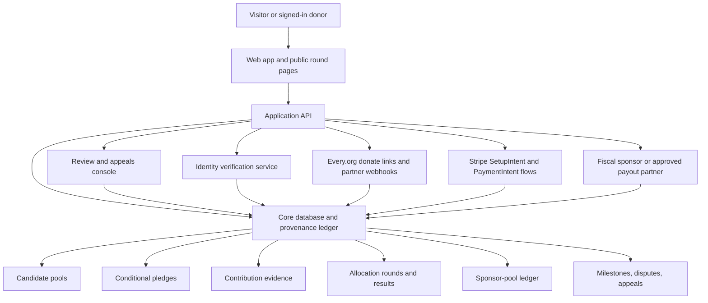
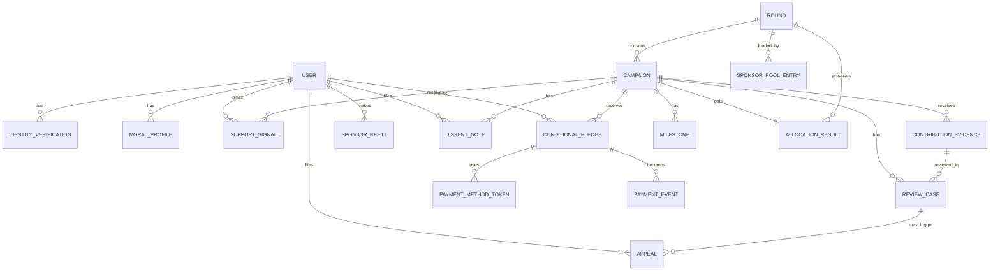
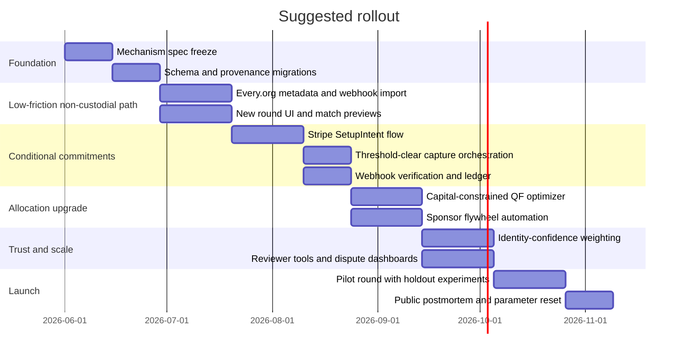

# Funding Moral Public Goods on Moral Trade

## Executive summary

My bottom-line judgment is **no**: the current mechanism on **moraltrade.org** is **not** the most effective mechanism currently available for a **voluntary** platform trying to motivate spending on moral public goods. My credence in that judgment is about **0.8**. The site is directionally well-designed: it already uses threshold commitments, verified supporter counts, sponsor matching, a quadratic-funding-style bonus, explicit anti-threat rules, dissent and appeal paths, milestone-gated release, and a strong “no global moral ranking” posture. But the site also describes itself as a **reviewed pilot**, not a liquid exchange; the public snapshot shows **0 live proposals** and **0 completed agreements**; the Public Goods Fund round is explicitly a **demo**; and integrated checkout is **planned, not active**, with manual evidence and external handoffs still doing much of the work. That means the current mechanism is promising in theory but not yet the most effective in practice. citeturn34view0turn1view3turn9view6turn20view1turn29view0

If the comparison class includes states or other coercive institutions, the answer is even clearer. Forethought’s analysis argues that, in the causal case, moral public goods are funded best when power is broadly distributed **and governments can tax to fund consensus goods**; it is explicitly skeptical that voluntary mechanisms alone robustly solve the free-rider problem. But for a **voluntary platform** like Moral Trade, the strongest design target is not simple donations, not dominant-assurance contracts alone, and not pure quadratic funding alone. The best fit is a **hybrid** that preserves Moral Trade’s safety posture while improving coordination and throughput: **Common-Ground Verified Quadratic Assurance Funding**, or **CG-VQAF**. citeturn14view5turn14view2turn14view0turn23view0turn24view3

CG-VQAF should combine five elements. First, **common-ground discovery**: identify public goods that receive at least weak support from multiple moral camps, not just one constituency. Second, **conditional commitments**: donations execute only if amount, supporter-count, review, and challenge gates pass. Third, **sponsor-funded assurance plus a capital-constrained quadratic bonus**: a guaranteed base match for threshold-cleared campaigns, then a budget-constrained QF bonus that rewards donor breadth rather than a few large checks. Fourth, **strong identity and anti-collusion controls**: broad donor support only matters if donors are plausibly distinct humans or otherwise high-confidence participants. Fifth, a **sponsor-pool flywheel** that automatically routes recurring tithes and a share of surplus from successful bilateral moral trades and donation offsets into future public-goods rounds. This design is the closest practical approximation, on a voluntary platform, to what the three prioritized sources imply: make overlapping moral reasons legible, keep the default counterfactual explicit, amplify broad but shallow support, and prevent threats, free-riding, and concentrated control from overwhelming gains from trade. citeturn13view8turn13view5turn14view0turn15view2turn15view3turn17view0turn18view0turn18view3turn20view2

## What the prioritized sources imply

Toby Ord’s *Moral Trade* frames the core logic cleanly: moral trade is possible when parties can move from a default state to an outcome that both regard as better by their own lights, and the operationally relevant feasible set is the set of options that are **Pareto-superior to the default**, not merely Pareto-optimal in the abstract. Ord also argues that mature moral-trade institutions could develop equivalents of **currency, markets, bargaining, and professionalization**, because ad hoc barter leaves gains unrealized. But he identifies a severe bottleneck: **trust**, especially **counterfactual trust**—the difficulty of knowing whether the other party would have done the morally valuable act anyway. He suggests that short timescales, auditable proof, and known character help, while perverse incentives remain a real concern. For a platform funding public goods, that pushes strongly toward explicit no-trade baselines, narrow and reviewable proof claims, milestone-based release, and mechanisms that prefer short, verifiable causal chains over vague “impact” claims. citeturn17view0turn18view0turn18view2turn18view3turn19view4

Forethought’s essay on moral public goods adds the key economic insight. Moral public goods are goods that many people value for moral reasons, but not usually enough to fund on their own; they are underfunded because of the standard **free-rider problem**. In the paper’s main causal model, spending on consensus goods rises dramatically when **resources are widely distributed** and **coordination is possible**, because each person’s contribution effectively receives a multiplier from the coordinated actions of others. The paper is enthusiastic about coordination technology in principle, but not naïve about voluntary institutions: it says governments are currently the strongest scalable solution, treats social norms as less scalable and less retargetable, and is skeptical that voluntary contracts alone solve the problem. It explicitly argues that ordinary assurance contracts are brittle, that dominant assurance contracts only modestly improve incentives, and that quadratic funding is attractive but depends on some **outside source of matching funds**. That combination strongly supports a hybrid mechanism with three features: conditionality, a sponsor pool, and broad-support amplification. citeturn13view8turn13view5turn14view2turn14view0turn14view5turn14view6

Forethought’s *Convergence and Compromise* essay contributes the political and institutional layer. It argues that, in many cases, there may be **enormous gains from moral trade**, especially when different views are **resource-compatible** or when there are “hybrid” goods that serve several views at once. But it also emphasizes that outcomes depend heavily on institutions, power distribution, and the prevention of **value-destroying threats**. Trade is optimistic only if the gains from trade are actually realized, if the right institutions exist, and if bargaining does not devolve into extortion or concentrated control. That is directly relevant to a platform design: the platform should not attempt to rank moral truth globally, but it should be built to discover **common-ground goods**, reduce concentration of influence, and keep anti-threat, dissent, and externality review at the center of the workflow. citeturn16view0turn16view1turn15view2turn15view3turn16view2

Taken together, the three prioritized sources support a fairly specific platform thesis. The platform should not try to fund moral public goods through unilateral “best cause” recommendations. It should instead surface goods that many moral views can weakly endorse, make contributions **conditional on collective uptake**, use some form of **matching capital** to create a multiplier for small contributors, and aggressively defend against counterfactual abuse, threats, sybils, collusion, and concentrated control. That is extremely close to Moral Trade’s current Public Goods Fund thesis, but not yet to its most effective execution. citeturn1view3turn13view8turn15view5turn18view0

## Audit of Moral Trade today

For this audit I assume, as instructed, **no specific constraint** on budget, team size, tech stack, or user-base size. Where the public site does not specify implementation details, I treat the current stack as a server-rendered web application with API routes and **Supabase**-based auth/storage, because the public technical spec explicitly references server-rendered public routes, API contracts, and Supabase auth cookies. citeturn28view5turn28view3turn7view0

The current public system is candidly framed as a pilot. The site routes new visitors into “learn, test, donate, or join/build,” keeps prototypes readable without signup pressure, and tries to prevent newcomers from mistaking examples for market liquidity. That is good product hygiene. But the same pages also make clear that this is not a mature funding institution yet: live proposals are zero, completed agreements are zero, and the strongest current use is understanding the mechanism and submitting reviewable proof artifacts. In other words, the platform has already done a lot of conceptual and governance work, but it has not yet proven it can repeatedly convert attention into funded moral public goods at scale. citeturn27view0turn34view0turn26view1

The Public Goods Fund is the site’s main current mechanism for moral-public-goods coordination. The platform describes it as a test of verified contribution intents, conditional payment authorization, sponsor matching, dissent notes, and reviewer verification for goods that many moral views can value. The public round uses **verified quadratic assurance funding** with published thresholds, verified-supporter minima, a **1:1 base match**, a **capped QF bonus**, milestone statuses, and explicit appeal or dissent paths. The round’s verification-weight policy is “identity confidence only, no moral reputation,” and the governance page prohibits token voting, karma-weighted treasury control, public reputation weighting, and mid-round retuning. Those are all genuinely strong design choices. citeturn1view3turn9view6turn20view0turn20view3

Where the mechanism underperforms is mainly in execution and discovery. Contribution flow is still heavily dependent on **manual evidence mode**, **external payment destinations**, and sign-in-gated workflows; “integrated checkout” is still planned rather than active. The contribute page says that real-money contributions would use Stripe only after production readiness, refund, webhook, and compliance gates pass. In the meantime, participants either pledge or pay externally, then return to submit proof. That is a major source of friction, and friction is deadly in donation conversion funnels. citeturn20view1turn8view8turn8view6

The current audit across the requested dimensions is summarized below.

| Dimension | What the site currently does well | What is missing or limiting | Evidence |
|---|---|---|---|
| UX | Clear “choose your path” router; no-signup primer; worked examples; explicit pilot boundaries; low-friction direct donation routes via Every.org. | Public-goods contribution still requires sign-in; manual evidence and external handoff are prominent; integrated checkout is not active; social proof is very weak because live proposals and completed agreements are both zero. | citeturn27view0turn1view6turn20view1turn34view0 |
| Incentives | Threshold amount + verified-supporter minimum; 1:1 base match; capped QF bonus; optional monthly sponsor-pool refill; sponsor flywheel idea already exists. | Sponsor pool is still demo-scale; campaign set is static and small; no donor-personalized discovery of overlapping reasons; manual proof delays the feeling of pivotality. | citeturn20view0turn20view2turn9view6turn30search1 |
| Matching | Good core intuition: “verified quadratic assurance funding” combines assurance gates with breadth-sensitive matching. | No publicly described capital-constrained optimizer for bonus allocation; thresholds appear static rather than learned; matching capital sourcing is not yet automated end-to-end. | citeturn9view5turn20view0turn20view2 |
| Reputation | The platform avoids a false moral authority: no global moral ranking, no donor moral-reputation weighting, transaction-linked badges only. | That humility costs some reusability: there is little reusable contributor/sponsor trust surface beyond narrow verification badges, and there is no public named reviewer/advisor roster yet. | citeturn20view3turn5view0turn34view3 |
| Governance | Published rules, conflicts, recusal triggers, appeal lanes, no mid-round tuning, no token voting, no sponsor micromanagement after round opens. | Named governance roles and reviewer roster are not yet public; fiscal-sponsor/partner custodian and legal review for production money movement are still pending. | citeturn20view3turn10view1turn34view3 |
| Measurability | Unusually strong privacy-safe measurement plan; public transparency report; explicit SLAs and review roles. | Actual operating data are sparse; multiple transparency metrics are zero or suppressed because sample sizes are below threshold. | citeturn2view0turn34view1turn34view2 |
| Scalability | Good documentation and validator-backed public surfaces; explicit route-recovery and API-performance targets. | The site says it is not a liquid exchange; paid-action volume scale is still blocked; manual review and manual evidence do not scale well. | citeturn34view0turn28view4turn28view3 |
| Privacy | Strong field-level grants, broad previews, app-level encryption for sensitive background text, deletion tools, analytics redaction. | The public spec does not claim platform-wide field-level encryption for every private table; privacy-preserving matching is strong conceptually but still operationally young. | citeturn11view0turn5view6turn28view3 |
| Legal and regulatory posture | Sensible non-custodial stance; partner/fiscal-sponsor separation; no tax or escrow claims; receipts and custody are kept outside the app. | Legal review for production money movement is pending; the inspected public materials do not describe a public AML/KYC or sanctions-screening framework for scaled integrated payments. | citeturn10view2turn10view1turn12view0 |

The short version is that Moral Trade’s **mechanism choice** is ahead of its **conversion plumbing** and its **market-discovery layer**. That is why I would call the present system “the right pilot mechanism family, but not the frontier implementation.” citeturn1view3turn20view1turn34view0

## Literature-to-product gap analysis

Moral Trade already implements several features that the literature strongly points toward. It uses threshold commitments instead of pure unconditional giving; it amplifies donor breadth through a QF-style bonus; it keeps anti-threat baselines explicit; it rejects global moral ranking; and it makes review scopes, conflicts, and appeals legible. Those are not superficial choices; they are exactly the kinds of design choices Ord, Forethought, and the site’s own rulebooks would lead you toward. The problem is that Moral Trade has implemented the **safety envelope** more fully than the **motivation and throughput engine**. citeturn18view0turn13view8turn15view3turn20view3turn34view2

| Literature-recommended feature | Why it matters | Moral Trade today | Gap | Evidence |
|---|---|---|---|---|
| Discover goods with broad but shallow cross-view support | Forethought’s “moral public goods” logic relies on many agents having some positive moral valuation; Convergence emphasizes resource compatibility and hybrid goods. | Static candidate pools for global health, existential risk, animal welfare, and public-interest knowledge. | No systematic overlap-discovery layer that learns where distinct moral groups have weak support in common. | citeturn13view8turn16view1turn30search1 |
| Conditional commitments with clear thresholds | Assurance logic reduces regret and can increase willingness to pledge. | Present: published amount thresholds and verified-supporter minima. | Thresholds look manually set and not obviously calibrated from historic donor behavior or pool-specific breadth. | citeturn20view0turn9view6 |
| Broad-support amplification | QF-style funding rewards many supporters rather than a single whale; this fits moral public goods especially well. | Present: capped QF bonus on threshold-cleared campaigns. | Bonus allocation appears rule-based but not explicitly optimized via a budget-constrained CLR/α-QF allocator. | citeturn9view1turn23view0turn24view3 |
| Outside matching capital | Forethought notes QF needs a source of matching funds. | Present in concept: sponsor pool, direct sponsor deposits, recurring tithes, donation-offset surplus, trade-surplus tithe. | Sponsor replenishment is not yet deeply automated, and the public round budget is still demo-sized. | citeturn14view0turn20view2 |
| Strong anti-threat, anti-perverse-incentive review | Convergence highlights threats; Ord warns about perverse incentives. | Present: anti-threat baseline, cooling-off, appeals, externality review. | Strong on paper, but not yet tested under meaningful scale or adversarial load. | citeturn15view3turn18view0turn5view7turn34view2 |
| Low-friction execution | Voluntary mechanisms fail if the conversion funnel is too costly. | Donation routes via Every.org are easy; MPGF itself is not. | Manual evidence, external handoff, and future-not-current checkout reduce conversion sharply. | citeturn1view6turn20view1 |
| Sybil resistance without moral reputation weighting | Breadth-based mechanisms are vulnerable to fake identities. | Present in a minimal form: identity confidence only, no moral reputation. | No publicly described strong unique-humanity or clustering-based anti-sybil system. | citeturn9view7turn23view5turn23view6 |
| Public trust surface | Ord emphasizes trust; the site itself emphasizes legibility. | Present: rulebooks, transparency report, validator-backed spec. | Named advisor/reviewer roster still missing; live-case evidence is sparse. | citeturn34view3turn34view1turn34view0 |
| Milestone-based release and narrow review claims | Helps with counterfactual trust and factual verification. | Present: milestone release statuses, evidence reviewer, challenge windows. | Still demo-context, with released totals at zero in the public demo round. | citeturn9view6turn34view2 |
| Privacy-preserving but auditable operation | Exact wishes and private constraints should not leak. | Present: grants, redaction, aggregate reporting, no raw text in analytics. | Good foundation; could be strengthened if public donor influence becomes more economically important. | citeturn11view0turn2view0turn29view0 |

The decisive missed feature is not just “checkout.” It is the absence of a **closed loop** joining **overlap discovery**, **conditional money**, and **automatic sponsor-pool replenishment**. The current MPGF has pieces of that loop, but not a fully compounding flywheel. citeturn20view2turn30search0

## Recommended mechanism for Moral Trade

The single best mechanism for Moral Trade, given the platform’s mission and the literature, is a hybrid I would implement as **Common-Ground Verified Quadratic Assurance Funding**.

The mechanism is “common-ground” because the platform should actively search for public goods that receive support from several moral camps, even if that support is only moderate. It is “verified” because breadth-sensitive matching is worth little if it can be gamed by fake accounts or unverifiable claims. It is “quadratic” because moral public goods are exactly the kind of goods where many people care a little, and QF is built to reward that shape of support. And it is “assurance” because voluntary donors are more willing to commit when they know their donation only executes if the campaign truly becomes a collective act rather than a lonely gesture. citeturn13view8turn15view2turn23view0turn24view4turn18view0

### Why this hybrid beats the alternatives

A pure **dominant assurance contract** is not enough. Tabarrok shows why dominant assurance contracts can improve incentives in ordinary public-goods settings, but Forethought’s moral-public-goods analysis is more skeptical in this domain: it argues that assurance-style mechanisms remain brittle at realistic scales and do not solve the fundamental motive to free-ride on others’ funding of a non-excludable moral public good. citeturn23view1turn14view0

A pure **quadratic-funding** system is not enough either. QF is strong because it boosts goods with broad support, but it requires matching capital and is vulnerable to sybils and collusion if identity and privacy are weak. That is why the matching fund has to come from sponsors, recurring tithes, and trade surplus, and why identity confidence must be upgraded from a light pilot concept into a robust mechanism component. citeturn14view0turn23view3turn23view5turn23view6

A pure **bilateral moral-trade market** also underperforms for public goods. Ord is right that complete markets and even virtual-currency-like institutions could improve moral-trade efficiency, but moral public goods are not primarily a bilateral-matching problem. They are a many-to-many coordination problem. Bilateral trades should therefore be treated as a **feeder** into the sponsor pool, not as the main public-goods funding mechanism. citeturn17view4turn18view2turn18view3

Finally, a pure **committee or arbiter allocation** mechanism would lean too far toward centralized judgment and away from Moral Trade’s core legitimacy. The platform is correct to reject global moral rankings and donor reputation weighting. The improved mechanism should preserve that. The platform should rank **coordinatability and operational eligibility**, not moral truth. citeturn20view3turn29view0

### How CG-VQAF should work

CG-VQAF should have six operational stages.

| Stage | What happens | Why it matters |
|---|---|---|
| Common-ground discovery | Verified users privately indicate which candidate pools they would weakly support even when those pools are not their top priority. Pool curation uses breadth across moral clusters, evidence quality, and externality risk—not moral truth claims. | Makes overlapping moral reasons legible without imposing a platform moral ranking. |
| Campaign approval | Reviewers approve candidate pools with a minimum viable funding target, minimum verified-supporter count, evidence schema, anti-threat baseline, and payout milestones. | Converts vague “good causes” into reviewable public-goods campaigns. |
| Conditional commitment | Users save or specify a payment path and make a conditional pledge that executes only if review, threshold, and challenge gates clear. | Adds assurance and reduces donor regret. |
| Base assurance match | Once a campaign clears threshold and review, it receives a guaranteed sponsor match from a dedicated assurance reserve, up to a published cap. | Gives donors a crisp, credible “we unlock the pool together” motivation. |
| Capital-constrained QF bonus | Threshold-cleared campaigns then compete for the round’s QF bonus budget using a breadth-sensitive bonus formula constrained by the available sponsor pool. | Rewards broad support while staying within finite sponsor capital. |
| Milestone release and flywheel refill | Funds are released by milestone after review; a published share of recurring tithes and successful-trade surplus refills the sponsor pool for future rounds. | Turns one round into the capital source for the next. |

The allocation rule should be explicit and simple. Let the verified, counted contribution from donor *i* to campaign *j* be:

\[
d_{ij} = \min(c_{ij}, c_{\max}) \cdot w_i
\]

where \(c_{ij}\) is the donor’s contribution, \(c_{\max}\) is the per-donor counted cap, and \(w_i\) is an identity-confidence weight. For each threshold-cleared campaign \(j\), compute counted direct support:

\[
D_j = \sum_i d_{ij}
\]

and the quadratic-public-goods signal:

\[
Q_j = \left(\sum_i \sqrt{d_{ij}}\right)^2 - D_j
\]

Then allocate the round’s bonus budget \(B_{bonus}\) by:

\[
Bonus_j = \min(\mu D_j, \lambda Q_j)
\]

where \(\mu\) is a published cap multiple and \(\lambda\) is solved so that \(\sum_j Bonus_j \le B_{bonus}\). Final payout is:

\[
Payout_j = VerifiedDirect_j + BaseMatch_j + Bonus_j
\]

with **BaseMatch** funded from a separate assurance reserve and unlocked only after threshold, review, and challenge gates pass. This is basically a practical combination of the site’s current **verified QF assurance** intuition and the **capital-constrained LR/CLR** insight from the quadratic-funding literature. citeturn20view0turn9view1turn23view0turn24view3

The most important philosophical safeguard is that **common-ground scoring must not become moral ranking**. The site is already right about this. The score should answer only: “How promising is this pool as a coordination target among multiple moral constituencies, given reviewability, dissent risk, and evidence quality?” It should not answer: “Is this objectively the best cause?” citeturn20view3turn29view0turn12view2

## Implementation blueprint for Codex

### Architecture

I would preserve the current application style and extend it. The public technical materials already indicate a server-rendered app with API routes, Supabase auth cookies, structured review packets, and append-only provenance tables. That is a good base. citeturn7view0turn28view3turn28view0



The practical architecture should support **two money paths** from day one. The first is an **interim non-custodial path** through Every.org donate links and partner webhooks, which can auto-import donation completion data and eliminate much of today’s manual evidence burden. The second is a **production conditional-commitment path** through Stripe, built around saving payment details first and charging only after the campaign actually clears. citeturn33view0turn33view1turn31search7turn31search2

### Data model



At minimum, add the following logical entities:

| Entity | Key fields |
|---|---|
| `moral_profiles` | `user_id`, `primary_causes`, `secondary_common_ground_causes`, `privacy_stage` |
| `support_signals` | `user_id`, `campaign_id`, `signal_type`, `strength`, `reason_bucket`, `private_or_public` |
| `conditional_pledges` | `user_id`, `campaign_id`, `amount`, `counted_cap`, `visibility`, `payment_mode`, `status`, `deadline` |
| `payment_method_tokens` | `user_id`, `provider`, `provider_customer_id`, `provider_payment_method_id`, `setup_status` |
| `payment_events` | `pledge_id`, `provider`, `provider_event_id`, `provider_status`, `verified_at` |
| `sponsor_pool_entries` | `round_id`, `source_type`, `amount`, `restricted_or_unrestricted`, `provenance_hash` |
| `allocation_results` | `round_id`, `campaign_id`, `eligible_direct`, `base_match`, `bonus_match`, `final_allocated`, `formula_version`, `calculation_hash` |
| `dissent_notes` | `campaign_id`, `filed_by`, `reason_code`, `public_summary`, `status` |
| `milestones` | `campaign_id`, `percent_release`, `evidence_requirements`, `release_status` |

This keeps Moral Trade’s current provenance-heavy posture while adding the missing layers for conditional commitments and automatic matching. citeturn7view1turn3view4turn20view2

### Algorithms

The new allocation engine should be deterministic and auditable.

```ts
type VerifiedContribution = {
  donorId: string;
  campaignId: string;
  rawAmountUsd: number;
  countedCapUsd: number;
  identityWeight: number; // e.g. 0, 0.5, 1.0
};

type CampaignGateState = {
  campaignId: string;
  amountThresholdUsd: number;
  minVerifiedSupporters: number;
  reviewApproved: boolean;
  challengeWindowClosed: boolean;
  qfCapMultiple: number;
  baseMatchCapUsd: number;
};

function counted(contrib: VerifiedContribution): number {
  return Math.min(contrib.rawAmountUsd, contrib.countedCapUsd) * contrib.identityWeight;
}

function campaignSignal(contribs: VerifiedContribution[]): { direct: number; qSignal: number; supporters: number } {
  const countedAmounts = contribs.map(counted).filter(x => x > 0);
  const direct = countedAmounts.reduce((a, b) => a + b, 0);
  const rootSum = countedAmounts.reduce((a, b) => a + Math.sqrt(b), 0);
  const qSignal = Math.max(0, rootSum * rootSum - direct);
  return { direct, qSignal, supporters: countedAmounts.length };
}

function isEligible(signal: ReturnType<typeof campaignSignal>, gate: CampaignGateState): boolean {
  return (
    gate.reviewApproved &&
    gate.challengeWindowClosed &&
    signal.direct >= gate.amountThresholdUsd &&
    signal.supporters >= gate.minVerifiedSupporters
  );
}
```

Then compute base-match allocations from a separately reserved **assurance budget**, and allocate QF bonus from the **bonus budget** using a bisection search over \(\lambda\) so the total bonus fits the round budget after caps. Publish the formula version, inputs, and calculation hash for every round, preserving the current site’s rule that parameters lock **before donations open** and do not change mid-round. citeturn20view0turn9view6

### Payment flows

The most important product upgrade is to end the “pay elsewhere, then come back and prove it” pattern wherever possible.

For the **interim path**, use **Every.org Donate Links or Donate Buttons** with partner metadata and partner webhook ingestion. Every.org’s docs support donate links that can prefill information and redirect donors back to the site, and the partner webhook returns structured metadata including `partnerDonationId`, nonprofit, amount, frequency, and donation date. That means Moral Trade can attach a unique contribution-intent ID to every routed donation and auto-create a verified evidence record when the webhook arrives, instead of requiring the donor to manually record a receipt afterward. This is the fastest non-custodial improvement available. citeturn33view0turn33view1

For the **production conditional-commitment path**, do **not** rely on month-long card holds as the default. Stripe’s own docs say uncaptured PaymentIntents are canceled after a limited period by default, while SetupIntents are designed to save a payment method without charging. Since Moral Trade’s assurance windows can run much longer than a standard authorization, the correct default is: collect consent and save the payment method with a **SetupIntent**, then create a **PaymentIntent** only after threshold, review, and challenge gates clear. For short windows and supported payment methods, you can optionally use manual or extended authorization; for general rounds, SetupIntent-first is the safer design. Every Stripe webhook must be signature-verified and stored in the append-only payment-event ledger before it can change counted contribution state. citeturn31search7turn31search3turn31search18turn31search2turn31search5

### Identity, sybil resistance, and privacy

Because CG-VQAF rewards donor breadth, identity quality matters. The simplest good-enough upgrade is a **non-moral** identity-confidence layer using a system like Human Passport or an equivalent provider. Human Passport explicitly positions itself as an identity verification and sybil-resistance protocol, and Gitcoin’s public QF documentation likewise treats strong identity and post-round review as core infrastructure for QF integrity. Moral Trade should preserve its current rule that **identity can affect counted eligibility or weight, but moral reputation must not affect allocation power**. citeturn23view6turn23view3turn23view4turn20view3

If Moral Trade later adds on-chain sponsor governance or private quadratic ballots for shortlist selection, MACI is the right optional primitive. MACI is specifically designed to reduce collusion and bribery in quadratic and non-quadratic voting by making votes private while keeping the aggregate result auditable. It is not necessary for the initial fiat web implementation, but it is the right upgrade path if public donor influence becomes economically significant and on-chain governance is introduced. citeturn25search0turn25search1

### UI and workflow changes

The public UI should move from “technical pilot documentation with a donation sidecar” to “clear collective-action product with strong auditability.”

The key round page should show, above the fold, only four numbers for each campaign: **verified direct contributions**, **verified supporters**, **guaranteed base match unlocked if threshold clears**, and **estimated bonus range**. Donors should immediately see what their contribution does to supporter count and match unlock, because assurance mechanisms work best when contributors see how they are pivotal to collective provision. That should coexist with the current excellent safety and review detail, but not be buried beneath it. citeturn30search0turn20view1

The contribution flow should have three modes, ordered by adoption likelyhood: **fast route**, **saved commitment**, and **manual proof fallback**. The fast route uses Every.org links plus webhook auto-import. The saved-commitment route uses SetupIntent-first Stripe flows for threshold-cleared rounds. The fallback route remains manual submission for bank transfers, fiscal-host payments, or cases where provider integrations are unavailable. Today the fallback is too close to the default. It needs to become a fallback in fact, not just in prose. citeturn1view6turn20view1turn33view0

### Metrics, experiments, and rollout

The current site already has a thoughtful measurement philosophy. The improved mechanism should preserve those privacy-safe constraints while adding funding-specific KPIs. citeturn2view0turn34view1

The most important KPIs are:

| KPI | Why it matters |
|---|---|
| Verified dollars routed to moral public goods | Core success metric |
| Verified-supporter count per winning campaign | Measures donor breadth |
| Threshold-clear rate | Measures whether campaign design is realistic |
| Sponsor leverage ratio | Measures how much direct giving is amplified |
| Auto-verified share of contributions | Measures reduction in manual friction |
| Time from pledge to counted contribution | Measures operational efficiency |
| Sponsor-pool refill rate | Measures flywheel strength |
| Review SLA attainment | Measures trust-layer performance |
| Dispute rate and overturn rate | Measures review quality and gaming pressure |
| Donor retention into next round | Measures whether the mechanism compounds |

The highest-value A/B tests are straightforward. Compare manual evidence against webhook-auto-import. Compare static campaign ordering against personalized “common-ground” pool ordering grouped by broad cause priorities. Compare “donate now” framing against “unlock the round” assurance framing. Compare default-off versus lightly suggested recurring sponsor-pool refill after a completed contribution. Those tests do not require moral ranking; they require product-learning discipline. citeturn2view0turn34view1



A reasonable build assumption is a **small product squad for four to six months**: one product lead, one designer, two to three full-stack engineers, one payments/backend engineer, one reviewer-ops lead, part-time legal counsel, and part-time security review. That is an estimate, not a sourced fact.

### Codex prompts

The most useful way to direct Codex is to give it bounded tasks with explicit constraints from the site’s current governance posture.

#### Codex prompt for schema and rules

```text
You are modifying moraltrade.org.

Goal:
Implement Common-Ground Verified Quadratic Assurance Funding without introducing any global moral ranking, token governance, or custody claims.

Non-negotiable constraints:
- Preserve existing anti-threat baseline rules, review states, appeals, and no_global_moral_ranking invariant.
- Preserve append-only provenance for evidence, payment events, and allocation calculations.
- Preserve current privacy posture: no raw private wishes in analytics, no hidden ranking, no surprise counterparty exposure.
- New round parameters must lock before round open and never retune mid-round.

Tasks:
1. Add DB schema for:
   - moral_profiles
   - support_signals
   - conditional_pledges
   - payment_method_tokens
   - payment_events
   - sponsor_pool_entries
   - allocation_results
   - dissent_notes
   - milestones
2. Write SQL migrations.
3. Add row-level security policies consistent with owner_insert_public_or_owner_read patterns already used in the provenance model.
4. Add unit tests for state transitions.
5. Output:
   - migration SQL
   - TypeScript types
   - API route contracts
   - state machine diagram
   - test plan
```

#### Codex prompt for Every.org integration

```text
Implement the interim non-custodial contribution path using Every.org.

Requirements:
- Generate Donate Links or Buttons with a unique partnerDonationId and campaign metadata.
- On redirect-back, show pending state only; do not mark a donation as verified until webhook ingestion.
- Build webhook handler for Every.org Partner Webhook payloads.
- Verify payload structure, dedupe by chargeId, and map each donation to:
  - round_id
  - campaign_id
  - conditional_pledge_id if present
  - contributor user_id if known
- Auto-create contribution evidence and payment event records.
- Surface review states in the UI.
- Fall back safely if webhook arrives before the user signs in.

Output:
- server handler
- DB writes
- idempotency logic
- UI state changes
- tests with sample webhook fixtures
```

#### Codex prompt for Stripe conditional commitments

```text
Implement production conditional commitments with Stripe.

Important implementation choice:
- Use SetupIntent-first for default round participation.
- Do NOT use long-lived manual card holds as the default.
- Only create/capture PaymentIntents after threshold, review, and challenge gates clear.
- Keep manual capture / extended authorization as an optional branch for short windows and supported payment methods.

Requirements:
- Save payment method with explicit future-use consent.
- Store provider IDs only; never store raw card data.
- Build threshold-clear worker that:
  1. checks round lock
  2. checks campaign eligibility
  3. creates PaymentIntent
  4. records provider event
  5. updates contribution state only after verified webhook
- Verify Stripe-Signature on all webhook events.
- Idempotent event processing required.

Output:
- API handlers
- webhook handler
- worker job code
- event-to-state mapping table
- end-to-end tests
```

#### Codex prompt for allocation engine

```text
Build the allocation engine for Common-Ground Verified Quadratic Assurance Funding.

Formula:
- counted contribution d_ij = min(raw_amount, counted_cap) * identity_weight
- direct_j = sum(d_ij)
- q_signal_j = (sum(sqrt(d_ij))^2) - direct_j
- campaign eligible iff:
  - review approved
  - challenge window closed
  - direct_j >= amount_threshold
  - supporter_count >= min_verified_supporters
- base_match_j = min(base_match_rate * direct_j, base_match_cap_j)
- bonus_j = min(qf_cap_multiple * direct_j, lambda * q_signal_j)
- solve lambda by bisection so total bonus <= round_bonus_budget

Requirements:
- deterministic calculation
- publish formula version and calculation hash
- support dry-run preview and final lock
- produce machine-readable allocation report
- preserve no_global_moral_ranking language in API responses

Output:
- pure allocation function
- report serializer
- dry-run and finalization APIs
- property-based tests
```

#### Codex prompt for discovery and UX

```text
Redesign the Public Goods Fund round UX for common-ground coordination.

Goals:
- Show campaigns as collective-action opportunities, not as ranked moral truths.
- Make donor breadth and threshold unlocking intuitive.
- Keep safety, baselines, review, and dissent visible but not overwhelming.

Requirements:
- Add support-signal UI:
  - “I strongly support”
  - “I weakly support as common ground”
  - “I dissent / want review”
- Keep these signals private by default.
- Add round cards with:
  - verified direct contributions
  - verified supporters
  - threshold progress
  - guaranteed base match if cleared
  - estimated bonus range
- Add clear states:
  - signal only
  - pledge saved
  - pending verification
  - threshold cleared
  - counted
  - payout in milestones
- Instrument funnel events under existing privacy-safe measurement rules.

Output:
- screen specs
- component hierarchy
- copy deck
- analytics events
- accessibility checklist
```

## Risks, limitations, and primary sources

The largest mechanism risks are not mysterious. They arise directly from the prioritized sources and from the structure of breadth-amplified funding systems.

| Risk | Why it matters | Mitigation |
|---|---|---|
| Free-riding and under-participation | Moral public goods are non-excludable; voluntary systems remain vulnerable. | Keep assurance conditionality, show threshold progress, and maintain dedicated sponsor reserves so collective action has visible upside. citeturn13view8turn14view0 |
| Sybil attacks | QF-style breadth amplification creates incentives to fake distinct donors. | Upgrade identity-confidence scoring with a unique-humanity layer; cap counted amounts per donor; audit suspicious clusters. citeturn23view5turn23view6 |
| Collusion and bribery | If donor influence is public and provable, funders can collude or buy support. | Keep individual support signals private by default; avoid public donor-power badges; use MACI only if the platform later adds on-chain voting. citeturn25search0turn25search1turn20view3 |
| Counterfactual fraud | Donors or recipients may claim the platform caused an action that would have happened anyway. | Preserve explicit no-trade baselines, short review windows, narrow proof claims, and milestone-based release. citeturn18view0turn29view0turn34view2 |
| Perverse incentives and threats | A platform can accidentally reward worsening behavior or extortion. | Keep anti-threat baseline rules, cooling-off periods, and externality/affected-party review as hard gates. citeturn15view3turn5view7turn20view3 |
| Governance capture | Sponsors or insiders can steer allocations if rules are vague. | Lock parameters pre-round, prohibit sponsor micromanagement, publish named operators/reviewers before scaling. citeturn20view0turn34view3 |
| Legal and payment risk | Custody, receipts, money transmission, and charitable-solicitation issues can become binding once money flows directly. | Keep partner-held custody, Every.org/fiscal-sponsor routing, Stripe-only provider state, and publish legal readiness gates before production expansion. citeturn10view2turn10view1turn33view0 |
| Privacy leakage | Exact wishes or donor metadata can become sensitive. | Preserve current field-level grants, analytics redaction, and minimal public exposure of supporter details. citeturn11view0turn2view0 |

### Open questions and limitations

The main limitation of this report is that the decisive evidence is still **theoretical** and **design-level**, not operational. The prioritized sources are largely conceptual, and Moral Trade’s public data still show a pilot with zero live proposals, zero completed agreements, and multiple metrics at zero or below reporting threshold. So the judgment that CG-VQAF is superior is a high-confidence **design inference**, not a demonstrated outcome from a mature deployment. citeturn34view0turn34view1turn13view8turn16view2turn19view4

### Recommended primary sources

| Source | Why it matters here |
|---|---|
| Toby Ord, *Moral Trade* | The best philosophical foundation for Pareto-superiority to the default, trust, counterfactual baselines, marketization, and perverse incentives in moral trade. citeturn17view0turn18view0turn18view3turn19view4 |
| Forethought, *Moral public goods are a big deal for whether we get a good future* | The strongest direct argument that moral public goods deserve special institutional attention; crucial on widely distributed resources, coordination, voluntary-mechanism skepticism, and QF’s dependence on matching capital. citeturn13view8turn13view5turn14view0turn14view5 |
| Forethought, *Convergence and Compromise* | Best source for resource compatibility, hybrid goods, institutions, threats, and power concentration. citeturn16view1turn15view2turn15view3turn16view2 |
| Buterin, Hitzig, Weyl, *Liberal Radicalism* | Formal basis for breadth-sensitive public-goods matching and the capital-constrained variant needed for finite sponsor budgets. citeturn23view0turn24view3turn24view4 |
| Tabarrok, *The Private Provision of Public Goods via Dominant Assurance Contracts* | Useful comparison point for why assurance matters, and why DAC alone is still not enough here. citeturn23view1 |
| Gitcoin quadratic-funding and Grants Stack documentation | Useful operational evidence that QF requires identity, review, configurable round infrastructure, and often multiple mechanisms in practice. citeturn23view3turn23view4turn23view5 |
| Stripe docs on SetupIntents, manual capture, and webhooks | Necessary for building moraltrade.org’s conditional-commitment payment layer correctly. citeturn31search7turn31search3turn31search18turn31search2 |
| Every.org API and partner webhook docs | Best near-term way to eliminate manual donation-proof friction while keeping a non-custodial posture. citeturn33view0turn33view1 |

The most defensible conclusion, given the sources and the current site, is therefore:

**Moral Trade already has the right mechanism family, but not the most effective implementation.**
**Build CG-VQAF next.**
That is the highest-confidence path to materially increasing funding for moral public goods on moraltrade.org while staying faithful to the platform’s core safety, privacy, and anti-authoritarian design commitments. citeturn1view3turn20view3turn29view0turn13view8turn16view2