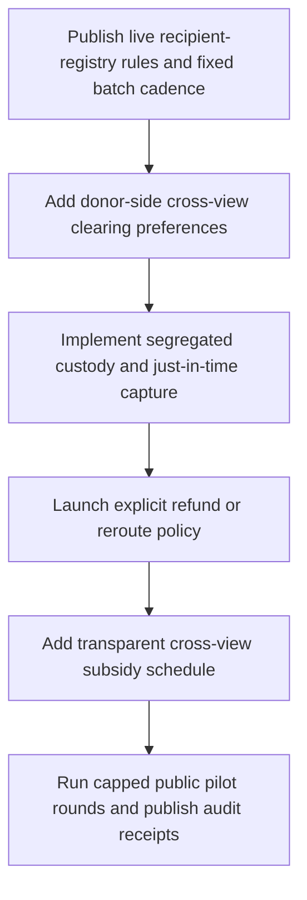

# Escrowed Conditional Matching and Moraltrade.org

## Executive summary

I do **not** think the current public moral-public-goods mechanism on moraltrade.org is exactly identical to the Escrowed Conditional Matching mechanism in the ECM PDF. My credence that they are exactly identical is **0.07**. Moral Trade is already in the same design family: it uses conditional contribution intents, threshold gates, identity checks, sponsor matching, challenge windows, explicit anti-threat rules, and public audit-oriented documentation. But its current public mechanism is still explicitly **non-custodial**, still treats provider payment data as review evidence rather than escrow or legally reliable custody, still relies on campaign-by-campaign assurance flows rather than explicit batch cross-view clearing, and still presents the candidate-pool layer primarily as ranking/discovery rather than as a donor-side cross-view clearing market. citeturn35view3turn4view0turn4view1turn6view4turn34view0turn38view7

My overall credence that **ECM as specified in the PDF is the exact best current mechanism** for moraltrade.org is **0.44**. That is meaningfully above agnosticism, because ECM squarely targets Ord-style trust and search problems: it adds real custody/escrow, explicit cross-view clearing, batching, registry-based payout discipline, and a precommitted matching pool. Those are exactly the most obvious missing pieces on the live site. But I do **not** put the credence above 0.5 because “exact best” is a stronger claim than “best design family.” The exact ECM PDF is probably missing a few things that Moral Trade’s current public rulebook already does unusually well, especially its stronger anti-threat, challenge, externality, privacy, and review architecture; and I am not yet convinced that removing or weakening Moral Trade’s existing capped-QF breadth signal would improve the mechanism. citeturn18view5turn18view6turn35view3turn37view5turn38view7turn24view1turn24view2turn24view3turn25view0 fileciteturn0file4

The upshot is: **ECM is probably the strongest current core design direction for a voluntary Toby-Ord-style moral-trade platform, but not quite the exact best deployable mechanism in unchanged form.** The best current target, in my judgment, is **ECM-core plus Moral Trade’s stronger existing anti-threat/challenge/review safeguards, and without discarding its breadth-sensitive bonus layer unless experimentation shows that doing so is better**. That judgment is also consistent with Forethought’s view that voluntary moral-public-goods provision is intrinsically hard, assurance contracts are brittle at scale, and QF-like systems help only when they have outside matching and robust anti-Sybil controls. citeturn18view1turn18view3turn24view1turn24view2turn24view3turn25view0

## Prioritized-site coverage

I started with the user-prioritized sources in the requested order. The results are below.

| Prioritized source | What I was able to inspect | What mattered most for this question | Coverage quality |
|---|---|---|---|
| amirrorclear.net | Direct browser retrieval of the Moral Trade PDF was not successful in this session, so I could not directly inspect the Ord-hosted PDF from the site itself. Moral Trade’s own trust page explicitly cites Toby Ord’s moral trade paper as a reference point, and Forethought’s page directly frames moral public goods as a form of moral trade. citeturn0view0turn4view0turn18view5 | Ord is the conceptual background for cross-view trust, counterfactual baselines, and the need for institutions beyond ad hoc bilateral swaps. citeturn4view0turn18view5 | Partial |
| forethought.org | I directly inspected **“Moral public goods are a big deal for whether we get a good future”** and **“Convergence and Compromise.”** citeturn0view1turn0view2 | These pages are the strongest public primary sources on why voluntary moral-public-goods funding is important, why assurance contracts are brittle, why QF needs outside matching, and why threats/institutions matter. citeturn18view1turn18view3turn18view4turn18view6turn18view7turn18view8 | High |
| moraltrade.org | I directly inspected the homepage, trust page, pilot status page, validation page, safety page, anti-threat rules, measurement plan, transparency report and its JSON, team/governance page, the technical spec, the MPGF main page, and MPGF candidate pools. citeturn0view3turn4view0turn4view1turn4view2turn4view3turn4view4turn4view5turn4view6turn9view0turn4view7turn4view9turn4view8turn6view4 | This was enough to assess the public mechanism’s live posture, custody claims, review gates, public-goods flow, sponsor matching, candidate-pool logic, and current governance/audit posture. citeturn35view3turn37view5turn38view7turn36view1turn9view0 | High for accessible public pages; incomplete for some linked MPGF subpages that did not load directly in-session |

## ECM exact specification

The ECM PDF describes a **batch-cleared, escrow-backed, cross-view conditional-matching market** for moral public goods. Its central move is not just “add matching” or “add thresholds,” but to let donors make **conditional cross-view commitments** that clear only when enough morally different counterpart participation appears, with sponsor subsidy and verification layered on top. fileciteturn0file4

### ECM spec table

| ECM attribute | ECM exact specification | Exact thresholds or algorithms stated in the PDF | Assessment of specificity |
|---|---|---|---|
| Conditional pledges | Donors make pledges that execute only if enough acceptable counterpart participation appears and the target public good passes the platform’s eligibility and verification conditions. Donors can specify acceptable counterpart buckets and what should happen if matching fails. fileciteturn0file4 | The PDF specifies donor controls such as **acceptable counterpart buckets**, **minimum counterparty volume**, and **refund or reroute** choice for unmatched funds. fileciteturn0file4 | Moderate specificity |
| Cross-view clearing rules | Clearing is explicitly cross-view: the platform matches donors across morally different buckets rather than treating contributions as ordinary same-view donations. The point is to clear mutually beneficial moral trade, not just a generic crowd campaign. fileciteturn0file4 | The PDF specifies **batch clearing** across “counterpart buckets,” and donors can require a minimum amount of opposite-side participation before their pledge counts. fileciteturn0file4 | Moderate specificity |
| Precommitted matching pool | A sponsor pool exists in advance and subsidizes cleared trades; the subsidy is meant to make morally difficult cross-view spending more attractive. fileciteturn0file4 | The PDF specifies a **precommitted** matching pool and says the subsidy should be strongest where cross-view compromise is strongest, but it does **not** give a single fully numeric public formula for all cases. fileciteturn0file4 | Partial numeric specificity |
| Escrow or custody rules | Funds or payment commitments are held in escrow-like custody until clearing and verification conditions are met; this is one of the PDF’s main practical upgrades over looser assurance designs. fileciteturn0file4 | The PDF discusses **segregated custody / escrow**, staged release, and release only after clearance and recipient checks. fileciteturn0file4 | High directional specificity |
| Verification gates | Funds should release only to verified, eligible moral-public-goods recipients using auditable evidence and objective receipts. fileciteturn0file4 | The PDF specifies **pre-vetting**, **objective receipts**, recipient verification, and evidence requirements before disbursement. fileciteturn0file4 | Moderate specificity |
| Batch-clearing cadence | The market is meant to clear in recurring rounds rather than continuously. fileciteturn0file4 | The PDF explicitly gives a cadence of **every one to two weeks**. fileciteturn0file4 | High specificity |
| Subsidy schedule | Sponsor subsidy should be tied to the moral-trade function, not merely to raw donor count. The subsidy is supposed to reward cleared cross-view compromise and broad compromise baskets more than ordinary within-view giving. fileciteturn0file4 | The PDF describes the **direction** of the schedule but does not publish a single complete numeric matrix for all buckets. fileciteturn0file4 | Low-to-moderate numeric specificity |
| Fallback and refund rules | If a pledge does not clear, the donor should be able to choose refund or rerouting rather than automatic silent failure. fileciteturn0file4 | The PDF explicitly mentions **refund** and **reroute** options for unmatched funds. fileciteturn0file4 | High specificity |
| Allowed recipient registry | The platform should limit live payouts to a pre-vetted registry of eligible moral public goods and payout routes. fileciteturn0file4 | The PDF specifies an **eligible moral public goods registry**, with launch bias toward **registered nonprofits** and transparently auditable public-goods projects. fileciteturn0file4 | Moderate specificity |
| Anti-threat review | Threat-like, extortionary, or harmful proposals are excluded. ECM is designed for positive trade, not “pay me not to do harm.” fileciteturn0file4 | The PDF treats anti-threat review as a hard constraint, but Moral Trade’s website is actually more detailed on the rulebook than the PDF itself. fileciteturn0file4 | Directionally clear, less procedurally detailed |
| Audit and receipts | Treasury separation, receipts, and auditable logs are part of the mechanism rather than afterthoughts. fileciteturn0file4 | The PDF specifies receipt publication, auditability, and public logging of what cleared and what paid out. fileciteturn0file4 | Moderate specificity |
| Identity and anti-Sybil | The PDF treats identity as mechanism-critical where matching is involved, especially if subsidies can be gamed. fileciteturn0file4 | It specifies proportionate identity controls and anti-Sybil review, but again not as a single published scoring formula. fileciteturn0file4 | Moderate specificity |

Two features of the ECM PDF matter most for this comparison. First, **escrow/custody is not cosmetic** there; it is one of the main answers to Ord-style factual and counterfactual trust problems. Second, ECM is **not merely assurance crowdfunding with matching**. It is explicitly a **cross-view clearing mechanism**, where donors can demand morally distinct counterpart participation before their money moves. fileciteturn0file4

## Moraltrade.org mechanism inventory

Moral Trade publicly describes itself as “a pilot institution for cooperation under disagreement.” The homepage says users can start with a pledge swap, donation offset, or public-good commitment; it reports **0 live offers**, **8 worked examples**, **2 public profiles**, and **0 completed agreements**; and it foregrounds a pilot posture of **“No custody or escrow,”** “manual review before reliance,” and privacy-first matching. The trust page similarly says the platform does not “hold funds” and does not promise legal enforceability. citeturn3view0turn4view0turn4view1

The MPGF page describes the Public Goods Fund as the platform’s main test of moral-public-goods coordination. It says the mechanism uses **verified contribution intents, conditional payment authorization, sponsor matching, dissent notes, and reviewer verification**, and that its motivating layer is **“verified assurance matching.”** It further states that a demo sponsor pool releases a **1:1 challenge match** only after assurance and review gates pass, and that a **capped QF bonus** is applied only to threshold-cleared, review-approved campaigns. citeturn5view3turn5view4turn5view5turn5view6

The live public MPGF page exposes current round figures: **$1,500 sponsor pool**, **$500 QF bonus allocated**, **2 payable campaigns**, and explicit campaign-level amount and supporter thresholds. For example, the global-health campaign shows **$275 verified direct contributions**, **3/3 verified supporters**, and **$275 guaranteed base match**; the x-risk campaign shows **$360 verified direct**, **2/3 verified supporters**, and no base match because it has not fully cleared. The same page also says **external payouts remain $0** for the old ballot allocation. citeturn35view2turn35view3turn35view4

The donor flow is publicly described as: create a pledge intent, verify identity, authorize conditionally, then wait for review. The MPGF page says signed-in participants can create a contribution intent, verify identity, and authorize a **provider-managed payment that captures only after threshold, review, and challenge gates**. But the same page also says the public pilot still treats Stripe webhook data as **review evidence rather than a promise of custody or legal escrow**, and the site elsewhere repeatedly says it provides **no custody or escrow services**. citeturn35view3turn4view0turn4view1

Moral Trade has an unusually detailed safety and review stack. The validation page says reviewers certify narrow evidence claims, not “legal enforceability, tax treatment, escrow status, or final real-world impact”; it describes explicit scope, challenge, appeal, reviewer-conflict, and badge rules. The anti-threat page has a detailed baseline-integrity rulebook: no “pay me or I will do X” offers, no compensation for stopping newly escalated harmful behavior, mandatory no-trade baselines, cooling-off periods, and a challenge lane for coercive baselines and third-party externalities. citeturn37view2turn37view4turn37view5turn38view0turn38view4turn38view6turn38view7

Its candidate-pool layer is also substantive. The MPGF pools page says campaign order ranks **“coordinatability, not moral truth,”** using private-by-default support signals, cross-cluster breadth, threshold progress, and reviewability. It surfaces common-ground scores for global health, x-risk, knowledge, and animal welfare pools. But the same page also says these are **visible demo alternatives** that do **not** authorize live real-money allocation or payout, and the account summary on that page reports **0 public-goods pledges**, **0 sponsor-pool refills**, **0 monthly commitments**, and **0 ballots**. citeturn5view8turn6view4

The site’s audit posture is real but still pilot-stage. The technical spec says immutable agreement-event records support auditability; external entity references exist for charities and payment providers; traceability events exist for payment and charity-routing audits; and the transparency report publishes aggregate counts. But that transparency report currently shows a long list of zeros and suppressed metrics, while the team/governance page openly says there is still a **“still-missing named governance roster.”** citeturn7view4turn34view0turn9view0turn36view1

### Mechanism inventory table

| Public page | What it documents | Most relevant evidence |
|---|---|---|
| Homepage | Pilot posture, no-custody stance, current liquidity snapshot | “Live offers 0,” “Completed agreements 0,” and “No custody or escrow.” citeturn3view0 |
| Trust page | Reliance boundaries and non-guarantees | No holding funds; no legal enforceability promise; explicit trust split between action evidence, baseline confidence, and externality review. citeturn4view0 |
| Pilot status | What is live vs prototype | “Reviewed pilot, not a liquid exchange”; strongest current use is learning/cloning/proof submission. citeturn4view1 |
| Validation | Review scopes, challenge windows, badges, appeals | Explicit challenge lane, reviewer conflict rules, provider-payment badge, organization badge, audit-oriented outcomes. citeturn37view4turn37view5 |
| Safety / anti-threat | Coercion and baseline integrity | No threat creation, no compensation for newly escalated harm, no private-feed mining or autonomous outreach. citeturn38view0turn38view1turn38view7 |
| MPGF main page | Current public-goods funding mechanism | Verified assurance matching, conditional authorization, 1:1 sponsor match, capped QF bonus, identity before threshold counting. citeturn35view3 |
| MPGF pools | Candidate-pool ordering and common-ground discovery | “Coordinatability, not moral truth”; demo pools; no live payout authorization here. citeturn5view8turn6view4 |
| Technical spec | Data model, auditability, external entity references | External entities, traceability events, immutable event records, matchability gates. citeturn34view0turn7view4turn7view10 |
| Transparency report | Current live aggregated operational record | Aggregate-only metrics, many zeros, suppressed timing metrics, unresolved governance/data gaps. citeturn8view5turn8view7turn9view0 |
| Team and governance | Public accountability structure | Reviewer responsibilities published, but named roster not public yet. citeturn36view1 |

## Comparison and proposed changes

### Attribute-by-attribute comparison

| ECM attribute | ECM requirement | Current public implementation on moraltrade.org | Exact / partial / absent | Evidence |
|---|---|---|---|---|
| Conditional pledges | Donor commitment executes only if counterpart and recipient conditions clear. fileciteturn0file4 | Contribution intents are conditional: users create a pledge intent, set amount/visibility/fallback, verify identity, and authorize a provider-managed payment that counts only after gates clear. | **Partial-to-near-exact** | citeturn35view3 |
| Cross-view clearing rules | Donor can require participation from acceptable morally distinct counterpart buckets; platform batch-clears across views. fileciteturn0file4 | Moral Trade uses cross-cluster breadth and common-ground signals for **ranking/discovery**, but the public flow still looks campaign-by-campaign rather than an explicit donor-side cross-view clearing market. | **Partial** | citeturn5view8turn6view4 |
| Precommitted matching pool | sponsor pool committed in advance and tied to cross-view compromise. fileciteturn0file4 | Public MPGF has a sponsor pool and publicly states a 1:1 challenge match plus capped QF bonus. | **Partial-to-near-exact** | citeturn35view3 |
| Escrow or custody | clearing funds are actually held and released through custody/escrow. fileciteturn0file4 | Site repeatedly says **“no custody or escrow,”** and MPGF says provider data is review evidence rather than a promise of escrow. | **Absent** | citeturn4view0turn4view1turn35view3 |
| Verification gates | release only after recipient, evidence, and challenge checks. fileciteturn0file4 | Amount, supporter, review, evidence, identity, and challenge gates are explicit; reviewer scopes and appeal lanes are public. | **Near-exact** | citeturn35view3turn37view4turn37view5 |
| Batch-clearing cadence | recurring round clearing, explicitly one-to-two weeks. fileciteturn0file4 | Public pages show campaigns and deadlines, but I did not find a public one-to-two-week batch-clearing rule. | **Absent** | citeturn35view3 |
| Subsidy schedule | deterministic schedule that rewards cross-view compromise, not just generic support. fileciteturn0file4 | Current public rule is base 1:1 match plus capped QF bonus after threshold/review; no explicit public cross-view subsidy matrix. | **Partial** | citeturn35view3turn24view2turn24view3 |
| Fallback and refund rules | unmatched funds refunded or rerouted per donor choice. fileciteturn0file4 | Users choose a fallback rule before counting, but the public site does not yet present a full released-market refund/reroute policy for failed cross-view batch clearing. | **Partial** | citeturn35view3turn6view4 |
| Allowed recipient registry | live payouts limited to a pre-vetted registry of eligible public-goods recipients. fileciteturn0file4 | Technical spec supports organization verification and external entity references; draft pool forms include recipient/destination fields; but I did not find a fully public live recipient-registry rulebook for MPGF payouts. | **Partial** | citeturn37view5turn34view0turn6view4 |
| Anti-threat review | hard exclusion of extortionary or threat-like trades. fileciteturn0file4 | Moral Trade clearly implements this and, in public documentation, does so **more fully** than ECM. | **Exact or stronger** | citeturn38view0turn38view4turn38view7 |
| Audit and receipts | segregated audit trail, receipts, public accountability. fileciteturn0file4 | Technical spec includes immutable records, traceability events, provider receipts/webhooks, and transparency reporting; but payouts are still mostly pilot/demo and external payouts shown are $0 in the visible public flow. | **Partial** | citeturn34view0turn7view4turn37view5turn35view3 |
| Identity and anti-Sybil | identity is part of the mechanism where matching exists. fileciteturn0file4 | Identity verification is required before threshold counting; badges and provider-payment verification are public. | **Near-exact** | citeturn35view3turn37view5 |
| Governance and conflict controls | reviewer conflicts, appeal path, auditable process. fileciteturn0file4 | Conflict rules and appeal paths are public, but named reviewer/advisor rosters are still missing. | **Partial** | citeturn37view2turn37view5turn36view1 |

The big comparison result is straightforward: **Moral Trade currently implements much of ECM’s logic around conditionality, review, identity, matching, and anti-threat screening, but it does not yet implement ECM’s custody core or ECM’s explicit cross-view batch clearing core.** Those are exactly the two places where the current site still looks more like a carefully reviewed pilot than a full moral-trade market. citeturn35view3turn4view0turn4view1turn6view4 fileciteturn0file4

### Proposed changes with credence above 0.5

Below are the changes where my credence that moving Moral Trade’s current mechanism **toward ECM** would improve it is above 0.5.

| Proposed change | Why it improves the mechanism | Credence | Implementation complexity | Main risks |
|---|---|---:|---|---|
| Introduce real escrow or segregated custodial release for MPGF rounds | This is the single clearest missing ECM element. The current site’s explicit “no custody or escrow” posture creates trust, payout, and donor-friction limits exactly where ECM is strongest. Stripe’s manual-capture flow is designed for authorization-then-capture timing, but it also makes clear that holds expire and need careful timing; that is manageable, but it requires building the legal and operational layer rather than stopping at webhook evidence. citeturn4view0turn35view3turn22view0turn26view5 | **0.72** | **High** | Charitable-law, money-transmission, custody, card-hold expiry, customer confusion, and operational failure risk |
| Add explicit donor-side cross-view clearing constraints and batch clearing | Moral Trade already has cross-cluster breadth in discovery, but ECM is better because it makes cross-view participation a **clearing condition**, not just a ranking signal. This is closer to Toby-Ord-style moral trade and more defensible as “moral trade” rather than ordinary assurance fundraising plus bonus matching. Forethought’s assurance-contract critique also makes batching valuable because it lowers search and coordination costs. citeturn5view8turn6view4turn18view1turn18view5 fileciteturn0file4 | **0.67** | **Medium-high** | User comprehension, thinner early liquidity, difficult bucket design, gaming around bucket identity |
| Publish a pre-vetted live recipient registry with explicit eligibility rules | ECM is right to make recipient eligibility a first-class rule. The current site has organization verification, external entity references, and destination fields, but not yet a clearly public live MPGF registry contract. The FTC and IRS guidance also point toward clarity on where money goes, tax status, and routing. citeturn34view0turn37view5turn26view5turn27view2 fileciteturn0file4 | **0.63** | **Medium** | Over-exclusion, governance controversy, jurisdictional mismatch, maintenance burden |
| Publish an explicit cleared-round refund or reroute policy and fixed batch cadence | ECM’s refund/reroute logic and one-to-two-week rounds are better than ad hoc ambiguity. The current site has fallback fields, but not yet a clearly public production policy for failed moral-public-goods batch clearing. This is both a trust and UX improvement. citeturn35view3turn6view4 fileciteturn0file4 | **0.59** | **Medium** | More state complexity, donor confusion if rerouting is too aggressive |
| Add a public cross-view subsidy schedule on top of the existing sponsor pool | Moral Trade publicly discloses a 1:1 base match and a capped QF bonus. ECM’s better insight is that sponsor subsidy should reward the *moral-trade function* itself. I would not remove the existing breadth bonus with >0.5 confidence, but I would add a transparent cross-view premium schedule. Matching evidence suggests that matching works, while larger match ratios do not obviously beat 1:1 in field evidence, so the schedule should stay simple. citeturn35view3turn23view0turn32view5 fileciteturn0file4 | **0.56** | **Medium** | Hard-to-explain incentives, strategic bucket signaling, sponsor-pool depletion |

I do **not** recommend changing Moral Trade to weaken its current anti-threat, challenge, privacy, or reviewer-conflict framework in order to match ECM more literally. On the public evidence I saw, those current protections are a strength, not a deviation to “fix.” citeturn38view7turn37view5turn36view1

## Overall credence and justification

ECM is stronger than plain assurance contracts for this use case because Forethought explicitly argues that assurance contracts usually fail at realistic scales, and that dominant assurance contracts improve only marginally because they do not remove the deeper incentive to free-ride on others’ contributions. ECM improves on that by adding subsidy, batch clearing, and a cross-view bargain structure, rather than merely asking many people to join the same fragile threshold contract. citeturn18view1 fileciteturn0file4

ECM is also stronger than “pure QF” as the core mechanism for Moral Trade’s specific mission. The standard QF paper argues that QF can achieve near-optimal provision under its model, but only with philanthropic or public seeding, and both Forethought and Gitcoin point out the practical catches: QF needs an outside matching pool, meaningful participation, and serious anti-Sybil / collusion defenses. Moral Trade already has some of that infrastructure, but its mission is not just “fund public goods broadly”; it is to enable **moral trade across disagreement**. ECM’s cross-view conditionality fits that mission better than pure breadth-amplification alone. citeturn24view1turn18view3turn24view2turn24view3

Retroactive public-goods mechanisms look worse than ECM for this exact platform objective. Optimism’s own retrospective account says it still lacks decisive evidence that retroactive funding produces superior outcomes, recommends moving away from project-based voting, and emphasizes the need for better metrics plus expert review. That is useful institutional learning, but it is the wrong center of gravity for a platform whose core problem is ex ante cross-view conditional cooperation under disagreement. citeturn25view0turn24view7turn24view8turn25view3turn25view4

The strongest alternative challenge to ECM is not retro funding or simple assurance; it is some **ECM-plus hybrid** that keeps ECM’s escrowed cross-view batch clearing while preserving Moral Trade’s current stronger anti-threat/challenge/externality/public-audit stack, and possibly keeping a capped breadth-sensitive bonus layer. I think that hybrid is slightly more plausible than **exact ECM unchanged**, which is why my final credence is **0.44**, not above 0.5. The current public site is unusually thoughtful about baseline integrity, coercion, externalities, reviewer conflicts, and privacy-safe auditability; I would preserve those features rather than treat them as replaceable detail. citeturn38view7turn37view4turn37view5turn36view1turn34view0turn35view3 fileciteturn0file4

A separate practical reason to stay below 0.5 is deployment realism. The current site openly remains a reviewed pilot, not a liquid exchange; it still says integrated checkout is planned, not active; it still presents no-custody boundaries; it still has no completed agreements on the homepage; and its transparency report shows extremely sparse live operational history. In that environment, the exact best mechanism is not just about theory; it is also about whether the trust, legal, and governance stack can actually be carried. ECM improves the theory-to-practice path, but the public evidence does not justify claiming that the PDF’s exact version is already the uniquely best current mechanism in all details. citeturn4view1turn5view3turn3view0turn9view0turn36view1

### Open questions and limitations

The amirrorclear-hosted Ord PDF was not directly retrievable in this browser session, so my use of Ord is mediated by Moral Trade’s own references, Forethought’s direct discussion of moral trade, and the uploaded ECM PDF. citeturn0view0turn4view0turn18view5

Some linked Moral Trade MPGF subpages, especially the governance, metrics, and round subpages, were visible as links from accessible pages but did not load directly in-session. I therefore relied primarily on the pages that were directly inspectable and on the visible text those pages exposed about the current round. citeturn5view0turn5view1turn5view2turn35view3

No private code, internal pilot data, legal agreements, escrow contracts, or jurisdiction-specific compliance documents were available. That matters because whether a custody-backed ECM deployment is feasible depends heavily on regulatory structure, charity-routing design, and sponsor-pool legal treatment. FTC, IRS, and Stripe materials make clear that routing transparency, tax status, timing, and authorization windows are not incidental details. citeturn26view5turn27view2turn22view0