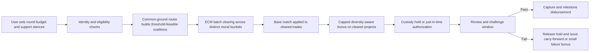

# Escrowed Conditional Matching and the Best Current Mechanism for Moral Trade

## Executive summary

My bottom-line view is that **Escrowed Conditional Matching as specified in the uploaded PDF is in the strongest current design family, but is probably not the exact best current mechanism** for a platform whose core purpose is Toby-Ord-style moral trade while funding moral public goods. My best overall credence that **ECM exactly as specified** is the best current mechanism for that use case is **0.37**. My best guess is that a **nearby hybrid**—keeping ECM’s core of conditional cross-view trades, precommitted matching, and escrow/verification, but adding a **Common Ground Budget / coalition-routing layer**, **small failure bonuses or carry-forward**, and **more explicit identity/collusion controls**—is better overall. fileciteturn0file4 fileciteturn0file5

The reason ECM scores so well is clear. Forethought’s work makes a strong case that moral public goods matter greatly, while pure voluntary contracts, pure assurance contracts, and pure social norms all struggle with free-riding at scale. Toby Ord’s paper makes trust the central practical barrier and explicitly points toward escrow as one solution to factual trust, while also suggesting that early deployments should stay simple, observable, and verifiable. Donation matching, meanwhile, has unusually strong empirical support as a donor-facing motivator. ECM is the mechanism that most directly combines those three insights: **trade**, **matching**, and **trust infrastructure**. citeturn2view0turn2view2turn2view3turn33view1turn16view0turn36view1

But “exact best” is a very high bar. ECM as written still leaves a key problem only partially solved: **how to convert weak, distributed, cross-view overlap into actual routed money when most users will not want to craft precise bilateral-style conditional pledges round after round**. That is where the later VCQA/Common Ground Budget proposal looks stronger. It tries to operationalize the Forethought idea that many people may value some moral public goods **somewhat**, even if those goods are not their top priority, and it tries to turn that weak overlap into spendable budget rather than merely a ranking signal. That seems like a real improvement for donor adoption, liquidity, and scalability. fileciteturn0file5 citeturn2view0turn36view0turn36view1turn4view0turn5view0turn2view8turn2view10

So the most defensible answer is: **ECM exact is not quite the exact best current mechanism; ECM-plus-coalition-budget-routing probably is.** If you forced me to choose a named mechanism among the ones explicitly on the table, I would still rate **ECM exact above pure matching, pure assurance, pure QF, and the current Moral Trade pilot** for an Ord-style platform, but slightly below a refined **ECM hybridized with the strongest VCQA ideas**. fileciteturn0file4 fileciteturn0file5 citeturn26view0turn26view3turn20view0turn4view0turn5view0

## Scope and assumptions

I am evaluating mechanisms for a **voluntary** online platform that aims to implement **Toby Ord–style moral trade** and channel funding toward **moral public goods**. I am **not** comparing against coercive taxation, sovereign public finance, or acausal coordination mechanisms such as ECL, each of which could outperform any ordinary web platform on some margins. Forethought itself says governments currently solve many public-goods problems via taxation and treats voluntary coordination as intrinsically hard. citeturn2view1turn2view0

Because the user did not specify scale, jurisdiction, or stack, I assume an **early-stage to mid-scale launch**: roughly hundreds to low-thousands of active donors per quarter, operating first in **charity-to-charity or donor-to-charity** flows in U.S./U.K.-adjacent legal environments, using a **normal web stack with off-chain payments**, human review, and no requirement to use blockchain. That assumption matters. If the platform were instead a tiny, high-trust private club, ECM exact would look better; if it were a mass public marketplace optimized almost entirely for donor convenience, a more automated coalition-budget design would gain more ground. fileciteturn0file4 fileciteturn0file5

I also assume the product goal is not merely “move the most gross dollars to pre-vetted charities,” but rather to do so **in a way that still deserves to be called moral trade in Ord’s sense**. That raises the weight on explicit cross-view conditionality, trust, and anti-threat safeguards, and lowers the weight on mechanisms that are strong generic fundraising tools but weakly trade-like. citeturn33view0turn33view2turn36view3turn2view5

## Prioritized sources reviewed

I began from the uploaded ECM document, which itself argues for “precommitted matching applied only to conditionally cleared, escrowed cross-view donations” and explicitly presents ECM as the best broad launch architecture among the mechanisms it surveys. fileciteturn0file4

I then reviewed the user-prioritized web sources in the requested order:

**amirrorclear.net**

Toby Ord’s *Moral Trade* argues that people with divergent moral views can realize gains from trade; describes vote-pairing sites as “simple markets”; says early efforts should remain comparatively simple and often one-to-one; distinguishes **factual trust** from **counterfactual trust**; and explicitly suggests **escrow** as a way to support compliance, while warning that counterfactual trust is much harder to police. citeturn1view0turn33view0turn33view1turn33view2turn33view3turn33view5

**forethought.org**

Forethought’s “Moral public goods are a big deal for whether we get a good future” says the free-rider problem is surprisingly hard to escape through voluntary mechanisms, is pessimistic about pure social norms as a primary engine, argues that large-population assurance contracts usually will not clear absent very large gains from trade, and notes that quadratic funding still depends on an outside matching pool. citeturn2view0turn2view1turn2view2turn2view3

Forethought’s “Convergence and Compromise” says there can be **enormous gains from trade** under the right conditions, especially where views are **resource-compatible** or hybrid goods exist; but it also says whether gains are realized depends on whether the right **institutions** exist, and warns about **threats** and value-destroying extortion. It further notes that trade is less promising for some linear resource-hungry views absent special compatibility. citeturn36view1turn36view0turn2view6turn2view5turn2view7

I then used additional primary and official sources to evaluate adjacent mechanisms. The strongest external anchors were Karlan and List on charitable matching; Harvard Magazine / Giving Multiplier on donation bundling and micromatching; Gitcoin’s official QF mechanism page; Optimism’s retrospective on retro funding; FTC and IRS guidance relevant to platform trust and compliance; and current public pages from Moral Trade itself. citeturn16view0turn15view0turn11view5turn11view6turn26view0turn26view3turn26view4turn20view0turn28view0turn29view2turn29view3turn29view5turn4view0turn5view0turn5view1turn2view8turn2view10turn6view4

## How ECM compares with alternatives

The comparative picture is fairly stable. **Pure matching** has the best direct behavioral evidence as a donation motivator: Karlan and List found that matching increased both response rate and revenue per solicitation, but that larger match ratios did not beat 1:1. Giving Multiplier adds a second important insight: giving rises when donors can support both a personally meaningful charity and a more effective charity, with matching layered on top. Those findings support ECM’s matching component, but they also show why a donor-friendly “both/and” or coalition-budget interface can outperform a narrower conditional-pledge interface on adoption. citeturn16view0turn15view0turn11view5turn11view6

**Pure assurance contracts** and close variants are weaker for broad deployment. Forethought is unusually explicit that assurance contracts “usually won’t go through” at realistic population sizes unless gains are extremely large, and it argues that dominant assurance contracts do not really solve the main free-riding problem. That is one of the strongest arguments in favor of ECM over plain assurance. But it is also one of the strongest arguments for adding a coalition-budget or failure-bonus layer to ECM, because that reduces reliance on users making narrow threshold bets project by project. citeturn2view0

**Pure QF / Gitcoin-style QF** is powerful but still not the best fit here. The original QF paper claims near-first-best provision in the standard model, and Gitcoin’s own current documentation presents QF as a democratic allocation layer. But Gitcoin also says QF depends on **external infrastructure for identity verification, sybil resistance, and fund custody**, and explicitly describes post-round review for **sybil attacks, collusion, or manipulation**, using mechanisms like Passport scoring, pairwise coordination analysis, and COCM. For an Ord-style moral trade platform, plain QF is too generic, too subsidy-hungry, and too exposed to attack unless heavily supplemented. citeturn10view0turn26view0turn26view3turn26view4

**Retro-funding / impact-certificate models** are even less suitable as the main launch mechanism. Optimism’s two-year retrospective says mega-rounds became popularity contests, pure project voting performed badly, and—most importantly—they still did **not yet have the data to show that retro funding produces superior outcomes**. That makes retro-funding look useful as a later learning or ex post reward layer, not as the first-order donor hook for a moral-trade platform. citeturn20view0

**The current Moral Trade Public Goods Fund pilot** is directionally aligned but not yet a winning implementation. Moral Trade’s own public pages say it is a pilot, not a liquid exchange; homepage counts show **0 live offers** and **0 completed agreements**; the site says it provides **no escrow or custody**; MPGF says integrated checkout is planned but not active; and the public transparency pages show many zero activity counts. MPGF’s “verified assurance matching” is an intelligent prototype, but its public surfaces still suggest low liquidity, modest automation, and substantial friction. That is important because it shows that “the ECM family” is right, while also showing that current practical frictions are real. citeturn4view0turn5view0turn5view1turn2view8turn2view9turn2view10turn6view4

The key comparison, then, is **ECM exact versus VCQA/Common Ground Budget**. My synthesis is that **ECM exact beats VCQA on Ord-alignment and trust architecture**, while **VCQA beats ECM exact on liquidity, UX, and the conversion of weak common-ground support into money**. Because the use case is “a platform where people do Toby-Ord-style moral trade,” these strengths more or less cancel—until we remember that the question asks whether ECM exact is the **exact best** mechanism. On that standard, the better answer is **no**, because the most likely best current mechanism is an **ECM-centered hybrid that imports VCQA’s coalition-budgeting improvements**. fileciteturn0file4 fileciteturn0file5

### Comparative synthesis

The table below is my synthesis of the evidence above, rather than a direct claim from any one source. It is grounded in the prioritized sources, the uploaded PDFs, and the additional primary/official sources already cited. fileciteturn0file4 fileciteturn0file5 citeturn16view0turn26view0turn20view0turn4view0turn5view0

| Mechanism | Best use | Main advantage | Main weakness | My overall take |
|---|---|---|---|---|
| ECM exact | Explicit Ord-style cross-view funding trades | Best blend of conditional trade, matching, and escrow trust | Liquidity and UX friction; weak-support under-harvesting | Top-tier, but not exact best |
| ECM plus coalition-budget routing | Ord-style trade platform funding moral public goods | Keeps ECM’s trade core while improving liquidity and donor uptake | More moving parts and governance complexity | Best current candidate |
| VCQA / Common Ground Budget exact | Public-goods funding under moral disagreement | Converts weak common-ground support into routed budget | Less trade-like; more QF-style complexity | Strong, but less faithful to Ord |
| Pure matching / Giving Multiplier style | Donor acquisition and effective-giving uplift | Best field evidence and simple value proposition | Weakly trade-like; no real cross-view clearing | Very useful component, not full answer |
| Pure QF / Gitcoin-Allo | Large identity-backed ecosystem rounds | Scales and rewards breadth of support | Needs sybil defenses, custody, and outside match pool | Powerful, but wrong launch center |
| Pure assurance contracts | Narrow provision-point projects | Clear conditionality | Brittle at scale | Support layer only |
| Current Moral Trade MPGF pilot | Mechanism research and early trust-building | Good governance posture and transparency | Low validated throughput and no escrow/custody | Prototype of right family |

## Credence estimates

Here are my subjective credences that **ECM exact as specified in the uploaded PDF** is the **best current mechanism** on each dimension, **for the assumed use case**. These are not probabilities pulled from a dataset; they are structured judgments after weighting the theory, current precedents, and the platform-relevant empirical evidence. fileciteturn0file4 fileciteturn0file5

| Dimension | Credence ECM exact is best | Why |
|---|---:|---|
| Incentive effectiveness for cross-view participation | **0.57** | ECM’s conditional cross-view clearing plus matching is a very strong donor-facing hook, and stronger than plain matching on trade-likeness. But a coalition-budget layer probably converts more weak overlap into money. |
| Resistance to strategic manipulation and fraud | **0.45** | Escrow and verification help a lot, but exact ECM still needs stronger explicit anti-sybil and anti-collusion machinery. QF-heavy rivals are worse here, but a revised ECM can be better than exact ECM. |
| Trust and verification | **0.79** | This is ECM’s best dimension. Ord explicitly elevates trust as the central practical problem, and escrow is the cleanest direct answer for factual trust. citeturn33view0turn33view1 |
| Scalability and liquidity | **0.33** | Exact ECM’s explicit counterparty and bucket constraints make clearing harder as participation becomes sparse or heterogeneous. Coalition-budget routing likely scales better. |
| UX friction and donor adoption | **0.34** | Users understand “set one budget and we’ll route it if conditions pass” more easily than repeatedly posting constrained conditional trade offers. |
| Administrative and operational complexity | **0.36** | Exact ECM requires escrow, review, cause bucket governance, batch clearing, and audits. Strong, but costly. |
| Legal, tax, and regulatory risk | **0.43** | Charity-only ECM is defensible, but platform custody/escrow creates more legal/compliance burden than non-custodial handoff models. FTC and IRS guidance reinforce the need for clear disclosures and direct charity verification. citeturn28view0turn29view2turn29view3turn29view5 |
| Alignment with Toby Ord’s framing | **0.88** | This is the other dimension where ECM is strongest. It looks much more like market-mediated moral trade than VCQA exact does. citeturn33view2turn33view3turn33view5 |
| Empirical evidence or precedents | **0.31** | ECM is built from good adjacent literatures, but there is still little direct, large-scale evidence on moral-trade platforms as such. |

My **overall credence that ECM exact is the best current mechanism overall** is **0.37**. That overall number is **lower than several individual dimension scores** because “exact best overall” is a conjunctive standard: ECM does very well on trust and Ord-alignment, but meaningful plausible improvements remain on liquidity, UX, and enforcement against modern gaming tactics. fileciteturn0file4 fileciteturn0file5

If I condition on a **smaller, high-trust, explicitly reciprocal founding cohort** rather than a broader donor platform, my credence for ECM exact rises to about **0.52**. If I condition on a **broader public-facing donor product** where adoption and route-throughput dominate, it falls to about **0.28**. The user’s question did not pin down that choice, which is part of why the overall credence is moderate rather than extreme. citeturn4view0turn5view0turn5view1

## Recommended changes and revised specification

Because my credence that ECM exact is the exact best current mechanism is below 0.5, I do recommend changes. Importantly, these are **not** changes that abandon ECM. They are changes that make ECM more likely to be the best **for the specific problem of funding moral public goods on an Ord-style platform**.

### Changes I would make

The first change is to add a **Common Ground Budget / weak-support routing layer** on top of ECM. My credence that this improves the mechanism is **0.74**. The main reason is that Forethought’s key moral-public-goods insight is about goods that many views value **somewhat**, and the later VCQA proposal is right that this weak overlap needs to become **spendable budget**, not just a ranking or explanation signal. The trade-off is conceptual purity: some users will experience this as “less like bargaining” and more like “smart pooled coordination.” fileciteturn0file5 citeturn36view1turn36view0

The second change is to keep ECM’s core conditional trade clearing, but add a **post-threshold, capped, diversity-aware bonus layer** and **small failure bonuses or carry-forward credits**. My credence that this improves the mechanism is **0.68**. The bonus layer helps reward broad cross-view support once a project is already credible; the failure-bonus layer reduces first-mover hesitation without pretending to solve free-riding by itself. The trade-off is greater mechanism complexity and a somewhat larger attack surface. fileciteturn0file5 citeturn2view0turn26view0turn26view3

The third change is to implement **external legal custody / supervised escrow and just-in-time authorization**, rather than requiring the platform itself to hold funds in a maximally direct way. My credence that this improves the mechanism is **0.61**. It preserves the trust value of escrow while reducing regulatory burden and operational risk. The trade-off is more integration work and some dependence on partners or processors. Stripe’s current documentation confirms the practicality of manual capture and expiring authorization windows, which is relevant if you use just-in-time authorization rather than long-duration holds. citeturn31view0turn28view0

The fourth change is to formalize **identity weighting, donor caps, cluster breadth minima, anomaly review, and post-round adjustment** as first-class infrastructure. My credence that this improves the mechanism is **0.72**. Gitcoin’s own official documentation is clear that QF-style systems need external identity and post-round sybil/collusion review; ECM exact mentions anti-sybil controls, but a current best-in-class version should specify them much more concretely. The trade-off is some privacy loss and increased compliance friction. citeturn26view0turn26view3turn26view4

### Revised mechanism

I would rename the revised mechanism **Coalition-Routed Escrowed Conditional Matching**. It keeps ECM’s essence, but fixes what I think is the main remaining gap.

At a high level, the revised mechanism works like this:

The revised mechanism should be specified as follows.

The platform maintains a **registry of eligible moral public goods** restricted at launch to registered nonprofits, fiscal-hosted projects, or milestone-based auditable grants. Donors choose projects or buckets from morally distinct categories, and a trade only counts as a moral trade when the relevant counterpart support comes from distinct buckets rather than the same bucket. That preserves the Ord-style logic of cross-view exchange rather than ordinary matching. fileciteturn0file4 citeturn33view5turn36view0

Each donor sets a **per-round budget** and marks projects or pools as one of: **strong support**, **weak common-ground support**, **dissent**, or **abstain**. Strong support is eligible for direct ECM clearing; weak support is eligible for coalition routing under user-set caps; dissent contributes to review pressure but allocates no money. This is the main change from ECM exact. It allows users to express “I would not top-fund this, but I will support it conditionally if enough other morally different people do too.” fileciteturn0file5

The round runs in stages. First, the router identifies **threshold-feasible coalitions** using weak-support budgets, project thresholds, minimum supporter counts, and minimum cluster breadth. Second, the ECM engine performs **batch clearing of cross-bucket conditional pledges** within or across those coalitions, subject to donor-set acceptable counterpart buckets, maximum exposure, and minimum counterparty volume. Third, a **base match** is applied only to projects or trades that clear hard gates. Fourth, a **capped diversity-aware bonus** is allocated only across already-cleared projects, using identity-weighted inputs and strong donor caps. Fifth, a **small failure bonus or carry-forward credit** is granted to some early qualified contributors whose projects failed, with tight caps to avoid turning failure into a game. fileciteturn0file4 fileciteturn0file5

Funds are not treated as finally committed when the user first expresses support. Instead, the platform uses **custody holds or just-in-time authorization** close enough to capture that payment authorizations do not expire. If a project later fails review or challenge, the authorization is released and the user’s fallback preference executes: release hold, carry forward, or reroute to the next eligible common-ground project. This is operationally more realistic than trying to sustain a long-duration card authorization for an entire round. citeturn31view0

Governance should keep ECM’s strongest existing features: no global moral ranking, no allocation power from “moral reputation,” explicit anti-threat rules, open or auditable allocation logic, plural eligibility governance, and privacy-safe public reporting. Those features are especially important because Forethought stresses the risk of bad institutions and threats, while Moral Trade’s own pilot pages show that trust boundaries are part of the platform’s value proposition. citeturn2view5turn2view6turn5view1turn4view0

## Build instructions for Codex

Because I recommend changes, these are **developer-ready instructions for the revised mechanism**, not for ECM exact.

### Product goal

Build a round-based platform that **implements Ord-style moral trade for moral public goods** by combining:

- explicit **cross-view conditional pledges**,
- a **Common Ground Budget** for weak overlap,
- **precommitted base matching**,
- a **capped diversity-aware post-clear bonus layer**,
- **escrow / supervised custody / just-in-time payment authorization**, and
- **review, anti-threat, and identity controls**.

Do **not** build a generic QF platform. Do **not** build a pure matching site. Do **not** build a pure static campaign-threshold site.

### Invariants you must preserve

The following are non-negotiable:

- No global moral ranking.
- Moral reputation must not affect allocation power.
- Anti-threat and baseline-integrity rules are blocking gates.
- Action evidence, baseline confidence, and externality review remain separate concepts.
- Public pages remain privacy-safe and aggregate-first.
- Only positive, pre-vetted funding commitments to eligible public goods are in scope at launch.
- No political campaign trades, lifestyle trades, or behavior-change trades in v1.
- All allocation results must be reproducible from stored inputs and logged calculation versions.

These invariants are strongly supported by Ord, Forethought, and Moral Trade’s own trust posture. citeturn33view0turn2view5turn5view1turn4view0

### Data model

Implement, at minimum, the following entities:

`round`
: id, status, opens_at, closes_at, review_freeze_at, base_match_budget, bonus_budget, failure_bonus_budget, donor_cap, calculation_version

`project`
: id, round_id, cause_bucket, good_type, destination_type, destination_ref, minimum_viable_amount, threshold_amount, threshold_supporter_min, threshold_cluster_min, review_state, challenge_state, base_match_ratio, bonus_cap_multiple

`user_budget`
: id, user_id, round_id, total_budget, payment_profile_ref, fallback_rule, status

`support_stance`
: id, user_id, project_id or bucket_id, stance `{strong, weak, dissent, abstain}`, max_alloc_amount, max_alloc_pct, acceptable_counter_buckets

`conditional_intent`
: id, user_id, round_id, project_id, desired_amount, max_exposure, min_counterparty_volume, acceptable_counter_buckets, visibility_pref

`identity_eligibility`
: id, user_id, round_id, identity_confidence, human_verified, sybil_risk_flag, counted_weight

`coalition_candidate`
: id, round_id, project_id, eligible_weak_budget, active_supporters, active_clusters, threshold_feasible_flag

`match_result`
: id, round_id, project_id, direct_cleared_amount, base_match_amount, bonus_match_amount, failure_bonus_amount, final_payout_plan, calculation_hash

`authorization_record`
: id, user_id, round_id, project_id, provider_ref, authorization_state, capture_state, expires_at

`payout_milestone`
: id, project_id, milestone_number, conditions, released_amount, evidence_state

`appeal_or_dispute`
: id, object_type, object_id, submitted_by, status, resolution

`audit_bundle`
: id, round_id, inputs_hash, outputs_hash, published_at

### Allocation logic

Implement the mechanism in five stages.

**Stage one: hard gating.**
Only review-approved, challenge-clear, anti-threat-clear, destination-verified projects can move to threshold evaluation.

**Stage two: coalition feasibility.**
Aggregate weak-support budgets into threshold-feasibility estimates. A project is coalition-feasible if, after donor caps and identity weights, it can plausibly satisfy amount, supporter, and cluster minima.

**Stage three: ECM batch clearing.**
Use conditional intents from strong-support donors, plus eligible routed weak-support budget, to clear cross-bucket trades in batches. Donor intents may clear partially. Never require unanimity. Optimize for the maximum volume of cleared, cross-bucket, valid trades subject to donor constraints.

**Stage four: matching.**
Apply base matching only to cleared projects. Then allocate a capped diversity-aware bonus only across already-cleared projects. Use an identity-weighted and cap-limited formula. Conceptually:

- `counted_contribution = min(user cap, project cap, remaining budget, cleared amount) * identity_weight`
- `qf_raw = (sum sqrt(counted_contribution * stance_weight))^2 - sum counted_contribution`
- `qf_adjusted = max(0, qf_raw * diversity_factor * anti-manipulation_discount)`

Keep `strong = 1.0`, `weak` configurable in the `0.4–0.7` range, `dissent = 0`, `abstain = 0`.

**Stage five: failure handling.**
If a project fails after authorization but before capture, release the authorization and apply the user’s fallback rule. Optionally add a tightly capped sponsor-funded failure bonus or carry-forward credit for early qualified supporters.

### Payment, custody, and verification

Use a regulated payment/custody partner or supervised fiscal host for v1. If using card rails, use a provider that supports **manual capture / authorization then capture later**, and design the system so authorization happens close enough to capture that it does not expire. Stripe’s current docs confirm the operational constraints here. citeturn31view0

Do **not** attempt fully on-chain logic in v1. The product depends on privacy controls, human review, escrow-like trust, and anti-threat governance more than on censorship resistance. Use ordinary web infrastructure with audit logs.

Verify recipients with official identifiers and public documentation. In the U.S., use the IRS Tax Exempt Organization Search or equivalent authoritative databases for recipient status checking. FTC guidance also supports clearly disclosing fees, fund routing, and who controls the funds. citeturn29view3turn29view5turn28view0

### Review interfaces

Build three operator surfaces.

A **Registry Console** for recipient verification, milestone schedules, and destination proof.

A **Round Console** for threshold calibration, sponsor budgets, cluster minima, calculation previews, and finalization.

A **Safety and Appeals Console** for anti-threat review, externality review, suspicious-cluster review, and post-round adjustments.

All operator actions must be logged. Public pages should expose the state machine and calculation version, but not leak sensitive donor-level information.

### KPI instrumentation

Track, publish, and dashboard at least these metrics:

- cleared cross-view dollars per subsidy dollar,
- weak-support dollars converted to counted dollars,
- trade-clear rate,
- average active moral clusters per cleared project,
- share of allocations adjusted for sybil/collusion reasons,
- time from intent to counted contribution,
- time from counted contribution to first payout,
- donor retention into next round,
- challenge rate and appeal disposition,
- milestone verification pass rate.

These metrics matter more than gross GMV because the point of the mechanism is incremental, verified, cross-view funding. fileciteturn0file4

### Launch defaults

For v1, use:

- one- or two-week batch rounds,
- narrow eligible categories,
- modest donor caps for bonus-eligible amounts,
- minimum two-cluster breadth for “cross-view” status,
- small sponsor-funded base match,
- smaller still failure-bonus pool,
- manual review before any first disbursement to a new recipient,
- optional, not mandatory, public recognition.

If the user later insists on shipping ECM **exactly** as in the uploaded PDF with no changes, that is still a defensible second-best plan. But if the goal is to build **the most plausible current best mechanism**, build the revised hybrid above.

## Open questions and limitations

There is still **no mature, large-scale, published RCT of a true Toby-Ord-style moral-trade platform**. Much of the case for ECM comes from stitching together adjacent literatures on matching, assurance, QF, and trust architecture, which is informative but not decisive. fileciteturn0file4

Some Moral Trade subpages were inspectable only indirectly or were reflected through the uploaded analysis document rather than fully accessible in the web tool. I therefore place more weight on the public pages that were directly viewable and on the uploaded PDFs than on any inaccessible implementation detail. citeturn4view0turn5view0turn5view1turn2view8turn2view10

The legal analysis here is necessarily general and launch-oriented, not jurisdiction-specific legal advice. Charity verification, custody, solicitation, tax receipts, and recurring-payment compliance vary materially by facts and jurisdiction. Official IRS and FTC guidance supports the importance of direct recipient verification, clear fund-routing disclosures, informed consent, and easy cancellation for recurring programs, but platform counsel would still need to sign off on the exact launch configuration. citeturn28view0turn29view2turn29view3turn29view5