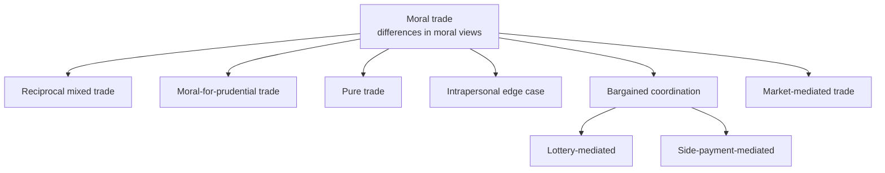
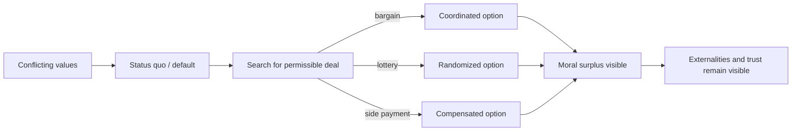
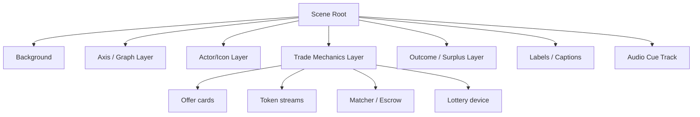

# Complex Animation Design for Moral Trade Types

## Executive Summary

This research began with the user-specified source on `amirrorclear.net`: Toby Ord’s 2015 paper *Moral Trade*. I then cross-checked its publication record, author summary, practical legal examples, implementation tooling, and accessibility guidance using the official *Ethics* record, Toby Ord’s research page, the Ninth Circuit’s *Porter v. Bowen* opinion, the FEC materials on Repledge/OnePledge, OpenAI’s Codex documentation, official animation-engine documentation, and W3C accessibility guidance. citeturn0view0turn11search5turn20view0turn21view0turn26view0turn18search0turn34search0turn35view0turn35view2

Ord’s paper explicitly defines **moral trade** as trade made possible by differences in the parties’ moral views, and distinguishes **pure moral trade** from **mixed moral trade**. It also presents an **intrapersonal** edge case and sketches mechanism-level forms including **moral barter**, **bargaining**, **lotteries**, **side payments**, **markets**, **currency**, and **professionalization**. Because the user asked for an animation for “each type,” the most production-useful reading is to separate: foundational value-structure types, the intrapersonal edge case, and the main mechanism-types that Ord actually develops with figures and examples. citeturn5view0turn40view2turn6view0turn8view0

On that basis, the strongest animation suite is an **eight-film system**: reciprocal mixed trade, moral-for-prudential trade, pure opposed-cause trade, intrapersonal trade, bargained coordination, lottery-mediated trade, side-payment trade, and market-mediated trade. This covers the paper’s key conceptual ground without collapsing its most important distinctions. It also maps cleanly onto the paper’s own visual logic: conflicting value systems, default/status-quo points, Pareto-superior regions, probability arcs, and compensating side-payment lines. citeturn40view0turn40view1turn9view1turn9view3turn9view4turn10view0

The best overall implementation route for Codex-driven production is a **programmatic 2D motion-graphics pipeline** with **Remotion** as the default render engine, **Motion Canvas** as an alternative for signal-driven scene graphs, and **Manim** for the graph-centric bargaining, lottery, and side-payment sequences. Remotion is especially well suited because it models videos as React compositions with explicit frame counts and provides built-in interpolation and spring primitives; Motion Canvas is strong for scene generators and signals; Manim is strong for precisely structured explanatory animation and rate functions; and Three.js or Blender should be reserved for optional depth-heavy or interactive sequences rather than the default build. citeturn27view0turn27view1turn27view2turn27view8turn28view0turn27view3turn27view4turn27view7turn13search0

Accessibility should not be an afterthought. The safest design rule-set is: avoid red/green dependence, use redundant coding through shapes and labels, meet at least WCAG AA contrast thresholds for text and meaningful graphics, provide captions for all meaningful audio, supply audio description or a full text alternative for dense visual-only sequences, and ship reduced-motion variants that replace pans, zooms, and large-scale motion with opacity changes or stepwise state transitions. The ethical note is equally important: Ord emphasizes that moral trade is not guaranteed to be objectively best; it is guaranteed only to look better from the parties’ perspectives, and it can create externalities or perverse incentives. The animations should therefore portray **structured disagreement and negotiated gains**, not moral triumphalism. citeturn35view2turn35view3turn35view4turn35view5turn35view6turn35view0turn35view1turn38view0turn37view1turn37view2turn37view3turn32view0turn32view1

## Source Basis and Working Typology

The paper itself is the primary source, and it is enough to ground the conceptual extraction. The secondary sources mainly help in four places: publication confirmation, practical market examples, implementation tooling, and accessibility. Toby Ord’s own summary reinforces that the gains from moral trade may be large even across very different moral views; the Ninth Circuit opinion clarifies how vote-swapping sites operated and why they mattered as a real market-like facilitation layer; the FEC/OnePledge materials show the mechanics of a donation-matching/cancellation platform; and the animation/accessibility sources help convert the philosophy into buildable, accessible motion systems. citeturn20view0turn21view0turn26view0turn27view0turn35view0turn36view2

Because Ord uses “type” at more than one level, I adopt a **working typology** with two tiers: **value-structure types** and **mechanism types**. This is analytically faithful to the paper and production-friendly for animation design. citeturn5view0turn40view2turn6view0



The typology above reflects Ord’s explicit definitions of pure and mixed trade, his intrapersonal edge case, and his development of bargaining, randomness, side payments, and organized markets. citeturn5view0turn6view0turn8view0

| ID | Animation target | Definition extracted from the paper | Key actors | Inputs → outputs | Dynamics to show | Visual essence |
|---|---|---|---|---|---|---|
| A | **Reciprocal mixed trade** | In Victoria–Paul style trade, both sides accept a **small prudential cost** for what each sees as a **moral gain**; Ord summarizes this as “moral gain plus small prudential cost versus moral gain plus small prudential cost.” citeturn40view0turn39view0 | Two friends with different moral weightings | Vegetarianism + 1% income donation → more animal welfare + more poverty relief | Reciprocal promise, continuing compliance, trust | Two differently weighted value systems finding an overlap bridge |
| B | **Moral-for-prudential trade** | Ord’s example of Victoria paying someone to become vegetarian is mixed trade where one side sees “moral gain plus small prudential cost” and the other sees “pure prudential gain.” He also notes related cases of specialization/professionalization through donations that pay others to do good acts. citeturn39view0turn40view2 | One moral agent, one fence-sitter or service provider | Money/incentive → changed behavior or outsourced good deed | Incentive alignment rather than reciprocity | A behavior is “purchased” into moral alignment |
| C | **Pure trade between opposed causes** | Pure moral trade is where **both parties view the result as morally superior**. Ord’s Rebecca–Christopher vignette turns offsetting donations to opposed causes into a shared donation to Oxfam, which both judge better than funding both sides of a zero-sum battle. citeturn5view0turn40view1turn39view3 | Two opponents plus optional onlooker/matcher | Opposing donations → redirected compromise donation | Cancellation of conflict produces jointly endorsed surplus | Zero-sum vectors collapse into a common good |
| D | **Intrapersonal moral trade** | Ord describes intrapersonal trade as an edge case where one person’s prudential and moral considerations can be reorganized into another pair of actions that is better on both dimensions, as in Alex flying while offsetting twice the emissions. He does not formally include it in the definition, but says some of the theory still applies. citeturn40view2 | One person split across value systems | Desire + moral concern + offset payment → travel plus improved climate contribution | Internal negotiation rather than interpersonal exchange | A divided self converges on a better bundle |
| E | **Bargained coordination trade** | Ord’s graph-based analysis shows cases where collaboration on A or B would create more total value, but **no non-randomized team-up option lies above and to the right of the default**. If repeated, parties can alternate or bargain over outcomes. citeturn6view0turn9view3 | Two parties, projects A and B | Joint labor/coordination → higher collective output | Default point blocks direct agreement; repeated interaction enables alternation | Negotiation around a constrained Pareto frontier |
| F | **Lottery-mediated trade** | When no direct team-up option dominates default, Ord proposes a **weighted lottery** between A and B. The resulting options span an arc or line from A to B, and some randomizations may dominate default. citeturn6view0turn9view4 | Two parties plus randomization device | Probability weights → one jointly executed project | Chance creates a bridge into the win-win region | Probability as a curved bridge across disagreement |
| G | **Side-payment trade** | Ord’s second escape route is a side payment in a more or less continuous medium, illustrated by charitable side payments that can move options into the Pareto-superior quadrant and may dominate the lottery approach. citeturn6view0turn10view0 | Two parties plus compensation channel | Project choice + donation transfer → compensated agreement | Compensation reshapes feasibility | A diagonal compensation stream shifts the deal into acceptability |
| H | **Market-mediated trade** | Ord explicitly says moral barter could be scaled into equivalents of currency, markets, bargaining, and professionalization. His practical cases include legislative vote trades, public vote-swapping sites, donation-cancelling markets, and a more complete-market vision akin to eBay/Craigslist with prices and perhaps special-purpose currency. The Ninth Circuit opinion shows how vote-swap sites matched users; the Repledge/OnePledge materials show a matching-and-clearing flow for redirecting matched political pledges to charities. citeturn40view2turn8view0turn21view0turn26view0 | Many traders, platform, matcher, payment processor, optional escrow | Offers, prices, match ratios, trust mechanisms → cleared exchanges and residual unmatched flows | Search, matching, clearing, and trust at scale | A moral exchange network rather than a single handshake |

The paper’s own figures are especially useful for animation design because they already visualize choiceworthiness, default constraints, lottery arcs, and side-payment lines. Those diagrams strongly support using coordinate transforms, point motion, and shape interpolation as the master visual language for the coordination-oriented films. citeturn9view1turn9view3turn9view4turn10view0

## Visual Grammar and Animation Concepts

A strong suite should look like one family while still giving each trade-type its own identity. The highest-confidence unifying grammar is: **dual-perspective layouts**, **visible status quo/default state**, **transformation of blocked flows into feasible ones**, and **surplus made legible as motion upward/rightward or as bloom/expansion**. That is directly aligned with Ord’s graphs and examples. citeturn6view0turn9view1turn9view3turn9view4turn10view0

For accessibility, the global color rule should follow Color Universal Design and WCAG logic: avoid red/green-only meaning, add redundant coding through shapes and labels, prefer distinguishable warm/cool alternation, keep meaningful graphics at least 3:1 against adjacent colors, and keep text at least 4.5:1 for standard text. The CUD guidance specifically warns against red/green ambiguity, recommends redundant coding, and explains why vermilion, bluish green, sky blue, blue, and reddish purple are safer differentiators. citeturn37view1turn37view2turn37view3turn35view4turn35view5turn36view0turn36view1

A good master palette system is therefore: near-black graphite background, warm vermilion/orange for one viewpoint, bluish green for the second, sky blue for neutral public goods, reddish purple for uncertainty/lottery, amber for money or side-payments, and off-white for captions and labels. Use dashed vs solid strokes, circles vs squares, and left vs right positioning so that color is never the only carrier of meaning. That recommendation is an inference from the accessibility sources, not a claim made by Ord. citeturn37view1turn37view2turn35view4

| ID | Primary visual metaphor | Palette direction | Motion style | Signature key frames | Transition strategy | Sound cues |
|---|---|---|---|---|---|---|
| A | **Bridge of overlap** between two moral landscapes | Vermilion/amber for Victoria’s sacrifice channel, bluish green/sky blue for Paul’s poverty channel, off-white labels | Symmetrical mirrored motion, gentle elastic settle, recurring trust pulse | Split-screen frustration → offer cards cross → bridge forms → both moral meters rise | Direct morph from icons to bars to axis plot | Soft card-swap clicks, heartbeat-like trust pulse, paired chime on agreement |
| B | **Behavior as a magnetized purchase** | Gold/amber money stream, leaf-green target behavior, warm gray neutrals | Push-pull motion, coin stream morphs into leaves/behavior markers | Wallet opens → token stream → person’s plate/habit changes → moral halo appears | Match-cut through token shapes | Coin tings, muted whoosh, small upward shimmer |
| C | **Cancellation into common reservoir** | Opposed colors at start, converging into calm sky blue/white common-good field | Stronger counter-motion at first, then collapse and bloom | Two arrows collide → cancelled ledger lines vanish → shared reservoir fills | Hard cut on collision, soft dissolve into shared good | Tense taps during conflict, cancellation thump, choral swell |
| D | **Interior cockpit / divided self** | Midnight blue base, magenta “desire,” cyan “moral concern,” white final synthesis | Slow orbital motion, mirrored self-panels, low-parallax UI | Split self → plane path blocked → double-offset rings draw in → unified path launches | Holographic panel fold-in | Low synth drone, route beep, satisfying lock tone |
| E | **Negotiation on the Pareto map** | Slate/white graph, orange A, blue B, gray default cross | Precise mathematical motion, no bounce, subtle pan | Default cross appears → A/B team-up points fail → weekly calendar alternation flips → frontier settles | Shape-draw and point highlighting | Tick-tock, pen-draw scratch, quiet confirmation click |
| F | **Probability arc** | Reddish purple uncertainty arc, cyan/amber endpoint markers | Curved motion, weighted easing, particle trail on roulette point | A and B labeled → arc appears → probability point slides to feasible span → coin/lottery draw resolves | Arc writes itself; camera follows marker | Roulette ticks, suspended tone, resolving bell |
| G | **Compensation line** | Navy background, white axes, amber payment stream, compensated point in bluish green | Linear slide plus finite donation pulses | A/B points → parallel side-payment lines draw → donation packets travel → deal point crosses feasible boundary | Donation packets become axis displacement | Ledger clicks, receipt rip, bright but short confirmation tone |
| H | **Moral exchange / clearinghouse** | Charcoal with cyan network lines, amber price tags, magenta unmatched residuals, white labels | Dense but orderly node animation, batch matching, network bloom | Order book fills → matching engine pairs nodes → matched flows reroute → residual unmatched orders remain visible | Wipe in batches, not continuous chaos | Market pings, soft gate opens, clearing bell, residual low click |

A helpful production distinction is that **A–D** should feel more character- and icon-driven, while **E–H** should feel more system- and graph-driven. That split tracks the paper itself: the early vignettes are person-centered, while the middle and later sections become formal, economic, and institutional. citeturn40view0turn40view1turn40view2turn6view0turn8view0



That arc mirrors the paper’s structure: initial conflict, default constraint, search over feasible options, mechanism-specific resolution, and a reminder that trust and externalities remain part of the story. citeturn6view0turn7view0turn32view1

## Storyboards and Shot Lists

All shot lists below assume **30 fps**, **16:9**, and a default master render of **3840×2160**. Durations are recommendations rather than source-derived facts. The frame ranges are implementation-ready and intended to be directly portable to Remotion, Motion Canvas, or Manim.

**A. Reciprocal mixed trade**

| Shot | Frames | Duration | Frame description |
|---|---:|---:|---|
| Setup | 0–179 | 6s | Left frame shows Victoria with an animal-welfare meter; right frame shows Paul with a poverty-relief meter. Each side also has a smaller prudential meter. Their priorities are visibly different, not opposed. |
| Friction | 180–419 | 8s | Steak icon on Paul’s side and wallet icon on Victoria’s side generate dotted “if only” arrows across the split. Small labels show “would not choose this alone.” |
| Offer | 420–719 | 10s | Two offer cards appear: “1% income” and “vegetarian.” They slide to center, rotate, and swap lanes. A minimalist handshake line becomes a bridge spanning the split. |
| Trade effect | 720–1019 | 10s | Meat desaturates into a leaf on Paul’s side; Victoria’s donation stream becomes clinic, water, and aid icons. Prudential meters dip slightly; moral meters rise clearly on both sides. |
| Closure | 1020–1259 | 8s | The bridge resolves into a unified two-axis mini-graph with the trade point above and right of the default. End card: “small prudential cost, bilateral moral gain.” |

**B. Moral-for-prudential trade**

| Shot | Frames | Duration | Frame description |
|---|---:|---:|---|
| Setup | 0–149 | 5s | A moral agent appears on the left, a fence-sitter on the right, with a behavior target in the middle: a plate/habit icon. |
| Incentive reveal | 150–359 | 7s | A wallet and token stream appear from the moral agent. The fence-sitter’s prudential meter brightens as the tokens approach. |
| Conversion | 360–629 | 9s | Tokens hit the behavior target and morph into leaves/checkmarks. The behavior target flips from “not adopted” to “adopted.” |
| Moral outcome | 630–869 | 8s | The moral agent’s outcome field blooms upward while the other party’s gain remains explicitly prudential. The asymmetry is shown as intentional, not unfair. |
| Closure | 870–1079 | 7s | A small caption panel reframes the sequence as mixed trade and briefly flashes the related professionalization idea: “others may perform the good act more efficiently.” |

**C. Pure trade between opposed causes**

| Shot | Frames | Duration | Frame description |
|---|---:|---:|---|
| Setup | 0–179 | 6s | Rebecca and Christopher appear at opposite ends of the frame, each with a $1,000 token stack and opposed campaign arrows traveling toward each other. |
| Zero-sum clash | 180–419 | 8s | The arrows strike and cancel. The field fills with wasted heat/noise particles, making the zero-sum structure visible. |
| Common charity discovery | 420–719 | 10s | A neutral Oxfam-like “shared aid” reservoir appears between them. Their opposing token stacks pivot toward the center, but hesitate. |
| Pure trade execution | 720–1079 | 12s | Both stacks move simultaneously into the common reservoir, which fills and sends upward benefit rays. Their personal moral meters both rise. |
| Closure | 1080–1319 | 8s | Final diagram shows two opposed vectors replaced by one upward common-good vector labeled “pure moral trade.” |

**D. Intrapersonal moral trade**

| Shot | Frames | Duration | Frame description |
|---|---:|---:|---|
| Setup | 0–149 | 5s | One person is split into two semi-transparent selves: “prudential desire” and “moral concern.” A plane route to Paris sits behind a red block. |
| Conflict | 150–299 | 5s | The desire-self advances toward the route; the moral-self pulls it back toward a climate icon. The route remains locked. |
| Reframing | 300–539 | 8s | A friend-suggestion card or idea-bubble appears: “double offset.” Carbon tokens draw in around the plane path. |
| Integrated action | 540–809 | 9s | The offsets build two concentric rings; the block dissolves; the two selves merge into a single figure who follows the route. |
| Closure | 810–1019 | 7s | A two-column internal dashboard shows prudential value improved and moral value improved relative to staying home without offsetting. |

**E. Bargained coordination trade**

| Shot | Frames | Duration | Frame description |
|---|---:|---:|---|
| Setup | 0–179 | 6s | A clean coordinate graph appears with a default cross and two prominent points, A and B, each tied to one party’s preferred joint project. |
| Constraint | 180–419 | 8s | A and B highlight in turn, but each fails one party’s acceptability test relative to default. No point lies in the feasible upper-right region. |
| Repetition enters | 420–659 | 8s | A weekly timeline or calendar wheel slides in. A and B alternate across weeks, visibly averaging into a fairer pattern. |
| Bargain | 660–959 | 10s | The animation compares “one-off impossible” with “repeated fair alternation.” Frontier points pulse, and the moral surplus lost to bargaining is shown as faint unclaimed glow. |
| Closure | 960–1199 | 8s | End card: “when single-shot agreement fails, repeated structure can recover gains.” |

**F. Lottery-mediated trade**

| Shot | Frames | Duration | Frame description |
|---|---:|---:|---|
| Setup | 0–149 | 5s | Reuse the graph setup from E, but simplify the background to emphasize A, B, and default. |
| Arc construction | 150–329 | 6s | A curved arc or segment is drawn from A to B, visualizing the space of weighted lotteries. |
| Search | 330–539 | 7s | A glowing probability marker slides along the arc, with numeric weights updating subtly. The moment it enters the feasible region is emphasized. |
| Randomized resolution | 540–779 | 8s | A coin/roulette device resolves the selected mix into an actual project, and both parties move together toward the winning project. |
| Closure | 780–1019 | 8s | Final caption: “chance can create a mutually acceptable path when certainty cannot.” |

**G. Side-payment trade**

| Shot | Frames | Duration | Frame description |
|---|---:|---:|---|
| Setup | 0–149 | 5s | A graph similar to E/F appears, this time with A and B plus space for compensation lines. |
| Compensation field | 150–359 | 7s | Parallel side-payment lines draw outward from A and B. Amber donor tokens begin to travel along one line. |
| Crossing into feasibility | 360–629 | 9s | As donation tokens move, the active deal point slides upward/rightward and crosses into the acceptable quadrant. |
| Compare with lottery | 630–899 | 9s | The lottery arc from F appears faintly in the background, while the compensated point sits above it, making Ord’s “can dominate the randomized approach” intuition legible. |
| Closure | 900–1139 | 8s | End card: “continuous side payments can reshape the deal space.” |

**H. Market-mediated trade**

| Shot | Frames | Duration | Frame description |
|---|---:|---:|---|
| Setup | 0–179 | 6s | Start with a single barter-style trade card between two people, then rapidly zoom out to reveal many nodes entering a shared marketplace. |
| Matching layer | 180–479 | 10s | A market board fills with offers, requests, ratios, and cause-tags. The matching engine pairs vote-swap style offers across safe/swing-state or opposed-cause lanes. |
| Clearing layer | 480–839 | 12s | A clearing animation processes matched pairs. For the donation variant, matched shares route to charities while unmatched residuals remain with political committees, echoing the Repledge/OnePledge logic. |
| Trust and infrastructure | 840–1199 | 12s | Escrow, receipts, audits, and reputation badges appear. Two callouts labeled “factual trust” and “counterfactual trust” pulse at the edges. |
| Closure | 1200–1499 | 10s | The market condenses into an abstract “moral exchange” emblem with optional sublabels: barter, bargaining, currency, markets, professionalization. |

For visual reference, the bargaining, lottery, and side-payment animations should borrow directly from the structural logic of Ord’s figures: Pareto-optimal dots, the default cross with an upper-right feasible zone, the lottery arc/segment between A and B, and side-payment lines extending from A or B. citeturn9view1turn9view3turn9view4turn10view0

## Codex-Ready Implementation Specification

OpenAI’s current Codex guidance is highly compatible with this project: plan first for difficult tasks, break complex work into smaller focused steps, give the agent one objective and one stopping condition, point it at the files and docs it must read first, use repository guidance files such as `AGENTS.md`, and keep work in checkpoints. Current Codex docs also confirm that Codex can read, edit, and run code, and that GPT-5.5 is the recommended current model for most Codex tasks when available. citeturn34search0turn34search6turn34search9turn34search11turn18search0turn18search8turn18search11

A repository structure that will be easy for Codex to reason over is:

```text
moral-trade-animations/
  AGENTS.md
  docs/
    moral-trade-report.md
    style-guide.md
    accessibility-checklist.md
  scene-specs/
    A-reciprocal-mixed.json
    B-moral-for-prudential.json
    C-pure-opposed-cause.json
    D-intrapersonal.json
    E-bargained-coordination.json
    F-lottery.json
    G-side-payment.json
    H-market-mediated.json
  assets/
    icons/
    textures/
    audio/
    captions/
  src/
    components/
      Axis.tsx
      Meters.tsx
      TokenStream.tsx
      OfferCard.tsx
      NetworkMatcher.tsx
      Captions.tsx
    scenes/
      A.tsx
      B.tsx
      C.tsx
      D.tsx
      E.tsx
      F.tsx
      G.tsx
      H.tsx
    Root.tsx
```

That layout aligns with Codex’s documented preference for explicit project instructions, file-first prompting, and task scoping. citeturn34search6turn34search11

A minimal `AGENTS.md` should instruct Codex to: read `docs/style-guide.md` and the target `scene-specs/*.json` first; generate one scene at a time; render a preview after each scene; enforce caption and reduced-motion variants; and avoid adding dependencies unless necessary. This is directly in line with Codex’s documented workflow guidance. citeturn34search0turn34search9turn34search11

A generic scene schema that works across Remotion, Motion Canvas, or a custom renderer:

```ts
type EasingName =
  | "linear"
  | "easeInSine"
  | "easeOutCubic"
  | "easeInOutSine"
  | "easeInOutCubic"
  | "springSoft"
  | "springFirm";

type Keyframe = {
  frame: number;
  props: Record<string, number | string | boolean>;
  ease?: EasingName;
};

type NodeSpec = {
  id: string;
  kind:
    | "group"
    | "svg"
    | "text"
    | "icon"
    | "meter"
    | "tokenStream"
    | "axis"
    | "graphPoint"
    | "line"
    | "particleField"
    | "audioCue";
  parent?: string;
  asset?: string;
  props: Record<string, unknown>;
  keyframes?: Keyframe[];
  children?: string[];
};

type SceneSpec = {
  id: string;
  fps: 30;
  width: 3840;
  height: 2160;
  durationInFrames: number;
  background: {color: string; texture?: string};
  palette: Record<string, string>;
  nodes: NodeSpec[];
  captions: {start: number; end: number; text: string}[];
  audio: {frame: number; cue: string; gainDb?: number}[];
  reducedMotionOverrides?: Record<string, unknown>;
};
```

A renderer pseudocode skeleton for Remotion-style execution:

```ts
function renderScene(spec: SceneSpec, frame: number) {
  const ctx = createSceneContext(spec, frame);

  for (const node of topologicallySort(spec.nodes)) {
    const base = node.props;
    const animated = interpolateProps(node.keyframes ?? [], frame);
    const props = applyReducedMotionIfNeeded(
      merge(base, animated),
      spec.reducedMotionOverrides,
      node.id
    );
    drawNode(ctx, node.kind, props, node.asset);
  }

  renderCaptions(spec.captions, frame);
  triggerAudioCues(spec.audio, frame);
}
```

This maps naturally onto Remotion’s frame-driven compositions and interpolation/spring helpers, Motion Canvas’s generator-and-signal model, and Manim’s explicit scene and rate-function model. citeturn27view0turn27view1turn27view2turn27view8turn28view0turn27view3turn27view4



A practical motion-parameter library:

```ts
const MOTION = {
  reveal: "easeOutCubic",
  compare: "easeInOutSine",
  settle: "easeInOutCubic",
  pulse: {type: "springSoft", stiffness: 90, damping: 14, mass: 1},
  emphasize: {type: "springFirm", stiffness: 120, damping: 16, mass: 1},
  cameraPanMaxPct: 4,            // keep low for accessibility
  zoomMaxPct: 8,                 // disable in reduced-motion mode
  opacityFadeFrames: 12,
  labelSlidePx: 80,
  tokenBurstCount: 12,
};
```

The choices above are intentionally conservative: smooth explanatory curves for most motion, limited bounce, and spring only for emphasis or agreement-lock moments. That is consistent with Remotion’s explicit spring/interpolation model and Manim’s canonical easing families. citeturn27view1turn27view2turn27view4

Per-animation implementation mapping:

| ID | Best default engine | Scene-graph focus | Core reusable assets | Key animation parameters | Fallback simplification |
|---|---|---|---|---|---|
| A | Remotion or Motion Canvas | Two avatars, four meters, bridge, offer cards, mini-graph | 2 avatars, animal/poverty icons, bridge SVG, meter component | Reciprocal card swap at f420–540; bridge draw f500–650; moral meter rise +18–25%; prudential dip −4–6% | Replace avatars with labeled circles and icon tags |
| B | Remotion; exportable Lottie variant possible | Wallet, token stream, behavior target, halo | Wallet, coin tokens, plate, leaf, checkmark | Token emission ramp f180–420; morph progress 0→1 over 45 frames; prudential glow +20% | Replace morph with crossfade between “before” and “after” icons |
| C | Remotion or Motion Canvas | Opposed vectors, cancellation field, shared reservoir | 2 avatars, vector arrows, reservoir, aid icons | Counter-motion amplitude 1.0→1.3 before collision; cancellation burst at frame 420; fill level 0→100% by frame 980 | Skip particles; use simple arrow collision and fill meter |
| D | Remotion | Split-self panels, route path, offset rings | Single avatar duplicated, plane path, carbon icons, UI cards | Internal split width 50/50→0/100 by frame 760; offset ring draw segment 0→1 over 120 frames | Use two columns and a single route card, no cockpit UI |
| E | Manim or Motion Canvas | Axes, default cross, A/B points, timeline/calendar | Axis component, labeled points, weekly timeline | Point pulse radius 12→20 px; calendar alternation cycle every 45 frames | Static graph with alternating highlight and no timeline sweep |
| F | Manim | A/B points, arc/segment, probability marker, roulette device | Axis component, gradient arc, spinner/coin | Marker pathProgress 0→1 over 180 frames; selected weight label fade-in after frame 420 | Use straight segment instead of curve; remove roulette device |
| G | Manim | A/B points, side-payment lines, donation packets | Axis component, compensation lines, packet sprites | Packet cadence every 12 frames; deal point x/y shift +140/+110 px into feasible zone | Show single amber line and one moving packet only |
| H | Remotion; optional Three.js enhancement | Order book, network graph, matcher, escrow, residual unmatched flows | Network nodes, queue cards, escrow icon, reputation badge, residual order markers | Batch match every 30 frames; network bloom +15% on clear; residual unmatched pulse every 60 frames | Pure 2D network; no camera, no 3D depth, no particle clutter |

Tool recommendations by output mode:

- **Remotion** should be the default for the production master because it uses React compositions with explicit frame metadata and built-in interpolation/spring helpers, which makes it unusually compatible with Codex-generated code and testable scene components. citeturn27view0turn27view1turn27view2
- **Motion Canvas** is a strong alternate stack if the team prefers generator-based scene authoring and signal-driven dependency updates. citeturn27view8turn28view0
- **Manim** is the best fit for E, F, and G if mathematical clarity matters more than brand-heavy motion design. citeturn27view3turn27view4
- **Three.js** is useful only if H becomes interactive or requires true 3D spatial depth; otherwise it adds complexity without explanatory gain. citeturn27view7
- **Lottie** is excellent for **small, vector, cross-platform** deliverables and simplified variants, but it is best used for lighter scenes or UI/embed derivatives rather than the full graph-heavy suite. That recommendation is an inference from official Lottie documentation describing the format as JSON-based animated vector graphics and native/cross-platform rendering. citeturn29search5turn29search6turn29search3

A high-quality Codex task prompt template:

```text
Objective:
Implement scene G-side-payment as a Remotion composition.

Read first:
docs/style-guide.md
docs/accessibility-checklist.md
scene-specs/G-side-payment.json

Stopping condition:
- src/scenes/G.tsx renders without type errors
- preview MP4 exports at 30 fps
- captions JSON exists
- reduced-motion variant exists
- visual diff snapshots pass

Constraints:
- no new runtime dependencies unless strictly necessary
- use existing Axis, TokenStream, Captions components
- keep camera static in reduced-motion mode
- do not use color as the only carrier of meaning
- log any unclear spec assumptions in docs/implementation-notes.md
```

That structure follows documented Codex best practices: define one goal, define a stopping condition, point Codex at required inputs first, and scope work tightly enough that the agent can verify its own output. citeturn34search0turn34search9turn34search11

## Accessibility, Ethics, and Production Planning

The accessibility baseline for this suite should include all of the following: synchronized captions for all meaningful audio and sound effects; audio description or a full text alternative for dense visual-only sequences; a reduced-motion version that swaps panning, zooming, and scale pulses for dissolves, opacity shifts, or discrete state changes; user controls to pause or stop long-running motion if embedded on the web; at least 4.5:1 contrast for standard text; at least 3:1 contrast for meaningful graphical objects; and redundant coding so no category depends on color alone. W3C’s guidance is explicit on each of these points, and MDN confirms that `prefers-reduced-motion` is now broadly supported across devices and browsers. citeturn35view2turn35view3turn35view0turn35view1turn35view4turn35view5turn35view6turn36view1turn38view0

The color-accessibility standard should also incorporate Okabe–Ito / Color Universal Design principles more concretely: avoid red/green-only contrasts, prefer distinguishable warm/cool pairs, use labels and shapes in addition to color, and be cautious with thin lines and small glyphs because color-blind viewers may lose those distinctions first. The CUD guidance goes further and recommends describing position or shape in speech rather than relying on color names alone, which is directly relevant both for captions and audio description. citeturn37view1turn37view2turn37view3

The ethical representation notes matter as much as the design notes. Ord argues that consequentialism, deontology, and virtue ethics can all have reasons to participate in moral trade, though for different reasons. He also emphasizes that the central practical obstacle is trust, and that moral trade can create externalities or perverse incentives even if it benefits the trading parties from their own perspectives. So the animation language should not imply that one side is “the rational one” and the other is “the obstacle.” It should show symmetric disagreement, negotiated gain, trust architecture, and caveats. In practical terms, that means no villain framing, no halo over a single worldview, and no ending card that implies objective moral victory. citeturn7view0turn32view0turn32view1

Estimated production effort below is an informed design estimate, not a source-derived fact.

| ID | Purpose | Target length | Primary metaphor | Complexity | Unique assets | Estimated effort | Skill level | Recommended engine |
|---|---|---:|---|---|---|---|---|---|
| A | Explain bilateral mixed trade with reciprocal sacrifice | 42s | Overlap bridge | Medium | 2 avatars, 4 meters, bridge | 3–4 person-days | Intermediate motion designer/developer | Remotion |
| B | Explain moral-for-prudential incentive alignment | 36s | Magnetic purchase / behavior morph | Low–Medium | wallet, token stream, habit target | 2–3 person-days | Intermediate | Remotion or Lottie derivative |
| C | Explain pure trade via cancellation of opposed causes | 44s | Cancellation into common reservoir | Medium | opposed vectors, reservoir, bloom field | 3–4 person-days | Intermediate–Advanced | Remotion |
| D | Explain internal negotiation within one person | 34s | Split self / cockpit | Medium | duplicated character, route UI, offset rings | 2–3 person-days | Intermediate | Remotion |
| E | Explain constrained bargaining and alternation | 40s | Pareto map + calendar | Medium | graph system, points, timeline | 3–4 person-days | Intermediate–Advanced | Manim or Motion Canvas |
| F | Explain lottery as feasibility bridge | 34s | Probability arc | Medium | graph system, arc, roulette indicator | 2–3 person-days | Intermediate–Advanced | Manim |
| G | Explain side payments as deal-space reshaping | 38s | Compensation line | Medium | graph system, side-payment packets | 3–4 person-days | Intermediate–Advanced | Manim |
| H | Explain scaled-up markets and clearing | 50s | Moral exchange network | High | network graph, order book, matcher, escrow visuals | 5–7 person-days | Advanced | Remotion, optional Three.js layer |

If the goal is a **single-stack build**, use Remotion for all eight and accept slightly less mathematical elegance in E–G. If the goal is the **highest explanatory clarity**, use a hybrid stack: Remotion for A–D and H, Manim for E–G. If the goal is **web-native lightweight embeds**, produce simplified Lottie derivatives for A, B, and D only. Those recommendations follow from the respective tool docs and from the structure of the scenes themselves. citeturn27view0turn27view1turn27view2turn27view3turn27view4turn29search3turn29search6

## Open Questions and Limitations

The main conceptual limitation is that Ord’s paper does not publish a single canonical list titled “types of moral trade.” It explicitly defines **pure** and **mixed** moral trade, includes an **intrapersonal** edge case, and then develops **mechanism classes** such as lotteries, side payments, and markets. The eight-animation taxonomy in this report is therefore a rigorous production interpretation of the paper, not a claim that Ord enumerated exactly these eight as formal categories. citeturn5view0turn40view2turn6view0

The practical examples of vote-swapping and donation-cancelling platforms are historically grounded in the paper and in legal/regulatory documents, but they should not be presented as currently active consumer platforms. The safe claim is that they are **illustrative real-world instantiations** of market-mediated moral trade, not necessarily live products now. citeturn8view0turn21view0turn26view0

Finally, the report gives implementation-ready scene architecture and frame ranges, but it does not include literal per-frame value dumps for every object in every animation. That omission is intentional: those values should be generated from the scene specs and easing library rather than hard-coded by hand. Remotion, Motion Canvas, Manim, and Three.js all support this more maintainable approach. citeturn27view0turn27view1turn27view2turn27view8turn27view7