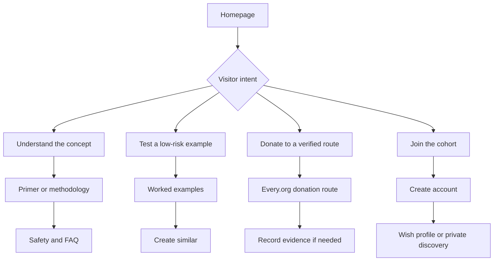
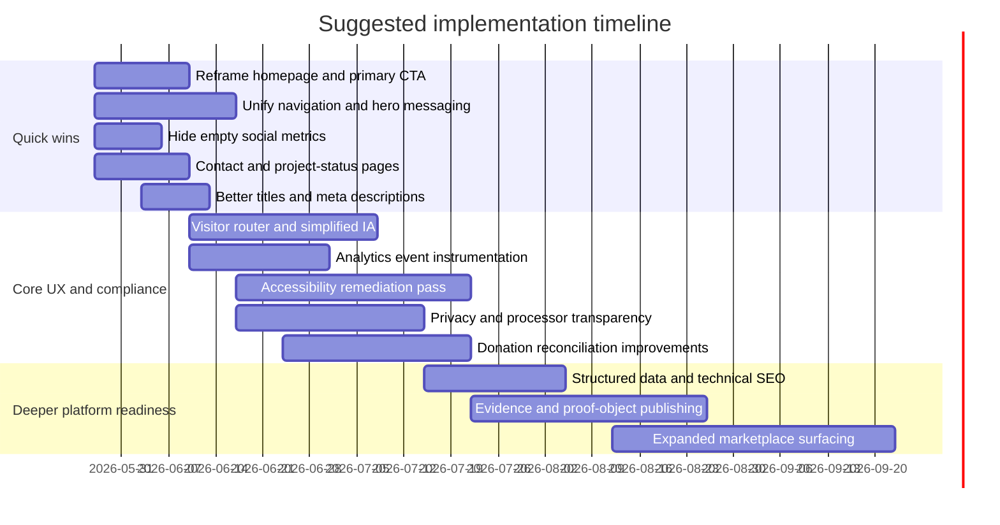

# Moral Trade website audit and improvement report

## Executive summary

Moral Trade has a strong conceptual core and an unusually honest public posture for an early-stage platform. The site repeatedly states that it is a prototype, separates worked examples from live marketplace activity, avoids claiming escrow or custody, and puts safety, privacy, and evidence review near the center of the product narrative. Those are real strengths, especially for a concept that touches moral disagreement, money, verification, and semi-private matching. The problem is not that the idea is weak; it is that the public website currently asks first-time visitors to absorb too many ideas, too many routes, and too many partially built institutional mechanisms before they understand the single most important thing the product does. citeturn13view0turn15view0turn16view0turn16view2turn44view0

The highest-confidence diagnosis is this: the site is more mature as a research-and-governance concept than as a public-facing acquisition and conversion experience. The homepage and related pages present pledge swaps, donation offsets, paid action offers, public-goods contributions, private discovery, wish registries, MPGF pools, and a Priority Correction Fund, even though the public activity snapshot still shows zero live offers, eight worked examples, and two public profiles. That mismatch between conceptual breadth and current marketplace depth dilutes the primary user journey and makes the “marketplace” claim feel ahead of the current network reality. citeturn13view0turn16view0turn17view0turn19view2

The most important improvements are therefore strategic, not cosmetic. Moral Trade should simplify its public story around one sentence, one audience-routing decision, and one primary action per page. It should unify navigation and hero messaging, reduce or defer empty social and governance signals, make trust and recourse clearer, improve metadata and discoverability, instrument analytics properly, and close the most likely WCAG 2.1 AA gaps around link purpose, navigation consistency, form labeling, focus handling, and transactional error prevention. Those changes should happen before expanding the visible surface area of advanced governance features. citeturn13view0turn16view2turn17view0turn43view0turn43view1turn40view0

A useful strategic reframing is: **do not market Moral Trade as a live marketplace first; market it as a carefully reviewed pilot for testing low-risk moral cooperation under disagreement.** The site’s own public evidence already supports that framing better than a liquidity-first marketplace frame. citeturn13view0turn16view0turn44view0

*Assumptions and scope.* This review covers public, unauthenticated pages that were accessible during the audit. Server response headers, raw HTML, robots.txt, sitemap files, structured data markup, and authenticated flows could not all be directly verified with the available tools, so findings in those areas are explicitly marked as inference, partial, or incomplete.

| Area | Assessment | Confidence | Why it matters | Evidence |
|---|---|---:|---|---|
| Concept and mission | Strong | High | The core idea is distinctive, rigorous, and honestly framed as a pilot. | citeturn4view3turn13view0turn15view0 |
| Homepage clarity | Mixed | High | Multiple frames and actions compete at once. | citeturn13view0turn16view0 |
| Navigation consistency | Weak | High | Public pages expose different navigation schemas and home messaging. | citeturn13view0turn16view0 |
| Trust and safety posture | Strong | High | Safety, anti-threat, privacy, and non-custody boundaries are unusually explicit. | citeturn16view2turn43view0turn43view1 |
| Real marketplace readiness | Weak | High | Zero live offers and only two public profiles make discovery-first UX premature. | citeturn13view0turn17view0 |
| Donation and payment flow | Mixed | High | External routes are honest, but reconciliation steps add friction. | citeturn4view8turn16view3 |
| SEO and discoverability | Weak to mixed | Medium | Inner pages are descriptive; homepage title/positioning are too generic. | citeturn2search1turn18view2turn3search5 |
| Accessibility readiness | Mixed | Medium | Skip links exist, but likely issues remain in link purpose, form labeling, and consistency. | citeturn13view0turn16view3turn44view0turn40view0 |
| Analytics readiness | Weak | Medium | No public analytics or cookie disclosure is evident, and no measurement plan is surfaced. | citeturn20view0turn20view1turn20view2turn20view3 |
| Security documentation | Partial | Medium | HTTPS is present; public header-level evidence is incomplete. | citeturn13view0turn43view0turn43view1 |

## Research baseline from priority sources

The first priority source, Forethought, is valuable less because it is a direct category peer and more because it shows how a research-heavy, intellectually ambitious nonprofit can still present a clean public web experience. Forethought’s public site uses a stable top-level navigation, a single dominant mission statement, featured research, clear routes for careers, newsletter, podcast, and donation, and visible team and impact material. The result is that a first-time visitor quickly understands who the organization is, what it works on, and what action they can take next. citeturn24view0turn24view1turn24view3turn24view4turn24view5

The second priority source, a mirror clear, matters because it supplies provenance. Toby Ord’s page explicitly says it is an old personal website and points users to his current site, while the hosted “Moral Trade” paper states the foundational idea plainly: people with different moral views may be able to exchange goods or services so that both feel the world is morally better according to their own views. That combination is instructive. Provenance is explicit, modest, and legible; the concept source is not buried. citeturn4view2turn4view3

Moral Trade itself already acknowledges both sources. Its methodology page says the public product language draws on Toby Ord’s “Moral Trade” and Forethought’s essays on convergence, compromise, and moral public goods. That is a good intellectual foundation. The missed opportunity is that the site does not yet turn that lineage into an equally clear public hierarchy: *source idea → prototype product → safest first action*. Instead, the conceptual stack and the product stack are presented almost simultaneously. citeturn15view0turn13view0turn16view0

| Priority source | What it contributes | Practical lesson for Moral Trade | Evidence |
|---|---|---|---|
| Forethought | Clear mission-led IA; visible research, team, subscribe, donate, and careers pathways | Use one dominant message and route users by intent instead of by internal product architecture | citeturn24view0turn24view1turn24view3turn24view4turn24view5 |
| a mirror clear | Explicit provenance and modest framing | Bring the source idea closer to the surface with cleaner attribution and lower-friction explanation | citeturn4view2turn4view3 |
| Moral Trade | Honest prototype and governance language | Keep the honesty, but reduce conceptual concurrency on first visit | citeturn13view0turn15view0turn16view2 |

## Site audit of Moral Trade

The public site audit shows an unusual mix of strengths and friction. On the positive side, Moral Trade clearly distinguishes worked examples from live offers, states non-custody and non-escrow limits repeatedly, describes safety boundaries, and offers concrete examples on routes such as donation offsets, wish registry previews, MPGF contribution evidence, and the Priority Correction Fund. This is better than many early platforms that obscure operational boundaries. citeturn13view0turn15view1turn16view2turn16view3turn18view2turn19view2

The weaker side is consistency and sequencing. The homepage was retrievable in at least two materially different public states. One version uses a “Browse / Create / Learn / Community” mega-menu and a hero framed as “Turn moral disagreement into mutually beneficial action,” with immediate routes into offers and creation. Another home-state presents a simpler “Start / What is Moral Trade? / Examples / Public Goods / Safety & Review / Research / Cohort” navigation and a different hero framed as “Can people with different moral views make each other better off?” That inconsistency is risky for both usability and SEO, because it weakens the site’s stable public message and makes navigation labels less predictable. citeturn13view0turn16view0turn40view0

The content hierarchy also asks too much of first-time users. On the current public surface, Moral Trade is simultaneously a theory primer, a prototype marketplace, a private-discovery network, a donation routing layer, a public-good fund interface, and a governance experiment. Those are all coherent together internally, but they are not yet ordered for discovery. The homepage already tells users there are zero live offers and only two public profiles. That means the site should currently optimize for **understanding and cohort formation**, not for broad marketplace exploration. citeturn13view0turn16view0turn17view0

The key pages themselves are reasonably well chosen. The strongest public pages are currently the homepage, methodology, safety, FAQ, donation offsets, wish registry, donation page, and MPGF contribution flow. They each explain a specific slice of the institution. The problem is not the existence of too many pages; it is that they are not yet arranged into a sharply prioritized beginner journey. citeturn15view0turn16view2turn44view0turn18view2turn5view3turn4view8turn16view3

The CTA mix is also too broad relative to current readiness. Visitors are asked to browse offers, create a trade, read methodology, join a cohort, create a wish profile, inspect worked examples, donate through Every.org, explore the Priority Correction Fund, or contribute evidence to MPGF. Because the site’s public liquidity is still minimal, some of those CTAs underperform as acquisition paths. The strongest current CTA is probably **“Read the primer / see worked examples / join the founding cohort”**, but that path is not consistently privileged above “browse” or “create.” citeturn13view0turn16view0turn4view8turn19view2

The public user flows are coherent in outline but not yet optimized in priority. The site already has the ingredients for a cleaner flow: concept explanation, worked examples, safety rules, and cohort onboarding. What it lacks is a stable public funnel that turns those ingredients into one recommended path for a new visitor. citeturn13view0turn16view0turn44view0

The current mobile and performance picture is only partially observable, but there are meaningful clues. Multiple pages expose a loading interstitial such as “Loading Moral Trade” and “Opening the requested workflow,” which suggests route transitions or client-side rendering behavior that may increase perceived latency, especially on slower devices. In addition, some of the app-like forms render as dense inline field strings in extracted output, which often correlates with poor small-screen legibility and weak programmatic form labeling unless carefully implemented. That is not a definitive mobile failure, but it is enough to justify a focused responsive QA pass. citeturn13view0turn5view3turn16view1turn16view3turn17view1

SEO basics are uneven. Internal page titles such as “Donation offsets | Moral Trade” and “Donate directly through Every.org. - Moral Trade” are reasonably descriptive, but the homepage search result title surfaced simply as “Moral Trade,” which is too generic to carry the main query intent on its own. Given the site’s niche, the homepage title should probably carry the key explanatory phrase itself rather than assuming prior awareness. The site is indexable enough that multiple pages appear in search, but the public-facing message would benefit from more consistent title, H1, and meta-description alignment. citeturn2search1turn3search5turn18view2

Analytics readiness is currently weak in public documentation. The privacy text covers public/private fields, source connections, Stripe-related payment data, notifications, and admin access, but there is no visible mention of analytics, cookies, or a measurement framework on the privacy page, and exact terms for any tracking are therefore not legible to users from the public material reviewed. That does not prove analytics are absent, but it does mean analytics governance is not yet visibly publication-ready. citeturn43view1turn20view0turn20view1turn20view2turn20view3

Security and compliance signals are partly strong and partly incomplete. The site is served over HTTPS and redirects the apex domain to the canonical `www` host. Payment responsibilities are described carefully: Every.org handles direct donation flows on the donate page; Stripe may route participant payments and later facilitate MPGF checkout after readiness gates; and the site repeatedly denies escrow, custody, legal, or tax claims. What remains incomplete from the public evidence available here is a header-level assessment of HSTS, CSP, clickjacking protection, referrer policy, or permissions policy. citeturn13view0turn4view8turn43view0turn43view1turn16view3

Accessibility readiness is mixed. Positive signs include “Skip to main content,” prominent headings, and a deliberate text-first approach on many pages. Likely problem areas include inconsistent navigation patterns, generic link text such as “View,” “Read more,” “Learn more,” and “Start here,” dense form strings, and potentially ambiguous labels in search and contribution flows. Those issues map directly onto WCAG criteria around page titles, link purpose, headings and labels, consistent navigation, labels or instructions, error prevention in transactional flows, and keyboard/focus requirements. WCAG 2.2, which W3C recommends as the current standard and which remains backward-compatible with WCAG 2.1, explicitly includes those criteria in its conformance model. citeturn13view0turn16view0turn16view3turn44view0turn40view0

| Audit area | What is working | What is not working well enough | Evidence |
|---|---|---|---|
| Homepage | Clear acknowledgment that this is a prototype; shows worked examples and counts rather than inflating activity | Competing hero messages, multiple CTA paths, and inconsistent page states dilute first-use clarity | citeturn13view0turn16view0 |
| Key pages | Methodology, safety, FAQ, donation offsets, wish registry, donate, and MPGF pages each explain real mechanisms | Pages are informative individually but not sequenced into a dominant beginner pathway | citeturn15view0turn16view2turn44view0turn18view2turn5view3turn4view8turn16view3 |
| Navigation | A mega-menu model exists, and a simpler research/governance nav model also exists | Two materially different public nav schemas imply inconsistency and cognitive overhead | citeturn13view0turn16view0 |
| Content hierarchy | Strong governance and boundary language | Too many institutional concepts appear before audience intent is resolved | citeturn13view0turn15view0turn19view2 |
| Calls to action | “Read methodology,” “view examples,” “donate,” and “create account” are concretely available | No single primary CTA is consistently privileged for a first-time visitor | citeturn13view0turn16view0turn4view8 |
| User flows | Worked examples, donation evidence, and registry preview flows are conceptually coherent | Discovery and creation are too prominent relative to zero live liquidity | citeturn13view0turn17view0turn16view3 |
| Mobile responsiveness | App-like components may be responsive | Dense form output and route-loading states suggest likely small-screen friction | citeturn5view3turn16view3turn17view1 |
| Load performance | Public pages are indexable and usable | Loading interstitials imply JavaScript-dependent route transitions that can hurt perceived speed | citeturn13view0turn5view3turn16view1 |
| SEO basics | Several inner pages have descriptive titles and are discoverable in search | Homepage title is too generic; messaging varies across retrieved home states | citeturn2search1turn3search5turn18view2turn13view0turn16view0 |
| Analytics readiness | Payment and notification objects are thought through | No public analytics/cookie disclosure or event framework is visible | citeturn43view1turn20view0turn20view1 |
| Security | HTTPS, external payment boundaries, and careful non-custody language are visible | Header-level safeguards and security policy details were not publicly verifiable here | citeturn13view0turn43view0turn43view1 |
| Accessibility | Skip link and text-first content help | Likely WCAG 2.1 AA issues in link purpose, labels, consistency, and transactional error handling | citeturn13view0turn16view3turn44view0turn40view0 |

## Visual design, branding, and content quality

Direct pixel-level visual review was limited, so this section is anchored to high-confidence content and trust observations rather than color-by-color critique. The strongest visible brand characteristic is not aesthetic but philosophical: the product is plainly serious, careful, and anti-hype. It repeatedly emphasizes voluntary participation, evidence review, no custody, no legal or tax claims, privacy gates, and anti-threat boundaries. That tone is appropriate for the subject matter and should be preserved. citeturn13view0turn15view0turn16view2turn43view0turn43view1

What is missing is not seriousness but a more obvious brand hierarchy. The site currently feels like a research prototype with interface routes rather than a deliberately staged public institution. The public page set includes governance-heavy constructs such as candidate pools, allocation notes, a Priority Correction Fund, and karma-based arbitration logic before the core visitor problem is fully oriented. That weakens the brand promise because the public surface communicates “institutional complexity” faster than “why this exists for me.” citeturn17view1turn19view2turn13view0

Trust signals are conceptually present but operationally patchy. On the positive side, the site avoids fake liquidity and does not claim impact records that do not exist. On the weaker side, the public member directory shows profiles with no ratings, no bios, zero followers, zero karma, zero comments, and zero open offers. Exposing empty social fields this early tends to decrease trust rather than build it, because it makes the platform look deserted and half-instrumented at the same time. Those fields should either be hidden until populated or replaced with more meaningful early-trust signals, such as “reviewed example contributor,” “founding cohort member,” or “has submitted verified proof artifact.” citeturn17view0turn19view1

Content quality is strongest when the site becomes concrete. The worked examples, donation-offset checklist, safety page, and FAQ do a good job of making abstract moral trade legible through baselines, reciprocity, evidence rules, and explicit prohibitions. The donation page is also commendably honest about cause-area gaps and about using only routes it could verify directly. This honesty should be retained and made more central to the homepage trust story. citeturn16view0turn19view0turn16view2turn44view0turn4view8

The weaker content pattern is microcopy sprawl. Some pages run labels and field names together into dense blocks, and many actions rely on generic link phrasing such as “View,” “Read more,” “Learn more,” “Start here,” or “Open guide.” That hurts scanability, accessibility, and conversion because users have to reconstruct destination meaning from surrounding context. In a conceptually demanding product, microcopy should reduce interpretation cost, not increase it. citeturn13view0turn17view1turn16view3turn44view0

The donation and transaction-adjacent flows are honest but still too fragmented. The donate page sends users to Every.org and then tells them to log the gift later if they want it reflected in site governance and public reasoning. The MPGF flow similarly distinguishes manual evidence from future Stripe checkout and from verified contribution state. That is intellectually careful, but for a user it means there are multiple systems of record and multiple moments of uncertainty. The fix is not to hide the complexity; it is to make the pathway and reconciliation status more explicit and more automated. citeturn4view8turn16view3

## Technical assessment and peer comparison

The site appears, by inference, to be a custom web application rather than a conventional CMS-led marketing site. The evidence is product-level rather than code-level: deterministic matching, private wish profiles, export/import/schema endpoints, staged disclosure, payment-state records, admin review queues, Stripe webhook logic, and explicit sign-in gating for evidence submission all point to an application with custom domain logic. I did not find public evidence that the site is driven by a standard content CMS such as WordPress, Ghost, or Webflow, though the absence of raw HTML access means this remains an inference rather than a definitive stack identification. citeturn15view0turn16view2turn16view3turn43view1turn43view2

Third-party integrations are much clearer. The public site explicitly references Every.org donation buttons for verified cause routes, Stripe for routed participant payments and future MPGF checkout, Open Collective or fiscal hosts for external-payment evidence in MPGF, and an external email provider for notification delivery. Those are sensible integration choices for a prototype, but they also increase the need for transparent legal and privacy documentation, especially around processors, data retention, failure handling, and event reconciliation. citeturn4view8turn16view3turn43view0turn43view1

Structured data, sitemap, robots, and security headers could not be directly verified from the public tooling available in this audit. The site is clearly crawlable enough for multiple routes to appear in search results, but I could not confirm JSON-LD, Open Graph completeness, XML sitemap presence, robots directives, or response headers such as HSTS and CSP. Those should be treated as an explicit follow-up verification task rather than assumed to be correct. citeturn2search1turn3search5turn18view2

The competitor and peer benchmark is helpful here because the closest useful comparisons are not exact moral-trade platforms but ethical trade, certification, and NGO-like organizations that must explain a morally loaded concept while still converting visitors. Fairtrade, ETI, and Rainforest Alliance all do three things better than Moral Trade’s current public surface: they segment audiences clearly, they explain “how it works” at a level appropriate to their primary visitors, and they concentrate trust signals where they matter most. citeturn31view0turn33view0turn34view0

| Platform | Primary public pattern | UX strengths visible in public pages | Content strategy | What Moral Trade should borrow | Evidence |
|---|---|---|---|---|---|
| Fairtrade | Clear multi-audience hub for consumers, business, products, and impact | Strong mega-menu IA, visible pathways for certification, products, impact, news, and local sites; large public metrics and clear “what the label means” style content | Explains mission, products, business participation, and impact in separate but connected tracks | Create explicit audience routing such as “learn the idea,” “test a trade,” “donate,” and “join the cohort” | citeturn31view0 |
| Ethical Trading Initiative | Membership and expertise-led nonprofit site | Very clear value proposition, benefits summary, member logos, featured resources, newsletter, transparency and base-code routes | Shows why to join, how ETI works, what expertise it offers, and who its members are | Replace empty social proof with institutional proof, clear benefits, member types, and public standards | citeturn33view0 |
| Rainforest Alliance | Consumer-facing advocacy plus business/certification pathways | Strong top CTA structure, clear seal explanation, find-products route, donate route, newsletter, impact metrics, and “for business” branch | Combines emotive public messaging with practical certification and impact content | Explain the “Moral Trade seal” equivalent: what the user can safely rely on now, and what remains in prototype status | citeturn34view0 |

## Prioritized recommendations

The recommendations below are ordered by impact on clarity, trust, and conversion rather than by engineering novelty. The first wave should simplify and stabilize the public story. Only after that should the site deepen governance and marketplace sophistication.

| Priority band | Recommendation | Effort | Expected impact | Success metric | Why now |
|---|---|---:|---:|---|---|
| Quick win | Reposition the homepage from “marketplace” to “pilot for low-risk moral cooperation” until live activity materially exists | Low | High | Higher CTR to primary CTA, lower bounce, better time-to-first-meaningful click | The site itself reports zero live offers and two public profiles; the current marketplace frame overpromises relative to public liquidity. citeturn13view0turn17view0 |
| Quick win | Unify public navigation and hero messaging across all unauthenticated pages | Medium | High | Lower nav confusion in session recordings, better landing-page conversion | Two different public nav/hero states are visible; predictable navigation is also a WCAG-relevant requirement. citeturn13view0turn16view0turn40view0 |
| Quick win | Choose one primary CTA for first-time visitors: “See worked examples” or “Join the founding cohort” | Low | High | Increased downstream create-account or example-view completion | Current CTA spread is too broad for zero-liquidity conditions. citeturn13view0turn16view0turn44view0 |
| Quick win | Hide empty social metrics, zero-value counts, and empty profile bios until they carry trust value | Low | High | Improved trust score in UX testing; more profile click-through to completion | Empty ratings, followers, karma, comments, and bios currently reduce trust. citeturn17view0turn19view1 |
| Quick win | Turn plain-text footer items such as “Contact” and “Pilot updates” into visible, working pages with real contact and project status information | Low | High | Contact-page visits, inquiry submissions, reduced support confusion | In reviewed pages, those items appear as text rather than obvious working links, weakening trust and recourse clarity. citeturn13view0turn43view1 |
| Quick win | Replace generic link text with destination-specific labels | Medium | Medium | Improved accessibility QA; better CTA CTR | Generic link phrases raise scan cost and can fail WCAG expectations for link purpose. citeturn13view0turn44view0turn40view0 |
| Quick win | Rewrite homepage SEO title and meta description to describe the product, not just the name | Low | Medium | Improved branded and non-branded SERP CTR | The homepage search title surfaced as “Moral Trade,” while inner pages were more descriptive. citeturn2search1turn3search5turn18view2 |
| Medium-term | Create a visitor router page with four paths: learn, test an example, donate, join/build | Medium | High | Higher qualified progression into the right flow, lower pogo-sticking | Competitor/peer sites segment public audiences early; Moral Trade currently surfaces internal architecture first. citeturn31view0turn33view0turn34view0turn13view0 |
| Medium-term | Collapse advanced governance pages from the primary nav until they are relevant to public visitors | Medium | High | Higher completion on core flows | Priority Correction Fund, candidate pools, and allocation notes are conceptually interesting but too advanced for the main discovery layer. citeturn17view1turn19view2 |
| Medium-term | Build a stronger “What you can rely on today” page explaining prototype guarantees, review states, and non-guarantees | Medium | High | Higher conversion from browse to create, lower support/legal confusion | The site already has careful language; it needs one canonical trust explainer. citeturn16view2turn43view0turn44view0 |
| Medium-term | Improve donation reconciliation: pre-route cause pages, preserve attribution, and auto-prompt post-donation logging | Medium | Medium | More completed donation-route clicks, more logged gifts, lower drop-off between outbound and return | Current donate flow requires a manual return/log step. citeturn4view8turn16view3 |
| Medium-term | Publish a real privacy, data-retention, and processor transparency layer for notifications, payment objects, and source connections | Medium | High | Reduced legal-risk flags; better user trust | The privacy page covers scope well but does not visibly surface a full operational privacy framework. citeturn43view1turn20view0turn20view1 |
| Medium-term | Run a dedicated WCAG 2.1 AA remediation pass on navigation, forms, links, and transaction steps | Medium | High | Fewer accessibility defects; successful keyboard and screen-reader QA | Current public patterns suggest likely issues around labels, consistency, and transactional flows. citeturn16view3turn44view0turn40view0 |
| Long-term | Introduce structured data, sitemap hygiene, canonical discipline, and social metadata after the IA is stabilized | Medium | Medium | Better search appearance and crawl coverage | Search indexability is present, but deeper technical SEO could not be verified. citeturn2search1turn3search5turn18view2 |
| Long-term | Add durable public proof objects such as reviewed case studies, cohort outcomes, or verified artifact counts | High | High | Improved trust and conversion from first visit to sign-up | The site intentionally avoids invented proof; once real proof exists, it should become central. citeturn13view0turn16view0 |
| Long-term | Expand public marketplace/discovery prominence only after real liquidity and verified participation exist | High | High | Growth in live offers, successful matches, and retained active users | Visibility should follow market depth rather than try to substitute for it. citeturn13view0turn17view0 |

Accessibility and legal-compliance fixes should be treated as part of these recommendations rather than a separate cleanup pass. At minimum, the next iteration should ensure stable page titles, descriptive links, consistent navigation, explicit labels and instructions on all forms, clear transactional states, and keyboard-visible focus; those are directly aligned with the WCAG framework that W3C recommends as today’s accessibility baseline and that remains backward-compatible with WCAG 2.1. On the legal side, the public documentation should become more operationally complete around processors, retention, contact and recourse, and any future analytics or cookie use. citeturn40view0turn43view0turn43view1

## Measurement, experiments, and implementation timeline

The right measurement plan for Moral Trade should track **understanding before conversion**. Because this is a conceptually novel product with very low public liquidity, the most important metrics are not simple session counts; they are signals that a visitor understood the idea, chose the correct path, and completed a reviewable next step. Current public flows already suggest natural instrumentation points around examples, cohort interest, registry search, donation routes, and evidence submission. citeturn13view0turn5view3turn4view8turn16view3

| Event | When it should fire | Primary use | Applies to | Evidence |
|---|---|---|---|---|
| `hero_primary_cta_clicked` | On homepage primary CTA click | Measure public message effectiveness | Homepage | citeturn13view0turn16view0 |
| `worked_example_opened` | When a user opens an example | Measure understanding intent | Worked examples | citeturn13view0turn16view0 |
| `create_trade_started` | First interaction with trade creation flow | Measure qualified action intent | Create trade | citeturn13view0turn17view1 |
| `wish_profile_started` | First interaction with wish-profile creation | Measure private-discovery onboarding | Wish profile / registry | citeturn5view3turn43view2 |
| `cohort_interest_started` | Click into founding cohort route | Measure serious early-user demand | Cohort flow | citeturn16view0 |
| `registry_search_executed` | Search submitted with filters or cause area | Measure matching demand | Wish registry | citeturn5view3 |
| `donation_route_clicked` | Outbound click to Every.org or other approved destination | Measure donor-intent conversion | Donate / offsets | citeturn4view8turn19view0 |
| `donation_logged` | User records gift after external payment | Measure reconciliation success | Donate / Priority Correction Fund | citeturn4view8turn19view2 |
| `evidence_submission_started` | User begins MPGF evidence form | Measure contribution seriousness | MPGF | citeturn16view3 |
| `sign_in_started` and `sign_in_completed` | Authentication step | Find auth friction | Sign-in gates | citeturn13view0turn16view3 |
| `privacy_grant_changed` | User changes field-level or consent-stage sharing | Measure trust and privacy behavior | Private discovery | citeturn43view1turn43view2 |
| `safety_report_submitted` | User reports suggestion, dispute, or risk | Measure safety operations load | Safety/review flows | citeturn16view2turn43view0 |

The first A/B tests should stay close to the major observed frictions.

| Experiment | Variant ideas | Hypothesis | Primary metric | Guardrails |
|---|---|---|---|---|
| Homepage framing | “Marketplace” vs “pilot for low-risk moral cooperation” | Pilot framing will increase qualified next steps by better matching current reality | Primary CTA CTR; create-account start rate | Bounce rate; time on page |
| Primary CTA choice | “See worked examples” vs “Join the founding cohort” | One dominant CTA will outperform the current spread | CTA CTR; qualified downstream completion | Scroll depth; return visits |
| Audience router | Direct homepage vs intent-based routing page | Early audience segmentation will reduce confusion | Path completion rate | Pages/session; exit rate |
| Trust block | Empty social metrics shown vs hidden, replaced with reviewed-example trust signals | Removing empty signals will improve trust and progression | Profile CTR; sign-up rate | Session duration; support contacts |
| Donation journey | Current outbound route vs outbound plus explicit return-state and logging prompt | Better reconciliation will raise logged-donation completion | Donation logged / donation route clicked | Outbound CTR |
| Link text clarity | Generic versus destination-specific action labels | Specific labels will improve scanability and accessibility | CTA CTR; keyboard-task success | Time to action |

A practical implementation schedule should be staged so that language, IA, and instrumentation land before deeper product expansion.

## Open questions and limitations

This report is high confidence on information architecture, content, public trust posture, and the major product-to-website mismatches. It is medium confidence on accessibility specifics, mobile responsiveness, and technical stack inference. It is low confidence on response headers, structured data, robots/sitemap status, pixel-level color contrast, exact CMS/framework identification, and authenticated workflow quality because those elements could not all be directly inspected in the public sources available during this audit.

The most important unresolved checks are straightforward. Validate server headers and HTTPS hardening directly. Inspect raw HTML for canonical tags, meta descriptions, Open Graph, JSON-LD, and semantic landmarks. Verify robots.txt and sitemap.xml. Run real mobile-browser and keyboard-only tests on the homepage, create-trade flow, sign-in flow, donation logging, and MPGF evidence submission. Once those checks are complete, the recommendations above should still hold; they would simply become more finely prioritized.

The overall conclusion remains stable despite those limitations: **Moral Trade already has a serious and differentiated concept, but the website currently behaves like an overexposed prototype surface rather than a sharply staged public entrypoint. The fastest route to improvement is simplification, consistency, and evidence-backed trust design—not adding more visible mechanisms.** citeturn13view0turn15view0turn16view2turn17view0turn19view2