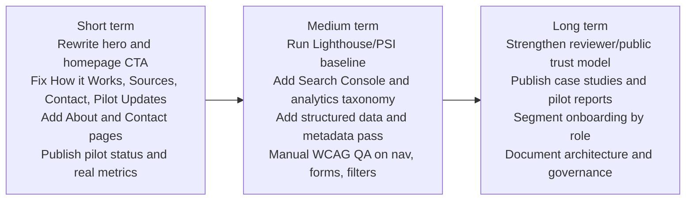

# Moral Trade Website Audit and Improvement Report

## Executive summary

Moral Trade already has a distinctive and serious core proposition. The public site clearly presents itself as a **prototype marketplace for voluntary moral trade**, with explicit boundaries around **no escrow or custody**, **manual evidence review**, **privacy-first matching**, and **safety rules against coercion, harassment, fraud, and political campaign offsets**. That is unusually strong conceptual discipline for an early-stage civic or moral-coordination product, and it is the site’s biggest asset. The public pages also show a thought-through verification model, including review states, challenge lanes, conflict rules, and reviewer quality metrics. citeturn26view6turn10view1turn10view2turn11view0turn11view2

The main problem is not lack of ideas; it is **translation**. For a new visitor, the site reads more like an internal operating manual than a product that quickly answers: **Who is this for? What can I do here today? Why should I trust it?** The homepage hero uses terms such as “pledge swaps,” “donation offsets,” “shared public-good commitments,” and “no escrow or custody claim,” which are precise but cognitively heavy. At the same time, the public marketplace currently shows **0 live offers**, **8 worked examples**, and **2 public profiles**, so the user is being asked to learn a novel concept before they can see real marketplace activity. citeturn26view6turn12view0

The highest-value improvements are therefore straightforward. First, simplify the homepage message and orient it around one concrete action. Second, fix the information architecture and routing issues: in the sampled pages, **“How it works” leads back to the homepage**, **“Sources” routes to Methodology**, and **“Contact”** and **“Pilot updates”** appear in footers as plain text rather than linked destinations. Third, add trust-building pages and signals that serious users expect: a linked About page, named operators or stewards, pilot status, contact route, and clearer privacy/compliance detail. Fourth, establish proper measurement: set up Lighthouse CI or PageSpeed Insights reporting, Search Console, and a minimal event taxonomy. citeturn27view2turn27view0turn26view6turn11view3turn11view4turn45view0turn57view3

My confidence is **high** on findings related to messaging, IA, trust, and conversion because they are directly observable from the public pages. Confidence is **medium** on visual-design and mobile-experience findings because this audit was largely text-rendered rather than screenshot-based. Confidence is **low** on exact Lighthouse and load-time numbers because a direct PSI/Lighthouse run for Moral Trade was not retrievable in this environment, so those numeric fields remain incomplete. citeturn45view0turn49view2

## Research basis and benchmark context

Per your requested source order, the research started with **Forethought**, then **amirrorclear.net**, then **moraltrade.org**. In this environment, Forethought’s first-party pages were not directly retrievable, so Forethought could only be used indirectly through Moral Trade’s own citations to “Forethought’s discussion of convergence, compromise, threats, blockers, and moral public goods.” Direct inspection of **amirrorclear.net** was limited but still useful: Toby Ord’s publicly accessible CV PDF on that domain lists both his doctoral thesis hosted on amirrorclear and his 2015 **“Moral Trade”** article in *Ethics*. Moral Trade itself explicitly says its product language draws on Toby Ord’s “Moral Trade” and Forethought’s essays. citeturn24view1turn10view1turn26view6

That conceptual lineage matters because it explains why the current site is more rigorous than most platform launches. The site is not a generic donation product. It is trying to operationalize **voluntary exchange under moral disagreement**, while keeping review, evidence, and coercion boundaries visible. The methodology page describes rule-based matching, privacy-gated wish disclosure, deterministic synthesis rather than AI interviewing, and a centralized-first but portable-later data model. The validation page adds explicit reviewer scope, proof uniqueness, appeal/challenge lanes, and a state taxonomy for evidence. citeturn10view1turn11view0

For benchmarking, I used public pages from **Giving What We Can**, **Open Collective**, **Kialo**, **Change.org**, and **Goteo**. They are not direct substitutes for Moral Trade, but they are relevant peers for adjacent functions: converting abstract moral intent into action, supporting public-good funding, making disagreement navigable, and structuring trust, transparency, and public participation. Giving What We Can is especially relevant because it translates a demanding moral idea into a clear public commitment with strong social proof; Open Collective is relevant for governance and financial transparency; Kialo is relevant for structured disagreement and explainability; Change.org is a useful cautionary case for JS-heavy friction; and Goteo is relevant for commons-oriented crowdfunding and open-source governance. citeturn37view0turn40view0turn39view0turn39view1turn41search0

## Current-state assessment

| Dimension | Current state on Moral Trade | Prioritized recommendations | Effort | Impact |
|---|---|---|---|---|
| Site purpose and value proposition clarity | The homepage headline is “Cooperate across moral disagreement,” followed by a dense subhead describing “pledge swaps, donation offsets, and shared public-good commitments” with “explicit terms, evidence review, and no escrow or custody claim.” The product is philosophically precise, but the language is advanced and requires prior context. The site also states that it is a “prototype marketplace” and repeatedly emphasizes what it is **not**. citeturn26view6turn10view1turn11view1 | **Short term:** rewrite the hero around user action, not theory. **Medium term:** add a one-screen explainer with “What it is / What it is not / Who it is for.” **Long term:** introduce audience-specific entry pages for donors, organizers, counterparties, and reviewers. | Low / Medium / High | High |
| Information architecture and navigation | The top nav is sparse, but the footer grows into a dense pseudo-sitemap. In the sampled pages, **How it works** routed to the homepage, **Sources** routed to Methodology, while **Contact** and **Pilot updates** appeared as plain text rather than linked destinations. Sign-up and login expose a richer mega-menu than the public pages, creating inconsistent navigation models. citeturn27view2turn27view0turn26view6turn13view2turn13view3 | **Short term:** create real destinations for How it Works, Sources, Contact, and Pilot Updates; remove any dead labels. **Medium term:** collapse IA into four clear buckets: Understand, Explore, Join, Trust. **Long term:** add breadcrumbing and route-level summaries for every concept page. | Low / Medium / Medium | High |
| Content quality, tone, and messaging | The content is careful, serious, and unusually explicit about safety, manual review, privacy gates, reviewer scope, and evidence claims. That rigor is a strength. The weakness is tone balance: the site often foregrounds disclaimers and institutional caveats before human benefit or concrete use cases. The examples help, but they are still framed as worked examples rather than “how this helps you.” citeturn10view2turn11view0turn11view1turn29view0turn56view0 | **Short term:** shift page-intro copy from disclaimers-first to value-first, with disclaimers compactly below. **Medium term:** add plain-English sidebars and glossary treatments for “pledge swap,” “offset,” “threshold,” “manual review,” and “public good.” **Long term:** add founder/operator notes, pilot stories, and “why someone would actually do this” content. | Low / Medium / Medium | High |
| Visual design, branding, and imagery | In the text-rendered capture, Moral Trade appears functional and text-heavy, with limited visible emotional/brand reinforcement. By contrast, Giving What We Can uses a strong hero, press logos, calculators, impact numbers, and many member photos, while Open Collective segments users visually and foregrounds governance and impact by the numbers. Exact color/contrast and imagery quality could not be fully verified from text-only capture, but the information density suggests the site would benefit from stronger hierarchy and richer visual explanation. citeturn26view6turn37view0turn40view0 | **Short term:** add one diagram or illustrated flow near the hero. **Medium term:** standardize page headers, section spacing, and trust badges. **Long term:** build a brand system with consistent iconography for examples, verification states, and privacy stages. | Medium / Medium / High | Medium / High |
| Mobile responsiveness and performance | Numeric PSI/Lighthouse results for Moral Trade were not retrievable here, but several pages show a visible loading shell — “Loading Moral Trade. Opening the requested workflow.” — before content, including the homepage, cohort, MPGF, and wish-registry flows. That suggests hydration or client-side rendering overhead, which can degrade perceived performance on slower devices. Google’s PSI/Lighthouse documentation recommends evaluating LCP, INP, CLS, TBT/TTI-related lab diagnostics, and category scores across mobile and desktop. citeturn0view0turn10view0turn13view0turn13view5turn13view6turn45view0turn49view2 | **Short term:** run PSI/Lighthouse on home, offers, cohort, signup, and the heaviest learn pages; capture mobile and desktop baselines. **Medium term:** reduce JS needed for first content, server-render key copy, and preload only critical assets. **Long term:** add Lighthouse CI in deployment and enforce budgets for LCP, JS payload, and CLS. | Medium / Medium / Medium | High |
| Accessibility | Positive baseline: the sampled pages expose a **“Skip to main content”** link, which aligns with WCAG’s bypass-blocks expectations. Risks and confirmed issues remain: misleading routes for “How it works” and “Sources,” unlinked “Contact” and “Pilot updates,” and JS-dependent loading shells can undermine predictability and robustness. Login showed no visible password-recovery path in sampled content. WCAG 2.1 AA emphasizes bypass blocks, clear titles, link purpose, consistent navigation, labels/instructions, and robust name-role-value semantics. citeturn0view0turn27view2turn27view0turn26view6turn28view3turn28view5turn57view0 | **Short term:** fix misleading destinations, add real support links, and add password recovery. **Medium term:** perform manual keyboard and screen-reader QA on nav, forms, filters, and evidence workflows; verify labels, focus order, error handling, and contrast. **Long term:** institutionalize WCAG 2.1 AA checks in QA and publish an accessibility statement. | Low / Medium / Medium | High |
| SEO | The page titles captured are generally descriptive, such as “Validation and evidence | Moral Trade,” “Privacy | Moral Trade,” and named example pages, which is a good start. However, route confusion weakens crawl clarity, and no structured-data implementation, sitemap behavior, canonical strategy, or metadata detail was visible from the sampled render. Google Search Central recommends clear title links, helpful snippets/meta descriptions, structured data where relevant, canonicalization, and mobile-first readiness. citeturn10view3turn10view7turn29view0turn58view0turn58view1turn58view2turn58view3 | **Short term:** hand-author titles and meta descriptions for home, offers, examples, cohort, MPGF, methodology, and safety. **Medium term:** add Organization, Breadcrumb, and FAQ structured data where appropriate; ensure canonical tags and XML sitemap coverage. **Long term:** connect Search Console and iterate from query data, crawl reports, and internal-link audits. | Low / Medium / Medium | Medium / High |
| Conversion paths and calls to action | CTAs exist, but they compete. The homepage offers cohort join, browse examples, create wish preview, invite one counterparty, public-good participation, and safety review. The browse page offers create account/sign in, while the public marketplace has zero live offers. The cohort page is probably the clearest current pathway, but that is not made dominant enough across the site. citeturn26view6turn12view0turn13view0 | **Short term:** pick one primary CTA for the current stage: “Join the pilot” or “See how a trade works.” **Medium term:** separate first-time visitor CTAs from member CTAs. **Long term:** personalize CTA paths by role and source, with explicit onboarding funnels for organizers, donors, and counterparties. | Low / Medium / High | High |
| Trust signals | Moral Trade has serious legal and safety framing, a Privacy page, Terms, Safety, Validation, and explicit Stripe mention. But trust signals around the people/company behind the product are weak in the sampled public pages. There is no clear linked About page, no obvious team page, no visible contact workflow, and the public people directory is extremely thin, with “No public bio has been added yet” for visible profiles. Giving What We Can, by contrast, foregrounds About, Team, Governance, community counts, media logos, and featured members. citeturn11view3turn11view4turn13view1turn26view6turn37view0 | **Short term:** publish linked About, Contact, and Pilot Updates pages. **Medium term:** add named stewards, governance, review policy owners, and reviewer standards. **Long term:** publish pilot metrics, case studies, incident handling summary, and independent advisor/reviewer disclosures. | Low / Medium / Medium | High |
| Technical stack and maintainability | The exact stack is unspecified in public pages. Still, repeated loading shells and route behavior suggest a JS-heavy or hydrated architecture. Repeated footer blocks and route mismatches suggest content duplication and routing debt. The methodology page says the current implementation is centralized, with export/import/schema endpoints envisioned for portability later. citeturn10view1turn10view0turn13view5turn13view6 | **Short term:** audit route map and content ownership; fix miswired links. **Medium term:** centralize shared navigation/footer content and introduce route tests. **Long term:** document architecture, content model, and public API/schema approach so the product is maintainable as concepts proliferate. | Medium / Medium / High | Medium / High |
| Analytics and measurement | In the sampled Privacy and Terms text, **cookie**, **analytics**, and **Google** references were not found. That does **not** prove there is no analytics stack, but it means analytics and tracking are not transparently described in the public policies captured here. Google’s documentation points to Search Console and analytics data as core parts of SEO and performance measurement, while PSI/Lighthouse provide page-quality diagnostics. citeturn26view0turn26view1turn26view2turn26view3turn26view4turn26view5turn57view3turn45view0 | **Short term:** define a minimal measurement plan before scaling traffic: hero CTA click, example-detail visits, cohort join submissions, signup starts/completions, offer creation starts/completions. **Medium term:** connect Search Console, privacy-compatible product analytics, and Lighthouse CI. **Long term:** add funnel dashboards, cohort retention views, and content-performance reporting. | Low / Medium / Medium | High |
| Legal and compliance | The Privacy page explains public/private fields, source connections, portability, Stripe payment data, and notification records; the Terms page explains participant responsibilities, payment language, and review boundaries. That is a strong start. However, in the captured policy text, cookies/analytics, retention periods, privacy contact details, and user-rights workflows were not evident. Exact legal sufficiency depends on actual processing and jurisdictions, which are unspecified. citeturn11view3turn11view4 | **Short term:** add a privacy contact route and a concise “what data we collect / why / processors / retention” summary. **Medium term:** document cookies and analytics if used, and describe deletion/export rights and review escalation paths. **Long term:** maintain jurisdiction-aware privacy and terms updates as payments, verification, or reviewer roles mature. | Low / Medium / Medium | Medium / High |

## Measurement and evidence snapshot

### Product and marketplace snapshot

| Observable indicator | Current state | Evidence | Why it matters |
|---|---|---|---|
| Public marketplace liquidity | **0 live offers** | Home and browse pages both show 0 live offers. citeturn26view6turn12view0 | The product currently asks users to trust a concept before they can see live demand. |
| Learning content volume | **8 worked examples** | Home and browse pages show 8 worked examples. citeturn26view6turn12view0 | Good for education, but it reinforces a “prototype/manual” feel. |
| Social proof | **2 public profiles** | Homepage counts 2 public profiles. People directory shows thin public profiles with no bios. citeturn26view6turn13view1 | Low visible trust density. |
| Review institution | Explicit manual review states, appeals, and reviewer scope | Validation page details evidence schema, conflict rules, appeals, and reviewer metrics. citeturn11view0 | This is a differentiator worth surfacing earlier in the UX. |
| Privacy/payments posture | Privacy and terms exist; Stripe is named; no custody/escrow claim is repeated | Privacy and Terms pages; repeated disclaimers on many pages. citeturn11view3turn11view4turn29view0 | Serious users may appreciate this, but repeated negative framing can reduce conversion if it dominates the message. |

### Performance and accessibility snapshot

| Requested metric or check | Result in this audit | Confidence | Notes |
|---|---|---|---|
| Lighthouse Performance score | **Not retrieved** | Low | A direct PSI/Lighthouse run for Moral Trade was not obtainable in this environment. Google documents PSI/Lighthouse as the right source of lab scores and CrUX-backed user metrics. citeturn45view0turn49view2 |
| Lighthouse Accessibility score | **Not retrieved** | Low | Same limitation as above. citeturn45view0turn49view2 |
| Lighthouse SEO score | **Not retrieved** | Low | Same limitation as above. citeturn45view0turn49view2 |
| Load-time metric values such as LCP, INP, CLS | **Not retrieved** | Low | PSI documents these as the right metrics, but no live run was captured here. citeturn45view0 |
| Perceived-load evidence | Loading shell present on multiple pages | Medium | “Loading Moral Trade. Opening the requested workflow.” appears on core public pages. citeturn0view0turn10view0turn13view0turn13view5turn13view6 |
| Confirmed accessibility-positive pattern | Skip link present | High | “Skip to main content” appears in sampled pages. citeturn0view0 |
| Confirmed accessibility/predictability issue | Misleading route: “How it works” returns home | High | Route behavior observed directly. citeturn27view2 |
| Confirmed accessibility/predictability issue | “Sources” routes to Methodology | High | Route behavior observed directly. citeturn27view0 |
| Confirmed support-discoverability issue | “Contact” and “Pilot updates” appear unlinked in footer | High | Observed on sampled pages. citeturn26view6 |
| Confirmed account-flow gap | No visible “Forgot password” in sampled login content | Medium | Not found in captured login lines. citeturn28view3turn28view5 |

The practical implication is simple: **do not optimize blindly**. Capture a real baseline with PageSpeed Insights or Lighthouse CI on home, offers, example detail, cohort, signup, and login before starting performance work. Google’s own docs are explicit that PSI combines **lab diagnostics** and **CrUX field data**, and that pages may have page-level or origin-level field data depending on sample volume. citeturn45view0

## Competitor benchmarking

| Platform | Why it is relevant | Key features | UX lessons for Moral Trade |
|---|---|---|---|
| **Giving What We Can** | Closest thematic peer for turning a moral idea into a concrete public commitment | Clear hero (“Turn your income into outcomes”), immediate explanation, media logos, community counts, calculator, member stories, About/Team/Governance, strong donation and pledge CTAs. citeturn37view0 | Moral Trade should borrow the **translation layer**: explain immediately, quantify progress, show who is involved, and make the next action obvious. |
| **Open Collective** | Strong peer for public-good funding and trust through operational transparency | Segments users by legal/incorporated status, foregrounds governance by Open Finance Consortium, shows impact numbers, and keeps Privacy/Terms/Docs visible. citeturn40view0 | Moral Trade should segment by user type and foreground who governs review, evidence, and public-good allocation. |
| **Kialo** | Strong peer for navigating disagreement with structure | Search, topic categories, tour, visible counts of debates/claims/votes, clear log-in/sign-up affordances, and explicit privacy/help/status links. citeturn39view0 | Moral Trade should make **exploration** easier: topic discovery, glossary, tour, and visible product statistics. |
| **Change.org** | Useful cautionary peer for civic participation flows | Official site capture showed a JavaScript verification gate rather than immediate content. citeturn39view1 | Moral Trade should avoid creating a similarly brittle first-touch experience through excessive JS dependency or gating too early. |
| **Goteo** | Good peer for commons-oriented crowdfunding and open-source governance | Framed as open-source crowdfunding for projects that generate collective return and commons value; emphasizes openness, volunteering, transparency, API, and match-funding. citeturn41search0 | Moral Trade should learn from Goteo’s framing of **collective return** and make “moral public goods” more concrete and less abstract. |

The benchmark pattern is consistent. The strongest peer sites do three things very well: they say **what the platform does in plain language**, they show **evidence that real people already use it**, and they make the **first action** unmistakable. Moral Trade has more conceptual depth than any of them, but it currently lags them on those three fundamentals. citeturn37view0turn40view0turn39view0turn41search0

## Example rewrites and implementation snippets

The homepage should stop making the user decode the product in one dense sentence. A better version would lead with the job-to-be-done, then compress caveats into a short trust line.

**Recommended hero microcopy**

> **Make clear, voluntary deals across moral disagreement**  
> Create a pledge swap, donation offset, or public-good commitment with written terms, evidence rules, and manual review before anyone relies on it.  
> **Primary CTA:** See how it works  
> **Secondary CTA:** Join the pilot  
> **Trust line:** Prototype only. No custody or escrow. External payments and evidence review.

That copy keeps the site’s actual posture — prototype, no escrow, manual review — while reducing jargon and moving the benefit first. That aligns with what users already see in the current safety, methodology, and terms pages, but expresses it more directly. citeturn10view1turn10view2turn11view4

```html
<section class="hero">
  <p class="eyebrow">Private pilot</p>
  <h1>Make clear, voluntary deals across moral disagreement</h1>
  <p>
    Create a pledge swap, donation offset, or public-good commitment with
    written terms, evidence rules, and manual review before anyone relies on it.
  </p>
  <div class="cta-row">
    <a class="btn btn-primary" href="/how-it-works">See how it works</a>
    <a class="btn btn-secondary" href="/cohort">Join the pilot</a>
  </div>
  <p class="trust-note">
    Prototype only. No custody or escrow. External payments and evidence review.
  </p>
</section>
```

```css
.hero { max-width: 72rem; margin: 0 auto; padding: 4rem 1.25rem; }
.eyebrow { text-transform: uppercase; letter-spacing: 0.08em; font-size: 0.85rem; }
.hero h1 { max-width: 18ch; line-height: 1.05; margin: 0.5rem 0 1rem; }
.hero p { max-width: 60ch; }
.cta-row { display: flex; gap: 0.75rem; flex-wrap: wrap; margin-top: 1.25rem; }
.trust-note { font-size: 0.95rem; opacity: 0.85; margin-top: 1rem; }
```

The empty states also need to be more honest and more useful. Right now the public marketplace truth is “0 live offers.” That should be turned into a guided action rather than left as a weak vacuum. citeturn12view0turn26view6

**Recommended empty-state microcopy**

> **No live offers yet**  
> Moral Trade is in a pilot phase. Start by reviewing a worked example, cloning one as a draft, or joining the founding cohort if you want to test a real trade with support.

For SEO and trust, add minimal structured data and identity markup. Google recommends structured data for eligible experiences and descriptive title/snippet handling, though it does not guarantee specific result treatments. citeturn58view0turn58view1turn58view2

```html
<script type="application/ld+json">
{
  "@context": "https://schema.org",
  "@type": "Organization",
  "name": "Moral Trade",
  "url": "https://www.moraltrade.org/",
  "description": "Prototype marketplace for voluntary moral trade, donation offsets, and shared public-good coordination.",
  "sameAs": [],
  "contactPoint": [{
    "@type": "ContactPoint",
    "contactType": "support",
    "url": "https://www.moraltrade.org/contact"
  }]
}
</script>
```

## Priority roadmap



In the **short term**, the goal is to remove avoidable friction. Fix navigation and route integrity first, simplify the hero, make one CTA dominant, and add minimal trust pages. These are low-effort changes with disproportionately high impact because they improve nearly every user’s first interaction. The best immediate benchmark is Giving What We Can’s clarity and Open Collective’s governance visibility. citeturn37view0turn40view0turn27view2turn27view0turn26view6

In the **medium term**, shift from rhetoric to instrumentation. Run PSI/Lighthouse baselines, connect Search Console, add metadata and structured data, and perform proper keyboard/screen-reader testing against WCAG 2.1 AA criteria such as bypass blocks, page titles, link purpose, consistent navigation, labels/instructions, and robust semantics. citeturn45view0turn57view0turn57view3turn58view0turn58view1turn58view2turn58view3

In the **long term**, the strategic opportunity is to turn Moral Trade’s unusual conceptual rigor into a durable trust moat. That means naming the stewards, publishing pilot outcomes, making reviewer institutions legible, and showing the product’s real-world successes rather than only its theoretical architecture. Right now the concept is more mature than the public trust presentation. That gap should close. citeturn11view0turn13view1turn26view6

## Open questions and limitations

Several things remain genuinely unspecified. The **exact technical stack** is not publicly declared in the sampled pages. The **true target audience hierarchy** is not explicit: the site references organizers, early users, effective givers, founders, and serious counterparties, but does not clearly rank them. Exact **jurisdictional privacy/compliance requirements** cannot be assessed from public text alone without knowing operator location, user geographies, and actual cookie/analytics/payment configurations. citeturn13view0turn10view1turn11view3turn11view4

Two source-order limitations also matter. First, Forethought’s primary pages were not directly retrievable here, so I could only use Moral Trade’s own references to Forethought rather than first-party Forethought page captures. Second, amirrorclear.net was only partly accessible: Toby Ord’s CV PDF was readable, while the doctoral thesis PDF request returned unauthorized. That means the conceptual background section is reliable at a high level but not a substitute for a full philosophical literature review. citeturn24view1turn10view1turn26view6

Finally, the report does **not** include numeric Lighthouse scores or measured load times for Moral Trade because a direct PSI/Lighthouse run on the target URL could not be retrieved in this environment. The performance recommendations are therefore based on observable UX signals plus Google’s official measurement guidance, not on captured live scores. citeturn45view0turn49view2

## Sources and tools used

This report was grounded in direct public-page inspection of **Moral Trade**, limited direct inspection of **amirrorclear.net** via Toby Ord’s CV PDF, and benchmark/reference material from **Giving What We Can**, **Open Collective**, **Kialo**, **Change.org**, **Goteo**, **W3C WCAG 2.1**, **Google PageSpeed Insights documentation**, and **Google Search Central**. Citations throughout this report link back to those sources. citeturn24view1turn26view6turn10view1turn11view0turn11view3turn11view4turn37view0turn40view0turn39view0turn39view1turn41search0turn57view0turn45view0turn57view3turn58view0turn58view1turn58view2turn58view3